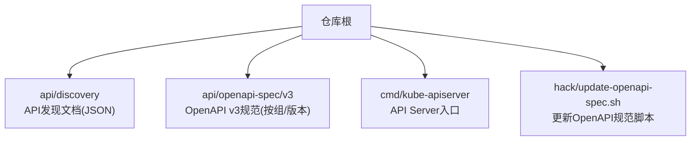
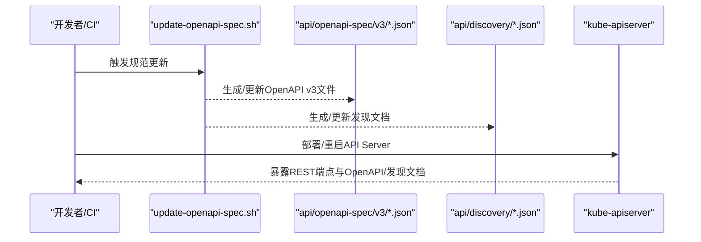
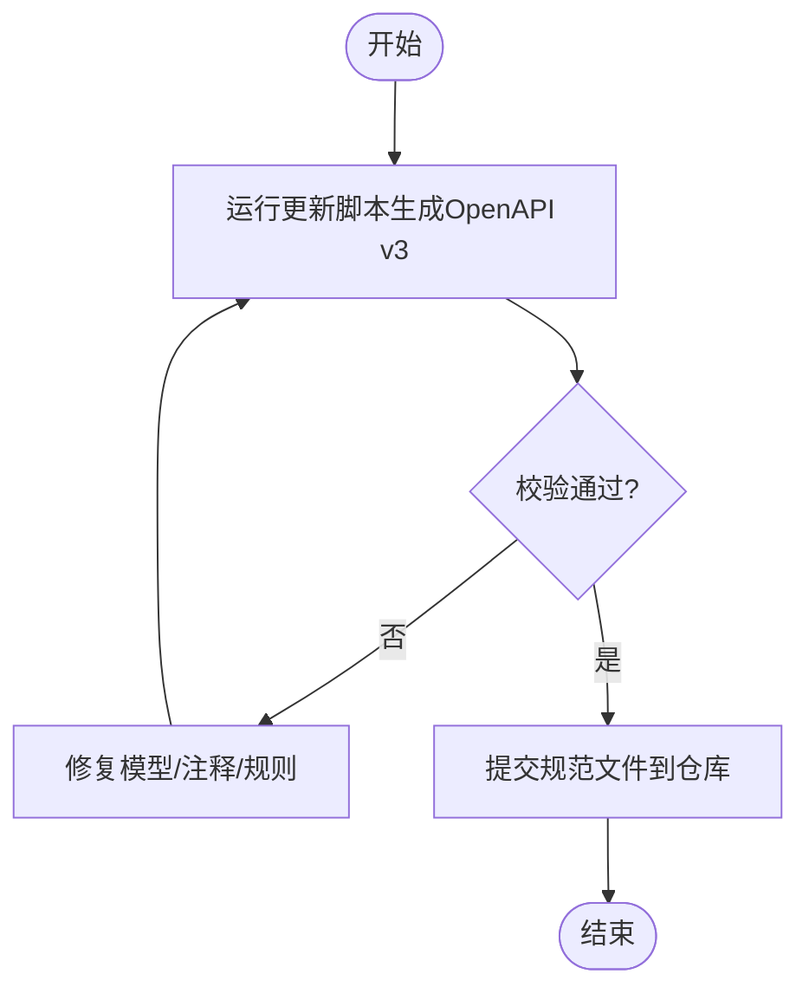
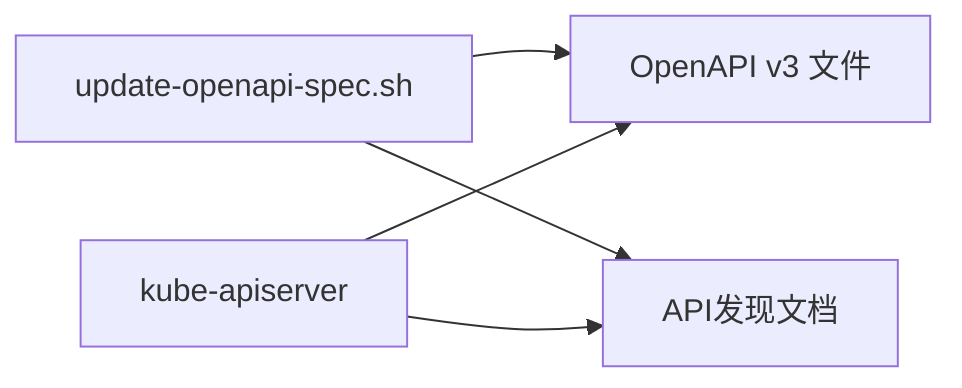

# API参考

<cite>
**本文引用的文件**   
- [README.md](file://README.md)
- [api/openapi-spec/README.md](file://api/openapi-spec/README.md)
- [cmd/kube-apiserver/apiserver.go](file://cmd/kube-apiserver/apiserver.go)
- [hack/update-openapi-spec.sh](file://hack/update-openapi-spec.sh)
</cite>

## 目录
1. [简介](#简介)
2. [项目结构](#项目结构)
3. [核心组件](#核心组件)
4. [架构总览](#架构总览)
5. [详细组件分析](#详细组件分析)
6. [依赖关系分析](#依赖关系分析)
7. [性能与限流、缓存配置](#性能与限流缓存配置)
8. [故障排查指南](#故障排查指南)
9. [结论](#结论)
10. [附录](#附录)

## 简介
本参考文档面向Kubernetes API的设计原则、版本管理策略、OpenAPI规范生成与维护机制，以及REST/gRPC接口、SDK客户端、兼容性保证、测试调试方法与性能优化等主题。文档内容基于仓库中已存在的API定义、发现文档与生成脚本进行梳理，帮助读者快速理解并正确使用Kubernetes API。

## 项目结构
与API相关的核心位置包括：
- api/discovery：聚合的API发现文档（JSON），用于客户端动态发现可用API组与版本。
- api/openapi-spec：按组/版本划分的OpenAPI v3规范文件，描述资源模型与操作。
- cmd/kube-apiserver：API Server入口程序，负责启动并对外提供REST服务。
- hack/update-openapi-spec.sh：更新OpenAPI规范的构建脚本。

**图示来源** 
- [cmd/kube-apiserver/apiserver.go:1-37](file://cmd/kube-apiserver/apiserver.go#L1-L37)
- [hack/update-openapi-spec.sh](file://hack/update-openapi-spec.sh)

**章节来源**
- [README.md:1-101](file://README.md#L1-L101)

## 核心组件
- API Server进程：作为集群控制面的核心，统一暴露REST API，处理认证、鉴权、准入、存储持久化等流程。
- OpenAPI规范：以v3格式发布，包含资源模型、路径、参数、响应与扩展字段，供工具链与客户端使用。
- API发现文档：提供聚合后的API组/版本清单，便于客户端动态发现能力。
- 规范更新脚本：在构建或发布流程中生成/校验OpenAPI规范文件。

**章节来源**
- [cmd/kube-apiserver/apiserver.go:1-37](file://cmd/kube-apiserver/apiserver.go#L1-L37)
- [api/openapi-spec/README.md:1-89](file://api/openapi-spec/README.md#L1-L89)

## 架构总览
下图展示了API Server与OpenAPI规范、发现文档之间的关系，以及规范生成的基本流程。

**图示来源** 
- [hack/update-openapi-spec.sh](file://hack/update-openapi-spec.sh)
- [cmd/kube-apiserver/apiserver.go:1-37](file://cmd/kube-apiserver/apiserver.go#L1-L37)

## 详细组件分析

### REST API设计原则与版本管理
- 设计原则
  - 资源导向：通过标准HTTP动词对资源进行CRUD操作，支持列表、过滤、分页、子资源与代理连接等。
  - 语义化版本：API组采用“group/version”形式，version支持稳定版与alpha/beta预览版，遵循向后兼容策略。
  - 可扩展性：通过自定义资源(CRD)与聚合API扩展新组与版本。
- 版本管理策略
  - 稳定版(v1)：变更需满足向后兼容，新增字段为可选，删除字段需弃用周期。
  - 预览版(v1alpha1/v1beta1)：允许破坏性变更，但会给出弃用提示与迁移窗口。
  - 生命周期：新增→Beta→Stable→Deprecated→移除，配合弃用头与日志告警。

**章节来源**
- [api/openapi-spec/README.md:1-89](file://api/openapi-spec/README.md#L1-L89)

### OpenAPI规范生成与维护机制
- 生成目标
  - 输出OpenAPI v3 JSON文件，覆盖所有API组与版本，包含资源模型、路径、参数、响应与错误码。
- 维护流程
  - 通过构建脚本更新规范文件，确保与代码一致；CI中可加入校验步骤防止漂移。
- 供应商扩展
  - 使用x-kubernetes-*扩展标注资源关联、动作、列表映射键、Patch策略等，增强工具链可用性。

**图示来源** 
- [hack/update-openapi-spec.sh](file://hack/update-openapi-spec.sh)
- [api/openapi-spec/README.md:1-89](file://api/openapi-spec/README.md#L1-L89)

**章节来源**
- [api/openapi-spec/README.md:1-89](file://api/openapi-spec/README.md#L1-L89)
- [hack/update-openapi-spec.sh](file://hack/update-openapi-spec.sh)

### gRPC API与服务发现
- 说明：当前仓库未包含gRPC接口定义与服务发现的具体实现文件。若需了解gRPC相关能力，请参考官方文档与外部组件（如内部API Server内部通信）的实现。

[本节不直接分析具体源文件，故无“章节来源”]

### SDK客户端库与多语言支持
- 说明：仓库中包含Go生态的staging模块（如client-go、apimachinery等），但未在本节直接引用其源码。多语言SDK通常由社区维护并与OpenAPI/protobuf绑定生成。建议结合官方文档与各语言SDK仓库获取使用方式。

[本节不直接分析具体源文件，故无“章节来源”]

### 核心API端点参考（方法、参数、响应、错误码）
- 说明：完整端点参考应以api/openapi-spec下的OpenAPI v3文件为准。每个组/版本的JSON文件描述了paths、schemas、responses与错误码。请根据目标组/版本选择对应文件查阅。

[本节不直接分析具体源文件，故无“章节来源”]

### 向后兼容性与迁移指南
- 兼容性保证
  - 稳定版API遵循向后兼容：新增字段默认值与可选；删除字段需弃用周期；行为变更不得破坏现有客户端。
- 迁移建议
  - 关注弃用告警与头部信息；逐步替换至新版本；利用OpenAPI与发现文档验证能力差异；在预发环境充分回归。

**章节来源**
- [api/openapi-spec/README.md:1-89](file://api/openapi-spec/README.md#L1-L89)

### API测试工具与调试方法
- 常用工具
  - kubectl：命令行客户端，适合端到端验证与日常调试。
  - curl/wget：直接访问REST端点，适合快速验证与抓包。
  - OpenAPI工具链：基于api/openapi-spec生成客户端、契约测试与文档站点。
- 调试要点
  - 检查API发现文档确认可用组/版本；核对请求路径、查询参数与Content-Type；查看响应状态码与错误体；必要时开启审计日志与指标采集。

[本节不直接分析具体源文件，故无“章节来源”]

## 依赖关系分析
- 组件耦合
  - kube-apiserver作为入口，依赖OpenAPI规范与发现文档提供服务能力。
  - 规范更新脚本与规范文件之间为单向依赖（脚本产出文件）。
- 外部依赖
  - 客户端与工具链依赖OpenAPI与发现文档进行类型生成与路由解析。

**图示来源** 
- [hack/update-openapi-spec.sh](file://hack/update-openapi-spec.sh)
- [cmd/kube-apiserver/apiserver.go:1-37](file://cmd/kube-apiserver/apiserver.go#L1-L37)

**章节来源**
- [cmd/kube-apiserver/apiserver.go:1-37](file://cmd/kube-apiserver/apiserver.go#L1-L37)

## 性能与限流、缓存配置
- 说明：API Server的性能、限流与缓存等运行时配置项通常在启动参数与组件配置中声明。由于本节未直接分析具体配置文件或源码，建议参考API Server的启动选项与官方文档进行调优。

[本节不直接分析具体源文件，故无“章节来源”]

## 故障排查指南
- 常见问题定位
  - 发现异常：优先检查API发现文档是否包含目标组/版本。
  - 模型不一致：对比OpenAPI v3文件与期望模型，确认是否存在扩展字段或版本差异。
  - 权限与准入：结合鉴权与准入插件日志定位拒绝原因。
- 辅助手段
  - 使用OpenAPI工具生成最小可复现请求；启用审计日志与指标；在预发环境回放生产流量。

[本节不直接分析具体源文件，故无“章节来源”]

## 结论
Kubernetes API以OpenAPI v3为核心契约，配合API发现文档与API Server统一暴露REST能力。通过严格的版本管理与兼容性策略，保障生态稳定演进。建议在开发过程中持续同步OpenAPI规范，结合自动化测试与契约校验提升质量与效率。

## 附录
- 快速导航
  - 阅读OpenAPI v3规范：进入api/openapi-spec/v3，按组/版本选择对应JSON文件。
  - 查看API发现文档：进入api/discovery，获取聚合后的API清单。
  - 了解API Server入口：参考cmd/kube-apiserver/apiserver.go。

**章节来源**
- [api/openapi-spec/README.md:1-89](file://api/openapi-spec/README.md#L1-L89)
- [cmd/kube-apiserver/apiserver.go:1-37](file://cmd/kube-apiserver/apiserver.go#L1-L37)