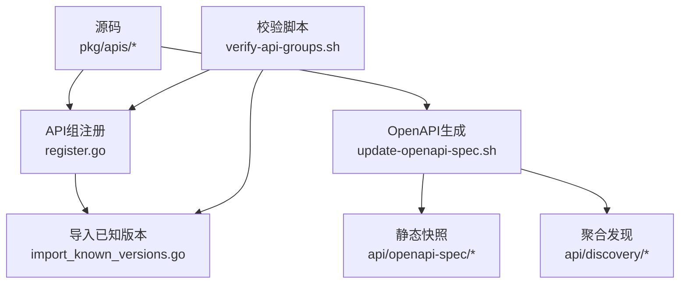
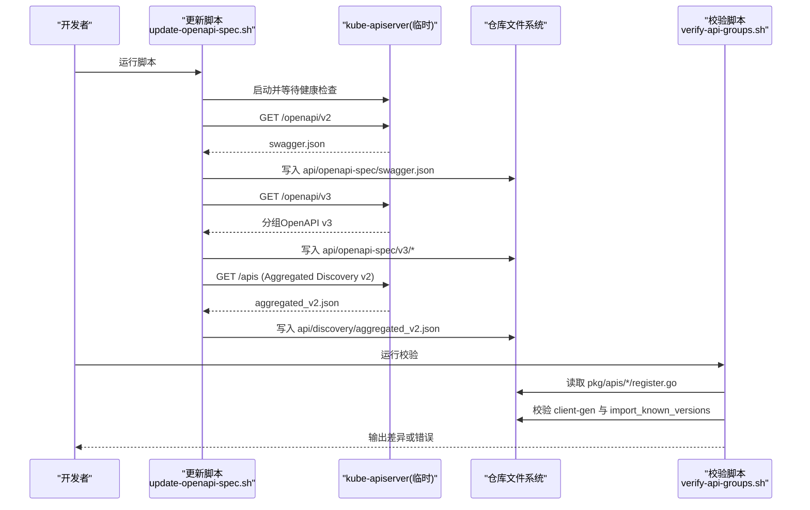
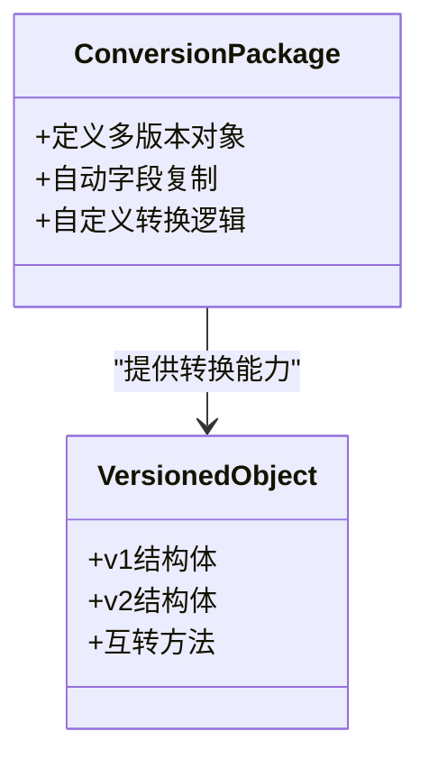
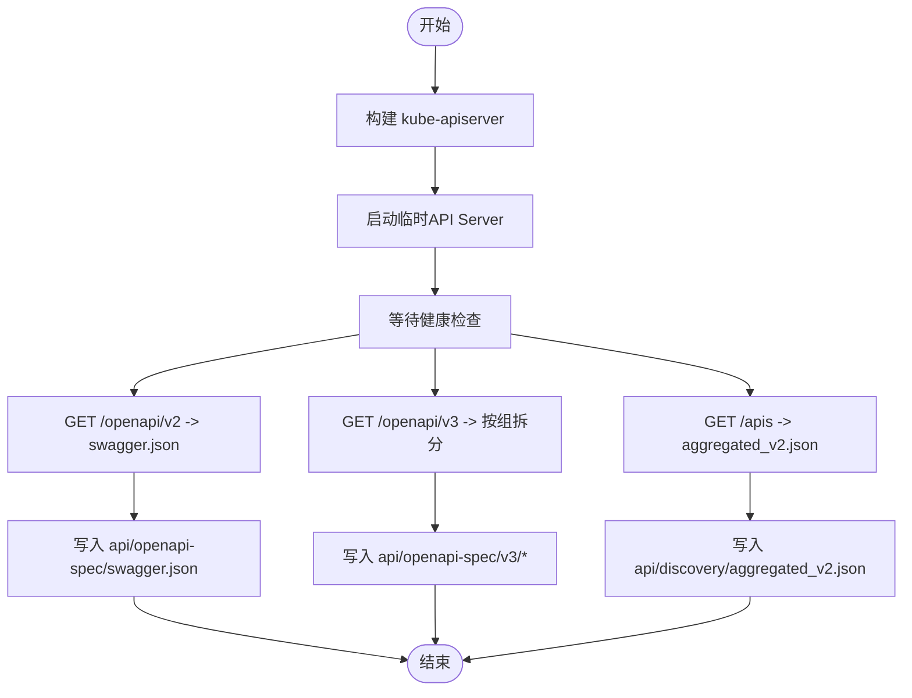
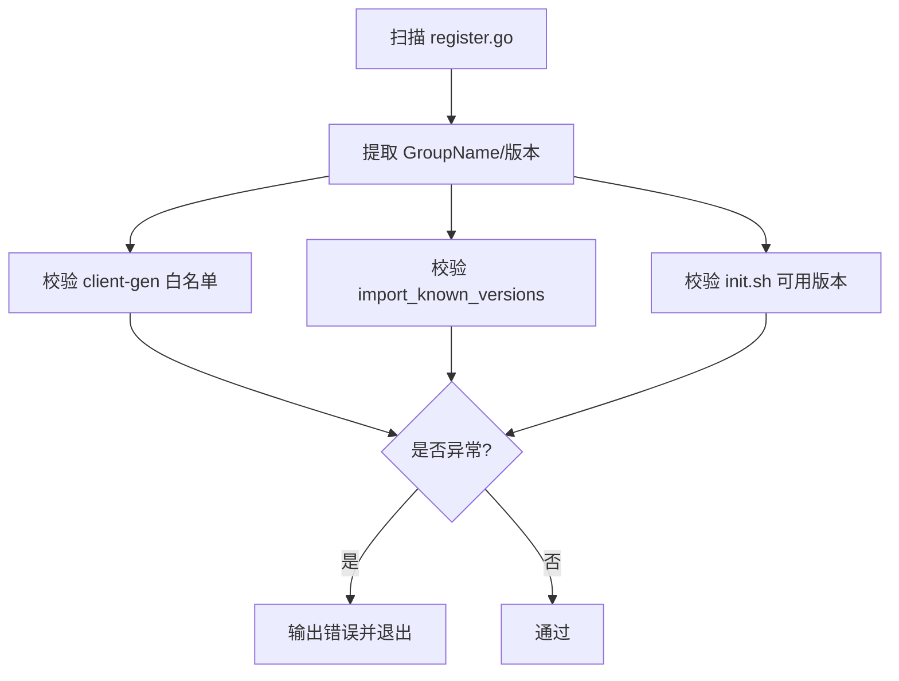
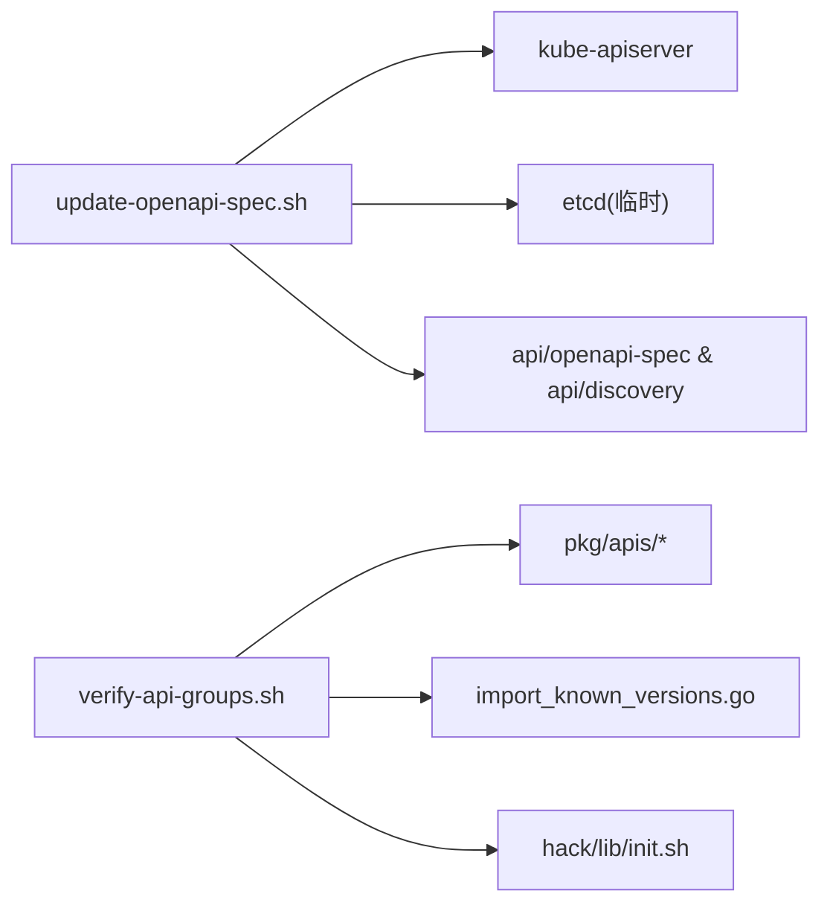

# API版本管理

<cite>
**本文引用的文件**   
- [staging/src/k8s.io/apimachinery/pkg/conversion/doc.go](file://staging/src/k8s.io/apimachinery/pkg/conversion/doc.go)
- [hack/update-openapi-spec.sh](file://hack/update-openapi-spec.sh)
- [hack/verify-api-groups.sh](file://hack/verify-api-groups.sh)
</cite>

## 目录
1. [简介](#简介)
2. [项目结构](#项目结构)
3. [核心组件](#核心组件)
4. [架构总览](#架构总览)
5. [详细组件分析](#详细组件分析)
6. [依赖关系分析](#依赖关系分析)
7. [性能考虑](#性能考虑)
8. [故障排查指南](#故障排查指南)
9. [结论](#结论)
10. [附录](#附录)

## 简介
本文件面向Kubernetes API版本管理机制，围绕以下目标展开：
- API版本策略、向后兼容性与弃用政策
- versioned对象的设计模式与转换机制
- OpenAPI规范的版本控制与自动生成流程
- API变更检测与兼容性验证机制
- 废弃通知与迁移时间线
- 开发者如何正确实现API版本化
- 客户端版本协商与服务发现机制

## 项目结构
与API版本管理直接相关的仓库结构与脚本如下：
- staging/src/k8s.io/apimachinery/pkg/conversion：提供Go对象的版本化与转换能力（文档入口）
- hack/update-openapi-spec.sh：启动本地API Server并拉取OpenAPI v2/v3与聚合发现数据，生成到api/openapi-spec与api/discovery
- hack/verify-api-groups.sh：校验API组注册、client-gen配置与import_known_versions一致性

图表来源
- [hack/update-openapi-spec.sh:72-147](file://hack/update-openapi-spec.sh#L72-L147)
- [hack/verify-api-groups.sh:27-60](file://hack/verify-api-groups.sh#L27-L60)
- [hack/verify-api-groups.sh:88-116](file://hack/verify-api-groups.sh#L88-L116)

章节来源
- [hack/update-openapi-spec.sh:1-152](file://hack/update-openapi-spec.sh#L1-L152)
- [hack/verify-api-groups.sh:1-126](file://hack/verify-api-groups.sh#L1-L126)

## 核心组件
- 对象版本化与转换框架
  - 通过conversion包为同一对象定义多个版本，并提供自动字段复制与自定义转换逻辑的扩展点。
- OpenAPI规范生成与快照
  - 通过脚本拉起最小化API Server，拉取openapi/v2与openapi/v3以及聚合发现数据，写入仓库静态资源。
- API组与版本注册校验
  - 扫描pkg/apis下register.go，确保GroupName、client-gen白名单、import_known_versions与init.sh中可用版本一致。

章节来源
- [staging/src/k8s.io/apimachinery/pkg/conversion/doc.go:17-24](file://staging/src/k8s.io/apimachinery/pkg/conversion/doc.go#L17-L24)
- [hack/update-openapi-spec.sh:72-147](file://hack/update-openapi-spec.sh#L72-L147)
- [hack/verify-api-groups.sh:27-60](file://hack/verify-api-groups.sh#L27-L60)
- [hack/verify-api-groups.sh:88-116](file://hack/verify-api-groups.sh#L88-L116)

## 架构总览
下图展示了从源码到OpenAPI快照与发现数据的端到端流程，以及API组注册的校验闭环。

图表来源
- [hack/update-openapi-spec.sh:72-147](file://hack/update-openapi-spec.sh#L72-L147)
- [hack/verify-api-groups.sh:27-60](file://hack/verify-api-groups.sh#L27-L60)
- [hack/verify-api-groups.sh:88-116](file://hack/verify-api-groups.sh#L88-L116)

## 详细组件分析

### 组件A：对象版本化与转换（conversion）
- 设计要点
  - 支持在同一内存模型上维护多版本类型；未变更字段自动复制，变更字段由自定义转换函数处理。
  - 便于在存储格式与外部API之间解耦，降低升级成本。
- 适用场景
  - 新增可选字段、重命名字段、调整嵌套结构等演进式变更。
- 最佳实践
  - 保持默认值语义稳定；避免破坏性删除；对必填字段谨慎引入。
  - 使用转换框架而非手动序列化/反序列化，减少遗漏风险。

图表来源
- [staging/src/k8s.io/apimachinery/pkg/conversion/doc.go:17-24](file://staging/src/k8s.io/apimachinery/pkg/conversion/doc.go#L17-L24)

章节来源
- [staging/src/k8s.io/apimachinery/pkg/conversion/doc.go:17-24](file://staging/src/k8s.io/apimachinery/pkg/conversion/doc.go#L17-L24)

### 组件B：OpenAPI规范自动生成与快照
- 流程说明
  - 构建并启动最小化API Server，启用Alpha/Beta特性以覆盖全部API。
  - 拉取openapi/v2与openapi/v3，按组拆分并写入api/openapi-spec。
  - 拉取聚合发现数据至api/discovery，供客户端快速发现可用API组与版本。
- 关键开关
  - 通过环境变量控制严格移除API的处理策略，影响是否包含即将移除的Alpha API。
- 产出物
  - api/openapi-spec/swagger.json（OpenAPI v2）
  - api/openapi-spec/v3/{group}_openapi.json（OpenAPI v3）
  - api/discovery/aggregated_v2.json（聚合发现）

图表来源
- [hack/update-openapi-spec.sh:72-147](file://hack/update-openapi-spec.sh#L72-L147)

章节来源
- [hack/update-openapi-spec.sh:1-152](file://hack/update-openapi-spec.sh#L1-L152)

### 组件C：API组与版本注册校验
- 功能概述
  - 扫描pkg/apis下的register.go，提取GroupName与版本信息。
  - 校验client-gen白名单、import_known_versions包含所有应安装的版本包。
  - 校验hack/lib/init.sh中的可用版本列表与实际版本一致。
- 典型问题定位
  - 缺少GroupName常量
  - 未在client-gen中添加对应组
  - import_known_versions缺失install导入
  - init.sh未声明某GroupVersion

图表来源
- [hack/verify-api-groups.sh:27-60](file://hack/verify-api-groups.sh#L27-L60)
- [hack/verify-api-groups.sh:88-116](file://hack/verify-api-groups.sh#L88-L116)

章节来源
- [hack/verify-api-groups.sh:1-126](file://hack/verify-api-groups.sh#L1-L126)

## 依赖关系分析
- 组件耦合
  - update-openapi-spec.sh依赖kube-apiserver可执行产物与etcd环境，负责将运行时暴露的OpenAPI与发现数据固化为仓库快照。
  - verify-api-groups.sh依赖源码树结构约定（register.go、import_known_versions.go、init.sh），用于保证API组注册与代码生成的一致性。
- 外部依赖
  - jq用于JSON处理；curl用于HTTP拉取；openssl用于生成ServiceAccount密钥（按需）。
- 潜在循环依赖
  - 无直接循环；但需保证脚本与源码同步更新，否则校验会失败。

图表来源
- [hack/update-openapi-spec.sh:72-147](file://hack/update-openapi-spec.sh#L72-L147)
- [hack/verify-api-groups.sh:27-60](file://hack/verify-api-groups.sh#L27-L60)
- [hack/verify-api-groups.sh:88-116](file://hack/verify-api-groups.sh#L88-L116)

章节来源
- [hack/update-openapi-spec.sh:1-152](file://hack/update-openapi-spec.sh#L1-L152)
- [hack/verify-api-groups.sh:1-126](file://hack/verify-api-groups.sh#L1-L126)

## 性能考虑
- 生成快照时仅启动最小化API Server，避免全量控制器与插件开销，缩短生成时间。
- 拉取OpenAPI与发现数据采用并行路径（v2与v3分别请求），减少整体耗时。
- 建议仅在提交前或CI中触发生成与校验，避免频繁磁盘IO。

[本节为通用指导，不直接分析具体文件]

## 故障排查指南
- 无法拉取OpenAPI
  - 确认临时API Server已就绪且健康检查通过；查看日志输出位置。
  - 检查网络与证书参数，必要时调整API_HOST/API_PORT。
- 聚合发现为空或不完整
  - 确认启用了AllAlpha/AllBeta与runtime-config，使全部API组参与发现。
- 校验失败
  - 根据错误提示补齐GroupName、client-gen白名单、import_known_versions或init.sh条目。
  - 若新增API组，确保其install包被导入并在init.sh中声明。

章节来源
- [hack/update-openapi-spec.sh:98-104](file://hack/update-openapi-spec.sh#L98-L104)
- [hack/verify-api-groups.sh:44-49](file://hack/verify-api-groups.sh#L44-L49)
- [hack/verify-api-groups.sh:73-86](file://hack/verify-api-groups.sh#L73-L86)
- [hack/verify-api-groups.sh:110-116](file://hack/verify-api-groups.sh#L110-L116)

## 结论
- Kubernetes通过conversion框架实现对象版本化与平滑转换，结合OpenAPI快照与聚合发现，形成“源码—运行时—静态快照—校验”的闭环。
- 建议在每次API变更时同步更新OpenAPI快照并通过校验脚本保障一致性。
- 遵循向后兼容与弃用策略，配合客户端版本协商与服务发现，降低升级风险。

[本节为总结性内容，不直接分析具体文件]

## 附录

### API版本策略与兼容性原则
- 版本命名
  - 稳定版：v1
  - 过渡版：v1beta1/v1alpha1（逐步成熟后升级为稳定版）
- 兼容性承诺
  - 稳定版：只增不改，保留旧字段至少两个大版本
  - Beta/Alpha：可能包含破坏性变更，需谨慎使用
- 弃用政策
  - 先标记Deprecated，再在后续版本移除
  - 提供迁移工具与示例，明确生命周期

[本节为通用指导，不直接分析具体文件]

### versioned对象设计与转换机制
- 设计模式
  - 每个版本独立结构体，显式声明字段
  - 使用转换框架进行双向转换，未变字段自动复制
- 转换实现要点
  - 优先使用默认转换；复杂逻辑编写自定义转换函数
  - 注意空值传播与默认值填充策略

章节来源
- [staging/src/k8s.io/apimachinery/pkg/conversion/doc.go:17-24](file://staging/src/k8s.io/apimachinery/pkg/conversion/doc.go#L17-L24)

### OpenAPI规范版本控制与自动生成
- 生成流程
  - 启动临时API Server，拉取openapi/v2与openapi/v3，按组拆分并写入仓库
  - 拉取聚合发现数据，统一存放于api/discovery
- 版本控制
  - 将swagger.json与v3分组文件纳入版本控制，便于回溯与对比
- 自动化
  - 在CI中定期或PR触发更新与校验，防止漂移

章节来源
- [hack/update-openapi-spec.sh:112-147](file://hack/update-openapi-spec.sh#L112-L147)

### API变更检测与兼容性验证
- 变更检测
  - 基于OpenAPI快照diff识别新增/删除/修改字段
  - 结合聚合发现变化评估客户端可见性影响
- 兼容性验证
  - 使用verify-api-groups.sh确保API组注册与代码生成一致
  - 在CI中加入断言，阻止破坏性变更合并

章节来源
- [hack/verify-api-groups.sh:27-60](file://hack/verify-api-groups.sh#L27-L60)
- [hack/verify-api-groups.sh:88-116](file://hack/verify-api-groups.sh#L88-L116)

### 废弃通知与迁移时间线
- 通知机制
  - 在响应头或状态字段中标记Deprecated
  - 在文档与CHANGELOG中记录弃用计划与移除版本
- 迁移时间线
  - Alpha：不建议生产使用
  - Beta：建议迁移窗口至少两个小版本
  - Stable：保留至少两个大版本

[本节为通用指导，不直接分析具体文件]

### 开发者实现API版本化的步骤
- 新增版本
  - 创建新版本目录与types.go，定义新结构体
  - 编写转换逻辑，确保与旧版本双向兼容
  - 更新register.go与import_known_versions，加入新安装入口
  - 运行update-openapi-spec.sh生成快照，提交变更
  - 运行verify-api-groups.sh确保一致性
- 弃用与移除
  - 先标记Deprecated，保留足够长生命周期
  - 在目标版本移除旧版本，清理相关转换与注册

章节来源
- [hack/update-openapi-spec.sh:72-147](file://hack/update-openapi-spec.sh#L72-L147)
- [hack/verify-api-groups.sh:88-116](file://hack/verify-api-groups.sh#L88-L116)

### 客户端版本协商与服务发现
- 服务发现
  - 客户端通过聚合发现接口获取可用API组与版本
  - 结合OpenAPI v3描述进行动态建模与校验
- 版本协商
  - 客户端在请求中指定Accept头部选择API版本
  - 服务端根据能力与策略返回匹配版本或错误

[本节为通用指导，不直接分析具体文件]