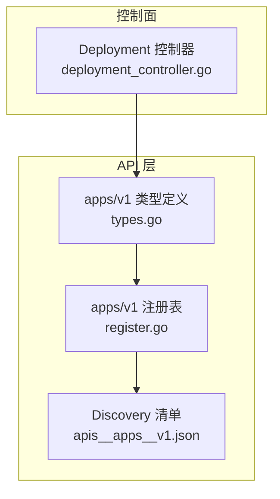
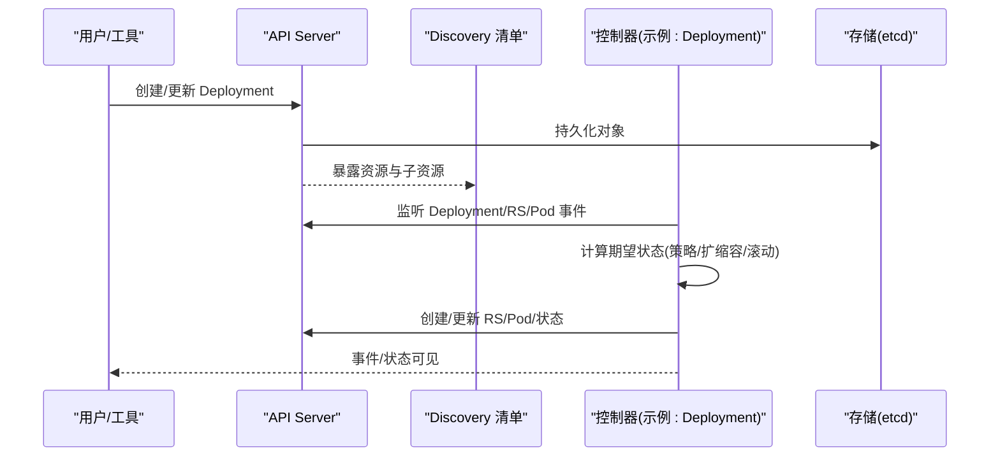
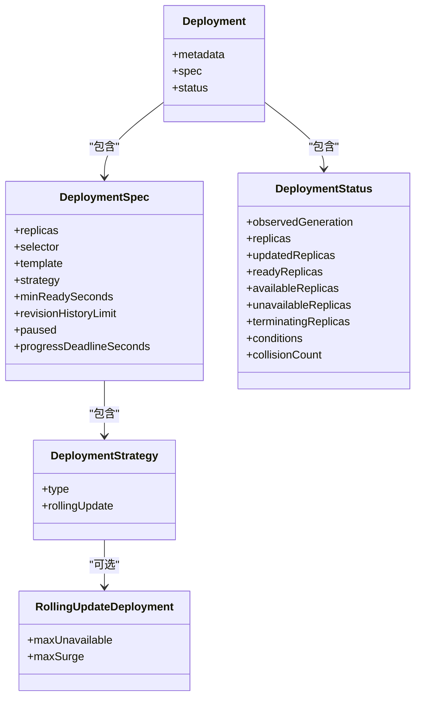
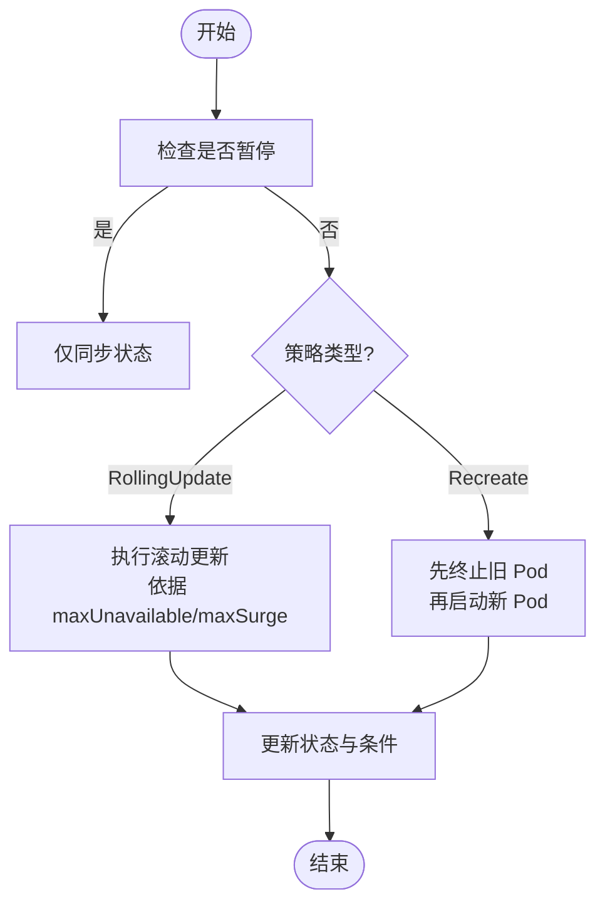
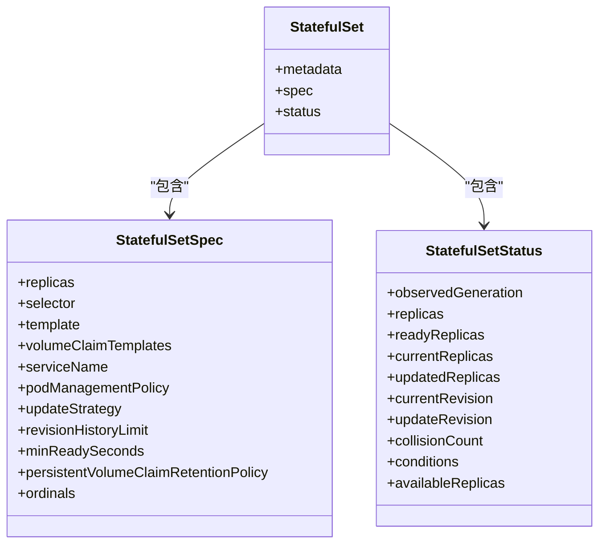
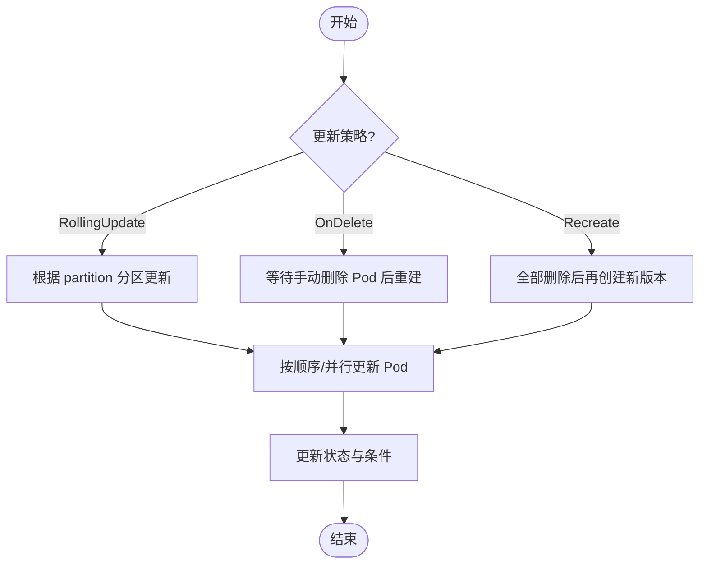
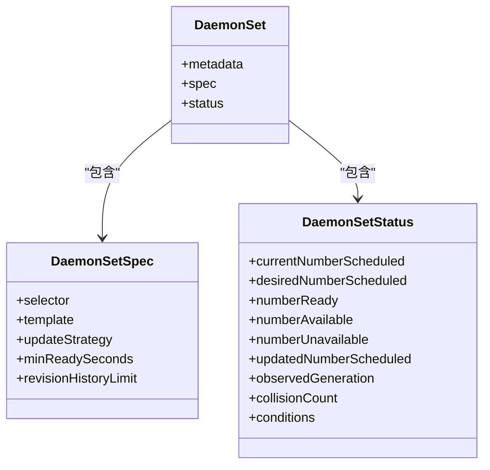
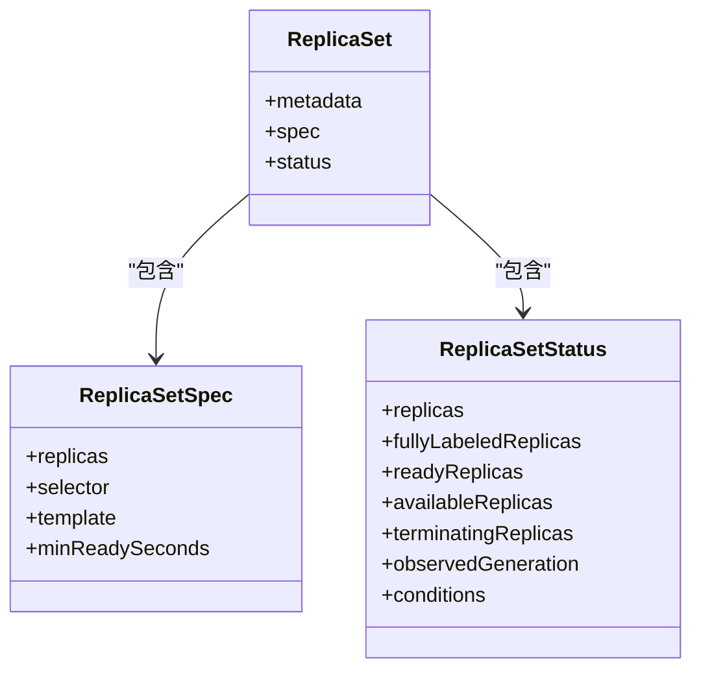
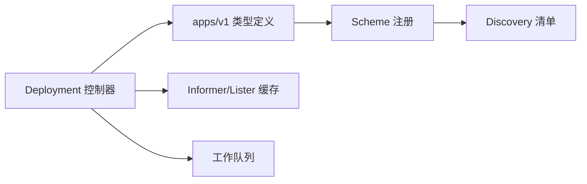

# Apps API

<cite>
**本文引用的文件**
- [staging/src/k8s.io/api/apps/v1/types.go](file://staging/src/k8s.io/api/apps/v1/types.go)
- [staging/src/k8s.io/api/apps/v1/register.go](file://staging/src/k8s.io/api/apps/v1/register.go)
- [api/discovery/apis__apps__v1.json](file://api/discovery/apis__apps__v1.json)
- [pkg/controller/deployment/deployment_controller.go](file://pkg/controller/deployment/deployment_controller.go)
</cite>

## 目录
1. [简介](#简介)
2. [项目结构](#项目结构)
3. [核心组件](#核心组件)
4. [架构总览](#架构总览)
5. [详细组件分析](#详细组件分析)
6. [依赖关系分析](#依赖关系分析)
7. [性能与扩缩容特性](#性能与扩缩容特性)
8. [版本兼容性与升级迁移](#版本兼容性与升级迁移)
9. [故障排查指南](#故障排查指南)
10. [结论](#结论)

## 简介
本参考文档聚焦 Kubernetes Apps API 组（apps/v1）的应用管理资源，包括 Deployment、StatefulSet、DaemonSet、ReplicaSet 以及内部使用的 ControllerRevision。文档从 REST API 规范、控制器模式、滚动更新策略、扩缩容机制、配置选项、版本兼容性、升级路径与迁移指南、典型部署场景与故障排查等方面进行全面说明，帮助读者快速掌握并正确使用这些资源。

## 项目结构
- API 定义位于 staging 模块的 apps/v1 包中，包含类型定义、注册逻辑与生成代码。
- 发现接口清单由 apiserver 在 discovery 端点暴露，用于客户端动态发现可用资源与子资源。
- 控制器实现位于 pkg/controller 下，以 Deployment 为例展示了典型的控制器循环、事件处理与同步流程。

图表来源
- [staging/src/k8s.io/api/apps/v1/types.go](file://staging/src/k8s.io/api/apps/v1/types.go)
- [staging/src/k8s.io/api/apps/v1/register.go](file://staging/src/k8s.io/api/apps/v1/register.go)
- [api/discovery/apis__apps__v1.json](file://api/discovery/apis__apps__v1.json)
- [pkg/controller/deployment/deployment_controller.go](file://pkg/controller/deployment/deployment_controller.go)

章节来源
- [staging/src/k8s.io/api/apps/v1/types.go](file://staging/src/k8s.io/api/apps/v1/types.go)
- [staging/src/k8s.io/api/apps/v1/register.go](file://staging/src/k8s.io/api/apps/v1/register.go)
- [api/discovery/apis__apps__v1.json](file://api/discovery/apis__apps__v1.json)
- [pkg/controller/deployment/deployment_controller.go](file://pkg/controller/deployment/deployment_controller.go)

## 核心组件
- Deployment：声明式 Pod 与 ReplicaSet 更新，支持滚动/重建策略、回滚、进度超时等。
- StatefulSet：面向有状态应用，提供稳定网络标识与持久卷绑定，支持有序/并行管理与多种更新策略。
- DaemonSet：在每个匹配节点上运行一个副本，适合日志采集、监控代理等守护进程。
- ReplicaSet：确保指定数量的 Pod 副本存活，通常由 Deployment 间接管理。
- ControllerRevision：记录不可变的状态快照，供控制器进行版本追踪与回滚。

章节来源
- [staging/src/k8s.io/api/apps/v1/types.go](file://staging/src/k8s.io/api/apps/v1/types.go)

## 架构总览
Apps API 组通过 API Server 暴露 REST 接口，控制器监听相关资源的变更事件，维护期望与实际状态一致。

图表来源
- [api/discovery/apis__apps__v1.json](file://api/discovery/apis__apps__v1.json)
- [pkg/controller/deployment/deployment_controller.go](file://pkg/controller/deployment/deployment_controller.go)

## 详细组件分析

### Deployment
- 目标：声明式更新 Pod 与 ReplicaSet，支持滚动与重建两种策略，具备回滚能力与进度控制。
- 关键字段
  - spec.replicas：期望副本数
  - spec.selector：标签选择器，必须与模板标签匹配
  - spec.template：Pod 模板
  - spec.strategy：RollingUpdate 或 Recreate；RollingUpdate 含 maxUnavailable/maxSurge
  - spec.minReadySeconds：新 Pod 就绪等待时间
  - spec.revisionHistoryLimit：保留历史副本集数量
  - spec.paused：是否暂停更新
  - spec.progressDeadlineSeconds：进度超时阈值
- 状态字段
  - status.conditions：Available/Progressing/ReplicaFailure 等条件
  - status.observedGeneration、replicas、updatedReplicas、readyReplicas、availableReplicas、unavailableReplicas、terminatingReplicas、collisionCount
- 子资源
  - /status：仅读取与更新状态
  - /scale：扩缩容（autoscaling/v1.Scale）
- 控制器行为
  - 监听 Deployment/ReplicaSet/Pod 事件，按策略推进更新或扩缩容
  - 使用唯一标签区分新旧副本集，避免冲突
  - 支持回滚到历史版本

图表来源
- [staging/src/k8s.io/api/apps/v1/types.go](file://staging/src/k8s.io/api/apps/v1/types.go)

章节来源
- [staging/src/k8s.io/api/apps/v1/types.go](file://staging/src/k8s.io/api/apps/v1/types.go)
- [api/discovery/apis__apps__v1.json](file://api/discovery/apis__apps__v1.json)

#### 滚动更新流程（Deployment）

图表来源
- [pkg/controller/deployment/deployment_controller.go](file://pkg/controller/deployment/deployment_controller.go)
- [staging/src/k8s.io/api/apps/v1/types.go](file://staging/src/k8s.io/api/apps/v1/types.go)

章节来源
- [pkg/controller/deployment/deployment_controller.go](file://pkg/controller/deployment/deployment_controller.go)
- [staging/src/k8s.io/api/apps/v1/types.go](file://staging/src/k8s.io/api/apps/v1/types.go)

### StatefulSet
- 目标：为有状态应用提供稳定的网络标识与持久卷绑定，保证同一 Pod 始终映射到相同存储与 DNS。
- 关键字段
  - spec.replicas：期望副本数
  - spec.selector：标签选择器（必需且不可变）
  - spec.template：Pod 模板
  - spec.volumeClaimTemplates：PVC 模板，与 Pod 中的 volumeMount 名称一一对应
  - spec.serviceName：Headless Service，提供稳定 DNS/主机名
  - spec.podManagementPolicy：OrderedReady 或 Parallel
  - spec.updateStrategy：RollingUpdate/OnDelete/Recreate（Recreate 需特性门控）
  - spec.revisionHistoryLimit：保留历史版本数量
  - spec.minReadySeconds：最小就绪时间
  - spec.persistentVolumeClaimRetentionPolicy：删除/缩容时 PVC 的处理策略
  - spec.ordinals：副本索引起始值
- 状态字段
  - status.currentRevision/updateRevision：当前与待更新版本
  - status.readyReplicas/currentReplicas/updatedReplicas/availableReplicas
  - status.conditions：Progressing 等
- 子资源
  - /status：仅读取与更新状态
  - /scale：扩缩容（autoscaling/v1.Scale）

图表来源
- [staging/src/k8s.io/api/apps/v1/types.go](file://staging/src/k8s.io/api/apps/v1/types.go)

章节来源
- [staging/src/k8s.io/api/apps/v1/types.go](file://staging/src/k8s.io/api/apps/v1/types.go)
- [api/discovery/apis__apps__v1.json](file://api/discovery/apis__apps__v1.json)

#### 滚动更新流程（StatefulSet）

图表来源
- [staging/src/k8s.io/api/apps/v1/types.go](file://staging/src/k8s.io/api/apps/v1/types.go)

### DaemonSet
- 目标：在每个匹配节点上运行一个 Pod 副本，适用于系统级守护进程。
- 关键字段
  - spec.selector：标签选择器（必需且与模板标签匹配）
  - spec.template：Pod 模板
  - spec.updateStrategy：RollingUpdate 或 OnDelete；RollingUpdate 含 maxUnavailable/maxSurge
  - spec.minReadySeconds：最小就绪时间
  - spec.revisionHistoryLimit：保留历史版本数量
- 状态字段
  - status.currentNumberScheduled/desiredNumberScheduled/numberReady/numberAvailable/numberUnavailable
  - status.updatedNumberScheduled、conditions、collisionCount
- 子资源
  - /status：仅读取与更新状态

图表来源
- [staging/src/k8s.io/api/apps/v1/types.go](file://staging/src/k8s.io/api/apps/v1/types.go)

章节来源
- [staging/src/k8s.io/api/apps/v1/types.go](file://staging/src/k8s.io/api/apps/v1/types.go)
- [api/discovery/apis__apps__v1.json](file://api/discovery/apis__apps__v1.json)

### ReplicaSet
- 目标：确保指定数量的 Pod 副本处于运行状态，通常作为 Deployment 的子资源被管理。
- 关键字段
  - spec.replicas：期望副本数
  - spec.selector：标签选择器（必需且与模板标签匹配）
  - spec.template：Pod 模板
  - spec.minReadySeconds：最小就绪时间
- 状态字段
  - status.replicas/fullyLabeledReplicas/readyReplicas/availableReplicas/terminatingReplicas
  - status.observedGeneration、conditions
- 子资源
  - /status：仅读取与更新状态
  - /scale：扩缩容（autoscaling/v1.Scale）

图表来源
- [staging/src/k8s.io/api/apps/v1/types.go](file://staging/src/k8s.io/api/apps/v1/types.go)

章节来源
- [staging/src/k8s.io/api/apps/v1/types.go](file://staging/src/k8s.io/api/apps/v1/types.go)
- [api/discovery/apis__apps__v1.json](file://api/discovery/apis__apps__v1.json)

### ControllerRevision
- 目标：保存不可变的状态快照，供控制器进行版本追踪与回滚。
- 关键字段
  - data：序列化的内部状态
  - revision：版本号
- 用途：DaemonSet 与 StatefulSet 控制器在更新与回滚时使用。

章节来源
- [staging/src/k8s.io/api/apps/v1/types.go](file://staging/src/k8s.io/api/apps/v1/types.go)

## 依赖关系分析
- API 注册与发现
  - apps/v1 将 Deployment、StatefulSet、DaemonSet、ReplicaSet、ControllerRevision 及其 List 类型注册到 Scheme，并在 Discovery 清单中暴露资源与子资源。
- 控制器依赖
  - Deployment 控制器依赖 Informer/Lister 缓存 Deployment/ReplicaSet/Pod，并通过工作队列驱动同步循环。
  - 控制器通过 OwnerReference 建立层级关系，自动回收孤儿资源并进行扩容/缩容决策。

图表来源
- [staging/src/k8s.io/api/apps/v1/register.go](file://staging/src/k8s.io/api/apps/v1/register.go)
- [api/discovery/apis__apps__v1.json](file://api/discovery/apis__apps__v1.json)
- [pkg/controller/deployment/deployment_controller.go](file://pkg/controller/deployment/deployment_controller.go)

章节来源
- [staging/src/k8s.io/api/apps/v1/register.go](file://staging/src/k8s.io/api/apps/v1/register.go)
- [api/discovery/apis__apps__v1.json](file://api/discovery/apis__apps__v1.json)
- [pkg/controller/deployment/deployment_controller.go](file://pkg/controller/deployment/deployment_controller.go)

## 性能与扩缩容特性
- 滚动更新参数
  - Deployment：maxUnavailable/maxSurge 控制并发与峰值容量，合理设置可平衡速度与可用性。
  - DaemonSet：maxUnavailable/maxSurge 控制每节点更新节奏，避免资源争用。
  - StatefulSet：partition 与 maxUnavailable 配合有序更新，保障数据一致性。
- 扩缩容
  - 所有受支持的资源均提供 /scale 子资源，可通过 autoscaling/v1.Scale 直接调整 replicas。
  - HPA 基于 metrics-server 指标对 Deployment/ReplicaSet/StatefulSet 进行水平扩展。
- 就绪与可用性
  - minReadySeconds 影响就绪判定与滚动推进速度，建议结合探针设置合理值。
- 资源限制与调度
  - 副本数与资源请求/限制共同影响集群容量规划，注意节点资源与配额。

章节来源
- [staging/src/k8s.io/api/apps/v1/types.go](file://staging/src/k8s.io/api/apps/v1/types.go)
- [api/discovery/apis__apps__v1.json](file://api/discovery/apis__apps__v1.json)

## 版本兼容性与升级迁移
- 版本引入
  - apps/v1 自 1.9 起引入，包含 Deployment、StatefulSet、DaemonSet、ReplicaSet、ControllerRevision 等类型。
- 向后兼容
  - 控制器在更新过程中维护 currentRevision/updateRevision，支持回滚至历史版本。
  - 对于 StatefulSet，Recreate 策略需要启用相应特性门控；谨慎切换策略以避免服务中断。
- 迁移建议
  - 从早期版本迁移时，关注字段默认值变化与新增必填字段（如 selector 不可变）。
  - 使用 kubectl rollout history/undo 进行版本回退；必要时清理多余历史版本以节省存储。

章节来源
- [staging/src/k8s.io/api/apps/v1/types.go](file://staging/src/k8s.io/api/apps/v1/types.go)

## 故障排查指南
- 常见问题定位
  - 选择器不匹配：Deployment/StatefulSet/DaemonSet 的 selector 必须与模板标签一致，否则无法创建 Pod。
  - 滚动卡住：检查 conditions 中的 Progressing 与 Available 状态，确认 minReadySeconds 与探针配置。
  - 资源不足：查看 ReplicaFailure 条件与事件，确认配额、节点资源与调度约束。
  - 状态不一致：对比 desired/actual 副本数与 ready/available 计数，定位异常 Pod 与节点。
- 调试步骤
  - 查看资源状态与事件：kubectl describe <resource> <name>
  - 检查 Pod 日志与事件：kubectl logs/pods/<pod-name> 与 kubectl get events
  - 验证选择器与标签：确保模板标签与选择器一致
  - 回滚与重试：使用 rollout undo 或调整策略参数后重新触发更新

章节来源
- [staging/src/k8s.io/api/apps/v1/types.go](file://staging/src/k8s.io/api/apps/v1/types.go)
- [pkg/controller/deployment/deployment_controller.go](file://pkg/controller/deployment/deployment_controller.go)

## 结论
Apps API 组提供了强大的应用管理能力，覆盖无状态与有状态工作负载的典型场景。通过合理的策略配置与扩缩容机制，可以在保证可用性的前提下高效迭代与弹性伸缩。理解各资源的控制器模式、滚动更新与状态字段，有助于在实际生产环境中进行稳健的部署与排障。