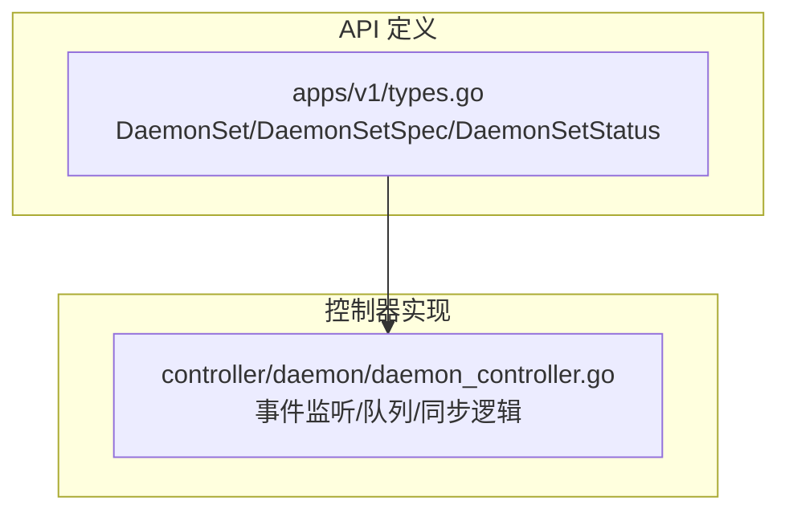
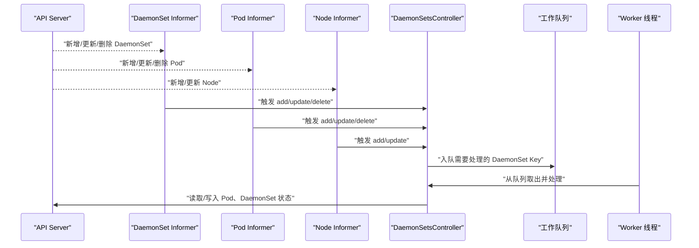
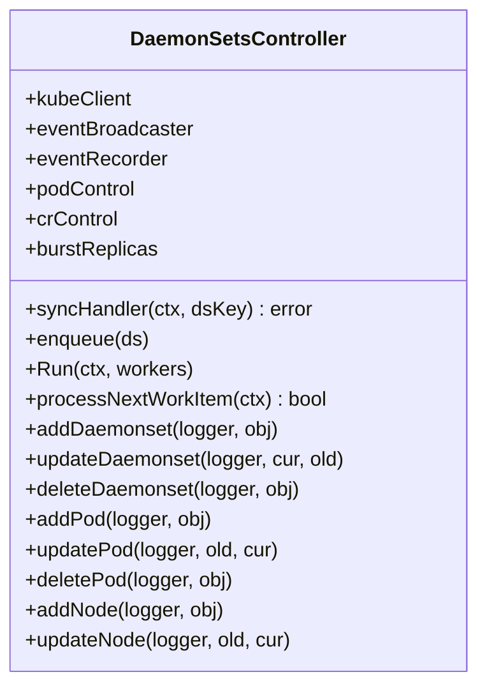
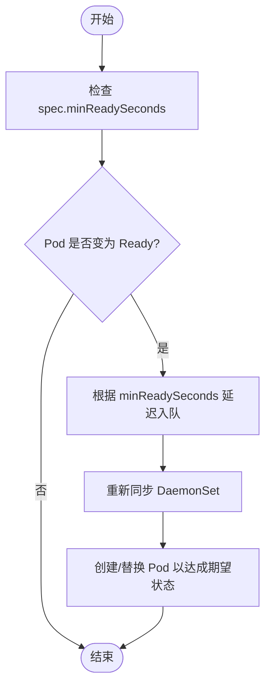
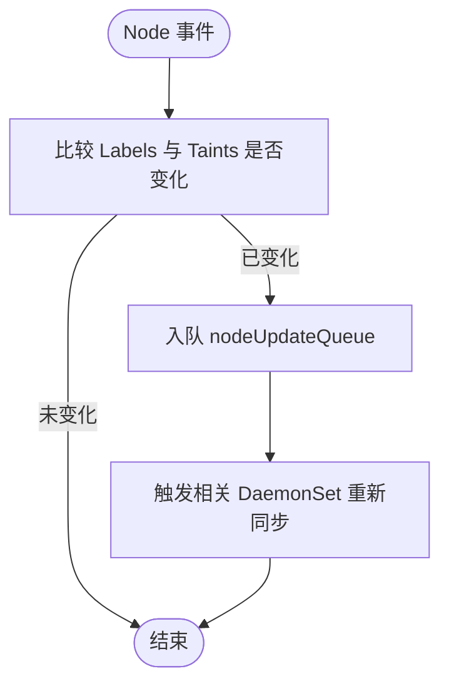
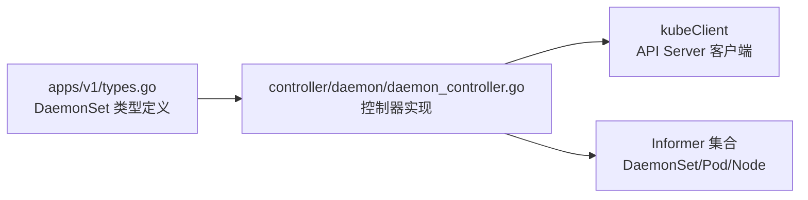

# DaemonSet API

<cite>
**本文引用的文件**   
- [staging/src/k8s.io/api/apps/v1/types.go](file://staging/src/k8s.io/api/apps/v1/types.go)
- [pkg/controller/daemon/daemon_controller.go](file://pkg/controller/daemon/daemon_controller.go)
</cite>

## 目录
1. [简介](#简介)
2. [项目结构](#项目结构)
3. [核心组件](#核心组件)
4. [架构总览](#架构总览)
5. [详细组件分析](#详细组件分析)
6. [依赖关系分析](#依赖关系分析)
7. [性能考量](#性能考量)
8. [故障排查指南](#故障排查指南)
9. [结论](#结论)
10. [附录](#附录)

## 简介
本参考文档面向 Kubernetes 的 DaemonSet 资源，聚焦其 REST API 与控制器实现要点。DaemonSet 的核心设计模式是：在集群中的每个（或按选择规则匹配的）节点上运行一个 Pod 副本，适用于系统级应用，如日志采集、监控代理、网络插件等。本文将深入说明：
- 节点选择器、容忍与污点的配置方法
- 滚动更新策略与 OnDelete 策略的使用场景
- 节点亲和性与反亲和性的配置方式
- 节点标签动态匹配与自动发现机制
- 生产环境最佳实践与性能调优建议

## 项目结构
围绕 DaemonSet 的关键代码主要分布在两类位置：
- API 类型定义：位于 staging 模块中 apps/v1 的 types.go，定义了 DaemonSet、DaemonSetSpec、DaemonSetStatus、DaemonSetUpdateStrategy 等核心结构体
- 控制器实现：位于 pkg/controller/daemon 下的 daemon_controller.go，负责监听并同步 DaemonSet 与其管理的 Pod 状态

图表来源
- [staging/src/k8s.io/api/apps/v1/types.go:695-729](file://staging/src/k8s.io/api/apps/v1/types.go#L695-L729)
- [pkg/controller/daemon/daemon_controller.go:101-155](file://pkg/controller/daemon/daemon_controller.go#L101-L155)

章节来源
- [staging/src/k8s.io/api/apps/v1/types.go:695-729](file://staging/src/k8s.io/api/apps/v1/types.go#L695-L729)
- [pkg/controller/daemon/daemon_controller.go:101-155](file://pkg/controller/daemon/daemon_controller.go#L101-L155)

## 核心组件
- DaemonSet 对象
  - 包含标准元数据、期望规格 Spec 与只读状态 Status
  - 支持子资源 /status
- DaemonSetSpec
  - selector：标签选择器，必须与 Pod 模板的标签一致
  - template：Pod 模板，DaemonSet 会在每个匹配节点上创建一个该模板的 Pod
  - updateStrategy：更新策略（滚动更新或 OnDelete）
  - minReadySeconds：新 Pod 就绪的最小等待时间
  - revisionHistoryLimit：保留的历史版本数量
- DaemonSetStatus
  - currentNumberScheduled、desiredNumberScheduled、numberReady、updatedNumberScheduled、numberAvailable、numberUnavailable 等指标用于观测部署健康度
- DaemonSetUpdateStrategy
  - 控制滚动更新行为（例如 RollingUpdate 与 OnDelete）

章节来源
- [staging/src/k8s.io/api/apps/v1/types.go:695-729](file://staging/src/k8s.io/api/apps/v1/types.go#L695-L729)
- [staging/src/k8s.io/api/apps/v1/types.go:731-785](file://staging/src/k8s.io/api/apps/v1/types.go#L731-L785)
- [staging/src/k8s.io/api/apps/v1/types.go:814-835](file://staging/src/k8s.io/api/apps/v1/types.go#L814-L835)

## 架构总览
DaemonSet 控制器通过 Informer 监听 DaemonSet、Pod、Node 的变化，将变更放入工作队列，并由 worker 执行同步逻辑，确保实际运行的 Pod 与期望状态一致。

图表来源
- [pkg/controller/daemon/daemon_controller.go:224-291](file://pkg/controller/daemon/daemon_controller.go#L224-L291)
- [pkg/controller/daemon/daemon_controller.go:356-390](file://pkg/controller/daemon/daemon_controller.go#L356-L390)
- [pkg/controller/daemon/daemon_controller.go:392-415](file://pkg/controller/daemon/daemon_controller.go#L392-L415)

## 详细组件分析

### DaemonSet 控制器类图

图表来源
- [pkg/controller/daemon/daemon_controller.go:101-155](file://pkg/controller/daemon/daemon_controller.go#L101-L155)
- [pkg/controller/daemon/daemon_controller.go:356-390](file://pkg/controller/daemon/daemon_controller.go#L356-L390)
- [pkg/controller/daemon/daemon_controller.go:392-415](file://pkg/controller/daemon/daemon_controller.go#L392-L415)
- [pkg/controller/daemon/daemon_controller.go:293-353](file://pkg/controller/daemon/daemon_controller.go#L293-L353)
- [pkg/controller/daemon/daemon_controller.go:585-725](file://pkg/controller/daemon/daemon_controller.go#L585-L725)
- [pkg/controller/daemon/daemon_controller.go:727-755](file://pkg/controller/daemon/daemon_controller.go#L727-L755)

章节来源
- [pkg/controller/daemon/daemon_controller.go:101-155](file://pkg/controller/daemon/daemon_controller.go#L101-L155)

### 滚动更新流程（含 MinReadySeconds）

图表来源
- [pkg/controller/daemon/daemon_controller.go:664-670](file://pkg/controller/daemon/daemon_controller.go#L664-L670)
- [staging/src/k8s.io/api/apps/v1/types.go:717-722](file://staging/src/k8s.io/api/apps/v1/types.go#L717-L722)

章节来源
- [pkg/controller/daemon/daemon_controller.go:664-670](file://pkg/controller/daemon/daemon_controller.go#L664-L670)
- [staging/src/k8s.io/api/apps/v1/types.go:717-722](file://staging/src/k8s.io/api/apps/v1/types.go#L717-L722)

### 节点变化处理流程

图表来源
- [pkg/controller/daemon/daemon_controller.go:738-755](file://pkg/controller/daemon/daemon_controller.go#L738-L755)

章节来源
- [pkg/controller/daemon/daemon_controller.go:738-755](file://pkg/controller/daemon/daemon_controller.go#L738-L755)

### 节点选择器、容忍与污点
- 节点选择器
  - 通过 Pod 模板的节点选择器字段进行精确匹配，DaemonSet 仅对匹配节点创建 Pod
- 容忍与污点
  - 通过 Pod 模板的容忍项允许被污点标记的节点调度 Pod
  - 当节点添加/更新导致标签或污点变化时，控制器会重新评估并调整 Pod 分布

章节来源
- [staging/src/k8s.io/api/apps/v1/types.go:704-711](file://staging/src/k8s.io/api/apps/v1/types.go#L704-L711)
- [pkg/controller/daemon/daemon_controller.go:738-755](file://pkg/controller/daemon/daemon_controller.go#L738-L755)

### 节点亲和性与反亲和性
- 节点亲和性/反亲和性
  - 在 Pod 模板中使用节点亲和性或反亲和性规则，进一步约束 DaemonSet Pod 的调度目标节点
  - 结合节点标签可实现更细粒度的“按特性部署”（如 GPU 节点、边缘节点等）

章节来源
- [staging/src/k8s.io/api/apps/v1/types.go:704-711](file://staging/src/k8s.io/api/apps/v1/types.go#L704-L711)

### 滚动更新策略与 OnDelete 策略
- 滚动更新（RollingUpdate）
  - 控制器按策略逐步替换旧 Pod 为新版本，可配合 minReadySeconds 保证可用性
- OnDelete
  - 仅在用户手动删除旧 Pod 后才创建新 Pod，适合需要人工介入的升级流程

章节来源
- [staging/src/k8s.io/api/apps/v1/types.go:713-715](file://staging/src/k8s.io/api/apps/v1/types.go#L713-L715)
- [staging/src/k8s.io/api/apps/v1/types.go:717-722](file://staging/src/k8s.io/api/apps/v1/types.go#L717-L722)

### 系统级应用完整配置示例（路径指引）
以下为常见系统级应用的配置思路与关键片段路径指引（不直接展示 YAML 内容）：
- 日志收集（如 Fluentd/Fluent Bit）
  - 使用 hostPath 挂载宿主机日志目录
  - 设置适当的资源限制与探针
  - 参考路径：[staging/src/k8s.io/api/apps/v1/types.go:704-711](file://staging/src/k8s.io/api/apps/v1/types.go#L704-L711)
- 监控代理（如 Node Exporter）
  - 暴露端口并通过 Service 聚合指标
  - 使用 tolerations 容忍不可调度节点
  - 参考路径：[staging/src/k8s.io/api/apps/v1/types.go:704-711](file://staging/src/k8s.io/api/apps/v1/types.go#L704-L711)
- 网络插件（如 CNI 插件）
  - 通过 hostNetwork 与 privileged 权限访问内核网络栈
  - 使用节点标签区分不同网络拓扑
  - 参考路径：[staging/src/k8s.io/api/apps/v1/types.go:704-711](file://staging/src/k8s.io/api/apps/v1/types.go#L704-L711)

章节来源
- [staging/src/k8s.io/api/apps/v1/types.go:704-711](file://staging/src/k8s.io/api/apps/v1/types.go#L704-L711)

### 节点标签动态匹配与自动发现
- 动态匹配
  - 当节点标签变化时，shouldIgnoreNodeUpdate 判断为已变化，控制器会将对应 DaemonSet 重新入队处理
- 自动发现
  - 新节点加入后，控制器会为匹配规则的节点创建 Pod；节点移除后，相应 Pod 将被清理

章节来源
- [pkg/controller/daemon/daemon_controller.go:738-755](file://pkg/controller/daemon/daemon_controller.go#L738-L755)
- [pkg/controller/daemon/daemon_controller.go:727-736](file://pkg/controller/daemon/daemon_controller.go#L727-L736)

### 生产环境最佳实践与性能调优
- 使用合适的更新策略
  - 对关键系统组件优先采用 OnDelete，避免自动化滚动带来的风险
- 合理设置 minReadySeconds
  - 确保新 Pod 真正可用后再继续滚动，减少服务抖动
- 控制并发与速率
  - 控制器内部有 BurstReplicas 限制，避免大规模同时创建造成 API Server 压力
- 精细化节点选择
  - 使用节点标签、亲和/反亲和、污点/容忍精准定位目标节点，降低误调度
- 监控与告警
  - 关注 status 中的 numberReady、numberAvailable、numberUnavailable 等指标，及时发现问题

章节来源
- [staging/src/k8s.io/api/apps/v1/types.go:717-722](file://staging/src/k8s.io/api/apps/v1/types.go#L717-L722)
- [pkg/controller/daemon/daemon_controller.go:63-73](file://pkg/controller/daemon/daemon_controller.go#L63-L73)
- [staging/src/k8s.io/api/apps/v1/types.go:731-785](file://staging/src/k8s.io/api/apps/v1/types.go#L731-L785)

## 依赖关系分析
- API 层与控制器层的耦合
  - 控制器依赖 apps/v1 的 DaemonSet 类型定义进行序列化/反序列化与校验
- Informer 与队列
  - 控制器通过 Informer 监听资源变化，并将事件转换为工作项进入队列
- 外部依赖
  - 通过 kubeClient 与 API Server 交互，读写 Pod、DaemonSet 等资源

图表来源
- [staging/src/k8s.io/api/apps/v1/types.go:695-729](file://staging/src/k8s.io/api/apps/v1/types.go#L695-L729)
- [pkg/controller/daemon/daemon_controller.go:101-155](file://pkg/controller/daemon/daemon_controller.go#L101-L155)

章节来源
- [staging/src/k8s.io/api/apps/v1/types.go:695-729](file://staging/src/k8s.io/api/apps/v1/types.go#L695-L729)
- [pkg/controller/daemon/daemon_controller.go:101-155](file://pkg/controller/daemon/daemon_controller.go#L101-L155)

## 性能考量
- 批量创建限制
  - 控制器内置 BurstReplicas 限制，防止一次性创建过多 Pod 导致注册表或服务端过载
- 最小就绪时间
  - minReadySeconds 越大，滚动越保守，但整体完成时间更长
- 节点变更频率
  - 频繁节点标签/污点变更会导致大量重同步，建议稳定节点属性或使用批处理更新

章节来源
- [pkg/controller/daemon/daemon_controller.go:63-73](file://pkg/controller/daemon/daemon_controller.go#L63-L73)
- [staging/src/k8s.io/api/apps/v1/types.go:717-722](file://staging/src/k8s.io/api/apps/v1/types.go#L717-L722)

## 故障排查指南
- 常见问题定位
  - 查看 DaemonSet 的 status 字段，关注 numberReady、numberAvailable、numberUnavailable 等指标
  - 检查 Pod 事件与条件，确认是否因资源不足、节点选择器不匹配、污点/容忍问题导致调度失败
- 控制器日志
  - 关注控制器的事件记录与错误输出，定位具体失败原因
- 节点变更影响
  - 若节点标签/污点变更后出现异常，检查 shouldIgnoreNodeUpdate 的判断逻辑与队列入队情况

章节来源
- [staging/src/k8s.io/api/apps/v1/types.go:731-785](file://staging/src/k8s.io/api/apps/v1/types.go#L731-L785)
- [pkg/controller/daemon/daemon_controller.go:738-755](file://pkg/controller/daemon/daemon_controller.go#L738-L755)

## 结论
DaemonSet 通过在每个（或匹配）节点上运行 Pod 副本，成为承载系统级应用的理想选择。借助节点选择器、容忍与污点、亲和/反亲和等调度能力，以及滚动更新与 OnDelete 策略，可以在保障可用性的前提下安全地演进系统组件。生产环境中应结合 minReadySeconds、BurstReplicas 等参数进行调优，并持续监控 status 指标以确保健康度。

## 附录
- 术语
  - 滚动更新：逐步替换旧 Pod 为新版本的更新方式
  - OnDelete：仅在手动删除旧 Pod 后创建新 Pod 的更新方式
  - 亲和/反亲和：基于节点标签的调度约束
  - 污点/容忍：节点排斥与 Pod 接受的配对机制