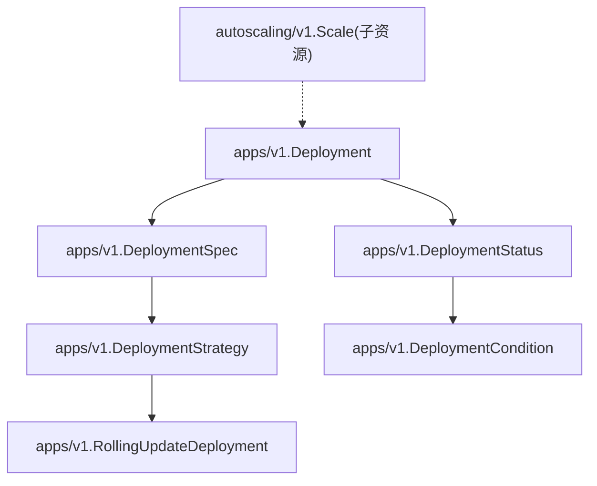
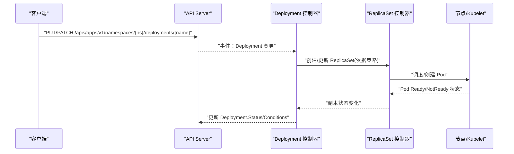
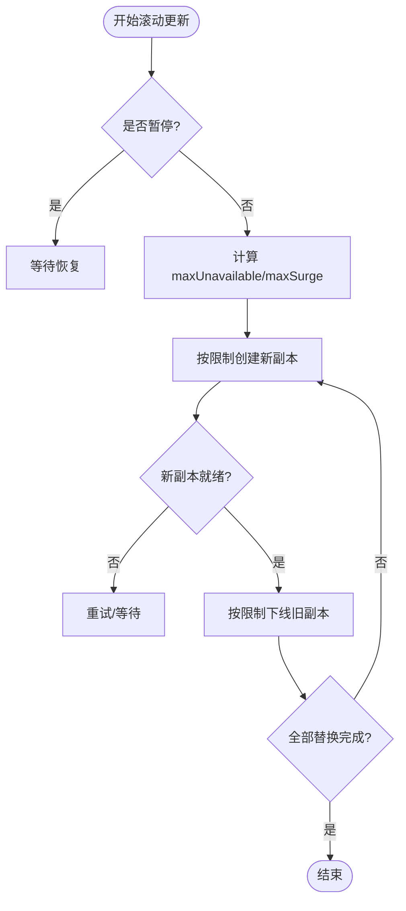
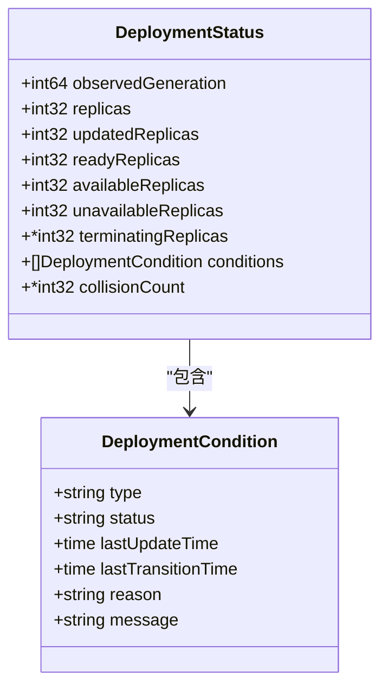
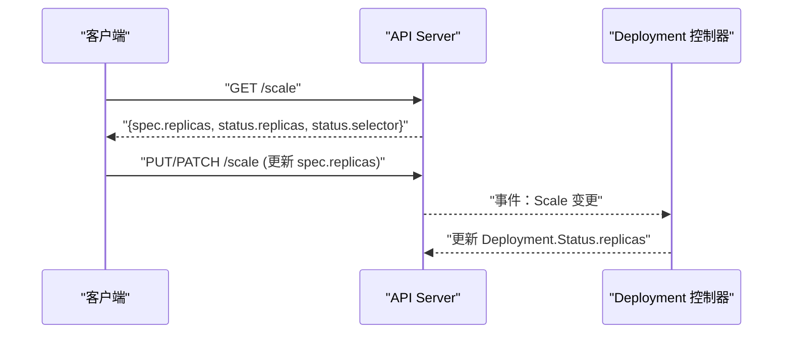
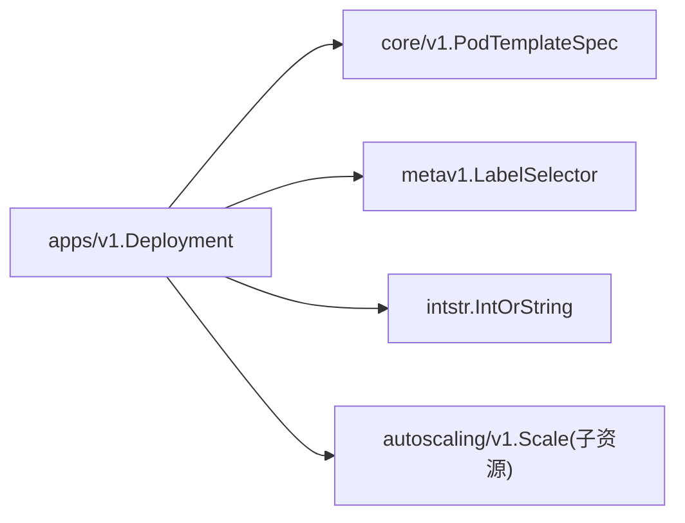

# Deployment API

<cite>
**本文引用的文件**
- [staging/src/k8s.io/api/apps/v1/types.go](file://staging/src/k8s.io/api/apps/v1/types.go)
- [staging/src/k8s.io/api/autoscaling/v1/types.go](file://staging/src/k8s.io/api/autoscaling/v1/types.go)
- [hack/testdata/deployment-revision1.yaml](file://hack/testdata/deployment-revision1.yaml)
- [hack/testdata/deployment-revision2.yaml](file://hack/testdata/deployment-revision2.yaml)
</cite>

## 目录
1. [简介](#简介)
2. [项目结构](#项目结构)
3. [核心组件](#核心组件)
4. [架构总览](#架构总览)
5. [详细组件分析](#详细组件分析)
6. [依赖关系分析](#依赖关系分析)
7. [性能与可用性考量](#性能与可用性考量)
8. [故障排查指南](#故障排查指南)
9. [结论](#结论)
10. [附录：YAML 示例与操作参考](#附录yaml-示例与操作参考)

## 简介
本文件为 Kubernetes Deployment 资源的 REST API 参考文档，聚焦于 apps/v1 版本的完整数据结构、滚动更新策略（RollingUpdate）、条件状态（Available、Progressing、ReplicaFailure）、扩缩容子资源、版本回滚以及暂停/恢复等能力。文档同时提供基于源码的结构化说明与可视化图示，帮助读者快速理解并正确使用 Deployment。

## 项目结构
Deployment 的 API 定义位于 apps/v1 包中，包含 Deployment、DeploymentSpec、DeploymentStrategy、RollingUpdateDeployment、DeploymentStatus、DeploymentCondition 等核心类型；扩缩容通过 autoscaling/v1.Scale 子资源实现；版本回滚由控制器基于历史版本管理完成。

图表来源
- [staging/src/k8s.io/api/apps/v1/types.go:396-461](file://staging/src/k8s.io/api/apps/v1/types.go#L396-L461)
- [staging/src/k8s.io/api/apps/v1/types.go:470-524](file://staging/src/k8s.io/api/apps/v1/types.go#L470-L524)
- [staging/src/k8s.io/api/apps/v1/types.go:526-573](file://staging/src/k8s.io/api/apps/v1/types.go#L526-L573)
- [staging/src/k8s.io/api/apps/v1/types.go:575-612](file://staging/src/k8s.io/api/apps/v1/types.go#L575-L612)
- [staging/src/k8s.io/api/autoscaling/v1/types.go:131-169](file://staging/src/k8s.io/api/autoscaling/v1/types.go#L131-L169)

章节来源
- [staging/src/k8s.io/api/apps/v1/types.go:396-461](file://staging/src/k8s.io/api/apps/v1/types.go#L396-L461)
- [staging/src/k8s.io/api/apps/v1/types.go:470-524](file://staging/src/k8s.io/api/apps/v1/types.go#L470-L524)
- [staging/src/k8s.io/api/apps/v1/types.go:526-573](file://staging/src/k8s.io/api/apps/v1/types.go#L526-L573)
- [staging/src/k8s.io/api/apps/v1/types.go:575-612](file://staging/src/k8s.io/api/apps/v1/types.go#L575-L612)
- [staging/src/k8s.io/api/autoscaling/v1/types.go:131-169](file://staging/src/k8s.io/api/autoscaling/v1/types.go#L131-L169)

## 核心组件
- Deployment：声明式 Pod 和 ReplicaSet 更新的顶层对象，支持 /scale 与 /status 子资源。
- DeploymentSpec：期望行为，包括副本数、选择器、Pod 模板、策略、最小就绪时间、历史保留数、是否暂停、进度超时等。
- DeploymentStrategy：更新策略，支持 Recreate 与 RollingUpdate。
- RollingUpdateDeployment：滚动更新参数 MaxUnavailable 与 MaxSurge。
- DeploymentStatus：观测到的运行状态，包含副本计数、可用/不可用、终止中副本、条件等。
- DeploymentCondition：条件集合，包含 Available、Progressing、ReplicaFailure。
- Scale 子资源：用于扩缩容，读写 replicas。

章节来源
- [staging/src/k8s.io/api/apps/v1/types.go:396-461](file://staging/src/k8s.io/api/apps/v1/types.go#L396-L461)
- [staging/src/k8s.io/api/apps/v1/types.go:470-524](file://staging/src/k8s.io/api/apps/v1/types.go#L470-L524)
- [staging/src/k8s.io/api/apps/v1/types.go:526-573](file://staging/src/k8s.io/api/apps/v1/types.go#L526-L573)
- [staging/src/k8s.io/api/apps/v1/types.go:575-612](file://staging/src/k8s.io/api/apps/v1/types.go#L575-L612)
- [staging/src/k8s.io/api/autoscaling/v1/types.go:131-169](file://staging/src/k8s.io/api/autoscaling/v1/types.go#L131-L169)

## 架构总览
Deployment 控制器根据 Spec 创建或更新对应的 ReplicaSet，并通过滚动更新策略逐步替换旧副本。Scale 子资源直接修改目标副本数，触发扩缩容。条件字段反映部署推进、可用性与失败情况。

图表来源
- [staging/src/k8s.io/api/apps/v1/types.go:396-461](file://staging/src/k8s.io/api/apps/v1/types.go#L396-L461)
- [staging/src/k8s.io/api/apps/v1/types.go:526-573](file://staging/src/k8s.io/api/apps/v1/types.go#L526-L573)
- [staging/src/k8s.io/api/apps/v1/types.go:575-612](file://staging/src/k8s.io/api/apps/v1/types.go#L575-L612)

## 详细组件分析

### Deployment 与 DeploymentSpec
- 关键字段
  - replicas：期望副本数（默认 1）
  - selector：标签选择器，必须与 Pod 模板匹配
  - template：Pod 模板（仅允许 restartPolicy=Always）
  - strategy：更新策略（Recreate/RollingUpdate）
  - minReadySeconds：新 Pod 就绪后保持的最小秒数
  - revisionHistoryLimit：保留的历史版本数量（默认 10）
  - paused：是否暂停部署（暂停期间不推进进度）
  - progressDeadlineSeconds：推进超时阈值（默认 600s）

章节来源
- [staging/src/k8s.io/api/apps/v1/types.go:415-461](file://staging/src/k8s.io/api/apps/v1/types.go#L415-L461)

### 更新策略与滚动更新（RollingUpdate）
- 策略类型
  - Recreate：先删除所有旧 Pod，再创建新 Pod
  - RollingUpdate：渐进式替换，控制不可用与超额副本上限
- RollingUpdate 参数
  - maxUnavailable：更新期间最多不可用的 Pod 数（绝对值或百分比），默认 25%
  - maxSurge：更新期间最多超出期望副本数的 Pod 数（绝对值或百分比），默认 25%
  - 约束：当 maxUnavailable 与 maxSurge 均为 0 时非法

图表来源
- [staging/src/k8s.io/api/apps/v1/types.go:470-524](file://staging/src/k8s.io/api/apps/v1/types.go#L470-L524)

章节来源
- [staging/src/k8s.io/api/apps/v1/types.go:470-524](file://staging/src/k8s.io/api/apps/v1/types.go#L470-L524)

### 状态与条件（DeploymentStatus & Conditions）
- 状态字段
  - observedGeneration：控制器观测到的生成号
  - replicas/updatedReplicas/readyReplicas/availableReplicas/unavailableReplicas/terminatingReplicas
  - collisionCount：名称冲突计数
- 条件类型
  - Available：满足最小可用副本且持续 minReadySeconds
  - Progressing：正在推进（新建/采用新的 ReplicaSet，或扩缩容进行中；暂停或未设置进度超时时不计）
  - ReplicaFailure：Pod 创建/删除失败

图表来源
- [staging/src/k8s.io/api/apps/v1/types.go:526-573](file://staging/src/k8s.io/api/apps/v1/types.go#L526-L573)
- [staging/src/k8s.io/api/apps/v1/types.go:575-612](file://staging/src/k8s.io/api/apps/v1/types.go#L575-L612)

章节来源
- [staging/src/k8s.io/api/apps/v1/types.go:526-573](file://staging/src/k8s.io/api/apps/v1/types.go#L526-L573)
- [staging/src/k8s.io/api/apps/v1/types.go:575-612](file://staging/src/k8s.io/api/apps/v1/types.go#L575-L612)

### 扩缩容（Scale 子资源）
- 接口
  - GET /apis/apps/v1/namespaces/{ns}/deployments/{name}/scale
  - PUT/PATCH /apis/apps/v1/namespaces/{ns}/deployments/{name}/scale
- 数据模型
  - spec.replicas：目标副本数
  - status.replicas：实际副本数
  - status.selector：字符串形式的选择器（便于客户端避免反序列化）

图表来源
- [staging/src/k8s.io/api/apps/v1/types.go:396-413](file://staging/src/k8s.io/api/apps/v1/types.go#L396-L413)
- [staging/src/k8s.io/api/autoscaling/v1/types.go:131-169](file://staging/src/k8s.io/api/autoscaling/v1/types.go#L131-L169)

章节来源
- [staging/src/k8s.io/api/autoscaling/v1/types.go:131-169](file://staging/src/k8s.io/api/autoscaling/v1/types.go#L131-L169)

### 版本回滚
- 机制
  - 控制器维护历史版本（由 revisionHistoryLimit 控制）
  - 通过更新 Deployment.Spec.Template 指向历史版本进行回滚
- 参考示例
  - 两个不同版本的 Deployment YAML 可用于演示回滚前后差异

章节来源
- [staging/src/k8s.io/api/apps/v1/types.go:415-461](file://staging/src/k8s.io/api/apps/v1/types.go#L415-L461)
- [hack/testdata/deployment-revision1.yaml](file://hack/testdata/deployment-revision1.yaml)
- [hack/testdata/deployment-revision2.yaml](file://hack/testdata/deployment-revision2.yaml)

### 暂停/恢复
- 字段
  - spec.paused：布尔值，true 表示暂停
- 行为
  - 暂停期间不会推进进度（Progressing 条件不受推进估算影响）
  - 恢复后继续执行未完成的更新

章节来源
- [staging/src/k8s.io/api/apps/v1/types.go:415-461](file://staging/src/k8s.io/api/apps/v1/types.go#L415-L461)
- [staging/src/k8s.io/api/apps/v1/types.go:575-612](file://staging/src/k8s.io/api/apps/v1/types.go#L575-L612)

## 依赖关系分析
- 内部依赖
  - Deployment 依赖 core/v1.PodTemplateSpec、metav1.LabelSelector、util/intstr.IntOrString
- 外部集成点
  - autoscaling/v1.Scale 子资源用于扩缩容
  - 控制器层与 ReplicaSet、Pod、Node 交互以达成期望状态

图表来源
- [staging/src/k8s.io/api/apps/v1/types.go:396-461](file://staging/src/k8s.io/api/apps/v1/types.go#L396-L461)
- [staging/src/k8s.io/api/autoscaling/v1/types.go:131-169](file://staging/src/k8s.io/api/autoscaling/v1/types.go#L131-L169)

章节来源
- [staging/src/k8s.io/api/apps/v1/types.go:396-461](file://staging/src/k8s.io/api/apps/v1/types.go#L396-L461)
- [staging/src/k8s.io/api/autoscaling/v1/types.go:131-169](file://staging/src/k8s.io/api/autoscaling/v1/types.go#L131-L169)

## 性能与可用性考量
- 滚动更新
  - 合理设置 maxUnavailable 与 maxSurge，平衡服务可用性与更新速度
  - 使用 minReadySeconds 确保新 Pod 稳定后再切换流量
- 进度控制
  - 配置 progressDeadlineSeconds 防止长时间无进展的部署占用资源
- 扩缩容
  - 大规模扩缩容时注意集群容量与调度延迟，必要时分批次调整
- 历史版本
  - 谨慎设置 revisionHistoryLimit，避免过多历史版本占用存储

[本节为通用指导，无需源码引用]

## 故障排查指南
- 常见问题定位
  - 检查 Deployment.Status.Conditions 中的 Reason/Message
  - 关注 unavailableReplicas/terminatingReplicas 增长原因
  - 验证 Pod 探针与健康检查是否符合预期
- 典型场景
  - 滚动更新卡住：检查 maxUnavailable/maxSurge 与资源配额
  - 回滚失败：确认历史版本存在且模板有效
  - 扩缩容不生效：核对选择器与副本数一致性

章节来源
- [staging/src/k8s.io/api/apps/v1/types.go:526-573](file://staging/src/k8s.io/api/apps/v1/types.go#L526-L573)
- [staging/src/k8s.io/api/apps/v1/types.go:575-612](file://staging/src/k8s.io/api/apps/v1/types.go#L575-L612)

## 结论
Deployment 提供了声明式的发布与扩缩容能力，结合滚动更新策略、条件状态与历史版本管理，可实现安全可控的应用演进。建议在生产环境中合理配置滚动更新参数、进度超时与最小就绪时间，并配合监控与告警提升可观测性。

[本节为总结，无需源码引用]

## 附录：YAML 示例与操作参考
- 滚动更新示例
  - 参考路径：[滚动更新相关测试用例](file://hack/testdata/deployment-revision1.yaml)
  - 参考路径：[滚动更新相关测试用例](file://hack/testdata/deployment-revision2.yaml)
- 扩缩容
  - 通过 /scale 子资源更新 spec.replicas
- 暂停/恢复
  - 设置 spec.paused=true 暂停，false 恢复
- 回滚
  - 将 spec.template 回退至历史版本（由 revisionHistoryLimit 保留）

章节来源
- [hack/testdata/deployment-revision1.yaml](file://hack/testdata/deployment-revision1.yaml)
- [hack/testdata/deployment-revision2.yaml](file://hack/testdata/deployment-revision2.yaml)
- [staging/src/k8s.io/api/apps/v1/types.go:415-461](file://staging/src/k8s.io/api/apps/v1/types.go#L415-L461)
- [staging/src/k8s.io/api/autoscaling/v1/types.go:131-169](file://staging/src/k8s.io/api/autoscaling/v1/types.go#L131-L169)