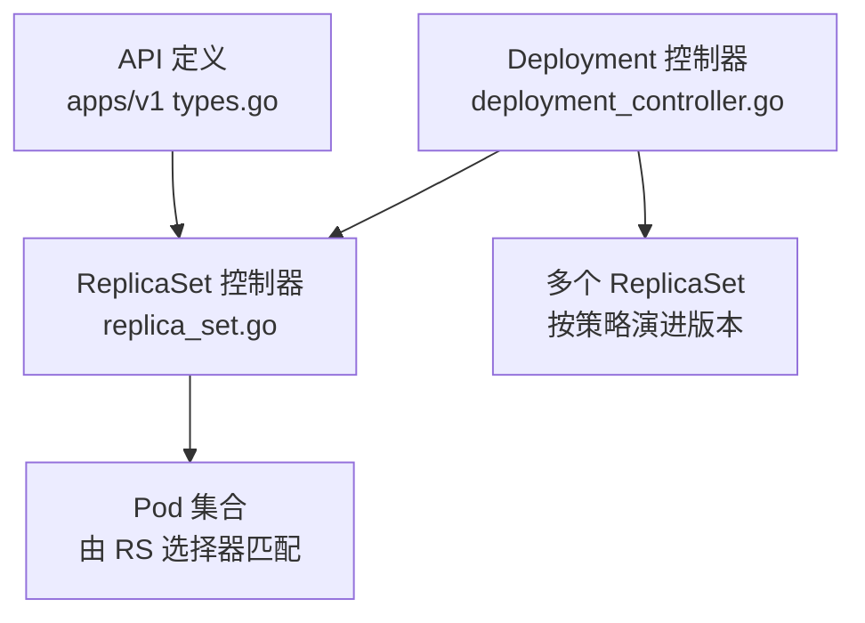
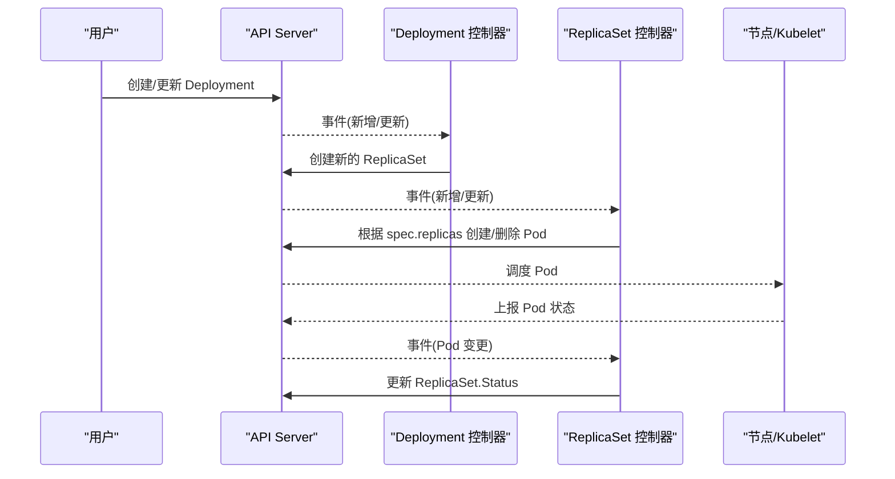
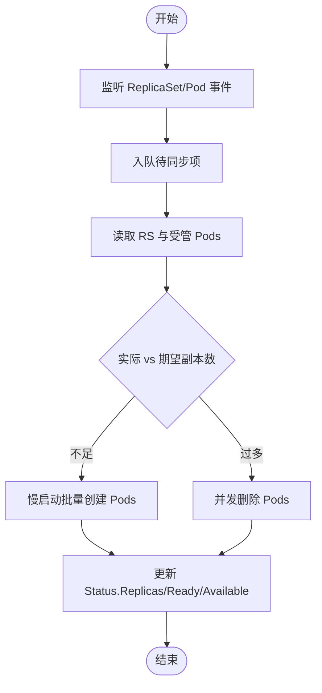
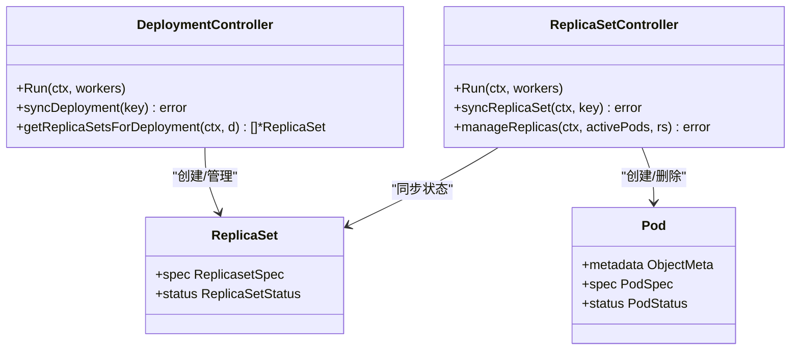

# ReplicaSet API

<cite>
**本文引用的文件**   
- [types.go](file://staging/src/k8s.io/api/apps/v1/types.go)
- [replica_set.go](file://pkg/controller/replicaset/replica_set.go)
- [deployment_controller.go](file://pkg/controller/deployment/deployment_controller.go)
</cite>

## 目录
1. [简介](#简介)
2. [项目结构](#项目结构)
3. [核心组件](#核心组件)
4. [架构总览](#架构总览)
5. [详细组件分析](#详细组件分析)
6. [依赖关系分析](#依赖关系分析)
7. [性能考量](#性能考量)
8. [故障排查指南](#故障排查指南)
9. [结论](#结论)
10. [附录](#附录)

## 简介
本参考文档聚焦 Kubernetes 中的 ReplicaSet 资源，面向希望理解其作为 Deployment 底层控制器的作用与工作原理的用户。内容涵盖：
- ReplicaSet 的 REST API 模型、字段与状态
- 副本数管理、Pod 模板与标签选择器配置
- 与 Deployment 的关系、迁移路径与扩缩容流程
- 直接管理 Pod 副本的场景与用例
- 状态监控与条件检查方法
- 扩缩容操作的 API 调用示例（以 /scale 子资源为中心）
- 为什么通常推荐使用 Deployment 而非直接使用 ReplicaSet
- 故障排查与调试技巧

## 项目结构
围绕 ReplicaSet 的关键代码位于以下位置：
- API 定义：apps/v1 中的 ReplicaSet、ReplicaSetSpec、ReplicaSetStatus 等类型
- 控制器实现：replicaset 控制器负责将期望状态与实际 Pod 同步
- 上层控制器：Deployment 控制器通过创建/管理多个 ReplicaSet 实现滚动更新与回滚

图表来源
- [types.go:866-1003](file://staging/src/k8s.io/api/apps/v1/types.go#L866-L1003)
- [replica_set.go:95-140](file://pkg/controller/replicaset/replica_set.go#L95-L140)
- [deployment_controller.go:65-101](file://pkg/controller/deployment/deployment_controller.go#L65-L101)

章节来源
- [types.go:866-1003](file://staging/src/k8s.io/api/apps/v1/types.go#L866-L1003)
- [replica_set.go:95-140](file://pkg/controller/replicaset/replica_set.go#L95-L140)
- [deployment_controller.go:65-101](file://pkg/controller/deployment/deployment_controller.go#L65-L101)

## 核心组件
- ReplicaSet 资源对象
  - 用于确保指定数量的 Pod 副本在任意时刻处于运行状态
  - 支持 /status 和 /scale 子资源
- ReplicaSetSpec
  - replicas：期望副本数
  - selector：标签选择器，必须与 Pod 模板标签一致
  - template：Pod 模板
  - minReadySeconds：新 Pod 就绪后被视为可用的最小等待时间
- ReplicaSetStatus
  - replicas、fullyLabeledReplicas、readyReplicas、availableReplicas、terminatingReplicas、observedGeneration
  - conditions：当前状态的观测条件（如 ReplicaFailure）

章节来源
- [types.go:866-907](file://staging/src/k8s.io/api/apps/v1/types.go#L866-L907)
- [types.go:909-936](file://staging/src/k8s.io/api/apps/v1/types.go#L909-L936)
- [types.go:938-1003](file://staging/src/k8s.io/api/apps/v1/types.go#L938-L1003)

## 架构总览
ReplicaSet 控制器通过 Informer 监听 ReplicaSet 与 Pod 的变化，计算差异并批量创建或删除 Pod，最终使实际状态收敛到期望状态。Deployment 控制器则基于策略（滚动或重建）创建新的 ReplicaSet，并逐步调整旧 ReplicaSet 的副本数以完成版本演进。

图表来源
- [deployment_controller.go:104-168](file://pkg/controller/deployment/deployment_controller.go#L104-L168)
- [deployment_controller.go:574-661](file://pkg/controller/deployment/deployment_controller.go#L574-L661)
- [replica_set.go:274-304](file://pkg/controller/replicaset/replica_set.go#L274-L304)
- [replica_set.go:752-800](file://pkg/controller/replicaset/replica_set.go#L752-L800)

## 详细组件分析

### ReplicaSet 控制器工作流
- 事件处理
  - 监听 ReplicaSet 与 Pod 的增删改事件，入队至工作队列
- 同步逻辑
  - 解析选择器，列出受管 Pod
  - 比较实际副本数与期望副本数，执行慢启动批量创建或并发删除
  - 使用 Expectations 机制避免重复操作与风暴
- 可用性跟踪
  - 当 Pod 从非就绪变为就绪且设置了 minReadySeconds 时，延迟重新入队以更新可用副本计数

图表来源
- [replica_set.go:274-304](file://pkg/controller/replicaset/replica_set.go#L274-L304)
- [replica_set.go:646-750](file://pkg/controller/replicaset/replica_set.go#L646-L750)
- [replica_set.go:752-800](file://pkg/controller/replicaset/replica_set.go#L752-L800)

章节来源
- [replica_set.go:95-140](file://pkg/controller/replicaset/replica_set.go#L95-L140)
- [replica_set.go:274-304](file://pkg/controller/replicaset/replica_set.go#L274-L304)
- [replica_set.go:646-750](file://pkg/controller/replicaset/replica_set.go#L646-L750)
- [replica_set.go:752-800](file://pkg/controller/replicaset/replica_set.go#L752-L800)

### ReplicaSet 与 Deployment 的关系与迁移路径
- 关系
  - Deployment 是更高层的声明式部署抽象，内部维护一个或多个 ReplicaSet
  - 每个 ReplicaSet 对应一次“版本”的 Pod 模板，通过唯一标签区分新旧版本
- 迁移路径
  - 滚动更新：Deployment 创建新的 ReplicaSet，逐步提升新 RS 副本、降低旧 RS 副本
  - 重建更新：先终止所有旧 Pod，再创建新版本 Pod
  - 回滚：将目标版本的 ReplicaSet 提升为活跃版本，恢复其副本数
- 扩缩容
  - 对 Deployment 的扩缩容会反映到其管理的 ReplicaSet 上；也可直接对 ReplicaSet 的 /scale 子资源进行扩缩容

章节来源
- [deployment_controller.go:104-168](file://pkg/controller/deployment/deployment_controller.go#L104-L168)
- [deployment_controller.go:574-661](file://pkg/controller/deployment/deployment_controller.go#L574-L661)
- [types.go:396-461](file://staging/src/k8s.io/api/apps/v1/types.go#L396-L461)

### 副本数管理与 Pod 模板、标签选择器
- 副本数管理
  - spec.replicas 表示期望副本数；控制器依据差值执行创建/删除
  - burstReplicas 限制单次批处理的规模，避免 API 压力
- Pod 模板
  - spec.template 描述要创建的 Pod 规格
- 标签选择器
  - spec.selector 必须与 Pod 模板的 labels 一致，用于识别受管 Pod
  - 选择器不可变（在较新版本中），以避免误选其他资源

章节来源
- [types.go:909-936](file://staging/src/k8s.io/api/apps/v1/types.go#L909-L936)
- [replica_set.go:646-750](file://pkg/controller/replicaset/replica_set.go#L646-L750)

### 状态监控与条件检查
- 关键状态字段
  - replicas：非终止 Pod 总数
  - fullyLabeledReplicas：完全匹配模板标签的非终止 Pod 数
  - readyReplicas：具备 Ready 条件的 Pod 数
  - availableReplicas：满足 minReadySeconds 的可用 Pod 数
  - terminatingReplicas：正在终止的 Pod 数
  - observedGeneration：最近观察到的生成号
- 条件
  - ReplicaFailure：当 Pod 创建/删除失败时设置（配额、安全策略、节点问题等）

章节来源
- [types.go:938-1003](file://staging/src/k8s.io/api/apps/v1/types.go#L938-L1003)

### 扩缩容操作的 API 调用示例（/scale 子资源）
- 获取当前副本数
  - GET /apis/apps/v1/namespaces/{namespace}/replicasets/{name}/scale
- 更新副本数
  - PUT/PATCH /apis/apps/v1/namespaces/{namespace}/replicasets/{name}/scale
  - 请求体包含 spec.replicas
- 适用场景
  - 直接管理某个 ReplicaSet 的副本数，常用于灰度发布、快速扩容/缩容、临时压测等

说明
- ReplicaSet 资源声明了 /scale 子资源支持，可通过 autoscaling/v1.Scale 对象进行扩缩容

章节来源
- [types.go:866-891](file://staging/src/k8s.io/api/apps/v1/types.go#L866-L891)

### 为什么通常推荐使用 Deployment 而不是直接使用 ReplicaSet
- 版本管理与回滚：Deployment 自动维护历史版本，支持一键回滚
- 滚动更新策略：可配置最大不可用与最大激增，保证服务连续性
- 进度与条件：提供 Progressing/Available/ReplicaFailure 等条件，便于观测
- 生命周期编排：暂停/继续、渐进式扩缩容、清理旧版本等能力开箱即用

章节来源
- [types.go:396-461](file://staging/src/k8s.io/api/apps/v1/types.go#L396-L461)
- [deployment_controller.go:574-661](file://pkg/controller/deployment/deployment_controller.go#L574-L661)

## 依赖关系分析
- 控制器间依赖
  - Deployment 控制器依赖 ReplicaSet 列表与 Pod 索引，负责创建/管理多个 ReplicaSet
  - ReplicaSet 控制器依赖 Pod 列表与期望机制，负责创建/删除 Pod 并更新状态
- 外部依赖
  - Informer/Lister 缓存
  - WorkQueue 速率限制
  - EventBroadcaster/Recorder 事件记录
  - Feature Gate 与一致性存储（可选）

图表来源
- [deployment_controller.go:65-101](file://pkg/controller/deployment/deployment_controller.go#L65-L101)
- [deployment_controller.go:574-661](file://pkg/controller/deployment/deployment_controller.go#L574-L661)
- [replica_set.go:95-140](file://pkg/controller/replicaset/replica_set.go#L95-L140)
- [replica_set.go:646-750](file://pkg/controller/replicaset/replica_set.go#L646-L750)

章节来源
- [deployment_controller.go:65-101](file://pkg/controller/deployment/deployment_controller.go#L65-L101)
- [replica_set.go:95-140](file://pkg/controller/replicaset/replica_set.go#L95-L140)

## 性能考量
- 慢启动批量创建：防止一次性创建大量 Pod 导致 API 过载与级联失败
- 并发删除：提高缩容效率，同时通过 Expectations 去重与幂等
- 速率限制与工作队列：避免控制器抖动
- MinReadySeconds：合理设置可减少频繁的状态更新与重入队

章节来源
- [replica_set.go:646-750](file://pkg/controller/replicaset/replica_set.go#L646-L750)
- [replica_set.go:752-800](file://pkg/controller/replicaset/replica_set.go#L752-L800)

## 故障排查指南
- 常见症状
  - ReplicaSet 未创建 Pod：检查选择器是否与 Pod 模板标签一致；查看 ReplicaFailure 条件
  - 副本数不收敛：确认是否存在命名空间终止、配额限制、镜像拉取失败、节点不可用等
  - 滚动更新卡住：检查 Deployment 的 Progressing 条件与超时配置
- 定位步骤
  - 查看 ReplicaSet.Status 与 Conditions
  - 查看关联 Pod 的事件与日志
  - 检查选择器与标签是否匹配
  - 评估资源配额与节点容量
- 建议
  - 优先使用 Deployment 管理应用，利用其内置的条件与进度追踪
  - 仅在必要时直接操作 ReplicaSet 的 /scale 子资源

章节来源
- [types.go:938-1003](file://staging/src/k8s.io/api/apps/v1/types.go#L938-L1003)
- [deployment_controller.go:574-661](file://pkg/controller/deployment/deployment_controller.go#L574-L661)

## 结论
ReplicaSet 提供了稳定的副本管理能力，是 Pod 副本控制的基石。但在大多数业务场景中，推荐通过 Deployment 来管理应用，以获得更好的版本演进、回滚与观测能力。对于需要精细控制或临时扩缩容的场景，可直接操作 ReplicaSet 的 /scale 子资源。结合状态字段与条件，配合合理的监控与排障流程，可有效保障服务的稳定性与可运维性。

## 附录
- 术语
  - 选择器：用于匹配受管 Pod 的标签查询
  - 模板：描述要创建的 Pod 规格
  - 条件：描述资源当前状态的观测结果（如 Available、Progressing、ReplicaFailure）
- 相关资源
  - Deployment：更高层的应用部署抽象
  - Pod：被 ReplicaSet 管理的单元
  - Scale 子资源：用于扩缩容的标准接口