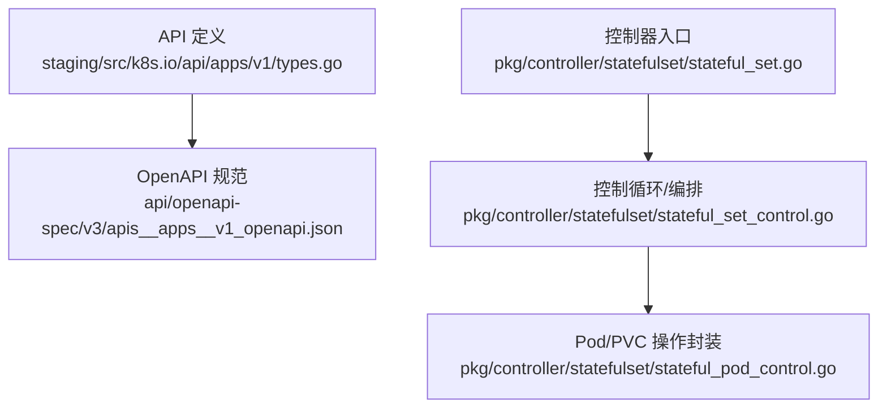
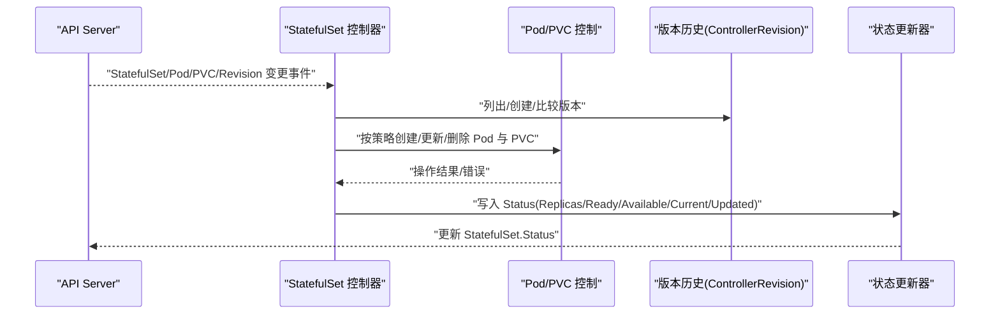
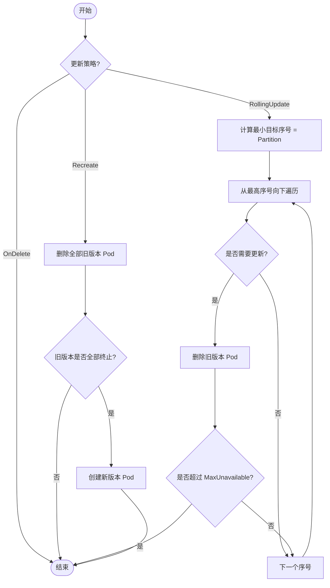
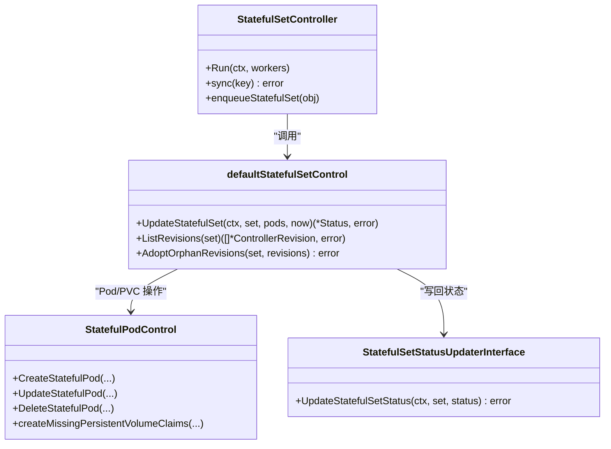

# StatefulSet API

<cite>
**本文引用的文件**   
- [staging/src/k8s.io/api/apps/v1/types.go](file://staging/src/k8s.io/api/apps/v1/types.go)
- [api/openapi-spec/v3/apis__apps__v1_openapi.json](file://api/openapi-spec/v3/apis__apps__v1_openapi.json)
- [pkg/controller/statefulset/stateful_set.go](file://pkg/controller/statefulset/stateful_set.go)
- [pkg/controller/statefulset/stateful_set_control.go](file://pkg/controller/statefulset/stateful_set_control.go)
- [pkg/controller/statefulset/stateful_pod_control.go](file://pkg/controller/statefulset/stateful_pod_control.go)
</cite>

## 目录
1. [简介](#简介)
2. [项目结构](#项目结构)
3. [核心组件](#核心组件)
4. [架构总览](#架构总览)
5. [详细组件分析](#详细组件分析)
6. [依赖关系分析](#依赖关系分析)
7. [性能考量](#性能考量)
8. [故障排查指南](#故障排查指南)
9. [结论](#结论)
10. [附录](#附录)

## 简介
本参考文档面向 Kubernetes StatefulSet 资源，系统化阐述其 REST API 字段与控制器实现语义，重点覆盖：
- 稳定网络标识、持久化存储与有序部署等“有状态”特性
- Pod 管理策略（OrderedReady vs Parallel）
- 更新策略（RollingUpdate、OnDelete、Recreate）
- VolumeClaimTemplates 配置与使用
- 分区更新（Partition）与金丝雀部署实践
- PVC 生命周期管理与数据保留策略
- 生产环境部署案例与故障排查要点

## 项目结构
StatefulSet 的 API 定义位于 apps/v1 包中，OpenAPI 规范由生成产物提供；控制器逻辑位于 pkg/controller/statefulset。

图表来源
- [staging/src/k8s.io/api/apps/v1/types.go:42-297](file://staging/src/k8s.io/api/apps/v1/types.go#L42-L297)
- [api/openapi-spec/v3/apis__apps__v1_openapi.json:1-120](file://api/openapi-spec/v3/apis__apps__v1_openapi.json#L1-L120)
- [pkg/controller/statefulset/stateful_set.go:66-222](file://pkg/controller/statefulset/stateful_set.go#L66-L222)
- [pkg/controller/statefulset/stateful_set_control.go:47-111](file://pkg/controller/statefulset/stateful_set_control.go#L47-L111)
- [pkg/controller/statefulset/stateful_pod_control.go:1-120](file://pkg/controller/statefulset/stateful_pod_control.go#L1-L120)

章节来源
- [staging/src/k8s.io/api/apps/v1/types.go:42-297](file://staging/src/k8s.io/api/apps/v1/types.go#L42-L297)
- [api/openapi-spec/v3/apis__apps__v1_openapi.json:1-120](file://api/openapi-spec/v3/apis__apps__v1_openapi.json#L1-L120)
- [pkg/controller/statefulset/stateful_set.go:66-222](file://pkg/controller/statefulset/stateful_set.go#L66-L222)

## 核心组件
- StatefulSet 对象模型：包含 Spec、Status、列表类型等
- 关键枚举与策略：
  - PodManagementPolicyType：OrderedReady、Parallel
  - StatefulSetUpdateStrategyType：RollingUpdate、OnDelete、Recreate（需特性门控）
  - PersistentVolumeClaimRetentionPolicyType：Retain、Delete
- 滚动更新参数：RollingUpdateStatefulSetStrategy（Partition、MaxUnavailable）
- 序号分配：StatefulSetOrdinals（start）
- 版本历史：ControllerRevision（用于回滚与对比）

章节来源
- [staging/src/k8s.io/api/apps/v1/types.go:68-146](file://staging/src/k8s.io/api/apps/v1/types.go#L68-L146)
- [staging/src/k8s.io/api/apps/v1/types.go:148-197](file://staging/src/k8s.io/api/apps/v1/types.go#L148-L197)
- [staging/src/k8s.io/api/apps/v1/types.go:199-297](file://staging/src/k8s.io/api/apps/v1/types.go#L199-L297)
- [staging/src/k8s.io/api/apps/v1/types.go:1009-1048](file://staging/src/k8s.io/api/apps/v1/types.go#L1009-L1048)

## 架构总览
StatefulSet 控制器通过 Informer 监听 Pods、StatefulSets、PVCs、ControllerRevisions 的变化，将事件入队并串行处理，确保幂等与一致性。核心流程包括：
- 计算当前/更新版本（基于 ControllerRevision）
- 根据策略与 Pod 管理策略执行扩缩容与更新
- 维护 Status 与条件
- 清理历史版本

图表来源
- [pkg/controller/statefulset/stateful_set.go:113-222](file://pkg/controller/statefulset/stateful_set.go#L113-L222)
- [pkg/controller/statefulset/stateful_set_control.go:84-154](file://pkg/controller/statefulset/stateful_set_control.go#L84-L154)
- [pkg/controller/statefulset/stateful_set_control.go:935-972](file://pkg/controller/statefulset/stateful_set_control.go#L935-L972)

## 详细组件分析

### StatefulSet 对象与字段参考
- 顶层字段
  - metadata：标准元数据
  - spec：期望状态
  - status：观测状态（只读）
- Spec 关键字段
  - replicas：副本数
  - selector：标签选择器（必须与模板一致）
  - template：Pod 模板
  - volumeClaimTemplates：PVC 模板列表
  - serviceName：无头服务名，用于稳定 DNS/主机名
  - podManagementPolicy：OrderedReady 或 Parallel
  - updateStrategy：更新策略（RollingUpdate/OnDelete/Recreate）
  - revisionHistoryLimit：保留的历史版本数量
  - minReadySeconds：可用判定等待时间
  - persistentVolumeClaimRetentionPolicy：PVC 生命周期策略
  - ordinals：起始序号（默认从 0 开始）
- Status 关键字段
  - observedGeneration、replicas、readyReplicas、availableReplicas
  - currentReplicas、updatedReplicas
  - currentRevision、updateRevision
  - collisionCount、conditions

章节来源
- [staging/src/k8s.io/api/apps/v1/types.go:42-66](file://staging/src/k8s.io/api/apps/v1/types.go#L42-L66)
- [staging/src/k8s.io/api/apps/v1/types.go:199-297](file://staging/src/k8s.io/api/apps/v1/types.go#L199-L297)
- [staging/src/k8s.io/api/apps/v1/types.go:299-372](file://staging/src/k8s.io/api/apps/v1/types.go#L299-L372)

### Pod 管理策略
- OrderedReady（默认）
  - 扩容时严格按序号递增创建，且前一个就绪后再继续
  - 缩容时严格逆序删除
- Parallel
  - 并行创建/删除，不等待就绪或终止完成
  - 结合 MaxUnavailable 可更灵活地控制并发

章节来源
- [staging/src/k8s.io/api/apps/v1/types.go:68-82](file://staging/src/k8s.io/api/apps/v1/types.go#L68-L82)
- [pkg/controller/statefulset/stateful_set_control.go:875-933](file://pkg/controller/statefulset/stateful_set_control.go#L875-L933)

### 更新策略
- RollingUpdate（默认）
  - 按序号从高到低逐步替换旧版本 Pod
  - 支持 Partition 进行分区更新/金丝雀
  - 支持 MaxUnavailable 限制不可用上限（需特性门控）
- OnDelete
  - 不自动滚动重启，仅手动删除 Pod 后重建为新版本
- Recreate（特性门控）
  - 先删除所有旧版本 Pod，再创建新版本，保证新旧不共存

章节来源
- [staging/src/k8s.io/api/apps/v1/types.go:84-125](file://staging/src/k8s.io/api/apps/v1/types.go#L84-L125)
- [pkg/controller/statefulset/stateful_set_control.go:564-770](file://pkg/controller/statefulset/stateful_set_control.go#L564-L770)
- [pkg/controller/statefulset/stateful_set_control.go:772-817](file://pkg/controller/statefulset/stateful_set_control.go#L772-L817)

### 滚动更新与分区/金丝雀
- Partition
  - 指定分界序号，小于该序号的 Pod 保持当前版本，大于等于的被更新
  - 常用于金丝雀发布：先升级高序号部分，验证后再降低 Partition
- MaxUnavailable
  - 允许在更新期间最多有多少个 Pod 不可用
  - 对 OrderedReady 影响有限（单实例推进），对 Parallel 更有效

图表来源
- [pkg/controller/statefulset/stateful_set_control.go:743-770](file://pkg/controller/statefulset/stateful_set_control.go#L743-L770)
- [pkg/controller/statefulset/stateful_set_control.go:819-933](file://pkg/controller/statefulset/stateful_set_control.go#L819-L933)

### VolumeClaimTemplates 与 PVC 生命周期
- VolumeClaimTemplates
  - 为每个 Pod 索引创建同名 PVC，绑定到对应 Pod
  - 模板中的 storageClassName、accessModes、resources 等决定底层存储
- 生命周期策略 persistentVolumeClaimRetentionPolicy
  - whenDeleted：StatefulSet 被删除时对 PVC 的处理（Retain/Delete）
  - whenScaled：缩容时对多余 PVC 的处理（Retain/Delete）
- 控制器行为
  - 在 Pod Pending 阶段触发缺失 PVC 的创建
  - 在缩容/删除时依据策略调整 PVC 的保留/删除标记

章节来源
- [staging/src/k8s.io/api/apps/v1/types.go:148-182](file://staging/src/k8s.io/api/apps/v1/types.go#L148-L182)
- [staging/src/k8s.io/api/apps/v1/types.go:227-239](file://staging/src/k8s.io/api/apps/v1/types.go#L227-L239)
- [pkg/controller/statefulset/stateful_set_control.go:455-463](file://pkg/controller/statefulset/stateful_set_control.go#L455-L463)
- [pkg/controller/statefulset/stateful_set_control.go:695-709](file://pkg/controller/statefulset/stateful_set_control.go#L695-L709)

### 稳定网络标识
- 通过 serviceName 关联无头 Service
- Pod 获得稳定的 DNS 名称：<statefulsetname>-<podindex>.<serviceName>.<namespace>.svc.cluster.local
- 序号由 Ordinals.start 控制（默认 0）

章节来源
- [staging/src/k8s.io/api/apps/v1/types.go:241-249](file://staging/src/k8s.io/api/apps/v1/types.go#L241-L249)
- [staging/src/k8s.io/api/apps/v1/types.go:184-197](file://staging/src/k8s.io/api/apps/v1/types.go#L184-L197)

### 版本历史与回滚
- ControllerRevision 保存 StatefulSet 的不可变快照
- 控制器维护 CurrentRevision 与 UpdateRevision，并清理超出限制的历史

章节来源
- [staging/src/k8s.io/api/apps/v1/types.go:1009-1048](file://staging/src/k8s.io/api/apps/v1/types.go#L1009-L1048)
- [pkg/controller/statefulset/stateful_set_control.go:177-219](file://pkg/controller/statefulset/stateful_set_control.go#L177-L219)

### 控制器主循环与状态同步
- 事件驱动：Pod/StatefulSet/PVC/Revision 变化入队
- 同步流程：获取/创建版本 -> 计算状态 -> 执行扩缩容/更新 -> 写回 Status
- MinReadySeconds 影响 Available 计数与可用性检查

章节来源
- [pkg/controller/statefulset/stateful_set.go:224-253](file://pkg/controller/statefulset/stateful_set.go#L224-L253)
- [pkg/controller/statefulset/stateful_set.go:524-609](file://pkg/controller/statefulset/stateful_set.go#L524-L609)
- [pkg/controller/statefulset/stateful_set_control.go:374-419](file://pkg/controller/statefulset/stateful_set_control.go#L374-L419)

## 依赖关系分析
- StatefulSet 控制器依赖：
  - Pod、PVC、ControllerRevision 的 Informer/Lister
  - KubeClient 用于读写 API 对象
  - 历史记录接口用于版本管理
  - 状态更新器用于写回 Status

图表来源
- [pkg/controller/statefulset/stateful_set.go:66-95](file://pkg/controller/statefulset/stateful_set.go#L66-L95)
- [pkg/controller/statefulset/stateful_set_control.go:47-82](file://pkg/controller/statefulset/stateful_set_control.go#L47-L82)
- [pkg/controller/statefulset/stateful_set_control.go:935-972](file://pkg/controller/statefulset/stateful_set_control.go#L935-L972)

## 性能考量
- 批量与限流
  - 并行模式下采用慢启动批处理，避免瞬时风暴
  - MaxBatchSize 限制最大并发请求数
- MaxUnavailable 特性
  - 在启用后可提升更新吞吐，但需谨慎评估业务可用性
- 有序模式下的串行推进
  - OrderedReady 天然限制并发，适合强一致场景

章节来源
- [pkg/controller/statefulset/stateful_set_control.go:334-364](file://pkg/controller/statefulset/stateful_set_control.go#L334-L364)
- [pkg/controller/statefulset/stateful_set_control.go:819-933](file://pkg/controller/statefulset/stateful_set_control.go#L819-L933)

## 故障排查指南
- 常见症状与定位
  - 更新停滞：检查 MinReadySeconds、Pod 就绪探针、MaxUnavailable 预算
  - 缩容未释放 PVC：确认 persistentVolumeClaimRetentionPolicy.whenScaled
  - 删除 StatefulSet 后数据丢失：确认 whenDeleted=Retain
  - Recreate 策略报错：确认特性门控已开启
- 关键日志与指标
  - 控制器日志：关注“waiting for Pod to be Running and Ready/Available/Terminate”
  - 指标：UnavailableReplicas、MaxUnavailable（当特性启用）
- 建议步骤
  - 查看 StatefulSet.Status 的 conditions 与修订号
  - 核对 Pod 事件与 PVC 绑定情况
  - 必要时临时切换为 OnDelete 以人工干预

章节来源
- [pkg/controller/statefulset/stateful_set_control.go:455-489](file://pkg/controller/statefulset/stateful_set_control.go#L455-L489)
- [pkg/controller/statefulset/stateful_set_control.go:935-972](file://pkg/controller/statefulset/stateful_set_control.go#L935-L972)

## 结论
StatefulSet 通过稳定标识、持久化模板与有序编排，为数据库、消息队列等有状态应用提供了可靠的运行基座。合理选择 Pod 管理策略与更新策略，配合 Partition 与 MaxUnavailable，可实现安全可控的灰度与金丝雀发布。同时，明确 PVC 生命周期策略，有助于在生产环境中平衡数据安全与资源回收。

## 附录

### REST API 参考（摘要）
- 资源路径
  - /apis/apps/v1/namespaces/{namespace}/statefulsets
  - 子资源：/scale、/status
- 主要字段（节选）
  - spec.selector、spec.template、spec.replicas
  - spec.serviceName、spec.podManagementPolicy
  - spec.updateStrategy.type、rollingUpdate.partition、rollingUpdate.maxUnavailable
  - spec.volumeClaimTemplates[]
  - spec.persistentVolumeClaimRetentionPolicy.whenDeleted、whenScaled
  - spec.ordinals.start
  - status.currentRevision、status.updateRevision、status.conditions

章节来源
- [staging/src/k8s.io/api/apps/v1/types.go:42-297](file://staging/src/k8s.io/api/apps/v1/types.go#L42-L297)
- [api/openapi-spec/v3/apis__apps__v1_openapi.json:1-120](file://api/openapi-spec/v3/apis__apps__v1_openapi.json#L1-L120)

### 生产部署示例（描述性）
- 数据库集群（如 MySQL/PostgreSQL）
  - 使用 serviceName 暴露稳定 DNS
  - 设置 OrderedReady 与 RollingUpdate，Partition 初始值较高，逐步降低
  - 配置 Retain 策略保护数据卷
- 消息队列（如 Kafka/RabbitMQ）
  - 根据节点容量与 I/O 能力设置 replicas 与资源限制
  - 使用 Parallel 与合适的 MaxUnavailable 加速更新
  - 监控 unavailable 指标与 Pod 就绪探针

[本节为概念性说明，不直接分析具体源码文件]