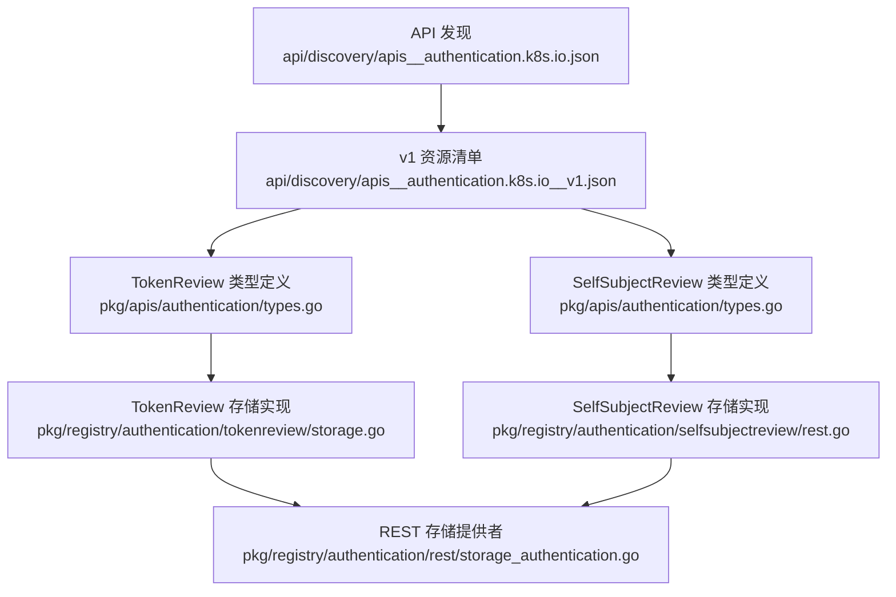
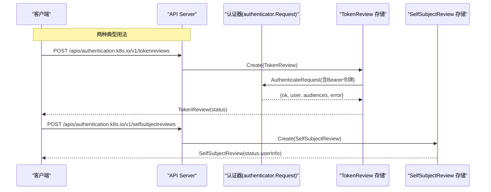
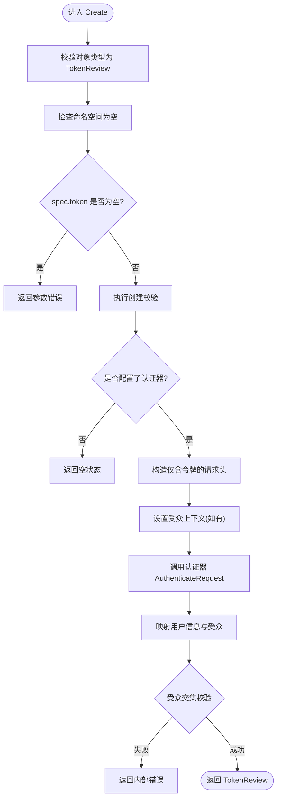
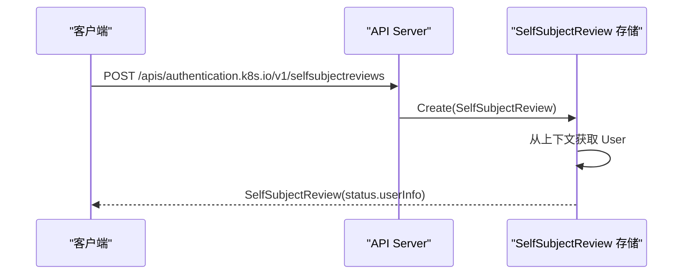
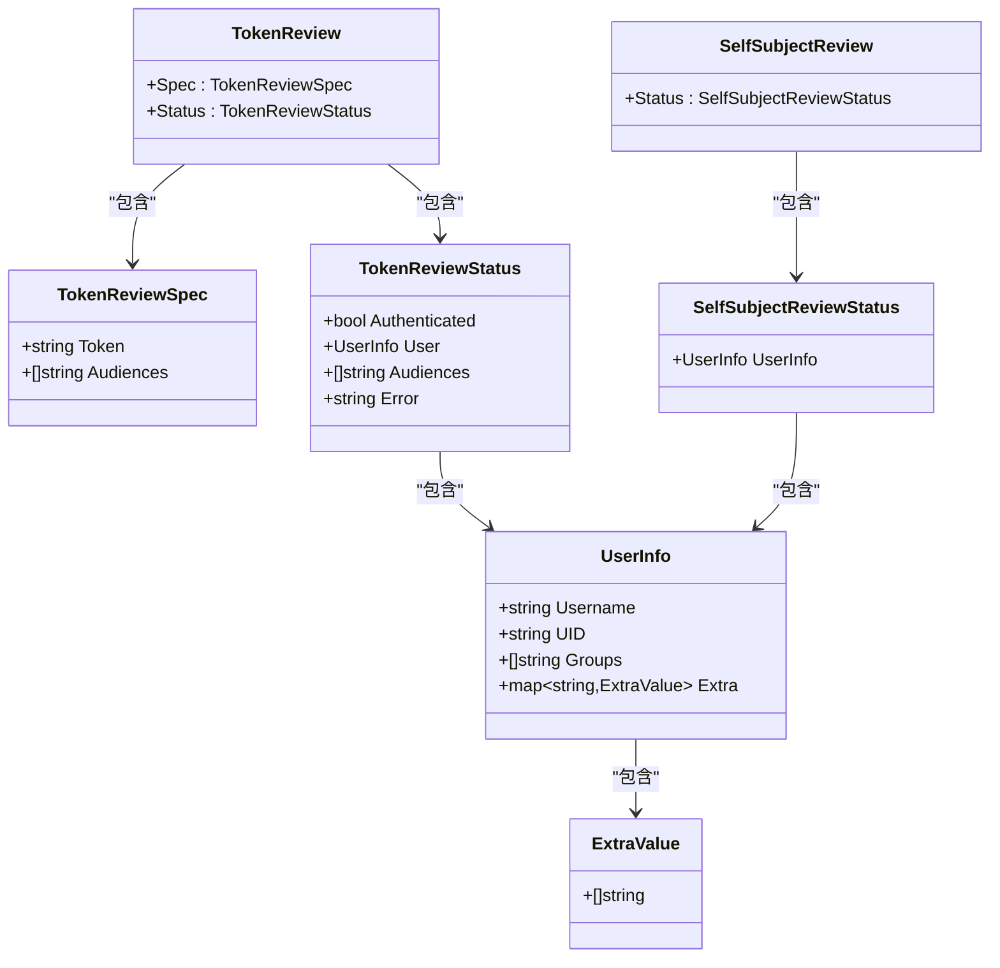
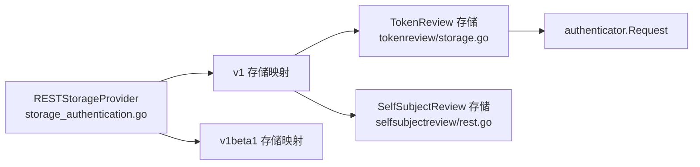

# 认证 API

<cite>
**本文引用的文件**   
- [apis__authentication.k8s.io.json](file://api/discovery/apis__authentication.k8s.io.json)
- [apis__authentication.k8s.io__v1.json](file://api/discovery/apis__authentication.k8s.io__v1.json)
- [types.go](file://pkg/apis/authentication/types.go)
- [doc.go](file://pkg/apis/authentication/v1/doc.go)
- [register.go](file://pkg/apis/authentication/v1/register.go)
- [storage_authentication.go](file://pkg/registry/authentication/rest/storage_authentication.go)
- [rest.go](file://pkg/registry/authentication/selfsubjectreview/rest.go)
- [storage.go](file://pkg/registry/authentication/tokenreview/storage.go)
</cite>

## 目录
1. [简介](#简介)
2. [项目结构](#项目结构)
3. [核心组件](#核心组件)
4. [架构总览](#架构总览)
5. [详细组件分析](#详细组件分析)
6. [依赖关系分析](#依赖关系分析)
7. [性能考虑](#性能考虑)
8. [故障排查指南](#故障排查指南)
9. [结论](#结论)
10. [附录](#附录)

## 简介
本参考文档聚焦 Kubernetes 的 authentication.k8s.io API 组，提供 REST API 规范与实现要点说明。重点覆盖以下资源：
- TokenReview：用于验证外部令牌并返回用户信息
- SelfSubjectReview：用于查询当前请求主体的身份信息

同时，文档解释令牌认证、用户身份识别与“会话”在 Kubernetes 中的工作方式（无状态），并提供与外部认证系统集成的方法、安全配置建议以及常见问题的排查思路。

## 项目结构
authentication.k8s.io 组的发现信息与 v1 版本资源列表如下：
- 组名：authentication.k8s.io
- 首选版本：v1
- v1 资源：tokenreviews、selfsubjectreviews（均为非命名空间范围）

图表来源
- [apis__authentication.k8s.io.json:1-16](file://api/discovery/apis__authentication.k8s.io.json#L1-L16)
- [apis__authentication.k8s.io__v1.json:1-26](file://api/discovery/apis__authentication.k8s.io__v1.json#L1-L26)
- [types.go:44-104](file://pkg/apis/authentication/types.go#L44-L104)
- [storage.go:37-67](file://pkg/registry/authentication/tokenreview/storage.go#L37-L67)
- [rest.go:39-56](file://pkg/registry/authentication/selfsubjectreview/rest.go#L39-L56)
- [storage_authentication.go:33-57](file://pkg/registry/authentication/rest/storage_authentication.go#L33-L57)

章节来源
- [apis__authentication.k8s.io.json:1-16](file://api/discovery/apis__authentication.k8s.io.json#L1-L16)
- [apis__authentication.k8s.io__v1.json:1-26](file://api/discovery/apis__authentication.k8s.io__v1.json#L1-L26)
- [doc.go:17-23](file://pkg/apis/authentication/v1/doc.go#L17-L23)
- [register.go:24-33](file://pkg/apis/authentication/v1/register.go#L24-L33)

## 核心组件
- TokenReview
  - 用途：将不透明令牌提交给 API Server 进行认证，返回是否认证成功及主体信息
  - 关键输入字段：spec.token、spec.audiences
  - 关键输出字段：status.authenticated、status.user、status.audiences、status.error
- SelfSubjectReview
  - 用途：返回发起当前请求的主体身份信息（用户名、UID、组、额外属性）
  - 关键输出字段：status.userInfo.username、uid、groups、extra

章节来源
- [types.go:44-89](file://pkg/apis/authentication/types.go#L44-L89)
- [types.go:168-184](file://pkg/apis/authentication/types.go#L168-L184)

## 架构总览
authentication.k8s.io 组通过 REST 存储提供者注册 v1 资源，并将具体请求路由到各自的存储实现。TokenReview 会调用已配置的 authenticator.Request 对令牌进行校验；SelfSubjectReview 直接从请求上下文中读取已认证的用户信息。

图表来源
- [storage_authentication.go:59-73](file://pkg/registry/authentication/rest/storage_authentication.go#L59-L73)
- [storage.go:69-130](file://pkg/registry/authentication/tokenreview/storage.go#L69-L130)
- [rest.go:64-102](file://pkg/registry/authentication/selfsubjectreview/rest.go#L64-L102)

## 详细组件分析

### TokenReview 资源
- 端点
  - 路径：/apis/authentication.k8s.io/v1/tokenreviews
  - 方法：POST（仅支持 create）
  - 作用域：集群级（非命名空间）
- 请求体关键字段
  - spec.token：必填，不透明令牌字符串
  - spec.audiences：可选，目标受众列表；未设置时默认使用 API Server 的受众
- 响应体关键字段
  - status.authenticated：布尔值，表示是否认证成功
  - status.user：包含 username、uid、groups、extra
  - status.audiences：经鉴权后选择的受众交集
  - status.error：当认证过程中发生错误时的描述
- 处理流程要点
  - 若未配置 token 认证器，直接返回空结果
  - 构造仅包含令牌的请求头，调用 authenticator.Request.AuthenticateRequest
  - 若指定 audiences，需确保返回的 audiences 与请求一致，否则返回内部错误
  - 将认证器返回的用户信息映射到 UserInfo 结构

图表来源
- [storage.go:69-130](file://pkg/registry/authentication/tokenreview/storage.go#L69-L130)

章节来源
- [apis__authentication.k8s.io__v1.json:15-23](file://api/discovery/apis__authentication.k8s.io__v1.json#L15-L23)
- [types.go:44-89](file://pkg/apis/authentication/types.go#L44-L89)
- [storage.go:37-67](file://pkg/registry/authentication/tokenreview/storage.go#L37-L67)
- [storage.go:69-130](file://pkg/registry/authentication/tokenreview/storage.go#L69-L130)

### SelfSubjectReview 资源
- 端点
  - 路径：/apis/authentication.k8s.io/v1/selfsubjectreviews
  - 方法：POST（仅支持 create）
  - 作用域：集群级（非命名空间）
- 请求体：可为空或仅包含元数据
- 响应体关键字段
  - status.userInfo.username、uid、groups、extra：来自当前请求上下文的已认证用户信息
- 处理流程要点
  - 从请求上下文提取 User 对象
  - 若无用户信息，返回参数错误
  - 将用户信息复制到 SelfSubjectReview.Status.UserInfo

图表来源
- [rest.go:64-102](file://pkg/registry/authentication/selfsubjectreview/rest.go#L64-L102)

章节来源
- [apis__authentication.k8s.io__v1.json:6-14](file://api/discovery/apis__authentication.k8s.io__v1.json#L6-L14)
- [types.go:168-184](file://pkg/apis/authentication/types.go#L168-L184)
- [rest.go:39-56](file://pkg/registry/authentication/selfsubjectreview/rest.go#L39-L56)
- [rest.go:64-102](file://pkg/registry/authentication/selfsubjectreview/rest.go#L64-L102)

### 类图：认证相关数据结构

图表来源
- [types.go:44-104](file://pkg/apis/authentication/types.go#L44-L104)
- [types.go:168-184](file://pkg/apis/authentication/types.go#L168-L184)

## 依赖关系分析
- 注册与路由
  - RESTStorageProvider 负责为 authentication.k8s.io 组注册 v1 和 v1beta1 版本的资源
  - v1 版本启用 tokenreviews 与 selfsubjectreviews；v1beta1 仅启用 selfsubjectreviews
- 存储实现
  - TokenReview 存储依赖 authenticator.Request 完成令牌校验
  - SelfSubjectReview 存储依赖请求上下文中的用户信息

图表来源
- [storage_authentication.go:33-57](file://pkg/registry/authentication/rest/storage_authentication.go#L33-L57)
- [storage_authentication.go:59-84](file://pkg/registry/authentication/rest/storage_authentication.go#L59-L84)
- [storage.go:37-47](file://pkg/registry/authentication/tokenreview/storage.go#L37-L47)

章节来源
- [storage_authentication.go:33-57](file://pkg/registry/authentication/rest/storage_authentication.go#L33-L57)
- [storage_authentication.go:59-84](file://pkg/registry/authentication/rest/storage_authentication.go#L59-L84)

## 性能考虑
- TokenReview 每次调用都会触发一次外部认证器的请求，应避免高频重复调用；可在客户端侧缓存短期有效的认证结果（注意受众与过期时间）。
- SelfSubjectReview 仅读取上下文信息，开销极低，适合调试与诊断。
- 合理设置受众列表可减少不必要的跨受众校验分支。

## 故障排查指南
- TokenReview 返回 status.authenticated=false
  - 检查 spec.token 是否正确且未被篡改
  - 确认已正确配置 authenticator.Request
  - 如设置了 audiences，核对返回的 audiences 是否与请求一致
- TokenReview 返回内部错误（受众校验失败）
  - 日志中会记录期望与实际的 audiences 差异，据此调整客户端受众或认证器配置
- SelfSubjectReview 返回参数错误（无用户）
  - 确认请求已通过前置认证链（例如 Bearer Token、证书等）
  - 若启用了用户伪装，确认伪装头有效且被允许

章节来源
- [storage.go:89-114](file://pkg/registry/authentication/tokenreview/storage.go#L89-L114)
- [rest.go:77-80](file://pkg/registry/authentication/selfsubjectreview/rest.go#L77-L80)

## 结论
authentication.k8s.io 组提供了轻量而强大的认证辅助能力：TokenReview 用于将外部令牌接入 Kubernetes 认证体系，SelfSubjectReview 用于快速查看当前主体身份。结合 API Server 的认证链与受众机制，可实现灵活的外部系统集成与安全控制。

## 附录

### REST API 参考表
- TokenReview
  - 路径：/apis/authentication.k8s.io/v1/tokenreviews
  - 方法：POST
  - 作用域：集群级
  - 请求体关键字段：spec.token、spec.audiences
  - 响应体关键字段：status.authenticated、status.user、status.audiences、status.error
- SelfSubjectReview
  - 路径：/apis/authentication.k8s.io/v1/selfsubjectreviews
  - 方法：POST
  - 作用域：集群级
  - 请求体：可空
  - 响应体关键字段：status.userInfo.username、uid、groups、extra

章节来源
- [apis__authentication.k8s.io__v1.json:1-26](file://api/discovery/apis__authentication.k8s.io__v1.json#L1-L26)
- [types.go:44-89](file://pkg/apis/authentication/types.go#L44-L89)
- [types.go:168-184](file://pkg/apis/authentication/types.go#L168-L184)

### 令牌认证与用户身份识别
- 令牌认证
  - 客户端将不透明令牌以 Bearer 方式提交至 TokenReview
  - API Server 委托 authenticator.Request 进行校验，并返回用户信息与受众
- 用户身份识别
  - 所有后续请求由前置认证链解析出用户信息，注入请求上下文
  - SelfSubjectReview 可直接读取该上下文，无需再次认证

章节来源
- [storage.go:93-127](file://pkg/registry/authentication/tokenreview/storage.go#L93-L127)
- [rest.go:77-102](file://pkg/registry/authentication/selfsubjectreview/rest.go#L77-L102)

### “会话”机制说明
- Kubernetes API Server 是无状态的，不维护服务端会话
- 身份凭证通常以令牌形式随请求携带，或由前置代理/网关完成一次性认证后注入上下文
- 如需限制令牌生命周期，应结合令牌签发策略与受众校验

[本节为概念性说明，不直接分析具体文件]

### 多因素认证（MFA）集成建议
- 在 API Server 前部署统一认证网关，完成 MFA 流程
- 网关认证成功后，向下游转发可信的身份信息（如 JWT 或自定义头）
- API Server 侧通过自定义 authenticator 或插件信任上游传递的身份
- 对于需要强绑定受众的场景，使用 TokenReview 明确受众校验

[本节为概念性说明，不直接分析具体文件]

### 与外部认证系统集成
- 通过配置 authenticator.Request 对接外部认证源（如 OIDC、LDAP、企业 SSO）
- 使用 TokenReview 对外部令牌进行二次校验，确保受众与权限边界
- 利用用户 extra 字段扩展身份属性，便于后续授权策略使用

章节来源
- [storage.go:37-47](file://pkg/registry/authentication/tokenreview/storage.go#L37-L47)
- [types.go:91-104](file://pkg/apis/authentication/types.go#L91-L104)

### 安全配置建议
- 最小化受众范围，避免跨受众误用
- 严格校验 TokenReview 返回的 audiences 与请求一致
- 谨慎使用用户伪装头，仅在受控环境中启用
- 定期轮换令牌与密钥，缩短令牌有效期

章节来源
- [types.go:24-40](file://pkg/apis/authentication/types.go#L24-L40)
- [storage.go:111-114](file://pkg/registry/authentication/tokenreview/storage.go#L111-L114)