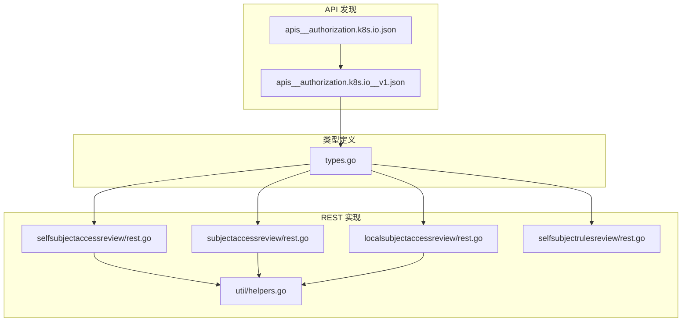
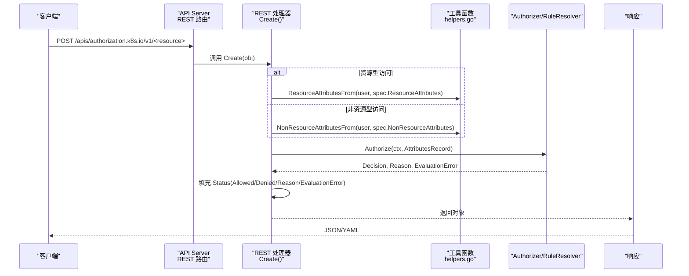
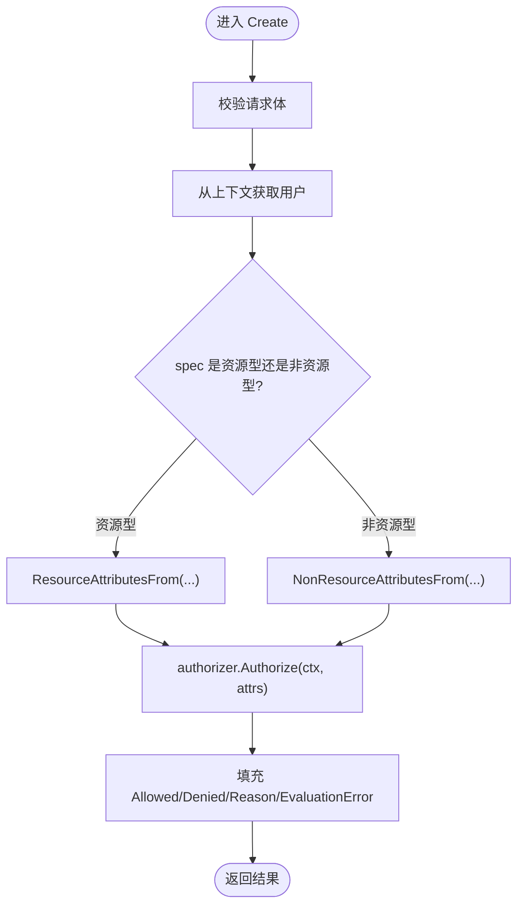
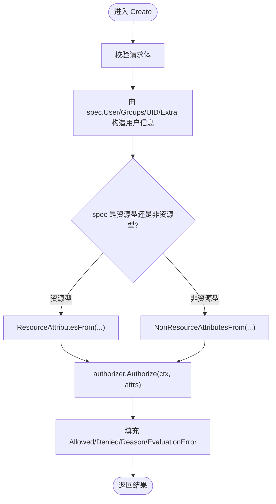
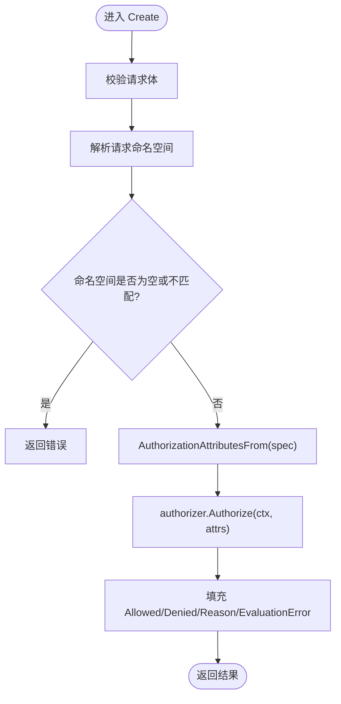
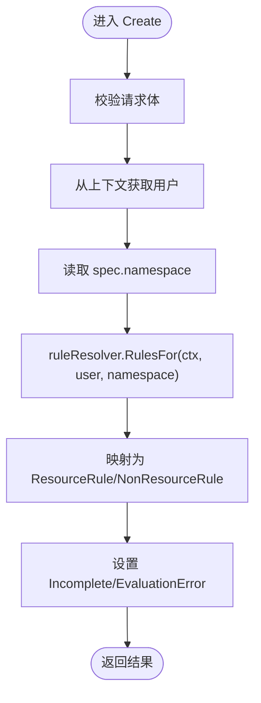
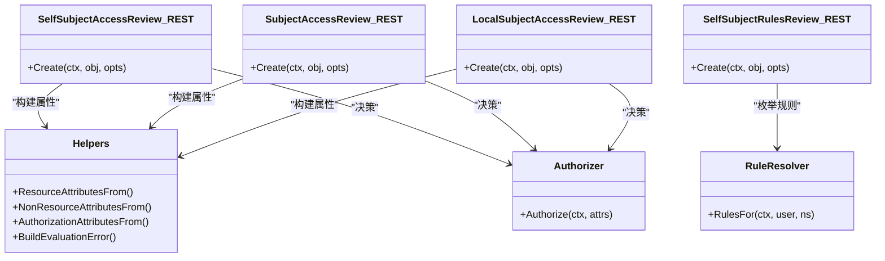

# 授权 API

<cite>
**本文引用的文件**   
- [apis__authorization.k8s.io.json](file://api/discovery/apis__authorization.k8s.io.json)
- [apis__authorization.k8s.io__v1.json](file://api/discovery/apis__authorization.k8s.io__v1.json)
- [types.go](file://pkg/apis/authorization/types.go)
- [rest.go（SelfSubjectAccessReview）](file://pkg/registry/authorization/selfsubjectaccessreview/rest.go)
- [rest.go（SubjectAccessReview）](file://pkg/registry/authorization/subjectaccessreview/rest.go)
- [rest.go（LocalSubjectAccessReview）](file://pkg/registry/authorization/localsubjectaccessreview/rest.go)
- [rest.go（SelfSubjectRulesReview）](file://pkg/registry/authorization/selfsubjectrulesreview/rest.go)
- [helpers.go](file://pkg/registry/authorization/util/helpers.go)
</cite>

## 目录
1. [简介](#简介)
2. [项目结构](#项目结构)
3. [核心组件](#核心组件)
4. [架构总览](#架构总览)
5. [详细组件分析](#详细组件分析)
6. [依赖关系分析](#依赖关系分析)
7. [性能与可扩展性](#性能与可扩展性)
8. [故障排查指南](#故障排查指南)
9. [结论](#结论)
10. [附录：API 参考与示例](#附录api-参考与示例)

## 简介
本文件为 Kubernetes Authorization API 组（authorization.k8s.io/v1）的 REST API 参考文档，聚焦于授权检查资源与权限评估流程。内容涵盖：
- 资源清单与 HTTP 行为
- 请求/响应模型字段说明
- 权限评估流程、策略引擎与决策机制
- 自定义授权策略开发方法
- 测试与调试示例
- 常见问题诊断技巧

## 项目结构
Authorization API 组在发现接口中声明了 v1 版本及四个只支持 create 的资源对象；其数据模型定义位于 pkg/apis/authorization/types.go，REST 实现位于 pkg/registry/authorization 下各子包。

图表来源
- [apis__authorization.k8s.io.json:1-16](file://api/discovery/apis__authorization.k8s.io.json#L1-L16)
- [apis__authorization.k8s.io__v1.json:1-44](file://api/discovery/apis__authorization.k8s.io__v1.json#L1-L44)
- [types.go:1-279](file://pkg/apis/authorization/types.go#L1-L279)
- [rest.go（SelfSubjectAccessReview）:1-100](file://pkg/registry/authorization/selfsubjectaccessreview/rest.go#L1-L100)
- [rest.go（SubjectAccessReview）:1-89](file://pkg/registry/authorization/subjectaccessreview/rest.go#L1-89)
- [rest.go（LocalSubjectAccessReview）:1-98](file://pkg/registry/authorization/localsubjectaccessreview/rest.go#L1-98)
- [rest.go（SelfSubjectRulesReview）:1-127](file://pkg/registry/authorization/selfsubjectrulesreview/rest.go#L1-127)
- [helpers.go:1-241](file://pkg/registry/authorization/util/helpers.go#L1-241)

章节来源
- [apis__authorization.k8s.io.json:1-16](file://api/discovery/apis__authorization.k8s.io.json#L1-L16)
- [apis__authorization.k8s.io__v1.json:1-44](file://api/discovery/apis__authorization.k8s.io__v1.json#L1-44)

## 核心组件
- SelfSubjectAccessReview：当前用户自测某操作是否被允许
- SubjectAccessReview：以任意主体（用户/组/UID/Extra）测试某操作是否被允许
- LocalSubjectAccessReview：命名空间内受限的主体访问审查
- SelfSubjectRulesReview：枚举当前用户在指定命名空间内的可执行规则集合（用于 UI 展示等）

上述资源的共同点：
- 仅支持 create 动词
- 返回状态中包含 Allowed/Denied/Reason/EvaluationError
- 通过 authorizer.Authorize 或 RuleResolver.RulesFor 完成决策

章节来源
- [types.go:25-208](file://pkg/apis/authorization/types.go#L25-L208)
- [types.go:210-279](file://pkg/apis/authorization/types.go#L210-L279)
- [rest.go（SelfSubjectAccessReview）:63-99](file://pkg/registry/authorization/selfsubjectaccessreview/rest.go#L63-L99)
- [rest.go（SubjectAccessReview）:62-88](file://pkg/registry/authorization/subjectaccessreview/rest.go#L62-L88)
- [rest.go（LocalSubjectAccessReview）:63-97](file://pkg/registry/authorization/localsubjectaccessreview/rest.go#L63-L97)
- [rest.go（SelfSubjectRulesReview）:59-96](file://pkg/registry/authorization/selfsubjectrulesreview/rest.go#L59-L96)

## 架构总览
下图展示了从客户端发起 create 到最终返回授权的端到端流程。

图表来源
- [rest.go（SelfSubjectAccessReview）:63-99](file://pkg/registry/authorization/selfsubjectaccessreview/rest.go#L63-L99)
- [rest.go（SubjectAccessReview）:62-88](file://pkg/registry/authorization/subjectaccessreview/rest.go#L62-L88)
- [rest.go（LocalSubjectAccessReview）:63-97](file://pkg/registry/authorization/localsubjectaccessreview/rest.go#L63-L97)
- [helpers.go:33-77](file://pkg/registry/authorization/util/helpers.go#L33-L77)
- [helpers.go:169-177](file://pkg/registry/authorization/util/helpers.go#L169-L177)
- [helpers.go:218-241](file://pkg/registry/authorization/util/helpers.go#L218-L241)

## 详细组件分析

### SelfSubjectAccessReview
- 用途：当前认证用户自测对某资源或非资源的操作是否被允许
- 作用域：集群级（非命名空间）
- 关键流程：
  - 从上下文提取当前用户
  - 根据 spec 构建 AttributesRecord
  - 调用 Authorize 得到决策并回填 status

图表来源
- [rest.go（SelfSubjectAccessReview）:63-99](file://pkg/registry/authorization/selfsubjectaccessreview/rest.go#L63-L99)
- [helpers.go:33-77](file://pkg/registry/authorization/util/helpers.go#L33-L77)
- [helpers.go:169-177](file://pkg/registry/authorization/util/helpers.go#L169-L177)
- [helpers.go:218-241](file://pkg/registry/authorization/util/helpers.go#L218-L241)

章节来源
- [rest.go（SelfSubjectAccessReview）:1-100](file://pkg/registry/authorization/selfsubjectaccessreview/rest.go#L1-L100)

### SubjectAccessReview
- 用途：以任意主体（User/Groups/UID/Extra）测试某操作是否被允许
- 作用域：集群级（非命名空间）
- 关键流程：
  - 使用 spec 中的主体信息构造 user.Info
  - 构建 AttributesRecord 并调用 Authorize

图表来源
- [rest.go（SubjectAccessReview）:62-88](file://pkg/registry/authorization/subjectaccessreview/rest.go#L62-L88)
- [helpers.go:191-208](file://pkg/registry/authorization/util/helpers.go#L191-L208)
- [helpers.go:33-77](file://pkg/registry/authorization/util/helpers.go#L33-L77)
- [helpers.go:169-177](file://pkg/registry/authorization/util/helpers.go#L169-L177)
- [helpers.go:218-241](file://pkg/registry/authorization/util/helpers.go#L218-L241)

章节来源
- [rest.go（SubjectAccessReview）:1-89](file://pkg/registry/authorization/subjectaccessreview/rest.go#L1-L89)

### LocalSubjectAccessReview
- 用途：在特定命名空间内对某主体进行访问审查
- 作用域：命名空间级
- 约束：
  - 必须提供命名空间
  - spec.resourceAttributes.namespace 必须与请求路径上的命名空间一致

图表来源
- [rest.go（LocalSubjectAccessReview）:63-97](file://pkg/registry/authorization/localsubjectaccessreview/rest.go#L63-L97)
- [helpers.go:191-208](file://pkg/registry/authorization/util/helpers.go#L191-L208)
- [helpers.go:218-241](file://pkg/registry/authorization/util/helpers.go#L218-L241)

章节来源
- [rest.go（LocalSubjectAccessReview）:1-98](file://pkg/registry/authorization/localsubjectaccessreview/rest.go#L1-L98)

### SelfSubjectRulesReview
- 用途：枚举当前用户在指定命名空间内可执行的资源与非资源规则（常用于 UI 展示）
- 作用域：集群级（非命名空间），但需要指定 namespace
- 关键流程：
  - 从上下文获取当前用户
  - 调用 RuleResolver.RulesFor 获取规则列表
  - 将结果转换为 ResourceRule/NonResourceRule 并返回

图表来源
- [rest.go（SelfSubjectRulesReview）:59-96](file://pkg/registry/authorization/selfsubjectrulesreview/rest.go#L59-L96)
- [rest.go（SelfSubjectRulesReview）:104-126](file://pkg/registry/authorization/selfsubjectrulesreview/rest.go#L104-L126)

章节来源
- [rest.go（SelfSubjectRulesReview）:1-127](file://pkg/registry/authorization/selfsubjectrulesreview/rest.go#L1-L127)

### 数据模型与字段语义
- SubjectAccessReviewSpec/SelfSubjectAccessReviewSpec：描述待评估的请求，二者均要求 exactly-one 的资源型或非资源型属性
- ResourceAttributes：包含 Namespace/Verb/Group/Version/Resource/Subresource/Name 以及可选的 LabelSelector/FieldSelector
- NonResourceAttributes：Path/Verb
- SubjectAccessReviewStatus：Allowed/Denied/Reason/EvaluationError
- SelfSubjectRulesReview/SubjectRulesReviewStatus：ResourceRules/NonResourceRules/Incomplete/EvaluationError

章节来源
- [types.go:25-208](file://pkg/apis/authorization/types.go#L25-L208)
- [types.go:210-279](file://pkg/apis/authorization/types.go#L210-L279)

## 依赖关系分析
- REST 层依赖：
  - 类型定义：pkg/apis/authorization/types.go
  - 工具函数：pkg/registry/authorization/util/helpers.go
  - 决策器：authorizer.UnconditionalAuthorizer（Authorize）与 authorizer.RuleResolver（RulesFor）
- 选择器处理：
  - helpers.go 负责将 LabelSelector/FieldSelector 的 rawSelector 与 requirements 解析为内部 Requirements，并汇总解析错误至 EvaluationError

图表来源
- [rest.go（SelfSubjectAccessReview）:63-99](file://pkg/registry/authorization/selfsubjectaccessreview/rest.go#L63-L99)
- [rest.go（SubjectAccessReview）:62-88](file://pkg/registry/authorization/subjectaccessreview/rest.go#L62-L88)
- [rest.go（LocalSubjectAccessReview）:63-97](file://pkg/registry/authorization/localsubjectaccessreview/rest.go#L63-L97)
- [rest.go（SelfSubjectRulesReview）:59-96](file://pkg/registry/authorization/selfsubjectrulesreview/rest.go#L59-L96)
- [helpers.go:33-77](file://pkg/registry/authorization/util/helpers.go#L33-L77)
- [helpers.go:169-177](file://pkg/registry/authorization/util/helpers.go#L169-L177)
- [helpers.go:191-208](file://pkg/registry/authorization/util/helpers.go#L191-L208)
- [helpers.go:218-241](file://pkg/registry/authorization/util/helpers.go#L218-L241)

章节来源
- [helpers.go:1-241](file://pkg/registry/authorization/util/helpers.go#L1-L241)

## 性能与可扩展性
- 决策链路短且无持久化存储：REST 层直接调用 Authorizer/RuleResolver，避免 I/O 瓶颈
- 选择器解析开销可控：LabelSelector/FieldSelector 解析仅在创建时发生，错误会被聚合到 EvaluationError 中
- 可扩展点：
  - 自定义 Authorizer 实现：通过 authorizer.UnconditionalAuthorizer 接入外部策略（如 ABAC、Webhook、外部系统）
  - 自定义 RuleResolver 实现：通过 authorizer.RuleResolver 暴露规则枚举能力（供 SelfSubjectRulesReview 使用）

[本节为通用指导，不直接分析具体文件]

## 故障排查指南
- 常见错误来源
  - 缺少用户上下文：SelfSubject* 相关接口需要从请求上下文中提取用户
  - 命名空间不一致：LocalSubjectAccessReview 要求 spec.resourceAttributes.namespace 与请求路径命名空间一致
  - 选择器解析失败：LabelSelector/FieldSelector 的 rawSelector 或 requirements 解析错误会写入 EvaluationError
  - 外部策略异常：Authorizer/RuleResolver 抛出的错误会被聚合到 EvaluationError
- 定位步骤
  - 查看返回对象的 status.EvaluationError 与 status.Reason
  - 确认 spec 中 Exactly-One 约束是否满足（ResourceAttributes 或 NonResourceAttributes 二选一）
  - 对于 LocalSubjectAccessReview，核对命名空间一致性
  - 若使用外部策略，检查策略日志与返回值

章节来源
- [rest.go（SelfSubjectAccessReview）:63-99](file://pkg/registry/authorization/selfsubjectaccessreview/rest.go#L63-L99)
- [rest.go（LocalSubjectAccessReview）:63-97](file://pkg/registry/authorization/localsubjectaccessreview/rest.go#L63-L97)
- [helpers.go:218-241](file://pkg/registry/authorization/util/helpers.go#L218-L241)

## 结论
Authorization API 组提供了标准化的“先试后做”能力，使客户端可在执行敏感操作前快速验证权限。其设计简洁清晰：REST 层只做参数校验与属性转换，真正的策略判断委托给 Authorizer/RuleResolver。借助 EvaluationError 与 Reason，运维与开发者可以高效定位问题并进行策略调优。

[本节为总结性内容，不直接分析具体文件]

## 附录：API 参考与示例

### 资源清单与 HTTP 行为
- API 组与版本：authorization.k8s.io/v1
- 资源与动词：
  - LocalSubjectAccessReview：create（命名空间级）
  - SelfSubjectAccessReview：create（集群级）
  - SelfSubjectRulesReview：create（集群级）
  - SubjectAccessReview：create（集群级）

章节来源
- [apis__authorization.k8s.io__v1.json:1-44](file://api/discovery/apis__authorization.k8s.io__v1.json#L1-44)

### 请求/响应模型要点
- SubjectAccessReviewSpec/SelfSubjectAccessReviewSpec
  - 必须且只能设置 ResourceAttributes 或 NonResourceAttributes 之一
- ResourceAttributes
  - 关键字段：Namespace/Verb/Group/Version/Resource/Subresource/Name
  - 可选限制：LabelSelector/FieldSelector（支持 rawSelector 与 requirements）
- NonResourceAttributes
  - Path/Verb
- SubjectAccessReviewStatus
  - Allowed/Denied/Reason/EvaluationError
- SelfSubjectRulesReview/SubjectRulesReviewStatus
  - ResourceRules/NonResourceRules/Incomplete/EvaluationError

章节来源
- [types.go:25-208](file://pkg/apis/authorization/types.go#L25-L208)
- [types.go:210-279](file://pkg/apis/authorization/types.go#L210-L279)

### 权限评估流程与策略引擎
- 资源型访问：ResourceAttributesFrom -> Authorize
- 非资源型访问：NonResourceAttributesFrom -> Authorize
- 规则枚举：RuleResolver.RulesFor -> 映射为 ResourceRule/NonResourceRule
- 选择器处理：LabelSelector/FieldSelector 解析与错误聚合

章节来源
- [helpers.go:33-77](file://pkg/registry/authorization/util/helpers.go#L33-L77)
- [helpers.go:169-177](file://pkg/registry/authorization/util/helpers.go#L169-L177)
- [helpers.go:191-208](file://pkg/registry/authorization/util/helpers.go#L191-L208)
- [helpers.go:218-241](file://pkg/registry/authorization/util/helpers.go#L218-L241)
- [rest.go（SelfSubjectRulesReview）:59-96](file://pkg/registry/authorization/selfsubjectrulesreview/rest.go#L59-L96)

### 自定义授权策略开发方法
- 实现 authorizer.UnconditionalAuthorizer 接口，并在 Authorize 中依据业务逻辑返回 Allow/Deny/NoOpinion 及原因
- 如需支持 SelfSubjectRulesReview，实现 authorizer.RuleResolver 的 RulesFor，返回资源与非资源规则集
- 将自定义策略注册到 API Server 的 Authorizer/RuleResolver 链中（具体注册方式取决于部署配置）

[本节为通用指导，不直接分析具体文件]

### 权限测试与调试示例（概念性）
- 使用 SelfSubjectAccessReview 测试当前用户对某资源的 get/list/watch/create/update/delete 权限
- 使用 SubjectAccessReview 模拟任意用户/组的访问意图，便于自动化测试与门禁校验
- 使用 LocalSubjectAccessReview 验证命名空间级策略生效情况
- 使用 SelfSubjectRulesReview 生成 UI 可用权限清单，辅助自助排障

[本节为概念性示例，不直接分析具体文件]