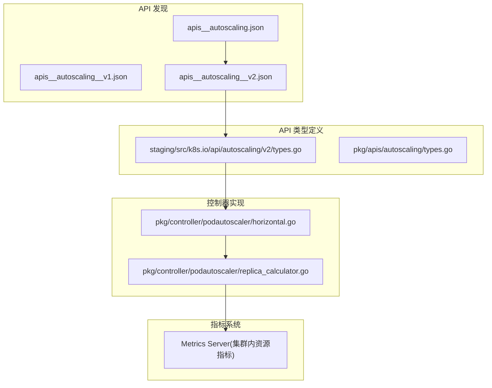
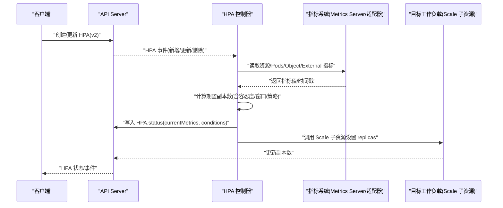
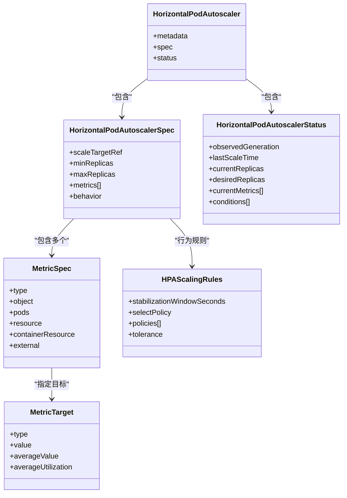
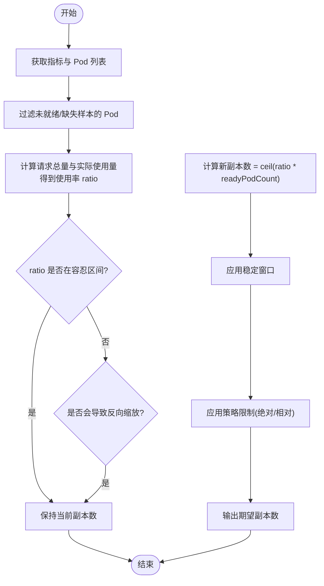
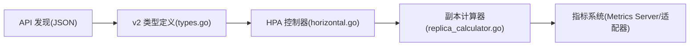

# Autoscaling API

<cite>
**本文引用的文件**   
- [api/discovery/apis__autoscaling.json](file://api/discovery/apis__autoscaling.json)
- [api/discovery/apis__autoscaling__v1.json](file://api/discovery/apis__autoscaling__v1.json)
- [api/discovery/apis__autoscaling__v2.json](file://api/discovery/apis__autoscaling__v2.json)
- [staging/src/k8s.io/api/autoscaling/v2/types.go](file://staging/src/k8s.io/api/autoscaling/v2/types.go)
- [pkg/apis/autoscaling/types.go](file://pkg/apis/autoscaling/types.go)
- [pkg/controller/podautoscaler/horizontal.go](file://pkg/controller/podautoscaler/horizontal.go)
- [pkg/controller/podautoscaler/replica_calculator.go](file://pkg/controller/podautoscaler/replica_calculator.go)
- [cluster/addons/metrics-server/README.md](file://cluster/addons/metrics-server/README.md)
</cite>

## 目录
1. [简介](#简介)
2. [项目结构](#项目结构)
3. [核心组件](#核心组件)
4. [架构总览](#架构总览)
5. [详细组件分析](#详细组件分析)
6. [依赖关系分析](#依赖关系分析)
7. [性能考虑](#性能考虑)
8. [故障排查指南](#故障排查指南)
9. [结论](#结论)
10. [附录](#附录)

## 简介
本文件为 Kubernetes Autoscaling API 组的 REST API 参考与实现说明，聚焦 HorizontalPodAutoscaler（HPA）在 autoscaling/v2 的规范、扩缩容策略、指标收集与缩放算法、配置示例要点、自定义指标接入方法、以及常见问题诊断与优化建议。文档同时给出代码级架构图与时序图，帮助读者从“API 契约”到“控制器实现”建立完整认知。

## 项目结构
- API 发现与资源清单：
  - autoscaling 组包含 v1 与 v2 两个版本，v2 为推荐版本。
  - v2 暴露 horizontalpodautoscalers 资源及其 /status 子资源。
- API 类型定义：
  - staging 中的 v2 types.go 是对外稳定版本的权威定义。
  - pkg/apis/autoscaling/types.go 提供内部兼容与历史类型。
- 控制器实现：
  - podautoscaler 控制器负责监听 HPA 事件、采集指标、计算副本数并执行扩缩容。
- 指标来源：
  - 内置资源指标通过 metrics-server 暴露；外部/对象/自定义指标由相应适配器提供。

**图表来源**
- [api/discovery/apis__autoscaling.json:1-20](file://api/discovery/apis__autoscaling.json#L1-L20)
- [api/discovery/apis__autoscaling__v2.json:1-42](file://api/discovery/apis__autoscaling__v2.json#L1-L42)
- [staging/src/k8s.io/api/autoscaling/v2/types.go:1-627](file://staging/src/k8s.io/api/autoscaling/v2/types.go#L1-L627)
- [pkg/controller/podautoscaler/horizontal.go:1-800](file://pkg/controller/podautoscaler/horizontal.go#L1-L800)
- [pkg/controller/podautoscaler/replica_calculator.go:1-552](file://pkg/controller/podautoscaler/replica_calculator.go#L1-L552)

**章节来源**
- [api/discovery/apis__autoscaling.json:1-20](file://api/discovery/apis__autoscaling.json#L1-L20)
- [api/discovery/apis__autoscaling__v1.json:1-42](file://api/discovery/apis__autoscaling__v1.json#L1-L42)
- [api/discovery/apis__autoscaling__v2.json:1-42](file://api/discovery/apis__autoscaling__v2.json#L1-L42)

## 核心组件
- HorizontalPodAutoscaler（HPA）
  - 目标资源引用：scaleTargetRef（支持 Deployment、StatefulSet、ReplicaSet、Job、CronJob 等实现了 scale 子资源的资源）。
  - 副本范围：minReplicas、maxReplicas。
  - 指标集合：metrics[]，支持 Resource、ContainerResource、Pods、Object、External 五类。
  - 行为策略：behavior.scaleUp/scaleDown，含 StabilizationWindowSeconds、SelectPolicy、Policies[]、Tolerance。
- 指标源与目标
  - MetricSpec.Type 决定数据来源；MetricTarget.Type 决定目标形式（Value/AverageValue/Utilization）。
  - 资源指标支持按容器或 Pod 级别聚合。
- 状态与条件
  - status.currentMetrics、desiredReplicas、conditions（ScalingActive、AbleToScale、ScalingLimited、ScaledToZero）。

**章节来源**
- [staging/src/k8s.io/api/autoscaling/v2/types.go:31-93](file://staging/src/k8s.io/api/autoscaling/v2/types.go#L31-L93)
- [staging/src/k8s.io/api/autoscaling/v2/types.go:110-153](file://staging/src/k8s.io/api/autoscaling/v2/types.go#L110-L153)
- [staging/src/k8s.io/api/autoscaling/v2/types.go:155-232](file://staging/src/k8s.io/api/autoscaling/v2/types.go#L155-L232)
- [staging/src/k8s.io/api/autoscaling/v2/types.go:259-288](file://staging/src/k8s.io/api/autoscaling/v2/types.go#L259-L288)
- [staging/src/k8s.io/api/autoscaling/v2/types.go:371-404](file://staging/src/k8s.io/api/autoscaling/v2/types.go#L371-L404)
- [staging/src/k8s.io/api/autoscaling/v2/types.go:406-488](file://staging/src/k8s.io/api/autoscaling/v2/types.go#L406-L488)
- [pkg/apis/autoscaling/types.go:76-109](file://pkg/apis/autoscaling/types.go#L76-L109)
- [pkg/apis/autoscaling/types.go:111-183](file://pkg/apis/autoscaling/types.go#L111-L183)
- [pkg/apis/autoscaling/types.go:208-276](file://pkg/apis/autoscaling/types.go#L208-L276)
- [pkg/apis/autoscaling/types.go:347-375](file://pkg/apis/autoscaling/types.go#L347-L375)
- [pkg/apis/autoscaling/types.go:377-460](file://pkg/apis/autoscaling/types.go#L377-L460)

## 架构总览
HPA 控制面关键交互：
- API Server 暴露 autoscaling/v2 的 horizontalpodautoscalers 资源及 /status 子资源。
- HPA 控制器监听 HPA 变更，解析 selector，拉取指标，计算期望副本数，应用扩缩容。
- 指标来源：
  - 资源指标：metrics-server 提供 CPU/内存等资源使用率与用量。
  - Pods/Object/External 指标：由对应适配器/插件提供。

**图表来源**
- [api/discovery/apis__autoscaling__v2.json:1-42](file://api/discovery/apis__autoscaling__v2.json#L1-L42)
- [pkg/controller/podautoscaler/horizontal.go:224-247](file://pkg/controller/podautoscaler/horizontal.go#L224-L247)
- [pkg/controller/podautoscaler/horizontal.go:372-426](file://pkg/controller/podautoscaler/horizontal.go#L372-L426)
- [pkg/controller/podautoscaler/replica_calculator.go:78-165](file://pkg/controller/podautoscaler/replica_calculator.go#L78-L165)

## 详细组件分析

### HPA 资源模型（v2）
- 关键字段
  - spec.scaleTargetRef：目标资源引用（kind/name/apiVersion）。
  - spec.minReplicas/spec.maxReplicas：副本上下界。
  - spec.metrics[]：多指标源列表，最终取各指标计算的副本数的最大值。
  - spec.behavior：扩缩方向的行为规则（窗口、策略选择、策略列表、容忍度）。
- 指标类型
  - Resource/ContainerResource：基于请求值的利用率或绝对用量。
  - Pods：每个 Pod 的自定义指标平均值。
  - Object：针对某个 K8s 对象的指标（如 Ingress QPS）。
  - External：集群外全局指标（如队列长度、LB QPS）。
- 目标类型
  - Utilization：百分比（仅适用于 Resource/ContainerResource）。
  - Value/AverageValue：绝对数值或每 Pod 平均值。
- 状态与条件
  - currentMetrics：最近一次读取的各指标状态。
  - desiredReplicas/currentReplicas：期望/当前副本数。
  - conditions：ScalingActive/AbleToScale/ScalingLimited/ScaledToZero。

**图表来源**
- [staging/src/k8s.io/api/autoscaling/v2/types.go:31-93](file://staging/src/k8s.io/api/autoscaling/v2/types.go#L31-L93)
- [staging/src/k8s.io/api/autoscaling/v2/types.go:110-153](file://staging/src/k8s.io/api/autoscaling/v2/types.go#L110-L153)
- [staging/src/k8s.io/api/autoscaling/v2/types.go:155-232](file://staging/src/k8s.io/api/autoscaling/v2/types.go#L155-L232)
- [staging/src/k8s.io/api/autoscaling/v2/types.go:406-488](file://staging/src/k8s.io/api/autoscaling/v2/types.go#L406-L488)

**章节来源**
- [staging/src/k8s.io/api/autoscaling/v2/types.go:31-93](file://staging/src/k8s.io/api/autoscaling/v2/types.go#L31-L93)
- [staging/src/k8s.io/api/autoscaling/v2/types.go:110-153](file://staging/src/k8s.io/api/autoscaling/v2/types.go#L110-L153)
- [staging/src/k8s.io/api/autoscaling/v2/types.go:155-232](file://staging/src/k8s.io/api/autoscaling/v2/types.go#L155-L232)
- [staging/src/k8s.io/api/autoscaling/v2/types.go:259-288](file://staging/src/k8s.io/api/autoscaling/v2/types.go#L259-L288)
- [staging/src/k8s.io/api/autoscaling/v2/types.go:371-404](file://staging/src/k8s.io/api/autoscaling/v2/types.go#L371-L404)
- [staging/src/k8s.io/api/autoscaling/v2/types.go:406-488](file://staging/src/k8s.io/api/autoscaling/v2/types.go#L406-L488)

### 扩缩容策略与算法
- 策略选择与窗口
  - stabilizationWindowSeconds：过去一段时间内的推荐副本数窗口，用于抑制抖动。
  - selectPolicy：Max/Min/Disabled，决定在多策略下如何选择。
  - policies[]：每条策略限制单位时间窗口的最大变化量（绝对或相对）。
- 容忍度（Tolerance）
  - 当实际使用率与目标的比值落在容忍区间内时，不触发扩缩容，避免频繁抖动。
- 计算流程（以资源利用率为例）
  - 获取指标与 Pod 列表，过滤未就绪/缺失样本的 Pod。
  - 计算请求总量与实际使用量，得到使用率 ratio。
  - 若 ratio 超出容忍区间且不会导致反向缩放，则按 ceil(ratio * readyPodCount) 计算新副本数。
  - 结合窗口与策略对最终结果进行平滑与限幅。

**图表来源**
- [pkg/controller/podautoscaler/replica_calculator.go:78-165](file://pkg/controller/podautoscaler/replica_calculator.go#L78-L165)
- [pkg/controller/podautoscaler/replica_calculator.go:192-265](file://pkg/controller/podautoscaler/replica_calculator.go#L192-L265)
- [pkg/controller/podautoscaler/horizontal.go:372-426](file://pkg/controller/podautoscaler/horizontal.go#L372-L426)

**章节来源**
- [staging/src/k8s.io/api/autoscaling/v2/types.go:186-232](file://staging/src/k8s.io/api/autoscaling/v2/types.go#L186-L232)
- [pkg/controller/podautoscaler/replica_calculator.go:78-165](file://pkg/controller/podautoscaler/replica_calculator.go#L78-L165)
- [pkg/controller/podautoscaler/replica_calculator.go:192-265](file://pkg/controller/podautoscaler/replica_calculator.go#L192-L265)
- [pkg/controller/podautoscaler/horizontal.go:372-426](file://pkg/controller/podautoscaler/horizontal.go#L372-L426)

### 指标收集与适配
- 资源指标（CPU/内存等）
  - 由 metrics-server 提供，HPA 控制器通过 metrics client 获取。
  - 支持按容器或 Pod 级别聚合。
- Pods/Object/External 指标
  - 由各自适配器实现，HPA 控制器通过统一接口获取并按平均或总量方式处理。
- 指标状态回写
  - HPA 将每次读取的指标值、时间戳写入 status.currentMetrics，便于观测与排障。

**章节来源**
- [cluster/addons/metrics-server/README.md:1-19](file://cluster/addons/metrics-server/README.md#L1-L19)
- [pkg/controller/podautoscaler/horizontal.go:595-631](file://pkg/controller/podautoscaler/horizontal.go#L595-L631)
- [pkg/controller/podautoscaler/horizontal.go:633-655](file://pkg/controller/podautoscaler/horizontal.go#L633-L655)
- [pkg/controller/podautoscaler/horizontal.go:657-698](file://pkg/controller/podautoscaler/horizontal.go#L657-L698)
- [pkg/controller/podautoscaler/horizontal.go:753-800](file://pkg/controller/podautoscaler/horizontal.go#L753-L800)

### 扩缩容配置示例要点
- 基本结构
  - apiVersion: autoscaling/v2
  - kind: HorizontalPodAutoscaler
  - spec.scaleTargetRef.kind/name
  - spec.minReplicas/spec.maxReplicas
  - spec.metrics[] 中至少一项
  - spec.behavior 可选，用于精细控制
- 常见模式
  - 基于 CPU 利用率的自动扩缩容（AverageUtilization）。
  - 基于自定义业务指标（External/Pods）的平均值目标（AverageValue）。
  - 基于对象指标（Object）的 QPS/延迟目标。
- 注意
  - minReplicas=0 需要启用相关特性门控并配置 Object/External 指标。
  - 多指标场景下，取各指标计算出的副本数最大值作为最终期望。

**章节来源**
- [staging/src/k8s.io/api/autoscaling/v2/types.go:52-93](file://staging/src/k8s.io/api/autoscaling/v2/types.go#L52-L93)
- [staging/src/k8s.io/api/autoscaling/v2/types.go:110-153](file://staging/src/k8s.io/api/autoscaling/v2/types.go#L110-L153)
- [staging/src/k8s.io/api/autoscaling/v2/types.go:155-232](file://staging/src/k8s.io/api/autoscaling/v2/types.go#L155-L232)

### 自定义指标的实现方法
- 指标提供者
  - 实现外部指标适配器，向 API Server 的 metrics 接口暴露命名指标与标签选择器。
- HPA 侧消费
  - 在 spec.metrics[] 中使用 type=External 或 Pods/Object，指定 metric.name 与 selector。
  - 控制器会按 AverageValue 或 Value 目标计算副本数。
- 验证与观测
  - 查看 HPA.status.currentMetrics 中 External/Pods/Object 的 current 值与时间戳。
  - 关注 conditions 中 ScalingActive/AbleToScale 的状态与原因。

**章节来源**
- [staging/src/k8s.io/api/autoscaling/v2/types.go:259-288](file://staging/src/k8s.io/api/autoscaling/v2/types.go#L259-L288)
- [staging/src/k8s.io/api/autoscaling/v2/types.go:348-357](file://staging/src/k8s.io/api/autoscaling/v2/types.go#L348-L357)
- [pkg/controller/podautoscaler/horizontal.go:753-800](file://pkg/controller/podautoscaler/horizontal.go#L753-L800)

## 依赖关系分析
- API 发现与版本
  - apis__autoscaling.json 声明组名与首选版本（v2）。
  - apis__autoscaling__v2.json 列出 horizontalpodautoscalers 资源与 verbs。
- 类型定义与实现
  - staging v2 types.go 是对外契约；pkg/apis/autoscaling/types.go 提供内部兼容。
  - 控制器 horizontal.go 与 replica_calculator.go 实现指标采集、计算与扩缩容逻辑。

**图表来源**
- [api/discovery/apis__autoscaling.json:1-20](file://api/discovery/apis__autoscaling.json#L1-L20)
- [api/discovery/apis__autoscaling__v2.json:1-42](file://api/discovery/apis__autoscaling__v2.json#L1-L42)
- [staging/src/k8s.io/api/autoscaling/v2/types.go:1-627](file://staging/src/k8s.io/api/autoscaling/v2/types.go#L1-L627)
- [pkg/controller/podautoscaler/horizontal.go:1-800](file://pkg/controller/podautoscaler/horizontal.go#L1-L800)
- [pkg/controller/podautoscaler/replica_calculator.go:1-552](file://pkg/controller/podautoscaler/replica_calculator.go#L1-L552)

**章节来源**
- [api/discovery/apis__autoscaling.json:1-20](file://api/discovery/apis__autoscaling.json#L1-L20)
- [api/discovery/apis__autoscaling__v2.json:1-42](file://api/discovery/apis__autoscaling__v2.json#L1-L42)
- [staging/src/k8s.io/api/autoscaling/v2/types.go:1-627](file://staging/src/k8s.io/api/autoscaling/v2/types.go#L1-L627)
- [pkg/controller/podautoscaler/horizontal.go:1-800](file://pkg/controller/podautoscaler/horizontal.go#L1-L800)
- [pkg/controller/podautoscaler/replica_calculator.go:1-552](file://pkg/controller/podautoscaler/replica_calculator.go#L1-L552)

## 性能考虑
- 指标采样与延迟
  - 合理设置 CPU 初始化周期与初始就绪延迟，避免冷启动误判。
- 容忍度与窗口
  - 适当增大 tolerance 与 stabilizationWindowSeconds 可显著降低抖动与不必要的扩缩容。
- 策略选择
  - 在高并发突发场景，优先 Max 策略快速扩容；在成本敏感场景，采用 Min 策略保守调整。
- 资源指标精度
  - 确保 metrics-server 具备足够资源与副本数，避免被节流或 OOM。

[本节为通用指导，无需特定文件来源]

## 故障排查指南
- 常见问题定位
  - 检查 HPA.conditions：
    - ScalingActive=False：可能缺少有效指标或选择器无效。
    - AbleToScale=False：可能存在临时问题（如无法访问目标 scale 子资源）。
    - ScalingLimited=True：计算出的副本数超出 min/max 边界。
  - 查看 HPA.status.currentMetrics：确认各指标是否有值、时间戳是否新鲜。
  - 观察事件：控制器会在选择器冲突、指标不可用等情况下发 Warning 事件。
- 指标链路排查
  - 资源指标：确认 metrics-server 运行正常、未被节流。
  - 自定义指标：确认适配器已正确暴露指标名称与标签选择器。
- 扩缩容不生效
  - 检查容忍度是否过宽、窗口是否过长导致抑制。
  - 检查策略是否限制了变化幅度。
  - 确认目标资源实现了 scale 子资源且 HPA 有权限访问。

**章节来源**
- [pkg/controller/podautoscaler/horizontal.go:428-471](file://pkg/controller/podautoscaler/horizontal.go#L428-L471)
- [pkg/controller/podautoscaler/horizontal.go:372-426](file://pkg/controller/podautoscaler/horizontal.go#L372-L426)
- [cluster/addons/metrics-server/README.md:1-19](file://cluster/addons/metrics-server/README.md#L1-L19)

## 结论
HPA v2 提供了灵活而强大的水平扩缩容能力，覆盖资源、容器、Pod、对象与外部指标多种来源，并通过行为策略与容忍度机制保障稳定性。理解其 API 契约、控制器实现与指标链路，有助于在生产环境中构建高可用、低抖动的弹性系统。

[本节为总结性内容，无需特定文件来源]

## 附录
- REST 资源与动词
  - 资源：horizontalpodautoscalers（namespaced），支持 create/delete/get/list/watch/update/patch。
  - 子资源：horizontalpodautoscalers/status，支持 get/patch/update。
- 版本信息
  - autoscaling 组包含 v1 与 v2，v2 为推荐版本。

**章节来源**
- [api/discovery/apis__autoscaling__v1.json:1-42](file://api/discovery/apis__autoscaling__v1.json#L1-L42)
- [api/discovery/apis__autoscaling__v2.json:1-42](file://api/discovery/apis__autoscaling__v2.json#L1-L42)