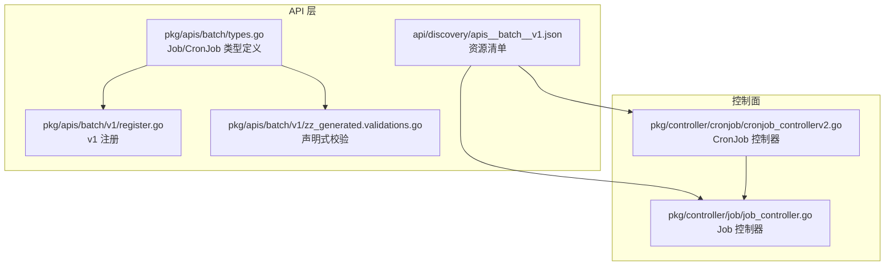
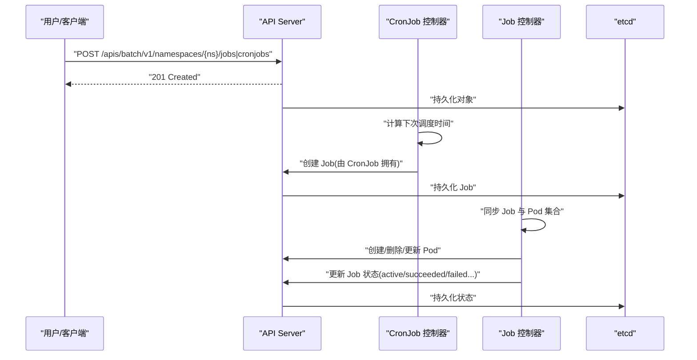
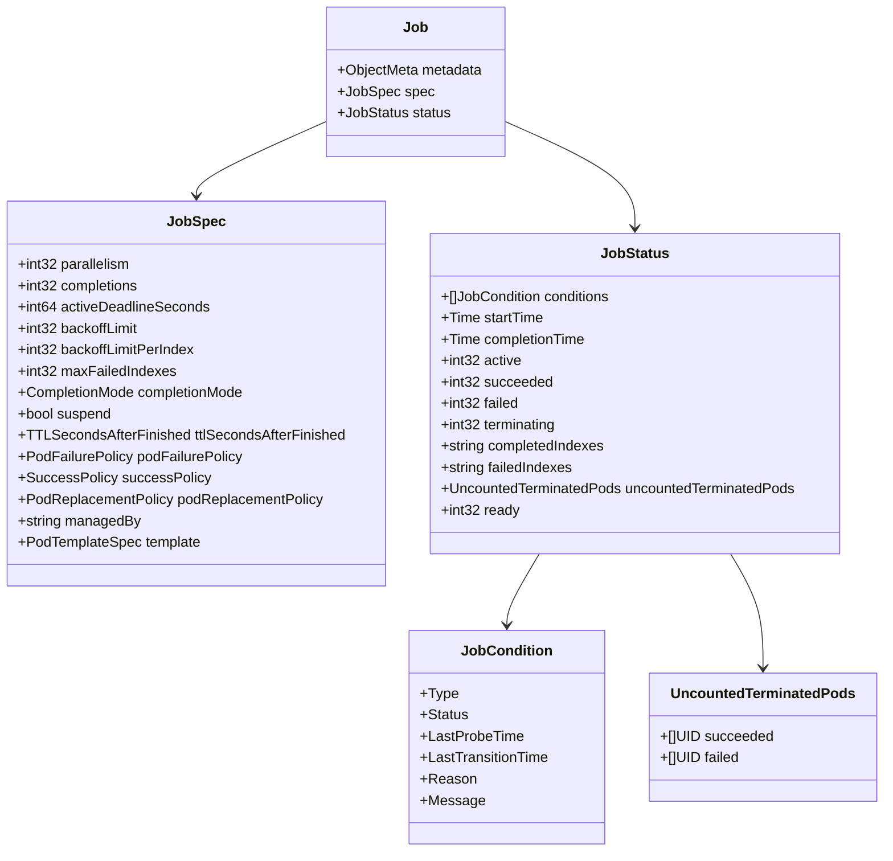
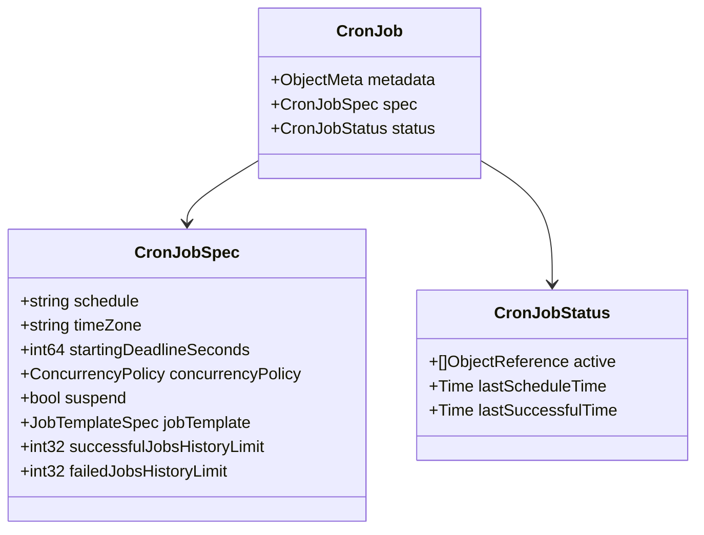
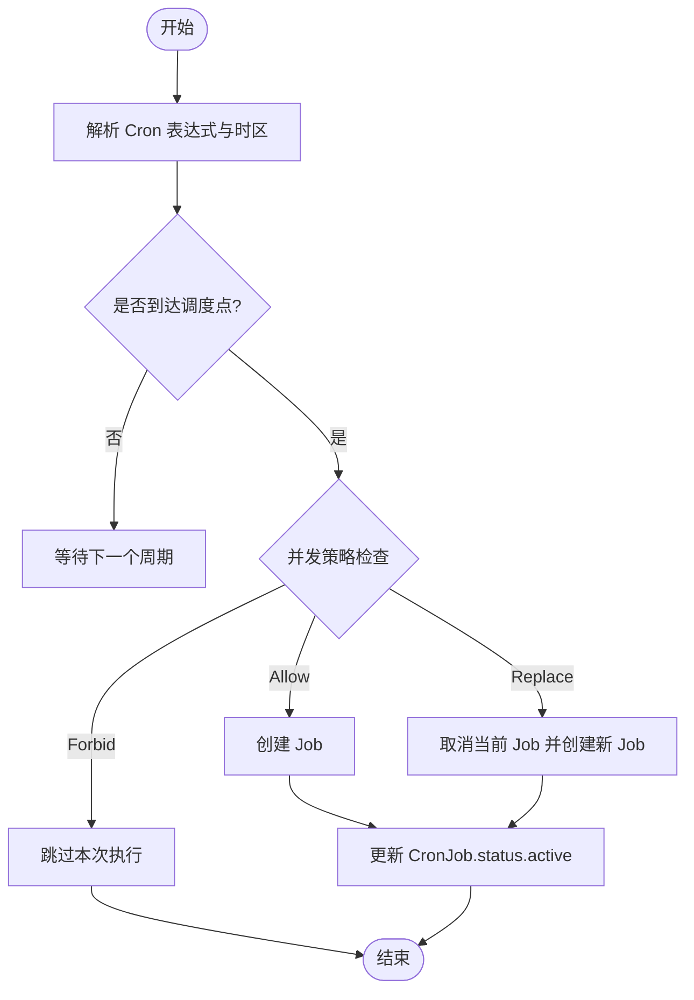
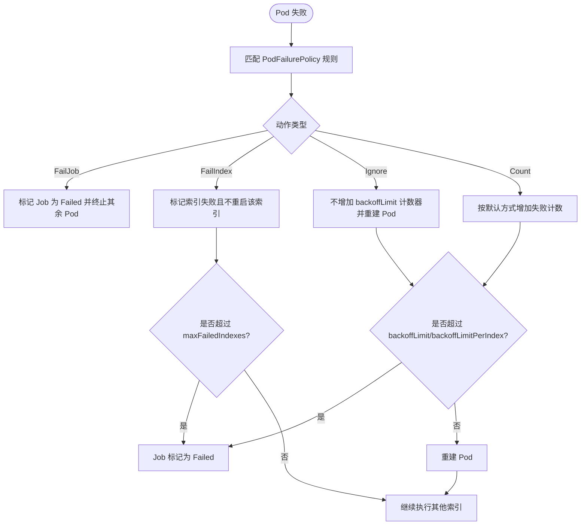
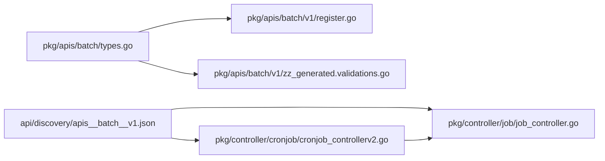

# Batch API

<cite>
**本文引用的文件**   
- [apis__batch.json](file://api/discovery/apis__batch.json)
- [apis__batch__v1.json](file://api/discovery/apis__batch__v1.json)
- [types.go](file://pkg/apis/batch/types.go)
- [register.go](file://pkg/apis/batch/v1/register.go)
- [zz_generated.validations.go](file://pkg/apis/batch/v1/zz_generated.validations.go)
- [job_controller.go](file://pkg/controller/job/job_controller.go)
- [cronjob_controllerv2.go](file://pkg/controller/cronjob/cronjob_controllerv2.go)
</cite>

## 目录
1. [简介](#简介)
2. [项目结构](#项目结构)
3. [核心组件](#核心组件)
4. [架构总览](#架构总览)
5. [详细组件分析](#详细组件分析)
6. [依赖关系分析](#依赖关系分析)
7. [性能考虑](#性能考虑)
8. [故障排查指南](#故障排查指南)
9. [结论](#结论)
10. [附录](#附录)

## 简介
本文件为 Kubernetes Batch API 组的完整 REST API 参考与实现说明，覆盖以下资源：
- Job：一次性批处理任务
- CronJob：基于时间表的周期性任务（内部创建并管理 Job）

文档内容包括：
- API 规范与字段语义
- 任务调度、重试机制与失败处理策略
- 配置示例路径与监控方案
- 大规模任务执行的性能优化方法
- 调试与故障排查指南

## 项目结构
Batch API 的核心由“API 类型定义 + 控制器实现”两部分组成：
- API 类型定义位于 pkg/apis/batch/types.go，包含 Job、CronJob 及其相关枚举、策略等
- v1 版本注册与默认值/转换逻辑位于 pkg/apis/batch/v1/*
- 控制器实现分别位于：
  - Job 控制器：pkg/controller/job/job_controller.go
  - CronJob 控制器：pkg/controller/cronjob/cronjob_controllerv2.go
- 发现文档位于 api/discovery/apis__batch*.json，描述可用的 API 组、版本与资源

图示来源
- [types.go:62-750](file://pkg/apis/batch/types.go#L62-L750)
- [register.go:24-46](file://pkg/apis/batch/v1/register.go#L24-L46)
- [zz_generated.validations.go:41-77](file://pkg/apis/batch/v1/zz_generated.validations.go#L41-L77)
- [apis__batch__v1.json:1-73](file://api/discovery/apis__batch__v1.json#L1-L73)
- [job_controller.go:89-155](file://pkg/controller/job/job_controller.go#L89-L155)
- [cronjob_controllerv2.go:64-154](file://pkg/controller/cronjob/cronjob_controllerv2.go#L64-L154)

章节来源
- [apis__batch.json:1-16](file://api/discovery/apis__batch.json#L1-L16)
- [apis__batch__v1.json:1-73](file://api/discovery/apis__batch__v1.json#L1-L73)
- [types.go:62-750](file://pkg/apis/batch/types.go#L62-L750)
- [register.go:24-46](file://pkg/apis/batch/v1/register.go#L24-L46)
- [zz_generated.validations.go:41-77](file://pkg/apis/batch/v1/zz_generated.validations.go#L41-L77)
- [job_controller.go:89-155](file://pkg/controller/job/job_controller.go#L89-L155)
- [cronjob_controllerv2.go:64-154](file://pkg/controller/cronjob/cronjob_controllerv2.go#L64-L154)

## 核心组件
- Job
  - 用于运行一次性任务。通过 spec.completions 指定期望成功完成的 Pod 数量；spec.parallelism 限制并发 Pod 数；支持索引模式（Indexed）与非索引模式（NonIndexed）。
  - 关键状态字段包括 active、succeeded、failed、terminating、completedIndexes、failedIndexes 等。
- CronJob
  - 基于 cron 表达式定时触发 Job。支持并发策略（Allow/Forbid/Replace）、时区、起始截止时间、历史保留策略等。
  - 运行时维护 Active 列表、最近一次计划时间与最近一次成功完成时间。

章节来源
- [types.go:305-472](file://pkg/apis/batch/types.go#L305-L472)
- [types.go:474-579](file://pkg/apis/batch/types.go#L474-L579)
- [types.go:634-749](file://pkg/apis/batch/types.go#L634-L749)

## 架构总览
Batch API 的端到端流程如下：
- 用户通过 REST API 提交 Job 或 CronJob
- API Server 持久化对象并返回
- CronJob 控制器根据调度规则创建 Job
- Job 控制器根据 Job 规格创建/管理 Pod，更新 Job 状态
- 事件与指标被记录到集群中

图示来源
- [apis__batch__v1.json:1-73](file://api/discovery/apis__batch__v1.json#L1-L73)
- [cronjob_controllerv2.go:156-200](file://pkg/controller/cronjob/cronjob_controllerv2.go#L156-L200)
- [job_controller.go:89-155](file://pkg/controller/job/job_controller.go#L89-L155)

## 详细组件分析

### Job 资源
- 资源定位
  - Group: batch
  - Version: v1
  - Resource: jobs
  - Namespaced: true
  - 子资源: jobs/status
- 支持的动词
  - create, delete, deletecollection, get, list, patch, update, watch
- 关键字段与行为
  - spec.completions：期望成功完成的 Pod 数
  - spec.parallelism：最大并发 Pod 数
  - spec.activeDeadlineSeconds：作业存活上限
  - spec.backoffLimit：Pod 失败重试上限
  - spec.backoffLimitPerIndex：索引级失败上限（需 Indexed 模式）
  - spec.maxFailedIndexes：索引失败总数阈值（配合 backoffLimitPerIndex）
  - spec.completionMode：NonIndexed 或 Indexed
  - spec.suspend：暂停/恢复作业
  - spec.ttlSecondsAfterFinished：完成后自动清理时间
  - spec.podFailurePolicy：按退出码或 Pod 条件定制失败处理
  - spec.successPolicy：提前判定成功的规则（仅 Indexed）
  - spec.podReplacementPolicy：何时重建 Pod（TerminatingOrFailed/Failed）
- 状态字段
  - conditions：Complete/Failed/Suspended/FailureTarget/SuccessCriteriaMet
  - startTime/completionTime
  - active/succeeded/failed/terminating
  - completedIndexes/failedIndexes
  - uncountedTerminatedPods：未计入计数器的已终止 Pod UID 列表
  - ready：就绪且非终止的活跃 Pod 数

图示来源
- [types.go:62-78](file://pkg/apis/batch/types.go#L62-L78)
- [types.go:305-472](file://pkg/apis/batch/types.go#L305-L472)
- [types.go:474-579](file://pkg/apis/batch/types.go#L474-L579)
- [types.go:595-630](file://pkg/apis/batch/types.go#L595-L630)
- [types.go:581-593](file://pkg/apis/batch/types.go#L581-L593)

章节来源
- [apis__batch__v1.json:44-70](file://api/discovery/apis__batch__v1.json#L44-L70)
- [types.go:62-78](file://pkg/apis/batch/types.go#L62-L78)
- [types.go:305-472](file://pkg/apis/batch/types.go#L305-L472)
- [types.go:474-579](file://pkg/apis/batch/types.go#L474-L579)
- [types.go:595-630](file://pkg/apis/batch/types.go#L595-L630)
- [types.go:581-593](file://pkg/apis/batch/types.go#L581-L593)

### CronJob 资源
- 资源定位
  - Group: batch
  - Version: v1
  - Resource: cronjobs
  - Namespaced: true
  - 子资源: cronjobs/status
- 支持的动词
  - create, delete, deletecollection, get, list, patch, update, watch
- 关键字段与行为
  - spec.schedule：cron 表达式
  - spec.timeZone：时区
  - spec.startingDeadlineSeconds：错过调度的截止等待
  - spec.concurrencyPolicy：Allow/Forbid/Replace
  - spec.suspend：暂停后续执行
  - spec.jobTemplate：生成的 Job 模板
  - spec.successfulJobsHistoryLimit/spec.failedJobsHistoryLimit：历史保留数量
- 状态字段
  - active：当前运行的 Job 引用列表
  - lastScheduleTime：最近一次成功调度时间
  - lastSuccessfulTime：最近一次成功完成时间

图示来源
- [types.go:634-749](file://pkg/apis/batch/types.go#L634-L749)

章节来源
- [apis__batch__v1.json:10-39](file://api/discovery/apis__batch__v1.json#L10-L39)
- [types.go:634-749](file://pkg/apis/batch/types.go#L634-L749)

### 任务调度与生命周期（CronJob → Job）
- CronJob 控制器负责：
  - 解析 schedule 与时区，计算下一次调度时间
  - 根据并发策略决定是否创建新 Job
  - 维护 active 列表与最近调度/完成时间
- Job 控制器负责：
  - 根据 spec 创建/删除/更新 Pod
  - 统计 active/succeeded/failed/terminating 等状态
  - 应用失败策略与索引策略，必要时标记 FailureTarget 或 Complete

图示来源
- [cronjob_controllerv2.go:156-200](file://pkg/controller/cronjob/cronjob_controllerv2.go#L156-L200)
- [types.go:667-716](file://pkg/apis/batch/types.go#L667-L716)

章节来源
- [cronjob_controllerv2.go:156-200](file://pkg/controller/cronjob/cronjob_controllerv2.go#L156-L200)
- [types.go:667-716](file://pkg/apis/batch/types.go#L667-L716)

### 重试机制与失败处理策略
- 全局重试
  - spec.backoffLimit：Pod 失败累计达到该值后，Job 标记为 Failed
- 索引级重试
  - spec.backoffLimitPerIndex：在 Indexed 模式下，每个索引独立计数失败次数
  - spec.maxFailedIndexes：当失败的索引数超过阈值时，整个 Job 标记为 Failed
- Pod 失败策略
  - spec.podFailurePolicy：基于容器退出码或 Pod 条件匹配，决定 FailJob/FailIndex/Ignore/Count
- 成功策略
  - spec.successPolicy：在 Indexed 模式下，满足部分索引成功即可提前判定成功
- 重建策略
  - spec.podReplacementPolicy：TerminatingOrFailed 或 Failed，控制何时重建 Pod

图示来源
- [types.go:305-472](file://pkg/apis/batch/types.go#L305-L472)
- [types.go:474-579](file://pkg/apis/batch/types.go#L474-L579)

章节来源
- [types.go:305-472](file://pkg/apis/batch/types.go#L305-L472)
- [types.go:474-579](file://pkg/apis/batch/types.go#L474-L579)

### API 校验与约束
- 生成式校验器对 CronJob/Job 的元数据与 Spec 进行验证
- 关键字段如 schedule 必填，更新操作会避免重复校验不变字段
- 校验函数注册到 Scheme，随请求进入 API Server 时生效

章节来源
- [zz_generated.validations.go:41-77](file://pkg/apis/batch/v1/zz_generated.validations.go#L41-L77)
- [zz_generated.validations.go:135-200](file://pkg/apis/batch/v1/zz_generated.validations.go#L135-L200)

## 依赖关系分析
- API 层
  - types.go 提供 Job/CronJob 数据结构与常量
  - v1/register.go 注册 v1 版本的 GroupVersion 与默认/转换函数
  - zz_generated.validations.go 注册声明式校验
- 控制面
  - CronJob 控制器监听 CronJob/Job 事件，按调度规则创建 Job
  - Job 控制器监听 Job/Pod 事件，管理 Pod 生命周期并更新 Job 状态
- 发现文档
  - apis__batch__v1.json 暴露 batch/v1 的资源清单与可用动词

图示来源
- [types.go:62-750](file://pkg/apis/batch/types.go#L62-L750)
- [register.go:24-46](file://pkg/apis/batch/v1/register.go#L24-L46)
- [zz_generated.validations.go:41-77](file://pkg/apis/batch/v1/zz_generated.validations.go#L41-L77)
- [apis__batch__v1.json:1-73](file://api/discovery/apis__batch__v1.json#L1-L73)
- [cronjob_controllerv2.go:64-154](file://pkg/controller/cronjob/cronjob_controllerv2.go#L64-L154)
- [job_controller.go:89-155](file://pkg/controller/job/job_controller.go#L89-L155)

章节来源
- [apis__batch__v1.json:1-73](file://api/discovery/apis__batch__v1.json#L1-L73)
- [register.go:24-46](file://pkg/apis/batch/v1/register.go#L24-L46)
- [zz_generated.validations.go:41-77](file://pkg/apis/batch/v1/zz_generated.validations.go#L41-L77)
- [cronjob_controllerv2.go:64-154](file://pkg/controller/cronjob/cronjob_controllerv2.go#L64-L154)
- [job_controller.go:89-155](file://pkg/controller/job/job_controller.go#L89-L155)

## 性能考虑
- 批量同步与限流
  - Job 控制器使用工作队列与速率限制，避免频繁 API 调用
  - 单次同步最多创建/删除的 Pod 数量有限制，防止突发负载
- 指数退避
  - 针对 Pod 失败的重建采用指数退避，降低瞬时抖动
- 大作业优化建议
  - 合理设置 spec.parallelism 与 spec.completions，结合节点容量与调度器能力
  - 使用 Indexed 模式与 backoffLimitPerIndex/maxFailedIndexes 精细控制失败范围
  - 利用 TTLSecondsAfterFinished 自动清理已完成作业，减少 etcd 压力
  - 谨慎使用 SuccessPolicy 提前结束作业，缩短收尾阶段

[本节为通用指导，无需源码引用]

## 故障排查指南
- 常见症状与定位
  - Job 长时间 Pending：检查资源配额、节点亲和/污点、调度器日志
  - Job 频繁失败：查看 Pod 事件与日志，确认退出码是否符合 PodFailurePolicy
  - CronJob 未触发：核对 schedule 与时区，检查 StartingDeadlineSeconds 与 ConcurrencyPolicy
- 关键状态与条件
  - Job.conditions：Complete/Failed/Suspended/FailureTarget/SuccessCriteriaMet
  - Job.status：active/succeeded/failed/terminating/ready/uncountedTerminatedPods
- 常用命令
  - kubectl get job/cronjob -o wide
  - kubectl describe job/<name>
  - kubectl logs -f <pod-name>
  - kubectl get events --field-selector involvedObject.kind=Job
- 控制器侧观察
  - CronJob 控制器 Run 入口与 worker 循环
  - Job 控制器 sync 主循环与 Pod 创建/删除限制

章节来源
- [types.go:595-630](file://pkg/apis/batch/types.go#L595-L630)
- [types.go:474-579](file://pkg/apis/batch/types.go#L474-L579)
- [cronjob_controllerv2.go:156-200](file://pkg/controller/cronjob/cronjob_controllerv2.go#L156-L200)
- [job_controller.go:89-155](file://pkg/controller/job/job_controller.go#L89-L155)

## 结论
Kubernetes Batch API 提供了强大的批处理能力，Job 与 CronJob 组合覆盖了从一次性任务到周期性任务的广泛场景。通过完善的失败策略、索引化执行与可控的重建策略，用户可以在保证可靠性的同时获得良好的可扩展性。配合合理的参数调优与监控排障手段，可在大规模集群中稳定高效地运行复杂批处理工作负载。

[本节为总结，无需源码引用]

## 附录

### REST API 清单（batch/v1）
- 资源
  - cronjobs（namespaced）
    - 动词：create, delete, deletecollection, get, list, patch, update, watch
    - 子资源：cronjobs/status（get, patch, update）
  - jobs（namespaced）
    - 动词：create, delete, deletecollection, get, list, patch, update, watch
    - 子资源：jobs/status（get, patch, update）

章节来源
- [apis__batch__v1.json:1-73](file://api/discovery/apis__batch__v1.json#L1-L73)

### 典型配置示例路径
- Job 示例（含索引模式与失败策略）
  - 参考路径：[Job 类型定义与字段:305-472](file://pkg/apis/batch/types.go#L305-L472)
- CronJob 示例（含时区与并发策略）
  - 参考路径：[CronJob 类型定义与字段:667-716](file://pkg/apis/batch/types.go#L667-L716)

[本节为指引，不包含具体代码内容]