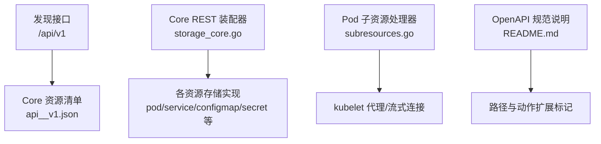
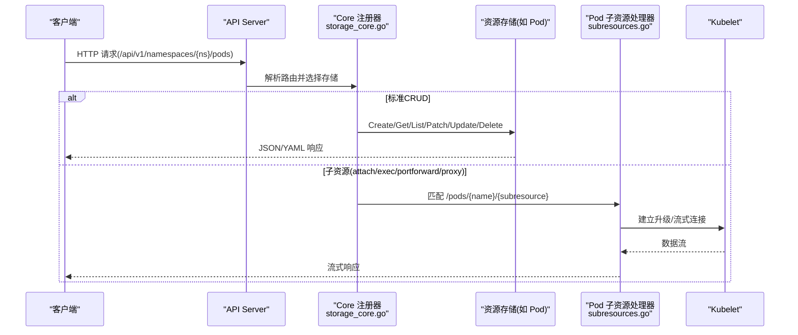
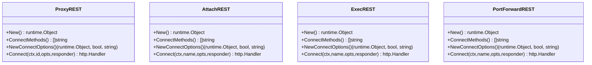
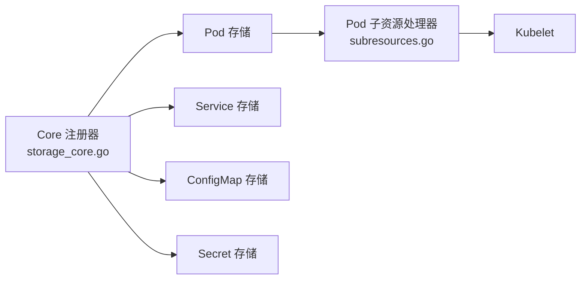

# Core API

<cite>
**本文引用的文件**   
- [api__v1.json](file://api/discovery/api__v1.json)
- [storage_core.go](file://pkg/registry/core/rest/storage_core.go)
- [subresources.go](file://pkg/registry/core/pod/rest/subresources.go)
- [README.md](file://api/openapi-spec/README.md)
</cite>

## 目录
1. [简介](#简介)
2. [项目结构](#项目结构)
3. [核心组件](#核心组件)
4. [架构总览](#架构总览)
5. [详细组件分析](#详细组件分析)
6. [依赖关系分析](#依赖关系分析)
7. [性能与可扩展性](#性能与可扩展性)
8. [故障排查指南](#故障排查指南)
9. [结论](#结论)
10. [附录：API参考与示例](#附录api参考与示例)

## 简介
本文件为 Kubernetes Core API（组版本 v1）的 REST API 参考文档，聚焦于核心资源（Pod、Service、Deployment、ConfigMap、Secret 等）的接口规范、字段与验证要点、CRUD 操作示例、查询过滤与分页机制、错误码与状态码说明，以及最佳实践。文档基于仓库中的发现文档、OpenAPI 规范说明与核心注册器实现进行整理，确保与实际代码行为一致。

## 项目结构
Kubernetes 通过“发现”接口暴露 v1 组的所有资源及其可用动词；REST 路由由 core 注册器集中装配；Pod 子资源（attach/exec/portforward/proxy）通过专门的处理器实现；OpenAPI 规范位于 api/openapi-spec 目录，并包含扩展约定。

图示来源
- [api__v1.json:1-572](file://api/discovery/api__v1.json#L1-L572)
- [storage_core.go:157-330](file://pkg/registry/core/rest/storage_core.go#L157-L330)
- [subresources.go:43-88](file://pkg/registry/core/pod/rest/subresources.go#L43-L88)
- [README.md:1-89](file://api/openapi-spec/README.md#L1-L89)

章节来源
- [api__v1.json:1-572](file://api/discovery/api__v1.json#L1-L572)
- [storage_core.go:157-330](file://pkg/registry/core/rest/storage_core.go#L157-L330)
- [subresources.go:43-88](file://pkg/registry/core/pod/rest/subresources.go#L43-L88)
- [README.md:1-89](file://api/openapi-spec/README.md#L1-L89)

## 核心组件
- 发现与资源清单：提供 v1 组所有资源的名称、是否命名空间作用域、短名、单数名及支持的动词集合。
- Core REST 装配器：将具体资源存储（如 Pod、Service、ConfigMap、Secret 等）挂载到 /api/v1 下，并注册子资源（如 pods/status、services/proxy）。
- Pod 子资源处理器：实现 attach/exec/portforward/proxy 等需要升级协议或流式传输的路径。
- OpenAPI 规范与扩展：定义 x-kubernetes-group-version-kind、x-kubernetes-action 等扩展，用于标注资源与动作。

章节来源
- [api__v1.json:1-572](file://api/discovery/api__v1.json#L1-L572)
- [storage_core.go:157-330](file://pkg/registry/core/rest/storage_core.go#L157-L330)
- [subresources.go:43-88](file://pkg/registry/core/pod/rest/subresources.go#L43-L88)
- [README.md:1-89](file://api/openapi-spec/README.md#L1-L89)

## 架构总览
Core API 的请求处理链路如下：客户端请求进入 apiserver，路由至 v1 组的 REST 存储映射；标准 CRUD 由通用存储层处理；特殊子资源（如 pods/exec）由专用 Connecter 处理器处理，必要时转发至 kubelet。

图示来源
- [storage_core.go:157-330](file://pkg/registry/core/rest/storage_core.go#L157-L330)
- [subresources.go:76-88](file://pkg/registry/core/pod/rest/subresources.go#L76-L88)

## 详细组件分析

### 资源清单与动词能力
- 资源清单来源于发现接口，列出每个资源的 namespaced、shortNames、singularName 与 verbs。
- 常见核心资源（如 Pod、Service、ConfigMap、Secret、Endpoints、Event、LimitRange、Namespace、Node、PersistentVolume、PersistentVolumeClaim、PodTemplate、ReplicationController、ResourceQuota、ServiceAccount）均支持 create/delete/get/list/patch/update/watch 等动词，部分资源还暴露 status 或 proxy 子资源。

章节来源
- [api__v1.json:1-572](file://api/discovery/api__v1.json#L1-L572)

### Core REST 装配器
- 负责将各资源存储挂载到 /api/v1，包括标准资源与子资源（例如 pods/status、services/proxy、nodes/proxy）。
- 根据特性开关与配置动态启用某些子资源（如 InPlacePodVerticalScaling 对应的 pods/resize）。

章节来源
- [storage_core.go:157-330](file://pkg/registry/core/rest/storage_core.go#L157-L330)

### Pod 子资源处理器
- 实现 Pod 的 attach、exec、portforward、proxy 等子资源，采用 Connecter 模式，支持 WebSocket 升级与流式传输。
- 在特定特性门控开启时，会对 connect 类操作执行额外的“create”授权检查。

图示来源
- [subresources.go:43-88](file://pkg/registry/core/pod/rest/subresources.go#L43-L88)
- [subresources.go:93-166](file://pkg/registry/core/pod/rest/subresources.go#L93-L166)
- [subresources.go:168-241](file://pkg/registry/core/pod/rest/subresources.go#L168-L241)
- [subresources.go:243-307](file://pkg/registry/core/pod/rest/subresources.go#L243-L307)

章节来源
- [subresources.go:43-88](file://pkg/registry/core/pod/rest/subresources.go#L43-88)
- [subresources.go:93-166](file://pkg/registry/core/pod/rest/subresources.go#L93-166)
- [subresources.go:168-241](file://pkg/registry/core/pod/rest/subresources.go#L168-241)
- [subresources.go:243-307](file://pkg/registry/core/pod/rest/subresources.go#L243-307)

### OpenAPI 规范与扩展
- 规范根目录包含各 API 组的 OpenAPI JSON 文件，便于工具生成客户端与服务端代码。
- 使用 x-kubernetes-group-version-kind 标注资源关联，x-kubernetes-action 标注操作类型（get/list/put/patch/post/delete/deletecollection/watch/watchlist/proxy/connect），并提供列表作为 map 的键与 patch 策略相关扩展。

章节来源
- [README.md:1-89](file://api/openapi-spec/README.md#L1-L89)

## 依赖关系分析
- Core 注册器依赖各资源存储实现（Pod、Service、ConfigMap、Secret 等），并在启动后钩子中启动 IP/端口修复控制器。
- Pod 子资源处理器依赖 kubelet 连接信息与授权器，以完成流式代理与鉴权。

图示来源
- [storage_core.go:157-330](file://pkg/registry/core/rest/storage_core.go#L157-L330)
- [subresources.go:76-88](file://pkg/registry/core/pod/rest/subresources.go#L76-L88)

章节来源
- [storage_core.go:157-330](file://pkg/registry/core/rest/storage_core.go#L157-L330)
- [subresources.go:76-88](file://pkg/registry/core/pod/rest/subresources.go#L76-L88)

## 性能与可扩展性
- 流式子资源（attach/exec/portforward）受带宽限制与升级协议处理影响，建议合理设置客户端超时与重试策略。
- Service IP/NodePort 分配器在启动后会运行修复循环，避免长时间阻塞健康检查。

[本节为一般性指导，不直接分析具体文件]

## 故障排查指南
- 子资源连接失败：确认客户端具备相应权限（当特性门控开启时，connect 类操作需“create”授权），并检查网络与代理链路的 WebSocket 支持。
- 资源不存在或版本不匹配：核对资源名称、命名空间与 API 版本，参考发现接口返回的资源清单。
- 状态更新受限：仅对 /status 子资源调用 get/patch/update，避免对普通资源路径误用状态更新。

章节来源
- [subresources.go:115-156](file://pkg/registry/core/pod/rest/subresources.go#L115-L156)
- [api__v1.json:1-572](file://api/discovery/api__v1.json#L1-L572)

## 结论
Core API 通过统一的发现接口与集中化的 REST 装配器，为集群内常用资源提供了稳定一致的访问方式。Pod 子资源通过专用处理器实现流式交互，OpenAPI 规范与扩展为自动化与互操作性提供了坚实基础。遵循本文档的接口规范与实践建议，可提升系统的稳定性与可维护性。

[本节为总结性内容，不直接分析具体文件]

## 附录：API参考与示例

### 通用约定
- 基础路径：/api/v1
- 命名空间资源：/api/v1/namespaces/{namespace}/{resource}
- 非命名空间资源：/api/v1/{resource}
- 子资源：/api/v1/{resource}/{name}/{subresource}
- 动词能力：依据发现接口返回的 verbs 确定（如 create、delete、get、list、patch、update、watch）

章节来源
- [api__v1.json:1-572](file://api/discovery/api__v1.json#L1-L572)

### 资源清单（节选）
- Pod：命名空间作用域，支持 create/delete/get/list/patch/update/watch，以及子资源 attach/exec/log/portforward/proxy/binding/eviction/ephemeralcontainers/resize/status
- Service：命名空间作用域，支持 create/delete/get/list/patch/update/watch，以及子资源 proxy/status
- ConfigMap：命名空间作用域，支持 create/delete/get/list/patch/update/watch
- Secret：命名空间作用域，支持 create/delete/get/list/patch/update/watch
- Endpoints：命名空间作用域，支持 create/delete/get/list/patch/update/watch
- Event：命名空间作用域，支持 create/delete/get/list/patch/update/watch
- LimitRange：命名空间作用域，支持 create/delete/get/list/patch/update/watch
- Namespace：非命名空间作用域，支持 create/delete/get/list/patch/update/watch，以及子资源 finalize/status
- Node：非命名空间作用域，支持 create/delete/get/list/patch/update/watch，以及子资源 proxy/status
- PersistentVolume：非命名空间作用域，支持 create/delete/get/list/patch/update/watch，以及子资源 status
- PersistentVolumeClaim：命名空间作用域，支持 create/delete/get/list/patch/update/watch，以及子资源 status
- PodTemplate：命名空间作用域，支持 create/delete/get/list/patch/update/watch
- ReplicationController：命名空间作用域，支持 create/delete/get/list/patch/update/watch，以及子资源 scale/status
- ResourceQuota：命名空间作用域，支持 create/delete/get/list/patch/update/watch，以及子资源 status
- ServiceAccount：命名空间作用域，支持 create/delete/get/list/patch/update/watch，以及子资源 token

章节来源
- [api__v1.json:1-572](file://api/discovery/api__v1.json#L1-L572)

### 查询、过滤、排序与分页
- 过滤：使用 fieldSelector 与 labelSelector 参数进行筛选（例如 ?fieldSelector=metadata.name=xxx&labelSelector=key=value）
- 排序：使用 sortFields 指定排序字段与方向
- 分页：使用 limit 与 continue 实现分页拉取
- 观察变更：使用 watch 与 resourceVersion 增量获取事件

[本节为通用约定说明，不直接分析具体文件]

### 错误码与状态码
- HTTP 状态码：200/201/202/204 表示成功；4xx/5xx 表示客户端或服务端错误
- 响应体：通常包含 Status 对象，包含 reason、message、code 等字段
- 常见原因：NotFound、Unauthorized、Forbidden、AlreadyExists、Invalid、TooManyRequests、Timeout、ServerTimeout 等

[本节为通用约定说明，不直接分析具体文件]

### 典型资源示例（curl 与客户端代码路径）
- Pod
  - 创建：POST /api/v1/namespaces/{namespace}/pods
  - 读取：GET /api/v1/namespaces/{namespace}/pods/{name}
  - 更新：PUT /api/v1/namespaces/{namespace}/pods/{name}
  - 删除：DELETE /api/v1/namespaces/{namespace}/pods/{name}
  - 子资源：/pods/{name}/log、/pods/{name}/exec、/pods/{name}/attach、/pods/{name}/portforward、/pods/{name}/proxy
- Service
  - 创建：POST /api/v1/namespaces/{namespace}/services
  - 读取：GET /api/v1/namespaces/{namespace}/services/{name}
  - 更新：PUT /api/v1/namespaces/{namespace}/services/{name}
  - 删除：DELETE /api/v1/namespaces/{namespace}/services/{name}
  - 子资源：/services/{name}/proxy、/services/{name}/status
- ConfigMap
  - 创建：POST /api/v1/namespaces/{namespace}/configmaps
  - 读取：GET /api/v1/namespaces/{namespace}/configmaps/{name}
  - 更新：PUT /api/v1/namespaces/{namespace}/configmaps/{name}
  - 删除：DELETE /api/v1/namespaces/{namespace}/configmaps/{name}
- Secret
  - 创建：POST /api/v1/namespaces/{namespace}/secrets
  - 读取：GET /api/v1/namespaces/{namespace}/secrets/{name}
  - 更新：PUT /api/v1/namespaces/{namespace}/secrets/{name}
  - 删除：DELETE /api/v1/namespaces/{namespace}/secrets/{name}
- Deployment（注意：Deployment 属于 apps 组，不在 v1 核心组）
  - 路径示例：/apis/apps/v1/namespaces/{namespace}/deployments
  - 动词：create/delete/get/list/patch/update/watch

章节来源
- [api__v1.json:1-572](file://api/discovery/api__v1.json#L1-L572)

### 最佳实践
- 优先使用发现接口与 OpenAPI 规范驱动客户端生成，减少硬编码路径与字段
- 对子资源（尤其是流式）设置合理的超时与重试策略
- 使用 labelSelector 与 fieldSelector 精准过滤，降低 list/watch 负载
- 谨慎使用 status 子资源，仅在需要更新状态时使用
- 结合 RBAC 最小权限原则，控制对敏感资源（如 Secret）的访问

[本节为一般性指导，不直接分析具体文件]