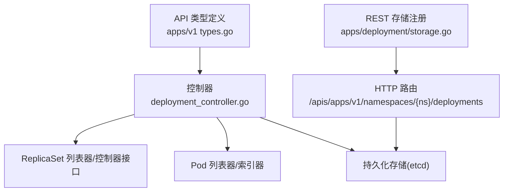
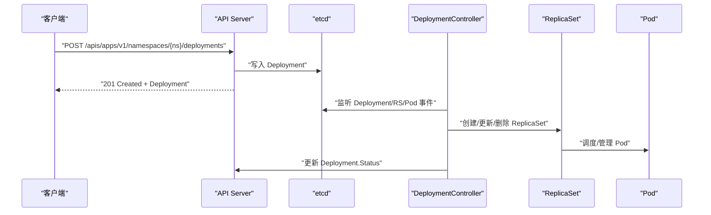
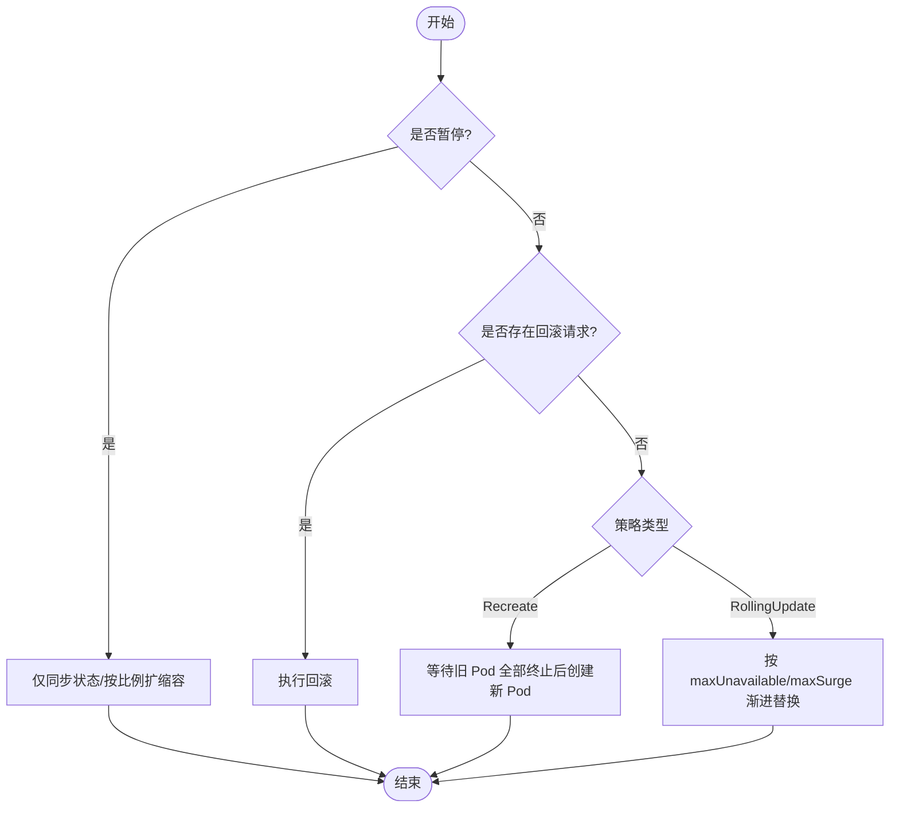
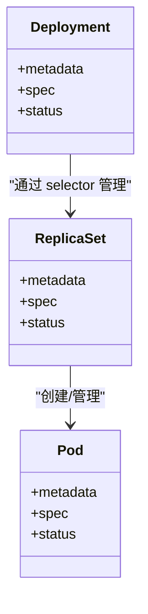
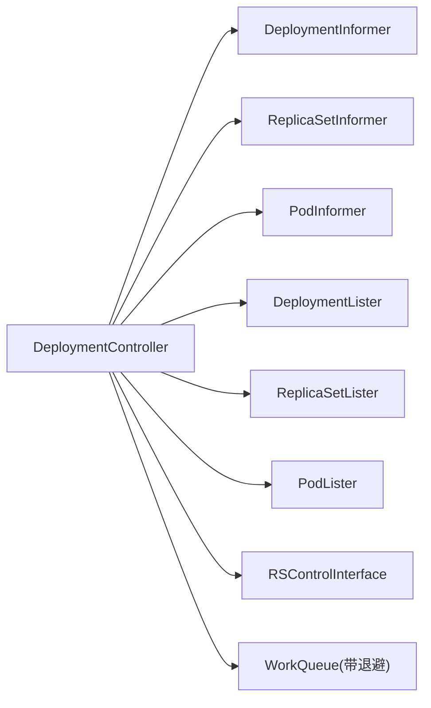

# Deployment API

<cite>
**本文引用的文件**   
- [staging/src/k8s.io/api/apps/v1/types.go](file://staging/src/k8s.io/api/apps/v1/types.go)
- [pkg/controller/deployment/deployment_controller.go](file://pkg/controller/deployment/deployment_controller.go)
- [pkg/registry/apps/deployment/storage/storage.go](file://pkg/registry/apps/deployment/storage/storage.go)
- [staging/src/k8s.io/client-go/examples/create-update-delete-deployment/README.md](file://staging/src/k8s.io/client-go/examples/create-update-delete-deployment/README.md)
- [staging/src/k8s.io/client-go/examples/dynamic-create-update-delete-deployment/README.md](file://staging/src/k8s.io/client-go/examples/dynamic-create-update-delete-deployment/README.md)
</cite>

## 目录
1. [简介](#简介)
2. [项目结构](#项目结构)
3. [核心组件](#核心组件)
4. [架构总览](#架构总览)
5. [详细组件分析](#详细组件分析)
6. [依赖关系分析](#依赖关系分析)
7. [性能考量](#性能考量)
8. [故障排查指南](#故障排查指南)
9. [结论](#结论)
10. [附录](#附录)

## 简介
本文件面向 Kubernetes 的 Deployment 资源，提供一份完整的 REST API 参考与实现说明。内容涵盖：
- HTTP 方法与 URL 模式、请求参数与响应格式
- Deployment 字段定义（replicas、strategy、selector、template 等）
- 滚动更新策略与版本回滚机制
- CRUD 操作示例（curl 与客户端代码路径）
- 与 ReplicaSet 的关系、滚动更新过程与故障恢复
- 错误码与状态码说明
- 使用场景与最佳实践

## 项目结构
围绕 Deployment 的关键源码位置如下：
- API 类型定义：apps/v1 中的 Deployment、DeploymentSpec、DeploymentStrategy、RollingUpdateDeployment、DeploymentStatus 等
- 控制器实现：DeploymentController 负责监听、调度、同步 Deployment 与其管理的 ReplicaSet/Pod
- API 注册与存储：REST 层将 /deployments 及其子资源 /scale、/status、/rollback 暴露为 HTTP API

图表来源
- [staging/src/k8s.io/api/apps/v1/types.go:396-626](file://staging/src/k8s.io/api/apps/v1/types.go#L396-L626)
- [pkg/controller/deployment/deployment_controller.go:1-200](file://pkg/controller/deployment/deployment_controller.go#L1-L200)
- [pkg/registry/apps/deployment/storage/storage.go:93-120](file://pkg/registry/apps/deployment/storage/storage.go#L93-L120)

章节来源
- [staging/src/k8s.io/api/apps/v1/types.go:396-626](file://staging/src/k8s.io/api/apps/v1/types.go#L396-L626)
- [pkg/controller/deployment/deployment_controller.go:1-200](file://pkg/controller/deployment/deployment_controller.go#L1-L200)
- [pkg/registry/apps/deployment/storage/storage.go:93-120](file://pkg/registry/apps/deployment/storage/storage.go#L93-L120)

## 核心组件
- Deployment 对象模型
  - Deployment：包含元数据、spec、status
  - DeploymentSpec：replicas、selector、template、strategy、minReadySeconds、revisionHistoryLimit、paused、progressDeadlineSeconds
  - DeploymentStrategy：type（Recreate/RollingUpdate）、rollingUpdate（maxUnavailable、maxSurge）
  - RollingUpdateDeployment：maxUnavailable、maxSurge
  - DeploymentStatus：observedGeneration、replicas、updatedReplicas、readyReplicas、availableReplicas、unavailableReplicas、terminatingReplicas、conditions、collisionCount
- 控制器
  - DeploymentController：基于 Informer/Lister 监听 Deployment/ReplicaSet/Pod 变更，按策略执行滚动或重建更新，处理暂停/恢复、进度超时、回滚、比例扩缩容等
- REST 存储
  - 暴露 /deployments 及子资源 /scale、/status、/rollback

章节来源
- [staging/src/k8s.io/api/apps/v1/types.go:396-626](file://staging/src/k8s.io/api/apps/v1/types.go#L396-L626)
- [pkg/controller/deployment/deployment_controller.go:572-661](file://pkg/controller/deployment/deployment_controller.go#L572-L661)

## 架构总览
Deployment 通过 REST API 接收用户声明，由 API Server 持久化到 etcd；DeploymentController 监听并驱动实际集群状态收敛。

图表来源
- [pkg/registry/apps/deployment/storage/storage.go:93-120](file://pkg/registry/apps/deployment/storage/storage.go#L93-L120)
- [pkg/controller/deployment/deployment_controller.go:170-200](file://pkg/controller/deployment/deployment_controller.go#L170-L200)

## 详细组件分析

### 字段定义与语义
- spec.replicas：期望副本数，指针类型区分未指定与显式 0，默认 1
- spec.selector：标签选择器，必须与模板 labels 匹配
- spec.template：Pod 模板，仅允许 restartPolicy=Always
- spec.strategy：部署策略
  - type：Recreate 或 RollingUpdate（默认）
  - rollingUpdate：
    - maxUnavailable：更新期间不可用上限（绝对值或百分比），不能与 maxSurge 同时为 0
    - maxSurge：超出期望副本数的最大可调度数量（绝对值或百分比），不能与 maxUnavailable 同时为 0
- spec.minReadySeconds：新 Pod 就绪后保持的最小秒数才计为可用
- spec.revisionHistoryLimit：保留旧 ReplicaSet 数量以支持回滚，默认 10
- spec.paused：是否暂停滚动更新
- spec.progressDeadlineSeconds：滚动进度超时阈值，默认 600s
- status.conditions：Available、Progressing、ReplicaFailure 等条件

章节来源
- [staging/src/k8s.io/api/apps/v1/types.go:415-461](file://staging/src/k8s.io/api/apps/v1/types.go#L415-L461)
- [staging/src/k8s.io/api/apps/v1/types.go:470-524](file://staging/src/k8s.io/api/apps/v1/types.go#L470-L524)
- [staging/src/k8s.io/api/apps/v1/types.go:526-573](file://staging/src/k8s.io/api/apps/v1/types.go#L526-L573)
- [staging/src/k8s.io/api/apps/v1/types.go:575-612](file://staging/src/k8s.io/api/apps/v1/types.go#L575-L612)

### 滚动更新与重建策略
- RollingUpdate：逐步缩放旧 ReplicaSet 并扩容新 ReplicaSet，受 maxUnavailable/maxSurge 控制
- Recreate：先终止所有旧 Pod，再创建新 Pod

图表来源
- [pkg/controller/deployment/deployment_controller.go:628-661](file://pkg/controller/deployment/deployment_controller.go#L628-L661)

章节来源
- [pkg/controller/deployment/deployment_controller.go:628-661](file://pkg/controller/deployment/deployment_controller.go#L628-L661)

### 版本回滚机制
- 通过设置回滚目标触发回滚流程，控制器会清理相关 ReplicaSet 并应用历史版本
- 回滚为非重入操作，需确保在后续队列中完成清理后再继续

章节来源
- [pkg/controller/deployment/deployment_controller.go:632-637](file://pkg/controller/deployment/deployment_controller.go#L632-L637)

### 与 ReplicaSet 的关系
- Deployment 通过 LabelSelector 管理多个 ReplicaSet
- 控制器根据 ControllerRef 和标签选择进行“认领/释放”
- 新增/更新/删除 ReplicaSet 都会触发 Deployment 重新同步

图表来源
- [staging/src/k8s.io/api/apps/v1/types.go:396-461](file://staging/src/k8s.io/api/apps/v1/types.go#L396-L461)
- [pkg/controller/deployment/deployment_controller.go:521-549](file://pkg/controller/deployment/deployment_controller.go#L521-L549)

章节来源
- [pkg/controller/deployment/deployment_controller.go:521-549](file://pkg/controller/deployment/deployment_controller.go#L521-L549)

### REST API 参考

- 基础信息
  - GroupVersion: apps/v1
  - Scope: Namespaced
  - 资源名: deployments

- 端点与方法
  - 集合
    - POST /apis/apps/v1/namespaces/{namespace}/deployments
      - 用途：创建 Deployment
      - 请求体：Deployment JSON/YAML
      - 成功响应：201 Created，返回 Deployment
      - 常见错误：400 校验失败、403 权限不足、409 冲突（ResourceVersion）
  - 单个
    - GET /apis/apps/v1/namespaces/{namespace}/deployments/{name}
      - 用途：读取 Deployment
      - 成功响应：200 OK，返回 Deployment
    - PUT /apis/apps/v1/namespaces/{namespace}/deployments/{name}
      - 用途：全量更新 Deployment
      - 成功响应：200 OK，返回 Deployment
    - PATCH /apis/apps/v1/namespaces/{namespace}/deployments/{name}
      - 用途：部分更新（JSON Patch/Merge Patch）
      - 成功响应：200 OK，返回 Deployment
    - DELETE /apis/apps/v1/namespaces/{namespace}/deployments/{name}
      - 用途：删除 Deployment（级联删除其管理的 ReplicaSet/Pod）
      - 成功响应：200 OK 或 204 No Content
  - 列表
    - GET /apis/apps/v1/namespaces/{namespace}/deployments
      - 用途：列出 Deployment
      - 查询参数：labelSelector、fieldSelector、watch、resourceVersion、limit、continue 等
      - 成功响应：200 OK，返回 DeploymentList
  - 子资源
    - GET /apis/apps/v1/namespaces/{namespace}/deployments/{name}/status
      - 用途：读取 Deployment 状态
      - 成功响应：200 OK，返回 Deployment
    - PUT /apis/apps/v1/namespaces/{namespace}/deployments/{name}/status
      - 用途：更新 Deployment 状态（通常由控制器写入）
      - 成功响应：200 OK，返回 Deployment
    - GET /apis/apps/v1/namespaces/{namespace}/deployments/{name}/scale
      - 用途：读取 Scale 子资源（当前副本数）
      - 成功响应：200 OK，返回 autoscaling/v1.Scale
    - PUT /apis/apps/v1/namespaces/{namespace}/deployments/{name}/scale
      - 用途：更新副本数（扩缩容）
      - 请求体：autoscaling/v1.Scale.spec.replicas
      - 成功响应：200 OK，返回 Scale
    - POST /apis/apps/v1/namespaces/{namespace}/deployments/{name}/rollback
      - 用途：触发回滚
      - 请求体：包含回滚目标的 RollbackConfig
      - 成功响应：200 OK，返回 Deployment

- 关键请求参数
  - path: namespace, name
  - query: labelSelector、fieldSelector、watch、resourceVersion、timeoutSeconds、limit、continue
  - body: 对应资源的 JSON/YAML 表示

- 响应格式
  - 单资源：Deployment
  - 列表：DeploymentList
  - 子资源：Scale、Rollback 请求体/响应体遵循各自 API 规范

- 状态码与错误
  - 200/201/204：成功
  - 400：请求体无效或字段校验失败
  - 401/403：认证/授权失败
  - 404：资源不存在
  - 409：并发冲突（ResourceVersion 不匹配）
  - 422：业务逻辑校验失败（如 selector 与 template 不匹配）
  - 5xx：服务端异常

章节来源
- [pkg/registry/apps/deployment/storage/storage.go:93-120](file://pkg/registry/apps/deployment/storage/storage.go#L93-L120)
- [staging/src/k8s.io/api/apps/v1/types.go:396-626](file://staging/src/k8s.io/api/apps/v1/types.go#L396-L626)

### 扩缩容与比例扩缩容
- 直接修改 replicas 或通过 scale 子资源更新
- 控制器在滚动过程中对多 ReplicaSet 按比例扩缩，以降低风险

章节来源
- [pkg/controller/deployment/deployment_controller.go:639-645](file://pkg/controller/deployment/deployment_controller.go#L639-L645)

### 进度与超时
- progressDeadlineSeconds：超过该时间未完成滚动则标记 ProgressDeadlineExceeded
- paused：暂停时不计进度

章节来源
- [staging/src/k8s.io/api/apps/v1/types.go:454-461](file://staging/src/k8s.io/api/apps/v1/types.go#L454-L461)
- [pkg/controller/deployment/deployment_controller.go:621-630](file://pkg/controller/deployment/deployment_controller.go#L621-L630)

### 客户端示例与用法
- 客户端示例（typed client）
  - 创建、更新、删除 Deployment 的基本操作演示
  - 参考路径：[staging/src/k8s.io/client-go/examples/create-update-delete-deployment/README.md](file://staging/src/k8s.io/client-go/examples/create-update-delete-deployment/README.md)
- 动态客户端示例（dynamic client）
  - 使用 Unstructured 对象进行创建、更新、删除
  - 参考路径：[staging/src/k8s.io/client-go/examples/dynamic-create-update-delete-deployment/README.md](file://staging/src/k8s.io/client-go/examples/dynamic-create-update-delete-deployment/README.md)

章节来源
- [staging/src/k8s.io/client-go/examples/create-update-delete-deployment/README.md:1-84](file://staging/src/k8s.io/client-go/examples/create-update-delete-deployment/README.md#L1-L84)
- [staging/src/k8s.io/client-go/examples/dynamic-create-update-delete-deployment/README.md:1-94](file://staging/src/k8s.io/client-go/examples/dynamic-create-update-delete-deployment/README.md#L1-L94)

## 依赖关系分析
- DeploymentController 依赖
  - Informers：DeploymentInformer、ReplicaSetInformer、PodInformer
  - Listers：DeploymentLister、ReplicaSetLister、PodLister
  - 控制器接口：RSControlInterface（用于 ReplicaSet 的 adopt/release）
  - 工作队列：带退避的重试队列
- 外部依赖
  - API Server 客户端（读写 Deployment/RS/Pod/Events）
  - etcd（持久化）

图表来源
- [pkg/controller/deployment/deployment_controller.go:67-101](file://pkg/controller/deployment/deployment_controller.go#L67-L101)
- [pkg/controller/deployment/deployment_controller.go:103-168](file://pkg/controller/deployment/deployment_controller.go#L103-L168)

章节来源
- [pkg/controller/deployment/deployment_controller.go:67-101](file://pkg/controller/deployment/deployment_controller.go#L67-L101)
- [pkg/controller/deployment/deployment_controller.go:103-168](file://pkg/controller/deployment/deployment_controller.go#L103-L168)

## 性能考量
- 合理设置 maxUnavailable/maxSurge，避免资源争用与节点压力过大
- 调整 minReadySeconds 平衡启动速度与可用性判定
- 谨慎设置 revisionHistoryLimit，避免过多历史对象占用存储
- 使用合适的 progressDeadlineSeconds，防止长时间阻塞
- 大规模扩缩容时关注 API Server 与 etcd 的压力，必要时分批操作

## 故障排查指南
- 常见问题
  - 选择器为空或不匹配：控制器会记录警告并拒绝推进
  - 滚动卡住：检查 readiness/liveness 探针、资源配额、镜像拉取失败
  - 回滚失败：确认历史 ReplicaSet 未被 GC 清理
  - 并发冲突：重试并带上正确的 ResourceVersion
- 定位手段
  - 查看 Deployment.Status.Conditions 与 Reason/Message
  - 观察关联 ReplicaSet 与 Pod 的事件
  - 检查控制器日志与工作队列重试情况

章节来源
- [pkg/controller/deployment/deployment_controller.go:600-608](file://pkg/controller/deployment/deployment_controller.go#L600-L608)
- [pkg/controller/deployment/deployment_controller.go:499-519](file://pkg/controller/deployment/deployment_controller.go#L499-L519)

## 结论
Deployment 提供了声明式的无状态应用管理能力，结合滚动更新、回滚与扩缩容能力，满足大多数应用的发布与运维需求。理解其 API 规范、字段语义与控制器行为，有助于制定更稳健的发布策略与排障流程。

## 附录

### 典型 curl 示例（路径与要点）
- 创建
  - curl -X POST -H "Content-Type: application/yaml" -d @deployment.yaml https://<api-server>/apis/apps/v1/namespaces/<ns>/deployments
- 读取
  - curl https://<api-server>/apis/apps/v1/namespaces/<ns>/deployments/<name>
- 更新
  - curl -X PATCH -H "Content-Type: application/merge-patch+json" -d '{"spec":{"replicas":3}}' https://<api-server>/apis/apps/v1/namespaces/<ns>/deployments/<name>
- 扩缩容（scale）
  - curl -X PUT -H "Content-Type: application/json" -d '{"apiVersion":"autoscaling/v1","kind":"Scale","spec":{"replicas":5}}' https://<api-server>/apis/apps/v1/namespaces/<ns>/deployments/<name>/scale
- 回滚
  - curl -X POST -H "Content-Type: application/json" -d '{"apiVersion":"apps/v1","kind":"Rollback","name":"<target-revision>"}' https://<api-server>/apis/apps/v1/namespaces/<ns>/deployments/<name>/rollback

注意：以上为通用路径与参数说明，具体请求体结构与字段请参考各 API 文档与类型定义。