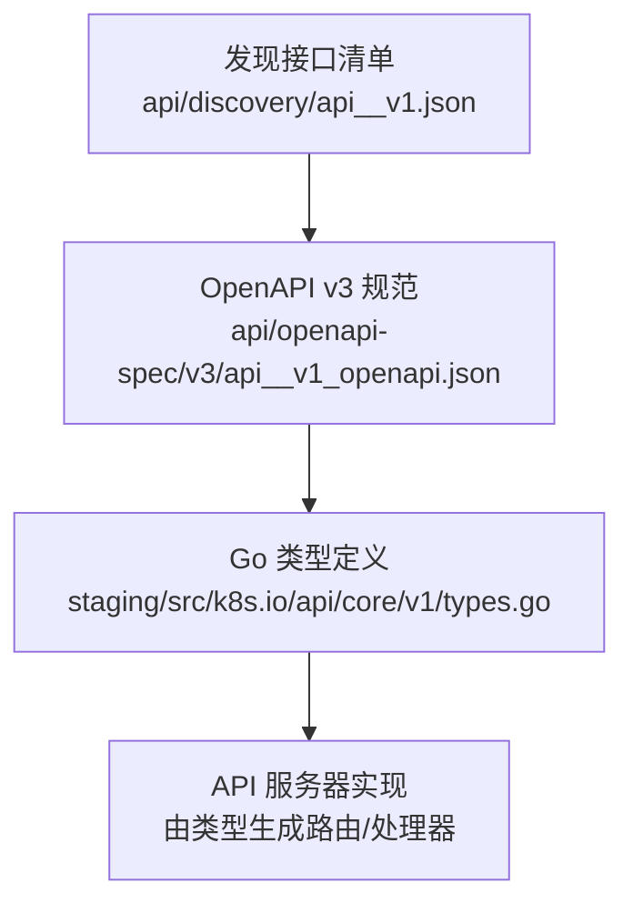
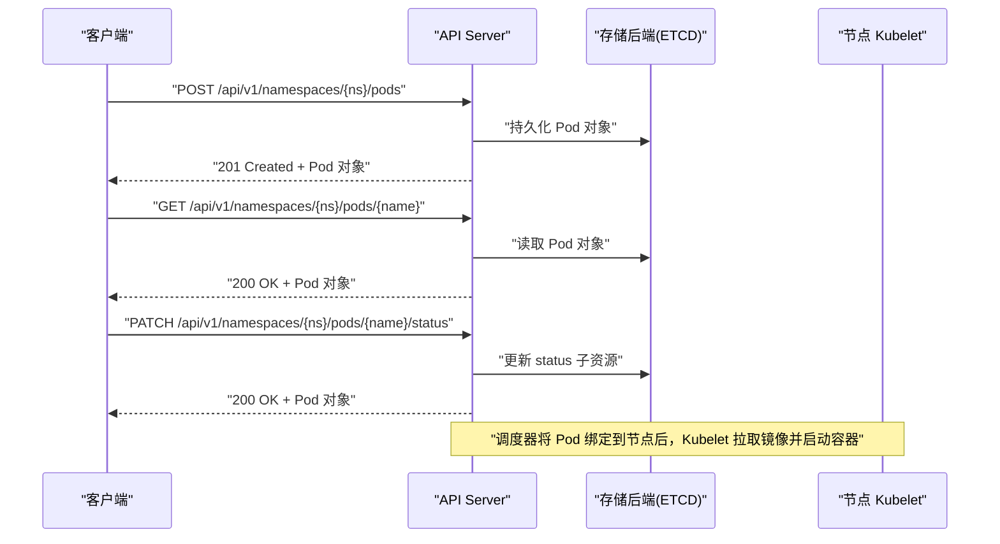
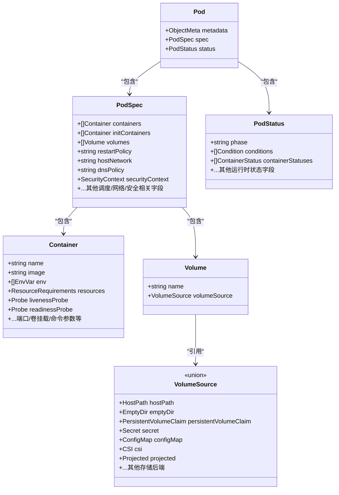
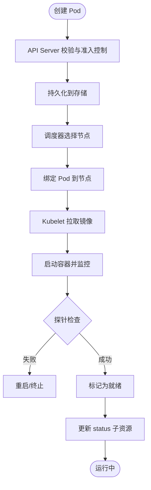
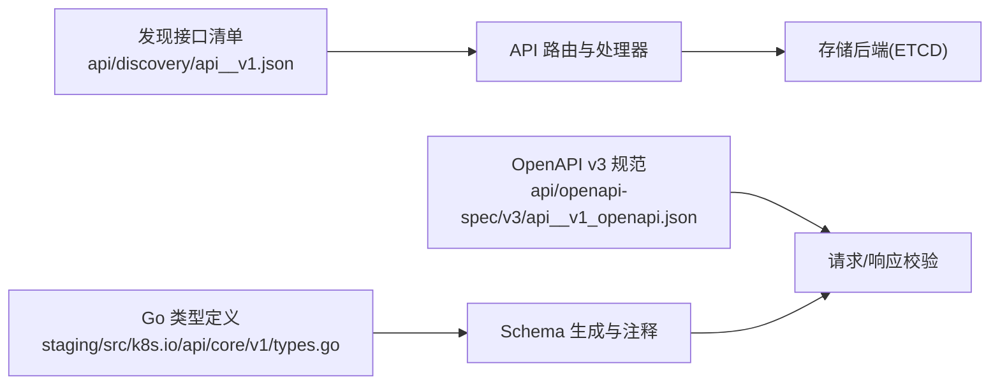

# Pod API

<cite>
**本文引用的文件**
- [api/discovery/api__v1.json](file://api/discovery/api__v1.json)
- [staging/src/k8s.io/api/core/v1/types.go](file://staging/src/k8s.io/api/core/v1/types.go)
- [api/openapi-spec/v3/api__v1_openapi.json](file://api/openapi-spec/v3/api__v1_openapi.json)
</cite>

## 目录
1. [简介](#简介)
2. [项目结构](#项目结构)
3. [核心组件](#核心组件)
4. [架构总览](#架构总览)
5. [详细组件分析](#详细组件分析)
6. [依赖分析](#依赖分析)
7. [性能考虑](#性能考虑)
8. [故障排查指南](#故障排查指南)
9. [结论](#结论)
10. [附录](#附录)

## 简介
本文件为 Kubernetes Pod 资源的 REST API 参考文档，聚焦于 v1 版本的 Pod 资源。内容涵盖：
- HTTP 方法与 URL 模式（含子资源）
- 请求参数与响应格式
- Pod 的完整字段定义（metadata、spec、status）及验证规则
- CRUD 操作示例（curl 与客户端代码路径）
- 生命周期管理、容器配置、存储挂载、网络设置等高级特性
- 错误码与状态码说明
- 使用场景与最佳实践

## 项目结构
Kubernetes 将 Pod 的 API 规范与类型定义分散在多个位置：
- 发现接口清单：列出所有可访问的资源与动词（如 create、get、list、update、patch、delete、watch），以及子资源（如 status、exec、attach、log、portforward、proxy、eviction、ephemeralcontainers、resize）。
- OpenAPI v3 规范：提供完整的 JSON Schema，描述对象结构与字段约束。
- Go 类型定义：Pod、PodSpec、PodStatus 等核心类型的字段、注释与校验标签。

图表来源
- [api/discovery/api__v1.json:253-379](file://api/discovery/api__v1.json#L253-L379)
- [api/openapi-spec/v3/api__v1_openapi.json:1-200](file://api/openapi-spec/v3/api__v1_openapi.json#L1-L200)
- [staging/src/k8s.io/api/core/v1/types.go:5493-5513](file://staging/src/k8s.io/api/core/v1/types.go#L5493-L5513)

章节来源
- [api/discovery/api__v1.json:253-379](file://api/discovery/api__v1.json#L253-L379)
- [api/openapi-spec/v3/api__v1_openapi.json:1-200](file://api/openapi-spec/v3/api__v1_openapi.json#L1-L200)
- [staging/src/k8s.io/api/core/v1/types.go:5493-5513](file://staging/src/k8s.io/api/core/v1/types.go#L5493-L5513)

## 核心组件
- Pod 资源对象
  - 顶层字段：metadata、spec、status
  - 列表对象：PodList
- Pod 规格（spec）
  - 容器集合、初始化容器、卷、网络、安全上下文、调度策略、重启策略、DNS、主机名、服务账户等
- Pod 状态（status）
  - 阶段（phase）、条件（conditions）、容器状态、事件等
- 子资源
  - status、ephemeralcontainers、resize、exec、attach、log、portforward、proxy、eviction

章节来源
- [staging/src/k8s.io/api/core/v1/types.go:5493-5513](file://staging/src/k8s.io/api/core/v1/types.go#L5493-L5513)
- [staging/src/k8s.io/api/core/v1/types.go:5515-5529](file://staging/src/k8s.io/api/core/v1/types.go#L5515-L5529)
- [api/discovery/api__v1.json:253-379](file://api/discovery/api__v1.json#L253-L379)

## 架构总览
下图展示从客户端到 API Server 的 Pod 基本读写流程，以及关键子资源交互点。

图表来源
- [api/discovery/api__v1.json:253-379](file://api/discovery/api__v1.json#L253-L379)
- [staging/src/k8s.io/api/core/v1/types.go:5493-5513](file://staging/src/k8s.io/api/core/v1/types.go#L5493-L5513)

## 详细组件分析

### Pod 资源模型（类图）

图表来源
- [staging/src/k8s.io/api/core/v1/types.go:5493-5513](file://staging/src/k8s.io/api/core/v1/types.go#L5493-L5513)
- [staging/src/k8s.io/api/core/v1/types.go:4141-4200](file://staging/src/k8s.io/api/core/v1/types.go#L4141-L4200)
- [staging/src/k8s.io/api/core/v1/types.go:3710-3760](file://staging/src/k8s.io/api/core/v1/types.go#L3710-L3760)
- [api/openapi-spec/v3/api__v1_openapi.json:1081-1200](file://api/openapi-spec/v3/api__v1_openapi.json#L1081-L1200)

章节来源
- [staging/src/k8s.io/api/core/v1/types.go:5493-5513](file://staging/src/k8s.io/api/core/v1/types.go#L5493-L5513)
- [staging/src/k8s.io/api/core/v1/types.go:4141-4200](file://staging/src/k8s.io/api/core/v1/types.go#L4141-L4200)
- [staging/src/k8s.io/api/core/v1/types.go:3710-3760](file://staging/src/k8s.io/api/core/v1/types.go#L3710-L3760)
- [api/openapi-spec/v3/api__v1_openapi.json:1081-1200](file://api/openapi-spec/v3/api__v1_openapi.json#L1081-L1200)

### REST API 规范（HTTP 方法与 URL 模式）
- 基础资源
  - POST /api/v1/namespaces/{namespace}/pods — 创建 Pod
  - GET /api/v1/namespaces/{namespace}/pods — 列表 Pod（支持 labelSelector、fieldSelector、limit、continue、resourceVersion 等查询参数）
  - GET /api/v1/namespaces/{namespace}/pods/{name} — 获取单个 Pod
  - PUT /api/v1/namespaces/{namespace}/pods/{name} — 全量更新 Pod（通常建议使用 PATCH）
  - PATCH /api/v1/namespaces/{namespace}/pods/{name} — 部分更新 Pod（支持 strategic merge patch、JSON patch）
  - DELETE /api/v1/namespaces/{namespace}/pods/{name} — 删除 Pod
  - WATCH /api/v1/namespaces/{namespace}/pods — 监听 Pod 变更
- 子资源
  - GET/PATCH/UPDATE /api/v1/namespaces/{namespace}/pods/{name}/status — 仅更新状态
  - GET/PATCH/UPDATE /api/v1/namespaces/{namespace}/pods/{name}/ephemeralcontainers — 管理临时容器
  - GET/PATCH/UPDATE /api/v1/namespaces/{namespace}/pods/{name}/resize — 调整容器资源配额（需启用相应功能）
  - CREATE/GET /api/v1/namespaces/{namespace}/pods/{name}/exec — 执行命令（WebSocket/SPDY）
  - CREATE/GET /api/v1/namespaces/{namespace}/pods/{name}/attach — 附加到运行中的容器（WebSocket/SPDY）
  - GET /api/v1/namespaces/{namespace}/pods/{name}/log — 获取容器日志
  - CREATE/GET /api/v1/namespaces/{namespace}/pods/{name}/portforward — 端口转发（WebSocket/SPDY）
  - CREATE/DELETE/GET/PATCH/UPDATE /api/v1/namespaces/{namespace}/pods/{name}/proxy — 代理到 Pod
  - CREATE /api/v1/namespaces/{namespace}/pods/{name}/eviction — 触发驱逐（policy/v1 Eviction）

章节来源
- [api/discovery/api__v1.json:253-379](file://api/discovery/api__v1.json#L253-L379)

### 请求参数与响应格式
- 通用查询参数
  - labelSelector、fieldSelector：过滤列表结果
  - limit、continue、resourceVersion：分页与增量同步
  - watch=true：开启长连接监听
  - pretty=true：格式化输出
- 请求体
  - 标准元数据：apiVersion、kind、metadata
  - spec：期望状态（不可变或受控字段见各字段注释）
  - status：只读，由系统填充；部分子资源允许更新
- 响应体
  - 成功：返回 Pod 或 PodList 对象
  - 失败：返回 Status 对象，包含 code、message、reason 等

章节来源
- [api/openapi-spec/v3/api__v1_openapi.json:1-200](file://api/openapi-spec/v3/api__v1_openapi.json#L1-L200)
- [api/discovery/api__v1.json:253-379](file://api/discovery/api__v1.json#L253-L379)

### 字段定义与验证规则（摘要）
- metadata
  - 遵循标准 ObjectMeta 约定（名称、命名空间、标签、注解、资源版本等）
- spec
  - containers/initContainers：容器数组，要求唯一名称、镜像、资源限制、探针等
  - volumes：卷数组，支持多种 VolumeSource（hostPath、emptyDir、persistentVolumeClaim、secret、configmap、csi、projected 等）
  - restartPolicy：Always、OnFailure、Never
  - hostNetwork/hostPID：是否共享主机网络/进程命名空间
  - dnsPolicy/dnsConfig：DNS 策略与自定义 DNS 配置
  - serviceAccountName：使用的服务账户
  - nodeSelector/tolerations/affinity：调度约束
  - securityContext：Pod 级安全上下文
  - ephemeralContainers：调试用临时容器
  - ...更多字段详见类型定义与 OpenAPI 注释
- status
  - phase：Pending、Running、Succeeded、Failed、Unknown
  - conditions：Pod 条件（如 Ready、Initialized、ContainersReady 等）
  - containerStatuses：每个容器的运行状态（started、ready、restartCount、lastState、state 等）
  - hostIP/podIP：节点 IP 与 Pod IP
  - startTime/endTime：生命周期时间戳
  - ...更多字段详见类型定义与 OpenAPI 注释

注意：具体字段的必填性、默认值、取值范围与兼容性标注均以 Go 类型注释与 OpenAPI schema 为准。

章节来源
- [staging/src/k8s.io/api/core/v1/types.go:5493-5513](file://staging/src/k8s.io/api/core/v1/types.go#L5493-L5513)
- [staging/src/k8s.io/api/core/v1/types.go:4141-4200](file://staging/src/k8s.io/api/core/v1/types.go#L4141-L4200)
- [staging/src/k8s.io/api/core/v1/types.go:3710-3760](file://staging/src/k8s.io/api/core/v1/types.go#L3710-L3760)
- [api/openapi-spec/v3/api__v1_openapi.json:1081-1200](file://api/openapi-spec/v3/api__v1_openapi.json#L1081-L1200)

### 生命周期管理与业务逻辑
- 创建：API Server 接收 Pod 对象，进行准入控制与校验，持久化后由调度器选择节点，Kubelet 拉取镜像并启动容器。
- 运行：Kubelet 维护容器状态，上报至 API Server；探针决定就绪/存活状态。
- 更新：对 spec 的某些字段可能触发重建；对 status 的子资源可直接更新。
- 删除：软删除（设置 deletionTimestamp），最终通过 finalizers 清理资源。
- 驱逐：通过 eviction 子资源触发优雅终止。

图表来源
- [api/discovery/api__v1.json:253-379](file://api/discovery/api__v1.json#L253-L379)
- [staging/src/k8s.io/api/core/v1/types.go:5493-5513](file://staging/src/k8s.io/api/core/v1/types.go#L5493-L5513)

### 容器配置、存储挂载、网络设置（要点）
- 容器配置
  - 命令与参数、环境变量、镜像拉取策略、资源请求/限制、探针、生命周期钩子、重启策略
- 存储挂载
  - 支持的 VolumeSource 包括 hostPath、emptyDir、persistentVolumeClaim、secret、configmap、csi、projected 等
- 网络设置
  - hostNetwork、dnsPolicy/dnsConfig、ports 暴露、service 关联（通过 selector 匹配 Pod）

章节来源
- [api/openapi-spec/v3/api__v1_openapi.json:1081-1200](file://api/openapi-spec/v3/api__v1_openapi.json#L1081-L1200)
- [staging/src/k8s.io/api/core/v1/types.go:4141-4200](file://staging/src/k8s.io/api/core/v1/types.go#L4141-L4200)

### 错误码与状态码说明
- HTTP 状态码
  - 200 OK：成功读取或更新
  - 201 Created：成功创建
  - 204 No Content：成功删除
  - 400 Bad Request：请求体无效或参数不合法
  - 401 Unauthorized：未认证
  - 403 Forbidden：无权限
  - 404 Not Found：资源不存在
  - 409 Conflict：资源冲突（如并发更新）
  - 422 Unprocessable Entity：语义校验失败
  - 500 Internal Server Error：服务器内部错误
- 响应体 Status
  - code、message、reason、details 等字段用于结构化错误信息

章节来源
- [api/openapi-spec/v3/api__v1_openapi.json:1-200](file://api/openapi-spec/v3/api__v1_openapi.json#L1-L200)

### CRUD 操作示例（curl 与客户端代码路径）
- 创建 Pod
  - curl: POST /api/v1/namespaces/{ns}/pods，请求体为 Pod 对象
  - 客户端代码路径参考：[pkg/controller/controller_utils_test.go:393](file://pkg/controller/controller_utils_test.go#L393)
- 读取 Pod
  - curl: GET /api/v1/namespaces/{ns}/pods/{name}
  - 客户端代码路径参考：[staging/src/k8s.io/kubectl/pkg/cmd/get/get_test.go:377](file://staging/src/k8s.io/kubectl/pkg/cmd/get/get_test.go#L377)
- 更新 Pod
  - curl: PATCH /api/v1/namespaces/{ns}/pods/{name}
  - 客户端代码路径参考：[staging/src/k8s.io/kubectl/pkg/cmd/patch/patch_test.go:209](file://staging/src/k8s.io/kubectl/pkg/cmd/patch/patch_test.go#L209)
- 删除 Pod
  - curl: DELETE /api/v1/namespaces/{ns}/pods/{name}
  - 客户端代码路径参考：[staging/src/k8s.io/kubectl/pkg/cmd/delete/delete_test.go:900](file://staging/src/k8s.io/kubectl/pkg/cmd/delete/delete_test.go#L900)

章节来源
- [pkg/controller/controller_utils_test.go:393](file://pkg/controller/controller_utils_test.go#L393)
- [staging/src/k8s.io/kubectl/pkg/cmd/get/get_test.go:377](file://staging/src/k8s.io/kubectl/pkg/cmd/get/get_test.go#L377)
- [staging/src/k8s.io/kubectl/pkg/cmd/patch/patch_test.go:209](file://staging/src/k8s.io/kubectl/pkg/cmd/patch/patch_test.go#L209)
- [staging/src/k8s.io/kubectl/pkg/cmd/delete/delete_test.go:900](file://staging/src/k8s.io/kubectl/pkg/cmd/delete/delete_test.go#L900)

## 依赖分析
- 发现接口清单定义了 Pod 及其子资源的可用动词与路径，是 API 路由与服务端行为的基础契约。
- OpenAPI v3 规范提供了严格的 JSON Schema，驱动服务端校验与客户端生成。
- Go 类型定义承载了字段注释、默认值、兼容性与校验标签，是 OpenAPI 与行为实现的权威来源。

图表来源
- [api/discovery/api__v1.json:253-379](file://api/discovery/api__v1.json#L253-L379)
- [api/openapi-spec/v3/api__v1_openapi.json:1-200](file://api/openapi-spec/v3/api__v1_openapi.json#L1-L200)
- [staging/src/k8s.io/api/core/v1/types.go:5493-5513](file://staging/src/k8s.io/api/core/v1/types.go#L5493-L5513)

章节来源
- [api/discovery/api__v1.json:253-379](file://api/discovery/api__v1.json#L253-L379)
- [api/openapi-spec/v3/api__v1_openapi.json:1-200](file://api/openapi-spec/v3/api__v1_openapi.json#L1-L200)
- [staging/src/k8s.io/api/core/v1/types.go:5493-5513](file://staging/src/k8s.io/api/core/v1/types.go#L5493-L5513)

## 性能考虑
- 合理使用 list/watch 与 fieldSelector/labelSelector 减少不必要的数据传输
- 避免频繁全量更新 Pod，优先使用 PATCH 与子资源（如 status）
- 合理设置资源请求/限制与探针，降低不必要的重启与调度抖动
- 使用合理的重试与退避策略处理 409/5xx 错误

## 故障排查指南
- 常见错误
  - 400/422：检查 spec 字段是否符合 OpenAPI 约束与类型注释
  - 403：确认 RBAC 权限是否允许对应动词与子资源
  - 404：确认命名空间与资源名称是否正确
  - 500：查看 API Server 日志与 etcd 健康状态
- 诊断步骤
  - 使用 kubectl describe pod 查看事件与状态
  - 使用 kubectl logs 与 exec 进入容器排查应用问题
  - 使用 watch 观察状态变化与条件转换

章节来源
- [api/openapi-spec/v3/api__v1_openapi.json:1-200](file://api/openapi-spec/v3/api__v1_openapi.json#L1-L200)
- [api/discovery/api__v1.json:253-379](file://api/discovery/api__v1.json#L253-L379)

## 结论
本文基于仓库中的发现接口清单、OpenAPI v3 规范与 Go 类型定义，系统化梳理了 Pod 资源的 REST API 规范、字段定义与典型操作流程。建议在实际使用中严格遵循 OpenAPI 约束与类型注释，结合子资源与查询参数优化性能与可靠性。

## 附录
- 术语
  - 子资源：与主资源紧密相关的特定操作入口（如 status、exec、attach、log、portforward、proxy、eviction）
  - 探针：liveness/readiness/startup 探针，用于健康检查与就绪判定
  - 卷：Volume 抽象，统一不同存储后端的挂载方式
- 参考路径
  - Pod 类型定义：[staging/src/k8s.io/api/core/v1/types.go:5493-5513](file://staging/src/k8s.io/api/core/v1/types.go#L5493-L5513)
  - PodSpec 与相关字段：[staging/src/k8s.io/api/core/v1/types.go:4141-4200](file://staging/src/k8s.io/api/core/v1/types.go#L4141-L4200)
  - OpenAPI 容器与卷定义：[api/openapi-spec/v3/api__v1_openapi.json:1081-1200](file://api/openapi-spec/v3/api__v1_openapi.json#L1081-L1200)
  - 发现接口清单（Pod 与子资源）：[api/discovery/api__v1.json:253-379](file://api/discovery/api__v1.json#L253-L379)