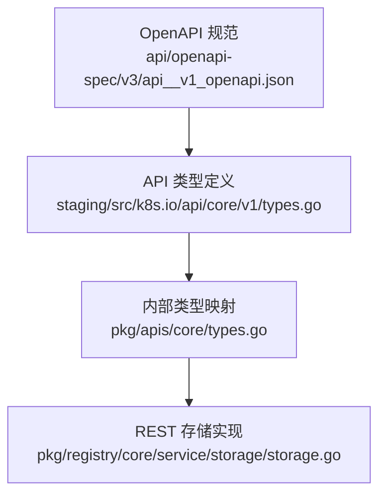
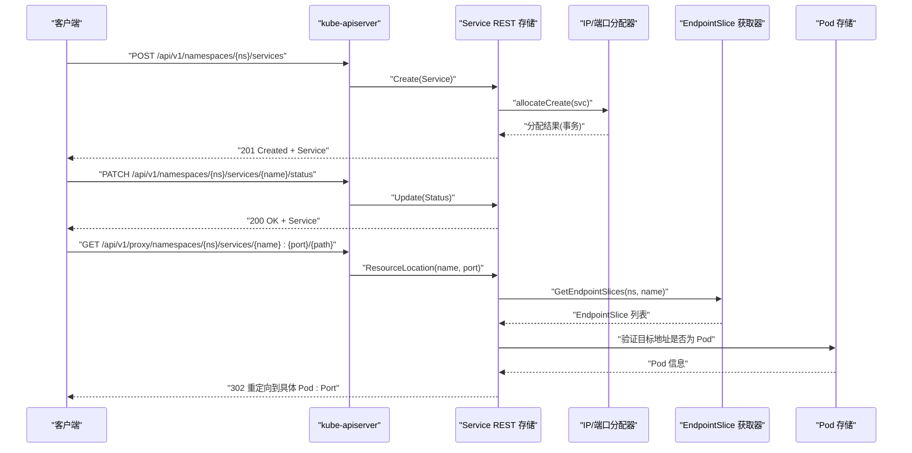
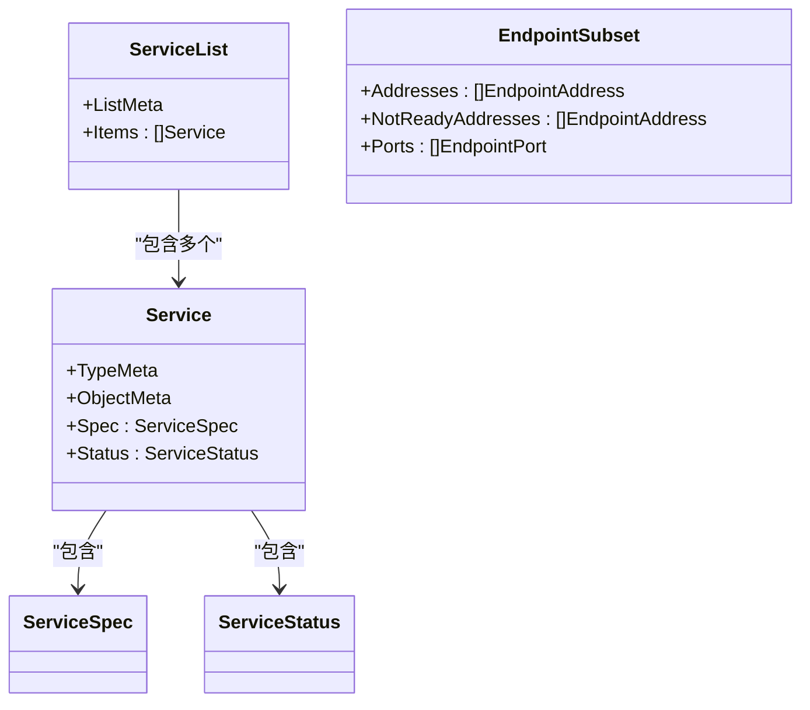
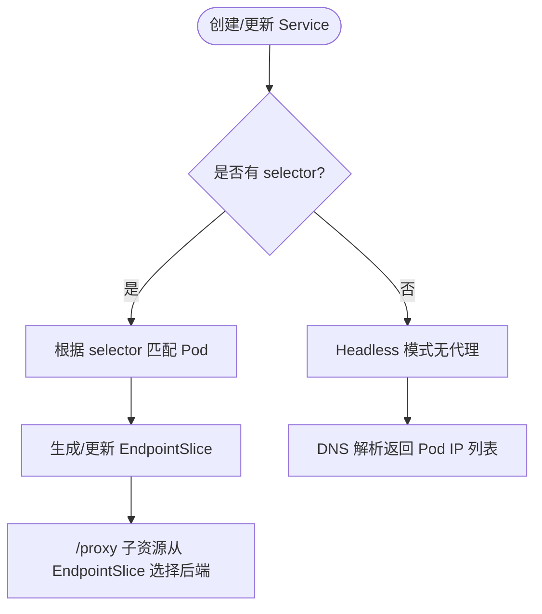
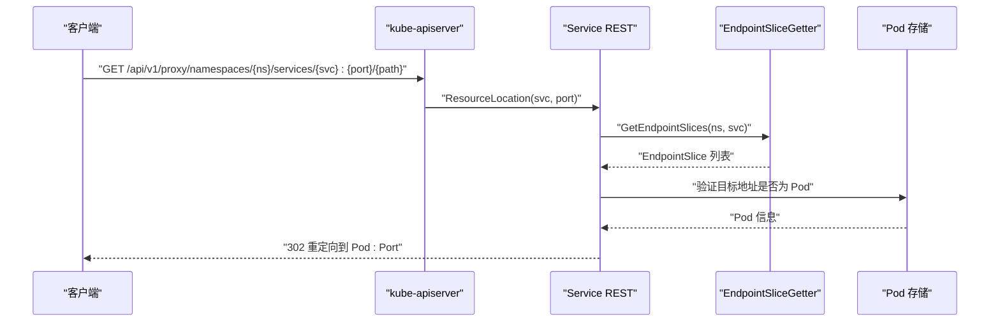
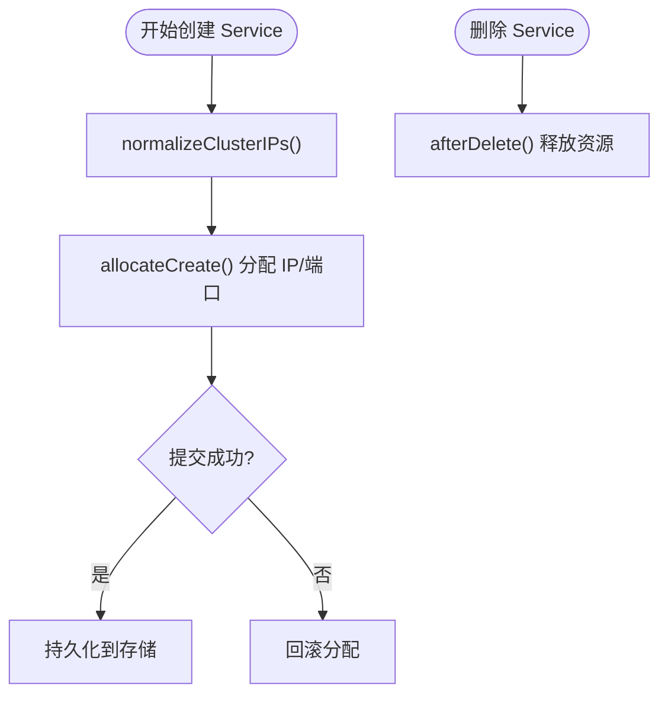
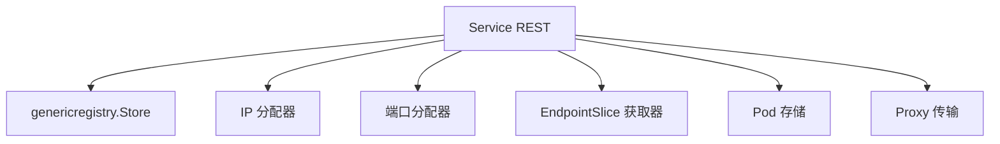

# Service API

<cite>
**本文引用的文件**   
- [staging/src/k8s.io/api/core/v1/types.go](file://staging/src/k8s.io/api/core/v1/types.go)
- [pkg/apis/core/types.go](file://pkg/apis/core/types.go)
- [pkg/registry/core/service/storage/storage.go](file://pkg/registry/core/service/storage/storage.go)
- [api/openapi-spec/v3/api__v1_openapi.json](file://api/openapi-spec/v3/api__v1_openapi.json)
</cite>

## 目录
1. [简介](#简介)
2. [项目结构](#项目结构)
3. [核心组件](#核心组件)
4. [架构总览](#架构总览)
5. [详细组件分析](#详细组件分析)
6. [依赖关系分析](#依赖关系分析)
7. [性能与扩展性](#性能与扩展性)
8. [故障排查指南](#故障排查指南)
9. [结论](#结论)
10. [附录：API 参考与示例](#附录api-参考与示例)

## 简介
本文件为 Kubernetes Service 资源的 REST API 参考文档，聚焦于 v1 版本的 Service 资源。内容涵盖：
- HTTP 方法与 URL 模式（REST 端点）
- 请求参数与响应格式
- Service 字段定义（类型、端口、选择器、会话亲和性等）
- 与 Endpoints/EndpointSlice 的关系及负载均衡机制
- 错误码与状态码说明
- 典型使用场景与最佳实践
- 完整的 CRUD 操作示例（curl 与客户端代码路径）

## 项目结构
Service 的 API 规范由 OpenAPI 描述文件与 Go 类型定义共同维护；REST 存储层负责创建、更新、删除、代理等逻辑。关键位置如下：
- API 类型定义：core/v1 types.go
- 内部版本类型：pkg/apis/core/types.go
- REST 存储实现：pkg/registry/core/service/storage/storage.go
- OpenAPI 规范：api/openapi-spec/v3/api__v1_openapi.json

**图表来源**
- [api/openapi-spec/v3/api__v1_openapi.json](file://api/openapi-spec/v3/api__v1_openapi.json)
- [staging/src/k8s.io/api/core/v1/types.go](file://staging/src/k8s.io/api/core/v1/types.go)
- [pkg/apis/core/types.go](file://pkg/apis/core/types.go)
- [pkg/registry/core/service/storage/storage.go](file://pkg/registry/core/service/storage/storage.go)

**章节来源**
- [staging/src/k8s.io/api/core/v1/types.go:6287-6306](file://staging/src/k8s.io/api/core/v1/types.go#L6287-L6306)
- [pkg/apis/core/types.go:5323-5336](file://pkg/apis/core/types.go#L5323-L5336)
- [pkg/registry/core/service/storage/storage.go:74-135](file://pkg/registry/core/service/storage/storage.go#L74-L135)
- [api/openapi-spec/v3/api__v1_openapi.json](file://api/openapi-spec/v3/api__v1_openapi.json)

## 核心组件
- Service 对象：包含元数据、Spec 与 Status。
- ServiceSpec：定义服务类型、ClusterIP、端口、选择器、会话亲和性、流量策略等。
- ServiceStatus：系统填充的服务运行状态（如 LoadBalancer 入口）。
- 子资源：/status、/proxy。
- 列表对象：ServiceList。

**章节来源**
- [staging/src/k8s.io/api/core/v1/types.go:6287-6306](file://staging/src/k8s.io/api/core/v1/types.go#L6287-L6306)
- [staging/src/k8s.io/api/core/v1/types.go:6317-6327](file://staging/src/k8s.io/api/core/v1/types.go#L6317-L6327)

## 架构总览
Service 的 REST 请求在 apiserver 中经过认证、鉴权、准入控制后进入 REST 存储层。Service 的存储实现负责：
- 分配 ClusterIP/NodePort/HealthCheckNodePort
- 校验并规范化 ClusterIP 与 ClusterIPs 的联动
- 处理 /status 子资源更新
- 提供 /proxy 子资源将请求转发到后端 Pod

**图表来源**
- [pkg/registry/core/service/storage/storage.go:74-135](file://pkg/registry/core/service/storage/storage.go#L74-L135)
- [pkg/registry/core/service/storage/storage.go:342-404](file://pkg/registry/core/service/storage/storage.go#L342-L404)
- [pkg/registry/core/service/storage/storage.go:406-462](file://pkg/registry/core/service/storage/storage.go#L406-L462)

## 详细组件分析

### Service 对象模型
- Service：包含 TypeMeta、ObjectMeta、Spec、Status。
- ServiceList：包含 Items 列表。
- 常量：ClusterIPNone 表示 Headless 服务。

**图表来源**
- [staging/src/k8s.io/api/core/v1/types.go:6287-6306](file://staging/src/k8s.io/api/core/v1/types.go#L6287-L6306)
- [staging/src/k8s.io/api/core/v1/types.go:6317-6327](file://staging/src/k8s.io/api/core/v1/types.go#L6317-L6327)

**章节来源**
- [staging/src/k8s.io/api/core/v1/types.go:6287-6306](file://staging/src/k8s.io/api/core/v1/types.go#L6287-L6306)
- [staging/src/k8s.io/api/core/v1/types.go:6317-6327](file://staging/src/k8s.io/api/core/v1/types.go#L6317-L6327)

### ServiceSpec 字段详解
- type：服务类型（ClusterIP、NodePort、LoadBalancer、ExternalName）。
- clusterIP/clusterIPs：集群内虚拟 IP（Headless 时为 None）。
- ports[]：每个端口包含 appProtocol、port、targetPort、nodePort。
- selector：标签选择器，用于匹配后端 Pod。
- sessionAffinity：会话亲和性（ClientIP 等），可配置超时。
- externalTrafficPolicy/internalTrafficPolicy：外部/内部流量策略。
- ipFamilyPolicy/ipFamilies：IPv4/IPv6 双栈策略。
- allocateLoadBalancerNodePorts：是否自动分配 NodePort（LB 类型时）。
- healthCheckNodePort：当 externalTrafficPolicy=Local 时暴露的健康检查端口。

注意：
- targetPort 支持数字或命名端口；若未指定则默认等于 port。
- nodePort 仅在 NodePort/LB 类型需要时有效，未指定时系统自动分配。
- ExternalName 类型不使用 clusterIP，也不进行代理。

**章节来源**
- [staging/src/k8s.io/api/core/v1/types.go:6250-6276](file://staging/src/k8s.io/api/core/v1/types.go#L6250-L6276)
- [staging/src/k8s.io/api/core/v1/types.go:6308-6312](file://staging/src/k8s.io/api/core/v1/types.go#L6308-L6312)

### 端口配置与 AppProtocol
- port：对外暴露的端口号。
- targetPort：目标 Pod 容器端口（数字或名称）。
- nodePort：节点端口（可选）。
- appProtocol：应用协议提示（如 http、https、kubernetes.io/h2c、kubernetes.io/ws 等）。

**章节来源**
- [staging/src/k8s.io/api/core/v1/types.go:6250-6276](file://staging/src/k8s.io/api/core/v1/types.go#L6250-L6276)

### 选择器机制
- selector：通过标签匹配后端 Pod。
- 无选择器的 Headless 服务：常用于 StatefulSet 等需要稳定网络标识的场景。

**章节来源**
- [staging/src/k8s.io/api/core/v1/types.go:6287-6306](file://staging/src/k8s.io/api/core/v1/types.go#L6287-L6306)

### 会话亲和性与流量策略
- sessionAffinity：支持基于客户端 IP 的粘性会话，可设置 timeoutSeconds。
- externalTrafficPolicy：Local 保留源 IP，但可能影响负载均衡分布。
- internalTrafficPolicy：控制集群内部流量路由策略。

**章节来源**
- [api/openapi-spec/v3/api__v1_openapi.json:712-722](file://api/openapi-spec/v3/api__v1_openapi.json#L712-L722)

### 与 Endpoints/EndpointSlice 的关系
- Endpoints：传统端点集合，已标记为弃用（v1.33+），建议使用 EndpointSlice。
- EndpointSlice：更高效的端点发现机制，Service 的 /proxy 子资源基于 EndpointSlice 选择后端。

**图表来源**
- [staging/src/k8s.io/api/core/v1/types.go:6393-6428](file://staging/src/k8s.io/api/core/v1/types.go#L6393-L6428)
- [pkg/registry/core/service/storage/storage.go:406-462](file://pkg/registry/core/service/storage/storage.go#L406-L462)

**章节来源**
- [staging/src/k8s.io/api/core/v1/types.go:6393-6428](file://staging/src/k8s.io/api/core/v1/types.go#L6393-L6428)
- [pkg/registry/core/service/storage/storage.go:406-462](file://pkg/registry/core/service/storage/storage.go#L406-L462)

### 负载均衡机制与 /proxy 子资源
- /proxy 子资源：根据 Service 名称与端口，查找 EndpointSlice，过滤出有效的 Pod 地址，随机选择一个后端进行重定向。
- 有效性校验：确保目标地址属于当前命名空间且与 Pod 的 IP 一致。

**图表来源**
- [pkg/registry/core/service/storage/storage.go:406-462](file://pkg/registry/core/service/storage/storage.go#L406-L462)

**章节来源**
- [pkg/registry/core/service/storage/storage.go:406-462](file://pkg/registry/core/service/storage/storage.go#L406-L462)

### 资源分配与生命周期钩子
- beginCreate/beginUpdate：在创建/更新前进行 ClusterIP/NodePort 分配与一致性修复。
- afterDelete：删除后释放已分配的 IP/端口资源。
- defaultOnRead：读取时对旧对象进行字段归一化（如 ClusterIP 与 ClusterIPs 同步、ipFamilies 推导）。

**图表来源**
- [pkg/registry/core/service/storage/storage.go:342-404](file://pkg/registry/core/service/storage/storage.go#L342-L404)
- [pkg/registry/core/service/storage/storage.go:328-340](file://pkg/registry/core/service/storage/storage.go#L328-L340)
- [pkg/registry/core/service/storage/storage.go:491-554](file://pkg/registry/core/service/storage/storage.go#L491-L554)

**章节来源**
- [pkg/registry/core/service/storage/storage.go:342-404](file://pkg/registry/core/service/storage/storage.go#L342-L404)
- [pkg/registry/core/service/storage/storage.go:328-340](file://pkg/registry/core/service/storage/storage.go#L328-L340)
- [pkg/registry/core/service/storage/storage.go:491-554](file://pkg/registry/core/service/storage/storage.go#L491-L554)

## 依赖关系分析
- Service REST 存储依赖：
  - genericregistry.Store：通用存储能力
  - ipallocator/portallocator：IP/端口分配
  - endpointSlices：端点切片获取
  - pods：Pod 存储（用于 /proxy 有效性校验）
  - proxyTransport：HTTP 传输（用于重定向）

**图表来源**
- [pkg/registry/core/service/storage/storage.go:55-63](file://pkg/registry/core/service/storage/storage.go#L55-L63)

**章节来源**
- [pkg/registry/core/service/storage/storage.go:55-63](file://pkg/registry/core/service/storage/storage.go#L55-L63)

## 性能与扩展性
- Watch Cache：apiserver 对 List/Watch 使用缓存，减少 etcd 压力。
- EndpointSlice：相比 Endpoints 更高效地管理大规模端点。
- 双栈支持：ipFamilyPolicy/ipFamilies 提升 IPv4/IPv6 兼容性。
- 建议：
  - 优先使用 EndpointSlice 替代 Endpoints。
  - 合理设置 externalTrafficPolicy 以平衡源 IP 保留与负载均衡效果。
  - 避免频繁变更 selector 导致大量端点重建。

[本节为通用指导，不直接分析具体文件]

## 故障排查指南
- 常见错误：
  - 400 Bad Request：无效的服务请求（如 /proxy 的 ID 格式不正确）。
  - 404 Not Found：命名空间或服务不存在。
  - 409 Conflict：并发冲突（resourceVersion 不一致）。
  - 503 Service Unavailable：无可用端点或端口不存在。
- 诊断步骤：
  - 检查 Service 的 selector 是否正确匹配 Pod。
  - 查看 EndpointSlice 是否存在且包含健康端点。
  - 确认 /proxy 子资源的端口名或端口号与 Service.Spec.Ports 一致。
  - 检查 NodePort/LB 相关字段是否符合类型要求。

**章节来源**
- [pkg/registry/core/service/storage/storage.go:406-462](file://pkg/registry/core/service/storage/storage.go#L406-L462)

## 结论
Service 作为 Kubernetes 的核心网络抽象，提供了稳定的访问入口与灵活的负载均衡能力。通过合理的类型选择、端口配置、会话亲和性与流量策略，可以满足多种应用场景的需求。结合 EndpointSlice 与 apiserver 的缓存机制，可实现高效可靠的网络路由。

[本节为总结，不直接分析具体文件]

## 附录：API 参考与示例

### REST 端点与方法
- 基本资源：
  - GET /api/v1/services
  - POST /api/v1/namespaces/{namespace}/services
  - GET /api/v1/namespaces/{namespace}/services/{name}
  - PUT/PATCH /api/v1/namespaces/{namespace}/services/{name}
  - DELETE /api/v1/namespaces/{namespace}/services/{name}
- 子资源：
  - PATCH /api/v1/namespaces/{namespace}/services/{name}/status
  - GET /api/v1/proxy/namespaces/{namespace}/services/{name}:{port}/{path}

**章节来源**
- [staging/src/k8s.io/api/core/v1/types.go:6287-6306](file://staging/src/k8s.io/api/core/v1/types.go#L6287-L6306)

### 请求与响应格式
- 请求体：Service 对象的 JSON/YAML 表示。
- 响应体：Service 对象或 ServiceList。
- 查询参数：fieldSelector、labelSelector、resourceVersion、timeoutSeconds 等。

**章节来源**
- [api/openapi-spec/v3/api__v1_openapi.json](file://api/openapi-spec/v3/api__v1_openapi.json)

### 字段定义速查
- Service.spec.type：ClusterIP、NodePort、LoadBalancer、ExternalName。
- Service.spec.clusterIP/clusterIPs：集群 IP（Headless 为 None）。
- Service.spec.ports[].port/targetPort/nodePort/appProtocol。
- Service.spec.selector：标签选择器。
- Service.spec.sessionAffinity：会话亲和性（含 timeoutSeconds）。
- Service.spec.externalTrafficPolicy/internalTrafficPolicy。
- Service.spec.ipFamilyPolicy/ipFamilies。
- Service.spec.allocateLoadBalancerNodePorts。
- Service.spec.healthCheckNodePort。

**章节来源**
- [staging/src/k8s.io/api/core/v1/types.go:6250-6276](file://staging/src/k8s.io/api/core/v1/types.go#L6250-L6276)
- [staging/src/k8s.io/api/core/v1/types.go:6308-6312](file://staging/src/k8s.io/api/core/v1/types.go#L6308-L6312)
- [api/openapi-spec/v3/api__v1_openapi.json:712-722](file://api/openapi-spec/v3/api__v1_openapi.json#L712-L722)

### CRUD 示例（curl 与客户端代码路径）
- 创建 Service（ClusterIP）：
  - curl: POST /api/v1/namespaces/{ns}/services
  - 客户端代码路径：参考 pkg/registry/core/service/storage/storage.go 中的 NewREST 与 BeginCreate 流程。
- 更新 Service 状态：
  - curl: PATCH /api/v1/namespaces/{ns}/services/{name}/status
  - 客户端代码路径：StatusREST.Update。
- 删除 Service：
  - curl: DELETE /api/v1/namespaces/{ns}/services/{name}
  - 客户端代码路径：AfterDelete 释放资源。
- 访问 /proxy：
  - curl: GET /api/v1/proxy/namespaces/{ns}/services/{name}:{port}/{path}
  - 客户端代码路径：ResourceLocation 与 isValidAddress。

**章节来源**
- [pkg/registry/core/service/storage/storage.go:74-135](file://pkg/registry/core/service/storage/storage.go#L74-L135)
- [pkg/registry/core/service/storage/storage.go:342-404](file://pkg/registry/core/service/storage/storage.go#L342-L404)
- [pkg/registry/core/service/storage/storage.go:406-462](file://pkg/registry/core/service/storage/storage.go#L406-L462)

### 错误码与状态码
- 400 Bad Request：无效请求（如 /proxy 的 ID 格式错误）。
- 404 Not Found：资源不存在。
- 409 Conflict：并发冲突（resourceVersion 不一致）。
- 503 Service Unavailable：无可用端点或端口不存在。

**章节来源**
- [pkg/registry/core/service/storage/storage.go:406-462](file://pkg/registry/core/service/storage/storage.go#L406-L462)

### 使用场景与最佳实践
- 内部服务：使用 ClusterIP 类型，配合 selector 与探针。
- 外部访问：使用 NodePort 或 LoadBalancer 类型，注意 NodePort 范围与 LB 控制器。
- 无代理访问：使用 Headless（ClusterIP=None）与 EndpointSlice/DNS。
- 会话保持：启用 sessionAffinity=ClientIP，并合理设置超时。
- 双栈网络：配置 ipFamilyPolicy 与 ipFamilies，确保兼容 IPv4/IPv6。

[本节为通用指导，不直接分析具体文件]