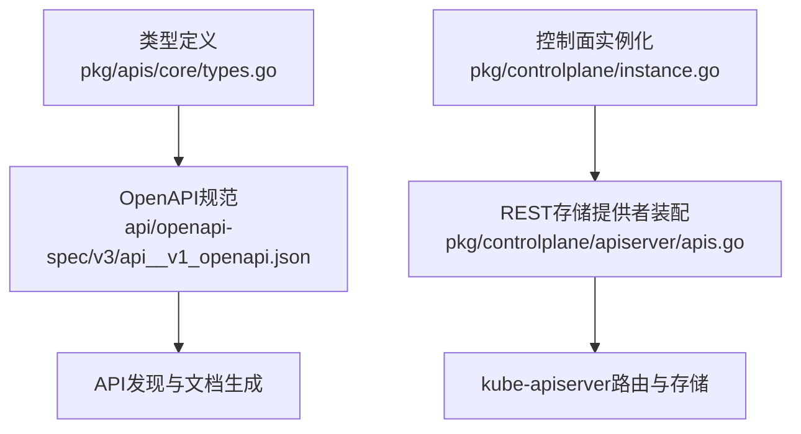
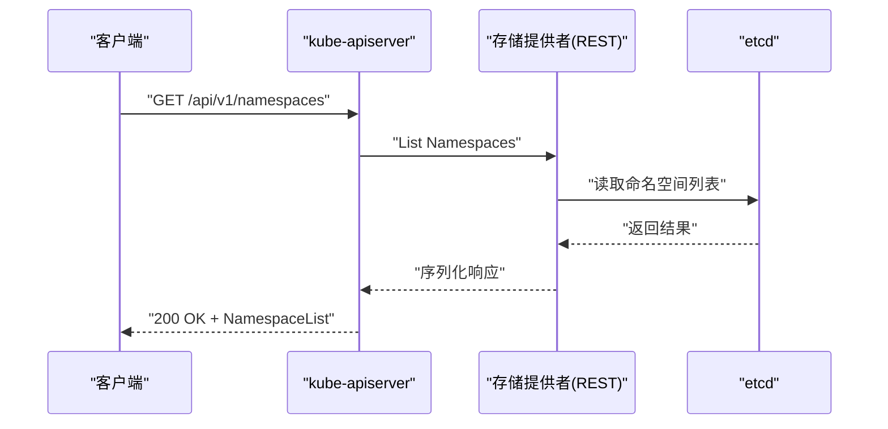
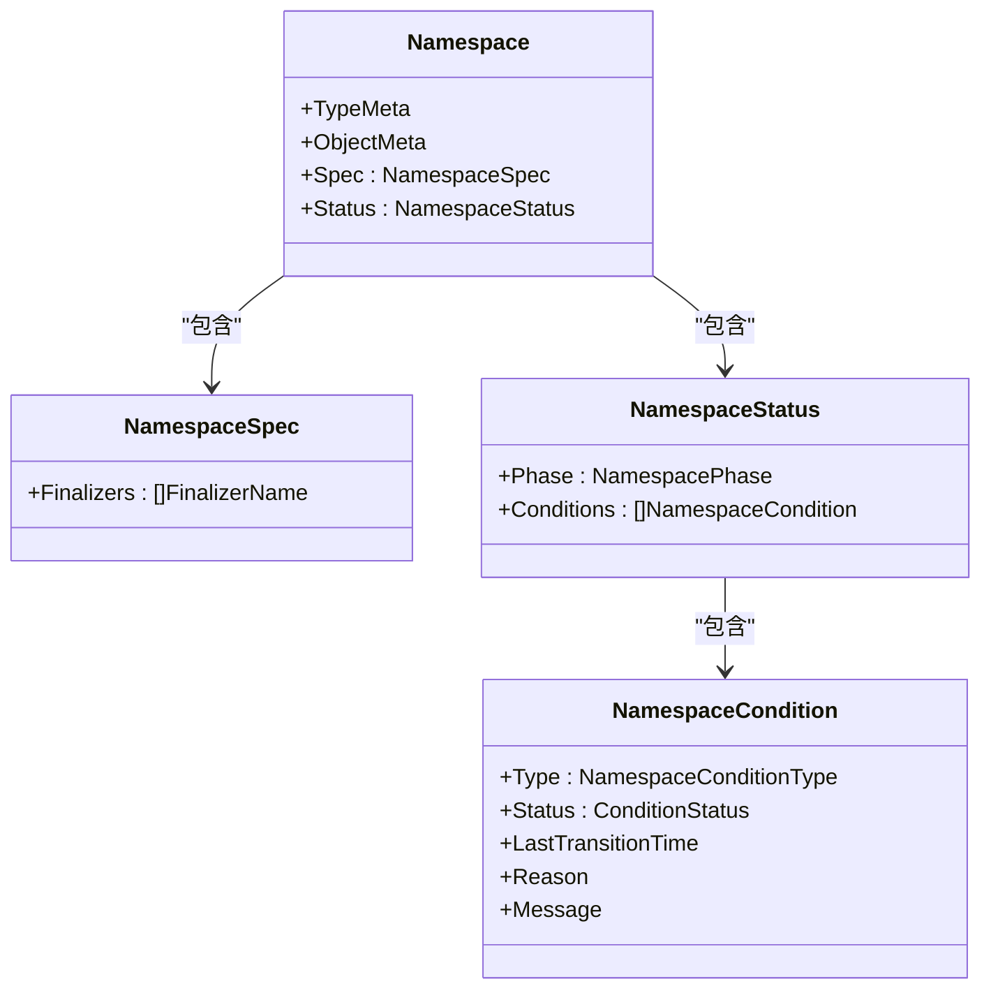
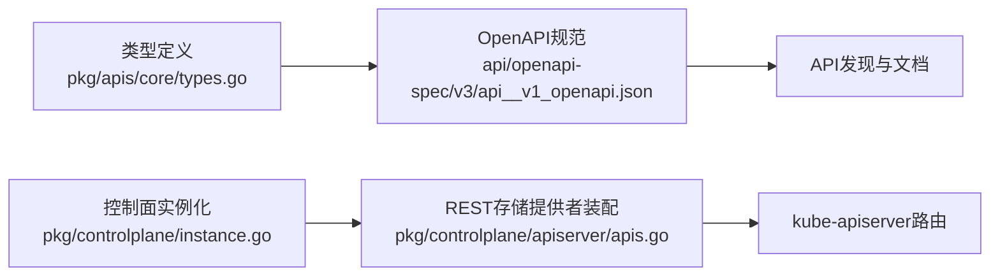

# 命名空间API

<cite>
**本文引用的文件**   
- [pkg/apis/core/types.go](file://pkg/apis/core/types.go)
- [api/openapi-spec/v3/api__v1_openapi.json](file://api/openapi-spec/v3/api__v1_openapi.json)
- [pkg/controlplane/instance.go](file://pkg/controlplane/instance.go)
- [pkg/controlplane/apiserver/apis.go](file://pkg/controlplane/apiserver/apis.go)
- [CHANGELOG/CHANGELOG-1.7.md](file://CHANGELOG/CHANGELOG-1.7.md)
</cite>

## 目录
1. [简介](#简介)
2. [项目结构](#项目结构)
3. [核心组件](#核心组件)
4. [架构总览](#架构总览)
5. [详细组件分析](#详细组件分析)
6. [依赖分析](#依赖分析)
7. [性能考虑](#性能考虑)
8. [故障排查指南](#故障排查指南)
9. [结论](#结论)
10. [附录](#附录)

## 简介
本文件为Kubernetes Namespace资源的REST API参考与管理指南，聚焦以下方面：
- REST API规范：HTTP方法、URL模式、请求参数与响应格式
- 资源隔离机制、配额管理与安全边界
- 完整CRUD操作示例（curl与客户端代码路径）
- 默认配置、资源限制与访问控制
- 错误码与状态码说明
- 多租户使用场景与管理最佳实践

Namespace是集群内逻辑隔离的“作用域”，用于将对象集合划分到独立的作用域中，配合RBAC、ResourceQuota、LimitRange等能力实现多租户隔离。

## 项目结构
与Namespace相关的核心定义与实现位置如下：
- 类型定义：core v1 API中的Namespace、NamespaceSpec、NamespaceStatus等
- OpenAPI规范：v1 API的OpenAPI描述文件
- API注册与存储提供：控制面实例化与REST存储提供者装配

图示来源
- [pkg/apis/core/types.go:5964-6050](file://pkg/apis/core/types.go#L5964-L6050)
- [api/openapi-spec/v3/api__v1_openapi.json](file://api/openapi-spec/v3/api__v1_openapi.json)
- [pkg/controlplane/instance.go:392-418](file://pkg/controlplane/instance.go#L392-L418)
- [pkg/controlplane/apiserver/apis.go:63-87](file://pkg/controlplane/apiserver/apis.go#L63-L87)

章节来源
- [pkg/apis/core/types.go:5964-6050](file://pkg/apis/core/types.go#L5964-L6050)
- [api/openapi-spec/v3/api__v1_openapi.json](file://api/openapi-spec/v3/api__v1_openapi.json)
- [pkg/controlplane/instance.go:392-418](file://pkg/controlplane/instance.go#L392-L418)
- [pkg/controlplane/apiserver/apis.go:63-87](file://pkg/controlplane/apiserver/apis.go#L63-L87)

## 核心组件
- Namespace对象模型
  - 包含标准元数据、可选的Spec与Status
  - Spec支持Finalizers以控制删除流程
  - Status包含Phase（Active/Terminating）与条件列表
- Finalizer机制
  - 内置finalizer名称用于确保清理顺序
- 生命周期阶段
  - Active：可用
  - Terminating：正在优雅终止

章节来源
- [pkg/apis/core/types.go:5964-6050](file://pkg/apis/core/types.go#L5964-L6050)

## 架构总览
Namespace作为核心API资源，由kube-apiserver暴露REST接口，并通过存储提供者持久化至etcd。其类型定义与OpenAPI规范驱动了API发现、客户端生成与文档输出。

图示来源
- [pkg/controlplane/instance.go:392-418](file://pkg/controlplane/instance.go#L392-L418)
- [pkg/controlplane/apiserver/apis.go:63-87](file://pkg/controlplane/apiserver/apis.go#L63-L87)

## 详细组件分析

### Namespace对象模型与字段
- 对象
  - apiVersion: v1
  - kind: Namespace
  - metadata: 标准元数据（name、labels、annotations等）
  - spec: 可选，包含Finalizers数组
  - status: 只读，包含phase与conditions
- 关键枚举与常量
  - Phase: Active、Terminating
  - FinalizerName: 内置kubernetes finalizer
- 条件类型
  - 删除相关条件（如内容发现失败、解析失败等）

图示来源
- [pkg/apis/core/types.go:5964-6050](file://pkg/apis/core/types.go#L5964-L6050)

章节来源
- [pkg/apis/core/types.go:5964-6050](file://pkg/apis/core/types.go#L5964-L6050)

### REST API规范（HTTP方法与URL模式）
- 基础路径
  - /api/v1/namespaces
- 支持的HTTP方法
  - GET /api/v1/namespaces：列出所有命名空间
  - GET /api/v1/namespaces/{name}：获取指定命名空间
  - POST /api/v1/namespaces：创建命名空间
  - PUT /api/v1/namespaces/{name}：更新命名空间
  - PATCH /api/v1/namespaces/{name}：部分更新命名空间
  - DELETE /api/v1/namespaces/{name}：删除命名空间
  - 注意：deletecollection不支持（历史变更）
- 查询参数
  - labelSelector、fieldSelector、watch、resourceVersion、timeoutSeconds等通用参数
- 请求体
  - 创建/更新时提交Namespace对象（JSON或YAML）
- 响应体
  - 成功：返回单个Namespace或NamespaceList
  - 失败：返回标准错误对象（包含reason、code等）

章节来源
- [api/openapi-spec/v3/api__v1_openapi.json](file://api/openapi-spec/v3/api__v1_openapi.json)
- [CHANGELOG/CHANGELOG-1.7.md:1503-1506](file://CHANGELOG/CHANGELOG-1.7.md#L1503-L1506)

### 资源隔离机制
- 作用域隔离
  - 同一命名空间内的同名对象不可重复；跨命名空间可重名
- 网络与DNS
  - Service在命名空间内通过短名解析；跨命名空间需使用FQDN
- 存储卷
  - PV全局可见，PVC按命名空间绑定；Volume挂载受命名空间约束
- 调度与亲和性
  - Pod调度策略可在命名空间维度进行标签选择与拓扑约束

章节来源
- [pkg/apis/core/types.go:5964-6050](file://pkg/apis/core/types.go#L5964-L6050)

### 配额管理
- ResourceQuota
  - 对CPU、内存、对象数量等进行配额限制
- LimitRange
  - 设置容器与对象的默认请求/限制范围
- 与Namespace的关系
  - 两者均作用于特定命名空间，共同构成资源治理体系

章节来源
- [api/openapi-spec/v3/api__v1_openapi.json](file://api/openapi-spec/v3/api__v1_openapi.json)

### 安全边界与访问控制
- RBAC
  - Role/ClusterRole与Binding决定命名空间内权限
- PodSecurityAdmission
  - 基于命名空间的Pod安全策略（baseline/restricted）
- NetworkPolicy
  - 命名空间内网络流量控制
- 认证与授权
  - 用户/ServiceAccount令牌与鉴权链

章节来源
- [api/openapi-spec/v3/api__v1_openapi.json](file://api/openapi-spec/v3/api__v1_openapi.json)

### 完整CRUD操作示例

- 创建命名空间
  - curl
    - 示例路径：[创建命名空间](file://api/openapi-spec/v3/api__v1_openapi.json)
  - 客户端代码
    - Go clientset示例路径：[客户端测试用例](file://pkg/client/tests/clientset_test.go)
- 查看命名空间
  - curl
    - 示例路径：[列出命名空间](file://api/openapi-spec/v3/api__v1_openapi.json)
  - kubectl
    - kubectl get namespaces
- 更新命名空间
  - curl
    - 示例路径：[更新命名空间](file://api/openapi-spec/v3/api__v1_openapi.json)
  - kubectl
    - kubectl patch namespace <name> --type=merge -p '{"metadata":{"labels":{...}}}'
- 删除命名空间
  - curl
    - 示例路径：[删除命名空间](file://api/openapi-spec/v3/api__v1_openapi.json)
  - kubectl
    - kubectl delete namespace <name>

章节来源
- [api/openapi-spec/v3/api__v1_openapi.json](file://api/openapi-spec/v3/api__v1_openapi.json)
- [pkg/client/tests/clientset_test.go](file://pkg/client/tests/clientset_test.go)

### 默认配置、资源限制与访问控制
- 默认命名空间
  - default命名空间通常存在且可用于未显式指定命名空间的资源
- 默认资源限制
  - 可通过LimitRange为容器与对象设定默认requests/limits
- 默认访问控制
  - 结合RBAC与PodSecurityAdmission为命名空间建立最小权限基线

章节来源
- [api/openapi-spec/v3/api__v1_openapi.json](file://api/openapi-spec/v3/api__v1_openapi.json)

### 错误码处理与状态码说明
- HTTP状态码
  - 200：成功
  - 201：创建成功
  - 400：请求参数错误
  - 401：未认证
  - 403：无权限
  - 404：资源不存在
  - 409：冲突（例如并发更新）
  - 500：服务器内部错误
- Kubernetes错误对象
  - 包含reason、message、details等字段，便于客户端解析与重试

章节来源
- [api/openapi-spec/v3/api__v1_openapi.json](file://api/openapi-spec/v3/api__v1_openapi.json)

### 多租户使用场景与管理最佳实践
- 典型场景
  - 团队隔离：每个团队一个命名空间，配合RBAC限定访问
  - 环境隔离：dev/staging/prod分命名空间部署
  - 项目隔离：按业务线划分命名空间，结合ResourceQuota与LimitRange管控成本
- 最佳实践
  - 命名规范：统一前缀与后缀约定
  - 标签策略：为命名空间添加owner、env、project等标签
  - 配额先行：先设ResourceQuota/LimitRange再开放应用部署
  - 安全基线：启用PodSecurityAdmission并采用restricted策略
  - 网络策略：默认拒绝入站/出站，按需放行
  - 审计与监控：开启审计日志与指标采集，定期审查权限与配额

章节来源
- [api/openapi-spec/v3/api__v1_openapi.json](file://api/openapi-spec/v3/api__v1_openapi.json)

## 依赖分析
Namespace API的依赖关系包括类型定义、OpenAPI规范与控制面装配。

图示来源
- [pkg/apis/core/types.go:5964-6050](file://pkg/apis/core/types.go#L5964-L6050)
- [api/openapi-spec/v3/api__v1_openapi.json](file://api/openapi-spec/v3/api__v1_openapi.json)
- [pkg/controlplane/instance.go:392-418](file://pkg/controlplane/instance.go#L392-L418)
- [pkg/controlplane/apiserver/apis.go:63-87](file://pkg/controlplane/apiserver/apis.go#L63-L87)

章节来源
- [pkg/apis/core/types.go:5964-6050](file://pkg/apis/core/types.go#L5964-L6050)
- [api/openapi-spec/v3/api__v1_openapi.json](file://api/openapi-spec/v3/api__v1_openapi.json)
- [pkg/controlplane/instance.go:392-418](file://pkg/controlplane/instance.go#L392-L418)
- [pkg/controlplane/apiserver/apis.go:63-87](file://pkg/controlplane/apiserver/apis.go#L63-L87)

## 性能考虑
- 列表与分页
  - 合理使用labelSelector/fieldSelector减少不必要的数据传输
  - 使用watch增量同步避免频繁全量拉取
- 并发与限流
  - 合理设置超时与重试退避，避免雪崩
- 存储层
  - etcd写入放大与压缩策略影响整体吞吐，建议批量操作与合并更新

## 故障排查指南
- 常见问题
  - 删除卡住：检查Finalizers是否被正确释放
  - 权限不足：确认RBAC角色与Binding覆盖目标命名空间
  - 配额超限：检查ResourceQuota与LimitRange限制
  - 网络不通：检查NetworkPolicy与服务FQDN
- 诊断步骤
  - 查看命名空间状态与条件
  - 检查事件与审计日志
  - 验证RBAC与PSA策略
  - 核对配额与限制

章节来源
- [pkg/apis/core/types.go:5964-6050](file://pkg/apis/core/types.go#L5964-L6050)

## 结论
Namespace是Kubernetes多租户与资源治理的基础单元。通过清晰的REST API、完善的类型定义与OpenAPI规范，结合RBAC、ResourceQuota、LimitRange与PodSecurityAdmission，可实现强隔离与可控的资源使用。遵循命名规范、配额先行与安全基线，有助于在多租户环境中稳定运行。

## 附录
- 版本变更提示
  - Namespace API自1.7起不再支持deletecollection操作

章节来源
- [CHANGELOG/CHANGELOG-1.7.md:1503-1506](file://CHANGELOG/CHANGELOG-1.7.md#L1503-L1506)