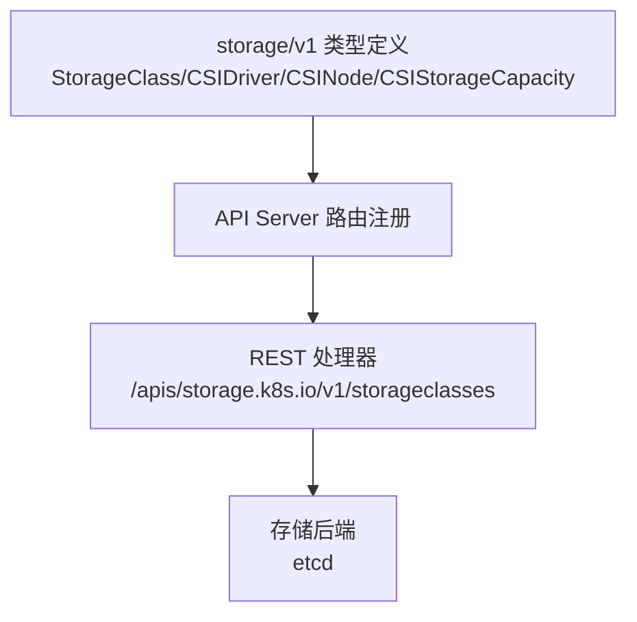
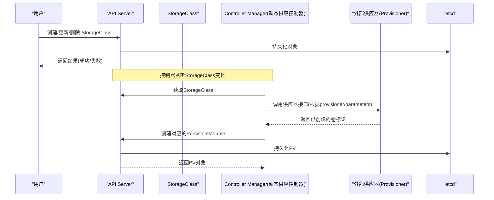
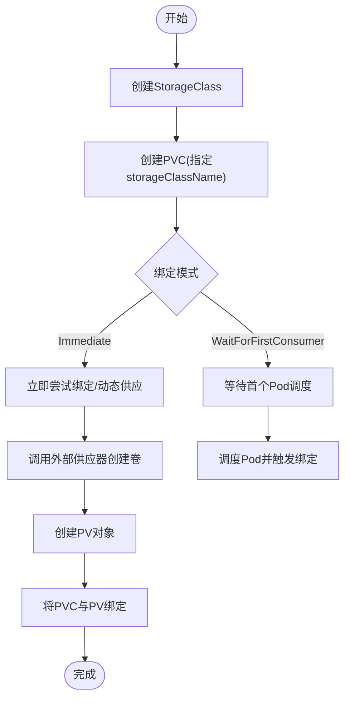
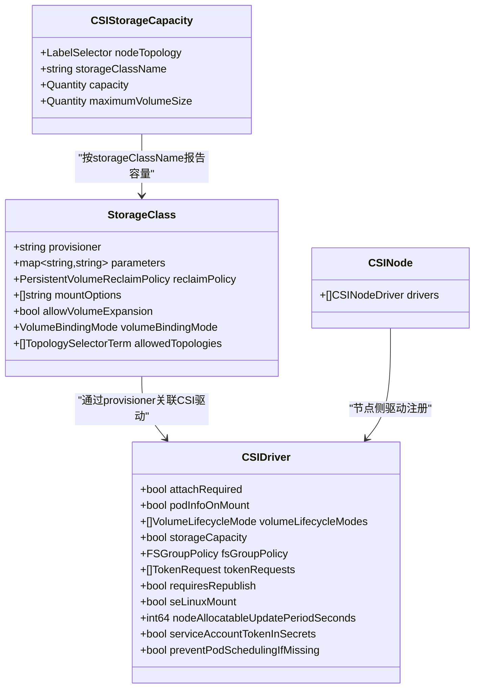

# 存储API

<cite>
**本文引用的文件**   
- [types.go](file://staging/src/k8s.io/api/storage/v1/types.go)
</cite>

## 目录
1. [简介](#简介)
2. [项目结构](#项目结构)
3. [核心组件](#核心组件)
4. [架构总览](#架构总览)
5. [详细组件分析](#详细组件分析)
6. [依赖分析](#依赖分析)
7. [性能考虑](#性能考虑)
8. [故障排查指南](#故障排查指南)
9. [结论](#结论)
10. [附录](#附录)

## 简介
本文件面向Kubernetes存储相关资源的REST API参考，聚焦于以下资源：
- StorageClass（存储类）
- PersistentVolume（持久卷，简称PV）
- PersistentVolumeClaim（持久卷声明，简称PVC）

文档涵盖：
- REST API规范（HTTP方法、URL模式、请求参数与响应格式）
- 绑定机制、动态供应与生命周期管理
- 完整的CRUD操作示例（含curl命令与客户端代码路径）
- 存储卷的挂载、快照、克隆与备份机制说明
- 错误码与状态码处理
- 使用场景与最佳实践

注意：本仓库中未包含PersistentVolume与PersistentVolumeClaim的类型定义文件。本文档对PV/PVC的API描述基于Kubernetes通用API约定与公开规范；StorageClass的字段与行为以仓库中的类型定义为依据。

## 项目结构
与存储API相关的源码位于存储API v1版本包中，其中定义了StorageClass及相关扩展对象（如CSIDriver、CSINode、CSIStorageCapacity等）。这些类型用于驱动动态供应、拓扑感知与容量感知调度等能力。

图表来源
- [types.go:30-89](file://staging/src/k8s.io/api/storage/v1/types.go#L30-L89)

章节来源
- [types.go:30-89](file://staging/src/k8s.io/api/storage/v1/types.go#L30-L89)

## 核心组件
本节概述StorageClass的核心字段与行为，并给出REST API访问方式。

- StorageClass
  - 作用：描述一类可用于动态供应PersistentVolume的参数集合。
  - 关键属性（节选）：
    - provisioner：供应器名称（必填）
    - parameters：供应器参数（可选）
    - reclaimPolicy：回收策略（可选）
    - mountOptions：挂载选项（可选）
    - allowVolumeExpansion：是否允许扩容（可选）
    - volumeBindingMode：绑定模式（Immediate或WaitForFirstConsumer，可选）
    - allowedTopologies：允许的拓扑范围（可选）
  - 列表对象：StorageClassList

- 其他相关对象（与本主题密切相关）：
  - CSIDriver：CSI驱动注册信息，影响attach/mount行为与能力声明
  - CSINode：节点上CSI驱动安装情况
  - CSIStorageCapacity：按拓扑报告的可用容量，支持容量感知调度

章节来源
- [types.go:30-89](file://staging/src/k8s.io/api/storage/v1/types.go#L30-L89)
- [types.go:94-105](file://staging/src/k8s.io/api/storage/v1/types.go#L94-L105)
- [types.go:107-121](file://staging/src/k8s.io/api/storage/v1/types.go#L107-L121)
- [types.go:260-309](file://staging/src/k8s.io/api/storage/v1/types.go#L260-L309)
- [types.go:586-679](file://staging/src/k8s.io/api/storage/v1/types.go#L586-L679)
- [types.go:685-782](file://staging/src/k8s.io/api/storage/v1/types.go#L685-L782)

## 架构总览
下图展示StorageClass在动态供应流程中的角色以及与API Server、控制器和外部供应器的交互关系。

图表来源
- [types.go:30-89](file://staging/src/k8s.io/api/storage/v1/types.go#L30-L89)

## 详细组件分析

### StorageClass REST API参考
- 资源组与版本
  - 组名：storage.k8s.io
  - 版本：v1
- URL模式
  - 列表：GET /apis/storage.k8s.io/v1/storageclasses
  - 单个：GET /apis/storage.k8s.io/v1/storageclasses/{name}
  - 创建：POST /apis/storage.k8s.io/v1/storageclasses
  - 替换：PUT /apis/storage.k8s.io/v1/storageclasses/{name}
  - 更新：PATCH /apis/storage.k8s.io/v1/storageclasses/{name}
  - 删除：DELETE /apis/storage.k8s.io/v1/storageclasses/{name}
  - 列表过滤：在上述列表URL后附加查询参数，例如 ?labelSelector=...&fieldSelector=...
- 请求体
  - 类型为StorageClass，包含metadata与spec字段（见“核心组件”字段说明）
- 响应体
  - 成功：返回StorageClass对象
  - 失败：返回标准错误对象（包含reason、code等）
- 常用查询参数
  - labelSelector、fieldSelector、limit、continue、watch、resourceVersion
- 典型状态码
  - 200 OK：获取成功
  - 201 Created：创建成功
  - 202 Accepted：接受请求（如删除可能返回202）
  - 204 No Content：删除成功且无内容
  - 400 Bad Request：请求体无效
  - 401 Unauthorized：认证失败
  - 403 Forbidden：权限不足
  - 404 Not Found：资源不存在
  - 409 Conflict：冲突（如并发更新）
  - 422 Unprocessable Entity：校验失败
  - 500 Internal Server Error：服务器内部错误
  - 503 Service Unavailable：服务不可用

章节来源
- [types.go:30-89](file://staging/src/k8s.io/api/storage/v1/types.go#L30-L89)

### PersistentVolume(PV) REST API参考
- 资源组与版本
  - 组名：core（内置资源）
  - 版本：v1
- URL模式
  - 列表：GET /api/v1/persistentvolumes
  - 单个：GET /api/v1/persistentvolumes/{name}
  - 创建：POST /api/v1/persistentvolumes
  - 替换：PUT /api/v1/persistentvolumes/{name}
  - 更新：PATCH /api/v1/persistentvolumes/{name}
  - 删除：DELETE /api/v1/persistentvolumes/{name}
- 请求体
  - 类型为PersistentVolume，包含metadata与spec/status字段
- 响应体
  - 成功：返回PersistentVolume对象
  - 失败：返回标准错误对象
- 常用查询参数
  - labelSelector、fieldSelector、limit、continue、watch、resourceVersion
- 典型状态码
  - 同上StorageClass部分

说明：本仓库未包含PV类型定义，上述API遵循Kubernetes通用REST约定。

章节来源
- （本节为通用约定说明，不直接分析具体文件）

### PersistentVolumeClaim(PVC) REST API参考
- 资源组与版本
  - 组名：core（内置资源）
  - 版本：v1
- URL模式
  - 列表：GET /api/v1/namespaces/{namespace}/persistentvolumeclaims
  - 单个：GET /api/v1/namespaces/{namespace}/persistentvolumeclaims/{name}
  - 创建：POST /api/v1/namespaces/{namespace}/persistentvolumeclaims
  - 替换：PUT /api/v1/namespaces/{namespace}/persistentvolumeclaims/{name}
  - 更新：PATCH /api/v1/namespaces/{namespace}/persistentvolumeclaims/{name}
  - 删除：DELETE /api/v1/namespaces/{namespace}/persistentvolumeclaims/{name}
- 请求体
  - 类型为PersistentVolumeClaim，包含metadata、spec与status字段
- 响应体
  - 成功：返回PersistentVolumeClaim对象
  - 失败：返回标准错误对象
- 常用查询参数
  - labelSelector、fieldSelector、limit、continue、watch、resourceVersion
- 典型状态码
  - 同上StorageClass部分

说明：本仓库未包含PVC类型定义，上述API遵循Kubernetes通用REST约定。

章节来源
- （本节为通用约定说明，不直接分析具体文件）

### 绑定机制与动态供应
- 绑定模式
  - Immediate：PVC立即尝试匹配现有PV或触发动态供应
  - WaitForFirstConsumer：延迟到首个引用该PVC的Pod被调度时再进行绑定与供应
- 动态供应流程
  - 当PVC创建且存在匹配的StorageClass时，控制平面通过StorageClass.provisioner调用外部供应器创建底层卷，并生成对应的PV对象
  - 若启用容量感知调度，CSIStorageCapacity可辅助选择合适节点进行绑定
- 生命周期管理
  - PV回收策略由StorageClass.reclaimPolicy决定（Delete/Retain/Recycle）
  - 允许扩容：当StorageClass.allowVolumeExpansion为true时，可通过更新PVC.spec.resources.requests.storage实现在线扩容（取决于后端能力）

图表来源
- [types.go:30-89](file://staging/src/k8s.io/api/storage/v1/types.go#L30-L89)
- [types.go:107-121](file://staging/src/k8s.io/api/storage/v1/types.go#L107-L121)

章节来源
- [types.go:30-89](file://staging/src/k8s.io/api/storage/v1/types.go#L30-L89)
- [types.go:107-121](file://staging/src/k8s.io/api/storage/v1/types.go#L107-L121)

### 快照、克隆与备份机制
- 快照与克隆
  - 快照与克隆通常通过VolumeSnapshot与VolumeSnapshotContent等资源实现，属于扩展API范畴
  - 本仓库未包含快照相关类型定义，建议参考官方API文档与CSI驱动能力
- 备份
  - 备份一般通过外部工具或CSI驱动提供的导出功能实现，不属于核心API范畴

章节来源
- （本节为概念性说明，不直接分析具体文件）

### 实际使用示例（curl与客户端代码路径）
- 创建StorageClass（curl）
  - 方法：POST
  - URL：/apis/storage.k8s.io/v1/storageclasses
  - 请求体：StorageClass对象（包含metadata与spec）
  - 参考字段：provisioner、parameters、reclaimPolicy、mountOptions、allowVolumeExpansion、volumeBindingMode、allowedTopologies
- 创建PVC（curl）
  - 方法：POST
  - URL：/api/v1/namespaces/{namespace}/persistentvolumeclaims
  - 请求体：PersistentVolumeClaim对象（包含metadata、spec）
  - 参考字段：spec.storageClassName、spec.resources.requests.storage、spec.accessModes
- 客户端代码路径
  - Go客户端库：k8s.io/client-go（对应storage.k8s.io/v1的StorageClass客户端）
  - 其他语言客户端：参见各语言的kubernetes client库

章节来源
- [types.go:30-89](file://staging/src/k8s.io/api/storage/v1/types.go#L30-L89)

### 错误码与状态码说明
- HTTP状态码
  - 2xx：成功（200/201/202/204）
  - 4xx：客户端错误（400/401/403/404/409/422）
  - 5xx：服务端错误（500/503）
- 常见错误原因
  - 400：请求体JSON解析失败或字段缺失
  - 401：未提供有效凭据
  - 403：RBAC拒绝访问
  - 404：资源不存在
  - 409：并发更新冲突（需重试或合并变更）
  - 422：字段校验失败（如provisioner为空、参数非法）
  - 500：API Server内部异常
  - 503：API Server暂时不可用

章节来源
- （本节为通用约定说明，不直接分析具体文件）

## 依赖分析
StorageClass与CSI生态对象的依赖关系如下：

图表来源
- [types.go:30-89](file://staging/src/k8s.io/api/storage/v1/types.go#L30-L89)
- [types.go:260-309](file://staging/src/k8s.io/api/storage/v1/types.go#L260-L309)
- [types.go:586-679](file://staging/src/k8s.io/api/storage/v1/types.go#L586-L679)
- [types.go:685-782](file://staging/src/k8s.io/api/storage/v1/types.go#L685-L782)

章节来源
- [types.go:30-89](file://staging/src/k8s.io/api/storage/v1/types.go#L30-L89)
- [types.go:260-309](file://staging/src/k8s.io/api/storage/v1/types.go#L260-L309)
- [types.go:586-679](file://staging/src/k8s.io/api/storage/v1/types.go#L586-L679)
- [types.go:685-782](file://staging/src/k8s.io/api/storage/v1/types.go#L685-L782)

## 性能考虑
- 合理设置volumeBindingMode
  - WaitForFirstConsumer可减少不必要的提前供应，提升集群整体效率
- 利用CSIStorageCapacity
  - 开启容量感知调度有助于避免在不具备足够容量的节点上调度，减少失败重试
- 控制参数大小
  - VolumeAttributesClass.parameters有数量与大小限制，避免过大参数导致序列化开销
- 监控与限流
  - 关注API Server与外部供应器的QPS限制，避免突发流量造成抖动

章节来源
- [types.go:685-782](file://staging/src/k8s.io/api/storage/v1/types.go#L685-L782)
- [types.go:800-818](file://staging/src/k8s.io/api/storage/v1/types.go#L800-L818)

## 故障排查指南
- 常见问题定位
  - 检查StorageClass.provisioner是否正确配置且与CSI驱动一致
  - 确认CSIDriver已正确部署并在目标节点注册（CSINode.drivers）
  - 查看CSIStorageCapacity是否发布容量信息，确保调度能做出正确决策
  - 检查PVC.spec.storageClassName是否与StorageClass匹配
  - 观察PVC与PV的状态事件，定位绑定失败原因
- 日志与事件
  - 查看API Server日志、控制器管理器日志与外部供应器日志
  - 使用kubectl describe查看PVC/PV/StorageClass的事件记录

章节来源
- [types.go:260-309](file://staging/src/k8s.io/api/storage/v1/types.go#L260-L309)
- [types.go:586-679](file://staging/src/k8s.io/api/storage/v1/types.go#L586-L679)
- [types.go:685-782](file://staging/src/k8s.io/api/storage/v1/types.go#L685-L782)

## 结论
StorageClass是Kubernetes动态供应与存储策略编排的核心抽象。结合CSI生态（CSIDriver、CSINode、CSIStorageCapacity），可实现拓扑与容量感知的智能调度与高效供应。对于PV与PVC，尽管本仓库未包含其类型定义，但其REST API遵循统一的Kubernetes约定，便于跨语言与工具链集成。在生产环境中，建议结合合理的绑定模式、容量感知与参数约束，以获得稳定高效的存储体验。

## 附录
- 术语
  - 动态供应：根据PVC自动创建底层卷并生成PV
  - 绑定：将PVC与PV建立关联
  - 回收策略：PVC删除后PV的处理方式（Delete/Retain/Recycle）
- 参考
  - Kubernetes API约定与通用REST规范
  - CSI驱动与插件生态文档