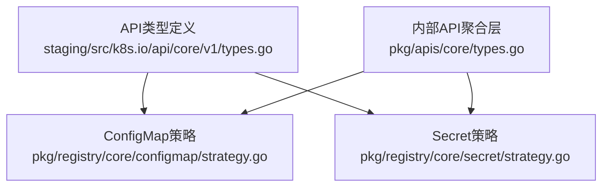
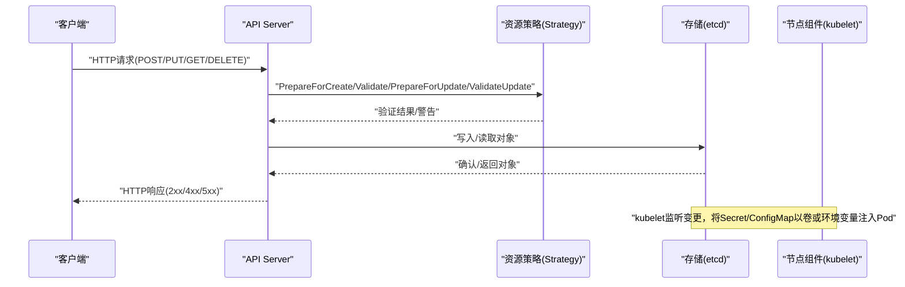
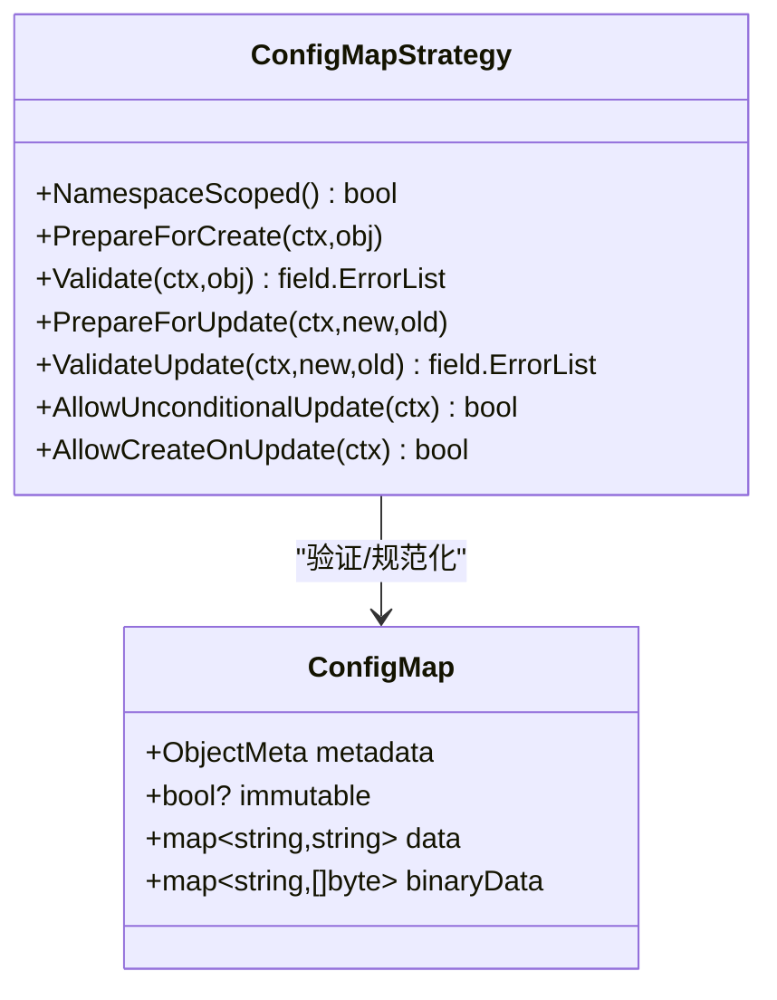
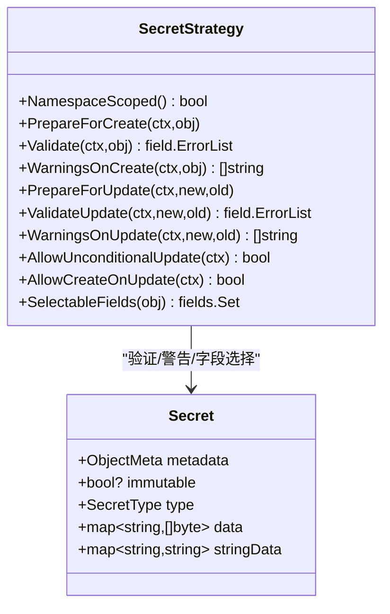
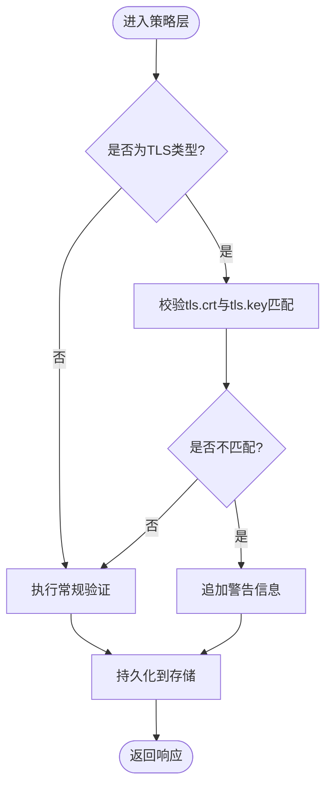
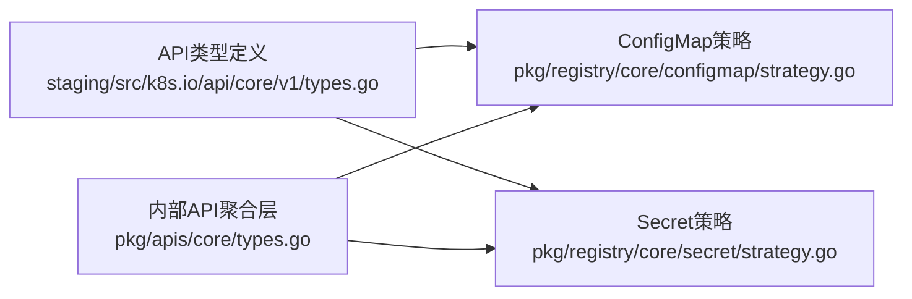

# 配置与密钥管理API

<cite>
**本文引用的文件**   
- [staging/src/k8s.io/api/core/v1/types.go](file://staging/src/k8s.io/api/core/v1/types.go)
- [pkg/registry/core/configmap/strategy.go](file://pkg/registry/core/configmap/strategy.go)
- [pkg/registry/core/secret/strategy.go](file://pkg/registry/core/secret/strategy.go)
- [pkg/apis/core/types.go](file://pkg/apis/core/types.go)
</cite>

## 目录
1. [简介](#简介)
2. [项目结构](#项目结构)
3. [核心组件](#核心组件)
4. [架构总览](#架构总览)
5. [详细组件分析](#详细组件分析)
6. [依赖关系分析](#依赖关系分析)
7. [性能考虑](#性能考虑)
8. [故障排查指南](#故障排查指南)
9. [结论](#结论)
10. [附录](#附录)

## 简介
本参考文档聚焦于Kubernetes中ConfigMap与Secret资源的REST API规范、数据模型、存储与安全机制，以及它们在Pod中的使用方式（环境变量注入与卷挂载）。内容涵盖：
- REST API方法、URL模式、请求参数与响应格式
- ConfigMap的数据存储、键值约束、二进制数据字段与环境变量传播限制
- Secret的加密存储、类型分类、TLS校验警告与访问控制要点
- 完整的CRUD操作示例（curl与客户端代码路径）
- 配置热更新、密钥轮换与权限控制的实践建议
- 错误码与状态码说明
- 实际使用场景与安全最佳实践

## 项目结构
与ConfigMap和Secret相关的核心定义与策略位于以下位置：
- 资源类型定义：staging/src/k8s.io/api/core/v1/types.go
- 注册表策略（创建/更新/验证/过滤等）：pkg/registry/core/configmap/strategy.go、pkg/registry/core/secret/strategy.go
- 内部API聚合层（兼容映射）：pkg/apis/core/types.go

图表来源
- [staging/src/k8s.io/api/core/v1/types.go:7960-8200](file://staging/src/k8s.io/api/core/v1/types.go#L7960-L8200)
- [pkg/registry/core/configmap/strategy.go:1-122](file://pkg/registry/core/configmap/strategy.go#L1-L122)
- [pkg/registry/core/secret/strategy.go:1-145](file://pkg/registry/core/secret/strategy.go#L1-L145)
- [pkg/apis/core/types.go:6630-6758](file://pkg/apis/core/types.go#L6630-L6758)

章节来源
- [staging/src/k8s.io/api/core/v1/types.go:7960-8200](file://staging/src/k8s.io/api/core/v1/types.go#L7960-L8200)
- [pkg/registry/core/configmap/strategy.go:1-122](file://pkg/registry/core/configmap/strategy.go#L1-L122)
- [pkg/registry/core/secret/strategy.go:1-145](file://pkg/registry/core/secret/strategy.go#L1-L145)
- [pkg/apis/core/types.go:6630-6758](file://pkg/apis/core/types.go#L6630-L6758)

## 核心组件
- ConfigMap
  - 用途：为Pod提供非敏感的配置数据。支持文本Data与二进制BinaryData两个字段；注意BinaryData不会通过ConfigMapKeyRef或ConfigMapRef注入到容器环境变量。
  - 不可变：支持Immutable字段，设为true后仅可修改元数据。
- Secret
  - 用途：保存敏感信息（如证书、密码、令牌等），支持多种内置类型（Opaque、kubernetes.io/tls、kubernetes.io/service-account-token、kubernetes.io/dockerconfigjson、kubernetes.io/basic-auth、kubernetes.io/ssh-auth等）。
  - 安全特性：支持Immutable；当类型为TLS时，策略层会校验私钥与证书是否匹配并返回警告；最大容量受MaxSecretSize限制。

章节来源
- [staging/src/k8s.io/api/core/v1/types.go:7960-8200](file://staging/src/k8s.io/api/core/v1/types.go#L7960-L8200)
- [pkg/registry/core/configmap/strategy.go:1-122](file://pkg/registry/core/configmap/strategy.go#L1-L122)
- [pkg/registry/core/secret/strategy.go:1-145](file://pkg/registry/core/secret/strategy.go#L1-L145)

## 架构总览
从API Server视角，ConfigMap与Secret的REST处理流程如下：
- 客户端通过REST API提交对象
- API Server路由到对应资源的REST策略（Create/Update/Validate）
- 策略调用声明式验证与业务验证（例如Secret TLS校验）
- 持久化至后端存储（etcd），并由控制器/组件消费（如kubelet将Secret/ConfigMap以卷或环境变量形式注入Pod）

图表来源
- [pkg/registry/core/configmap/strategy.go:1-122](file://pkg/registry/core/configmap/strategy.go#L1-L122)
- [pkg/registry/core/secret/strategy.go:1-145](file://pkg/registry/core/secret/strategy.go#L1-L145)

## 详细组件分析

### ConfigMap API参考
- 命名空间：是（Namespaced）
- 资源名：configmaps
- 版本：v1
- 支持的HTTP方法与URL模式
  - 列表/搜索
    - GET /api/v1/namespaces/{namespace}/configmaps
    - GET /api/v1/configmaps（跨命名空间，需授权）
  - 单资源
    - GET /api/v1/namespaces/{namespace}/configmaps/{name}
    - PUT /api/v1/namespaces/{namespace}/configmaps/{name}
    - PATCH /api/v1/namespaces/{namespace}/configmaps/{name}
    - DELETE /api/v1/namespaces/{namespace}/configmaps/{name}
  - 创建
    - POST /api/v1/namespaces/{namespace}/configmaps
- 请求体
  - 标准元数据metadata
  - data: map[string]string（键名需符合标识符规则）
  - binaryData: map[string][]byte（Base64编码的二进制数据）
  - immutable: boolean（可选）
- 查询参数
  - labelSelector、fieldSelector、watch、resourceVersion、limit、continue等通用参数
- 响应体
  - 成功：200/201/202，返回ConfigMap对象或List
  - 失败：4xx/5xx，返回标准错误对象
- 行为与约束
  - 允许无条件更新（AllowUnconditionalUpdate=true）
  - 不允许在Update时隐式创建（AllowCreateOnUpdate=false）
  - 支持标签与字段选择器过滤
  - BinaryData不会通过ConfigMapKeyRef/ConfigMapRef注入到环境变量

章节来源
- [pkg/registry/core/configmap/strategy.go:52-98](file://pkg/registry/core/configmap/strategy.go#L52-L98)
- [staging/src/k8s.io/api/core/v1/types.go:8109-8143](file://staging/src/k8s.io/api/core/v1/types.go#L8109-L8143)

#### ConfigMap类图（代码级）

图表来源
- [staging/src/k8s.io/api/core/v1/types.go:8109-8143](file://staging/src/k8s.io/api/core/v1/types.go#L8109-L8143)
- [pkg/registry/core/configmap/strategy.go:36-98](file://pkg/registry/core/configmap/strategy.go#L36-L98)

### Secret API参考
- 命名空间：是（Namespaced）
- 资源名：secrets
- 版本：v1
- 支持的HTTP方法与URL模式
  - 列表/搜索
    - GET /api/v1/namespaces/{namespace}/secrets
    - GET /api/v1/secrets（跨命名空间，需授权）
  - 单资源
    - GET /api/v1/namespaces/{namespace}/secrets/{name}
    - PUT /api/v1/namespaces/{namespace}/secrets/{name}
    - PATCH /api/v1/namespaces/{namespace}/secrets/{name}
    - DELETE /api/v1/namespaces/{namespace}/secrets/{name}
  - 创建
    - POST /api/v1/namespaces/{namespace}/secrets
- 请求体
  - 标准元数据metadata
  - type: SecretType（可选，默认Opaque）
  - data: map[string][]byte（Base64编码）
  - stringData: map[string]string（写时合并入data，读不出）
  - immutable: boolean（可选）
- 查询参数
  - labelSelector、fieldSelector、watch、resourceVersion、limit、continue等通用参数
- 响应体
  - 成功：200/201/202，返回Secret对象或List
  - 失败：4xx/5xx，返回标准错误对象
- 行为与约束
  - 允许无条件更新（AllowUnconditionalUpdate=true）
  - 不允许在Update时隐式创建（AllowCreateOnUpdate=false）
  - 支持按type字段进行字段选择器过滤
  - 当type为TLS时，策略层会校验tls.crt与tls.key是否匹配，并返回警告
  - 最大容量受MaxSecretSize限制

章节来源
- [pkg/registry/core/secret/strategy.go:51-105](file://pkg/registry/core/secret/strategy.go#L51-L105)
- [pkg/registry/core/secret/strategy.go:125-144](file://pkg/registry/core/secret/strategy.go#L125-L144)
- [staging/src/k8s.io/api/core/v1/types.go:7960-8087](file://staging/src/k8s.io/api/core/v1/types.go#L7960-L8087)

#### Secret类图（代码级）

图表来源
- [staging/src/k8s.io/api/core/v1/types.go:7960-8087](file://staging/src/k8s.io/api/core/v1/types.go#L7960-L8087)
- [pkg/registry/core/secret/strategy.go:37-105](file://pkg/registry/core/secret/strategy.go#L37-L105)
- [pkg/registry/core/secret/strategy.go:125-144](file://pkg/registry/core/secret/strategy.go#L125-L144)

### 数据流与处理逻辑（算法流程图）

图表来源
- [pkg/registry/core/secret/strategy.go:134-144](file://pkg/registry/core/secret/strategy.go#L134-L144)

## 依赖关系分析
- 类型定义依赖
  - ConfigMap/Secret类型定义位于staging/src/k8s.io/api/core/v1/types.go
  - 内部API聚合层pkg/apis/core/types.go包含对应的类型映射
- 策略实现依赖
  - 策略实现位于pkg/registry/core/*/strategy.go，依赖通用验证框架与名称生成器
  - Secret策略额外依赖TLS库进行证书校验

图表来源
- [staging/src/k8s.io/api/core/v1/types.go:7960-8200](file://staging/src/k8s.io/api/core/v1/types.go#L7960-L8200)
- [pkg/registry/core/configmap/strategy.go:1-122](file://pkg/registry/core/configmap/strategy.go#L1-L122)
- [pkg/registry/core/secret/strategy.go:1-145](file://pkg/registry/core/secret/strategy.go#L1-L145)
- [pkg/apis/core/types.go:6630-6758](file://pkg/apis/core/types.go#L6630-L6758)

章节来源
- [staging/src/k8s.io/api/core/v1/types.go:7960-8200](file://staging/src/k8s.io/api/core/v1/types.go#L7960-L8200)
- [pkg/registry/core/configmap/strategy.go:1-122](file://pkg/registry/core/configmap/strategy.go#L1-L122)
- [pkg/registry/core/secret/strategy.go:1-145](file://pkg/registry/core/secret/strategy.go#L1-L145)
- [pkg/apis/core/types.go:6630-6758](file://pkg/apis/core/types.go#L6630-L6758)

## 性能考虑
- 大小限制
  - Secret总字节数上限由MaxSecretSize定义，避免过大对象影响存储与网络传输
- 更新策略
  - 两者均允许无条件更新，便于快速迭代，但需注意频繁更新对etcd与下游组件的压力
- 字段选择器
  - 利用labelSelector与fieldSelector减少不必要的数据传输与计算开销

章节来源
- [staging/src/k8s.io/api/core/v1/types.go:8002](file://staging/src/k8s.io/api/core/v1/types.go#L8002)
- [pkg/registry/core/configmap/strategy.go:96-98](file://pkg/registry/core/configmap/strategy.go#L96-L98)
- [pkg/registry/core/secret/strategy.go:103-105](file://pkg/registry/core/secret/strategy.go#L103-L105)

## 故障排查指南
- 常见错误
  - 400 Bad Request：请求体字段不符合约定（如键名非法、data与binaryData键冲突、超出大小限制）
  - 401 Unauthorized：未认证或认证失败
  - 403 Forbidden：无权限访问目标命名空间或资源
  - 404 Not Found：资源不存在
  - 409 Conflict：并发更新冲突（需重试或使用resourceVersion）
  - 422 Unprocessable Entity：语义校验失败（如TLS证书不匹配时的警告可能伴随拒绝策略）
  - 5xx：服务端异常（存储不可用、超时等）
- 调试建议
  - 开启watch与resourceVersion进行增量同步
  - 检查字段选择器与标签选择器是否正确
  - 对于TLS类型Secret，确保证书与私钥配对一致

章节来源
- [pkg/registry/core/secret/strategy.go:134-144](file://pkg/registry/core/secret/strategy.go#L134-L144)

## 结论
ConfigMap与Secret作为Kubernetes的核心配置与密钥载体，提供了统一的REST API与严格的验证策略。通过合理利用不可变字段、类型分类与字段选择器，可以在保障安全的同时提升运维效率。结合RBAC与审计日志，可实现细粒度的访问控制与合规追踪。

## 附录

### CRUD操作示例（curl）
- 创建ConfigMap
  - curl -X POST -H "Content-Type: application/json" --data-binary @configmap.json https://<apiserver>/api/v1/namespaces/<ns>/configmaps
- 获取ConfigMap
  - curl -H "Authorization: Bearer <token>" https://<apiserver>/api/v1/namespaces/<ns>/configmaps/<name>
- 更新ConfigMap
  - curl -X PUT -H "Content-Type: application/json" --data-binary @configmap-updated.json https://<apiserver>/api/v1/namespaces/<ns>/configmaps/<name>
- 删除ConfigMap
  - curl -X DELETE https://<apiserver>/api/v1/namespaces/<ns>/configmaps/<name>
- 创建Secret
  - curl -X POST -H "Content-Type: application/json" --data-binary @secret.json https://<apiserver>/api/v1/namespaces/<ns>/secrets
- 获取Secret
  - curl -H "Authorization: Bearer <token>" https://<apiserver>/api/v1/namespaces/<ns>/secrets/<name>
- 更新Secret
  - curl -X PUT -H "Content-Type: application/json" --data-binary @secret-updated.json https://<apiserver>/api/v1/namespaces/<ns>/secrets/<name>
- 删除Secret
  - curl -X DELETE https://<apiserver>/api/v1/namespaces/<ns>/secrets/<name>

提示：以上命令仅为示例，请根据实际集群环境替换端点、命名空间、资源名与认证信息。

### 客户端代码路径
- Go客户端（typed client）
  - ConfigMap: staging/src/k8s.io/client-go/kubernetes/typed/core/v1/configmap.go
  - Secret: staging/src/k8s.io/client-go/kubernetes/typed/core/v1/secret.go
- Apply配置（ApplyConfiguration）
  - ConfigMap: staging/src/k8s.io/client-go/applyconfigurations/core/v1/configmap.go
  - Secret: staging/src/k8s.io/client-go/applyconfigurations/core/v1/secret.go

章节来源
- [staging/src/k8s.io/client-go/kubernetes/typed/core/v1/configmap.go](file://staging/src/k8s.io/client-go/kubernetes/typed/core/v1/configmap.go)
- [staging/src/k8s.io/client-go/kubernetes/typed/core/v1/secret.go](file://staging/src/k8s.io/client-go/kubernetes/typed/core/v1/secret.go)
- [staging/src/k8s.io/client-go/applyconfigurations/core/v1/configmap.go](file://staging/src/k8s.io/client-go/applyconfigurations/core/v1/configmap.go)
- [staging/src/k8s.io/client-go/applyconfigurations/core/v1/secret.go](file://staging/src/k8s.io/client-go/applyconfigurations/core/v1/secret.go)

### 环境变量注入与卷挂载机制
- 环境变量注入
  - ConfigMap：可通过ConfigMapKeyRef或ConfigMapRef将data键注入为环境变量；binaryData不会通过上述方式注入到环境变量
  - Secret：可通过SecretKeyRef将data键注入为环境变量
- 卷挂载
  - ConfigMap：通过ConfigMapVolumeSource或ProjectedVolumeSource挂载为只读卷
  - Secret：通过SecretVolumeSource或ProjectedVolumeSource挂载为只读卷（支持可选的defaultMode与items映射）

章节来源
- [staging/src/k8s.io/api/core/v1/types.go:8109-8143](file://staging/src/k8s.io/api/core/v1/types.go#L8109-L8143)

### 配置热更新、密钥轮换与权限控制
- 配置热更新
  - 通过更新ConfigMap/Secret触发kubelet重新挂载卷或刷新环境变量（取决于具体挂载方式与组件实现）
- 密钥轮换
  - 建议使用不可变Secret（immutable=true）配合新的Secret对象与引用切换，降低运行时风险
  - TLS类型Secret应确保新证书与私钥配对一致，避免警告或拒绝
- 权限控制
  - 使用RBAC严格控制对Secret的读写权限，最小权限原则
  - 审计日志记录关键操作，便于追溯

[本节为概念性指导，无需源码引用]