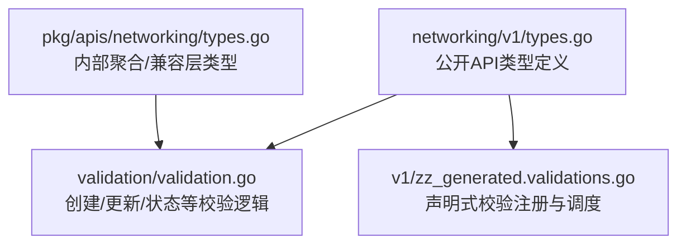
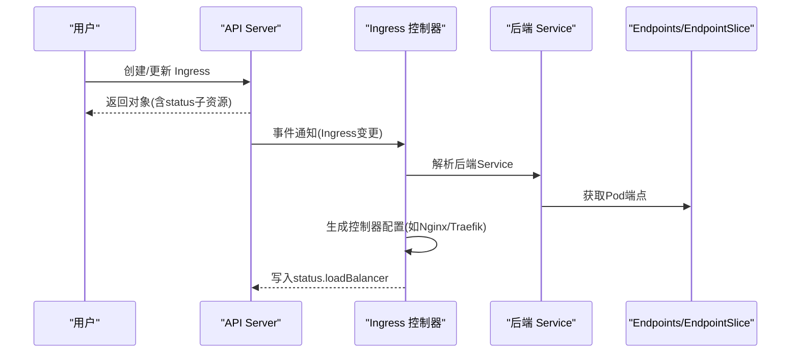
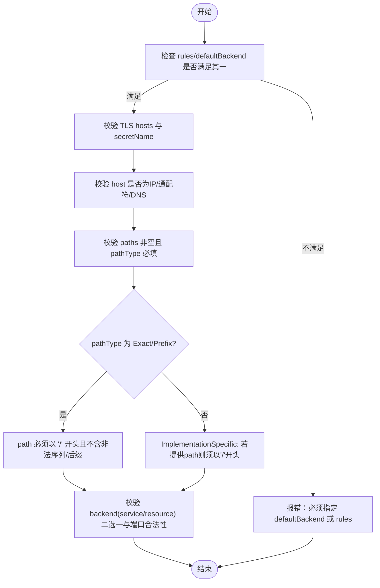
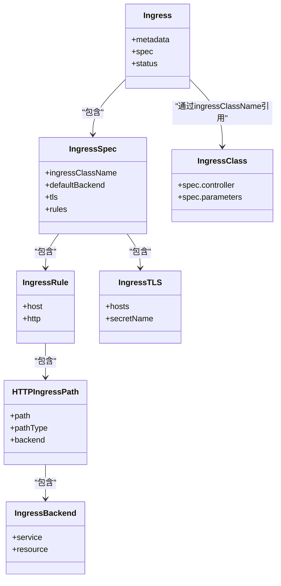

# Ingress API

<cite>
**本文引用的文件**   
- [staging/src/k8s.io/api/networking/v1/types.go](file://staging/src/k8s.io/api/networking/v1/types.go)
- [pkg/apis/networking/types.go](file://pkg/apis/networking/types.go)
- [pkg/apis/networking/validation/validation.go](file://pkg/apis/networking/validation/validation.go)
- [pkg/apis/networking/v1/zz_generated.validations.go](file://pkg/apis/networking/v1/zz_generated.validations.go)
</cite>

## 目录
1. [简介](#简介)
2. [项目结构](#项目结构)
3. [核心组件](#核心组件)
4. [架构总览](#架构总览)
5. [详细组件分析](#详细组件分析)
6. [依赖关系分析](#依赖关系分析)
7. [性能与兼容性说明](#性能与兼容性说明)
8. [故障排查指南](#故障排查指南)
9. [结论](#结论)
10. [附录：YAML 示例路径](#附录yaml-示例路径)

## 简介
本文件为 Kubernetes Ingress 资源的 REST API 参考文档，聚焦 networking.k8s.io/v1 版本的 Ingress、IngressClass 及其关联类型。内容涵盖：
- spec/status 字段定义与校验规则
- HTTP 路由规则（host、path、pathType、后端服务）
- TLS 配置与 SNI 行为
- 与不同 Ingress 控制器的集成要点与调优建议
- 常见使用场景的 YAML 示例路径（不直接粘贴代码，提供来源定位）

## 项目结构
Kubernetes 源码中，Ingress 的 API 定义位于 networking v1 包；同时存在内部版本 types 与验证逻辑。下图展示与本参考文档相关的核心文件与职责：

**图示来源** 
- [staging/src/k8s.io/api/networking/v1/types.go:245-321](file://staging/src/k8s.io/api/networking/v1/types.go#L245-L321)
- [pkg/apis/networking/validation/validation.go:293-379](file://pkg/apis/networking/validation/validation.go#L293-L379)
- [pkg/apis/networking/v1/zz_generated.validations.go:260-293](file://pkg/apis/networking/v1/zz_generated.validations.go#L260-L293)
- [pkg/apis/networking/types.go:213-287](file://pkg/apis/networking/types.go#L213-L287)

**章节来源**
- [staging/src/k8s.io/api/networking/v1/types.go:245-321](file://staging/src/k8s.io/api/networking/v1/types.go#L245-L321)
- [pkg/apis/networking/types.go:213-287](file://pkg/apis/networking/types.go#L213-L287)

## 核心组件
本节概述 Ingress 相关核心类型及作用：
- Ingress：描述入站流量到后端的规则集合，支持负载均衡、SSL 终止、基于名称的虚拟主机等
- IngressSpec：包含 ingressClassName、defaultBackend、TLS、rules
- IngressRule/HTTPIngressRuleValue/HTTPIngressPath：按 host 和 path 将请求路由到后端
- PathType：Exact、Prefix、ImplementationSpecific
- IngressBackend/IngressServiceBackend/ServiceBackendPort：指向 Service 或资源引用
- IngressTLS：证书 Secret 与 hosts 列表
- IngressStatus/LoadBalancer：控制器写入的外部访问入口信息
- IngressClass/IngressClassSpec/ParametersReference：选择控制器并可选地传递参数

**章节来源**
- [staging/src/k8s.io/api/networking/v1/types.go:245-321](file://staging/src/k8s.io/api/networking/v1/types.go#L245-L321)
- [staging/src/k8s.io/api/networking/v1/types.go:323-340](file://staging/src/k8s.io/api/networking/v1/types.go#L323-L340)
- [staging/src/k8s.io/api/networking/v1/types.go:342-395](file://staging/src/k8s.io/api/networking/v1/types.go#L342-L395)
- [staging/src/k8s.io/api/networking/v1/types.go:397-514](file://staging/src/k8s.io/api/networking/v1/types.go#L397-L514)
- [staging/src/k8s.io/api/networking/v1/types.go:516-554](file://staging/src/k8s.io/api/networking/v1/types.go#L516-L554)
- [staging/src/k8s.io/api/networking/v1/types.go:561-636](file://staging/src/k8s.io/api/networking/v1/types.go#L561-L636)

## 架构总览
Ingress 的工作流由 API Server 持久化对象，并由 Ingress 控制器读取并转换为具体实现（如 Nginx/Traefik）。下图展示了从用户提交到控制器生效的关键步骤：

**图示来源**
- [staging/src/k8s.io/api/networking/v1/types.go:342-395](file://staging/src/k8s.io/api/networking/v1/types.go#L342-L395)
- [pkg/apis/networking/validation/validation.go:381-417](file://pkg/apis/networking/validation/validation.go#L381-L417)

## 详细组件分析

### Ingress 对象模型与字段规范
- Ingress
  - metadata：标准元数据
  - spec：期望状态
  - status：当前状态（由控制器维护）
- IngressSpec
  - ingressClassName：选择控制器类（优先于已弃用的注解）
  - defaultBackend：未匹配任何规则的默认后端
  - tls：TLS 配置（hosts 与 secretName）
  - rules：HTTP 路由规则列表
- IngressRule
  - host：精确域名或单级通配符前缀（*.example.com）
  - IngressRuleValue：当前仅支持 http
- HTTPIngressRuleValue
  - paths：路径到后端的映射
- HTTPIngressPath
  - path：URL 路径
  - pathType：Exact/Prefix/ImplementationSpecific
  - backend：IngressBackend
- IngressBackend
  - service：指向 Service 的名称与端口（二选一）
  - resource：指向同命名空间内其他资源的 TypedLocalObjectReference（二选一）
- IngressServiceBackend / ServiceBackendPort
  - name/number：互斥指定端口
- IngressTLS
  - hosts：证书包含的域名列表
  - secretName：用于 443 端口 TLS 终止的 Secret 名称
- IngressStatus
  - loadBalancer.ingress：外部 IP/Hostname 与端口状态

**章节来源**
- [staging/src/k8s.io/api/networking/v1/types.go:245-321](file://staging/src/k8s.io/api/networking/v1/types.go#L245-L321)
- [staging/src/k8s.io/api/networking/v1/types.go:323-340](file://staging/src/k8s.io/api/networking/v1/types.go#L323-L340)
- [staging/src/k8s.io/api/networking/v1/types.go:342-395](file://staging/src/k8s.io/api/networking/v1/types.go#L342-L395)
- [staging/src/k8s.io/api/networking/v1/types.go:397-514](file://staging/src/k8s.io/api/networking/v1/types.go#L397-L514)
- [staging/src/k8s.io/api/networking/v1/types.go:516-554](file://staging/src/k8s.io/api/networking/v1/types.go#L516-L554)

### 校验规则与约束
- 通用
  - 名称需符合 DNS 子域规范
  - 当 rules 为空时，必须设置 defaultBackend
- IngressSpec
  - ingressClassName 长度与格式校验
  - TLS hosts 校验（DNS 子域或通配符），secretName 合法性校验（受向后兼容选项影响）
- IngressRule
  - host 不能是 IP；若包含通配符则遵循通配符域名校验
  - 非通配符 host 下的规则值严格校验
- HTTPIngressRuleValue
  - paths 必填且至少一条
- HTTPIngressPath
  - pathType 必填
  - Exact/Prefix 要求 path 以 "/" 开头，禁止非法序列与后缀
  - ImplementationSpecific 允许空 path，若有则以 "/" 开头
  - backend 校验：service/resource 二选一；service.name/port 必填且合法；port name/number 互斥
- IngressClass
  - controller 不可变，长度与格式校验
  - parameters 引用范围（Cluster/Namespace）与 namespace 一致性校验

**图示来源**
- [pkg/apis/networking/validation/validation.go:357-379](file://pkg/apis/networking/validation/validation.go#L357-L379)
- [pkg/apis/networking/validation/validation.go:419-504](file://pkg/apis/networking/validation/validation.go#L419-L504)
- [pkg/apis/networking/validation/validation.go:506-553](file://pkg/apis/networking/validation/validation.go#L506-L553)

**章节来源**
- [pkg/apis/networking/validation/validation.go:293-379](file://pkg/apis/networking/validation/validation.go#L293-L379)
- [pkg/apis/networking/validation/validation.go:419-504](file://pkg/apis/networking/validation/validation.go#L419-L504)
- [pkg/apis/networking/validation/validation.go:506-553](file://pkg/apis/networking/validation/validation.go#L506-L553)
- [pkg/apis/networking/validation/validation.go:559-589](file://pkg/apis/networking/validation/validation.go#L559-L589)
- [pkg/apis/networking/validation/validation.go:624-684](file://pkg/apis/networking/validation/validation.go#L624-L684)

### 路由匹配与优先级
- Host 匹配顺序
  - 先精确匹配，再通配符匹配
- Path 匹配顺序
  - 在相同 host 下，最长匹配优先
  - Prefix 按 “/” 分段逐段前缀匹配，最后一段不允许仅为子串匹配
- 未命中规则
  - 回退到 defaultBackend（若未设置则由控制器决定）

**章节来源**
- [staging/src/k8s.io/api/networking/v1/types.go:397-432](file://staging/src/k8s.io/api/networking/v1/types.go#L397-L432)
- [staging/src/k8s.io/api/networking/v1/types.go:454-483](file://staging/src/k8s.io/api/networking/v1/types.go#L454-L483)
- [staging/src/k8s.io/api/networking/v1/types.go:485-514](file://staging/src/k8s.io/api/networking/v1/types.go#L485-L514)

### TLS 与 SNI
- 同一 Ingress 可配置多个 TLS 条目，每个条目包含 hosts 与 secretName
- 多 host 共享 443 端口，通过 SNI 区分证书
- 若 SNI 与 Host 冲突，SNI 用于终止，Host 用于路由

**章节来源**
- [staging/src/k8s.io/api/networking/v1/types.go:323-340](file://staging/src/k8s.io/api/networking/v1/types.go#L323-L340)
- [pkg/apis/networking/validation/validation.go:330-355](file://pkg/apis/networking/validation/validation.go#L330-L355)

### 后端服务与资源引用
- 传统方式：service.name + service.port（name 或 number 二选一）
- 新方式：resource 指向同命名空间内的任意资源（TypedLocalObjectReference）
- 两者互斥

**章节来源**
- [staging/src/k8s.io/api/networking/v1/types.go:516-554](file://staging/src/k8s.io/api/networking/v1/types.go#L516-L554)
- [pkg/apis/networking/validation/validation.go:506-553](file://pkg/apis/networking/validation/validation.go#L506-L553)

### IngressClass 与控制器绑定
- Ingress.spec.ingressClassName 指定控制器类
- IngressClass.controller 标识控制器实现（不可变）
- IngressClass.parameters 可引用集群或命名空间范围的自定义资源，用于扩展控制器参数

**章节来源**
- [staging/src/k8s.io/api/networking/v1/types.go:561-636](file://staging/src/k8s.io/api/networking/v1/types.go#L561-L636)
- [pkg/apis/networking/validation/validation.go:559-589](file://pkg/apis/networking/validation/validation.go#L559-L589)
- [pkg/apis/networking/validation/validation.go:624-684](file://pkg/apis/networking/validation/validation.go#L624-L684)

### 状态子资源
- status.loadBalancer.ingress 包含 IP/Hostname 与端口状态
- 控制器负责写入该状态，客户端可通过 kubectl get ingress -o wide 查看

**章节来源**
- [staging/src/k8s.io/api/networking/v1/types.go:342-395](file://staging/src/k8s.io/api/networking/v1/types.go#L342-L395)
- [pkg/apis/networking/validation/validation.go:381-417](file://pkg/apis/networking/validation/validation.go#L381-L417)

## 依赖关系分析
- 类型定义与校验分离：types.go 定义数据结构，validation.go 实现业务校验
- 声明式校验注册：zz_generated.validations.go 将各类型的校验函数注册到 Scheme，供 API Server 调用
- 内部聚合：pkg/apis/networking/types.go 作为内部聚合层，保持与公开 API 的一致性

**图示来源**
- [staging/src/k8s.io/api/networking/v1/types.go:245-321](file://staging/src/k8s.io/api/networking/v1/types.go#L245-L321)
- [staging/src/k8s.io/api/networking/v1/types.go:323-340](file://staging/src/k8s.io/api/networking/v1/types.go#L323-L340)
- [staging/src/k8s.io/api/networking/v1/types.go:397-514](file://staging/src/k8s.io/api/networking/v1/types.go#L397-L514)
- [staging/src/k8s.io/api/networking/v1/types.go:516-554](file://staging/src/k8s.io/api/networking/v1/types.go#L516-L554)
- [staging/src/k8s.io/api/networking/v1/types.go:561-636](file://staging/src/k8s.io/api/networking/v1/types.go#L561-L636)

**章节来源**
- [pkg/apis/networking/v1/zz_generated.validations.go:260-293](file://pkg/apis/networking/v1/zz_generated.validations.go#L260-L293)
- [pkg/apis/networking/types.go:213-287](file://pkg/apis/networking/types.go#L213-L287)

## 性能与兼容性说明
- 路径匹配复杂度
  - 对于大量规则与路径，建议使用更具体的 host 与 path 以减少匹配开销
  - 避免过度使用 ImplementationSpecific，交由控制器实现可能引入额外处理成本
- 通配符 host
  - 通配符匹配范围较广，应谨慎使用，结合具体路径缩小范围
- 向后兼容
  - 旧版 Ingress 中的无效 secretName 或通配符 host 规则在更新时可能被放宽校验以保证平滑升级
- 控制器差异
  - 不同控制器对 ImplementationSpecific 的解释不同，建议在稳定环境中固定控制器版本与配置

[本节为通用指导，无需特定文件来源]

## 故障排查指南
- 常见校验错误
  - 缺少 defaultBackend 且无 rules
  - pathType 未设置或非法
  - Exact/Prefix 路径不以 "/" 开头或包含非法序列/后缀
  - backend 同时设置了 service 与 resource，或未设置任一
  - service.port 同时设置 name 与 number，或均未设置
  - host 为 IP 地址或通配符不符合规范
  - ingressClassName 长度或格式不合法
  - IngressClass.parameters.scope 与 namespace 不一致
- 诊断步骤
  - 使用 kubectl describe ingress <name> 查看 status 与事件
  - 检查对应 Service 与 Endpoints 是否存在且健康
  - 确认 TLS Secret 存在且 hosts 与证书一致
  - 核对 IngressClass 与控制器是否匹配

**章节来源**
- [pkg/apis/networking/validation/validation.go:357-379](file://pkg/apis/networking/validation/validation.go#L357-L379)
- [pkg/apis/networking/validation/validation.go:419-504](file://pkg/apis/networking/validation/validation.go#L419-L504)
- [pkg/apis/networking/validation/validation.go:506-553](file://pkg/apis/networking/validation/validation.go#L506-L553)
- [pkg/apis/networking/validation/validation.go:559-589](file://pkg/apis/networking/validation/validation.go#L559-L589)
- [pkg/apis/networking/validation/validation.go:624-684](file://pkg/apis/networking/validation/validation.go#L624-L684)

## 结论
Ingress API 提供了标准化的 HTTP 路由能力，配合 IngressClass 可实现多控制器共存与差异化配置。通过严格的 spec 校验与清晰的路由匹配语义，用户可在保证一致性的前提下灵活表达复杂的网关需求。实际部署中，建议结合控制器特性进行优化与调优，并通过 status 子资源持续观测运行状态。

[本节为总结性内容，无需特定文件来源]

## 附录：YAML 示例路径
以下为仓库中与 Ingress 相关的示例与测试数据文件路径，可用于参考完整 YAML 结构与字段组合（不在此处粘贴代码）：
- networking.k8s.io/v1 Ingress 示例
  - [staging/src/k8s.io/api/testdata/HEAD/networking.k8s.io.v1.Ingress.yaml](file://staging/src/k8s.io/api/testdata/HEAD/networking.k8s.io.v1.Ingress.yaml)
  - [staging/src/k8s.io/api/testdata/v1.33.0/networking.k8s.io.v1.Ingress.yaml](file://staging/src/k8s.io/api/testdata/v1.33.0/networking.k8s.io.v1.Ingress.yaml)
  - [staging/src/k8s.io/api/testdata/v1.34.0/networking.k8s.io.v1.Ingress.yaml](file://staging/src/k8s.io/api/testdata/v1.34.0/networking.k8s.io.v1.Ingress.yaml)
  - [staging/src/k8s.io/api/testdata/v1.35.0/networking.k8s.io.v1.Ingress.yaml](file://staging/src/k8s.io/api/testdata/v1.35.0/networking.k8s.io.v1.Ingress.yaml)
  - [staging/src/k8s.io/api/testdata/v1.36.0/networking.k8s.io.v1.Ingress.yaml](file://staging/src/k8s.io/api/testdata/v1.36.0/networking.k8s.io.v1.Ingress.yaml)
- networking.k8s.io/v1 IngressClass 示例
  - [staging/src/k8s.io/api/testdata/HEAD/networking.k8s.io.v1.IngressClass.yaml](file://staging/src/k8s.io/api/testdata/HEAD/networking.k8s.io.v1.IngressClass.yaml)
  - [staging/src/k8s.io/api/testdata/v1.33.0/networking.k8s.io.v1.IngressClass.yaml](file://staging/src/k8s.io/api/testdata/v1.33.0/networking.k8s.io.v1.IngressClass.yaml)
  - [staging/src/k8s.io/api/testdata/v1.34.0/networking.k8s.io.v1.IngressClass.yaml](file://staging/src/k8s.io/api/testdata/v1.34.0/networking.k8s.io.v1.IngressClass.yaml)
  - [staging/src/k8s.io/api/testdata/v1.35.0/networking.k8s.io.v1.IngressClass.yaml](file://staging/src/k8s.io/api/testdata/v1.35.0/networking.k8s.io.v1.IngressClass.yaml)
  - [staging/src/k8s.io/api/testdata/v1.36.0/networking.k8s.io.v1.IngressClass.yaml](file://staging/src/k8s.io/api/testdata/v1.36.0/networking.k8s.io.v1.IngressClass.yaml)
- 历史版本与转换用例
  - [test/fixtures/pkg/kubectl/cmd/convert/serviceandingress.yaml](file://test/fixtures/pkg/kubectl/cmd/convert/serviceandingress.yaml)
  - [test/fixtures/pkg/kubectl/cmd/convert/v1beta1ingress.yaml](file://test/fixtures/pkg/kubectl/cmd/convert/v1beta1ingress.yaml)

[本节为索引信息，无需特定文件来源]