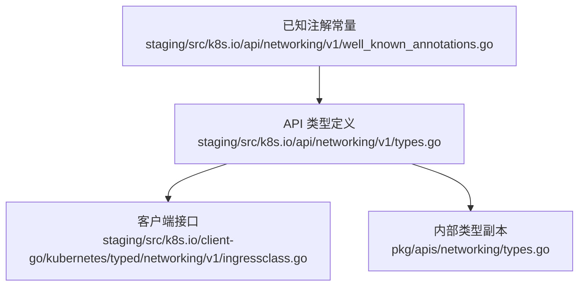
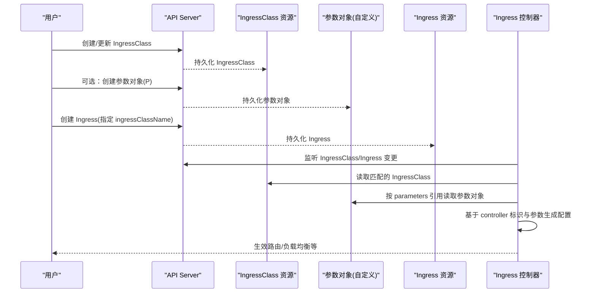
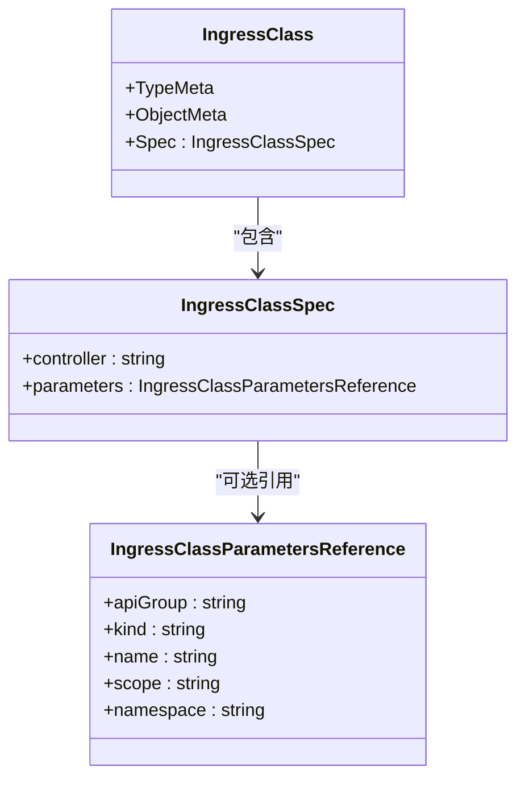
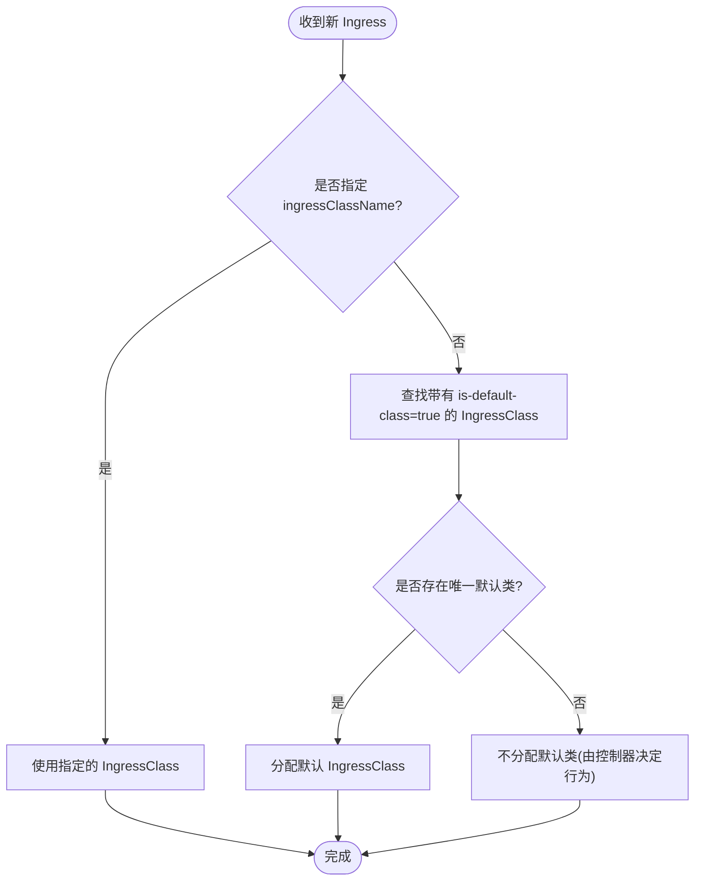
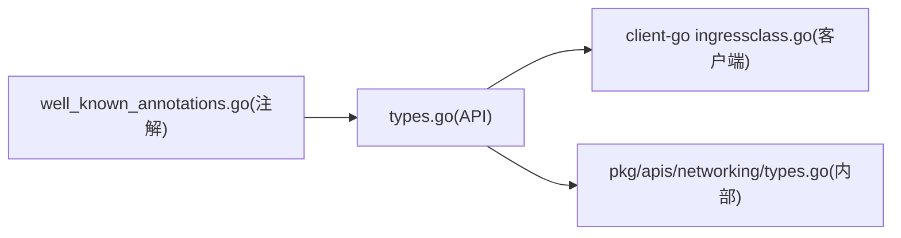

# IngressClass API

<cite>
**本文引用的文件**   
- [staging/src/k8s.io/api/networking/v1/types.go](file://staging/src/k8s.io/api/networking/v1/types.go)
- [staging/src/k8s.io/api/networking/v1/well_known_annotations.go](file://staging/src/k8s.io/api/networking/v1/well_known_annotations.go)
- [pkg/apis/networking/types.go](file://pkg/apis/networking/types.go)
- [staging/src/k8s.io/client-go/kubernetes/typed/networking/v1/ingressclass.go](file://staging/src/k8s.io/client-go/kubernetes/typed/networking/v1/ingressclass.go)
</cite>

## 目录
1. [简介](#简介)
2. [项目结构](#项目结构)
3. [核心组件](#核心组件)
4. [架构总览](#架构总览)
5. [详细组件分析](#详细组件分析)
6. [依赖关系分析](#依赖关系分析)
7. [性能考虑](#性能考虑)
8. [故障排查指南](#故障排查指南)
9. [结论](#结论)
10. [附录](#附录)

## 简介
本文件为 Kubernetes IngressClass 资源的 REST API 参考与实现说明，覆盖以下要点：
- IngressClass 对象的完整 API 规范（字段、版本、注解）
- controller 参数语义与约束
- parameters 引用机制（跨组资源、作用域、命名空间）
- 默认类选择逻辑与 is-default-class 注解
- IngressClass 与 Ingress 的关联方式与选择策略
- 多控制器环境下的路由分发策略与配置示例思路
- 自定义 IngressController 开发指南与扩展点

## 项目结构
IngressClass 的核心类型定义位于 networking v1 API 包中，同时提供客户端接口与已知注解常量。内部 pkg/apis 下存在同构类型用于内部处理。

图表来源
- [staging/src/k8s.io/api/networking/v1/types.go:560-651](file://staging/src/k8s.io/api/networking/v1/types.go#L560-L651)
- [staging/src/k8s.io/client-go/kubernetes/typed/networking/v1/ingressclass.go:33-71](file://staging/src/k8s.io/client-go/kubernetes/typed/networking/v1/ingressclass.go#L33-L71)
- [pkg/apis/networking/types.go:290-372](file://pkg/apis/networking/types.go#L290-L372)
- [staging/src/k8s.io/api/networking/v1/well_known_annotations.go:19-25](file://staging/src/k8s.io/api/networking/v1/well_known_annotations.go#L19-L25)

章节来源
- [staging/src/k8s.io/api/networking/v1/types.go:560-651](file://staging/src/k8s.io/api/networking/v1/types.go#L560-L651)
- [staging/src/k8s.io/client-go/kubernetes/typed/networking/v1/ingressclass.go:33-71](file://staging/src/k8s.io/client-go/kubernetes/typed/networking/v1/ingressclass.go#L33-L71)
- [pkg/apis/networking/types.go:290-372](file://pkg/apis/networking/types.go#L290-L372)
- [staging/src/k8s.io/api/networking/v1/well_known_annotations.go:19-25](file://staging/src/k8s.io/api/networking/v1/well_known_annotations.go#L19-L25)

## 核心组件
- IngressClass：表示一个 Ingress 类的声明，被 Ingress 资源通过 spec.ingressClassName 引用。支持通过注解标记为默认类。
- IngressClassSpec：包含 controller 名称与可选的 parameters 引用。
- IngressClassParametersReference：指向任意 API 对象（可为集群级或命名空间级），用于传递控制器特定配置。
- IngressClassList：集合类型。
- 已知注解：is-default-class 用于将某个 IngressClass 设为默认类。

章节来源
- [staging/src/k8s.io/api/networking/v1/types.go:560-651](file://staging/src/k8s.io/api/networking/v1/types.go#L560-L651)
- [staging/src/k8s.io/api/networking/v1/well_known_annotations.go:19-25](file://staging/src/k8s.io/api/networking/v1/well_known_annotations.go#L19-L25)

## 架构总览
下图展示 IngressClass 在控制平面中的角色：用户创建 IngressClass 并可选地引用外部参数对象；Ingress 通过 ingressClassName 选择具体类；控制器根据自身的标识匹配对应 IngressClass 并读取其参数进行工作负载编排。

图表来源
- [staging/src/k8s.io/api/networking/v1/types.go:560-651](file://staging/src/k8s.io/api/networking/v1/types.go#L560-L651)
- [staging/src/k8s.io/client-go/kubernetes/typed/networking/v1/ingressclass.go:33-71](file://staging/src/k8s.io/client-go/kubernetes/typed/networking/v1/ingressclass.go#L33-L71)

## 详细组件分析

### IngressClass 对象模型
- 元数据：标准 ObjectMeta
- Spec：
  - controller：字符串，域名前缀路径形式，长度不超过 250 字符，不可变。用于标识“哪个控制器”应处理该类。
  - parameters：可选，指向自定义资源以传递控制器特定配置。
- 列表：IngressClassList

图表来源
- [staging/src/k8s.io/api/networking/v1/types.go:560-651](file://staging/src/k8s.io/api/networking/v1/types.go#L560-L651)

章节来源
- [staging/src/k8s.io/api/networking/v1/types.go:560-651](file://staging/src/k8s.io/api/networking/v1/types.go#L560-L651)

### 字段与校验规则
- controller
  - 必填与否取决于控制器实现；通常建议显式设置。
  - 格式：域名前缀路径，最大 250 字符，不可变。
- parameters
  - 可选，若控制器不需要额外配置可省略。
  - 支持集群级或命名空间级参数对象。
  - scope 取值：Cluster（默认）或 Namespace。
  - 当 scope=Namespace 时，必须设置 namespace；当 scope=Cluster 时，不得设置 namespace。
  - apiGroup 未指定时，kind 必须在 core API 组；否则需指定 apiGroup。
- 注解
  - ingressclass.kubernetes.io/is-default-class：当且仅当只有一个 IngressClass 将该注解设为 true 时，未指定 ingressClassName 的新 Ingress 将被自动分配该默认类。

章节来源
- [staging/src/k8s.io/api/networking/v1/types.go:580-636](file://staging/src/k8s.io/api/networking/v1/types.go#L580-L636)
- [staging/src/k8s.io/api/networking/v1/well_known_annotations.go:19-25](file://staging/src/k8s.io/api/networking/v1/well_known_annotations.go#L19-L25)

### 默认类选择流程

图表来源
- [staging/src/k8s.io/api/networking/v1/types.go:560-578](file://staging/src/k8s.io/api/networking/v1/types.go#L560-L578)
- [staging/src/k8s.io/api/networking/v1/well_known_annotations.go:19-25](file://staging/src/k8s.io/api/networking/v1/well_known_annotations.go#L19-L25)

### 参数引用与作用域
- 作用域
  - Cluster：参数对象为集群级，无需 namespace。
  - Namespace：参数对象为命名空间级，必须指定 namespace。
- 解析顺序
  - 控制器根据 IngressClass.spec.parameters 解析目标对象。
  - 若参数对象不存在或权限不足，控制器应记录错误并跳过或降级处理。
- 继承关系
  - 参数对象本身可包含层级配置（由控制器自定义），但 IngressClass 与参数对象之间无内置继承机制；控制器可按自身策略合并默认值与用户配置。

章节来源
- [staging/src/k8s.io/api/networking/v1/types.go:598-636](file://staging/src/k8s.io/api/networking/v1/types.go#L598-L636)

### 与 Ingress 的关联与选择逻辑
- Ingress 通过 spec.ingressClassName 选择 IngressClass。
- 若未指定且存在唯一默认 IngressClass，则自动分配。
- 控制器只处理与其 controller 标识匹配的 IngressClass 对应的 Ingress。

章节来源
- [staging/src/k8s.io/api/networking/v1/types.go:560-578](file://staging/src/k8s.io/api/networking/v1/types.go#L560-L578)

### 客户端 API 能力
- 标准 CRUD：Create/Get/List/Update/Patch/Delete
- Watch：监听 IngressClass 事件
- Apply：基于 ApplyConfiguration 的幂等应用
- 资源名：ingressclasses（非命名空间级）

章节来源
- [staging/src/k8s.io/client-go/kubernetes/typed/networking/v1/ingressclass.go:33-71](file://staging/src/k8s.io/client-go/kubernetes/typed/networking/v1/ingressclass.go#L33-L71)

### 多控制器路由分发策略（实践建议）
- 为不同控制器创建独立 IngressClass，并在 spec.controller 中写入各自标识。
- 对需要差异化行为的同一控制器，可通过多个 IngressClass 配合不同的 parameters 实现“风味”区分。
- 利用 is-default-class 为通用场景提供兜底类，避免每个 Ingress 都显式指定类。

[本节为概念性指导，不直接分析具体代码文件]

### 自定义 IngressController 开发与扩展点
- 控制器标识
  - 启动时注册自己的 controller 标识（与 IngressClass.spec.controller 一致）。
  - 仅监听并处理匹配的 IngressClass 及其关联 Ingress。
- 参数对象
  - 定义并注册自定义 CRD 作为参数对象。
  - 在 IngressClass.spec.parameters 中引用该 CRD，支持集群级或命名空间级。
  - 在控制器内安全地拉取并解析参数对象，结合默认配置形成最终运行态。
- 默认类
  - 支持读取 is-default-class 注解，以便在未指定 ingressClassName 时提供合理默认行为。
- 生命周期与状态
  - 监听 IngressClass/Ingress/参数对象变化，增量更新底层网关/负载均衡配置。
  - 暴露必要的指标与事件，便于观测与排障。

[本节为概念性指导，不直接分析具体代码文件]

## 依赖关系分析
- API 层
  - staging/src/k8s.io/api/networking/v1/types.go：对外公开的类型定义
  - pkg/apis/networking/types.go：内部使用的同构类型
- 客户端层
  - staging/src/k8s.io/client-go/kubernetes/typed/networking/v1/ingressclass.go：生成的客户端接口
- 注解常量
  - staging/src/k8s.io/api/networking/v1/well_known_annotations.go：is-default-class 注解键

图表来源
- [staging/src/k8s.io/api/networking/v1/types.go:560-651](file://staging/src/k8s.io/api/networking/v1/types.go#L560-L651)
- [pkg/apis/networking/types.go:290-372](file://pkg/apis/networking/types.go#L290-L372)
- [staging/src/k8s.io/client-go/kubernetes/typed/networking/v1/ingressclass.go:33-71](file://staging/src/k8s.io/client-go/kubernetes/typed/networking/v1/ingressclass.go#L33-L71)
- [staging/src/k8s.io/api/networking/v1/well_known_annotations.go:19-25](file://staging/src/k8s.io/api/networking/v1/well_known_annotations.go#L19-L25)

章节来源
- [staging/src/k8s.io/api/networking/v1/types.go:560-651](file://staging/src/k8s.io/api/networking/v1/types.go#L560-L651)
- [pkg/apis/networking/types.go:290-372](file://pkg/apis/networking/types.go#L290-L372)
- [staging/src/k8s.io/client-go/kubernetes/typed/networking/v1/ingressclass.go:33-71](file://staging/src/k8s.io/client-go/kubernetes/typed/networking/v1/ingressclass.go#L33-L71)
- [staging/src/k8s.io/api/networking/v1/well_known_annotations.go:19-25](file://staging/src/k8s.io/api/networking/v1/well_known_annotations.go#L19-L25)

## 性能考虑
- IngressClass 为非命名空间级资源，数量通常较少，读写开销低。
- 参数对象可能频繁变更，建议在控制器侧缓存并按需刷新，避免每次请求都远程拉取。
- 默认类选择仅在 Ingress 创建/更新时发生一次，影响面小。

[本节为一般性指导，不直接分析具体代码文件]

## 故障排查指南
- 无法匹配到控制器
  - 检查 IngressClass.spec.controller 是否与控制器标识一致。
- 参数对象解析失败
  - 确认 parameters.kind/apiGroup/name/scope/namespace 正确。
  - 检查 RBAC 权限是否允许控制器读取参数对象。
- 默认类未生效
  - 确认仅有一个 IngressClass 设置了 is-default-class=true。
  - 确认 Ingress 确实未指定 ingressClassName。

章节来源
- [staging/src/k8s.io/api/networking/v1/types.go:580-636](file://staging/src/k8s.io/api/networking/v1/types.go#L580-L636)
- [staging/src/k8s.io/api/networking/v1/well_known_annotations.go:19-25](file://staging/src/k8s.io/api/networking/v1/well_known_annotations.go#L19-L25)

## 结论
IngressClass 提供了清晰的“控制器-类-参数”解耦模型，使多控制器共存与差异化配置成为可能。通过 controller 标识、可选的 parameters 引用以及 is-default-class 注解，可以在保证灵活性的同时维持简洁的使用体验。自定义控制器开发者应遵循上述约定，确保与生态工具链良好协作。

[本节为总结性内容，不直接分析具体代码文件]

## 附录

### API 清单（v1）
- 资源名：ingressclasses（非命名空间级）
- 主要方法：Create/Get/List/Update/Patch/Delete/Watch/Apply
- 关键类型：IngressClass、IngressClassSpec、IngressClassParametersReference、IngressClassList

章节来源
- [staging/src/k8s.io/client-go/kubernetes/typed/networking/v1/ingressclass.go:33-71](file://staging/src/k8s.io/client-go/kubernetes/typed/networking/v1/ingressclass.go#L33-L71)
- [staging/src/k8s.io/api/networking/v1/types.go:560-651](file://staging/src/k8s.io/api/networking/v1/types.go#L560-L651)