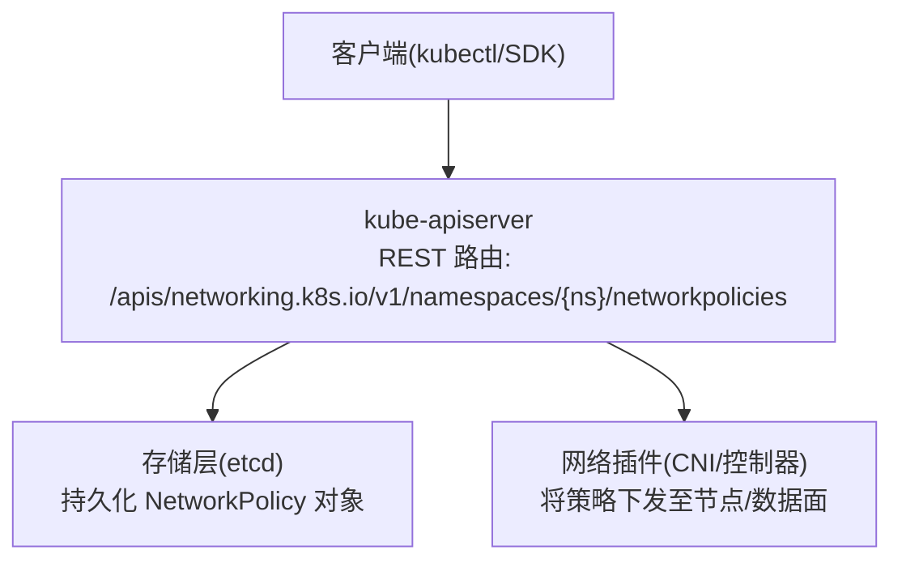
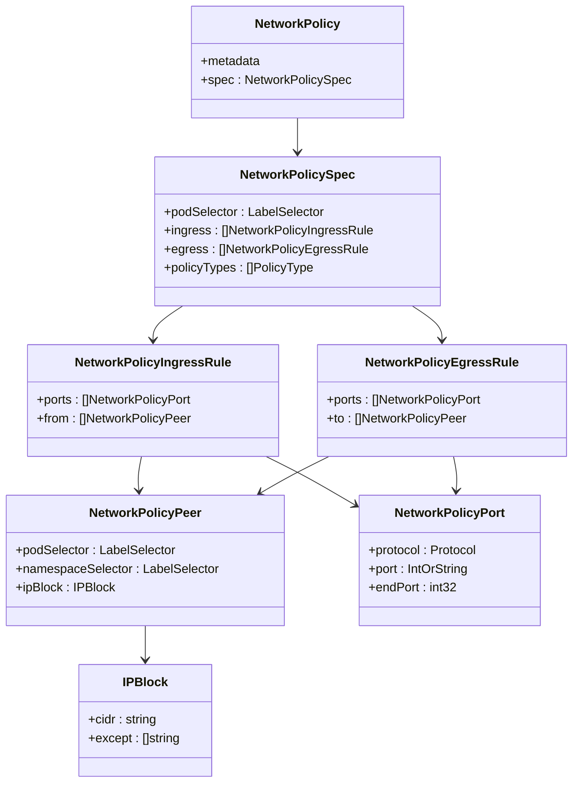
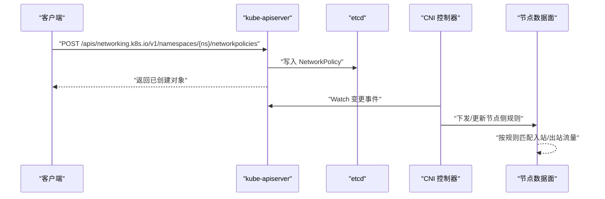
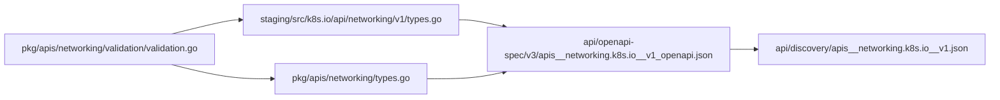

# NetworkPolicy API

<cite>
**本文引用的文件**   
- [staging/src/k8s.io/api/networking/v1/types.go](file://staging/src/k8s.io/api/networking/v1/types.go)
- [pkg/apis/networking/types.go](file://pkg/apis/networking/types.go)
- [api/discovery/apis__networking.k8s.io__v1.json](file://api/discovery/apis__networking.k8s.io__v1.json)
- [api/openapi-spec/v3/apis__networking.k8s.io__v1_openapi.json](file://api/openapi-spec/v3/apis__networking.k8s.io__v1_openapi.json)
- [pkg/apis/networking/validation/validation.go](file://pkg/apis/networking/validation/validation.go)
- [cluster/addons/dns/nodelocaldns/README.md](file://cluster/addons/dns/nodelocaldns/README.md)
</cite>

## 目录
1. [简介](#简介)
2. [项目结构](#项目结构)
3. [核心组件](#核心组件)
4. [架构总览](#架构总览)
5. [详细组件分析](#详细组件分析)
6. [依赖关系分析](#依赖关系分析)
7. [性能与可扩展性](#性能与可扩展性)
8. [故障排查指南](#故障排查指南)
9. [结论](#结论)
10. [附录：API 参考与示例](#附录api-参考与示例)

## 简介
本文件为 Kubernetes NetworkPolicy 资源的 REST API 参考文档，聚焦 networking.k8s.io/v1 版本。内容涵盖：
- 资源模型与字段语义（podSelector、namespaceSelector、IPBlock、端口范围等）
- 入站/出站规则定义与匹配逻辑
- 策略优先级与执行顺序
- 默认拒绝策略的配置方法
- 典型场景示例（微服务隔离、数据库访问控制、外部服务访问限制）
- CNI 插件兼容性说明与安全最佳实践

## 项目结构
NetworkPolicy 的 API 定义位于 networking.k8s.io/v1 分组，REST 资源名为 networkpolicies（短名 netpol），命名空间级资源。OpenAPI 与 Discovery 元数据中均暴露该资源及标准动词（create、get、list、watch、update、patch、delete）。

**图表来源** 
- [api/discovery/apis__networking.k8s.io__v1.json:75-93](file://api/discovery/apis__networking.k8s.io__v1.json#L75-L93)
- [api/openapi-spec/v3/apis__networking.k8s.io__v1_openapi.json:597-635](file://api/openapi-spec/v3/apis__networking.k8s.io__v1_openapi.json#L597-L635)

**章节来源**
- [api/discovery/apis__networking.k8s.io__v1.json:75-93](file://api/discovery/apis__networking.k8s.io__v1.json#L75-L93)
- [api/openapi-spec/v3/apis__networking.k8s.io__v1_openapi.json:597-635](file://api/openapi-spec/v3/apis__networking.k8s.io__v1_openapi.json#L597-L635)

## 核心组件
- NetworkPolicy：描述一组 Pod 的网络访问控制策略
- NetworkPolicySpec：策略主体，包含 podSelector、ingress、egress、policyTypes
- NetworkPolicyIngressRule/NetworkPolicyEgressRule：入站/出站规则，分别由 from/to 与 ports 组成
- NetworkPolicyPeer：对端选择器，支持 podSelector + namespaceSelector 或 ipBlock
- IPBlock：CIDR 白名单/黑名单（except）
- NetworkPolicyPort：协议、端口或端口范围（port/endPort）

**图表来源** 
- [staging/src/k8s.io/api/networking/v1/types.go:29-239](file://staging/src/k8s.io/api/networking/v1/types.go#L29-L239)
- [pkg/apis/networking/types.go:27-209](file://pkg/apis/networking/types.go#L27-L209)

**章节来源**
- [staging/src/k8s.io/api/networking/v1/types.go:29-239](file://staging/src/k8s.io/api/networking/v1/types.go#L29-L239)
- [pkg/apis/networking/types.go:27-209](file://pkg/apis/networking/types.go#L27-L209)

## 架构总览
NetworkPolicy 的生命周期与交互流程如下：
- 客户端通过 REST 创建/更新策略
- apiserver 校验并持久化到 etcd
- CNI 控制器监听策略变更，将其转换为节点侧防火墙规则
- 流量在节点数据面按规则进行允许/拒绝判定

**图表来源** 
- [api/discovery/apis__networking.k8s.io__v1.json:75-93](file://api/discovery/apis__networking.k8s.io__v1.json#L75-L93)
- [api/openapi-spec/v3/apis__networking.k8s.io__v1_openapi.json:597-635](file://api/openapi-spec/v3/apis__networking.k8s.io__v1_openapi.json#L597-L635)

## 详细组件分析

### 选择器与目标集
- podSelector：选择策略作用的目标 Pod；空选择器表示命名空间内所有 Pod
- namespaceSelector：用于 NetworkPolicyPeer 中对端命名空间的选择
- podSelector + namespaceSelector 组合：当两者同时存在时，选择“被 namespaceSelector 选中的命名空间中，且满足 podSelector 的 Pod”

注意：仅设置 namespaceSelector 而不设置 podSelector 时，表示“被 namespaceSelector 选中的所有命名空间内的全部 Pod”。

**章节来源**
- [staging/src/k8s.io/api/networking/v1/types.go:61-108](file://staging/src/k8s.io/api/networking/v1/types.go#L61-L108)
- [staging/src/k8s.io/api/networking/v1/types.go:197-223](file://staging/src/k8s.io/api/networking/v1/types.go#L197-L223)

### 入站规则（Ingress）
- from：源端列表，逻辑 OR；为空则匹配所有源
- ports：端口列表，逻辑 OR；为空则匹配所有端口
- 匹配条件：必须同时满足 from 与 ports（若二者均非空）

**章节来源**
- [staging/src/k8s.io/api/networking/v1/types.go:110-131](file://staging/src/k8s.io/api/networking/v1/types.go#L110-L131)

### 出站规则（Egress）
- to：目的端列表，逻辑 OR；为空则匹配所有目的
- ports：端口列表，逻辑 OR；为空则匹配所有端口
- 匹配条件：必须同时满足 to 与 ports（若二者均非空）

**章节来源**
- [staging/src/k8s.io/api/networking/v1/types.go:133-155](file://staging/src/k8s.io/api/networking/v1/types.go#L133-L155)

### 端口与协议
- protocol：TCP、UDP、SCTP；未指定时默认为 TCP
- port：数值或名称端口；未指定时匹配所有端口
- endPort：端口范围上限，需与 port 配合使用，且 endPort ≥ port；仅在 provider 支持时生效

**章节来源**
- [staging/src/k8s.io/api/networking/v1/types.go:157-177](file://staging/src/k8s.io/api/networking/v1/types.go#L157-L177)

### IP 白名单/黑名单（IPBlock）
- cidr：允许的 CIDR 范围
- except：从 cidr 中排除的子网集合（黑名单）
- 约束：ipBlock 与 podSelector/namespaceSelector 互斥

**章节来源**
- [staging/src/k8s.io/api/networking/v1/types.go:179-195](file://staging/src/k8s.io/api/networking/v1/types.go#L179-L195)
- [staging/src/k8s.io/api/networking/v1/types.go:197-223](file://staging/src/k8s.io/api/networking/v1/types.go#L197-L223)

### 策略类型与默认行为
- policyTypes：["Ingress"]、["Egress"] 或 ["Ingress","Egress"]
- 未显式指定 policyTypes 时的默认：
  - 包含 egress 段 → 影响 Egress
  - 包含 ingress 段或未包含任何段 → 影响 Ingress
- 默认拒绝策略：
  - 若某 Pod 被至少一个 NetworkPolicy 选中，且该策略的 ingress 或 egress 为空，则该方向默认拒绝

**章节来源**
- [staging/src/k8s.io/api/networking/v1/types.go:95-108](file://staging/src/k8s.io/api/networking/v1/types.go#L95-L108)
- [staging/src/k8s.io/api/networking/v1/types.go:71-93](file://staging/src/k8s.io/api/networking/v1/types.go#L71-L93)

### 验证与约束
- 端口范围合法性检查（endPort ≥ port）
- Peer 字段互斥与组合约束（ipBlock 与 selector 互斥）
- 名称与字段校验

**章节来源**
- [pkg/apis/networking/validation/validation.go:70-106](file://pkg/apis/networking/validation/validation.go#L70-L106)
- [pkg/apis/networking/validation/validation.go:106-136](file://pkg/apis/networking/validation/validation.go#L106-L136)
- [pkg/apis/networking/validation/validation.go:136-187](file://pkg/apis/networking/validation/validation.go#L136-L187)

## 依赖关系分析
- API 定义：staging/src/k8s.io/api/networking/v1/types.go 与 pkg/apis/networking/types.go 提供 v1 内部/对外类型
- OpenAPI/Discovery：api/openapi-spec/v3/apis__networking.k8s.io__v1_openapi.json 与 api/discovery/apis__networking.k8s.io__v1.json 暴露资源与字段
- 校验逻辑：pkg/apis/networking/validation/validation.go 实现字段级校验

**图表来源** 
- [staging/src/k8s.io/api/networking/v1/types.go:29-239](file://staging/src/k8s.io/api/networking/v1/types.go#L29-L239)
- [pkg/apis/networking/types.go:27-209](file://pkg/apis/networking/types.go#L27-L209)
- [api/openapi-spec/v3/apis__networking.k8s.io__v1_openapi.json:597-635](file://api/openapi-spec/v3/apis__networking.k8s.io__v1_openapi.json#L597-L635)
- [api/discovery/apis__networking.k8s.io__v1.json:75-93](file://api/discovery/apis__networking.k8s.io__v1.json#L75-L93)
- [pkg/apis/networking/validation/validation.go:70-187](file://pkg/apis/networking/validation/validation.go#L70-L187)

**章节来源**
- [staging/src/k8s.io/api/networking/v1/types.go:29-239](file://staging/src/k8s.io/api/networking/v1/types.go#L29-L239)
- [pkg/apis/networking/types.go:27-209](file://pkg/apis/networking/types.go#L27-L209)
- [api/openapi-spec/v3/apis__networking.k8s.io__v1_openapi.json:597-635](file://api/openapi-spec/v3/apis__networking.k8s.io__v1_openapi.json#L597-L635)
- [api/discovery/apis__networking.k8s.io__v1.json:75-93](file://api/discovery/apis__networking.k8s.io__v1.json#L75-L93)
- [pkg/apis/networking/validation/validation.go:70-187](file://pkg/apis/networking/validation/validation.go#L70-L187)

## 性能与可扩展性
- 规则合并：同一组 Pod 被多个策略选中时，同方向规则以“并集”方式叠加（即任一规则允许即允许）
- 端口范围：endPort 可显著减少规则数量，但需 CNI 支持；不支持时仅按单端口生效
- 选择器复杂度：跨命名空间选择（namespaceSelector）会增加计算开销，建议结合标签粒度控制

[本节为通用指导，不直接分析具体文件]

## 故障排查指南
- DNS 连通性问题（nodelocaldns）：当集群启用 NetworkPolicy 时，可能需要额外规则以允许 nodelocaldns 与 clusterDNS 通信。由于 nodelocaldns 使用 hostNetwork，建议使用 ipBlock 放行特定 ClusterIP 的 53/TCP 与 53/UDP。
- 常见错误：
  - 端口范围非法（endPort < port）
  - ipBlock 与 selector 同时出现导致校验失败
  - 未正确声明 policyTypes 导致默认方向不符合预期

**章节来源**
- [cluster/addons/dns/nodelocaldns/README.md:28-52](file://cluster/addons/dns/nodelocaldns/README.md#L28-L52)
- [pkg/apis/networking/validation/validation.go:70-106](file://pkg/apis/networking/validation/validation.go#L70-L106)
- [pkg/apis/networking/validation/validation.go:106-136](file://pkg/apis/networking/validation/validation.go#L106-L136)

## 结论
NetworkPolicy 提供了细粒度的集群内网络访问控制能力。通过合理组合 podSelector、namespaceSelector、IPBlock 与端口范围，可实现微服务隔离、数据库访问控制与外部访问限制等安全目标。为确保兼容性与稳定性，应关注 CNI 对 endPort 的支持情况，并在需要严格隔离的场景下采用“默认拒绝 + 最小权限放行”的策略设计。

[本节为总结性内容，不直接分析具体文件]

## 附录：API 参考与示例

### REST 资源与动词
- 资源：networkpolicies（短名 netpol），命名空间级
- 动词：create、get、list、watch、update、patch、delete

**章节来源**
- [api/discovery/apis__networking.k8s.io__v1.json:75-93](file://api/discovery/apis__networking.k8s.io__v1.json#L75-L93)

### 关键字段速查
- spec.podSelector：LabelSelector
- spec.policyTypes：["Ingress"] | ["Egress"] | ["Ingress","Egress"]
- spec.ingress[].from：[]NetworkPolicyPeer
- spec.egress[].to：[]NetworkPolicyPeer
- NetworkPolicyPeer：podSelector + namespaceSelector 或 ipBlock（互斥）
- IPBlock：cidr + except
- NetworkPolicyPort：protocol + port + endPort

**章节来源**
- [staging/src/k8s.io/api/networking/v1/types.go:61-108](file://staging/src/k8s.io/api/networking/v1/types.go#L61-L108)
- [staging/src/k8s.io/api/networking/v1/types.go:110-177](file://staging/src/k8s.io/api/networking/v1/types.go#L110-L177)
- [staging/src/k8s.io/api/networking/v1/types.go:179-223](file://staging/src/k8s.io/api/networking/v1/types.go#L179-L223)

### 策略优先级与执行顺序
- 同一方向（Ingress/Egress）的多条规则之间为“并集”关系：任一规则允许即允许
- 不同策略作用于同一组 Pod 时，同方向规则同样合并
- 未声明 policyTypes 时，根据是否包含对应段推断影响方向

**章节来源**
- [staging/src/k8s.io/api/networking/v1/types.go:95-108](file://staging/src/k8s.io/api/networking/v1/types.go#L95-L108)
- [staging/src/k8s.io/api/networking/v1/types.go:71-93](file://staging/src/k8s.io/api/networking/v1/types.go#L71-L93)

### 默认拒绝策略配置方法
- 为目标 Pod 创建仅含 podSelector 的空策略（不写 ingress/egress 或写空数组），并将 policyTypes 明确设置为所需方向，即可实现该方向默认拒绝

**章节来源**
- [staging/src/k8s.io/api/networking/v1/types.go:71-93](file://staging/src/k8s.io/api/networking/v1/types.go#L71-L93)
- [staging/src/k8s.io/api/networking/v1/types.go:95-108](file://staging/src/k8s.io/api/networking/v1/types.go#L95-L108)

### 典型场景示例（概念性）
- 微服务间通信隔离：为每个服务命名空间创建默认拒绝策略，再按需放行服务间访问
- 数据库访问控制：仅允许应用命名空间的特定 Pod 访问数据库服务的端口
- 外部服务访问限制：出站规则仅放行必要的外部域名对应的 IP 段（结合 DNS 解析结果与 ipBlock）

[本节为概念性示例，不直接分析具体文件]

### CNI 插件兼容性说明
- endPort 字段需在 CNI 提供商处得到支持；否则策略仅按单端口生效
- 对于 hostNetwork 的组件（如 nodelocaldns），需考虑使用 ipBlock 放行必要的 ClusterIP

**章节来源**
- [staging/src/k8s.io/api/networking/v1/types.go:171-177](file://staging/src/k8s.io/api/networking/v1/types.go#L171-L177)
- [cluster/addons/dns/nodelocaldns/README.md:28-52](file://cluster/addons/dns/nodelocaldns/README.md#L28-L52)

### 安全最佳实践
- 采用“默认拒绝 + 最小权限放行”的设计
- 优先使用精确的 podSelector 与 namespaceSelector，避免过宽泛的选择器
- 合理使用端口范围（endPort）以减少规则数量
- 谨慎使用 ipBlock，必要时用 except 做精细化排除
- 定期审计策略覆盖范围与冲突，确保符合业务需求

[本节为通用指导，不直接分析具体文件]