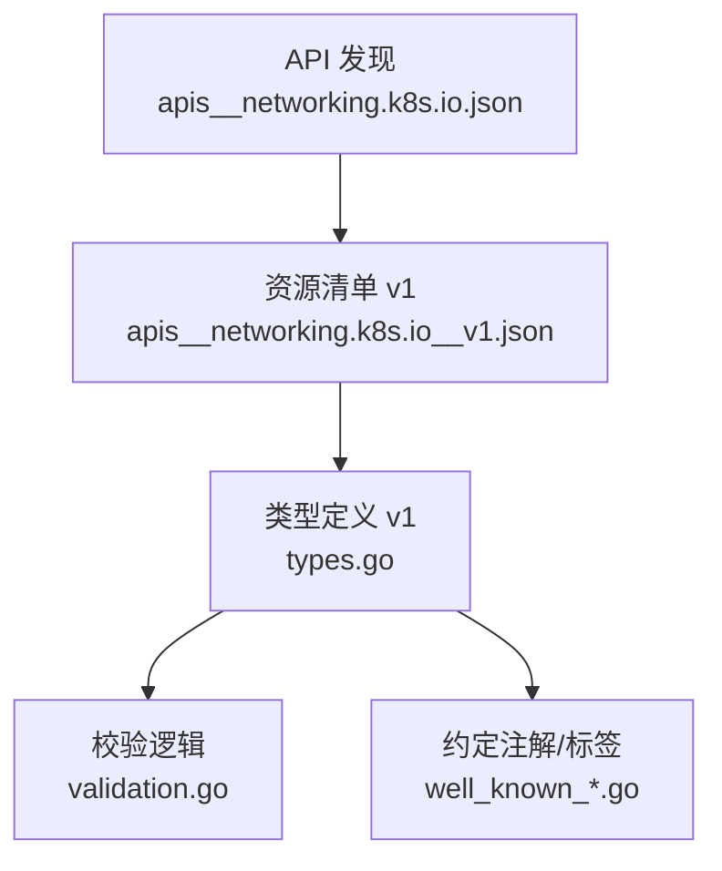
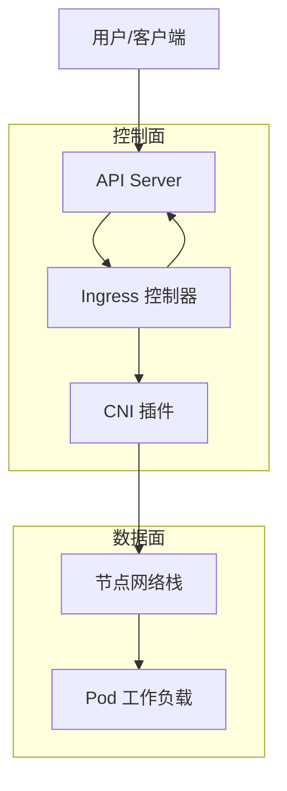
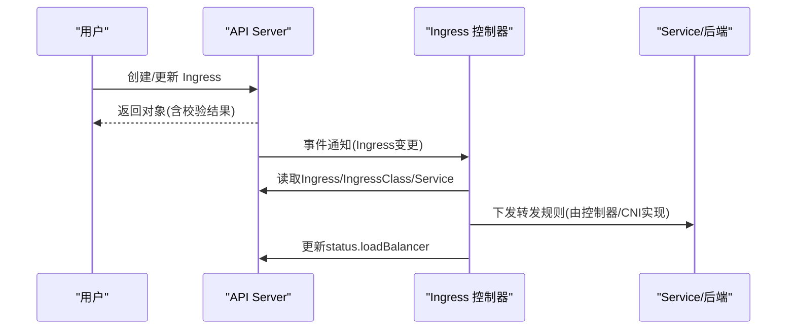
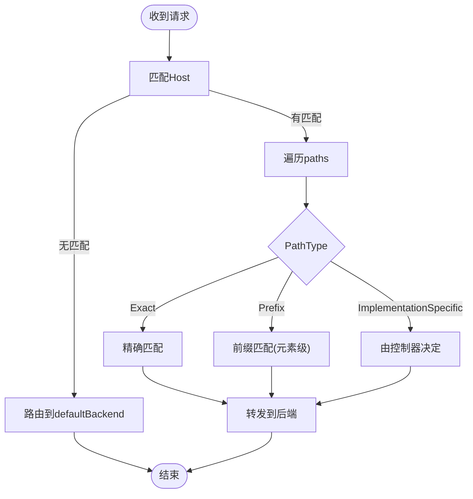
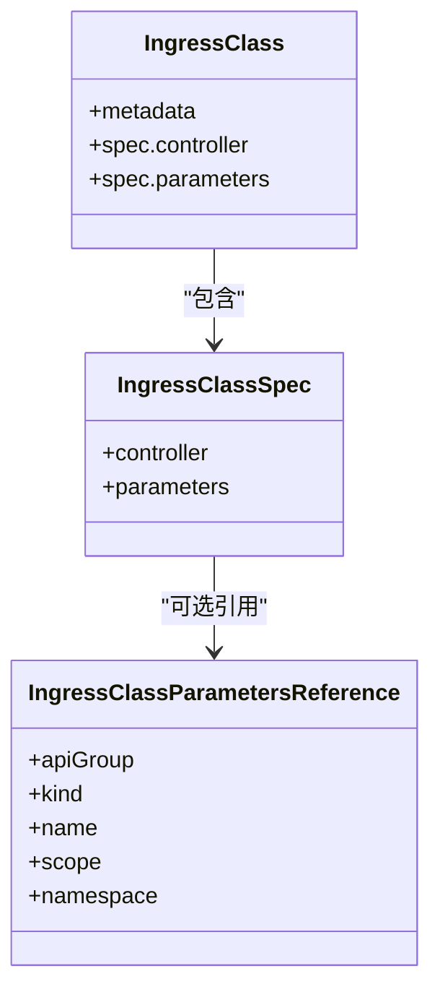
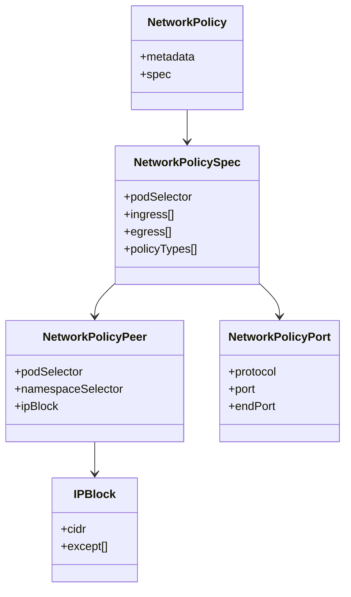
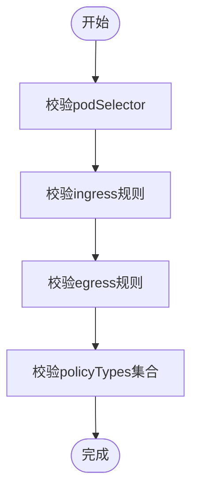
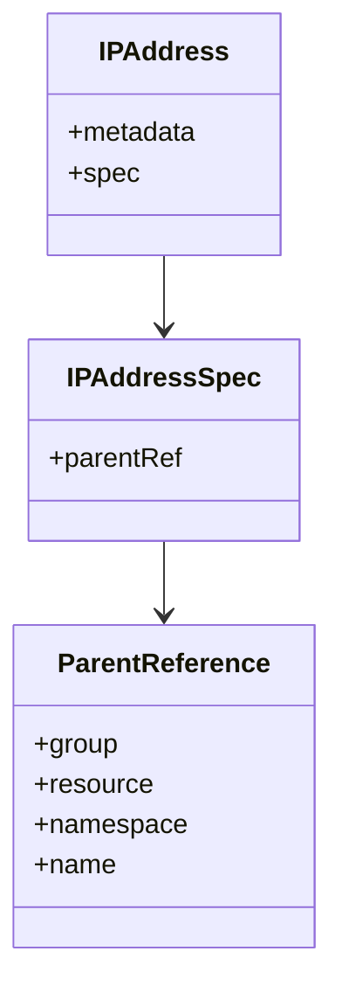
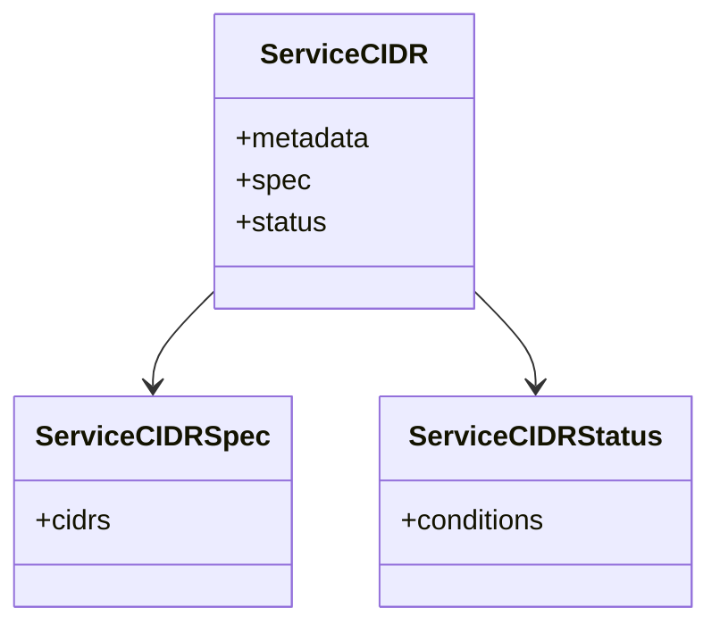
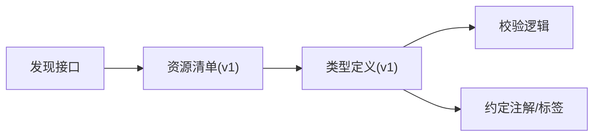

# Networking API

<cite>
**本文引用的文件**
- [api/discovery/apis__networking.k8s.io.json](file://api/discovery/apis__networking.k8s.io.json)
- [api/discovery/apis__networking.k8s.io__v1.json](file://api/discovery/apis__networking.k8s.io__v1.json)
- [staging/src/k8s.io/api/networking/v1/types.go](file://staging/src/k8s.io/api/networking/v1/types.go)
- [pkg/apis/networking/validation/validation.go](file://pkg/apis/networking/validation/validation.go)
- [staging/src/k8s.io/api/networking/v1/well_known_annotations.go](file://staging/src/k8s.io/api/networking/v1/well_known_annotations.go)
- [staging/src/k8s.io/api/networking/v1/well_known_labels.go](file://staging/src/k8s.io/api/networking/v1/well_known_labels.go)
</cite>

## 目录
1. [简介](#简介)
2. [项目结构](#项目结构)
3. [核心组件](#核心组件)
4. [架构总览](#架构总览)
5. [详细组件分析](#详细组件分析)
6. [依赖关系分析](#依赖关系分析)
7. [性能考量](#性能考量)
8. [故障排查指南](#故障排查指南)
9. [结论](#结论)
10. [附录](#附录)

## 简介
本参考文档聚焦 Kubernetes networking.k8s.io API 组，系统梳理 Ingress、NetworkPolicy、IngressClass、IPAddress、ServiceCIDR 等资源的 REST API 规范与语义。内容涵盖：
- 资源清单与可用动词（verbs）
- 字段级语义与约束（含路径匹配、端口范围、TLS、后端引用等）
- 流量控制与安全策略配置方法
- 典型网络拓扑与路由示例说明
- 与 CNI/Ingress 控制器的集成要点与性能优化建议
- 网络安全最佳实践与常见问题排查

## 项目结构
Kubernetes 将 networking.k8s.io API 的公开能力通过发现接口暴露，并在 staging 源码中定义 v1 版本的类型与校验逻辑。关键位置如下：
- 发现接口：列出 group、version 与资源清单
- 类型定义：v1 版本的核心数据结构与枚举
- 校验逻辑：创建/更新时的字段校验规则
- 约定常量：默认 IngressClass 注解与 IPAddress 标签

**图表来源**
- [api/discovery/apis__networking.k8s.io.json:1-16](file://api/discovery/apis__networking.k8s.io.json#L1-L16)
- [api/discovery/apis__networking.k8s.io__v1.json:1-124](file://api/discovery/apis__networking.k8s.io__v1.json#L1-L124)
- [staging/src/k8s.io/api/networking/v1/types.go:1-788](file://staging/src/k8s.io/api/networking/v1/types.go#L1-L788)
- [pkg/apis/networking/validation/validation.go:1-903](file://pkg/apis/networking/validation/validation.go#L1-L903)
- [staging/src/k8s.io/api/networking/v1/well_known_annotations.go:1-26](file://staging/src/k8s.io/api/networking/v1/well_known_annotations.go#L1-L26)
- [staging/src/k8s.io/api/networking/v1/well_known_labels.go:1-34](file://staging/src/k8s.io/api/networking/v1/well_known_labels.go#L1-L34)

**章节来源**
- [api/discovery/apis__networking.k8s.io.json:1-16](file://api/discovery/apis__networking.k8s.io.json#L1-L16)
- [api/discovery/apis__networking.k8s.io__v1.json:1-124](file://api/discovery/apis__networking.k8s.io__v1.json#L1-L124)

## 核心组件
本节概述 networking.k8s.io/v1 提供的资源及其基本用途：
- Ingress：HTTP/HTTPS 入站流量路由到 Service 或自定义资源
- IngressClass：声明由哪个控制器实现 Ingress 资源
- NetworkPolicy：基于 Pod/命名空间/IPBlock 的入站/出站访问控制
- IPAddress：单 IP 地址对象，供上层 API（如 Service）绑定使用
- ServiceCIDR：为 Service ClusterIP 分配提供 CIDR 范围

REST 资源与动词（verbs）以发现接口为准，包含 create、list、get、update、patch、delete、watch 以及部分子资源（如 status）。

**章节来源**
- [api/discovery/apis__networking.k8s.io__v1.json:1-124](file://api/discovery/apis__networking.k8s.io__v1.json#L1-L124)

## 架构总览
下图展示用户通过 API Server 管理 networking 资源时，控制器与数据面的交互概览。

[此图为概念性架构图，不直接映射具体源文件]

## 详细组件分析

### Ingress
- 作用：将外部 HTTP/HTTPS 请求按 host/path 路由到后端 Service 或自定义资源；支持 TLS 终止与负载均衡状态上报。
- 关键字段与行为
  - spec.rules[].host：DNS 名称（精确或单级通配），不支持 IP
  - spec.rules[].http.paths[]：pathType 支持 Exact、Prefix、ImplementationSpecific
  - spec.defaultBackend：未命中任何规则的兜底后端
  - spec.tls[]：证书 Secret 与 SNI 主机列表
  - spec.ingressClassName：指向 IngressClass 集群资源
- 状态：status.loadBalancer.ingress 可包含 ip/hostname 与端口状态
- 兼容性与优先级：当同时存在 annotation 与 ingressClassName 时，需保持一致，否则校验失败

**图表来源**
- [staging/src/k8s.io/api/networking/v1/types.go:245-554](file://staging/src/k8s.io/api/networking/v1/types.go#L245-L554)
- [pkg/apis/networking/validation/validation.go:293-553](file://pkg/apis/networking/validation/validation.go#L293-L553)

**章节来源**
- [staging/src/k8s.io/api/networking/v1/types.go:245-554](file://staging/src/k8s.io/api/networking/v1/types.go#L245-L554)
- [pkg/apis/networking/validation/validation.go:293-553](file://pkg/apis/networking/validation/validation.go#L293-L553)

#### Ingress 路径匹配流程

**图表来源**
- [staging/src/k8s.io/api/networking/v1/types.go:454-514](file://staging/src/k8s.io/api/networking/v1/types.go#L454-L514)
- [pkg/apis/networking/validation/validation.go:468-504](file://pkg/apis/networking/validation/validation.go#L468-L504)

### IngressClass
- 作用：声明由哪个控制器实现 Ingress；支持默认类注解与参数引用
- 关键字段
  - spec.controller：域前缀路径，不可变
  - spec.parameters：可选，指向集群或命名空间范围的自定义资源
- 默认类：通过注解标记单个 IngressClass 为默认类

**图表来源**
- [staging/src/k8s.io/api/networking/v1/types.go:566-636](file://staging/src/k8s.io/api/networking/v1/types.go#L566-L636)
- [staging/src/k8s.io/api/networking/v1/well_known_annotations.go:19-25](file://staging/src/k8s.io/api/networking/v1/well_known_annotations.go#L19-L25)

**章节来源**
- [staging/src/k8s.io/api/networking/v1/types.go:566-636](file://staging/src/k8s.io/api/networking/v1/types.go#L566-L636)
- [staging/src/k8s.io/api/networking/v1/well_known_annotations.go:19-25](file://staging/src/k8s.io/api/networking/v1/well_known_annotations.go#L19-L25)
- [pkg/apis/networking/validation/validation.go:559-684](file://pkg/apis/networking/validation/validation.go#L559-L684)

### NetworkPolicy
- 作用：对选定 Pod 的入站/出站流量进行白名单式访问控制
- 关键字段
  - spec.podSelector：选择目标 Pod
  - spec.policyTypes：["Ingress"]、["Egress"] 或两者
  - spec.egress[].to / spec.ingress[].from：允许的来源/目的地
  - peer 组合：podSelector + namespaceSelector 或 ipBlock（互斥）
  - port：协议(TCP/UDP/SCTP)、端口号或名称、可选 endPort 范围
- 语义要点
  - 若未选择任何 policyTypes，则根据是否存在 egress/ingress 推断
  - 多个策略对同一 Pod 生效时，ingress 规则是“并集”

**图表来源**
- [staging/src/k8s.io/api/networking/v1/types.go:29-223](file://staging/src/k8s.io/api/networking/v1/types.go#L29-L223)

**章节来源**
- [staging/src/k8s.io/api/networking/v1/types.go:29-223](file://staging/src/k8s.io/api/networking/v1/types.go#L29-L223)
- [pkg/apis/networking/validation/validation.go:136-236](file://pkg/apis/networking/validation/validation.go#L136-L236)

#### NetworkPolicy 规则校验流程

**图表来源**
- [pkg/apis/networking/validation/validation.go:136-185](file://pkg/apis/networking/validation/validation.go#L136-L185)

### IPAddress
- 作用：表示单一 IP 地址（单 IP 族），供上层 API（如 Service）绑定使用
- 关键字段
  - metadata.name：必须为该 IP 的标准形式（IPv4 无前导零；IPv6 遵循 RFC 5952）
  - spec.parentRef：必填且不可变，指向父资源（group/resource/name/namespace）
- 标签约定：ipaddress.kubernetes.io/ip-family、ipaddress.kubernetes.io/managed-by

**图表来源**
- [staging/src/k8s.io/api/networking/v1/types.go:658-703](file://staging/src/k8s.io/api/networking/v1/types.go#L658-L703)
- [staging/src/k8s.io/api/networking/v1/well_known_labels.go:19-33](file://staging/src/k8s.io/api/networking/v1/well_known_labels.go#L19-L33)

**章节来源**
- [staging/src/k8s.io/api/networking/v1/types.go:658-703](file://staging/src/k8s.io/api/networking/v1/types.go#L658-L703)
- [staging/src/k8s.io/api/networking/v1/well_known_labels.go:19-33](file://staging/src/k8s.io/api/networking/v1/well_known_labels.go#L19-L33)
- [pkg/apis/networking/validation/validation.go:761-800](file://pkg/apis/networking/validation/validation.go#L761-L800)

### ServiceCIDR
- 作用：声明用于为 Service 分配 ClusterIP 的 CIDR 范围（最多两个，分别对应 IPv4/IPv6）
- 关键字段
  - spec.cidrs：不可变
  - status.conditions：描述当前可用性条件
- 子资源：支持 /status 子资源

**图表来源**
- [staging/src/k8s.io/api/networking/v1/types.go:724-773](file://staging/src/k8s.io/api/networking/v1/types.go#L724-L773)

**章节来源**
- [staging/src/k8s.io/api/networking/v1/types.go:724-773](file://staging/src/k8s.io/api/networking/v1/types.go#L724-L773)

## 依赖关系分析
- 发现接口与类型定义
  - apis__networking.k8s.io.json 声明 group 与 preferredVersion
  - apis__networking.k8s.io__v1.json 列出所有资源名、是否 namespaced、短名与 verbs
- 类型与校验
  - types.go 定义 v1 版本的数据模型与枚举
  - validation.go 实现创建/更新时的字段校验、兼容性处理与错误信息
- 约定常量
  - well_known_annotations.go 提供默认 IngressClass 注解键
  - well_known_labels.go 提供 IPAddress 相关标签键

**图表来源**
- [api/discovery/apis__networking.k8s.io.json:1-16](file://api/discovery/apis__networking.k8s.io.json#L1-L16)
- [api/discovery/apis__networking.k8s.io__v1.json:1-124](file://api/discovery/apis__networking.k8s.io__v1.json#L1-L124)
- [staging/src/k8s.io/api/networking/v1/types.go:1-788](file://staging/src/k8s.io/api/networking/v1/types.go#L1-L788)
- [pkg/apis/networking/validation/validation.go:1-903](file://pkg/apis/networking/validation/validation.go#L1-L903)
- [staging/src/k8s.io/api/networking/v1/well_known_annotations.go:1-26](file://staging/src/k8s.io/api/networking/v1/well_known_annotations.go#L1-L26)
- [staging/src/k8s.io/api/networking/v1/well_known_labels.go:1-34](file://staging/src/k8s.io/api/networking/v1/well_known_labels.go#L1-L34)

**章节来源**
- [api/discovery/apis__networking.k8s.io.json:1-16](file://api/discovery/apis__networking.k8s.io.json#L1-L16)
- [api/discovery/apis__networking.k8s.io__v1.json:1-124](file://api/discovery/apis__networking.k8s.io__v1.json#L1-L124)
- [staging/src/k8s.io/api/networking/v1/types.go:1-788](file://staging/src/k8s.io/api/networking/v1/types.go#L1-L788)
- [pkg/apis/networking/validation/validation.go:1-903](file://pkg/apis/networking/validation/validation.go#L1-L903)
- [staging/src/k8s.io/api/networking/v1/well_known_annotations.go:1-26](file://staging/src/k8s.io/api/networking/v1/well_known_annotations.go#L1-L26)
- [staging/src/k8s.io/api/networking/v1/well_known_labels.go:1-34](file://staging/src/k8s.io/api/networking/v1/well_known_labels.go#L1-L34)

## 性能考量
- Ingress 控制器
  - 合理划分 IngressClass，避免单控制器承载过多规则导致同步放大
  - 利用 pathType=Prefix 减少过度细粒度规则数量
  - 启用连接复用与 keep-alive（由控制器实现）
- NetworkPolicy
  - 尽量使用 podSelector+namespaceSelector 的组合，减少宽泛的 ipBlock 范围
  - 合并相近规则，降低策略条目数量
- ServiceCIDR
  - 规划合理的 CIDR 范围，避免频繁扩容导致的重新分配与抖动
- 通用
  - 合理使用 watch/list 分页与过滤，减少 API 压力
  - 关注控制器与 CNI 的数据面性能指标（如规则数、内存占用、CPU）

[本节为通用指导，无需特定文件来源]

## 故障排查指南
- Ingress
  - 检查 spec.ingressClassName 与 annotation 是否一致，不一致会触发校验错误
  - 确认 rules.host 为合法 DNS 名称，非 IP；tls.secretName 符合 Secret 命名规范
  - 查看 status.loadBalancer.ingress 中的端口状态与错误信息
- NetworkPolicy
  - 校验 peer 组合：仅能指定 podSelector/namespaceSelector 之一或 ipBlock
  - 校验端口范围：endPort 必须大于等于 port，且仅在数值端口时有效
  - 注意策略叠加语义：多条策略对同一 Pod 生效时，ingress 规则取并集
- IPAddress
  - 确保 name 为标准 IP 格式；parentRef 必填且不可变
  - 使用标签 ipaddress.kubernetes.io/ip-family 与 managed-by 辅助定位与管理
- ServiceCIDR
  - 检查 cidrs 是否为合法的 IPv4/IPv6 CIDR，且不超过两条
  - 观察 status.conditions 获取就绪状态

**章节来源**
- [pkg/apis/networking/validation/validation.go:293-553](file://pkg/apis/networking/validation/validation.go#L293-L553)
- [pkg/apis/networking/validation/validation.go:136-236](file://pkg/apis/networking/validation/validation.go#L136-L236)
- [pkg/apis/networking/validation/validation.go:761-800](file://pkg/apis/networking/validation/validation.go#L761-L800)
- [staging/src/k8s.io/api/networking/v1/well_known_labels.go:19-33](file://staging/src/k8s.io/api/networking/v1/well_known_labels.go#L19-L33)

## 结论
networking.k8s.io/v1 提供了完善的网络入口与安全策略抽象。通过 Ingress 与 IngressClass 解耦路由与实现，借助 NetworkPolicy 精细化访问控制，配合 IPAddress 与 ServiceCIDR 提升 IP 管理能力。结合合适的控制器与 CNI 实现，可在保证安全性的前提下获得良好的可扩展性与性能表现。

[本节为总结性内容，无需特定文件来源]

## 附录

### 资源清单与动词速览
- Ingress：namespaced=true，支持 get/list/watch/create/update/patch/delete，以及 status 子资源
- IngressClass：namespaced=false，完整 CRUD 动词
- NetworkPolicy：namespaced=true，完整 CRUD 动词
- IPAddress：namespaced=false，完整 CRUD 动词
- ServiceCIDR：namespaced=false，完整 CRUD 动词，支持 status 子资源

**章节来源**
- [api/discovery/apis__networking.k8s.io__v1.json:1-124](file://api/discovery/apis__networking.k8s.io__v1.json#L1-L124)