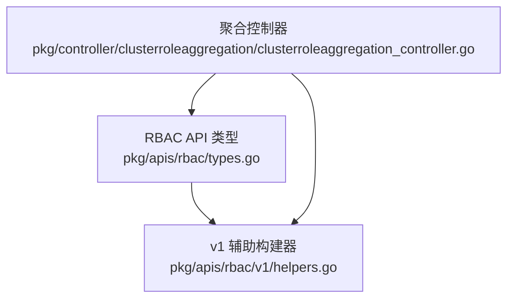
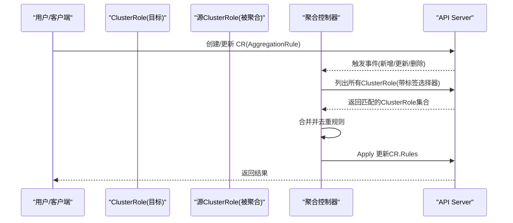
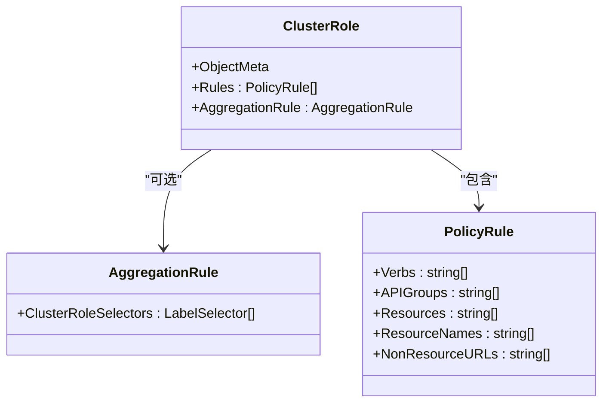
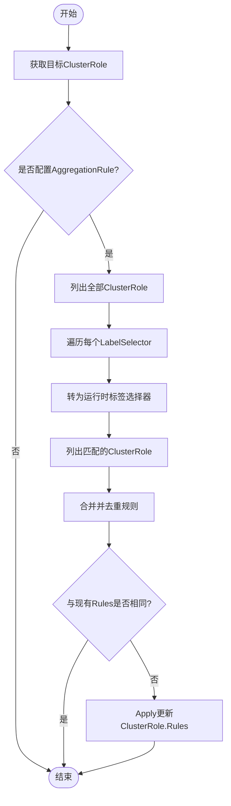
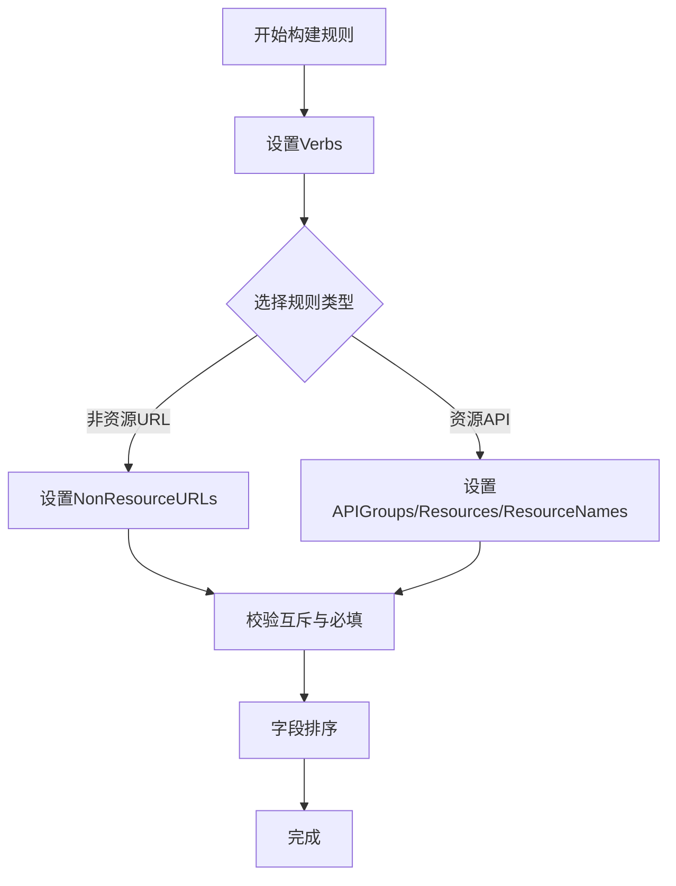
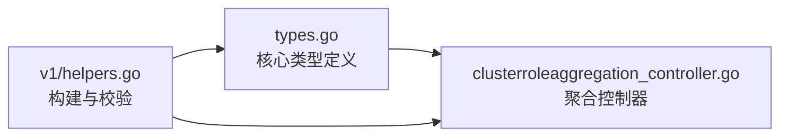

# ClusterRole API

<cite>
**本文引用的文件**   
- [pkg/apis/rbac/types.go](file://pkg/apis/rbac/types.go)
- [pkg/controller/clusterroleaggregation/clusterroleaggregation_controller.go](file://pkg/controller/clusterroleaggregation/clusterroleaggregation_controller.go)
- [pkg/apis/rbac/v1/helpers.go](file://pkg/apis/rbac/v1/helpers.go)
</cite>

## 目录
1. [简介](#简介)
2. [项目结构](#项目结构)
3. [核心组件](#核心组件)
4. [架构总览](#架构总览)
5. [详细组件分析](#详细组件分析)
6. [依赖关系分析](#依赖关系分析)
7. [性能考量](#性能考量)
8. [故障排查指南](#故障排查指南)
9. [结论](#结论)
10. [附录](#附录)

## 简介
本参考文档聚焦 Kubernetes RBAC 中的集群级权限模型，围绕 ClusterRole 资源展开，系统阐述：
- 全局角色定义与规则表达（PolicyRule）
- 聚合规则 AggregationRule 的机制与控制器实现
- 与 Role 的作用域差异、迁移策略与最佳实践
- 多租户环境下的权限管理建议

## 项目结构
与 ClusterRole 相关的核心代码主要位于 RBAC API 类型定义与聚合控制器中：
- API 类型定义：ClusterRole、AggregationRule、PolicyRule、Subject、RoleRef 等
- 聚合控制器：根据 AggregationRule 自动汇总匹配的 ClusterRole 的规则并写回目标 ClusterRole

图表来源
- [pkg/apis/rbac/types.go:148-168](file://pkg/apis/rbac/types.go#L148-L168)
- [pkg/apis/rbac/v1/helpers.go:32-107](file://pkg/apis/rbac/v1/helpers.go#L32-L107)
- [pkg/controller/clusterroleaggregation/clusterroleaggregation_controller.go:45-142](file://pkg/controller/clusterroleaggregation/clusterroleaggregation_controller.go#L45-L142)

章节来源
- [pkg/apis/rbac/types.go:148-168](file://pkg/apis/rbac/types.go#L148-L168)
- [pkg/apis/rbac/v1/helpers.go:32-107](file://pkg/apis/rbac/v1/helpers.go#L32-L107)
- [pkg/controller/clusterroleaggregation/clusterroleaggregation_controller.go:45-142](file://pkg/controller/clusterroleaggregation/clusterroleaggregation_controller.go#L45-L142)

## 核心组件
本节从 API 视角梳理与 ClusterRole 直接相关的数据结构与语义。

- PolicyRule：描述一组“动词-资源-API组”或“非资源URL”的访问许可；支持 ResourceNames 白名单；非资源 URL 仅对集群级绑定有效。
- Subject：绑定主体，支持 User、Group、ServiceAccount，并可指定命名空间（针对 ServiceAccount）。
- RoleRef：引用被绑定的角色（Role 或 ClusterRole），包含 APIGroup、Kind、Name。
- ClusterRole：集群级角色，包含 Rules 列表以及可选的 AggregationRule。
- AggregationRule：通过 LabelSelector 选择其他 ClusterRole，将其 Rules 聚合成当前 ClusterRole 的规则集合。

要点说明
- 当设置 AggregationRule 时，Rules 由控制器管理，手动修改会被覆盖。
- 授权评估顺序：先匹配 ClusterRoleBinding，再在请求命名空间内匹配 RoleBinding，最后默认拒绝。

章节来源
- [pkg/apis/rbac/types.go:23-63](file://pkg/apis/rbac/types.go#L23-L63)
- [pkg/apis/rbac/types.go:65-90](file://pkg/apis/rbac/types.go#L65-L90)
- [pkg/apis/rbac/types.go:148-168](file://pkg/apis/rbac/types.go#L148-L168)

## 架构总览
下图展示 ClusterRole 与其聚合控制器的交互关系：控制器监听 ClusterRole 变更，按 AggregationRule 的标签选择器收集匹配的 ClusterRole，合并去重后以 Apply 方式写回目标 ClusterRole 的 Rules。

图表来源
- [pkg/controller/clusterroleaggregation/clusterroleaggregation_controller.go:85-142](file://pkg/controller/clusterroleaggregation/clusterroleaggregation_controller.go#L85-L142)
- [pkg/apis/rbac/types.go:148-168](file://pkg/apis/rbac/types.go#L148-L168)

## 详细组件分析

### ClusterRole 与 AggregationRule 数据模型
- ClusterRole
  - Rules：显式定义的规则集合
  - AggregationRule：可选，用于动态聚合
- AggregationRule
  - ClusterRoleSelectors：一组 LabelSelector，匹配到的 ClusterRole 的 Rules 将被加入目标 ClusterRole

图表来源
- [pkg/apis/rbac/types.go:148-168](file://pkg/apis/rbac/types.go#L148-L168)
- [pkg/apis/rbac/types.go:43-63](file://pkg/apis/rbac/types.go#L43-L63)

章节来源
- [pkg/apis/rbac/types.go:148-168](file://pkg/apis/rbac/types.go#L148-L168)
- [pkg/apis/rbac/types.go:43-63](file://pkg/apis/rbac/types.go#L43-L63)

### 聚合控制器工作流
- 监听 ClusterRole 增删改事件
- 遍历所有含 AggregationRule 的 ClusterRole
- 将每个 Selector 转换为运行时标签选择器，列出匹配的 ClusterRole
- 合并规则并去重，若与现有 Rules 不同则 Apply 更新

图表来源
- [pkg/controller/clusterroleaggregation/clusterroleaggregation_controller.go:85-142](file://pkg/controller/clusterroleaggregation/clusterroleaggregation_controller.go#L85-L142)
- [pkg/controller/clusterroleaggregation/clusterroleaggregation_controller.go:221-242](file://pkg/controller/clusterroleaggregation/clusterroleaggregation_controller.go#L221-L242)

章节来源
- [pkg/controller/clusterroleaggregation/clusterroleaggregation_controller.go:85-142](file://pkg/controller/clusterroleaggregation/clusterroleaggregation_controller.go#L85-L142)
- [pkg/controller/clusterroleaggregation/clusterroleaggregation_controller.go:221-242](file://pkg/controller/clusterroleaggregation/clusterroleaggregation_controller.go#L221-L242)

### 规则构造与校验（v1 helpers）
- PolicyRuleBuilder：提供链式方法快速构造 PolicyRule，并在 Rule() 阶段进行基本校验
  - 必须包含 Verbs
  - NonResourceURLs 与 Resources/APIGroups/ResourceNames 互斥
  - Resources 规则必须包含 APIGroups
  - 输出前对各字段排序以保证稳定性
- ClusterRoleBindingBuilder / RoleBindingBuilder：便捷构建绑定对象，确保 Subjects 非空

图表来源
- [pkg/apis/rbac/v1/helpers.go:32-107](file://pkg/apis/rbac/v1/helpers.go#L32-L107)

章节来源
- [pkg/apis/rbac/v1/helpers.go:32-107](file://pkg/apis/rbac/v1/helpers.go#L32-L107)

## 依赖关系分析
- API 层：types.go 定义了 ClusterRole、AggregationRule、PolicyRule、Subject、RoleRef 等核心类型
- 控制器层：clusterroleaggregation_controller.go 依赖 API 类型与 client-go 列表器/客户端，执行聚合逻辑
- v1 helpers：提供规则与绑定的便捷构建与校验工具

图表来源
- [pkg/apis/rbac/types.go:148-168](file://pkg/apis/rbac/types.go#L148-L168)
- [pkg/controller/clusterroleaggregation/clusterroleaggregation_controller.go:45-142](file://pkg/controller/clusterroleaggregation/clusterroleaggregation_controller.go#L45-L142)
- [pkg/apis/rbac/v1/helpers.go:32-107](file://pkg/apis/rbac/v1/helpers.go#L32-L107)

章节来源
- [pkg/apis/rbac/types.go:148-168](file://pkg/apis/rbac/types.go#L148-L168)
- [pkg/controller/clusterroleaggregation/clusterroleaggregation_controller.go:45-142](file://pkg/controller/clusterroleaggregation/clusterroleaggregation_controller.go#L45-L142)
- [pkg/apis/rbac/v1/helpers.go:32-107](file://pkg/apis/rbac/v1/helpers.go#L32-L107)

## 性能考量
- 聚合控制器采用全量扫描策略：每次事件都会列出所有 ClusterRole，并按选择器过滤。由于集群中 ClusterRole 数量通常较小，该策略可接受且便于错误重试。
- 规则合并与去重使用语义相等比较，避免不必要的写入。
- 使用 Apply 操作减少并发冲突风险。

章节来源
- [pkg/controller/clusterroleaggregation/clusterroleaggregation_controller.go:221-242](file://pkg/controller/clusterroleaggregation/clusterroleaggregation_controller.go#L221-L242)
- [pkg/controller/clusterroleaggregation/clusterroleaggregation_controller.go:128-142](file://pkg/controller/clusterroleaggregation/clusterroleaggregation_controller.go#L128-L142)

## 故障排查指南
- 规则未生效
  - 检查目标 ClusterRole 是否设置了 AggregationRule；若已设置，Rules 由控制器管理，手动修改会被覆盖。
  - 确认选择的标签是否正确，确保源 ClusterRole 存在且未被删除。
- 权限不足
  - 确认绑定对象（ClusterRoleBinding/RoleBinding）的 Subjects 正确，且 RoleRef 指向有效的角色。
  - 注意非资源 URL 仅在集群级绑定中生效。
- 控制器异常
  - 查看控制器日志，关注队列重试与错误信息；必要时调整工作线程数或观察缓存同步状态。

章节来源
- [pkg/apis/rbac/types.go:156-161](file://pkg/apis/rbac/types.go#L156-L161)
- [pkg/controller/clusterroleaggregation/clusterroleaggregation_controller.go:171-195](file://pkg/controller/clusterroleaggregation/clusterroleaggregation_controller.go#L171-L195)

## 结论
ClusterRole 提供了集群级别的权限抽象，结合 AggregationRule 可实现声明式的权限聚合，简化大规模集群的权限治理。配合 Role 的命名空间作用域，可在多租户场景下实现清晰的权限分层与最小权限原则。

## 附录

### 与 Role 的差异与迁移策略
- 作用域
  - Role：命名空间级别，适用于单命名空间内的资源访问控制。
  - ClusterRole：集群级别，适用于跨命名空间的资源访问控制或非资源 URL。
- 绑定方式
  - RoleBinding：在命名空间内绑定 Role 或 ClusterRole。
  - ClusterRoleBinding：在集群范围绑定 ClusterRole。
- 迁移建议
  - 将跨命名空间复用的权限抽象为 ClusterRole，并通过 ClusterRoleBinding 授予给需要的主体。
  - 对于仅作用于单一命名空间的权限，优先使用 Role 以降低影响面。
  - 利用 AggregationRule 将通用能力（如监控、日志采集）聚合到统一的 ClusterRole，便于集中管理与演进。

[本节为概念性内容，不直接分析具体文件]

### 多租户权限管理最佳实践
- 最小权限原则：为每个租户或服务账户只授予必要的最小权限集。
- 角色分层：基础能力通过聚合 ClusterRole 提供，业务特定权限通过命名空间 Role 细化。
- 标签驱动：使用稳定的标签规范组织被聚合的 ClusterRole，便于自动化与审计。
- 定期审计：基于绑定与规则清单进行周期性审查，清理过期与冗余权限。

[本节为概念性内容，不直接分析具体文件]