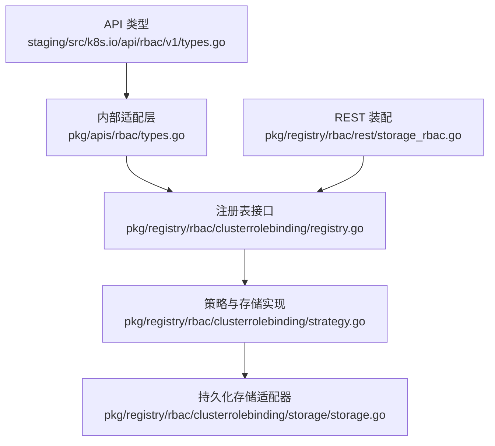
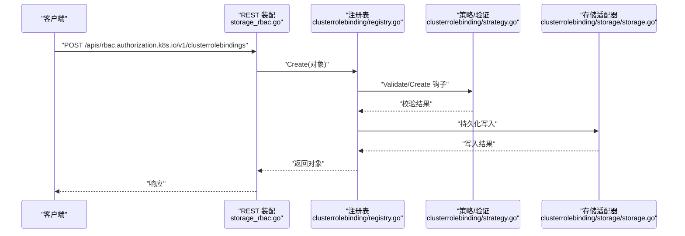
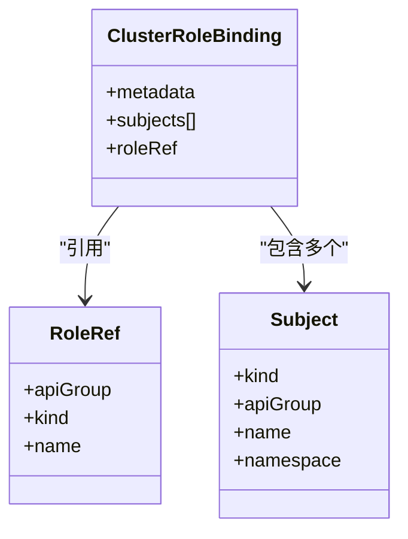
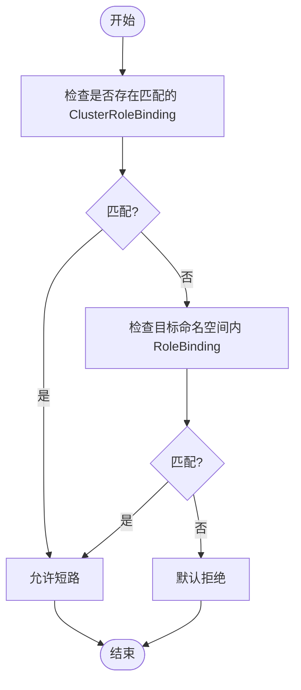
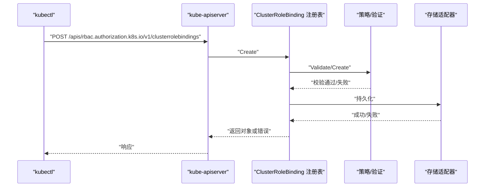
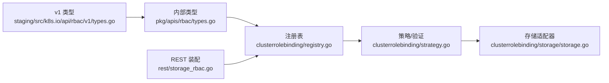

# ClusterRoleBinding API

<cite>
**本文引用的文件**   
- [staging/src/k8s.io/api/rbac/v1/types.go](file://staging/src/k8s.io/api/rbac/v1/types.go)
- [pkg/apis/rbac/types.go](file://pkg/apis/rbac/types.go)
- [pkg/registry/rbac/clusterrolebinding/storage/storage.go](file://pkg/registry/rbac/clusterrolebinding/storage/storage.go)
- [pkg/registry/rbac/clusterrolebinding/strategy.go](file://pkg/registry/rbac/clusterrolebinding/strategy.go)
- [pkg/registry/rbac/clusterrolebinding/registry.go](file://pkg/registry/rbac/clusterrolebinding/registry.go)
- [pkg/registry/rbac/rest/storage_rbac.go](file://pkg/registry/rbac/rest/storage_rbac.go)
</cite>

## 目录
1. [简介](#简介)
2. [项目结构](#项目结构)
3. [核心组件](#核心组件)
4. [架构总览](#架构总览)
5. [详细组件分析](#详细组件分析)
6. [依赖关系分析](#依赖关系分析)
7. [性能考量](#性能考量)
8. [故障排查指南](#故障排查指南)
9. [结论](#结论)
10. [附录](#附录)

## 简介
本参考文档聚焦 Kubernetes RBAC 中的集群级权限绑定资源 ClusterRoleBinding，系统阐述其作用域、与 RoleBinding 的优先级与作用域差异、全局与跨命名空间授权机制，并提供企业级权限治理策略与安全最佳实践。文档同时给出 REST API 层面的行为说明（基于源码实现），帮助读者从模型到存储链路全面理解该资源的创建、更新、删除与校验流程。

## 项目结构
围绕 ClusterRoleBinding 的相关代码主要分布在以下位置：
- API 类型定义：staging/src/k8s.io/api/rbac/v1/types.go 与 pkg/apis/rbac/types.go
- 注册表与存储：pkg/registry/rbac/clusterrolebinding/*
- REST 路由与存储装配：pkg/registry/rbac/rest/storage_rbac.go

图表来源
- [staging/src/k8s.io/api/rbac/v1/types.go:228-248](file://staging/src/k8s.io/api/rbac/v1/types.go#L228-L248)
- [pkg/apis/rbac/types.go:172-186](file://pkg/apis/rbac/types.go#L172-L186)
- [pkg/registry/rbac/clusterrolebinding/registry.go](file://pkg/registry/rbac/clusterrolebinding/registry.go)
- [pkg/registry/rbac/clusterrolebinding/strategy.go](file://pkg/registry/rbac/clusterrolebinding/strategy.go)
- [pkg/registry/rbac/clusterrolebinding/storage/storage.go](file://pkg/registry/rbac/clusterrolebinding/storage/storage.go)
- [pkg/registry/rbac/rest/storage_rbac.go](file://pkg/registry/rbac/rest/storage_rbac.go)

章节来源
- [staging/src/k8s.io/api/rbac/v1/types.go:228-248](file://staging/src/k8s.io/api/rbac/v1/types.go#L228-L248)
- [pkg/apis/rbac/types.go:172-186](file://pkg/apis/rbac/types.go#L172-L186)
- [pkg/registry/rbac/clusterrolebinding/registry.go](file://pkg/registry/rbac/clusterrolebinding/registry.go)
- [pkg/registry/rbac/clusterrolebinding/strategy.go](file://pkg/registry/rbac/clusterrolebinding/strategy.go)
- [pkg/registry/rbac/clusterrolebinding/storage/storage.go](file://pkg/registry/rbac/clusterrolebinding/storage/storage.go)
- [pkg/registry/rbac/rest/storage_rbac.go](file://pkg/registry/rbac/rest/storage_rbac.go)

## 核心组件
- ClusterRoleBinding 对象
  - 用于将集群级别的权限（ClusterRole）授予主体（用户、组或服务账号）。
  - 作用域为集群级别，不隶属于任何命名空间。
  - roleRef 仅能指向 ClusterRole；若无法解析，鉴权器应返回错误。
  - subjects 列表包含被授权的主体信息。
- RoleRef 与 Subject
  - RoleRef 指定被引用的角色及其 APIGroup、Kind、Name。
  - Subject 支持 User、Group、ServiceAccount 三种类型，并包含可选的 namespace（对非命名空间主体不应为空）。
- 授权计算顺序
  - 先评估 ClusterRoleBinding（命中即短路允许）。
  - 再评估目标命名空间内的 RoleBinding（命中即短路允许）。
  - 默认拒绝。

章节来源
- [staging/src/k8s.io/api/rbac/v1/types.go:228-248](file://staging/src/k8s.io/api/rbac/v1/types.go#L228-L248)
- [staging/src/k8s.io/api/rbac/v1/types.go:101-114](file://staging/src/k8s.io/api/rbac/v1/types.go#L101-L114)
- [staging/src/k8s.io/api/rbac/v1/types.go:78-99](file://staging/src/k8s.io/api/rbac/v1/types.go#L78-L99)
- [staging/src/k8s.io/api/rbac/v1/types.go:23-26](file://staging/src/k8s.io/api/rbac/v1/types.go#L23-L26)
- [pkg/apis/rbac/types.go:172-186](file://pkg/apis/rbac/types.go#L172-L186)
- [pkg/apis/rbac/types.go:82-90](file://pkg/apis/rbac/types.go#L82-L90)
- [pkg/apis/rbac/types.go:65-80](file://pkg/apis/rbac/types.go#L65-L80)
- [pkg/apis/rbac/types.go:23-26](file://pkg/apis/rbac/types.go#L23-L26)

## 架构总览
下图展示了 ClusterRoleBinding 在 API 层到存储层的调用链路与职责划分。

图表来源
- [pkg/registry/rbac/rest/storage_rbac.go](file://pkg/registry/rbac/rest/storage_rbac.go)
- [pkg/registry/rbac/clusterrolebinding/registry.go](file://pkg/registry/rbac/clusterrolebinding/registry.go)
- [pkg/registry/rbac/clusterrolebinding/strategy.go](file://pkg/registry/rbac/clusterrolebinding/strategy.go)
- [pkg/registry/rbac/clusterrolebinding/storage/storage.go](file://pkg/registry/rbac/clusterrolebinding/storage/storage.go)

## 详细组件分析

### API 模型与字段语义
- ClusterRoleBinding
  - metadata：标准元数据。
  - subjects：主体列表，支持用户、组、服务账号。
  - roleRef：仅可引用 ClusterRole，不可修改。
- RoleRef
  - apiGroup、kind、name：标识被引用的角色。
- Subject
  - kind：User、Group、ServiceAccount。
  - apiGroup：默认值规则（ServiceAccount 为空字符串，User/Group 为 rbac.authorization.k8s.io）。
  - name：主体名称。
  - namespace：当 kind 为非命名空间主体时不应为空。

图表来源
- [staging/src/k8s.io/api/rbac/v1/types.go:228-248](file://staging/src/k8s.io/api/rbac/v1/types.go#L228-L248)
- [staging/src/k8s.io/api/rbac/v1/types.go:101-114](file://staging/src/k8s.io/api/rbac/v1/types.go#L101-L114)
- [staging/src/k8s.io/api/rbac/v1/types.go:78-99](file://staging/src/k8s.io/api/rbac/v1/types.go#L78-L99)

章节来源
- [staging/src/k8s.io/api/rbac/v1/types.go:228-248](file://staging/src/k8s.io/api/rbac/v1/types.go#L228-L248)
- [staging/src/k8s.io/api/rbac/v1/types.go:101-114](file://staging/src/k8s.io/api/rbac/v1/types.go#L101-L114)
- [staging/src/k8s.io/api/rbac/v1/types.go:78-99](file://staging/src/k8s.io/api/rbac/v1/types.go#L78-L99)

### 作用域与优先级
- 作用域
  - ClusterRoleBinding：集群级别，不受命名空间限制。
  - RoleBinding：命名空间级别，仅在当前命名空间生效。
- 优先级
  - 授权计算顺序：先 ClusterRoleBinding，后 RoleBinding，最后默认拒绝。
  - 这意味着集群级绑定具有更高优先级的“短路允许”能力。

章节来源
- [staging/src/k8s.io/api/rbac/v1/types.go:23-26](file://staging/src/k8s.io/api/rbac/v1/types.go#L23-L26)
- [pkg/apis/rbac/types.go:23-26](file://pkg/apis/rbac/types.go#L23-L26)

### 授权判定流程（算法）

图表来源
- [staging/src/k8s.io/api/rbac/v1/types.go:23-26](file://staging/src/k8s.io/api/rbac/v1/types.go#L23-L26)
- [pkg/apis/rbac/types.go:23-26](file://pkg/apis/rbac/types.go#L23-L26)

### REST API 行为与存储链路
- 资源路径
  - 集群级资源：/apis/rbac.authorization.k8s.io/v1/clusterrolebindings
- 操作
  - Create：通过 REST 装配进入注册表，执行策略校验后写入存储。
  - Get/List/Delete/Update：遵循通用注册表模式。
- 约束
  - roleRef 不可变。
  - roleRef 必须指向 ClusterRole。
  - 当 roleRef 无法解析时，鉴权器应返回错误。

图表来源
- [pkg/registry/rbac/rest/storage_rbac.go](file://pkg/registry/rbac/rest/storage_rbac.go)
- [pkg/registry/rbac/clusterrolebinding/registry.go](file://pkg/registry/rbac/clusterrolebinding/registry.go)
- [pkg/registry/rbac/clusterrolebinding/strategy.go](file://pkg/registry/rbac/clusterrolebinding/strategy.go)
- [pkg/registry/rbac/clusterrolebinding/storage/storage.go](file://pkg/registry/rbac/clusterrolebinding/storage/storage.go)

章节来源
- [pkg/registry/rbac/rest/storage_rbac.go](file://pkg/registry/rbac/rest/storage_rbac.go)
- [pkg/registry/rbac/clusterrolebinding/registry.go](file://pkg/registry/rbac/clusterrolebinding/registry.go)
- [pkg/registry/rbac/clusterrolebinding/strategy.go](file://pkg/registry/rbac/clusterrolebinding/strategy.go)
- [pkg/registry/rbac/clusterrolebinding/storage/storage.go](file://pkg/registry/rbac/clusterrolebinding/storage/storage.go)

### 与 RoleBinding 的差异与协作
- 差异
  - 作用域：ClusterRoleBinding 为集群级；RoleBinding 为命名空间级。
  - 角色引用：ClusterRoleBinding 只能引用 ClusterRole；RoleBinding 可引用同命名空间的 Role 或全局的 ClusterRole。
- 协作
  - 同一请求可能同时命中两者，但 ClusterRoleBinding 优先短路允许。
  - 常见模式：使用 ClusterRole 定义权限集，再通过 ClusterRoleBinding 授予全局主体，或通过 RoleBinding 在特定命名空间细化授权。

章节来源
- [staging/src/k8s.io/api/rbac/v1/types.go:138-159](file://staging/src/k8s.io/api/rbac/v1/types.go#L138-L159)
- [staging/src/k8s.io/api/rbac/v1/types.go:228-248](file://staging/src/k8s.io/api/rbac/v1/types.go#L228-L248)
- [staging/src/k8s.io/api/rbac/v1/types.go:23-26](file://staging/src/k8s.io/api/rbac/v1/types.go#L23-L26)

### 企业级权限治理策略
- 最小权限原则
  - 避免直接使用超级管理员角色，按需拆分细粒度 ClusterRole。
- 集中式角色管理
  - 以 ClusterRole 作为权限基线，通过 ClusterRoleBinding 进行主体聚合。
- 多租户隔离
  - 结合命名空间与 RoleBinding 做横向隔离，减少集群级绑定的范围。
- 变更审计与审批
  - 对 ClusterRoleBinding 的增删改启用审计日志与准入控制。
- 自动化与声明式
  - 使用 GitOps 工具管理 RBAC 配置，确保版本化与可追溯。
- 定期审查
  - 周期性扫描未使用的 ClusterRoleBinding 与过度宽泛的规则。

[本节为概念性内容，无需列出具体文件来源]

## 依赖关系分析
- API 层到内部适配层
  - staging/src/k8s.io/api/rbac/v1/types.go 提供对外 JSON 序列化与生命周期标签。
  - pkg/apis/rbac/types.go 提供内部版本的结构体定义。
- 注册表与策略
  - registry.go 暴露 Create/Get/List 等接口。
  - strategy.go 负责校验与转换逻辑。
- 存储适配
  - storage/storage.go 对接底层存储（如 etcd）。
- REST 装配
  - rest/storage_rbac.go 将 RBAC 相关资源注册到 API Server。

图表来源
- [staging/src/k8s.io/api/rbac/v1/types.go:228-248](file://staging/src/k8s.io/api/rbac/v1/types.go#L228-L248)
- [pkg/apis/rbac/types.go:172-186](file://pkg/apis/rbac/types.go#L172-L186)
- [pkg/registry/rbac/clusterrolebinding/registry.go](file://pkg/registry/rbac/clusterrolebinding/registry.go)
- [pkg/registry/rbac/clusterrolebinding/strategy.go](file://pkg/registry/rbac/clusterrolebinding/strategy.go)
- [pkg/registry/rbac/clusterrolebinding/storage/storage.go](file://pkg/registry/rbac/clusterrolebinding/storage/storage.go)
- [pkg/registry/rbac/rest/storage_rbac.go](file://pkg/registry/rbac/rest/storage_rbac.go)

章节来源
- [staging/src/k8s.io/api/rbac/v1/types.go:228-248](file://staging/src/k8s.io/api/rbac/v1/types.go#L228-L248)
- [pkg/apis/rbac/types.go:172-186](file://pkg/apis/rbac/types.go#L172-L186)
- [pkg/registry/rbac/clusterrolebinding/registry.go](file://pkg/registry/rbac/clusterrolebinding/registry.go)
- [pkg/registry/rbac/clusterrolebinding/strategy.go](file://pkg/registry/rbac/clusterrolebinding/strategy.go)
- [pkg/registry/rbac/clusterrolebinding/storage/storage.go](file://pkg/registry/rbac/clusterrolebinding/storage/storage.go)
- [pkg/registry/rbac/rest/storage_rbac.go](file://pkg/registry/rbac/rest/storage_rbac.go)

## 性能考量
- 授权短路优化
  - 由于 ClusterRoleBinding 优先匹配，合理设计可减少后续 RoleBinding 的遍历开销。
- 批量操作
  - 大规模创建/更新建议分批提交，避免单次请求过大导致 API Server 压力。
- 缓存与一致性
  - 注册表与存储适配器通常具备缓存机制，注意变更传播延迟对鉴权的影响。

[本节为通用指导，无需列出具体文件来源]

## 故障排查指南
- roleRef 无法解析
  - 现象：创建或更新时返回错误。
  - 原因：roleRef 指向的角色不存在或类型不正确（ClusterRoleBinding 仅允许 ClusterRole）。
  - 处理：确认 roleRef.name 与 kind 正确，且对应 ClusterRole 存在。
- 权限未生效
  - 现象：预期允许的操作仍被拒绝。
  - 原因：未命中 ClusterRoleBinding 或 RoleBinding；或规则中 verbs/resources 不匹配。
  - 处理：核对 Subjects 与 RoleRef，检查 PolicyRule 的 verbs、resources、resourceNames 与 nonResourceURLs。
- 命名空间混淆
  - 现象：在命名空间内使用 ClusterRoleBinding 无效。
  - 原因：ClusterRoleBinding 为集群级，不在命名空间内生效。
  - 处理：如需命名空间级授权，请使用 RoleBinding。

章节来源
- [staging/src/k8s.io/api/rbac/v1/types.go:228-248](file://staging/src/k8s.io/api/rbac/v1/types.go#L228-L248)
- [staging/src/k8s.io/api/rbac/v1/types.go:70-76](file://staging/src/k8s.io/api/rbac/v1/types.go#L70-L76)
- [pkg/apis/rbac/types.go:58-63](file://pkg/apis/rbac/types.go#L58-L63)

## 结论
ClusterRoleBinding 是实现集群级权限分配的核心资源，具有高优先级与跨命名空间影响的能力。结合 RoleBinding 可实现精细化的分层授权。在企业环境中，建议采用最小权限、集中管理与自动化治理策略，配合审计与定期审查，确保 RBAC 的安全性与可维护性。

[本节为总结性内容，无需列出具体文件来源]

## 附录
- 常用主体类型
  - User：用户实体。
  - Group：用户组。
  - ServiceAccount：服务账号。
- 关键常量
  - APIGroupAll、ResourceAll、VerbAll、NonResourceAll：通配符常量。
  - AutoUpdateAnnotationKey：用于控制自动更新的注解键。

章节来源
- [staging/src/k8s.io/api/rbac/v1/types.go:28-40](file://staging/src/k8s.io/api/rbac/v1/types.go#L28-L40)
- [pkg/apis/rbac/types.go:29-41](file://pkg/apis/rbac/types.go#L29-L41)