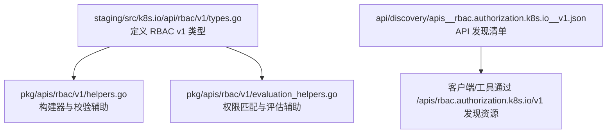
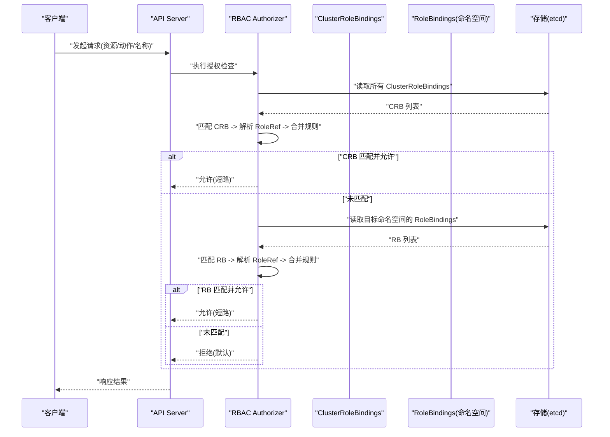
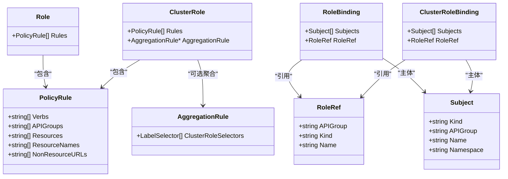
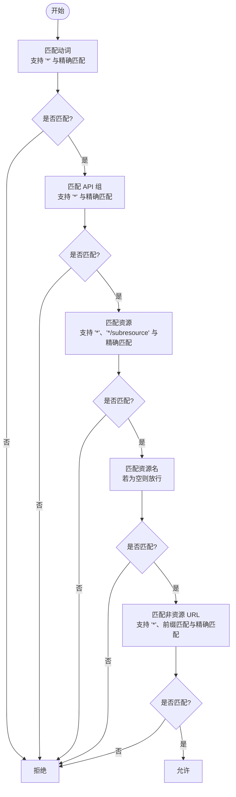
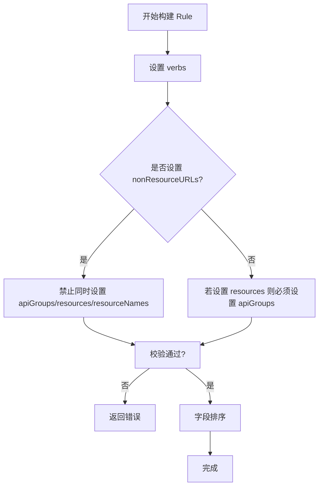
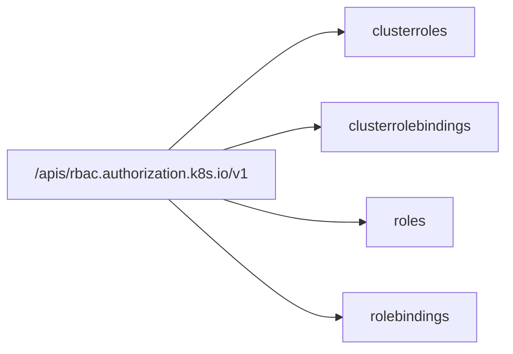
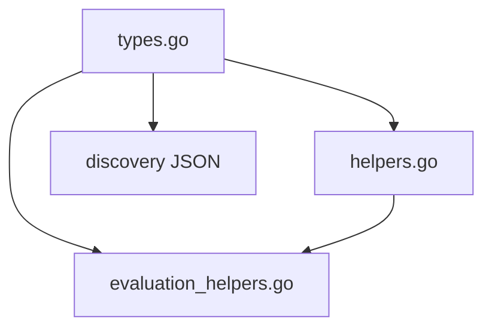

# RBAC API

<cite>
**本文引用的文件**
- [staging/src/k8s.io/api/rbac/v1/types.go](file://staging/src/k8s.io/api/rbac/v1/types.go)
- [pkg/apis/rbac/v1/helpers.go](file://pkg/apis/rbac/v1/helpers.go)
- [pkg/apis/rbac/v1/evaluation_helpers.go](file://pkg/apis/rbac/v1/evaluation_helpers.go)
- [api/discovery/apis__rbac.authorization.k8s.io__v1.json](file://api/discovery/apis__rbac.authorization.k8s.io__v1.json)
</cite>

## 目录
1. [简介](#简介)
2. [项目结构](#项目结构)
3. [核心组件](#核心组件)
4. [架构总览](#架构总览)
5. [详细组件分析](#详细组件分析)
6. [依赖关系分析](#依赖关系分析)
7. [性能考量](#性能考量)
8. [故障排查指南](#故障排查指南)
9. [结论](#结论)
10. [附录](#附录)

## 简介
本文件为 Kubernetes RBAC（基于角色的访问控制）API 组的权威参考文档，聚焦 rbac.authorization.k8s.io/v1 版本。内容涵盖：
- 资源模型与字段规范（Role、ClusterRole、RoleBinding、ClusterRoleBinding、PolicyRule、Subject、RoleRef 等）
- 权限判定流程与匹配规则（动词、API 组、资源、子资源、资源名、非资源 URL）
- 角色聚合与继承机制（AggregationRule）
- 多租户隔离策略与安全最佳实践
- 权限审计与常见问题排查

## 项目结构
RBAC v1 的 API 类型定义位于 staging 模块中，辅助构建与评估逻辑位于 pkg/apis/rbac/v1；API 发现清单在 api/discovery 下生成。

**图示来源**
- [staging/src/k8s.io/api/rbac/v1/types.go:1-277](file://staging/src/k8s.io/api/rbac/v1/types.go#L1-L277)
- [pkg/apis/rbac/v1/helpers.go:1-239](file://pkg/apis/rbac/v1/helpers.go#L1-L239)
- [pkg/apis/rbac/v1/evaluation_helpers.go:1-145](file://pkg/apis/rbac/v1/evaluation_helpers.go#L1-L145)
- [api/discovery/apis__rbac.authorization.k8s.io__v1.json:1-76](file://api/discovery/apis__rbac.authorization.k8s.io__v1.json#L1-L76)

**章节来源**
- [staging/src/k8s.io/api/rbac/v1/types.go:1-277](file://staging/src/k8s.io/api/rbac/v1/types.go#L1-L277)
- [pkg/apis/rbac/v1/helpers.go:1-239](file://pkg/apis/rbac/v1/helpers.go#L1-L239)
- [pkg/apis/rbac/v1/evaluation_helpers.go:1-145](file://pkg/apis/rbac/v1/evaluation_helpers.go#L1-L145)
- [api/discovery/apis__rbac.authorization.k8s.io__v1.json:1-76](file://api/discovery/apis__rbac.authorization.k8s.io__v1.json#L1-L76)

## 核心组件
本节概述 RBAC 的核心数据模型与语义约定。

- PolicyRule：描述“允许对哪些资源的哪些操作”，支持资源与非资源 URL 两类规则，二者互斥。
- Subject：绑定主体，支持 User、Group、ServiceAccount。
- RoleRef：指向被绑定的角色（Role 或 ClusterRole）。
- Role：命名空间内的一组规则集合。
- ClusterRole：集群级规则集合，可配置 AggregationRule 进行聚合。
- RoleBinding：将 Role 或 ClusterRole 授予 Subject，作用域为所在命名空间。
- ClusterRoleBinding：将 ClusterRole 授予 Subject，作用域为集群。

关键常量与约定：
- 通配符：“*” 表示全部（如 APIGroups、Resources、Verbs、NonResourceURLs）。
- 默认 APIGroup：User/Group 默认为 "rbac.authorization.k8s.io"，ServiceAccount 默认为 ""。
- 不可变字段：RoleRef 为不可变字段。
- 自动更新注解：可通过注解控制某些对象的自动更新行为。

**章节来源**
- [staging/src/k8s.io/api/rbac/v1/types.go:23-46](file://staging/src/k8s.io/api/rbac/v1/types.go#L23-L46)
- [staging/src/k8s.io/api/rbac/v1/types.go:47-76](file://staging/src/k8s.io/api/rbac/v1/types.go#L47-L76)
- [staging/src/k8s.io/api/rbac/v1/types.go:78-99](file://staging/src/k8s.io/api/rbac/v1/types.go#L78-L99)
- [staging/src/k8s.io/api/rbac/v1/types.go:101-114](file://staging/src/k8s.io/api/rbac/v1/types.go#L101-L114)
- [staging/src/k8s.io/api/rbac/v1/types.go:120-132](file://staging/src/k8s.io/api/rbac/v1/types.go#L120-L132)
- [staging/src/k8s.io/api/rbac/v1/types.go:138-159](file://staging/src/k8s.io/api/rbac/v1/types.go#L138-L159)
- [staging/src/k8s.io/api/rbac/v1/types.go:194-221](file://staging/src/k8s.io/api/rbac/v1/types.go#L194-L221)
- [staging/src/k8s.io/api/rbac/v1/types.go:228-248](file://staging/src/k8s.io/api/rbac/v1/types.go#L228-L248)

## 架构总览
RBAC 授权判定遵循“先全局后命名空间”的顺序，并在首次匹配时短路返回允许；未命中则默认拒绝。

**图示来源**
- [staging/src/k8s.io/api/rbac/v1/types.go:23-46](file://staging/src/k8s.io/api/rbac/v1/types.go#L23-L46)

## 详细组件分析

### 资源与字段规范
- Role/ClusterRole
  - rules：PolicyRule 列表，定义具体权限。
  - ClusterRole.aggregationRule：通过标签选择器聚合其他 ClusterRole 的规则，由控制器管理，直接修改 rules 会被覆盖。
- RoleBinding/ClusterRoleBinding
  - subjects：被授权的主体列表（User/Group/ServiceAccount）。
  - roleRef：指向被绑定的角色（不可变）。
- PolicyRule
  - verbs：操作集合，支持 "*"。
  - apiGroups：API 组集合，"" 表示 core，"*" 表示全部。
  - resources：资源集合，支持 "*"/subresource 模式。
  - resourceNames：白名单，空表示不限制。
  - nonResourceURLs：非资源 URL 路径，支持前缀匹配与 "*"。
- Subject
  - kind：User/Group/ServiceAccount。
  - apiGroup：User/Group 默认 "rbac.authorization.k8s.io"，ServiceAccount 默认 ""。
  - name：主体名称。
  - namespace：仅 ServiceAccount 使用。

**图示来源**
- [staging/src/k8s.io/api/rbac/v1/types.go:47-76](file://staging/src/k8s.io/api/rbac/v1/types.go#L47-L76)
- [staging/src/k8s.io/api/rbac/v1/types.go:78-99](file://staging/src/k8s.io/api/rbac/v1/types.go#L78-L99)
- [staging/src/k8s.io/api/rbac/v1/types.go:101-114](file://staging/src/k8s.io/api/rbac/v1/types.go#L101-L114)
- [staging/src/k8s.io/api/rbac/v1/types.go:120-132](file://staging/src/k8s.io/api/rbac/v1/types.go#L120-L132)
- [staging/src/k8s.io/api/rbac/v1/types.go:194-221](file://staging/src/k8s.io/api/rbac/v1/types.go#L194-L221)
- [staging/src/k8s.io/api/rbac/v1/types.go:228-248](file://staging/src/k8s.io/api/rbac/v1/types.go#L228-L248)

**章节来源**
- [staging/src/k8s.io/api/rbac/v1/types.go:47-76](file://staging/src/k8s.io/api/rbac/v1/types.go#L47-L76)
- [staging/src/k8s.io/api/rbac/v1/types.go:78-99](file://staging/src/k8s.io/api/rbac/v1/types.go#L78-L99)
- [staging/src/k8s.io/api/rbac/v1/types.go:101-114](file://staging/src/k8s.io/api/rbac/v1/types.go#L101-L114)
- [staging/src/k8s.io/api/rbac/v1/types.go:120-132](file://staging/src/k8s.io/api/rbac/v1/types.go#L120-L132)
- [staging/src/k8s.io/api/rbac/v1/types.go:138-159](file://staging/src/k8s.io/api/rbac/v1/types.go#L138-L159)
- [staging/src/k8s.io/api/rbac/v1/types.go:194-221](file://staging/src/k8s.io/api/rbac/v1/types.go#L194-L221)
- [staging/src/k8s.io/api/rbac/v1/types.go:228-248](file://staging/src/k8s.io/api/rbac/v1/types.go#L228-L248)

### 权限匹配与评估算法
- 动词匹配：支持精确匹配与 "*"。
- API 组匹配：支持精确匹配与 "*"。
- 资源匹配：支持精确匹配、"*" 以及 "*/subresource" 模式。
- 资源名匹配：若指定 resourceNames，则必须白名单命中。
- 非资源 URL 匹配：支持精确匹配、"*" 与前缀匹配（以 "*" 结尾）。

**图示来源**
- [pkg/apis/rbac/v1/evaluation_helpers.go:26-108](file://pkg/apis/rbac/v1/evaluation_helpers.go#L26-L108)

**章节来源**
- [pkg/apis/rbac/v1/evaluation_helpers.go:26-108](file://pkg/apis/rbac/v1/evaluation_helpers.go#L26-L108)

### 构建器与约束校验
- PolicyRuleBuilder：用于在代码中便捷构造 PolicyRule，内置必要约束校验（如 verbs 必填、资源与非资源 URL 互斥、资源规则需指定 apiGroups 等），并对字段排序以保证稳定性。
- RoleBindingBuilder/ClusterRoleBindingBuilder：便捷创建绑定对象，确保至少有一个 subject，且 RoleRef 正确设置。

**图示来源**
- [pkg/apis/rbac/v1/helpers.go:39-107](file://pkg/apis/rbac/v1/helpers.go#L39-L107)

**章节来源**
- [pkg/apis/rbac/v1/helpers.go:39-107](file://pkg/apis/rbac/v1/helpers.go#L39-L107)
- [pkg/apis/rbac/v1/helpers.go:118-166](file://pkg/apis/rbac/v1/helpers.go#L118-L166)
- [pkg/apis/rbac/v1/helpers.go:180-238](file://pkg/apis/rbac/v1/helpers.go#L180-L238)

### API 发现与可用动词
RBAC v1 暴露以下资源，均支持标准 CRUD 动词：
- clusterroles, clusterrolebindings（非命名空间）
- roles, rolebindings（命名空间）

**图示来源**
- [api/discovery/apis__rbac.authorization.k8s.io__v1.json:1-76](file://api/discovery/apis__rbac.authorization.k8s.io__v1.json#L1-L76)

**章节来源**
- [api/discovery/apis__rbac.authorization.k8s.io__v1.json:1-76](file://api/discovery/apis__rbac.authorization.k8s.io__v1.json#L1-L76)

## 依赖关系分析
- types.go 定义了 RBAC 的核心数据结构与元信息（如常量、注解、生命周期标记）。
- helpers.go 提供构建与基础校验能力，便于在测试与内部工具中快速构造合法对象。
- evaluation_helpers.go 提供匹配函数，供 Authorizer 在运行时评估请求是否被允许。
- discovery JSON 由系统生成，反映当前启用的 API 资源与支持的动词。

**图示来源**
- [staging/src/k8s.io/api/rbac/v1/types.go:1-277](file://staging/src/k8s.io/api/rbac/v1/types.go#L1-L277)
- [pkg/apis/rbac/v1/helpers.go:1-239](file://pkg/apis/rbac/v1/helpers.go#L1-L239)
- [pkg/apis/rbac/v1/evaluation_helpers.go:1-145](file://pkg/apis/rbac/v1/evaluation_helpers.go#L1-L145)
- [api/discovery/apis__rbac.authorization.k8s.io__v1.json:1-76](file://api/discovery/apis__rbac.authorization.k8s.io__v1.json#L1-L76)

**章节来源**
- [staging/src/k8s.io/api/rbac/v1/types.go:1-277](file://staging/src/k8s.io/api/rbac/v1/types.go#L1-L277)
- [pkg/apis/rbac/v1/helpers.go:1-239](file://pkg/apis/rbac/v1/helpers.go#L1-L239)
- [pkg/apis/rbac/v1/evaluation_helpers.go:1-145](file://pkg/apis/rbac/v1/evaluation_helpers.go#L1-L145)
- [api/discovery/apis__rbac.authorization.k8s.io__v1.json:1-76](file://api/discovery/apis__rbac.authorization.k8s.io__v1.json#L1-L76)

## 性能考量
- 授权判定顺序优先评估 ClusterRoleBindings，再评估命名空间内的 RoleBindings，一旦匹配即短路返回，减少不必要的遍历。
- 资源匹配支持通配符与前缀匹配，应避免过度宽泛的匹配导致规则膨胀与评估开销上升。
- 合理使用 AggregationRule 聚合规则，避免手工维护大量重复规则。

[本节为通用指导，无需源码引用]

## 故障排查指南
- 常见错误与原因
  - 缺少 verbs：PolicyRule 必须包含至少一个动词。
  - 资源与非资源 URL 混用：同一规则不得同时包含 resources 与 nonResourceURLs。
  - 资源规则未指定 apiGroups：当使用 resources 时必须显式声明 apiGroups。
  - 绑定缺少 subjects：RoleBinding/ClusterRoleBinding 必须包含至少一个主体。
  - RoleRef 无法解析：Authorizer 会返回错误，需检查 Kind/APIGroup/Name 是否正确。
- 定位步骤
  - 确认请求的资源、子资源、动词与 API 组。
  - 检查是否存在匹配的 ClusterRoleBinding，其次检查命名空间内的 RoleBinding。
  - 核对 PolicyRule 的匹配条件（verbs、apiGroups、resources、resourceNames、nonResourceURLs）。
  - 对于非资源 URL，注意前缀匹配与通配符的使用。
- 建议工具
  - 使用 kubectl auth can-i 模拟授权判断。
  - 查看相关 Role/ClusterRole 与 Binding 的变更历史与事件。

**章节来源**
- [pkg/apis/rbac/v1/helpers.go:79-107](file://pkg/apis/rbac/v1/helpers.go#L79-L107)
- [pkg/apis/rbac/v1/helpers.go:160-166](file://pkg/apis/rbac/v1/helpers.go#L160-L166)
- [pkg/apis/rbac/v1/helpers.go:232-238](file://pkg/apis/rbac/v1/helpers.go#L232-L238)
- [staging/src/k8s.io/api/rbac/v1/types.go:153-159](file://staging/src/k8s.io/api/rbac/v1/types.go#L153-L159)
- [staging/src/k8s.io/api/rbac/v1/types.go:242-248](file://staging/src/k8s.io/api/rbac/v1/types.go#L242-L248)

## 结论
RBAC 提供了清晰、可扩展的权限模型，通过 Role/ClusterRole 与 RoleBinding/ClusterRoleBinding 的组合实现细粒度访问控制。理解授权判定顺序、匹配规则与聚合机制，有助于在多租户环境中实施最小权限原则与安全的权限隔离。配合完善的审计与排障流程，可有效降低越权风险并提升运维效率。

[本节为总结性内容，无需源码引用]

## 附录

### 安全最佳实践
- 遵循最小权限原则：仅授予必要的动词与资源范围。
- 优先使用命名空间级别的 Role/RoleBinding，必要时才使用 ClusterRole/ClusterRoleBinding。
- 谨慎使用通配符，避免滥用 "*"。
- 利用 AggregationRule 集中管理通用权限，减少重复配置。
- 定期审查与清理不再使用的角色与绑定。
- 结合 PodSecurity、网络策略等其他安全控制面措施形成纵深防御。

[本节为通用指导，无需源码引用]

### 多租户隔离策略
- 按命名空间划分工作负载与资源，使用 Role/RoleBinding 限定租户权限。
- 通过 ServiceAccount 区分不同租户的工作负载身份。
- 避免跨命名空间的隐式权限扩散，谨慎使用 ClusterRole。
- 对共享资源（如 ConfigMap、Secret）采用严格的资源名白名单与最小动词集。

[本节为通用指导，无需源码引用]

### 权限审计要点
- 开启并收集 API Server 审计日志，记录授权决策与失败原因。
- 关注敏感资源（Secret、ConfigMap、Deployment 等）的访问与变更。
- 对异常高频或失败的授权请求进行告警与分析。

[本节为通用指导，无需源码引用]