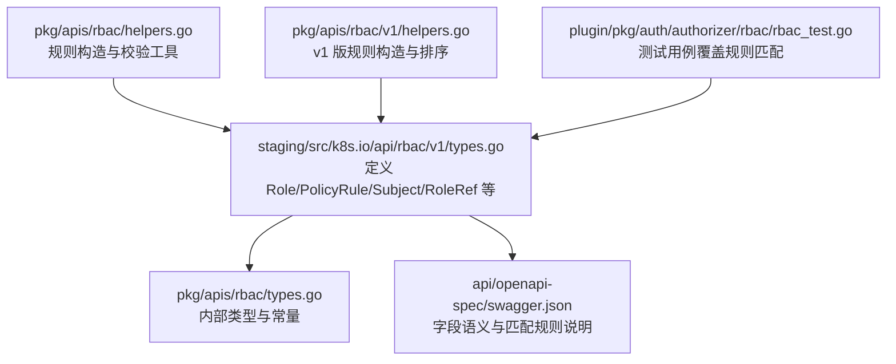
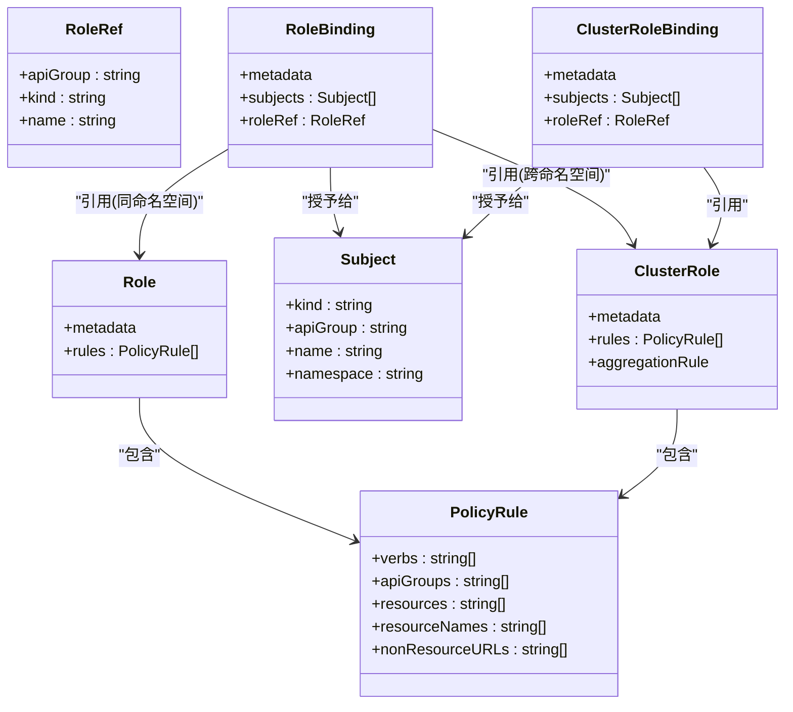
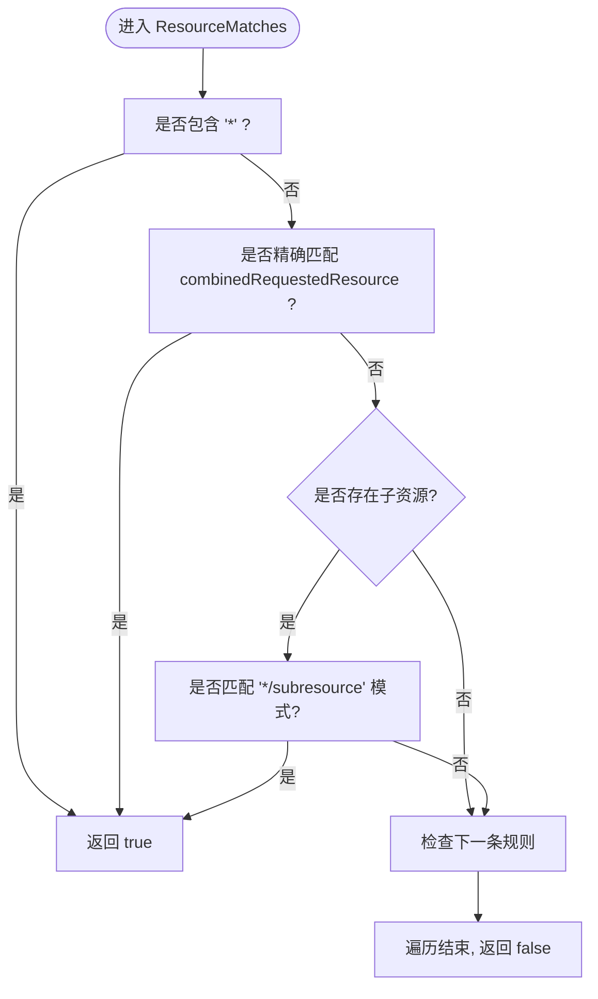
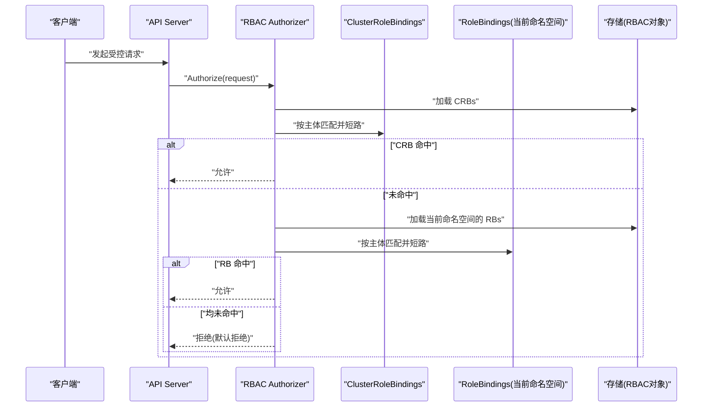
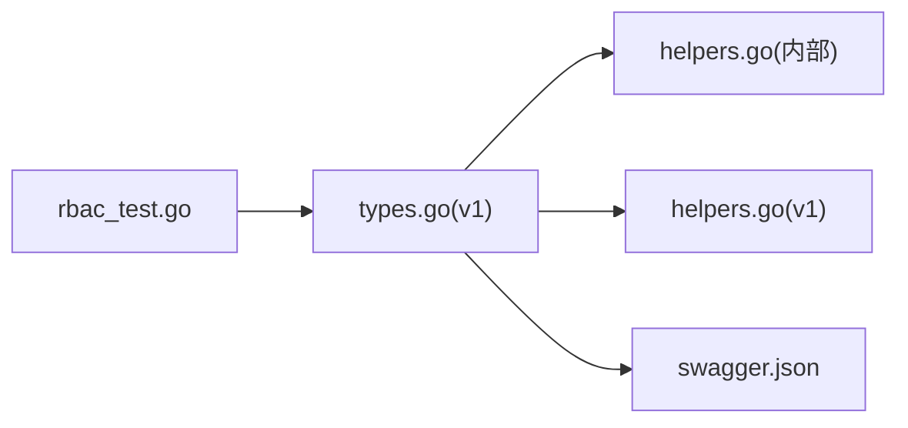

# Role API

<cite>
**本文引用的文件**
- [staging/src/k8s.io/api/rbac/v1/types.go](file://staging/src/k8s.io/api/rbac/v1/types.go)
- [pkg/apis/rbac/types.go](file://pkg/apis/rbac/types.go)
- [pkg/apis/rbac/helpers.go](file://pkg/apis/rbac/helpers.go)
- [pkg/apis/rbac/v1/helpers.go](file://pkg/apis/rbac/v1/helpers.go)
- [api/openapi-spec/swagger.json](file://api/openapi-spec/swagger.json)
- [plugin/pkg/auth/authorizer/rbac/rbac_test.go](file://plugin/pkg/auth/authorizer/rbac/rbac_test.go)
</cite>

## 目录
1. [简介](#简介)
2. [项目结构](#项目结构)
3. [核心组件](#核心组件)
4. [架构总览](#架构总览)
5. [详细组件分析](#详细组件分析)
6. [依赖关系分析](#依赖关系分析)
7. [性能与可扩展性](#性能与可扩展性)
8. [故障排查指南](#故障排查指南)
9. [结论](#结论)
10. [附录](#附录)

## 简介
本参考文档聚焦于 Kubernetes RBAC 中的 Role 资源，面向命名空间级别的权限控制。内容涵盖：
- Role、RoleBinding、ClusterRole、ClusterRoleBinding 的模型与语义
- PolicyRule 字段（verbs、apiGroups、resources、resourceNames、nonResourceURLs）的详细配置方法与约束
- 命名空间级授权评估流程与“默认拒绝”策略
- Role 与 ClusterRole 的区别及适用场景
- 最佳实践与常见错误排查

## 项目结构
RBAC 的核心类型定义位于 API 包中，并在 v1 版本提供稳定的序列化契约；辅助构建器与校验逻辑位于 pkg/apis/rbac 及其 v1 子包；OpenAPI 规范用于描述字段语义与匹配规则。

图表来源
- [staging/src/k8s.io/api/rbac/v1/types.go:120-132](file://staging/src/k8s.io/api/rbac/v1/types.go#L120-L132)
- [pkg/apis/rbac/types.go:94-102](file://pkg/apis/rbac/types.go#L94-L102)
- [api/openapi-spec/swagger.json:13802](file://api/openapi-spec/swagger.json#L13802)
- [pkg/apis/rbac/helpers.go:168-207](file://pkg/apis/rbac/helpers.go#L168-L207)
- [pkg/apis/rbac/v1/helpers.go:79-107](file://pkg/apis/rbac/v1/helpers.go#L79-L107)
- [plugin/pkg/auth/authorizer/rbac/rbac_test.go:35](file://plugin/pkg/auth/authorizer/rbac/rbac_test.go#L35)

章节来源
- [staging/src/k8s.io/api/rbac/v1/types.go:120-132](file://staging/src/k8s.io/api/rbac/v1/types.go#L120-L132)
- [pkg/apis/rbac/types.go:94-102](file://pkg/apis/rbac/types.go#L94-L102)
- [api/openapi-spec/swagger.json:13802](file://api/openapi-spec/swagger.json#L13802)
- [pkg/apis/rbac/helpers.go:168-207](file://pkg/apis/rbac/helpers.go#L168-L207)
- [pkg/apis/rbac/v1/helpers.go:79-107](file://pkg/apis/rbac/v1/helpers.go#L79-L107)
- [plugin/pkg/auth/authorizer/rbac/rbac_test.go:35](file://plugin/pkg/auth/authorizer/rbac/rbac_test.go#L35)

## 核心组件
- Role：命名空间内的一组 PolicyRule 集合，通过 RoleBinding 绑定到主体（用户、组、服务账号）。
- PolicyRule：描述对哪些 API 组、资源或资源名允许执行哪些动作；也可描述非资源 URL 访问。
- Subject：被授权的主体，支持 User、Group、ServiceAccount。
- RoleRef：指向被绑定的 Role 或 ClusterRole。
- RoleBinding：在特定命名空间中把 Role 或 ClusterRole 授予一组主体。
- ClusterRole：集群范围的规则集合，可被 RoleBinding 在任意命名空间引用。
- ClusterRoleBinding：将 ClusterRole 授予主体（通常用于集群范围）。

关键要点
- 授权评估顺序：先评估 ClusterRoleBindings（命中即短路），再评估当前命名空间的 RoleBindings（命中即短路），否则默认拒绝。
- 资源规则与非资源 URL 规则互斥：一条规则要么针对资源，要么针对非资源 URL，不能同时设置。

章节来源
- [staging/src/k8s.io/api/rbac/v1/types.go:23-46](file://staging/src/k8s.io/api/rbac/v1/types.go#L23-L46)
- [staging/src/k8s.io/api/rbac/v1/types.go:47-76](file://staging/src/k8s.io/api/rbac/v1/types.go#L47-L76)
- [staging/src/k8s.io/api/rbac/v1/types.go:120-132](file://staging/src/k8s.io/api/rbac/v1/types.go#L120-L132)
- [staging/src/k8s.io/api/rbac/v1/types.go:138-159](file://staging/src/k8s.io/api/rbac/v1/types.go#L138-L159)
- [staging/src/k8s.io/api/rbac/v1/types.go:194-212](file://staging/src/k8s.io/api/rbac/v1/types.go#L194-L212)
- [staging/src/k8s.io/api/rbac/v1/types.go:228-248](file://staging/src/k8s.io/api/rbac/v1/types.go#L228-L248)

## 架构总览
下图展示 Role/RoleBinding/ClusterRole/ClusterRoleBinding 之间的关系以及它们在授权评估中的作用。

图表来源
- [staging/src/k8s.io/api/rbac/v1/types.go:120-132](file://staging/src/k8s.io/api/rbac/v1/types.go#L120-L132)
- [staging/src/k8s.io/api/rbac/v1/types.go:138-159](file://staging/src/k8s.io/api/rbac/v1/types.go#L138-L159)
- [staging/src/k8s.io/api/rbac/v1/types.go:194-212](file://staging/src/k8s.io/api/rbac/v1/types.go#L194-L212)
- [staging/src/k8s.io/api/rbac/v1/types.go:228-248](file://staging/src/k8s.io/api/rbac/v1/types.go#L228-L248)

## 详细组件分析

### PolicyRule 字段详解与约束
- verbs：必需。允许的动词列表，支持通配符“*”。
- apiGroups：可选。目标 API 组，“”表示 core 组，“*”表示所有组。
- resources：可选。目标资源名，支持“*/subresource”形式匹配子资源。
- resourceNames：可选。白名单资源实例名；若设置，则某些动词（如 list/watch/create/deletecollection）不被允许。
- nonResourceURLs：可选。非资源 URL 路径片段；当设置时，不得同时设置 apiGroups/resources/resourceNames。

匹配规则（来自 OpenAPI 注释）
- 资源请求匹配需满足：至少一个 verb 匹配、至少一个 apiGroup 匹配、至少一个 resource 匹配，且根据是否指定命名空间与 clusterScope 进行判定。
- 非资源 URL 匹配需满足：至少一个 verb 匹配、至少一个 nonResourceURL 匹配。

验证与构造约束（来自 helpers）
- 必须设置 verbs。
- 非资源规则不得包含 apiGroups/resources/resourceNames。
- 资源规则必须包含 apiGroups。
- 若设置了 resourceNames，则不允许使用 list/watch/create/deletecollection 等动词。

章节来源
- [staging/src/k8s.io/api/rbac/v1/types.go:47-76](file://staging/src/k8s.io/api/rbac/v1/types.go#L47-L76)
- [api/openapi-spec/swagger.json:13802](file://api/openapi-spec/swagger.json#L13802)
- [pkg/apis/rbac/helpers.go:168-207](file://pkg/apis/rbac/helpers.go#L168-L207)
- [pkg/apis/rbac/v1/helpers.go:79-107](file://pkg/apis/rbac/v1/helpers.go#L79-L107)

#### 资源匹配算法流程图

图表来源
- [pkg/apis/rbac/helpers.go:27-54](file://pkg/apis/rbac/helpers.go#L27-L54)

### Role 与 ClusterRole 的区别与使用场景
- Role：命名空间级别，适合为某个团队或应用限定在该命名空间内的最小权限。
- ClusterRole：集群级别，适合跨命名空间复用的通用角色（例如只读角色、日志收集者等）。可通过 RoleBinding 在任意命名空间引用。
- 聚合能力：ClusterRole 支持 AggregationRule，通过标签选择器聚合其他 ClusterRole 的规则，便于组合式权限管理。

章节来源
- [staging/src/k8s.io/api/rbac/v1/types.go:120-132](file://staging/src/k8s.io/api/rbac/v1/types.go#L120-L132)
- [staging/src/k8s.io/api/rbac/v1/types.go:194-212](file://staging/src/k8s.io/api/rbac/v1/types.go#L194-L212)

### 授权评估流程（序列图）

图表来源
- [staging/src/k8s.io/api/rbac/v1/types.go:23-46](file://staging/src/k8s.io/api/rbac/v1/types.go#L23-L46)

### 规则构造与校验（Builder 模式）
代码侧常用 Builder 快速构造规则并进行基础校验，确保：
- verbs 必填
- 非资源规则与资源规则互斥
- 资源规则必须包含 apiGroups
- 若设置 resourceNames，则禁止部分动词

章节来源
- [pkg/apis/rbac/helpers.go:114-207](file://pkg/apis/rbac/helpers.go#L114-L207)
- [pkg/apis/rbac/v1/helpers.go:30-107](file://pkg/apis/rbac/v1/helpers.go#L30-L107)

## 依赖关系分析
- API 层：staging/src/k8s.io/api/rbac/v1/types.go 暴露稳定 API 契约。
- 实现层：pkg/apis/rbac/* 提供内部类型与工具函数（构造、校验、字符串化等）。
- 规范层：api/openapi-spec/swagger.json 描述字段语义与匹配条件。
- 测试层：plugin/pkg/auth/authorizer/rbac/rbac_test.go 覆盖规则匹配行为。

图表来源
- [staging/src/k8s.io/api/rbac/v1/types.go:120-132](file://staging/src/k8s.io/api/rbac/v1/types.go#L120-L132)
- [pkg/apis/rbac/helpers.go:114-207](file://pkg/apis/rbac/helpers.go#L114-L207)
- [pkg/apis/rbac/v1/helpers.go:30-107](file://pkg/apis/rbac/v1/helpers.go#L30-L107)
- [api/openapi-spec/swagger.json:13802](file://api/openapi-spec/swagger.json#L13802)
- [plugin/pkg/auth/authorizer/rbac/rbac_test.go:35](file://plugin/pkg/auth/authorizer/rbac/rbac_test.go#L35)

## 性能与可扩展性
- 规则匹配复杂度：主要取决于规则数量与请求属性匹配次数，通常为线性扫描。建议遵循最小权限原则，减少不必要的“*”和宽泛匹配。
- 资源名白名单：resourceNames 会引入额外匹配开销，仅在必要时使用。
- 聚合 ClusterRole：通过 AggregationRule 组合多个小角色，避免单一大角色的维护成本与匹配压力。

[本节为通用指导，不直接分析具体文件]

## 故障排查指南
常见问题与定位方法
- 缺少 verbs：构造规则时报错提示 verbs 必填。
  - 参考：[pkg/apis/rbac/helpers.go:168-172](file://pkg/apis/rbac/helpers.go#L168-L172)
- 非资源规则混用资源字段：报错提示非资源规则不得包含 apiGroups/resources/resourceNames。
  - 参考：[pkg/apis/rbac/helpers.go:174-178](file://pkg/apis/rbac/helpers.go#L174-L178)
- 资源规则缺少 apiGroups：报错提示资源规则必须包含 apiGroups。
  - 参考：[pkg/apis/rbac/helpers.go:182-185](file://pkg/apis/rbac/helpers.go#L182-L185)
- 资源名白名单与动词冲突：当设置 resourceNames 时，list/watch/create/deletecollection 等动词非法。
  - 参考：[pkg/apis/rbac/helpers.go:186-200](file://pkg/apis/rbac/helpers.go#L186-L200)
- 规则既含资源又含非资源 URL：报错提示二者不可共存。
  - 参考：[pkg/apis/rbac/v1/helpers.go:89-92](file://pkg/apis/rbac/v1/helpers.go#L89-L92)

排查步骤建议
- 确认请求主体是否正确（User/Group/ServiceAccount）且存在于 Binding 的 subjects。
- 确认 Role/ClusterRole 的 rules 是否覆盖请求的 verb、apiGroup、resource 或 nonResourceURL。
- 若使用 resourceNames，检查动词是否在黑名单中。
- 使用 kubectl describe Role/RoleBinding/ClusterRole/ClusterRoleBinding 核对配置。
- 结合日志与审计事件定位授权失败的具体原因。

章节来源
- [pkg/apis/rbac/helpers.go:168-207](file://pkg/apis/rbac/helpers.go#L168-L207)
- [pkg/apis/rbac/v1/helpers.go:79-107](file://pkg/apis/rbac/v1/helpers.go#L79-L107)

## 结论
Role 提供了细粒度的命名空间级权限控制能力。通过合理设计 PolicyRule 的 verbs、apiGroups、resources、resourceNames 与 nonResourceURLs，并结合 RoleBinding 与 ClusterRole 的组合，可实现安全、可维护的最小权限模型。遵循默认拒绝原则与最小权限最佳实践，配合清晰的规则结构与必要的资源名白名单，可在保障安全的同时提升可运维性。

[本节为总结性内容，不直接分析具体文件]

## 附录

### API 字段速查表（Role/PolicyRule 相关）
- Role
  - metadata：标准元数据
  - rules：PolicyRule 列表
- PolicyRule
  - verbs：必需，动词列表
  - apiGroups：可选，API 组列表
  - resources：可选，资源列表
  - resourceNames：可选，资源实例名白名单
  - nonResourceURLs：可选，非资源 URL 片段列表
- RoleBinding
  - subjects：主体列表（User/Group/ServiceAccount）
  - roleRef：指向 Role 或 ClusterRole
- ClusterRole
  - metadata：标准元数据
  - rules：PolicyRule 列表
  - aggregationRule：可选，聚合规则

章节来源
- [staging/src/k8s.io/api/rbac/v1/types.go:120-132](file://staging/src/k8s.io/api/rbac/v1/types.go#L120-L132)
- [staging/src/k8s.io/api/rbac/v1/types.go:47-76](file://staging/src/k8s.io/api/rbac/v1/types.go#L47-L76)
- [staging/src/k8s.io/api/rbac/v1/types.go:138-159](file://staging/src/k8s.io/api/rbac/v1/types.go#L138-L159)
- [staging/src/k8s.io/api/rbac/v1/types.go:194-212](file://staging/src/k8s.io/api/rbac/v1/types.go#L194-L212)