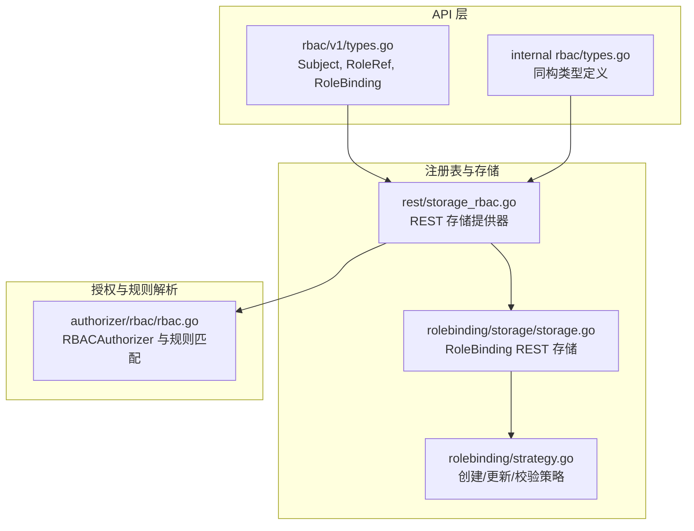
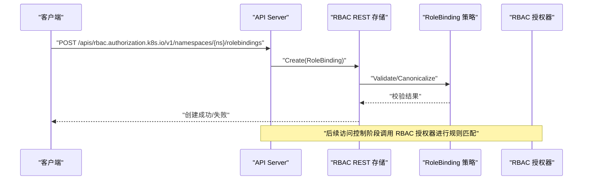
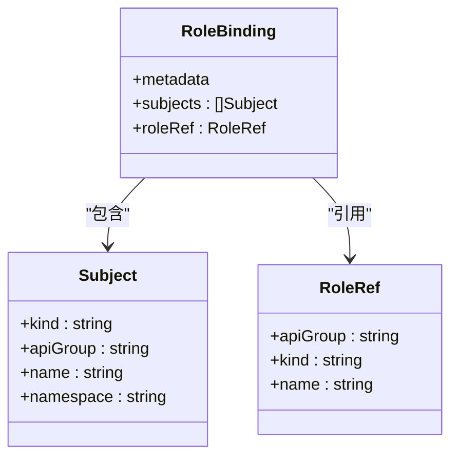
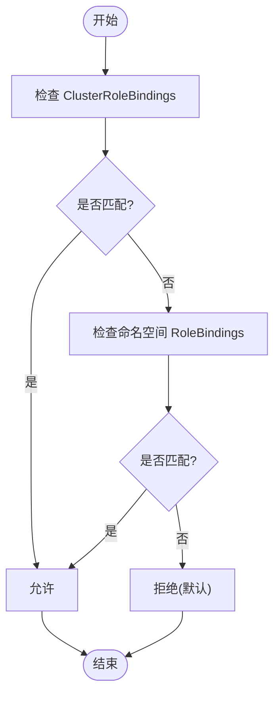
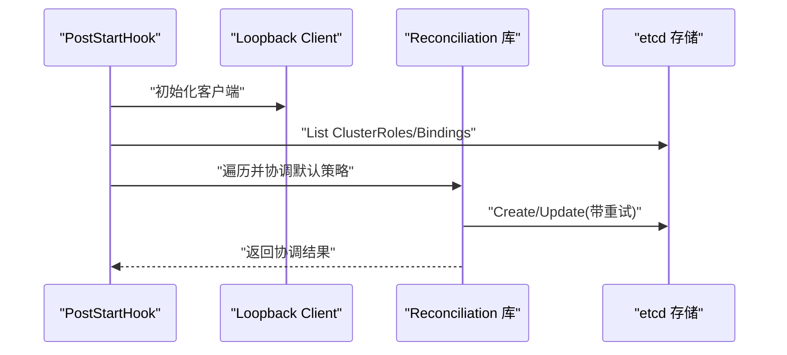
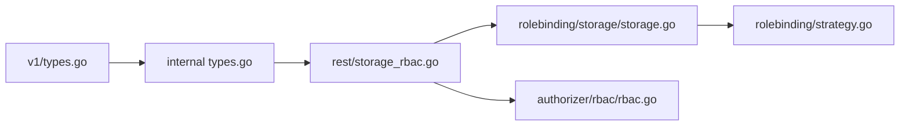

# RoleBinding API

<cite>
**本文引用的文件**   
- [pkg/apis/rbac/types.go](file://pkg/apis/rbac/types.go)
- [staging/src/k8s.io/api/rbac/v1/types.go](file://staging/src/k8s.io/api/rbac/v1/types.go)
- [plugin/pkg/auth/authorizer/rbac/rbac.go](file://plugin/pkg/auth/authorizer/rbac/rbac.go)
- [pkg/registry/rbac/rest/storage_rbac.go](file://pkg/registry/rbac/rest/storage_rbac.go)
- [pkg/registry/rbac/rolebinding/storage/storage.go](file://pkg/registry/rbac/rolebinding/storage/storage.go)
- [pkg/registry/rbac/rolebinding/strategy.go](file://pkg/registry/rbac/rolebinding/strategy.go)
</cite>

## 目录
1. [简介](#简介)
2. [项目结构](#项目结构)
3. [核心组件](#核心组件)
4. [架构总览](#架构总览)
5. [详细组件分析](#详细组件分析)
6. [依赖关系分析](#依赖关系分析)
7. [性能考量](#性能考量)
8. [故障排查指南](#故障排查指南)
9. [结论](#结论)
10. [附录](#附录)

## 简介
本参考文档聚焦于 Kubernetes RBAC 中的 RoleBinding 资源，面向 REST API 使用者与平台工程师，系统性说明：
- 命名空间级别的权限绑定机制
- Subject 对象配置（User、Group、ServiceAccount）
- RoleRef 引用方式（Role 或 ClusterRole）
- 完整的权限绑定示例与组合使用模式
- 权限评估顺序与冲突解决机制
- 动态权限管理的实现方案（基于内置的自动更新注解与控制器协调）

## 项目结构
围绕 RoleBinding 的关键代码分布在以下位置：
- API 类型定义：rbac v1 与内部版本
- 存储与策略：REST 存储、声明式校验与更新策略
- 授权器：RBAC 规则解析与匹配
- 启动钩子：集群初始化与默认策略协调

图表来源
- [staging/src/k8s.io/api/rbac/v1/types.go:138-159](file://staging/src/k8s.io/api/rbac/v1/types.go#L138-L159)
- [pkg/apis/rbac/types.go:106-120](file://pkg/apis/rbac/types.go#L106-L120)
- [pkg/registry/rbac/rest/storage_rbac.go:81-129](file://pkg/registry/rbac/rest/storage_rbac.go#L81-L129)
- [pkg/registry/rbac/rolebinding/storage/storage.go:30-55](file://pkg/registry/rbac/rolebinding/storage/storage.go#L30-L55)
- [pkg/registry/rbac/rolebinding/strategy.go:31-115](file://pkg/registry/rbac/rolebinding/strategy.go#L31-L115)
- [plugin/pkg/auth/authorizer/rbac/rbac.go:53-130](file://plugin/pkg/auth/authorizer/rbac/rbac.go#L53-L130)

章节来源
- [pkg/registry/rbac/rest/storage_rbac.go:81-129](file://pkg/registry/rbac/rest/storage_rbac.go#L81-L129)
- [pkg/registry/rbac/rolebinding/storage/storage.go:30-55](file://pkg/registry/rbac/rolebinding/storage/storage.go#L30-L55)
- [pkg/registry/rbac/rolebinding/strategy.go:31-115](file://pkg/registry/rbac/rolebinding/strategy.go#L31-L115)
- [staging/src/k8s.io/api/rbac/v1/types.go:138-159](file://staging/src/k8s.io/api/rbac/v1/types.go#L138-L159)
- [pkg/apis/rbac/types.go:106-120](file://pkg/apis/rbac/types.go#L106-L120)

## 核心组件
- RoleBinding 资源
  - 作用域：命名空间级别
  - 功能：将一组主体（Subjects）与一个角色（Role 或 ClusterRole）在指定命名空间中建立绑定关系
  - 关键字段：
    - subjects：主体列表，支持 User、Group、ServiceAccount
    - roleRef：角色引用，指向当前命名空间的 Role 或全局的 ClusterRole
- Subject 对象
  - kind：User、Group、ServiceAccount
  - apiGroup：ServiceAccount 默认为空；User/Group 默认为 rbac.authorization.k8s.io
  - name：主体名称
  - namespace：仅当 kind 为 ServiceAccount 时有效
- RoleRef 对象
  - kind：Role 或 ClusterRole
  - apiGroup：rbac.authorization.k8s.io
  - name：被引用的角色名称
- 权限规则 PolicyRule
  - verbs、apiGroups、resources、resourceNames、nonResourceURLs
  - 支持通配符“*”匹配所有
- 授权评估顺序
  - 先评估 ClusterRoleBindings（全局），命中即允许
  - 再评估目标命名空间内的 RoleBindings，命中即允许
  - 否则默认拒绝

章节来源
- [staging/src/k8s.io/api/rbac/v1/types.go:78-114](file://staging/src/k8s.io/api/rbac/v1/types.go#L78-L114)
- [staging/src/k8s.io/api/rbac/v1/types.go:138-159](file://staging/src/k8s.io/api/rbac/v1/types.go#L138-L159)
- [pkg/apis/rbac/types.go:43-90](file://pkg/apis/rbac/types.go#L43-L90)
- [pkg/apis/rbac/types.go:106-120](file://pkg/apis/rbac/types.go#L106-L120)
- [pkg/apis/rbac/types.go:23-26](file://pkg/apis/rbac/types.go#L23-L26)

## 架构总览
RoleBinding 的 REST API 请求路径与处理流程如下：
- 客户端通过 /apis/rbac.authorization.k8s.io/v1/namespaces/{namespace}/rolebindings 进行 CRUD
- API Server 路由到 RBAC 组的 REST 存储提供器
- RoleBinding 的 REST 存储由 genericregistry.Store 驱动，结合 Strategy 完成校验与规范化
- 授权器 RBACAuthorizer 在访问控制阶段根据 RuleResolver 收集并匹配规则

图表来源
- [pkg/registry/rbac/rest/storage_rbac.go:81-129](file://pkg/registry/rbac/rest/storage_rbac.go#L81-L129)
- [pkg/registry/rbac/rolebinding/storage/storage.go:30-55](file://pkg/registry/rbac/rolebinding/storage/storage.go#L30-L55)
- [pkg/registry/rbac/rolebinding/strategy.go:71-100](file://pkg/registry/rbac/rolebinding/strategy.go#L71-L100)
- [plugin/pkg/auth/authorizer/rbac/rbac.go:78-130](file://plugin/pkg/auth/authorizer/rbac/rbac.go#L78-L130)

## 详细组件分析

### RoleBinding 数据模型与字段约束
- RoleBinding
  - metadata：标准元数据
  - subjects：[]Subject
  - roleRef：RoleRef（不可变）
- Subject
  - kind：User | Group | ServiceAccount
  - apiGroup：ServiceAccount 为空；User/Group 为 rbac.authorization.k8s.io
  - name：主体名
  - namespace：仅 ServiceAccount 有效
- RoleRef
  - kind：Role | ClusterRole
  - apiGroup：rbac.authorization.k8s.io
  - name：角色名
- 校验与不变性
  - RoleRef 不可变，更新时将触发短路与错误
  - 声明式校验与手写校验保持一致的错误行为

图表来源
- [staging/src/k8s.io/api/rbac/v1/types.go:138-159](file://staging/src/k8s.io/api/rbac/v1/types.go#L138-L159)
- [staging/src/k8s.io/api/rbac/v1/types.go:78-114](file://staging/src/k8s.io/api/rbac/v1/types.go#L78-L114)
- [pkg/apis/rbac/types.go:106-120](file://pkg/apis/rbac/types.go#L106-L120)

章节来源
- [staging/src/k8s.io/api/rbac/v1/types.go:138-159](file://staging/src/k8s.io/api/rbac/v1/types.go#L138-L159)
- [pkg/registry/rbac/rolebinding/strategy.go:94-100](file://pkg/registry/rbac/rolebinding/strategy.go#L94-L100)

### REST API 端点与操作
- 资源路径
  - 集合：/apis/rbac.authorization.k8s.io/v1/namespaces/{namespace}/rolebindings
  - 单个：/apis/rbac.authorization.k8s.io/v1/namespaces/{namespace}/rolebindings/{name}
- 支持的 HTTP 方法
  - GET：获取单个 RoleBinding
  - LIST：列出命名空间内所有 RoleBinding
  - CREATE：创建 RoleBinding
  - UPDATE：更新 RoleBinding（注意 roleRef 不可变）
  - DELETE：删除 RoleBinding
  - WATCH：监听 RoleBinding 变更
- 状态码
  - 200/201：成功
  - 400：参数校验失败（如 roleRef 不可变、subject 无效）
  - 403：无权限
  - 404：未找到
  - 409：冲突（并发更新）
  - 500：服务器错误

章节来源
- [pkg/registry/rbac/rolebinding/storage/storage.go:30-55](file://pkg/registry/rbac/rolebinding/storage/storage.go#L30-L55)
- [pkg/registry/rbac/rolebinding/strategy.go:71-100](file://pkg/registry/rbac/rolebinding/strategy.go#L71-L100)

### 权限评估顺序与冲突解决
- 评估顺序
  - 先评估 ClusterRoleBindings（全局范围），命中即允许
  - 再评估目标命名空间内的 RoleBindings，命中即允许
  - 否则默认拒绝
- 冲突解决
  - 多个匹配规则采用“首次命中即允许”的短路逻辑
  - 若存在解析错误，授权器会聚合错误信息并在日志中记录拒绝原因

图表来源
- [pkg/apis/rbac/types.go:23-26](file://pkg/apis/rbac/types.go#L23-L26)
- [plugin/pkg/auth/authorizer/rbac/rbac.go:78-130](file://plugin/pkg/auth/authorizer/rbac/rbac.go#L78-L130)

章节来源
- [pkg/apis/rbac/types.go:23-26](file://pkg/apis/rbac/types.go#L23-L26)
- [plugin/pkg/auth/authorizer/rbac/rbac.go:78-130](file://plugin/pkg/auth/authorizer/rbac/rbac.go#L78-L130)

### 动态权限管理方案
- 自动更新注解
  - 注解键：rbac.authorization.kubernetes.io/autoupdate
  - 设置为 "false" 可阻止控制器对受保护对象的自动重平衡
- 启动后钩子与协调
  - API Server 启动后执行 PostStartHook，确保默认的 ClusterRoles、ClusterRoleBindings、Namespaced Roles 与 RoleBindings 存在或一致
  - 使用 reconciliation 库进行幂等创建/更新，遇到冲突或服务不可用时重试
- 适用场景
  - 系统组件所需的初始权限保障
  - 升级过程中的聚合角色迁移与拆分绑定复制

图表来源
- [pkg/registry/rbac/rest/storage_rbac.go:131-181](file://pkg/registry/rbac/rest/storage_rbac.go#L131-L181)
- [pkg/registry/rbac/rest/storage_rbac.go:183-340](file://pkg/registry/rbac/rest/storage_rbac.go#L183-L340)
- [pkg/apis/rbac/types.go:39-41](file://pkg/apis/rbac/types.go#L39-L41)

章节来源
- [pkg/registry/rbac/rest/storage_rbac.go:131-181](file://pkg/registry/rbac/rest/storage_rbac.go#L131-L181)
- [pkg/registry/rbac/rest/storage_rbac.go:183-340](file://pkg/registry/rbac/rest/storage_rbac.go#L183-L340)
- [pkg/apis/rbac/types.go:39-41](file://pkg/apis/rbac/types.go#L39-L41)

### 完整示例与组合使用模式
- 基础示例
  - 在命名空间内为用户授予对 Pod 的只读权限
  - 在命名空间内为服务账户授予对 ConfigMap 的读写权限
- 组合模式
  - 将多个用户/组/服务账户放入同一 RoleBinding 的 subjects 列表
  - 通过 RoleRef 引用 ClusterRole，复用跨命名空间的通用权限集
  - 在同一命名空间内叠加多个 RoleBinding，形成权限并集
- 注意事项
  - ServiceAccount 的 subject.namespace 必须填写
  - User/Group 的 subject.namespace 不应填写
  - RoleRef 不可变，需通过删除重建来更改

章节来源
- [staging/src/k8s.io/api/rbac/v1/types.go:78-114](file://staging/src/k8s.io/api/rbac/v1/types.go#L78-L114)
- [staging/src/k8s.io/api/rbac/v1/types.go:138-159](file://staging/src/k8s.io/api/rbac/v1/types.go#L138-L159)
- [pkg/registry/rbac/rolebinding/strategy.go:94-100](file://pkg/registry/rbac/rolebinding/strategy.go#L94-L100)

## 依赖关系分析
- API 类型与存储
  - v1/types.go 与 internal types.go 保持同构，便于序列化与内部处理
- 存储与策略
  - REST 存储提供器注册 rbac 组资源
  - RoleBinding 的 REST 存储使用 genericregistry.Store 与自定义 Strategy
- 授权器
  - RBACAuthorizer 基于 RequestToRuleMapper 收集并匹配规则
  - RulesFor/VisitRulesFor 用于枚举与短路匹配

图表来源
- [staging/src/k8s.io/api/rbac/v1/types.go:138-159](file://staging/src/k8s.io/api/rbac/v1/types.go#L138-L159)
- [pkg/apis/rbac/types.go:106-120](file://pkg/apis/rbac/types.go#L106-L120)
- [pkg/registry/rbac/rest/storage_rbac.go:81-129](file://pkg/registry/rbac/rest/storage_rbac.go#L81-L129)
- [pkg/registry/rbac/rolebinding/storage/storage.go:30-55](file://pkg/registry/rbac/rolebinding/storage/storage.go#L30-L55)
- [pkg/registry/rbac/rolebinding/strategy.go:31-115](file://pkg/registry/rbac/rolebinding/strategy.go#L31-L115)
- [plugin/pkg/auth/authorizer/rbac/rbac.go:53-130](file://plugin/pkg/auth/authorizer/rbac/rbac.go#L53-L130)

章节来源
- [pkg/registry/rbac/rest/storage_rbac.go:81-129](file://pkg/registry/rbac/rest/storage_rbac.go#L81-L129)
- [plugin/pkg/auth/authorizer/rbac/rbac.go:53-130](file://plugin/pkg/auth/authorizer/rbac/rbac.go#L53-L130)

## 性能考量
- 规则匹配短路
  - 一旦匹配到允许的规则即短路返回，减少不必要的遍历
- 日志与诊断
  - 拒绝时会构建详细的拒绝原因日志，有助于定位问题
- 存储层优化
  - 使用 Listers 缓存 RBAC 资源，降低 etcd 读取压力
- 启动协调重试
  - 对冲突与服务不可用进行指数退避重试，提高稳定性

章节来源
- [plugin/pkg/auth/authorizer/rbac/rbac.go:78-130](file://plugin/pkg/auth/authorizer/rbac/rbac.go#L78-L130)
- [pkg/registry/rbac/rest/storage_rbac.go:154-160](file://pkg/registry/rbac/rest/storage_rbac.go#L154-L160)

## 故障排查指南
- 常见错误
  - roleRef 不可变：更新时直接返回错误，需删除重建
  - subject.namespace 误填：User/Group 不应设置 namespace
  - 权限不足：确认是否存在匹配的 ClusterRoleBinding 或 RoleBinding
- 诊断步骤
  - 查看 API Server 日志中的 RBAC 拒绝信息
  - 检查 RoleBinding 的 subjects 与 roleRef 是否正确
  - 验证命名空间与资源路径是否匹配
- 恢复建议
  - 修正 subjects 与 roleRef 配置
  - 对于受保护对象，移除 autoupdate=false 或调整控制器权限

章节来源
- [pkg/registry/rbac/rolebinding/strategy.go:94-100](file://pkg/registry/rbac/rolebinding/strategy.go#L94-L100)
- [plugin/pkg/auth/authorizer/rbac/rbac.go:86-130](file://plugin/pkg/auth/authorizer/rbac/rbac.go#L86-L130)

## 结论
RoleBinding 提供了灵活的命名空间级权限绑定能力，配合 Subject 与 RoleRef 的组合可实现细粒度的访问控制。通过明确的评估顺序与短路匹配机制，系统在保证安全性的同时具备良好的性能表现。借助启动后钩子与自动更新注解，平台可在升级与运维过程中维持稳定的权限基线。

## 附录
- 术语
  - 主体（Subject）：被赋予权限的用户、组或服务账户
  - 角色（Role/ClusterRole）：权限规则的集合
  - 绑定（RoleBinding/ClusterRoleBinding）：将主体与角色关联
- 最佳实践
  - 最小权限原则：仅授予必要的动词与资源
  - 复用 ClusterRole：通过 RoleRef 引用避免重复定义
  - 明确命名空间：ServiceAccount 的 subject.namespace 必填
  - 谨慎修改 roleRef：因其不可变，应通过删除重建