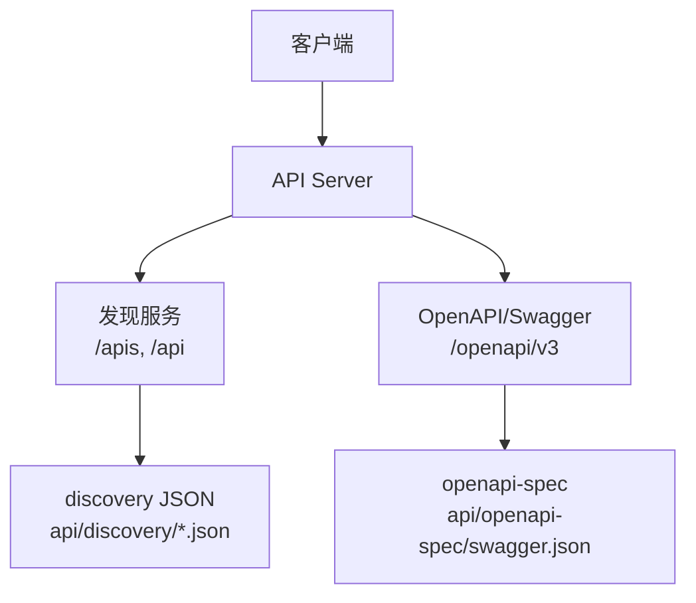
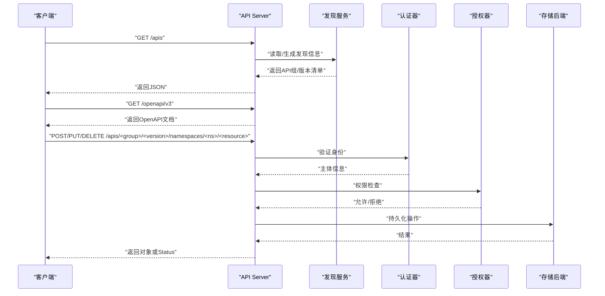
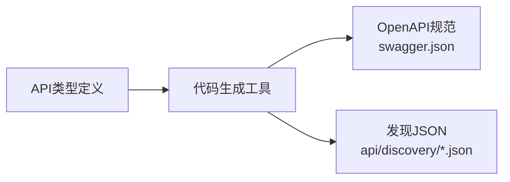

# REST API参考

<cite>
**本文引用的文件**   
- [README.md](file://README.md)
- [swagger.json](file://api/openapi-spec/swagger.json)
- [apis.json](file://api/discovery/apis.json)
- [api__v1.json](file://api/discovery/api__v1.json)
- [update-openapi-spec.sh](file://hack/update-openapi-spec.sh)
- [verify-openapi-spec.sh](file://hack/verify-openapi-spec.sh)
</cite>

## 目录
1. [简介](#简介)
2. [项目结构](#项目结构)
3. [核心组件](#核心组件)
4. [架构总览](#架构总览)
5. [详细组件分析](#详细组件分析)
6. [依赖关系分析](#依赖关系分析)
7. [性能与限流](#性能与限流)
8. [故障排查指南](#故障排查指南)
9. [结论](#结论)
10. [附录](#附录)

## 简介
本参考文档面向Kubernetes REST API使用者与维护者，聚焦以下目标：
- 说明API发现机制、版本化与资源模型的组织方式
- 解释认证授权、请求头与错误处理策略
- 提供OpenAPI规范的生成与维护流程
- 给出curl示例与Python/Go客户端使用要点
- 总结限流、缓存与性能优化建议
- 提供调试与排障方法

Kubernetes通过RESTful接口暴露集群能力，所有API对象遵循统一的元数据约定，并以组/版本/资源的层次组织。API发现端点用于动态获取可用API组与版本，OpenAPI规范则描述完整的类型定义与字段约束。

章节来源
- [README.md:1-101](file://README.md#L1-L101)

## 项目结构
仓库中与REST API相关的关键位置：
- api/discovery：包含各API组与版本的发现JSON（如 apis.json、api__v1.json）
- api/openapi-spec：包含聚合的OpenAPI/Swagger规范（swagger.json）
- hack：包含更新与校验OpenAPI规范的脚本

图表来源
- [apis.json](file://api/discovery/apis.json)
- [api__v1.json](file://api/discovery/api__v1.json)
- [swagger.json](file://api/openapi-spec/swagger.json)

章节来源
- [apis.json](file://api/discovery/apis.json)
- [api__v1.json](file://api/discovery/api__v1.json)
- [swagger.json](file://api/openapi-spec/swagger.json)

## 核心组件
- API发现
  - /apis：返回已注册的API组列表
  - /apis/<group>/<version>：返回某组某版本的资源清单
  - /api/v1：返回核心组v1的资源清单
- OpenAPI/Swagger
  - /openapi/v3：返回当前API服务器的OpenAPI v3文档
  - api/openapi-spec/swagger.json：预生成的聚合OpenAPI规范
- 资源CRUD
  - 标准HTTP方法与路径模式由API Server统一实现，具体资源见对应发现JSON与OpenAPI定义
- 认证与授权
  - 支持多种认证器（如Token、证书、OIDC等），并通过RBAC/ABAC等进行授权决策
- 错误处理
  - 统一返回Status对象，包含reason、code、message等字段

章节来源
- [apis.json](file://api/discovery/apis.json)
- [api__v1.json](file://api/discovery/api__v1.json)
- [swagger.json](file://api/openapi-spec/swagger.json)

## 架构总览
下图展示了从客户端到API Server的核心交互路径，包括发现、鉴权、路由、存储与响应。

图表来源
- [apis.json](file://api/discovery/apis.json)
- [api__v1.json](file://api/discovery/api__v1.json)
- [swagger.json](file://api/openapi-spec/swagger.json)

## 详细组件分析

### API发现与版本管理
- 发现端点
  - GET /apis：列出所有API组
  - GET /apis/<group>/<version>：列出该组下资源
  - GET /api/v1：列出核心组v1资源
- 版本协商
  - 客户端可通过Accept头指定媒体类型，服务器按优先级返回
- 资源路径模式
  - 命名空间资源：/apis/<group>/<version>/namespaces/<namespace>/<resource>
  - 集群级资源：/apis/<group>/<version>/<resource>
- 查询参数
  - labelSelector、fieldSelector、watch、limit、continue等

章节来源
- [apis.json](file://api/discovery/apis.json)
- [api__v1.json](file://api/discovery/api__v1.json)

### OpenAPI规范与类型定义
- 规范位置
  - 运行时：/openapi/v3
  - 源码中预生成：api/openapi-spec/swagger.json
- 用途
  - 自动生成客户端代码、IDE提示、文档站点
- 维护
  - 通过脚本更新与校验，确保与代码一致

章节来源
- [swagger.json](file://api/openapi-spec/swagger.json)

### 认证与授权
- 认证
  - 支持多种认证器，常见为Bearer Token、X.509证书、OIDC
- 授权
  - RBAC为主，结合SubjectAccessReview进行模拟与测试
- 审计
  - 可配置审计策略，记录关键操作

章节来源
- [swagger.json](file://api/openapi-spec/swagger.json)

### 错误处理与状态码
- 统一返回Status对象，包含：
  - metadata、status、message、reason、code
- 常见原因
  - NotFound、Unauthorized、Forbidden、Invalid、Timeout、TooManyRequests等

章节来源
- [swagger.json](file://api/openapi-spec/swagger.json)

### 分页与列表
- 分页参数
  - limit：每页数量
  - continue：下一页游标
- 列表响应
  - items数组 + metadata.continue

章节来源
- [api__v1.json](file://api/discovery/api__v1.json)

### 过滤与选择器
- labelSelector：基于标签表达式筛选
- fieldSelector：基于字段值筛选
- watch：长连接事件流

章节来源
- [api__v1.json](file://api/discovery/api__v1.json)

### 典型资源CRUD示例（以Pod为例）
- 创建
  - POST /api/v1/namespaces/<namespace>/pods
- 读取
  - GET /api/v1/namespaces/<namespace>/pods/<name>
- 更新
  - PUT/PATCH /api/v1/namespaces/<namespace>/pods/<name>
- 删除
  - DELETE /api/v1/namespaces/<namespace>/pods/<name>
- 列表
  - GET /api/v1/namespaces/<namespace>/pods?labelSelector=...&fieldSelector=...&limit=...&continue=...

章节来源
- [api__v1.json](file://api/discovery/api__v1.json)

### curl命令示例
- 获取API组列表
  - curl -k https://<apiserver>/apis
- 获取核心v1资源清单
  - curl -k https://<apiserver>/api/v1
- 列出命名空间中的Pod
  - curl -k --header "Authorization: Bearer <token>" https://<apiserver>/api/v1/namespaces/default/pods
- 获取OpenAPI文档
  - curl -k https://<apiserver>/openapi/v3

注意：请将<apiserver>替换为实际地址，<token>替换为有效令牌；生产环境建议使用HTTPS与证书校验。

### Python客户端片段
- 使用官方client库加载kubeconfig并调用API
- 示例要点
  - 初始化Configuration与ApiClient
  - 使用CoreV1Api访问核心资源
  - 设置超时与重试策略

章节来源
- [swagger.json](file://api/openapi-spec/swagger.json)

### Go客户端片段
- 使用client-go加载kubeconfig并调用API
- 示例要点
  - 构建rest.Config
  - 创建kubernetes.Clientset
  - 使用CoreV1Interface访问资源

章节来源
- [swagger.json](file://api/openapi-spec/swagger.json)

## 依赖关系分析
- 发现JSON与OpenAPI的关系
  - discovery JSON用于快速枚举API组/版本/资源
  - OpenAPI提供完整类型定义与字段约束
- 生成链路
  - 源码类型定义 -> 生成OpenAPI -> 产出swagger.json与discovery JSON

图表来源
- [swagger.json](file://api/openapi-spec/swagger.json)
- [apis.json](file://api/discovery/apis.json)
- [api__v1.json](file://api/discovery/api__v1.json)

章节来源
- [swagger.json](file://api/openapi-spec/swagger.json)
- [apis.json](file://api/discovery/apis.json)
- [api__v1.json](file://api/discovery/api__v1.json)

## 性能与限流
- 限流
  - API Server支持请求限流，防止过载
- 缓存
  - 对读多写少场景可使用本地缓存或边缘缓存
- 批量与并发
  - 合理使用批量接口与并发控制
- 监控与指标
  - 关注API Server延迟、错误率、配额使用情况

[本节为通用指导，不直接分析具体文件]

## 故障排查指南
- 常见问题
  - 认证失败：检查令牌/证书有效性
  - 权限不足：确认RBAC规则与SubjectAccessReview
  - 资源不存在：核对名称、命名空间与版本
  - 超时/限流：调整超时与重试策略，观察限流指标
- 诊断步骤
  - 使用kubectl describe/logs查看资源与日志
  - 启用审计日志定位问题
  - 使用/kube-system命名空间下的系统资源辅助排查

[本节为通用指导，不直接分析具体文件]

## 结论
Kubernetes REST API通过发现与OpenAPI提供一致的接口契约。理解发现机制、认证授权、错误处理与分页过滤是高效使用API的基础。配合合适的客户端与监控手段，可以稳定地集成与管理集群资源。

[本节为总结性内容，不直接分析具体文件]

## 附录

### OpenAPI规范生成与维护流程
- 更新规范
  - 运行更新脚本生成最新OpenAPI与发现JSON
- 校验规范
  - 运行校验脚本确保一致性
- 发布与分发
  - 将生成的文件纳入制品或随发行版发布

章节来源
- [update-openapi-spec.sh](file://hack/update-openapi-spec.sh)
- [verify-openapi-spec.sh](file://hack/verify-openapi-spec.sh)