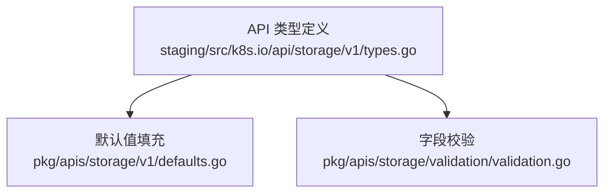
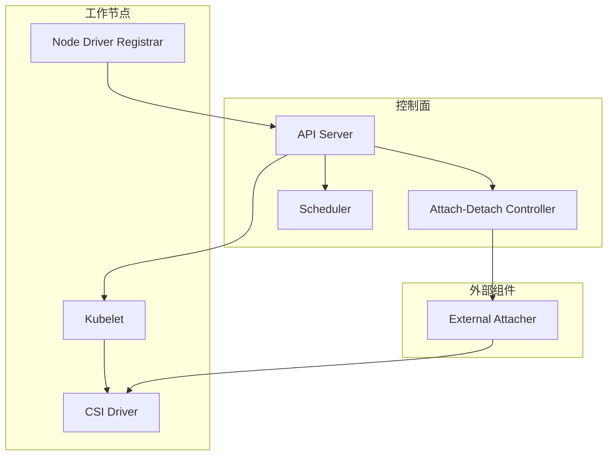
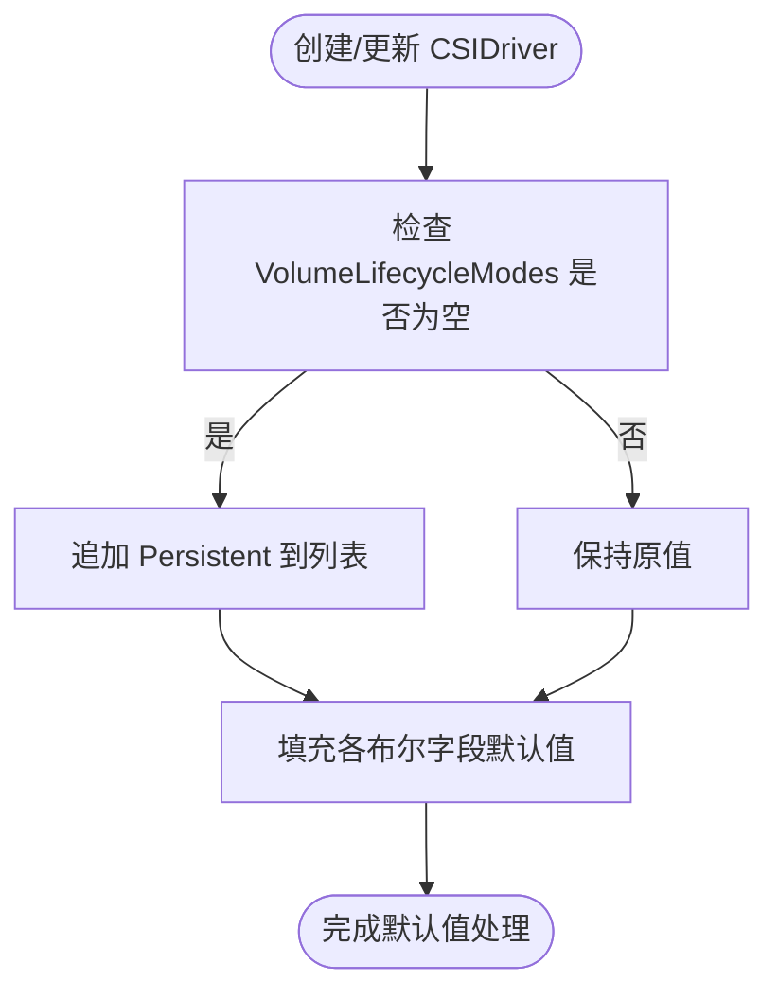
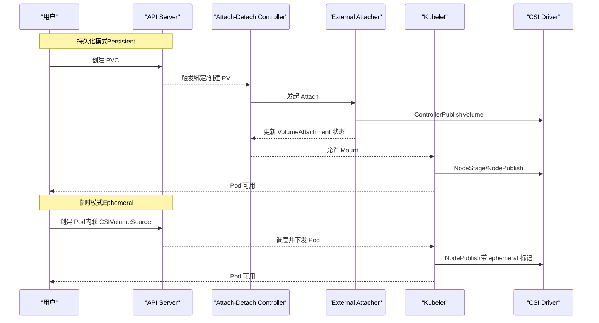
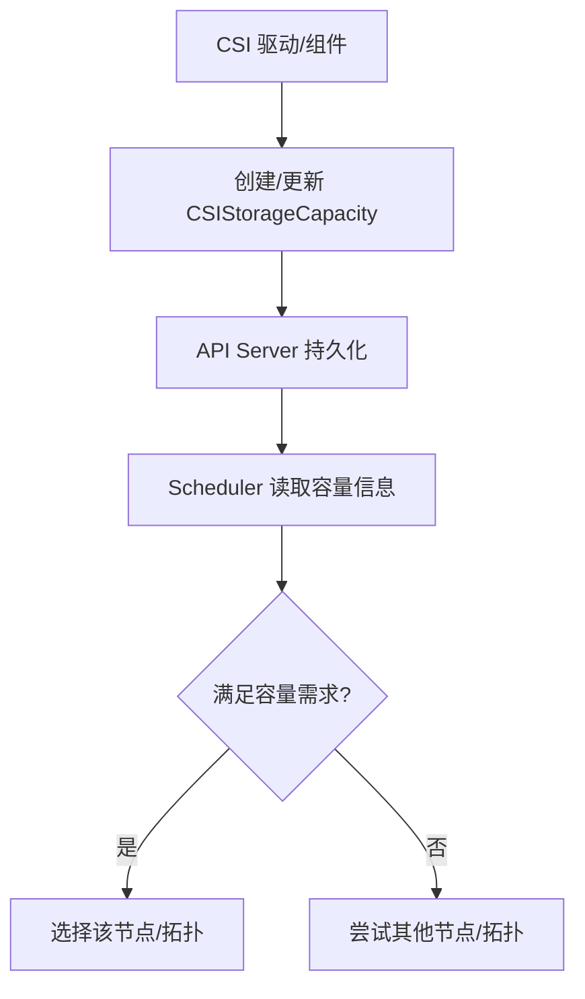
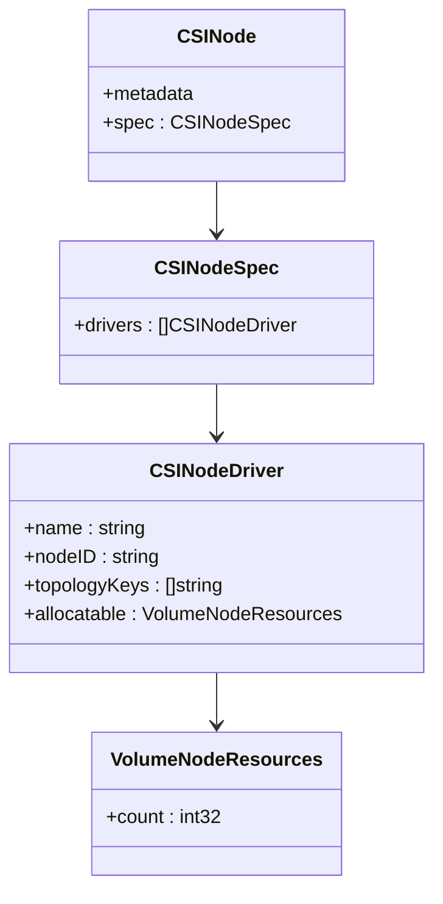
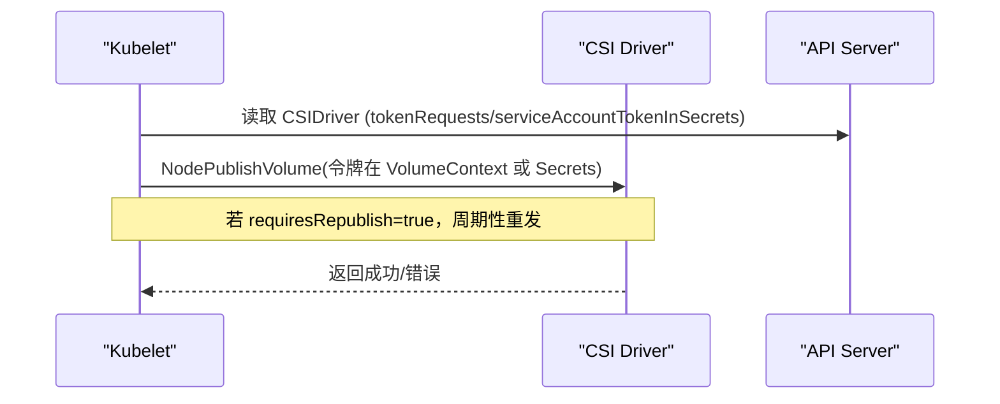
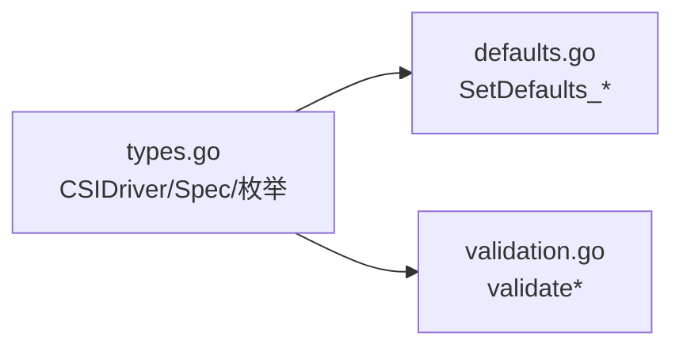

# CSIDriver API

<cite>
**本文引用的文件**   
- [staging/src/k8s.io/api/storage/v1/types.go](file://staging/src/k8s.io/api/storage/v1/types.go)
- [pkg/apis/storage/v1/defaults.go](file://pkg/apis/storage/v1/defaults.go)
- [pkg/apis/storage/validation/validation.go](file://pkg/apis/storage/validation/validation.go)
</cite>

## 目录
1. [简介](#简介)
2. [项目结构](#项目结构)
3. [核心组件](#核心组件)
4. [架构总览](#架构总览)
5. [详细组件分析](#详细组件分析)
6. [依赖关系分析](#依赖关系分析)
7. [性能与容量规划](#性能与容量规划)
8. [故障排查指南](#故障排查指南)
9. [结论](#结论)
10. [附录](#附录)

## 简介
本文件面向CSI驱动开发者与集群管理员，系统化说明Kubernetes中CSIDriver资源的API规格、生命周期模式、存储容量报告（StorageCapacity）、节点分配能力（NodeAllocatable）、服务账户令牌传递安全机制、SELinux挂载支持，以及监控指标与调试方法。文档以源码为依据，提供可追溯的章节来源与图示来源，帮助读者快速理解并正确集成CSI驱动。

## 项目结构
与CSIDriver相关的API定义位于storage v1版本类型文件中；默认值填充逻辑位于v1 defaults包；校验逻辑位于validation包。下图给出与本主题直接相关的代码位置概览：

图表来源 
- [staging/src/k8s.io/api/storage/v1/types.go:260-509](file://staging/src/k8s.io/api/storage/v1/types.go#L260-L509)
- [pkg/apis/storage/v1/defaults.go:43-76](file://pkg/apis/storage/v1/defaults.go#L43-L76)
- [pkg/apis/storage/validation/validation.go:417-543](file://pkg/apis/storage/validation/validation.go#L417-L543)

章节来源
- [staging/src/k8s.io/api/storage/v1/types.go:260-509](file://staging/src/k8s.io/api/storage/v1/types.go#L260-L509)
- [pkg/apis/storage/v1/defaults.go:43-76](file://pkg/apis/storage/v1/defaults.go#L43-L76)
- [pkg/apis/storage/validation/validation.go:417-543](file://pkg/apis/storage/validation/validation.go#L417-L543)

## 核心组件
本节聚焦CSIDriver资源及其关键规格项，包括AttachRequired、PodInfoOnMount、VolumeLifecycleModes、StorageCapacity、FSGroupPolicy、TokenRequests、RequiresRepublish、SELinuxMount、NodeAllocatableUpdatePeriodSeconds、ServiceAccountTokenInSecrets、PreventPodSchedulingIfMissing等。

- CSIDriver对象
  - 非命名空间资源，metadata.Name必须与CSI GetPluginName()返回值一致。
  - 由spec描述驱动行为与能力。

- CSIDriverSpec关键字段
  - attachRequired：是否要求外部附加器执行Attach操作（对应ControllerPublishVolume）。
  - podInfoOnMount：是否在NodePublishVolume时传入Pod信息（如名称、命名空间、UID、是否为临时卷）。
  - volumeLifecycleModes：声明支持的卷生命周期模式（Persistent/Ephemeral），未设置时默认为Persistent。
  - storageCapacity：是否启用基于CSIStorageCapacity的容量感知调度。
  - fsGroupPolicy：是否允许在挂载前修改卷所有权和权限（File/ReadWriteOnceWithFSType/None）。
  - tokenRequests：需要哪些服务账户令牌（audience、过期时间），kubelet会在NodePublishVolume时注入。
  - requiresRepublish：是否需要周期性触发NodePublishVolume以刷新内容或令牌。
  - seLinuxMount：是否支持-o context SELinux上下文挂载选项。
  - nodeAllocatableUpdatePeriodSeconds：周期性更新CSINode.allocatable.count的时间间隔（需特性门控）。
  - serviceAccountTokenInSecrets：将令牌通过Secrets字段而非VolumeContext传递（需特性门控）。
  - preventPodSchedulingIfMissing：当节点缺少CSI驱动时阻止Pod调度（需特性门控）。

- 相关枚举与常量
  - VolumeLifecycleMode：Persistent、Ephemeral。
  - FSGroupPolicy：ReadWriteOnceWithFSType、File、None。
  - TokenRequest：包含audience与可选expirationSeconds。

- 默认值策略
  - AttachRequired默认true。
  - PodInfoOnMount默认false。
  - StorageCapacity默认false。
  - FSGroupPolicy默认ReadWriteOnceWithFSType。
  - VolumeLifecycleModes为空时默认追加Persistent。
  - RequiresRepublish默认false。
  - SELinuxMount在开启相应特性门控时默认false。
  - PreventPodSchedulingIfMissing在开启相应特性门控时默认false。

章节来源
- [staging/src/k8s.io/api/storage/v1/types.go:260-509](file://staging/src/k8s.io/api/storage/v1/types.go#L260-L509)
- [staging/src/k8s.io/api/storage/v1/types.go:511-579](file://staging/src/k8s.io/api/storage/v1/types.go#L511-L579)
- [pkg/apis/storage/v1/defaults.go:43-76](file://pkg/apis/storage/v1/defaults.go#L43-L76)

## 架构总览
CSIDriver作为集群级注册元数据，被以下组件消费：
- 控制面：attach-detach控制器、scheduler、kube-apiserver（CRD注册与校验）。
- 工作节点：kubelet（读取CSIDriver决定挂载行为、是否传Pod信息、是否传令牌、是否周期性重发布等）。
- CSI侧：external-attacher、node-driver-registrar、driver自身实现CSI RPC。

[此图为概念性架构图，不直接映射具体源文件，故无图表来源]

## 详细组件分析

### CSIDriver规格与默认值
- 规格项语义与约束
  - attachRequired：为true时，外部附加器负责调用CSI ControllerPublishVolume并在VolumeAttachment状态中反映结果；为false则跳过Attach阶段。
  - podInfoOnMount：为true时，kubelet在NodePublishVolume的VolumeContext中注入pod.name、pod.namespace、pod.uid、ephemeral标记等。
  - volumeLifecycleModes：支持Persistent（PV/PVC）与Ephemeral（内联CSIVolumeSource）两种模式；未设置时默认仅Persistent。
  - storageCapacity：启用后，调度器会参考CSIStorageCapacity进行容量感知过滤。
  - fsGroupPolicy：控制是否及如何变更卷所有权与权限。
  - tokenRequests：按需申请令牌，结合requiresRepublish可实现令牌轮换。
  - requiresRepublish：周期性触发NodePublishVolume以刷新内容或令牌。
  - seLinuxMount：支持-o context挂载选项，用于ReadWriteOncePod等场景。
  - nodeAllocatableUpdatePeriodSeconds：周期性上报CSINode.allocatable.count（需特性门控）。
  - serviceAccountTokenInSecrets：将敏感令牌通过Secrets字段传递（需特性门控）。
  - preventPodSchedulingIfMissing：节点缺失CSI驱动时阻止Pod调度（需特性门控）。

- 默认值与可变性
  - 多数布尔字段有明确默认值；部分字段从不可变变为可变（例如podInfoOnMount、storageCapacity等）。
  - VolumeLifecycleModes为空时自动补全Persistent。

图表来源 
- [pkg/apis/storage/v1/defaults.go:43-76](file://pkg/apis/storage/v1/defaults.go#L43-L76)

章节来源
- [staging/src/k8s.io/api/storage/v1/types.go:298-509](file://staging/src/k8s.io/api/storage/v1/types.go#L298-L509)
- [pkg/apis/storage/v1/defaults.go:43-76](file://pkg/apis/storage/v1/defaults.go#L43-L76)

### 生命周期模式：持久化 vs 临时
- 持久化模式（Persistent）
  - 通过PV/PVC机制管理，生命周期独立于Pod。
  - 典型流程：PVC绑定→Provisioner创建PV→外部附加器Attach→Kubelet Stage/Publish→Pod使用→Unmount→Detach。
- 临时模式（Ephemeral）
  - 在Pod spec中以CSIVolumeSource内联声明，生命周期与Pod绑定。
  - 通常只收到NodePublishVolume调用，无需显式Attach/Detach。
  - 若同时支持两种模式，需在VolumeContext中识别ephemeral标记。

图表来源 
- [staging/src/k8s.io/api/storage/v1/types.go:344-363](file://staging/src/k8s.io/api/storage/v1/types.go#L344-L363)
- [staging/src/k8s.io/api/storage/v1/types.go:560-579](file://staging/src/k8s.io/api/storage/v1/types.go#L560-L579)

章节来源
- [staging/src/k8s.io/api/storage/v1/types.go:344-363](file://staging/src/k8s.io/api/storage/v1/types.go#L344-L363)
- [staging/src/k8s.io/api/storage/v1/types.go:560-579](file://staging/src/k8s.io/api/storage/v1/types.go#L560-L579)

### 存储容量报告（CSIStorageCapacity）
- 作用：按拓扑与StorageClass报告可用容量与最大卷大小，供调度器进行容量感知过滤。
- 启用方式：CSIDriverSpec.storageCapacity=true。
- 调度器行为：比较MaximumVolumeSize与请求容量，必要时回退到Capacity；若均不可用则尝试其他节点。
- 生产者：CSI驱动或其配套组件创建CSIStorageCapacity对象。

图表来源 
- [staging/src/k8s.io/api/storage/v1/types.go:365-382](file://staging/src/k8s.io/api/storage/v1/types.go#L365-L382)
- [staging/src/k8s.io/api/storage/v1/types.go:685-766](file://staging/src/k8s.io/api/storage/v1/types.go#L685-L766)

章节来源
- [staging/src/k8s.io/api/storage/v1/types.go:365-382](file://staging/src/k8s.io/api/storage/v1/types.go#L365-L382)
- [staging/src/k8s.io/api/storage/v1/types.go:685-766](file://staging/src/k8s.io/api/storage/v1/types.go#L685-L766)

### 节点分配能力（CSINode.allocatable）
- 目的：限制每个节点上可管理的唯一卷数量，辅助调度器做容量规划。
- 更新机制：可通过CSIDriverSpec.nodeAllocatableUpdatePeriodSeconds开启周期性更新，或在容量相关失败时触发更新（需特性门控）。
- 数据结构：CSINode.spec.drivers[*].allocatable.count。

图表来源 
- [staging/src/k8s.io/api/storage/v1/types.go:586-663](file://staging/src/k8s.io/api/storage/v1/types.go#L586-L663)
- [staging/src/k8s.io/api/storage/v1/types.go:451-463](file://staging/src/k8s.io/api/storage/v1/types.go#L451-L463)

章节来源
- [staging/src/k8s.io/api/storage/v1/types.go:586-663](file://staging/src/k8s.io/api/storage/v1/types.go#L586-L663)
- [staging/src/k8s.io/api/storage/v1/types.go:451-463](file://staging/src/k8s.io/api/storage/v1/types.go#L451-L463)

### 服务账户令牌传递与安全
- 基本机制：CSIDriverSpec.tokenRequests声明所需令牌（audience、可选过期时间），kubelet在NodePublishVolume时将令牌注入VolumeContext。
- 安全增强：serviceAccountTokenInSecrets可将令牌通过Secrets字段传递，避免日志泄露风险（需特性门控）。
- 校验规则：
  - 若设置serviceAccountTokenInSecrets但未配置tokenRequests，将被拒绝。
  - 多个TokenRequest的audience应不同，且最多一个可为空字符串。
- 令牌轮换：结合requiresRepublish周期性触发NodePublishVolume以获取新令牌。

图表来源 
- [staging/src/k8s.io/api/storage/v1/types.go:398-427](file://staging/src/k8s.io/api/storage/v1/types.go#L398-L427)
- [staging/src/k8s.io/api/storage/v1/types.go:465-487](file://staging/src/k8s.io/api/storage/v1/types.go#L465-L487)
- [pkg/apis/storage/validation/validation.go:417-543](file://pkg/apis/storage/validation/validation.go#L417-L543)

章节来源
- [staging/src/k8s.io/api/storage/v1/types.go:398-427](file://staging/src/k8s.io/api/storage/v1/types.go#L398-L427)
- [staging/src/k8s.io/api/storage/v1/types.go:465-487](file://staging/src/k8s.io/api/storage/v1/types.go#L465-L487)
- [pkg/apis/storage/validation/validation.go:417-543](file://pkg/apis/storage/validation/validation.go#L417-L543)

### SELinux挂载支持
- 语义：seLinuxMount=true表示驱动支持-o context挂载选项，适用于ReadWriteOncePod等场景，确保同一卷仅以单一SELinux上下文挂载。
- 默认值：在开启相应特性门控时，默认false。
- 适用场景：文件系统型块设备或独立共享卷更常见；子目录共享文件系统通常不需要。

章节来源
- [staging/src/k8s.io/api/storage/v1/types.go:429-449](file://staging/src/k8s.io/api/storage/v1/types.go#L429-L449)
- [pkg/apis/storage/v1/defaults.go:67-70](file://pkg/apis/storage/v1/defaults.go#L67-L70)

### 最佳实践与集成指南
- 生命周期模式选择
  - 仅持久化：大多数传统存储驱动。
  - 仅临时：适合证书、密钥等短生命周期数据。
  - 双模式：需正确处理ephemeral标记与差异化的NodePublishVolume路径。
- 容量感知调度
  - 尽早发布CSIStorageCapacity，避免Late Binding阻塞。
  - 优先提供MaximumVolumeSize以获得更精确的调度决策。
- 令牌安全
  - 建议启用serviceAccountTokenInSecrets，并将令牌置于Secrets字段。
  - 合理设置expirationSeconds并结合requiresRepublish实现平滑轮换。
- SELinux
  - 仅在确实支持-o context时启用seLinuxMount。
- 节点容量
  - 根据硬件能力设置CSINode.allocatable.count，避免过度调度导致I/O拥塞。

[本节为通用指导，不直接分析具体文件，故无章节来源]

## 依赖关系分析
- API层：types.go定义所有CSIDriver相关结构与枚举。
- 默认值层：defaults.go对CSIDriverSpec进行默认值填充。
- 校验层：validation.go对tokenRequests与serviceAccountTokenInSecrets进行一致性校验。

图表来源 
- [staging/src/k8s.io/api/storage/v1/types.go:260-509](file://staging/src/k8s.io/api/storage/v1/types.go#L260-L509)
- [pkg/apis/storage/v1/defaults.go:43-76](file://pkg/apis/storage/v1/defaults.go#L43-L76)
- [pkg/apis/storage/validation/validation.go:417-543](file://pkg/apis/storage/validation/validation.go#L417-L543)

章节来源
- [staging/src/k8s.io/api/storage/v1/types.go:260-509](file://staging/src/k8s.io/api/storage/v1/types.go#L260-L509)
- [pkg/apis/storage/v1/defaults.go:43-76](file://pkg/apis/storage/v1/defaults.go#L43-L76)
- [pkg/apis/storage/validation/validation.go:417-543](file://pkg/apis/storage/validation/validation.go#L417-L543)

## 性能与容量规划
- 容量感知调度
  - 及时发布CSIStorageCapacity，减少调度等待与失败重试。
  - 区分Capacity与MaximumVolumeSize，提升调度精度。
- 节点卷数限制
  - 合理设置CSINode.allocatable.count，避免单节点卷过多导致I/O抖动。
- 令牌轮换开销
  - requiresRepublish周期不宜过短，避免频繁NodePublishVolume带来的额外负载。
- SELinux上下文
  - 仅在必要场景启用，避免不必要的挂载参数复杂度。

[本节为通用指导，不直接分析具体文件，故无章节来源]

## 故障排查指南
- CSIDriver未生效
  - 确认metadata.Name与GetPluginName()一致。
  - 检查VolumeLifecycleModes是否正确（未设置时默认Persistent）。
- 临时卷无法挂载
  - 确认驱动声明了Ephemeral模式，且在NodePublishVolume中正确处理ephemeral标记。
- 容量感知调度失败
  - 检查是否存在匹配的CSIStorageCapacity对象（StorageClassName、NodeTopology、capacity/maximumVolumeSize）。
- 令牌相关问题
  - 校验tokenRequests的audience是否重复或非法。
  - 若启用serviceAccountTokenInSecrets，确认驱动已从Secrets字段读取令牌。
- SELinux挂载异常
  - 确认seLinuxMount=true且驱动支持-o context。
- 节点卷数超限
  - 检查CSINode.allocatable.count与驱动实际能力是否匹配。

章节来源
- [staging/src/k8s.io/api/storage/v1/types.go:260-509](file://staging/src/k8s.io/api/storage/v1/types.go#L260-L509)
- [staging/src/k8s.io/api/storage/v1/types.go:586-663](file://staging/src/k8s.io/api/storage/v1/types.go#L586-L663)
- [pkg/apis/storage/validation/validation.go:417-543](file://pkg/apis/storage/validation/validation.go#L417-L543)

## 结论
CSIDriver为CSI驱动提供了统一的注册与能力声明接口。通过合理配置生命周期模式、容量报告、令牌传递与SELinux支持，可以显著提升调度的准确性、安全性与稳定性。建议在开发过程中遵循本文的最佳实践，并结合监控与日志进行持续优化。

[本节为总结性内容，不直接分析具体文件，故无章节来源]

## 附录
- 术语
  - 持久化模式：通过PV/PVC管理，生命周期独立于Pod。
  - 临时模式：内联CSIVolumeSource，生命周期与Pod绑定。
  - 容量感知调度：基于CSIStorageCapacity进行节点/拓扑筛选。
  - 节点分配能力：CSINode.allocatable.count限制每节点可管理卷数。
  - 令牌传递：通过VolumeContext或Secrets向驱动传递服务账户令牌。
  - SELinux挂载：支持-o context挂载选项以满足多租户隔离需求。

[本节为补充说明，不直接分析具体文件，故无章节来源]