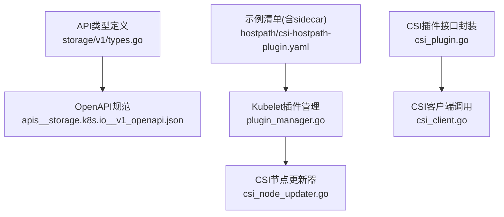
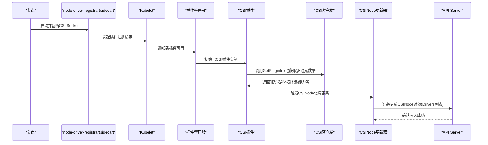
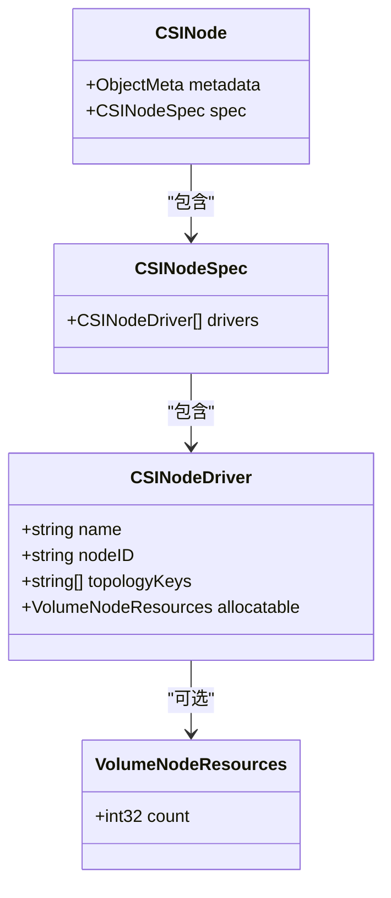
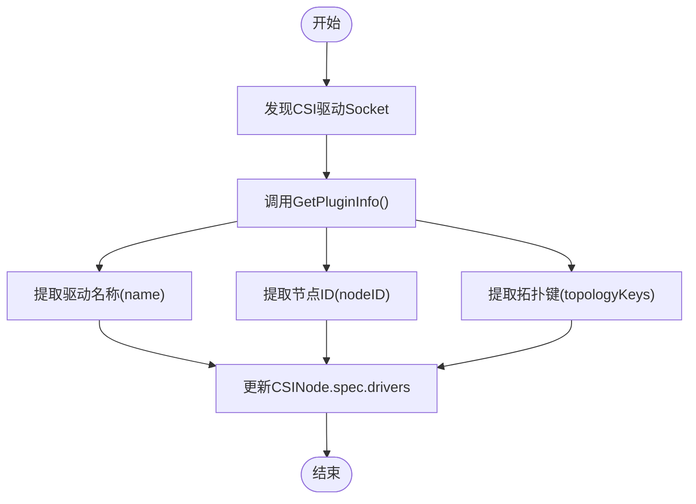
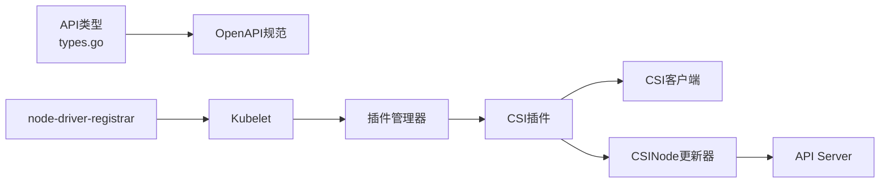

# CSINode API

<cite>
**本文引用的文件**   
- [staging/src/k8s.io/api/storage/v1/types.go](file://staging/src/k8s.io/api/storage/v1/types.go)
- [pkg/apis/storage/types.go](file://pkg/apis/storage/types.go)
- [api/openapi-spec/v3/apis__storage.k8s.io__v1_openapi.json](file://api/openapi-spec/v3/apis__storage.k8s.io__v1_openapi.json)
- [pkg/kubelet/pluginmanager/plugin_manager.go](file://pkg/kubelet/pluginmanager/plugin_manager.go)
- [pkg/volume/csi/csi_node_updater.go](file://pkg/volume/csi/csi_node_updater.go)
- [pkg/volume/csi/csi_plugin.go](file://pkg/volume/csi/csi_plugin.go)
- [pkg/volume/csi/csi_client.go](file://pkg/volume/csi/csi_client.go)
- [test/e2e/testing-manifests/storage-csi/hostpath/hostpath/csi-hostpath-plugin.yaml](file://test/e2e/testing-manifests/storage-csi/hostpath/hostpath/csi-hostpath-plugin.yaml)
</cite>

## 目录
1. [简介](#简介)
2. [项目结构](#项目结构)
3. [核心组件](#核心组件)
4. [架构总览](#架构总览)
5. [详细组件分析](#详细组件分析)
6. [依赖关系分析](#依赖关系分析)
7. [性能与容量报告](#性能与容量报告)
8. [监控与诊断](#监控与诊断)
9. [最佳实践与故障排查](#最佳实践与故障排查)
10. [结论](#结论)

## 简介
本文件面向Kubernetes用户与平台工程师，系统化说明CSINode资源的API定义、自动创建机制、节点CSI驱动注册流程、拓扑键（TopologyKeys）使用、节点可分配卷资源限制与容量报告机制，并提供监控、诊断、部署最佳实践与故障排查指南。文档基于仓库中的API类型定义与相关实现路径进行梳理，确保内容准确且可追溯。

## 项目结构
围绕CSINode的API与实现，主要涉及以下位置：
- API类型定义：存储组 storage/v1 的CSINode、CSINodeSpec、CSINodeDriver、VolumeNodeResources等
- OpenAPI规范：用于生成客户端/服务端契约
- Kubelet插件管理与CSI节点更新器：负责在节点侧发现并上报CSI驱动信息到CSINode对象
- e2e测试清单：展示node-driver-registrar sidecar容器的典型部署方式

图表来源
- [staging/src/k8s.io/api/storage/v1/types.go:586-663](file://staging/src/k8s.io/api/storage/v1/types.go#L586-L663)
- [api/openapi-spec/v3/apis__storage.k8s.io__v1_openapi.json:1309](file://api/openapi-spec/v3/apis__storage.k8s.io__v1_openapi.json#L1309)
- [pkg/kubelet/pluginmanager/plugin_manager.go](file://pkg/kubelet/pluginmanager/plugin_manager.go)
- [pkg/volume/csi/csi_node_updater.go](file://pkg/volume/csi/csi_node_updater.go)
- [pkg/volume/csi/csi_plugin.go](file://pkg/volume/csi/csi_plugin.go)
- [pkg/volume/csi/csi_client.go](file://pkg/volume/csi/csi_client.go)
- [test/e2e/testing-manifests/storage-csi/hostpath/hostpath/csi-hostpath-plugin.yaml](file://test/e2e/testing-manifests/storage-csi/hostpath/hostpath/csi-hostpath-plugin.yaml)

章节来源
- [staging/src/k8s.io/api/storage/v1/types.go:586-663](file://staging/src/k8s.io/api/storage/v1/types.go#L586-L663)
- [api/openapi-spec/v3/apis__storage.k8s.io__v1_openapi.json:1309](file://api/openapi-spec/v3/apis__storage.k8s.io__v1_openapi.json#L1309)

## 核心组件
- CSINode：表示节点上已安装的CSI驱动集合，名称与Node同名，拥有指向对应Node对象的OwnerReference
- CSINodeSpec：包含Drivers列表
- CSINodeDriver：单个CSI驱动在节点上的注册信息，包括驱动名称、节点ID、拓扑键、可分配卷资源限制
- VolumeNodeResources：节点可分配的卷资源限制（如count）

章节来源
- [staging/src/k8s.io/api/storage/v1/types.go:586-663](file://staging/src/k8s.io/api/storage/v1/types.go#L586-L663)

## 架构总览
CSINode的自动创建与更新由Kubelet在插件注册过程中完成；node-driver-registrar作为sidecar容器协助驱动与Kubelet对接。整体流程如下：

图表来源
- [pkg/kubelet/pluginmanager/plugin_manager.go](file://pkg/kubelet/pluginmanager/plugin_manager.go)
- [pkg/volume/csi/csi_plugin.go](file://pkg/volume/csi/csi_plugin.go)
- [pkg/volume/csi/csi_client.go](file://pkg/volume/csi/csi_client.go)
- [pkg/volume/csi/csi_node_updater.go](file://pkg/volume/csi/csi_node_updater.go)
- [test/e2e/testing-manifests/storage-csi/hostpath/hostpath/csi-hostpath-plugin.yaml](file://test/e2e/testing-manifests/storage-csi/hostpath/hostpath/csi-hostpath-plugin.yaml)

## 详细组件分析

### CSINode对象模型与字段语义
- CSINode
  - metadata.name：必须与Node对象名称一致
  - spec：CSINodeSpec
- CSINodeSpec
  - drivers：CSINodeDriver数组，按name合并策略更新
- CSINodeDriver
  - name：CSI驱动名称，需与GetPluginName()返回值一致
  - nodeID：从驱动视角的节点标识，用于跨系统命名映射
  - topologyKeys：驱动支持的拓扑键列表，Kubelet会将其暴露为Node标签以便调度感知
  - allocatable：VolumeNodeResources，描述该节点可分配的卷资源上限（如count）
- VolumeNodeResources
  - count：节点上唯一卷的最大数量（附加+挂载计一次）

章节来源
- [staging/src/k8s.io/api/storage/v1/types.go:586-663](file://staging/src/k8s.io/api/storage/v1/types.go#L586-L663)

#### 类图（代码级）

图表来源
- [staging/src/k8s.io/api/storage/v1/types.go:586-663](file://staging/src/k8s.io/api/storage/v1/types.go#L586-L663)

### 自动创建机制与node-driver-registrar作用
- 自动创建：只要节点通过node-driver-registrar与Kubelet完成插件注册，Kubelet会在插件注册阶段自动为该节点创建或更新CSINode对象，无需手动维护
- sidecar职责：node-driver-registrar负责与CSI驱动通信、向Kubelet上报驱动名称、拓扑键等信息，从而驱动CSINode对象的自动生成与同步

章节来源
- [staging/src/k8s.io/api/storage/v1/types.go:586-604](file://staging/src/k8s.io/api/storage/v1/types.go#L586-L604)
- [api/openapi-spec/v3/apis__storage.k8s.io__v1_openapi.json:1309](file://api/openapi-spec/v3/apis__storage.k8s.io__v1_openapi.json#L1309)
- [test/e2e/testing-manifests/storage-csi/hostpath/hostpath/csi-hostpath-plugin.yaml](file://test/e2e/testing-manifests/storage-csi/hostpath/hostpath/csi-hostpath-plugin.yaml)

### 节点CSI驱动注册过程详解
- 驱动名称映射：CSINodeDriver.name必须与CSI GetPluginName()返回值一致，确保Kubernetes与外部存储系统对驱动名称的一致认知
- 节点ID对应关系：CSINodeDriver.nodeID是“驱动视角”的节点ID，解决Kubernetes节点名与存储系统内部节点名不一致的问题
- 拓扑键传播：驱动在初始化时提供其支持的拓扑键，Kubelet将这些键作为Node标签暴露，供调度器在拓扑感知场景中使用
- 可分配卷资源限制：CSINodeDriver.allocatable.count声明节点可承载的唯一卷上限，影响调度决策

图表来源
- [pkg/volume/csi/csi_plugin.go](file://pkg/volume/csi/csi_plugin.go)
- [pkg/volume/csi/csi_client.go](file://pkg/volume/csi/csi_client.go)
- [pkg/volume/csi/csi_node_updater.go](file://pkg/volume/csi/csi_node_updater.go)
- [staging/src/k8s.io/api/storage/v1/types.go:617-653](file://staging/src/k8s.io/api/storage/v1/types.go#L617-L653)

章节来源
- [staging/src/k8s.io/api/storage/v1/types.go:617-653](file://staging/src/k8s.io/api/storage/v1/types.go#L617-L653)
- [pkg/volume/csi/csi_plugin.go](file://pkg/volume/csi/csi_plugin.go)
- [pkg/volume/csi/csi_client.go](file://pkg/volume/csi/csi_client.go)
- [pkg/volume/csi/csi_node_updater.go](file://pkg/volume/csi/csi_node_updater.go)

### 拓扑键（TopologyKeys）的定义与使用
- 定义：CSINodeDriver.topologyKeys列出驱动支持的拓扑键（例如区域、可用区、主机等）
- 使用：Kubelet将topologyKeys暴露为Node标签；当启用拓扑感知调度时，调度器依据这些标签进行亲和性/反亲和性约束与拓扑感知动态供给

章节来源
- [staging/src/k8s.io/api/storage/v1/types.go:634-647](file://staging/src/k8s.io/api/storage/v1/types.go#L634-L647)

### 节点可分配卷资源限制与容量报告
- 节点可分配卷限制：CSINodeDriver.allocatable.count表示节点可承载的唯一卷上限，调度器据此进行容量规划
- 容量报告机制：CSIStorageCapacity对象用于表达特定拓扑段内某StorageClass的可用容量与最大卷大小，配合CSIDriverSpec.StorageCapacity开启容量感知调度

章节来源
- [staging/src/k8s.io/api/storage/v1/types.go:649-663](file://staging/src/k8s.io/api/storage/v1/types.go#L649-L663)
- [staging/src/k8s.io/api/storage/v1/types.go:685-766](file://staging/src/k8s.io/api/storage/v1/types.go#L685-L766)

## 依赖关系分析
- API层：storage/v1/types.go定义了CSINode及其子结构，OpenAPI规范用于生成客户端/服务端契约
- 控制面：Kubelet插件管理器协调插件生命周期，CSI插件封装与外部驱动交互，CSINode更新器负责持久化CSINode状态
- 部署侧：node-driver-registrar作为sidecar与驱动和Kubelet协作

图表来源
- [staging/src/k8s.io/api/storage/v1/types.go:586-663](file://staging/src/k8s.io/api/storage/v1/types.go#L586-L663)
- [api/openapi-spec/v3/apis__storage.k8s.io__v1_openapi.json:1309](file://api/openapi-spec/v3/apis__storage.k8s.io__v1_openapi.json#L1309)
- [pkg/kubelet/pluginmanager/plugin_manager.go](file://pkg/kubelet/pluginmanager/plugin_manager.go)
- [pkg/volume/csi/csi_plugin.go](file://pkg/volume/csi/csi_plugin.go)
- [pkg/volume/csi/csi_client.go](file://pkg/volume/csi/csi_client.go)
- [pkg/volume/csi/csi_node_updater.go](file://pkg/volume/csi/csi_node_updater.go)

章节来源
- [staging/src/k8s.io/api/storage/v1/types.go:586-663](file://staging/src/k8s.io/api/storage/v1/types.go#L586-L663)
- [api/openapi-spec/v3/apis__storage.k8s.io__v1_openapi.json:1309](file://api/openapi-spec/v3/apis__storage.k8s.io__v1_openapi.json#L1309)

## 性能与容量报告
- 节点可分配卷限制（count）有助于避免单节点过载，提升调度稳定性
- CSIStorageCapacity结合CSIDriverSpec.StorageCapacity可实现更精细的容量感知调度，减少因容量不足导致的调度失败
- 建议合理设置count与容量报告粒度，平衡调度效率与准确性

[本节为通用指导，不直接分析具体文件]

## 监控与诊断
- 查看CSINode对象：使用kubectl获取CSINode，核对drivers列表是否完整、topologyKeys是否正确、allocatable.count是否符合预期
- 检查Node标签：验证Kubelet是否已将topologyKeys暴露为Node标签，以供调度器使用
- 观察Sidecar日志：node-driver-registrar日志可帮助定位驱动注册问题
- 关联CSI插件日志：若CSINode未更新，检查CSI插件与驱动间通信是否正常

章节来源
- [staging/src/k8s.io/api/storage/v1/types.go:586-663](file://staging/src/k8s.io/api/storage/v1/types.go#L586-L663)
- [test/e2e/testing-manifests/storage-csi/hostpath/hostpath/csi-hostpath-plugin.yaml](file://test/e2e/testing-manifests/storage-csi/hostpath/hostpath/csi-hostpath-plugin.yaml)

## 最佳实践与故障排查

### 部署最佳实践
- 始终在节点Pod中部署node-driver-registrar sidecar，确保驱动注册可靠
- 保证CSINodeDriver.name与GetPluginName()返回值严格一致
- 正确配置topologyKeys，并在集群中启用拓扑感知调度以发挥优势
- 根据节点硬件能力设置allocatable.count，避免超卖导致I/O抖动
- 如需容量感知调度，启用CSIDriverSpec.StorageCapacity并确保CSIStorageCapacity对象及时发布

章节来源
- [staging/src/k8s.io/api/storage/v1/types.go:586-663](file://staging/src/k8s.io/api/storage/v1/types.go#L586-L663)
- [test/e2e/testing-manifests/storage-csi/hostpath/hostpath/csi-hostpath-plugin.yaml](file://test/e2e/testing-manifests/storage-csi/hostpath/hostpath/csi-hostpath-plugin.yaml)

### 常见故障排查
- CSINode缺失或不更新
  - 检查node-driver-registrar是否运行正常并与CSI驱动连通
  - 确认Kubelet插件管理器是否收到插件注册事件
  - 查看CSINode更新器是否成功写入API Server
- 拓扑感知异常
  - 核对topologyKeys是否与Node标签一致
  - 确认调度器启用了拓扑感知相关特性
- 容量不足导致调度失败
  - 检查CSIStorageCapacity是否存在且容量值合理
  - 校验CSIDriverSpec.StorageCapacity是否启用

章节来源
- [pkg/kubelet/pluginmanager/plugin_manager.go](file://pkg/kubelet/pluginmanager/plugin_manager.go)
- [pkg/volume/csi/csi_node_updater.go](file://pkg/volume/csi/csi_node_updater.go)
- [staging/src/k8s.io/api/storage/v1/types.go:685-766](file://staging/src/k8s.io/api/storage/v1/types.go#L685-L766)

## 结论
CSINode是Kubernetes节点CSI驱动信息的权威来源，其自动创建与更新依赖于node-driver-registrar与Kubelet插件生态。通过合理的拓扑键配置、节点可分配卷限制与容量报告，可以显著提升调度的准确性与集群的整体稳定性。建议在部署与维护中遵循本文的最佳实践，并结合监控与诊断手段快速定位问题。