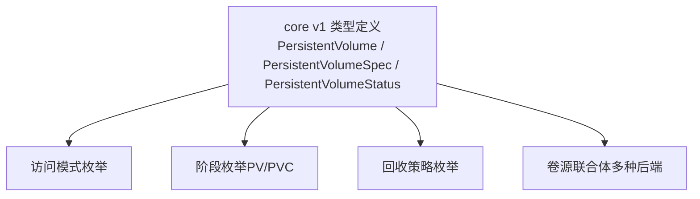
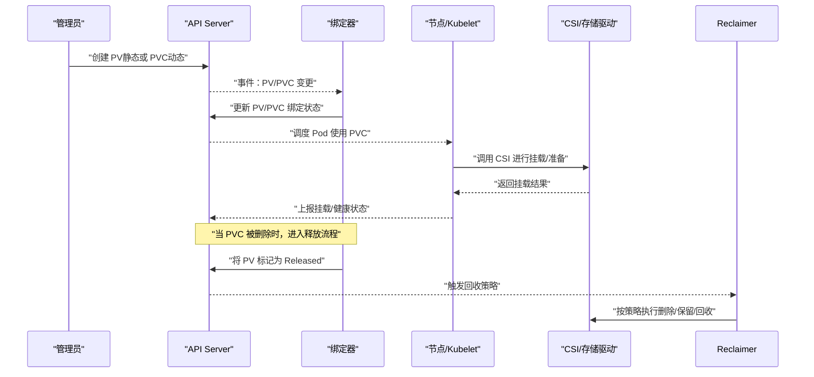
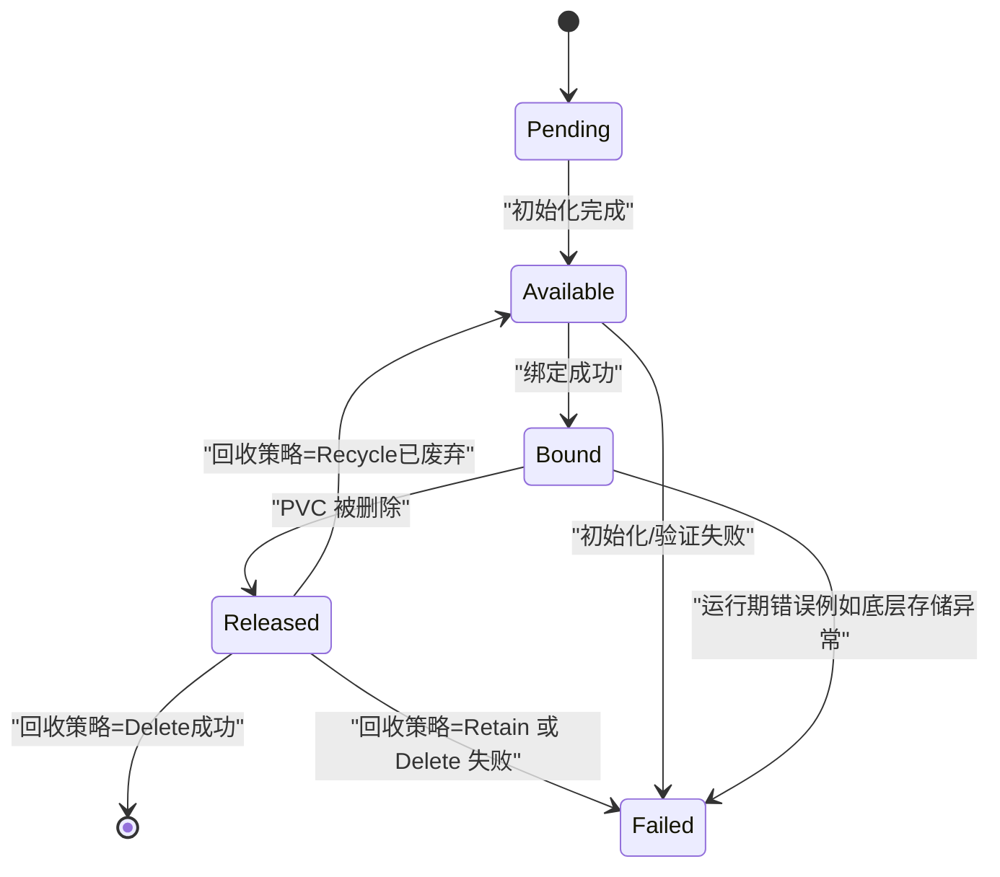
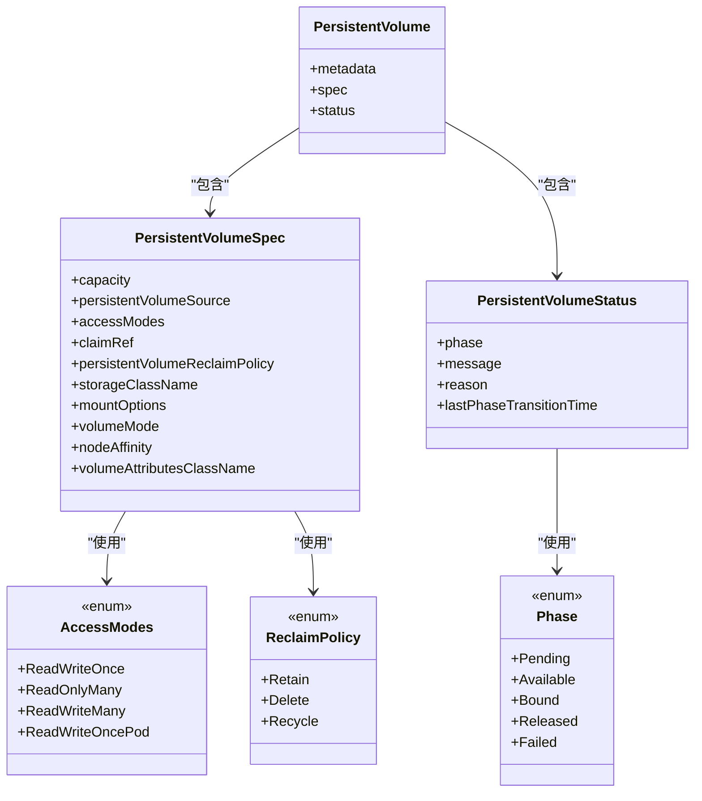

# 持久卷 API 参考文档

<cite>
**本文引用的文件**   
- [types.go](file://staging/src/k8s.io/api/core/v1/types.go)
</cite>

## 目录
1. [简介](#简介)
2. [项目结构](#项目结构)
3. [核心组件](#核心组件)
4. [架构总览](#架构总览)
5. [详细组件分析](#详细组件分析)
6. [依赖分析](#依赖分析)
7. [性能考虑](#性能考虑)
8. [故障诊断指南](#故障诊断指南)
9. [结论](#结论)
10. [附录](#附录)

## 简介
本文件为 Kubernetes PersistentVolume（PV）资源的 REST API 参考与实现要点说明，覆盖以下主题：
- PV 生命周期管理：静态供应与动态供应
- 访问模式：ReadWriteOnce、ReadOnlyMany、ReadWriteMany、ReadWriteOncePod 及其使用场景
- 状态转换：Pending → Available → Bound → Released → Failed 的完整流程
- 存储后端配置示例：NFS、Ceph、云存储等
- 回收策略：Retain、Delete、Recycle 及数据保护机制
- 监控指标与故障诊断方法

## 项目结构
本仓库中，PV/PVC 的核心类型定义位于 core v1 API 包。该文件集中定义了 PV、PVC 的结构体、枚举值（访问模式、阶段、回收策略等），是理解 PV API 的基础。

图表来源
- [types.go:360-440](file://staging/src/k8s.io/api/core/v1/types.go#L360-L440)
- [types.go:864-910](file://staging/src/k8s.io/api/core/v1/types.go#L864-L910)

章节来源
- [types.go:360-440](file://staging/src/k8s.io/api/core/v1/types.go#L360-L440)
- [types.go:864-910](file://staging/src/k8s.io/api/core/v1/types.go#L864-L910)

## 核心组件
- PersistentVolume（PV）
  - 由集群管理员预置或动态创建的存储资源，类比节点。
  - 包含 spec（容量、卷源、访问模式、回收策略、存储类名、挂载选项、卷模式、节点亲和、卷属性类名等）和 status（阶段、消息、原因、最近阶段切换时间）。
- PersistentVolumeSpec
  - capacity：声明容量
  - persistentVolumeSource：底层存储后端的具体配置（如 NFS、Ceph、CSI、云盘等）
  - accessModes：访问模式集合
  - claimRef：绑定关系引用（绑定后非空）
  - persistentVolumeReclaimPolicy：回收策略
  - storageClassName：所属 StorageClass
  - mountOptions：挂载选项
  - volumeMode：Filesystem 或 Block
  - nodeAffinity：节点亲和约束
  - volumeAttributesClassName：卷属性类名（CSI 扩展能力）
- PersistentVolumeStatus
  - phase：当前阶段（Pending/Available/Bound/Released/Failed）
  - message/reason：人类可读信息与机器可读原因
  - lastPhaseTransitionTime：阶段切换时间戳
- 访问模式（AccessModes）
  - ReadWriteOnce（RWO）：单主机读写
  - ReadOnlyMany（ROX）：多主机只读
  - ReadWriteMany（RWX）：多主机读写
  - ReadWriteOncePod（RWOP）：单 Pod 读写（不可与其他模式混用）
- 回收策略（Reclaim Policy）
  - Retain：保留数据，需人工清理
  - Delete：删除底层存储
  - Recycle：已废弃，要求插件支持
- 卷模式（VolumeMode）
  - Filesystem：文件系统模式（默认）
  - Block：裸块设备模式
- 节点亲和（NodeAffinity）
  - required：硬约束，限制可访问节点集合
- 卷属性类（VolumeAttributesClass）
  - 通过 CSI 驱动在运行时修改卷属性的能力（Alpha 特性门控）

章节来源
- [types.go:360-440](file://staging/src/k8s.io/api/core/v1/types.go#L360-L440)
- [types.go:448-473](file://staging/src/k8s.io/api/core/v1/types.go#L448-L473)
- [types.go:475-492](file://staging/src/k8s.io/api/core/v1/types.go#L475-L492)
- [types.go:864-910](file://staging/src/k8s.io/api/core/v1/types.go#L864-L910)

## 架构总览
PV 的生命周期涉及多个控制器与子系统协作：
- API Server：接收并持久化 PV/PVC 对象
- 绑定器（Binder）：匹配 PVC 与 PV，更新双向绑定信息
- 回收器（Reclaim Controller）：根据回收策略处理释放后的 PV
- Kubelet：在节点上执行挂载/卸载、扩容、文件系统操作
- CSI 驱动/存储插件：提供具体后端能力（创建、挂载、快照、扩容等）

图表来源
- [types.go:360-440](file://staging/src/k8s.io/api/core/v1/types.go#L360-L440)
- [types.go:864-910](file://staging/src/k8s.io/api/core/v1/types.go#L864-L910)

## 详细组件分析

### PV 生命周期与状态机
PV 的阶段包括：
- Pending：尚未可用
- Available：可用但未绑定
- Bound：已绑定到 PVC
- Released：绑定的 PVC 已删除，等待回收
- Failed：回收/删除失败

图表来源
- [types.go:864-910](file://staging/src/k8s.io/api/core/v1/types.go#L864-L910)

章节来源
- [types.go:475-492](file://staging/src/k8s.io/api/core/v1/types.go#L475-L492)
- [types.go:864-910](file://staging/src/k8s.io/api/core/v1/types.go#L864-L910)

### 访问模式与使用场景
- ReadWriteOnce（RWO）
  - 适用：单节点单实例写入（数据库主库、日志写入进程）
  - 注意：同一时刻仅允许一个节点以读写方式挂载
- ReadOnlyMany（ROX）
  - 适用：多节点只读共享（镜像缓存、配置文件分发）
- ReadWriteMany（RWX）
  - 适用：多节点并发读写（共享工作目录、并行计算中间结果）
  - 注意：并非所有后端都支持 RWX
- ReadWriteOncePod（RWOP）
  - 适用：强一致性的单 Pod 独占写（某些分布式系统需要严格隔离）
  - 注意：不可与其他访问模式组合使用

章节来源
- [types.go:864-876](file://staging/src/k8s.io/api/core/v1/types.go#L864-L876)

### 回收策略与数据保护
- Retain（默认用于手动创建的 PV）
  - 行为：PVC 删除后，PV 进入 Released，数据保留，需管理员手动清理
  - 风险：若未清理，可能占用存储配额
- Delete（默认用于动态创建的 PV）
  - 行为：PVC 删除后，自动删除底层存储
  - 风险：误删数据；建议配合快照/备份策略
- Recycle（已废弃）
  - 行为：尝试清空数据并重新可用
  - 现状：不再推荐，许多后端不支持

数据保护建议：
- 对关键数据启用快照与跨副本复制
- 使用 Retain 策略结合外部备份流程
- 谨慎选择 Delete，避免误删

章节来源
- [types.go:448-462](file://staging/src/k8s.io/api/core/v1/types.go#L448-L462)

### 静态供应与动态供应
- 静态供应
  - 管理员预先创建 PV，指定后端参数（如 NFS 服务器地址、路径、Ceph 池/子卷、云盘 ID 等）
  - 用户通过 PVC 选择匹配的 PV（标签选择器或名称绑定）
- 动态供应
  - 用户创建 PVC，指定 StorageClass
  - 对应 Provisioner（CSI 或 In-tree）按需创建 PV 并完成绑定
  - 优势：按需分配、自动化运维

章节来源
- [types.go:360-440](file://staging/src/k8s.io/api/core/v1/types.go#L360-L440)

### 不同存储后端的 PV 配置要点
以下为常见后端的配置字段与注意事项（不展示具体 YAML 内容，仅提供字段指引）：
- NFS
  - server：NFS 服务器地址
  - path：共享目录路径
  - readOnly：是否只读
  - mountOptions：挂载选项（如软挂载、超时等）
- Ceph（CephFS/RBD）
  - monitors：Ceph Monitor 列表
  - pool/subvolume：存储池或子卷
  - user/keyring：认证信息
  - fsName：CephFS 文件系统名（CephFS）
  - image/name：RBD 镜像或名称
- 云存储（AWS EBS/GCE PD/Azure Disk/CSIDriver）
  - 云盘标识符（id/name）
  - 分区/格式化选项
  - IOPS/吞吐等级（取决于后端）
  - 加密密钥引用（KMS）
- CSI
  - driver：CSI 驱动名称
  - volumeHandle：后端卷句柄
  - fsType：文件系统类型
  - readOnly：只读标志
  - volumeAttributes：驱动特定键值对

提示：
- 确保访问模式与后端能力匹配
- 合理设置 mountOptions 提升稳定性
- 使用 VolumeAttributesClass（CSI）动态调整卷属性（Alpha）

章节来源
- [types.go:360-440](file://staging/src/k8s.io/api/core/v1/types.go#L360-L440)

### 卷模式与节点亲和
- 卷模式
  - Filesystem：常规文件系统挂载
  - Block：裸块设备，适合数据库引擎直接管理
- 节点亲和
  - required：限定可访问节点集合，影响 Pod 调度与挂载可行性

章节来源
- [types.go:422-430](file://staging/src/k8s.io/api/core/v1/types.go#L422-L430)
- [types.go:464-473](file://staging/src/k8s.io/api/core/v1/types.go#L464-L473)

## 依赖分析
- 类型耦合
  - PV 与 PVC 通过 claimRef 与 volumeName 形成双向绑定
  - AccessModes、Phase、ReclaimPolicy 等枚举贯穿 PV/PVC 状态机
- 外部依赖
  - CSI 驱动/存储插件：提供实际 I/O 能力
  - 云平台 API：云盘/对象存储接口
  - 网络协议：NFS/Ceph 客户端

图表来源
- [types.go:360-440](file://staging/src/k8s.io/api/core/v1/types.go#L360-L440)
- [types.go:448-473](file://staging/src/k8s.io/api/core/v1/types.go#L448-L473)
- [types.go:475-492](file://staging/src/k8s.io/api/core/v1/types.go#L475-L492)
- [types.go:864-910](file://staging/src/k8s.io/api/core/v1/types.go#L864-L910)

章节来源
- [types.go:360-440](file://staging/src/k8s.io/api/core/v1/types.go#L360-L440)
- [types.go:864-910](file://staging/src/k8s.io/api/core/v1/types.go#L864-L910)

## 性能考虑
- 访问模式选择
  - RWO 通常具备更好的单节点写入性能
  - RWX 受限于共享存储一致性模型，延迟较高
- 卷模式
  - Block 模式可减少文件系统开销，适合高性能数据库
- 挂载选项
  - 合理设置超时、重试、软/硬挂载策略
- 节点亲和
  - 将 Pod 调度到靠近存储拓扑的节点可降低网络延迟
- 动态扩容
  - 控制面扩容与节点侧文件系统扩容存在时延，应评估业务容忍度

[本节为通用指导，无需源码引用]

## 故障诊断指南
- 查看 PV/PVC 状态
  - 关注 phase、message、reason、lastPhaseTransitionTime
- 常见问题定位
  - 绑定失败：检查 AccessModes 与后端能力、StorageClass 与 Provisioner、标签选择器
  - 挂载失败：检查节点权限、网络连通性、CSI 驱动日志、mountOptions
  - 释放失败：确认回收策略与后端支持，必要时人工干预清理
- 指标与观测
  - 观察 PV/PVC 阶段变化频率与耗时
  - 监控 CSI 驱动错误率、I/O 延迟、吞吐
  - 记录阶段切换时间戳，辅助定位瓶颈

章节来源
- [types.go:475-492](file://staging/src/k8s.io/api/core/v1/types.go#L475-L492)
- [types.go:864-910](file://staging/src/k8s.io/api/core/v1/types.go#L864-L910)

## 结论
PV 作为 Kubernetes 的抽象存储资源，通过统一的 API 屏蔽了后端差异。正确选择访问模式、卷模式与回收策略，结合合适的存储后端与监控手段，是实现稳定、高效、可维护的数据持久化的关键。对于生产环境，建议优先采用 CSI 驱动的动态供应，配合快照与备份策略，降低数据丢失风险。

[本节为总结，无需源码引用]

## 附录
- 术语对照
  - PV：持久卷
  - PVC：持久卷声明
  - StorageClass：存储类
  - CSI：容器存储接口
- 相关概念
  - 卷属性类（VolumeAttributesClass）：通过 CSI 动态调整卷属性（Alpha）
  - 数据源（dataSource/dataSourceRef）：基于快照或现有 PVC 创建新卷

[本节为补充说明，无需源码引用]