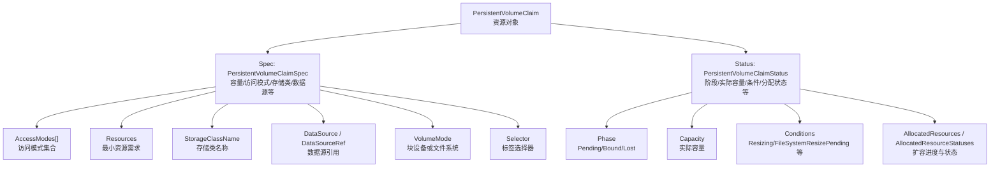
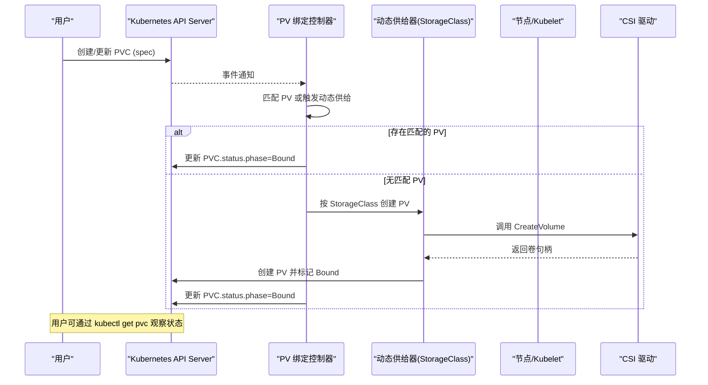
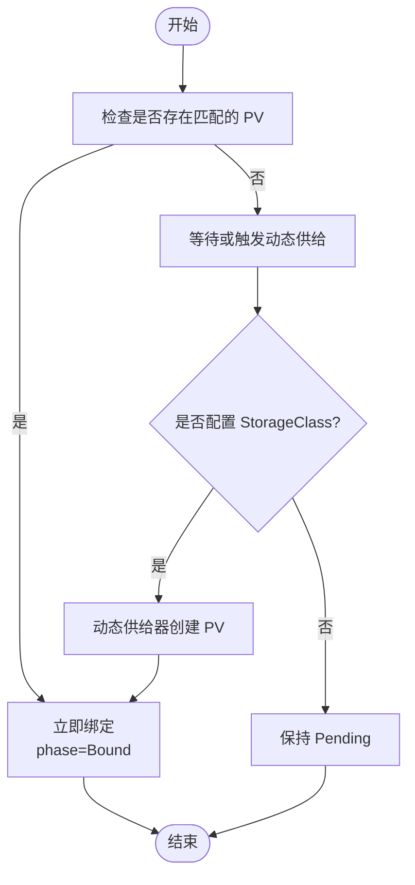
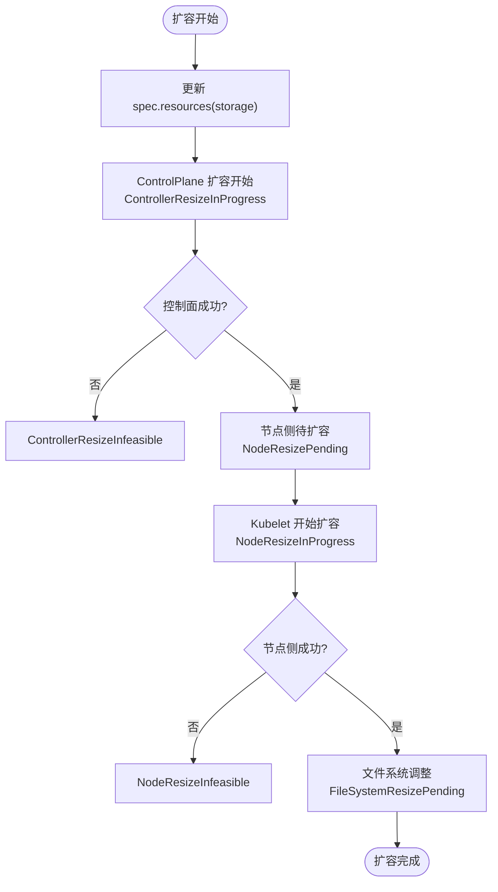
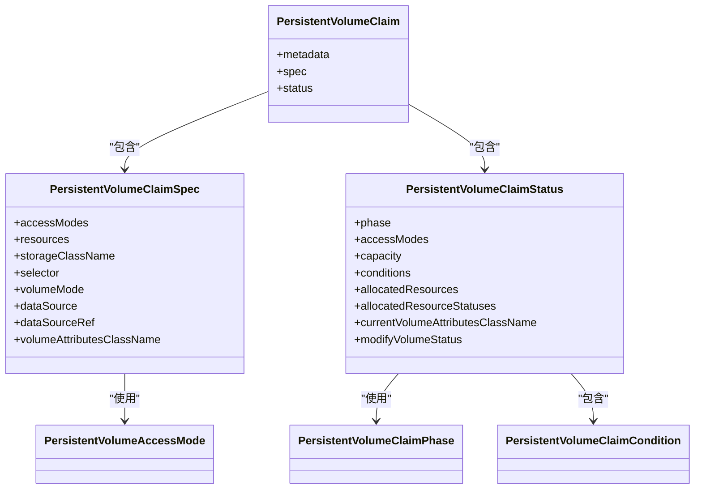

# PersistentVolumeClaim API

<cite>
**本文引用的文件**   
- [staging/src/k8s.io/api/core/v1/types.go](file://staging/src/k8s.io/api/core/v1/types.go)
</cite>

## 目录
1. [简介](#简介)
2. [项目结构](#项目结构)
3. [核心组件](#核心组件)
4. [架构总览](#架构总览)
5. [详细组件分析](#详细组件分析)
6. [依赖关系分析](#依赖关系分析)
7. [性能与扩展性考虑](#性能与扩展性考虑)
8. [故障排查指南](#故障排查指南)
9. [结论](#结论)
10. [附录：常见使用场景与最佳实践](#附录常见使用场景与最佳实践)

## 简介
本文件为 Kubernetes PersistentVolumeClaim（PVC）资源的 REST API 文档，聚焦于声明式存储请求机制、PVC 与 PV 的绑定过程、动态扩容能力、在 Pod 中的使用方式、生命周期状态与错误处理、配额管理与多租户隔离等主题。内容基于仓库中 API 类型定义进行梳理，帮助读者从 API 视角理解 PVC 的设计与行为。

## 项目结构
PVC 的核心 API 类型定义位于 staging 模块的 core v1 API 包中，包含资源对象、规格字段、状态字段、访问模式枚举、阶段枚举以及条件与资源状态等关键结构。这些类型构成了 PVC 的 REST API 契约基础。

图表来源
- [staging/src/k8s.io/api/core/v1/types.go:514-625](file://staging/src/k8s.io/api/core/v1/types.go#L514-L625)
- [staging/src/k8s.io/api/core/v1/types.go:768-861](file://staging/src/k8s.io/api/core/v1/types.go#L768-L861)

章节来源
- [staging/src/k8s.io/api/core/v1/types.go:514-625](file://staging/src/k8s.io/api/core/v1/types.go#L514-L625)
- [staging/src/k8s.io/api/core/v1/types.go:768-861](file://staging/src/k8s.io/api/core/v1/types.go#L768-L861)

## 核心组件
本节概述 PVC 的关键 API 概念与字段语义，便于后续深入分析。

- 资源对象
  - PersistentVolumeClaim：用户声明的持久卷申请，包含 spec 与 status 两部分。
  - PersistentVolumeClaimList：列表包装。

- 规格（spec）
  - AccessModes：期望的访问模式集合（如 ReadWriteOnce、ReadOnlyMany、ReadWriteMany、ReadWriteOncePod）。
  - Resources：最小资源需求（例如 storage），用于配额与调度评估。
  - StorageClassName：期望的存储类名称，驱动动态供给。
  - Selector：标签选择器，用于静态绑定到已有 PV。
  - VolumeMode：卷模式（Filesystem 或 Block）。
  - DataSource / DataSourceRef：数据源引用，支持快照或 PVC 克隆等。
  - VolumeAttributesClassName：卷属性类名（需特性门控），用于 CSI 卷属性修改。

- 状态（status）
  - Phase：当前阶段（Pending、Bound、Lost）。
  - AccessModes：实际可用的访问模式。
  - Capacity：底层卷的实际容量。
  - Conditions：条件列表，包括 Resizing、FileSystemResizePending、ControllerResizeError、NodeResizeError、ModifyVolumeError、ModifyingVolume、Unused 等。
  - AllocatedResources / AllocatedResourceStatuses：记录已分配资源及扩容各阶段的细粒度状态。
  - CurrentVolumeAttributesClassName / ModifyVolumeStatus：卷属性类应用状态。

章节来源
- [staging/src/k8s.io/api/core/v1/types.go:514-625](file://staging/src/k8s.io/api/core/v1/types.go#L514-L625)
- [staging/src/k8s.io/api/core/v1/types.go:768-861](file://staging/src/k8s.io/api/core/v1/types.go#L768-L861)
- [staging/src/k8s.io/api/core/v1/types.go:863-876](file://staging/src/k8s.io/api/core/v1/types.go#L863-L876)
- [staging/src/k8s.io/api/core/v1/types.go:898-909](file://staging/src/k8s.io/api/core/v1/types.go#L898-L909)

## 架构总览
PVC 的声明式模型通过控制器与存储插件协作完成绑定与扩容。API 层定义了用户可配置的 spec 与系统维护的 status，控制器根据 spec 变更驱动 PV 绑定、动态供给、扩容与属性修改等操作，并在 status 中反映最终结果与中间状态。

图表来源
- [staging/src/k8s.io/api/core/v1/types.go:514-625](file://staging/src/k8s.io/api/core/v1/types.go#L514-L625)
- [staging/src/k8s.io/api/core/v1/types.go:768-861](file://staging/src/k8s.io/api/core/v1/types.go#L768-L861)

## 详细组件分析

### 声明式存储请求机制
- 容量请求
  - 通过 spec.resources 指定最小资源需求（如 storage）。该值参与配额计算与调度评估。
  - 当扩容时，status.capacity 可能小于 spec.resources 所请求的新容量，直到底层操作完成。
- 访问模式选择
  - spec.accessModes 表达期望的访问模式；status.accessModes 反映实际可用模式。
  - 支持的访问模式包括单主机读写、只读多主机、读写多主机、单 Pod 读写等。
- 存储类绑定
  - spec.storageClassName 指向 StorageClass，驱动动态供给流程。
  - 若未设置且集群有默认 StorageClass，则自动采用默认类。
- 数据源与克隆
  - spec.dataSource 与 spec.dataSourceRef 支持从快照或现有 PVC 初始化新卷。
  - dataSourceRef 支持跨命名空间引用（需特性门控），并提供更严格的校验。
- 卷模式与属性类
  - spec.volumeMode 指定 Filesystem 或 Block。
  - spec.volumeAttributesClassName 配合 CSI 实现卷属性修改（需特性门控）。

章节来源
- [staging/src/k8s.io/api/core/v1/types.go:549-625](file://staging/src/k8s.io/api/core/v1/types.go#L549-L625)
- [staging/src/k8s.io/api/core/v1/types.go:863-876](file://staging/src/k8s.io/api/core/v1/types.go#L863-L876)

### PVC 与 PV 的绑定过程（立即绑定与延迟绑定）
- 立即绑定
  - 当存在满足 spec 要求的 PV（容量、访问模式、标签匹配等），绑定控制器会直接将 PVC 与 PV 关联，并将 phase 置为 Bound。
- 延迟绑定
  - 若无匹配 PV，PVC 保持 Pending，等待动态供给器创建 PV 或管理员手动创建符合要求的 PV。
- 绑定失败与释放
  - 若底层卷不可用或被删除，PVC 可能进入 Lost 状态；PV 被释放后进入 Released 状态，随后可能被回收策略处理。

图表来源
- [staging/src/k8s.io/api/core/v1/types.go:898-909](file://staging/src/k8s.io/api/core/v1/types.go#L898-L909)
- [staging/src/k8s.io/api/core/v1/types.go:549-625](file://staging/src/k8s.io/api/core/v1/types.go#L549-L625)

章节来源
- [staging/src/k8s.io/api/core/v1/types.go:898-909](file://staging/src/k8s.io/api/core/v1/types.go#L898-L909)
- [staging/src/k8s.io/api/core/v1/types.go:549-625](file://staging/src/k8s.io/api/core/v1/types.go#L549-L625)

### 动态扩容功能（条件与限制）
- 扩容触发
  - 用户更新 spec.resources（通常为 storage）以请求更大容量。
- 控制面扩容阶段
  - status.allocatedResourceStatuses['storage'] 可能进入 ControllerResizeInProgress。
  - 若失败且为终态错误，可能进入 ControllerResizeInfeasible。
- 节点侧扩容阶段
  - 控制面完成后，kubelet 执行节点侧扩容，状态可能为 NodeResizePending 或 NodeResizeInProgress。
  - 若失败且为终态错误，可能进入 NodeResizeInfeasible。
- 文件系统调整
  - 当底层卷扩容完成但文件系统尚未调整时，conditions 可能出现 FileSystemResizePending。
- 条件与消息
  - conditions 提供 Resizing、ControllerResizeError、NodeResizeError 等条件，辅助诊断。

图表来源
- [staging/src/k8s.io/api/core/v1/types.go:658-709](file://staging/src/k8s.io/api/core/v1/types.go#L658-L709)
- [staging/src/k8s.io/api/core/v1/types.go:768-861](file://staging/src/k8s.io/api/core/v1/types.go#L768-L861)

章节来源
- [staging/src/k8s.io/api/core/v1/types.go:658-709](file://staging/src/k8s.io/api/core/v1/types.go#L658-L709)
- [staging/src/k8s.io/api/core/v1/types.go:768-861](file://staging/src/k8s.io/api/core/v1/types.go#L768-L861)

### 在 Pod 中的使用方式与最佳实践
- 使用方式
  - 在 Pod 的 volumes 中引用 PVC 名称，并通过 volumeMounts 挂载到容器路径。
  - 对于块设备模式，需在 Pod 中正确配置 mountPath 与权限。
- 最佳实践
  - 明确声明 accessModes 与 resources，避免过度宽泛导致无法绑定。
  - 合理设置 storageClassName，确保与后端存储能力匹配。
  - 使用 dataSourceRef 进行快照恢复或 PVC 克隆，注意跨命名空间引用所需的授权。
  - 监控 PVC 的 conditions 与 allocatedResourceStatuses，及时识别扩容卡点。

[本节为通用指导，不直接分析具体文件]

### 生命周期状态与错误处理
- 生命周期阶段
  - Pending：尚未绑定。
  - Bound：已成功绑定。
  - Lost：绑定的 PV 丢失，数据不可用。
- 条件与错误
  - Resizing：扩容进行中。
  - FileSystemResizePending：需要节点侧文件系统调整。
  - ControllerResizeError / NodeResizeError：扩容过程中的错误条件。
  - ModifyVolumeError / ModifyingVolume：卷属性类修改相关状态。
  - Unused：PVC 未被任何非终止 Pod 引用（需特性门控）。
- 资源状态映射
  - allocatedResourceStatuses 提供扩容各阶段的细粒度状态，便于区分控制面与节点侧问题。

章节来源
- [staging/src/k8s.io/api/core/v1/types.go:898-909](file://staging/src/k8s.io/api/core/v1/types.go#L898-L909)
- [staging/src/k8s.io/api/core/v1/types.go:658-709](file://staging/src/k8s.io/api/core/v1/types.go#L658-L709)
- [staging/src/k8s.io/api/core/v1/types.go:768-861](file://staging/src/k8s.io/api/core/v1/types.go#L768-L861)

### 配额管理与多租户隔离
- 配额管理
  - PVC.spec.resources 参与 ResourceQuota 的计算；当扩容进行时，quota 可能依据 allocatedResources 与 spec.resources 的较大值进行评估。
  - 若 allocatedResources 未设置，仅使用 spec.resources 进行配额计算。
- 多租户隔离
  - PVC 属于命名空间资源，跨命名空间的数据源引用需显式授权（ReferenceGrant 等机制）。
  - 通过 selector 与 storageClassName 限定可绑定的 PV 范围，增强隔离性。

章节来源
- [staging/src/k8s.io/api/core/v1/types.go:768-861](file://staging/src/k8s.io/api/core/v1/types.go#L768-L861)
- [staging/src/k8s.io/api/core/v1/types.go:549-625](file://staging/src/k8s.io/api/core/v1/types.go#L549-L625)

## 依赖关系分析
PVC 的类型定义依赖以下核心元素：
- 元数据与通用类型（如 metav1.ObjectMeta、metav1.ListMeta）
- 资源量与资源列表（resource.Quantity、ResourceList）
- 标签选择器（metav1.LabelSelector）
- 访问模式与阶段枚举（PersistentVolumeAccessMode、PersistentVolumeClaimPhase）
- 条件与状态结构（PersistentVolumeClaimCondition、PersistentVolumeClaimStatus）

图表来源
- [staging/src/k8s.io/api/core/v1/types.go:514-625](file://staging/src/k8s.io/api/core/v1/types.go#L514-L625)
- [staging/src/k8s.io/api/core/v1/types.go:768-861](file://staging/src/k8s.io/api/core/v1/types.go#L768-L861)
- [staging/src/k8s.io/api/core/v1/types.go:863-876](file://staging/src/k8s.io/api/core/v1/types.go#L863-L876)
- [staging/src/k8s.io/api/core/v1/types.go:898-909](file://staging/src/k8s.io/api/core/v1/types.go#L898-L909)

章节来源
- [staging/src/k8s.io/api/core/v1/types.go:514-625](file://staging/src/k8s.io/api/core/v1/types.go#L514-L625)
- [staging/src/k8s.io/api/core/v1/types.go:768-861](file://staging/src/k8s.io/api/core/v1/types.go#L768-L861)
- [staging/src/k8s.io/api/core/v1/types.go:863-876](file://staging/src/k8s.io/api/core/v1/types.go#L863-L876)
- [staging/src/k8s.io/api/core/v1/types.go:898-909](file://staging/src/k8s.io/api/core/v1/types.go#L898-L909)

## 性能与扩展性考虑
- 扩容顺序与阻塞
  - 控制面与节点侧扩容串行推进，避免并发冲突；状态字段有助于外部控制器协调。
- 条件与状态的可观测性
  - 利用 conditions 与 allocatedResourceStatuses 提升可观测性，减少轮询开销。
- 数据源与克隆
  - 使用 dataSourceRef 进行跨命名空间引用时，需关注授权与网络延迟对初始化的影响。

[本节为通用指导，不直接分析具体文件]

## 故障排查指南
- 常见问题定位
  - 查看 PVC 的 phase 是否为 Pending/Bound/Lost。
  - 检查 conditions 中是否有 Resizing、FileSystemResizePending、ControllerResizeError、NodeResizeError 等。
  - 检查 allocatedResourceStatuses 中 storage 的状态，判断控制面或节点侧扩容是否卡住。
- 典型错误
  - 访问模式不匹配：确认后端存储是否支持所需模式。
  - 存储类不存在或不可用：确认 StorageClass 与 CSI 驱动状态。
  - 配额不足：检查 ResourceQuota 与 LimitRange 限制。
  - 数据源引用无效：确认快照或源 PVC 存在且具备访问权限。

章节来源
- [staging/src/k8s.io/api/core/v1/types.go:658-709](file://staging/src/k8s.io/api/core/v1/types.go#L658-L709)
- [staging/src/k8s.io/api/core/v1/types.go:768-861](file://staging/src/k8s.io/api/core/v1/types.go#L768-L861)
- [staging/src/k8s.io/api/core/v1/types.go:898-909](file://staging/src/k8s.io/api/core/v1/types.go#L898-L909)

## 结论
PVC 作为声明式存储请求的核心资源，通过清晰的 spec/status 契约与丰富的条件与状态字段，实现了灵活的绑定、动态供给与扩容能力。结合配额与多租户机制，PVC 能够在复杂的多租户环境中提供稳定可靠的存储服务。运维与开发者应充分利用状态与条件信息，进行有效的监控与排障。

[本节为总结性内容，不直接分析具体文件]

## 附录：常见使用场景与最佳实践
- 场景一：按需扩容
  - 更新 spec.resources 以增大 storage，监控 allocatedResourceStatuses 与 conditions，直至扩容完成。
- 场景二：快照恢复
  - 使用 dataSourceRef 指向 VolumeSnapshot，快速恢复数据至新 PVC。
- 场景三：跨命名空间共享
  - 在目标命名空间创建 ReferenceGrant，允许跨命名空间引用数据源。
- 最佳实践清单
  - 明确声明访问模式与容量，避免模糊配置。
  - 选择合适的 StorageClass，确保与业务 SLA 一致。
  - 定期巡检 PVC 状态与条件，及时处理异常。
  - 使用标签选择器与命名空间隔离，增强安全性与可管理性。

[本节为通用指导，不直接分析具体文件]