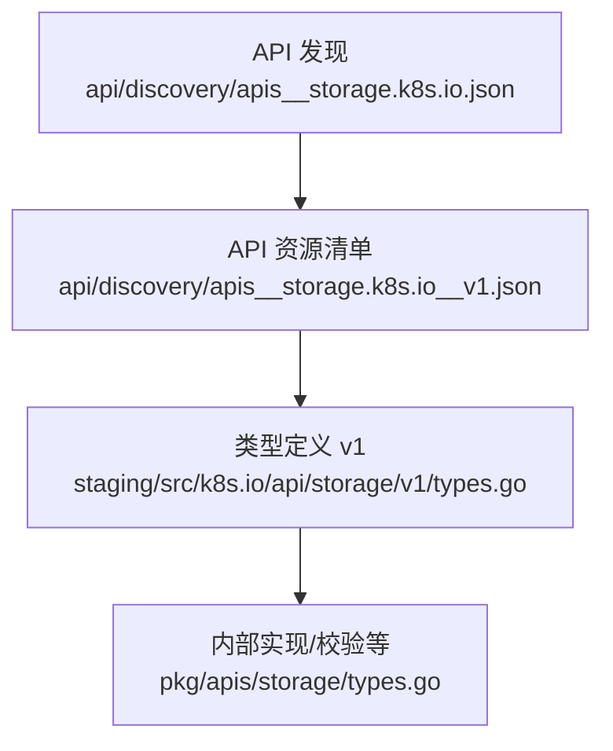
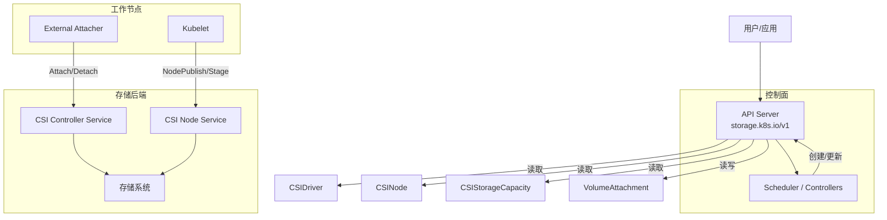
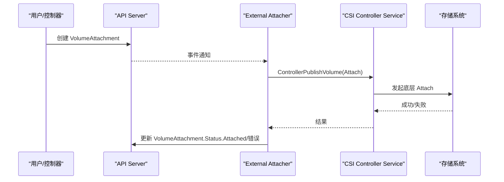
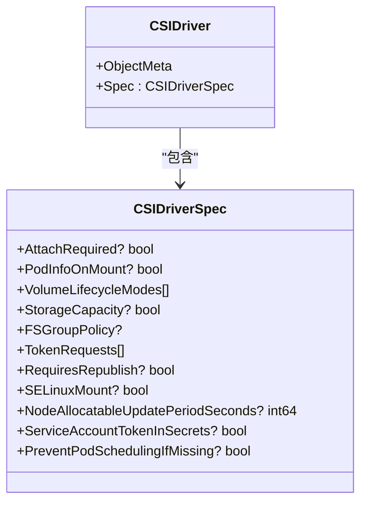
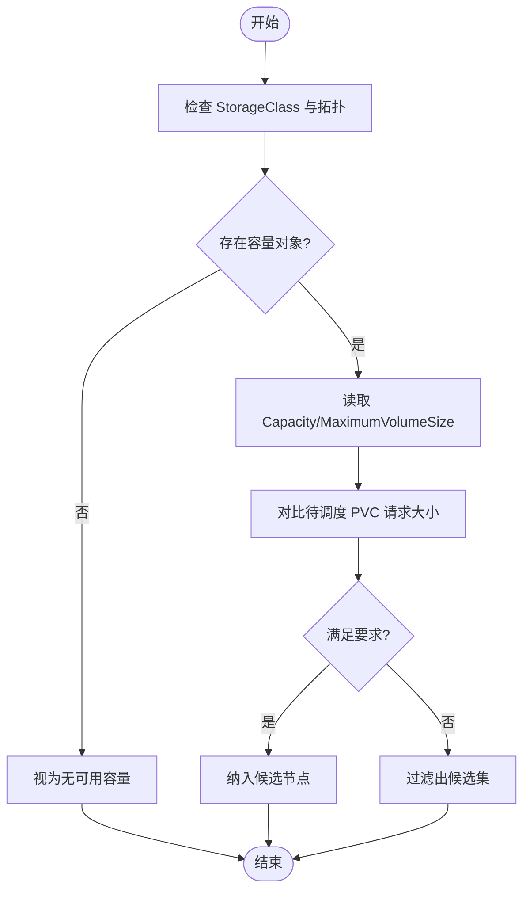
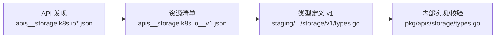

# 存储 API

<cite>
**本文引用的文件**   
- [apis__storage.k8s.io.json](file://api/discovery/apis__storage.k8s.io.json)
- [apis__storage.k8s.io__v1.json](file://api/discovery/apis__storage.k8s.io__v1.json)
- [types.go（pkg/apis/storage）](file://pkg/apis/storage/types.go)
- [types.go（staging/src/k8s.io/api/storage/v1）](file://staging/src/k8s.io/api/storage/v1/types.go)
</cite>

## 目录
1. [简介](#简介)
2. [项目结构](#项目结构)
3. [核心组件](#核心组件)
4. [架构总览](#架构总览)
5. [详细组件分析](#详细组件分析)
6. [依赖关系分析](#依赖关系分析)
7. [性能与容量规划](#性能与容量规划)
8. [故障排查指南](#故障排查指南)
9. [结论](#结论)
10. [附录：API 参考与示例路径](#附录api-参考与示例路径)

## 简介
本文件为 Kubernetes Storage API 组（storage.k8s.io）的 REST API 参考文档，聚焦以下资源：StorageClass、VolumeAttachment、CSIDriver、CSINode、CSIStorageCapacity、VolumeAttributesClass。文档涵盖动态卷供应、存储配额管理、数据持久化机制、CSI 插件集成要点、性能调优与备份恢复策略，以及常见存储后端的配置方法与故障排查技巧。

## 项目结构
Kubernetes 将 storage.k8s.io 组的 API 定义与发现信息分别维护在 discovery 与 staging 源码中：
- discovery 提供 APIGroup 与 APIResourceList，用于客户端发现可用资源与动词能力
- staging 提供 v1 版本的类型定义（JSON/protobuf 注解），是 API 契约的来源

图示来源
- [apis__storage.k8s.io.json:1-16](file://api/discovery/apis__storage.k8s.io.json#L1-L16)
- [apis__storage.k8s.io__v1.json:1-127](file://api/discovery/apis__storage.k8s.io__v1.json#L1-L127)
- [types.go（staging/src/k8s.io/api/storage/v1）:1-835](file://staging/src/k8s.io/api/storage/v1/types.go#L1-L835)
- [types.go（pkg/apis/storage）:1-794](file://pkg/apis/storage/types.go#L1-L794)

章节来源
- [apis__storage.k8s.io.json:1-16](file://api/discovery/apis__storage.k8s.io.json#L1-L16)
- [apis__storage.k8s.io__v1.json:1-127](file://api/discovery/apis__storage.k8s.io__v1.json#L1-L127)

## 核心组件
本节概述 storage.k8s.io/v1 的核心资源及其职责：
- StorageClass：描述“存储类”，指定 provisioner、参数、回收策略、挂载选项、是否允许扩容、绑定模式与拓扑限制
- VolumeAttachment：表达将卷附加到节点的意图，由外部附加器更新状态
- CSIDriver：声明 CSI 驱动的能力与行为（是否需要 attach、是否传递 Pod 信息、生命周期模式、容量感知、fsGroup 策略、令牌注入、SELinux 挂载等）
- CSINode：节点上已安装的 CSI 驱动信息（名称、nodeID、拓扑键、可分配数量）
- CSIStorageCapacity：按拓扑段报告某 StorageClass 的可用容量与最大卷大小，供调度器进行容量感知调度
- VolumeAttributesClass：描述可由 CSI 驱动定义的“可变卷属性”类，支持在线修改卷属性（通过 PVC 引用该类）

章节来源
- [apis__storage.k8s.io__v1.json:1-127](file://api/discovery/apis__storage.k8s.io__v1.json#L1-L127)
- [types.go（staging/src/k8s.io/api/storage/v1）:1-835](file://staging/src/k8s.io/api/storage/v1/types.go#L1-L835)
- [types.go（pkg/apis/storage）:1-794](file://pkg/apis/storage/types.go#L1-L794)

## 架构总览
下图展示 storage.k8s.io 资源在集群中的交互关系：用户创建 StorageClass/PVC，控制器与 CSI 驱动协作完成动态供应；CSI 驱动注册并上报能力与容量；kubelet 根据 CSIDriver/CSINode 决定挂载行为；VolumeAttachment 协调外部附加器完成 attach/detach。

图示来源
- [types.go（staging/src/k8s.io/api/storage/v1）:1-835](file://staging/src/k8s.io/api/storage/v1/types.go#L1-L835)
- [types.go（pkg/apis/storage）:1-794](file://pkg/apis/storage/types.go#L1-L794)

## 详细组件分析

### StorageClass
- 作用：声明动态供应所需的 provisioner 及参数，定义回收策略、挂载选项、是否允许扩容、绑定模式与拓扑限制
- 关键特性
  - Provisioner：必填且不可变（新版本标注），指向具体供应器
  - ReclaimPolicy：Delete/Retain/Recycle（取决于版本与后端）
  - AllowVolumeExpansion：是否允许在线扩容
  - VolumeBindingMode：Immediate 或 WaitForFirstConsumer
  - AllowedTopologies：限制可供应的拓扑范围
- 典型用法：PVC 的 storageClassName 字段引用该对象以触发动态供应

章节来源
- [types.go（staging/src/k8s.io/api/storage/v1）:30-121](file://staging/src/k8s.io/api/storage/v1/types.go#L30-L121)
- [types.go（pkg/apis/storage）:27-94](file://pkg/apis/storage/types.go#L27-L94)

### VolumeAttachment
- 作用：表达将卷附加到节点的意图，由外部附加器（external-attacher）更新 Attached 状态与错误信息
- 关键字段
  - Spec.Attacher：必须与 CSI GetPluginName() 返回一致
  - Source.PersistentVolumeName 或 InlineVolumeSpec（迁移场景）
  - Status.Attached、AttachError、DetachError
- 子资源：/status 支持 get/patch/update

图示来源
- [types.go（staging/src/k8s.io/api/storage/v1）:123-253](file://staging/src/k8s.io/api/storage/v1/types.go#L123-L253)
- [types.go（pkg/apis/storage）:96-214](file://pkg/apis/storage/types.go#L96-L214)

章节来源
- [types.go（staging/src/k8s.io/api/storage/v1）:123-253](file://staging/src/k8s.io/api/storage/v1/types.go#L123-L253)
- [types.go（pkg/apis/storage）:96-214](file://pkg/apis/storage/types.go#L96-L214)

### CSIDriver
- 作用：声明 CSI 驱动能力与行为，影响 attach 流程、Pod 信息传递、生命周期模式、容量感知、fsGroup 策略、令牌注入、SELinux 挂载、节点可分配计数更新周期、缺失驱动时阻止调度等
- 重要字段
  - AttachRequired：是否需要走 attach 流程
  - PodInfoOnMount：是否在 NodePublish 时传入 Pod 上下文
  - VolumeLifecycleModes：Persistent/Ephemeral
  - StorageCapacity：是否启用容量感知调度
  - FSGroupPolicy：ReadWriteOnceWithFSType/File/None
  - TokenRequests/ServiceAccountTokenInSecrets：服务账户令牌注入方式
  - RequiresRepublish：周期性重新发布以反映变更
  - SELinuxMount：是否支持带 context 的挂载
  - NodeAllocatableUpdatePeriodSeconds：节点可分配数量更新周期
  - PreventPodSchedulingIfMissing：缺失驱动时阻止调度（需特性门控）

图示来源
- [types.go（staging/src/k8s.io/api/storage/v1）:255-509](file://staging/src/k8s.io/api/storage/v1/types.go#L255-L509)
- [types.go（pkg/apis/storage）:231-482](file://pkg/apis/storage/types.go#L231-L482)

章节来源
- [types.go（staging/src/k8s.io/api/storage/v1）:255-509](file://staging/src/k8s.io/api/storage/v1/types.go#L255-L509)
- [types.go（pkg/apis/storage）:231-482](file://pkg/apis/storage/types.go#L231-L482)

### CSINode
- 作用：记录节点上已注册的 CSI 驱动信息（名称、nodeID、拓扑键、可分配数量）
- 用途：调度器与上层组件据此判断节点能力与限制

章节来源
- [types.go（staging/src/k8s.io/api/storage/v1）:581-679](file://staging/src/k8s.io/api/storage/v1/types.go#L581-L679)
- [types.go（pkg/apis/storage）:554-645](file://pkg/apis/storage/types.go#L554-L645)

### CSIStorageCapacity
- 作用：按拓扑段报告某 StorageClass 的可用容量与最大卷大小，供容量感知调度使用
- 关键字段
  - NodeTopology：哪些节点可访问该容量
  - StorageClassName：关联的存储类
  - Capacity：可用容量（字节）
  - MaximumVolumeSize：最大可创建卷大小

图示来源
- [types.go（staging/src/k8s.io/api/storage/v1）:681-782](file://staging/src/k8s.io/api/storage/v1/types.go#L681-L782)
- [types.go（pkg/apis/storage）:647-743](file://pkg/apis/storage/types.go#L647-L743)

章节来源
- [types.go（staging/src/k8s.io/api/storage/v1）:681-782](file://staging/src/k8s.io/api/storage/v1/types.go#L681-L782)
- [types.go（pkg/apis/storage）:647-743](file://pkg/apis/storage/types.go#L647-L743)

### VolumeAttributesClass
- 作用：描述可由 CSI 驱动定义的“可变卷属性”类，支持在 PVC 上引用并在供应后变更
- 约束
  - DriverName：不可变
  - Parameters：至少一个键值对，上限与大小限制；无效参数会导致目标 PVC 进入 Infeasible 状态

章节来源
- [types.go（staging/src/k8s.io/api/storage/v1）:784-835](file://staging/src/k8s.io/api/storage/v1/types.go#L784-L835)
- [types.go（pkg/apis/storage）:745-794](file://pkg/apis/storage/types.go#L745-L794)

## 依赖关系分析
- 资源发现：apis__storage.k8s.io.json 声明 group 与首选版本；apis__storage.k8s.io__v1.json 列出资源名、命名空间性、短名与支持的动词
- 类型契约：staging/src/k8s.io/api/storage/v1/types.go 提供 JSON/protobuf 注解与字段语义
- 内部实现：pkg/apis/storage/types.go 提供内部类型与默认/转换/校验逻辑

图示来源
- [apis__storage.k8s.io.json:1-16](file://api/discovery/apis__storage.k8s.io.json#L1-L16)
- [apis__storage.k8s.io__v1.json:1-127](file://api/discovery/apis__storage.k8s.io__v1.json#L1-L127)
- [types.go（staging/src/k8s.io/api/storage/v1）:1-835](file://staging/src/k8s.io/api/storage/v1/types.go#L1-L835)
- [types.go（pkg/apis/storage）:1-794](file://pkg/apis/storage/types.go#L1-L794)

章节来源
- [apis__storage.k8s.io.json:1-16](file://api/discovery/apis__storage.k8s.io.json#L1-L16)
- [apis__storage.k8s.io__v1.json:1-127](file://api/discovery/apis__storage.k8s.io__v1.json#L1-L127)
- [types.go（staging/src/k8s.io/api/storage/v1）:1-835](file://staging/src/k8s.io/api/storage/v1/types.go#L1-L835)
- [types.go（pkg/apis/storage）:1-794](file://pkg/apis/storage/types.go#L1-L794)

## 性能与容量规划
- 容量感知调度
  - 启用 CSIDriver.Spec.StorageCapacity 后，调度器会优先选择具备足够容量的节点
  - CSIStorageCapacity 的 MaximumVolumeSize 优先于 Capacity 用于过滤
- 节点卷数量限制
  - CSINodeDriver.Allocatable.Count 表示单节点可挂载的唯一卷上限
  - CSIDriver.Spec.NodeAllocatableUpdatePeriodSeconds 控制可分配数量更新周期（需特性门控）
- 绑定模式与拓扑
  - VolumeBindingMode=WaitForFirstConsumer 可在 Pod 调度时结合拓扑与容量信息进行更精准的绑定
  - StorageClass.AllowedTopologies 限制可供应的拓扑范围
- 扩容与再发布
  - StorageClass.AllowVolumeExpansion 允许在线扩容
  - CSIDriver.Spec.RequiresRepublish 使 kubelet 周期性调用 NodePublish 以反映卷内容变化

章节来源
- [types.go（staging/src/k8s.io/api/storage/v1）:30-121](file://staging/src/k8s.io/api/storage/v1/types.go#L30-L121)
- [types.go（staging/src/k8s.io/api/storage/v1）:255-509](file://staging/src/k8s.io/api/storage/v1/types.go#L255-L509)
- [types.go（staging/src/k8s.io/api/storage/v1）:581-679](file://staging/src/k8s.io/api/storage/v1/types.go#L581-L679)
- [types.go（staging/src/k8s.io/api/storage/v1）:681-782](file://staging/src/k8s.io/api/storage/v1/types.go#L681-L782)

## 故障排查指南
- VolumeAttachment 异常
  - 检查 Status.Attached 是否为 true，查看 AttachError/DetachError 的 Message 与 ErrorCode
  - 确认 Spec.Attacher 与 CSI GetPluginName() 一致
- CSI 驱动未就绪
  - 若 CSIDriver.Spec.PreventPodSchedulingIfMissing 开启，缺少驱动的节点将被拒绝调度
  - 核对 CSINode.Drivers 列表是否包含对应驱动与 nodeID
- 容量不足导致无法调度
  - 检查是否存在匹配的 CSIStorageCapacity 对象（StorageClassName 与 NodeTopology）
  - 确认 MaximumVolumeSize/Capacity 是否满足 PVC 请求
- 令牌注入问题
  - 若启用 ServiceAccountTokenInSecrets，确保 CSI 驱动从 Secrets 字段读取令牌而非 VolumeContext
- 权限与 fsGroup
  - 根据 FSGroupPolicy 选择合适的策略，避免因权限不匹配导致挂载失败

章节来源
- [types.go（staging/src/k8s.io/api/storage/v1）:123-253](file://staging/src/k8s.io/api/storage/v1/types.go#L123-L253)
- [types.go（staging/src/k8s.io/api/storage/v1）:255-509](file://staging/src/k8s.io/api/storage/v1/types.go#L255-L509)
- [types.go（staging/src/k8s.io/api/storage/v1）:581-679](file://staging/src/k8s.io/api/storage/v1/types.go#L581-L679)
- [types.go（staging/src/k8s.io/api/storage/v1）:681-782](file://staging/src/k8s.io/api/storage/v1/types.go#L681-L782)

## 结论
storage.k8s.io/v1 提供了完整的存储抽象与 CSI 集成能力。通过 StorageClass 定义供应策略，借助 CSIDriver/CSINode/CSIStorageCapacity 实现能力与容量感知，配合 VolumeAttachment 完成跨节点卷的附加与卸载。合理配置绑定模式、拓扑与容量信息，可实现高效、可靠的动态卷供应与数据持久化。

## 附录：API 参考与示例路径
- 资源清单与动词能力
  - 参考：[apis__storage.k8s.io__v1.json:1-127](file://api/discovery/apis__storage.k8s.io__v1.json#L1-L127)
- 类型定义（JSON/protobuf 注解）
  - 参考：[types.go（staging/src/k8s.io/api/storage/v1）:1-835](file://staging/src/k8s.io/api/storage/v1/types.go#L1-L835)
- 内部类型与默认/校验
  - 参考：[types.go（pkg/apis/storage）:1-794](file://pkg/apis/storage/types.go#L1-L794)
- 示例清单（仓库内）
  - 存储类示例：cluster/addons/storage-class/
  - 快照相关示例：cluster/addons/volumesnapshots/