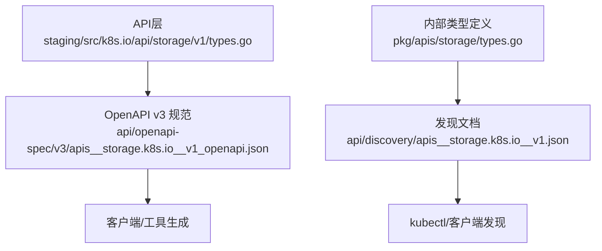
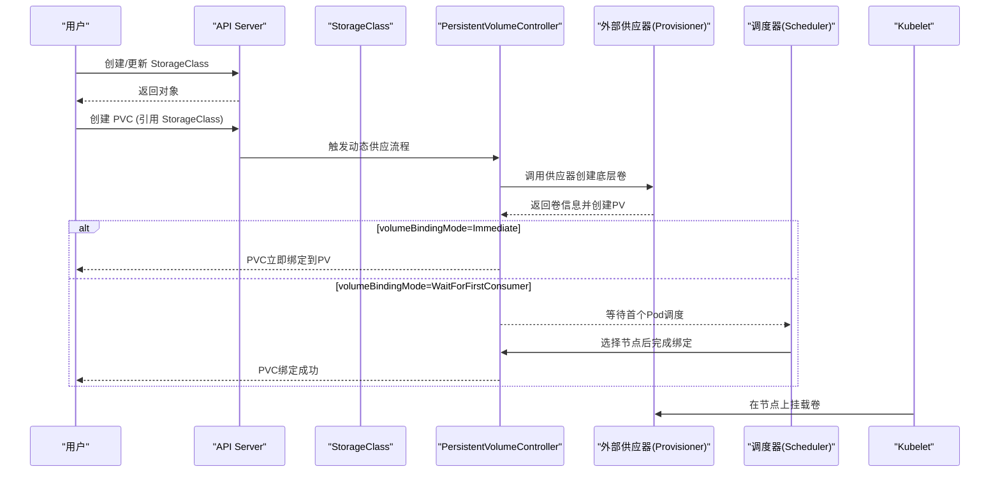
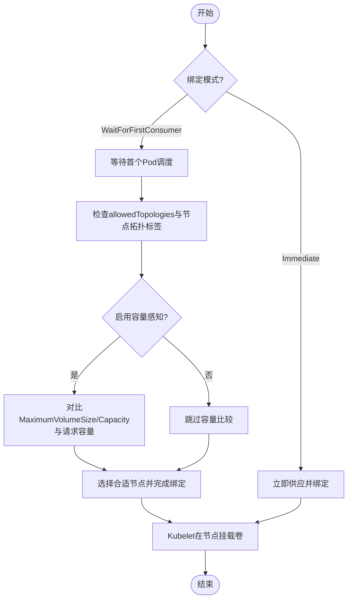
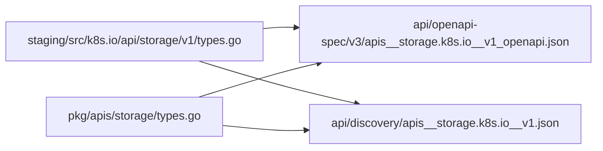

# StorageClass API

<cite>
**本文引用的文件**   
- [staging/src/k8s.io/api/storage/v1/types.go](file://staging/src/k8s.io/api/storage/v1/types.go)
- [pkg/apis/storage/types.go](file://pkg/apis/storage/types.go)
- [api/discovery/apis__storage.k8s.io__v1.json](file://api/discovery/apis__storage.k8s.io__v1.json)
- [api/openapi-spec/v3/apis__storage.k8s.io__v1_openapi.json](file://api/openapi-spec/v3/apis__storage.k8s.io__v1_openapi.json)
</cite>

## 目录
1. [简介](#简介)
2. [项目结构](#项目结构)
3. [核心组件](#核心组件)
4. [架构总览](#架构总览)
5. [详细组件分析](#详细组件分析)
6. [依赖关系分析](#依赖关系分析)
7. [性能考量](#性能考量)
8. [故障排查指南](#故障排查指南)
9. [结论](#结论)
10. [附录](#附录)

## 简介
本文件面向Kubernetes用户与平台工程师，系统化梳理StorageClass资源的REST API规范与实现要点，覆盖以下主题：
- REST资源、版本与动词能力
- StorageClass字段语义与约束（provisioner、parameters、reclaimPolicy、mountOptions、allowVolumeExpansion、volumeBindingMode、allowedTopologies）
- 动态卷供应机制与绑定模式（Immediate与WaitForFirstConsumer）
- 拓扑感知调度与容量感知的原理与使用
- 常见存储后端配置思路与YAML示例路径
- 常见问题定位与性能优化建议

## 项目结构
StorageClass相关API定义位于API层与OpenAPI/Discovery元数据中；内部类型定义同时存在于staging与pkg两个位置。

图示来源
- [staging/src/k8s.io/api/storage/v1/types.go:35-89](file://staging/src/k8s.io/api/storage/v1/types.go#L35-L89)
- [api/openapi-spec/v3/apis__storage.k8s.io__v1_openapi.json:1551-1623](file://api/openapi-spec/v3/apis__storage.k8s.io__v1_openapi.json#L1551-L1623)
- [pkg/apis/storage/types.go:33-80](file://pkg/apis/storage/types.go#L33-L80)
- [api/discovery/apis__storage.k8s.io__v1.json:58-76](file://api/discovery/apis__storage.k8s.io__v1.json#L58-L76)

章节来源
- [staging/src/k8s.io/api/storage/v1/types.go:35-89](file://staging/src/k8s.io/api/storage/v1/types.go#L35-L89)
- [pkg/apis/storage/types.go:33-80](file://pkg/apis/storage/types.go#L33-L80)
- [api/discovery/apis__storage.k8s.io__v1.json:58-76](file://api/discovery/apis__storage.k8s.io__v1.json#L58-L76)
- [api/openapi-spec/v3/apis__storage.k8s.io__v1_openapi.json:1551-1623](file://api/openapi-spec/v3/apis__storage.k8s.io__v1_openapi.json#L1551-L1623)

## 核心组件
- StorageClass：描述一类可动态供应持久卷的参数集合，非命名空间级资源。
- VolumeBindingMode：控制PVC的供应与绑定时机（Immediate或WaitForFirstConsumer）。
- 关联资源：CSIDriver、CSIStorageCapacity、VolumeAttachment等用于扩展与状态表达。

关键要点
- provisioner为必填字段，标识外部供应器名称。
- parameters为键值对，透传给供应器，系统不做强校验。
- reclaimPolicy默认Delete，控制PV回收策略。
- mountOptions为挂载参数列表，不验证，无效将导致挂载失败。
- allowVolumeExpansion控制是否允许扩容。
- volumeBindingMode控制绑定时机，未设置时默认为Immediate。
- allowedTopologies限制可供应的节点拓扑范围。

章节来源
- [staging/src/k8s.io/api/storage/v1/types.go:35-89](file://staging/src/k8s.io/api/storage/v1/types.go#L35-L89)
- [staging/src/k8s.io/api/storage/v1/types.go:107-121](file://staging/src/k8s.io/api/storage/v1/types.go#L107-L121)
- [api/openapi-spec/v3/apis__storage.k8s.io__v1_openapi.json:1551-1623](file://api/openapi-spec/v3/apis__storage.k8s.io__v1_openapi.json#L1551-L1623)

## 架构总览
StorageClass通过API Server暴露REST接口，控制器与调度器协同完成动态供应与绑定。

图示来源
- [api/discovery/apis__storage.k8s.io__v1.json:58-76](file://api/discovery/apis__storage.k8s.io__v1.json#L58-L76)
- [staging/src/k8s.io/api/storage/v1/types.go:107-121](file://staging/src/k8s.io/api/storage/v1/types.go#L107-L121)

## 详细组件分析

### StorageClass REST API 规范
- 资源名与短名
  - 资源名：storageclasses
  - 短名：sc
  - 命名空间：否（集群级）
- 支持的动词
  - create、delete、deletecollection、get、list、patch、update、watch
- 版本与组
  - groupVersion：storage.k8s.io/v1

章节来源
- [api/discovery/apis__storage.k8s.io__v1.json:58-76](file://api/discovery/apis__storage.k8s.io__v1.json#L58-L76)

### StorageClass 字段详解
- provisioner（必填）
  - 含义：指定负责为该类卷进行动态供应的外部供应器名称。
  - 约束：不可变（新版本标记），必须提供。
- parameters（可选）
  - 含义：供应器自定义参数，以键值对形式传递。
  - 约束：键非空，数量与大小上限由实现决定；系统不做强校验。
- reclaimPolicy（可选）
  - 含义：动态创建的PV的回收策略，默认Delete。
  - 取值：Retain/Delete/Recycle（取决于后端支持）。
- mountOptions（可选）
  - 含义：挂载选项列表，如只读、软挂载等。
  - 注意：不验证，若无效将导致挂载失败。
- allowVolumeExpansion（可选）
  - 含义：是否允许对该类卷进行扩容。
- volumeBindingMode（可选）
  - 含义：PVC的供应与绑定时机。
  - 取值：
    - Immediate：立即供应并绑定。
    - WaitForFirstConsumer：等到首个引用该PVC的Pod被调度后再进行供应与绑定。
  - 注意：需要启用VolumeScheduling特性。
- allowedTopologies（可选）
  - 含义：限制可动态供应卷的节点拓扑范围。
  - 注意：需要启用VolumeScheduling特性。

章节来源
- [staging/src/k8s.io/api/storage/v1/types.go:35-89](file://staging/src/k8s.io/api/storage/v1/types.go#L35-L89)
- [staging/src/k8s.io/api/storage/v1/types.go:107-121](file://staging/src/k8s.io/api/storage/v1/types.go#L107-L121)
- [api/openapi-spec/v3/apis__storage.k8s.io__v1_openapi.json:1551-1623](file://api/openapi-spec/v3/apis__storage.k8s.io__v1_openapi.json#L1551-L1623)

### 动态卷供应机制
- 触发条件
  - 用户创建PVC并引用StorageClass。
- 主要参与者
  - PersistentVolumeController：协调供应流程。
  - 外部供应器（Provisioner）：根据StorageClass.provisioner与parameters创建底层卷。
  - Scheduler：当volumeBindingMode=WaitForFirstConsumer时参与决策。
  - Kubelet：在目标节点执行挂载。
- 生命周期
  - 创建PV -> 绑定PVC -> 节点挂载 -> 容器使用。

章节来源
- [staging/src/k8s.io/api/storage/v1/types.go:35-89](file://staging/src/k8s.io/api/storage/v1/types.go#L35-L89)
- [staging/src/k8s.io/api/storage/v1/types.go:107-121](file://staging/src/k8s.io/api/storage/v1/types.go#L107-L121)

### 绑定模式：Immediate vs WaitForFirstConsumer
- Immediate
  - 行为：PVC创建后立即尝试供应并绑定。
  - 适用：无需考虑拓扑或容量信息的场景。
  - 影响：可能跨拓扑分配，存在跨区/跨主机访问延迟风险。
- WaitForFirstConsumer
  - 行为：等待首个引用PVC的Pod被调度后，结合调度上下文（节点拓扑、容量信息）完成供应与绑定。
  - 适用：需要拓扑感知或容量感知的场景。
  - 影响：首次绑定有额外调度开销，但可获得更优放置与更低延迟。

章节来源
- [staging/src/k8s.io/api/storage/v1/types.go:107-121](file://staging/src/k8s.io/api/storage/v1/types.go#L107-L121)

### 拓扑感知调度与容量感知
- 拓扑感知
  - 通过allowedTopologies限定可供应的拓扑域。
  - CSINode.topologyKeys声明驱动支持的拓扑键，调度器据此过滤节点。
- 容量感知
  - CSIDriverSpec.storageCapacity=true时，驱动通过CSIStorageCapacity上报各拓扑段可用容量与最大卷尺寸。
  - 调度器在WaitForFirstConsumer模式下比较请求容量与MaximumVolumeSize/Capacity，过滤不可用节点。

图示来源
- [staging/src/k8s.io/api/storage/v1/types.go:107-121](file://staging/src/k8s.io/api/storage/v1/types.go#L107-L121)
- [pkg/apis/storage/types.go:649-729](file://pkg/apis/storage/types.go#L649-L729)

章节来源
- [pkg/apis/storage/types.go:649-729](file://pkg/apis/storage/types.go#L649-L729)

### YAML配置示例与参考
- 基础StorageClass（仅展示字段说明，不包含具体代码内容）
  - 关键字段：provisioner、parameters、reclaimPolicy、mountOptions、allowVolumeExpansion、volumeBindingMode、allowedTopologies。
  - 参考路径：[staging/src/k8s.io/api/storage/v1/types.go:35-89](file://staging/src/k8s.io/api/storage/v1/types.go#L35-L89)
- 不同存储后端
  - 通过provisioner与parameters区分不同后端（例如云厂商CSI驱动或本地存储驱动）。
  - 参考路径：[staging/src/k8s.io/api/storage/v1/types.go:35-89](file://staging/src/k8s.io/api/storage/v1/types.go#L35-89)
- 拓扑与容量
  - 配合allowedTopologies与CSIStorageCapacity使用。
  - 参考路径：[pkg/apis/storage/types.go:649-729](file://pkg/apis/storage/types.go#L649-L729)

章节来源
- [staging/src/k8s.io/api/storage/v1/types.go:35-89](file://staging/src/k8s.io/api/storage/v1/types.go#L35-89)
- [pkg/apis/storage/types.go:649-729](file://pkg/apis/storage/types.go#L649-L729)

## 依赖关系分析
- API层与OpenAPI/Discovery的关系
  - staging/src/k8s.io/api/storage/v1/types.go定义数据结构。
  - api/openapi-spec/v3/apis__storage.k8s.io__v1_openapi.json导出OpenAPI Schema。
  - api/discovery/apis__storage.k8s.io__v1.json提供资源发现信息（资源名、动词、短名等）。
- 内部类型与外部API的一致性
  - pkg/apis/storage/types.go包含内部类型定义，与staging对外API保持一致。

图示来源
- [staging/src/k8s.io/api/storage/v1/types.go:35-89](file://staging/src/k8s.io/api/storage/v1/types.go#L35-L89)
- [pkg/apis/storage/types.go:33-80](file://pkg/apis/storage/types.go#L33-L80)
- [api/openapi-spec/v3/apis__storage.k8s.io__v1_openapi.json:1551-1623](file://api/openapi-spec/v3/apis__storage.k8s.io__v1_openapi.json#L1551-L1623)
- [api/discovery/apis__storage.k8s.io__v1.json:58-76](file://api/discovery/apis__storage.k8s.io__v1.json#L58-L76)

章节来源
- [staging/src/k8s.io/api/storage/v1/types.go:35-89](file://staging/src/k8s.io/api/storage/v1/types.go#L35-L89)
- [pkg/apis/storage/types.go:33-80](file://pkg/apis/storage/types.go#L33-L80)
- [api/openapi-spec/v3/apis__storage.k8s.io__v1_openapi.json:1551-1623](file://api/openapi-spec/v3/apis__storage.k8s.io__v1_openapi.json#L1551-L1623)
- [api/discovery/apis__storage.k8s.io__v1.json:58-76](file://api/discovery/apis__storage.k8s.io__v1.json#L58-L76)

## 性能考量
- 绑定模式选择
  - Immediate：减少调度等待，适合无拓扑/容量要求的场景。
  - WaitForFirstConsumer：引入首次绑定的调度开销，但能获得更好的拓扑与容量匹配，降低跨区/跨主机访问延迟。
- 拓扑与容量感知
  - 合理设置allowedTopologies可减少不必要的候选节点搜索。
  - 启用CSIStorageCapacity有助于调度器提前过滤不可用节点，避免失败重试。
- 参数与挂载选项
  - parameters与mountOptions应避免过多或复杂配置，减少供应器处理与挂载失败概率。
- 扩容与回收
  - allowVolumeExpansion开启后，扩容操作会带来额外的I/O与一致性检查成本，应评估业务需求。
  - reclaimPolicy=Retain会保留数据，便于审计与迁移，但需人工清理。

[本节为通用指导，不涉及具体文件分析]

## 故障排查指南
- 常见错误与定位
  - 挂载失败：检查mountOptions是否有效，确认底层驱动支持。
  - 供应失败：核对provisioner名称与parameters是否正确，查看供应器日志。
  - 绑定挂起：若使用WaitForFirstConsumer，确认是否有Pod引用PVC且满足拓扑/容量要求。
  - 拓扑不匹配：检查allowedTopologies与节点拓扑标签是否一致。
  - 容量不足：确认CSIStorageCapacity是否上报了足够的MaximumVolumeSize/Capacity。
- 诊断步骤
  - 查看StorageClass与PVC事件，确认绑定阶段与错误原因。
  - 检查CSIDriver与CSIStorageCapacity对象，确认驱动能力与容量信息。
  - 观察调度器日志，确认WaitForFirstConsumer阶段的过滤与选择逻辑。

章节来源
- [staging/src/k8s.io/api/storage/v1/types.go:35-89](file://staging/src/k8s.io/api/storage/v1/types.go#L35-89)
- [staging/src/k8s.io/api/storage/v1/types.go:107-121](file://staging/src/k8s.io/api/storage/v1/types.go#L107-L121)
- [pkg/apis/storage/types.go:649-729](file://pkg/apis/storage/types.go#L649-L729)

## 结论
StorageClass作为动态卷供应的核心抽象，通过provisioner与parameters对接各类存储后端，并通过volumeBindingMode、allowedTopologies与CSIStorageCapacity实现拓扑与容量感知。选择合适的绑定模式与合理的拓扑/容量配置，可在保证数据一致性与低延迟的同时提升整体调度效率与用户体验。

[本节为总结性内容，不涉及具体文件分析]

## 附录
- REST资源清单
  - 资源名：storageclasses
  - 短名：sc
  - 命名空间：否
  - 动词：create、delete、deletecollection、get、list、patch、update、watch
- 版本与组
  - storage.k8s.io/v1

章节来源
- [api/discovery/apis__storage.k8s.io__v1.json:58-76](file://api/discovery/apis__storage.k8s.io__v1.json#L58-L76)