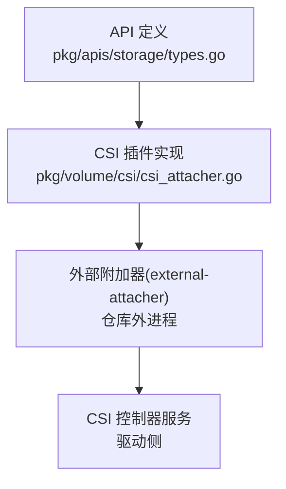
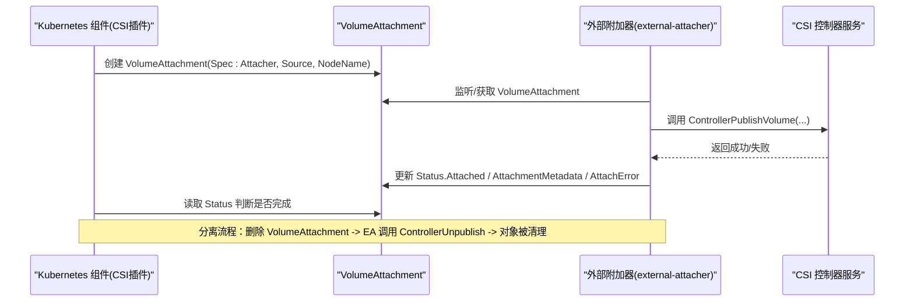
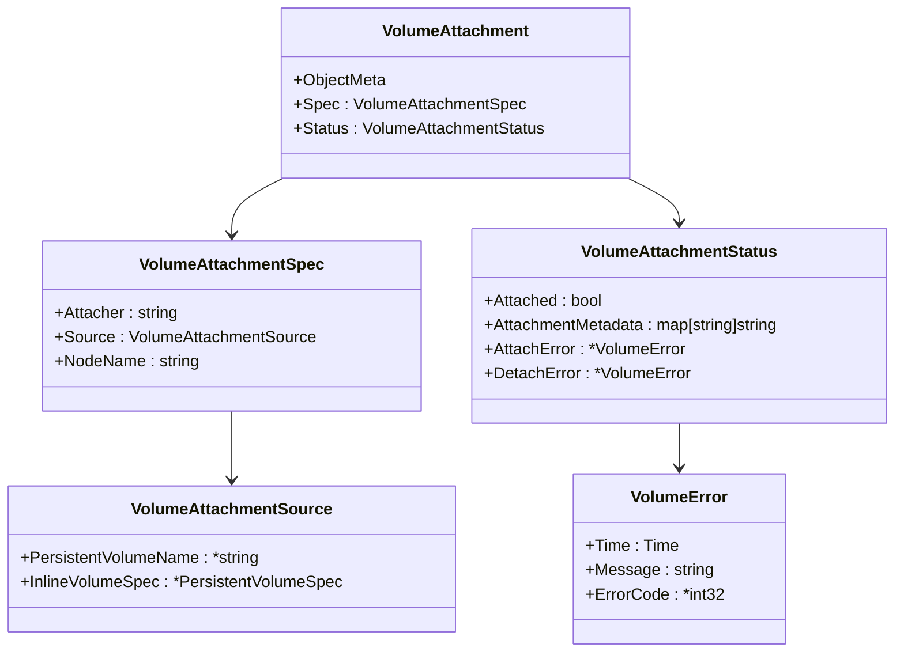
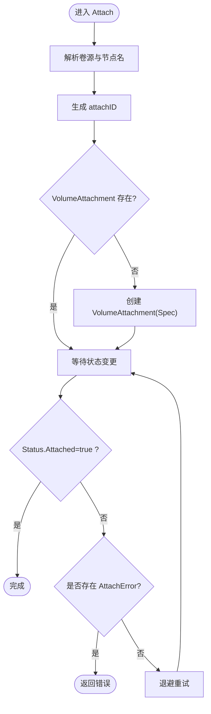
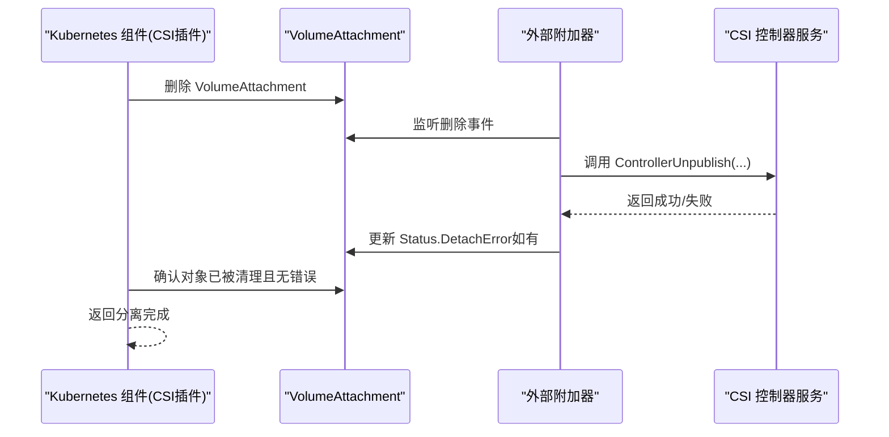
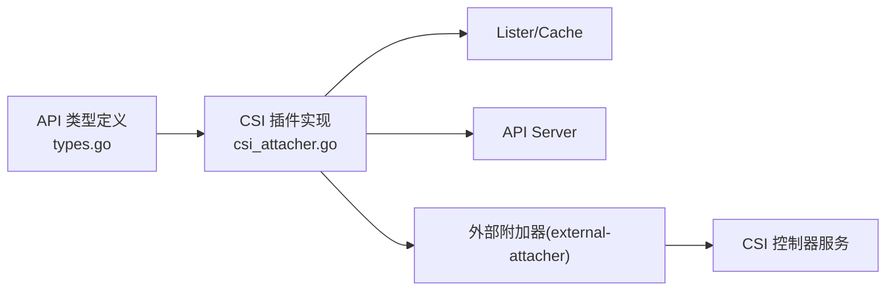

# VolumeAttachment API

<cite>
**本文引用的文件**
- [pkg/apis/storage/types.go](file://pkg/apis/storage/types.go)
- [pkg/volume/csi/csi_attacher.go](file://pkg/volume/csi/csi_attacher.go)
</cite>

## 目录
1. [简介](#简介)
2. [项目结构](#项目结构)
3. [核心组件](#核心组件)
4. [架构总览](#架构总览)
5. [详细组件分析](#详细组件分析)
6. [依赖关系分析](#依赖关系分析)
7. [性能与监控](#性能与监控)
8. [故障诊断指南](#故障诊断指南)
9. [结论](#结论)

## 简介
VolumeAttachment 是 Kubernetes 中用于表达“将卷附加到节点”或“从节点分离卷”意图的集群级资源。它由系统组件（如外部附加器 external-attacher）创建并维护状态，供控制面与节点侧协同完成 CSI 驱动的 ControllerPublish/ControllerUnpublish 流程。其 Spec 描述目标 Attacher、卷源与目标节点；Status 记录附加结果、元数据以及最近一次附加/分离错误。

## 项目结构
本仓库中与 VolumeAttachment 相关的关键定义与实现分布如下：
- API 类型定义位于存储 API 包，包含 VolumeAttachment、VolumeAttachmentSpec、VolumeAttachmentSource、VolumeAttachmentStatus 等结构体。
- CSI 插件在 Attach/Detach 流程中通过创建和等待 VolumeAttachment 对象来驱动外部附加器执行实际操作。

图表来源
- [pkg/apis/storage/types.go:100-214](file://pkg/apis/storage/types.go#L100-L214)
- [pkg/volume/csi/csi_attacher.go:63-139](file://pkg/volume/csi/csi_attacher.go#L63-L139)

章节来源
- [pkg/apis/storage/types.go:100-214](file://pkg/apis/storage/types.go#L100-L214)
- [pkg/volume/csi/csi_attacher.go:63-139](file://pkg/volume/csi/csi_attacher.go#L63-L139)

## 核心组件
- VolumeAttachment：非命名空间资源，表示对某卷在某节点的附加/分离请求。
- VolumeAttachmentSpec：
  - Attacher：负责处理该请求的驱动名称（对应 GetPluginName()）。
  - Source：卷源，支持 PersistentVolumeName 或 InlineVolumeSpec（迁移场景）。
  - NodeName：目标节点名。
- VolumeAttachmentStatus：
  - Attached：是否已成功附加。
  - AttachmentMetadata：成功附加后返回的元数据，供后续 WaitForAttach/Mount 使用。
  - AttachError/DetachError：最近一次附加/分离错误信息（含时间戳与消息）。

章节来源
- [pkg/apis/storage/types.go:100-214](file://pkg/apis/storage/types.go#L100-L214)

## 架构总览
VolumeAttachment 的典型生命周期如下：
- 当需要附加时，Kubernetes 内部组件（例如 CSI 插件在 AttachDetachController 上下文中）创建 VolumeAttachment 对象，指定 Attacher、Source 与 NodeName。
- 外部附加器监听 VolumeAttachment，调用 CSI 控制面接口（如 ControllerPublishVolume），完成后更新 Status.Attached 与可能的 AttachmentMetadata。
- 当需要分离时，删除 VolumeAttachment 对象，外部附加器执行 ControllerUnpublish，并在对象被清理后认为分离完成。

图表来源
- [pkg/volume/csi/csi_attacher.go:63-139](file://pkg/volume/csi/csi_attacher.go#L63-L139)
- [pkg/apis/storage/types.go:135-193](file://pkg/apis/storage/types.go#L135-L193)

## 详细组件分析

### VolumeAttachment 对象模型
- 作用：声明式地表达“在哪个节点上，由哪个 Attacher 把哪个卷附加/分离”的意图。
- 关键属性：
  - Spec.Attacher：字符串形式的驱动名，必须与 CSI 驱动注册名一致。
  - Spec.Source：
    - PersistentVolumeName：指向一个持久卷。
    - InlineVolumeSpec：仅 CSIMigration 场景下支持的内联卷源。
  - Spec.NodeName：目标节点名。
  - Status.Attached：布尔标志，表示是否已附加。
  - Status.AttachmentMetadata：键值对，供后续挂载阶段使用。
  - Status.AttachError/DetachError：最近一次错误，包含时间与消息。

图表来源
- [pkg/apis/storage/types.go:100-214](file://pkg/apis/storage/types.go#L100-L214)

章节来源
- [pkg/apis/storage/types.go:100-214](file://pkg/apis/storage/types.go#L100-L214)

### 附加流程（CSI 插件视角）
- 入口：Attach(spec, nodeName)。
- 行为要点：
  - 校验 spec 并解析卷源。
  - 计算 attachID（基于 volumeHandle、driver、nodeName 的哈希）。
  - 若不存在则创建 VolumeAttachment（填充 Attacher、Source、NodeName）。
  - 轮询/等待 VolumeAttachment.Status.Attached 为 true 或出现错误。
- 等待策略：
  - 优先使用 lister 缓存，未命中再回退至 API Server。
  - 指数退避与超时控制，避免长时间阻塞。

图表来源
- [pkg/volume/csi/csi_attacher.go:63-139](file://pkg/volume/csi/csi_attacher.go#L63-L139)
- [pkg/volume/csi/csi_attacher.go:172-196](file://pkg/volume/csi/csi_attacher.go#L172-L196)
- [pkg/volume/csi/csi_attacher.go:485-524](file://pkg/volume/csi/csi_attacher.go#L485-L524)

章节来源
- [pkg/volume/csi/csi_attacher.go:63-139](file://pkg/volume/csi/csi_attacher.go#L63-L139)
- [pkg/volume/csi/csi_attacher.go:172-196](file://pkg/volume/csi/csi_attacher.go#L172-L196)
- [pkg/volume/csi/csi_attacher.go:485-524](file://pkg/volume/csi/csi_attacher.go#L485-L524)

### 分离流程（CSI 插件视角）
- 入口：Detach(volumeName, nodeName)。
- 行为要点：
  - 解析出 driver 与 volumeHandle，构造 attachID。
  - 删除 VolumeAttachment 对象。
  - 等待对象被清理且无 DetachError，视为分离完成。

图表来源
- [pkg/volume/csi/csi_attacher.go:417-456](file://pkg/volume/csi/csi_attacher.go#L417-L456)
- [pkg/volume/csi/csi_attacher.go:458-483](file://pkg/volume/csi/csi_attacher.go#L458-L483)

章节来源
- [pkg/volume/csi/csi_attacher.go:417-456](file://pkg/volume/csi/csi_attacher.go#L417-L456)
- [pkg/volume/csi/csi_attacher.go:458-483](file://pkg/volume/csi/csi_attacher.go#L458-L483)

### 状态验证与错误传播
- 附加状态验证：
  - 若对象被删除或处于删除中，快速失败。
  - 若 Status.Attached 为 true，视为成功。
  - 若存在 AttachError，直接返回错误消息。
- 分离状态验证：
  - 对象不存在即视为分离成功。
  - 若存在 DetachError，返回错误。

章节来源
- [pkg/volume/csi/csi_attacher.go:625-662](file://pkg/volume/csi/csi_attacher.go#L625-L662)

## 依赖关系分析
- API 层：VolumeAttachment 类型定义于存储 API 包，作为跨组件契约。
- 控制面/插件层：CSI 插件在特定上下文（非 kubelet 路径）中创建/删除 VolumeAttachment，并通过 lister/API 轮询状态。
- 外部附加器：独立进程，监听 VolumeAttachment，协调 CSI 控制器服务完成实际 I/O 操作。

图表来源
- [pkg/apis/storage/types.go:100-214](file://pkg/apis/storage/types.go#L100-L214)
- [pkg/volume/csi/csi_attacher.go:63-139](file://pkg/volume/csi/csi_attacher.go#L63-L139)

章节来源
- [pkg/apis/storage/types.go:100-214](file://pkg/apis/storage/types.go#L100-L214)
- [pkg/volume/csi/csi_attacher.go:63-139](file://pkg/volume/csi/csi_attacher.go#L63-L139)

## 性能与监控
- 等待策略与退避：
  - 使用指数退避与抖动，限制最大间隔与重置周期，避免风暴。
  - 设置整体超时，防止无限期挂起。
- 缓存优先：
  - 优先使用 lister 缓存减少 API 压力；缓存未命中再直连 API Server。
- 可观测性建议：
  - 关注 VolumeAttachment 的创建/删除速率与最终一致性延迟。
  - 统计 Attach/Detach 超时与错误率，结合 AttachError/DetachError 的消息进行归因。
  - 监控外部附加器与 CSI 控制器服务的 RPC 耗时与错误码分布。

[本节为通用指导，不直接分析具体文件]

## 故障诊断指南
- 常见症状与定位：
  - 附加卡住：检查 VolumeAttachment.Status.Attached 是否为 true；若存在 AttachError，查看错误消息与时间戳。
  - 分离卡住：确认 VolumeAttachment 是否已被删除；若存在 DetachError，查看错误消息。
  - 对象缺失：若对象不存在但仍在等待，可能是外部附加器未收到事件或尚未完成操作。
- 排查步骤：
  - 查看 VolumeAttachment 的 Spec 是否正确（Attacher、Source、NodeName）。
  - 检查外部附加器日志，确认是否调用了 CSI 控制面接口及返回值。
  - 核对 CSI 控制器服务健康与权限，确保能访问所需后端资源。
  - 观察 API Server 与 etcd 的一致性延迟，必要时增加等待超时或优化缓存命中率。

章节来源
- [pkg/volume/csi/csi_attacher.go:625-662](file://pkg/volume/csi/csi_attacher.go#L625-L662)
- [pkg/volume/csi/csi_attacher.go:485-524](file://pkg/volume/csi/csi_attacher.go#L485-L524)

## 结论
VolumeAttachment 以声明式方式解耦了“附加意图”与“实际执行”，使外部附加器能够安全、可靠地完成 CSI 控制面操作。通过合理的状态跟踪、错误传播与退避策略，系统能够在复杂环境下保持稳健。运维与开发者应重点关注 VolumeAttachment 的状态与错误字段，并结合外部附加器与 CSI 控制器服务的日志进行端到端排障。