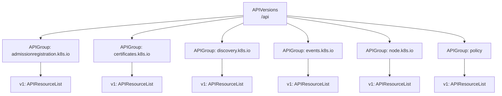
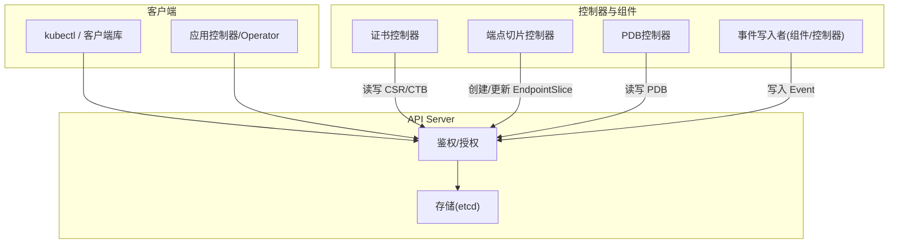
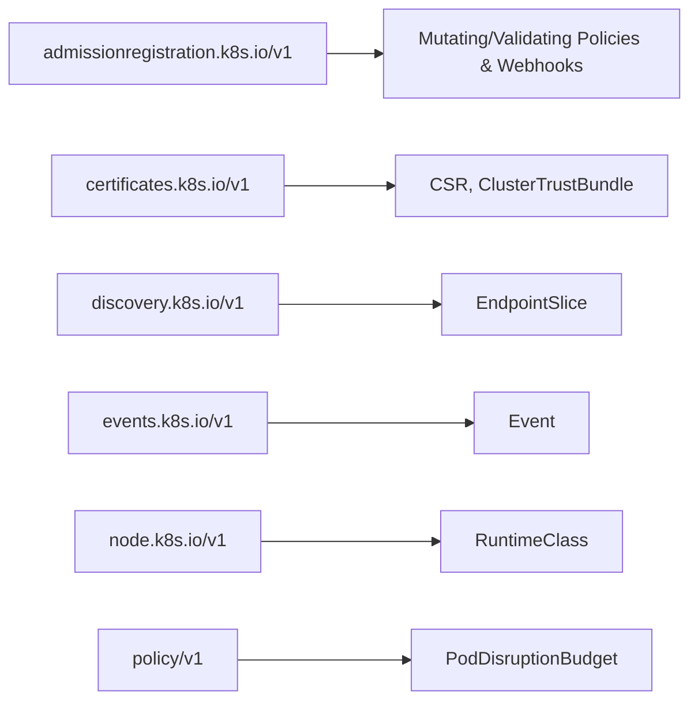

# 其他API组

<cite>
**本文引用的文件**
- [api.json](file://api/discovery/api.json)
- [apis__admissionregistration.k8s.io.json](file://api/discovery/apis__admissionregistration.k8s.io.json)
- [apis__admissionregistration.k8s.io__v1.json](file://api/discovery/apis__admissionregistration.k8s.io__v1.json)
- [apis__certificates.k8s.io.json](file://api/discovery/apis__certificates.k8s.io.json)
- [apis__certificates.k8s.io__v1.json](file://api/discovery/apis__certificates.k8s.io__v1.json)
- [apis__discovery.k8s.io.json](file://api/discovery/apis__discovery.k8s.io.json)
- [apis__discovery.k8s.io__v1.json](file://api/discovery/apis__discovery.k8s.io__v1.json)
- [apis__events.k8s.io.json](file://api/discovery/apis__events.k8s.io.json)
- [apis__events.k8s.io__v1.json](file://api/discovery/apis__events.k8s.io__v1.json)
- [apis__node.k8s.io.json](file://api/discovery/apis__node.k8s.io.json)
- [apis__node.k8s.io__v1.json](file://api/discovery/apis__node.k8s.io__v1.json)
- [apis__policy.json](file://api/discovery/apis__policy.json)
- [apis__policy__v1.json](file://api/discovery/apis__policy__v1.json)
</cite>

## 目录
1. [简介](#简介)
2. [项目结构](#项目结构)
3. [核心组件](#核心组件)
4. [架构总览](#架构总览)
5. [详细组件分析](#详细组件分析)
6. [依赖关系分析](#依赖关系分析)
7. [性能与可用性考虑](#性能与可用性考虑)
8. [故障排查指南](#故障排查指南)
9. [结论](#结论)
10. [附录：常用API使用示例与配置方法](#附录常用api使用示例与配置方法)

## 简介
本参考文档聚焦Kubernetes“其他API组”，包括Admission（准入控制）、Certificates（证书）、Discovery（服务发现）、Events（事件）、Node（节点）和Policy（策略）等。内容基于仓库中已生成的API发现清单，系统梳理各API组的版本、资源集合、命名空间范围、短名以及支持的HTTP动词，并提供协作模式、最佳实践与常见问题解决方案，帮助读者快速掌握这些API组的使用方式与注意事项。

## 项目结构
本节从API发现视角说明仓库中与“其他API组”相关的元数据组织方式。每个API组由一个“APIGroup”描述其名称与可用版本；每个具体版本通过“APIResourceList”列出该版本暴露的资源、是否命名空间隔离、短名及支持的操作动词。

图表来源
- [api.json:1-13](file://api/discovery/api.json#L1-L13)
- [apis__admissionregistration.k8s.io.json:1-24](file://api/discovery/apis__admissionregistration.k8s.io.json#L1-L24)
- [apis__certificates.k8s.io.json:1-20](file://api/discovery/apis__certificates.k8s.io.json#L1-L20)
- [apis__discovery.k8s.io.json:1-16](file://api/discovery/apis__discovery.k8s.io.json#L1-L16)
- [apis__events.k8s.io.json:1-16](file://api/discovery/apis__events.k8s.io.json#L1-L16)
- [apis__node.k8s.io.json:1-16](file://api/discovery/apis__node.k8s.io.json#L1-L16)
- [apis__policy.json:1-16](file://api/discovery/apis__policy.json#L1-L16)

章节来源
- [api.json:1-13](file://api/discovery/api.json#L1-L13)

## 核心组件
- Admission（admissionregistration.k8s.io/v1）
  - 资源：MutatingAdmissionPolicy、MutatingAdmissionPolicyBinding、ValidatingAdmissionPolicy、ValidatingAdmissionPolicyBinding、MutatingWebhookConfiguration、ValidatingWebhookConfiguration
  - 作用：声明式与Webhook两种方式的集群级准入控制策略定义与绑定
- Certificates（certificates.k8s.io/v1）
  - 资源：CertificateSigningRequest（CSR）、ClusterTrustBundle
  - 作用：管理集群信任链与证书签发请求的审批与状态更新
- Discovery（discovery.k8s.io/v1）
  - 资源：EndpointSlice
  - 作用：高性能服务端点发现，替代传统Endpoints
- Events（events.k8s.io/v1）
  - 资源：Event
  - 作用：标准化事件记录与查询
- Node（node.k8s.io/v1）
  - 资源：RuntimeClass
  - 作用：声明容器运行时类，供Pod调度时选择不同运行时
- Policy（policy/v1）
  - 资源：PodDisruptionBudget（PDB）
  - 作用：在滚动升级或故障转移期间保障最小可用副本数

章节来源
- [apis__admissionregistration.k8s.io__v1.json:1-139](file://api/discovery/apis__admissionregistration.k8s.io__v1.json#L1-L139)
- [apis__certificates.k8s.io__v1.json:1-67](file://api/discovery/apis__certificates.k8s.io__v1.json#L1-L67)
- [apis__discovery.k8s.io__v1.json:1-25](file://api/discovery/apis__discovery.k8s.io__v1.json#L1-L25)
- [apis__events.k8s.io__v1.json:1-28](file://api/discovery/apis__events.k8s.io__v1.json#L1-L28)
- [apis__node.k8s.io__v1.json:1-25](file://api/discovery/apis__node.k8s.io__v1.json#L1-L25)
- [apis__policy__v1.json:1-39](file://api/discovery/apis__policy__v1.json#L1-L39)

## 架构总览
下图展示“其他API组”在集群中的典型交互关系：控制器与组件通过REST API读写资源，API Server负责鉴权、审计与持久化，部分资源（如EndpointSlice、Event）由特定组件主动写入。

图表来源
- [apis__certificates.k8s.io__v1.json:1-67](file://api/discovery/apis__certificates.k8s.io__v1.json#L1-L67)
- [apis__discovery.k8s.io__v1.json:1-25](file://api/discovery/apis__discovery.k8s.io__v1.json#L1-L25)
- [apis__policy__v1.json:1-39](file://api/discovery/apis__policy__v1.json#L1-L39)
- [apis__events.k8s.io__v1.json:1-28](file://api/discovery/apis__events.k8s.io__v1.json#L1-L28)

## 详细组件分析

### Admission（admissionregistration.k8s.io/v1）
- 关键资源
  - MutatingAdmissionPolicy / Binding：变更型策略与绑定
  - ValidatingAdmissionPolicy / Binding：校验型策略与绑定
  - MutatingWebhookConfiguration / ValidatingWebhookConfiguration：Webhook式准入控制
- 命名空间：非命名空间（集群级）
- 常用动词：create、get、list、watch、update、patch、delete、deletecollection
- 协作模式
  - 策略对象定义规则，Binding将策略应用到目标资源
  - Webhook配置指向外部服务，API Server在请求路径中调用
- 最佳实践
  - 优先使用声明式策略（Policy/Binging），便于审计与可观测性
  - 谨慎使用Webhook，避免引入额外延迟与单点故障
  - 对高流量资源启用缓存与限流，防止阻塞API Server
- 常见问题
  - 策略冲突：通过优先级与匹配条件明确覆盖顺序
  - Webhook超时：合理设置超时与重试，提供降级逻辑

章节来源
- [apis__admissionregistration.k8s.io.json:1-24](file://api/discovery/apis__admissionregistration.k8s.io.json#L1-L24)
- [apis__admissionregistration.k8s.io__v1.json:1-139](file://api/discovery/apis__admissionregistration.k8s.io__v1.json#L1-L139)

### Certificates（certificates.k8s.io/v1）
- 关键资源
  - CertificateSigningRequest（短名csr）：证书签名请求
  - ClusterTrustBundle（短名ctb）：集群信任束
- 命名空间：非命名空间（集群级）
- 常用动词：create、get、list、watch、update、patch、delete、deletecollection
- 协作模式
  - 组件/用户提交CSR，管理员或控制器审批并更新状态
  - ClusterTrustBundle用于分发受信任根证书
- 最佳实践
  - 最小权限原则：仅授予必要的approve/update/status权限
  - 自动化审批：结合策略与RBAC实现安全可控的自动签发
- 常见问题
  - 审批失败：检查CSR字段、密钥与签名算法是否符合要求
  - 信任链不一致：确保CTB与上游CA一致

章节来源
- [apis__certificates.k8s.io.json:1-20](file://api/discovery/apis__certificates.k8s.io.json#L1-L20)
- [apis__certificates.k8s.io__v1.json:1-67](file://api/discovery/apis__certificates.k8s.io__v1.json#L1-L67)

### Discovery（discovery.k8s.io/v1）
- 关键资源
  - EndpointSlice：命名空间内的高性能端点切片
- 命名空间：命名空间
- 常用动词：create、get、list、watch、update、patch、delete、deletecollection
- 协作模式
  - Service控制器根据Service与后端Pod生成EndpointSlice
  - kube-proxy等组件消费EndpointSlice进行负载均衡
- 最佳实践
  - 使用EndpointSlice替代旧版Endpoints以获得更好的扩展性
  - 关注切片大小与更新频率，避免频繁抖动
- 常见问题
  - 端点不可达：检查网络策略、健康检查与后端Pod状态
  - 同步延迟：确认控制器运行正常且etcd负载可控

章节来源
- [apis__discovery.k8s.io.json:1-16](file://api/discovery/apis__discovery.k8s.io.json#L1-L16)
- [apis__discovery.k8s.io__v1.json:1-25](file://api/discovery/apis__discovery.k8s.io__v1.json#L1-L25)

### Events（events.k8s.io/v1）
- 关键资源
  - Event：命名空间内的事件记录（短名ev）
- 命名空间：命名空间
- 常用动词：create、get、list、watch、update、patch、delete、deletecollection
- 协作模式
  - 组件/控制器/调度器等写入事件，日志聚合系统采集
- 最佳实践
  - 合理设置事件保留策略与采样率，避免存储膨胀
  - 使用结构化字段与原因码，便于检索与分析
- 常见问题
  - 事件丢失：检查事件写入者的重试与幂等逻辑
  - 查询缓慢：利用标签/字段选择器缩小范围

章节来源
- [apis__events.k8s.io.json:1-16](file://api/discovery/apis__events.k8s.io.json#L1-L16)
- [apis__events.k8s.io__v1.json:1-28](file://api/discovery/apis__events.k8s.io__v1.json#L1-L28)

### Node（node.k8s.io/v1）
- 关键资源
  - RuntimeClass：非命名空间的容器运行时类
- 命名空间：非命名空间（集群级）
- 常用动词：create、get、list、watch、update、patch、delete、deletecollection
- 协作模式
  - Pod通过runtimeClassName选择运行时类，调度器据此决策
- 最佳实践
  - 为不同工作负载定义专用RuntimeClass，隔离运行时特性
  - 配合节点标签与污点容忍，提升调度准确性
- 常见问题
  - 运行时未就绪：检查节点上的运行时插件与kubelet配置
  - 调度失败：核对资源需求与节点能力是否匹配

章节来源
- [apis__node.k8s.io.json:1-16](file://api/discovery/apis__node.k8s.io.json#L1-L16)
- [apis__node.k8s.io__v1.json:1-25](file://api/discovery/apis__node.k8s.io__v1.json#L1-L25)

### Policy（policy/v1）
- 关键资源
  - PodDisruptionBudget（短名pdb）：命名空间内的中断预算
- 命名空间：命名空间
- 常用动词：create、get、list、watch、update、patch、delete、deletecollection
- 协作模式
  - 控制器依据PDB限制同时中断的Pod数量，保障可用性
- 最佳实践
  - 为关键服务设置合理的minAvailable/maxUnavailable
  - 与滚动更新策略协同，避免过度保守导致升级缓慢
- 常见问题
  - 无法驱逐：检查PDB约束与当前可用副本数
  - 误配导致雪崩：逐步调整预算并观察指标

章节来源
- [apis__policy.json:1-16](file://api/discovery/apis__policy.json#L1-L16)
- [apis__policy__v1.json:1-39](file://api/discovery/apis__policy__v1.json#L1-L39)

## 依赖关系分析
- 版本与资源映射
  - 每个APIGroup通过preferredVersion指定推荐版本，并通过versions列出所有可用版本
  - 每个版本的APIResourceList包含资源名、是否命名空间、短名与动词集合
- 耦合与内聚
  - 各API组相对独立，主要通过API Server统一鉴权与持久化
  - 控制器与组件对特定资源有强依赖（如Service→EndpointSlice、Pod→Event/PDB）
- 外部依赖
  - 认证与授权：RBAC、Webhook鉴权
  - 存储：etcd
  - 网络：Webhook回调、kube-proxy消费EndpointSlice

图表来源
- [apis__admissionregistration.k8s.io__v1.json:1-139](file://api/discovery/apis__admissionregistration.k8s.io__v1.json#L1-L139)
- [apis__certificates.k8s.io__v1.json:1-67](file://api/discovery/apis__certificates.k8s.io__v1.json#L1-L67)
- [apis__discovery.k8s.io__v1.json:1-25](file://api/discovery/apis__discovery.k8s.io__v1.json#L1-L25)
- [apis__events.k8s.io__v1.json:1-28](file://api/discovery/apis__events.k8s.io__v1.json#L1-L28)
- [apis__node.k8s.io__v1.json:1-25](file://api/discovery/apis__node.k8s.io__v1.json#L1-L25)
- [apis__policy__v1.json:1-39](file://api/discovery/apis__policy__v1.json#L1-L39)

章节来源
- [apis__admissionregistration.k8s.io.json:1-24](file://api/discovery/apis__admissionregistration.k8s.io.json#L1-L24)
- [apis__certificates.k8s.io.json:1-20](file://api/discovery/apis__certificates.k8s.io.json#L1-L20)
- [apis__discovery.k8s.io.json:1-16](file://api/discovery/apis__discovery.k8s.io.json#L1-L16)
- [apis__events.k8s.io.json:1-16](file://api/discovery/apis__events.k8s.io.json#L1-L16)
- [apis__node.k8s.io.json:1-16](file://api/discovery/apis__node.k8s.io.json#L1-L16)
- [apis__policy.json:1-16](file://api/discovery/apis__policy.json#L1-L16)

## 性能与可用性考虑
- 批量操作与分页：对大列表使用list/watch与分页参数，避免一次性拉取全量
- 选择性订阅：使用fieldSelector与labelSelector减少不必要的数据传输
- 速率限制：对高频写操作（如Event、EndpointSlice）实施限流与退避
- 缓存与去抖：客户端侧缓存热点资源，合并频繁更新
- 监控与告警：跟踪API Server延迟、错误率与资源增长趋势

[本节为通用指导，不直接分析具体文件]

## 故障排查指南
- 访问与发现
  - 验证API版本与资源是否存在：先获取APIVersions与APIGroup，再定位具体版本资源
  - 检查serverAddressByClientCIDRs以确认服务端地址可达
- 权限问题
  - 确认RBAC角色具备所需verbs（如update/status、approval等子资源）
- 资源状态异常
  - 查看status子资源与相关事件，定位失败原因
  - 对于Webhook，检查回调连通性与返回码
- 性能问题
  - 分析watch流是否被频繁重建，是否存在大量小对象频繁更新
  - 评估etcd压力与API Server CPU/内存占用

章节来源
- [api.json:1-13](file://api/discovery/api.json#L1-L13)
- [apis__certificates.k8s.io__v1.json:1-67](file://api/discovery/apis__certificates.k8s.io__v1.json#L1-L67)
- [apis__events.k8s.io__v1.json:1-28](file://api/discovery/apis__events.k8s.io__v1.json#L1-L28)

## 结论
通过对Admission、Certificates、Discovery、Events、Node与Policy等API组的系统化梳理，可以清晰把握其职责边界、资源模型与协作方式。遵循最佳实践与排障流程，有助于构建稳定、可扩展且易维护的集群控制面与应用生态。

[本节为总结性内容，不直接分析具体文件]

## 附录：常用API使用示例与配置方法
以下示例以命令形式给出，便于快速上手。请根据实际环境替换命名空间、资源名与值。

- 发现API版本与组
  - 获取API版本：curl https://<apiserver>/api
  - 获取某组信息：curl https://<apiserver>/apis/<group>/<version>
- Admission（admissionregistration.k8s.io/v1）
  - 列出策略：kubectl get mutatingadmissionpolicies
  - 查看Webhook配置：kubectl get validatingwebhookconfigurations
- Certificates（certificates.k8s.io/v1）
  - 提交CSR：kubectl create -f csr.yaml
  - 批准CSR：kubectl certificate approve <csr-name>
  - 查看集群信任束：kubectl get clustertrustbundles
- Discovery（discovery.k8s.io/v1）
  - 查看端点切片：kubectl get endpointslices -n <namespace>
- Events（events.k8s.io/v1）
  - 列出事件：kubectl get events -n <namespace> --sort-by=.metadata.creationTimestamp
- Node（node.k8s.io/v1）
  - 查看运行时类：kubectl get runtimeclasses
- Policy（policy/v1）
  - 创建PDB：kubectl create poddisruptionbudget pdb-name --selector=app=myapp --min-available=1

[本节为概念性示例，不直接分析具体文件]