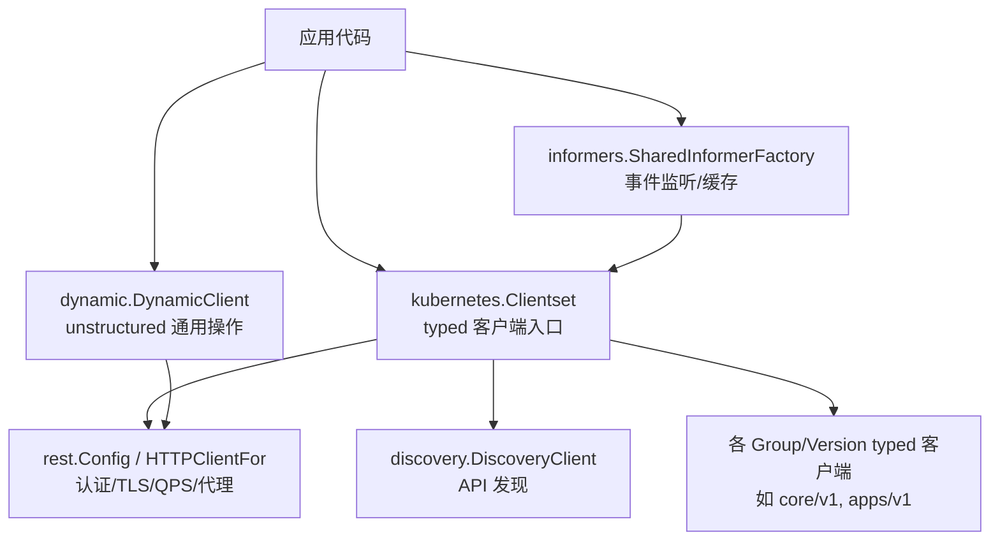
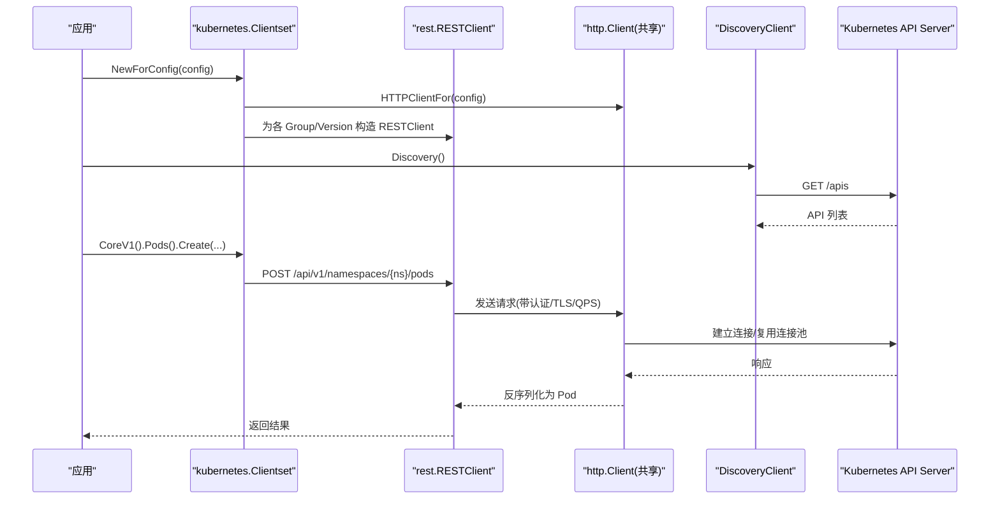
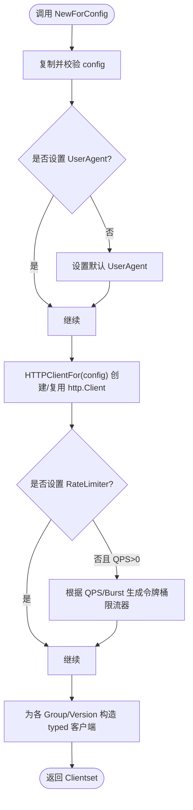
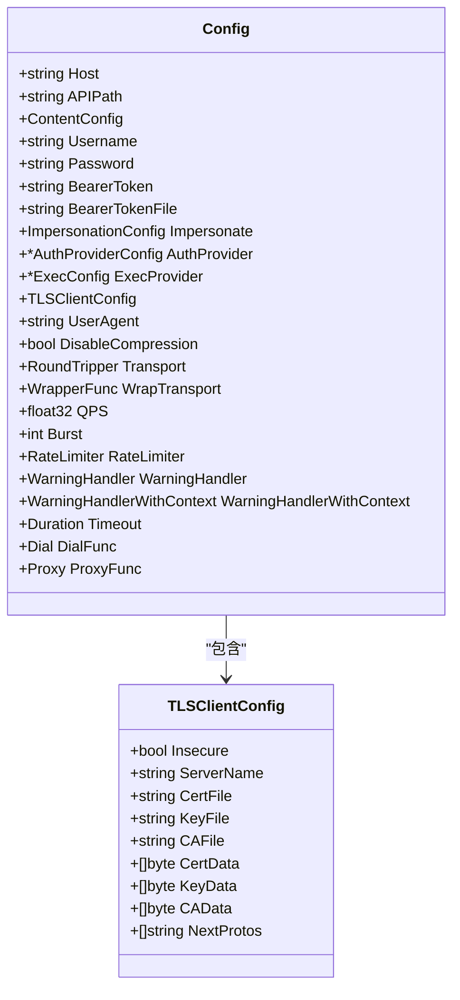
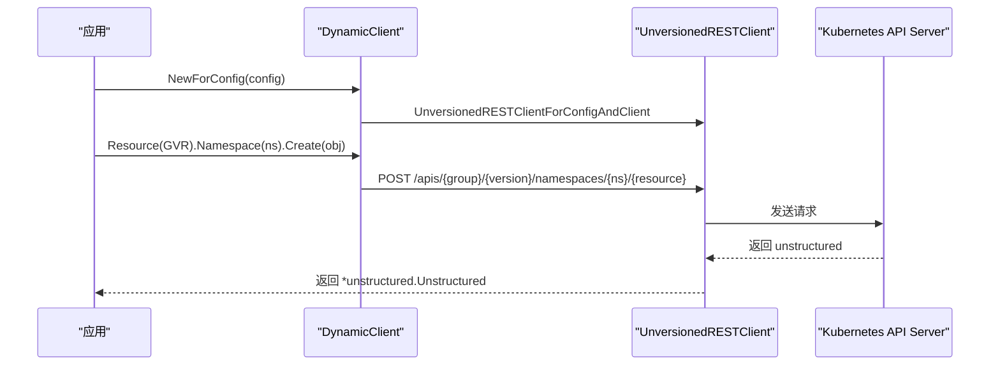
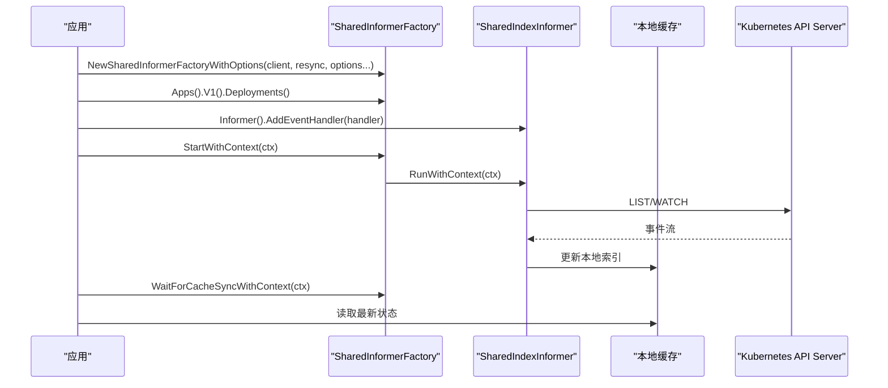
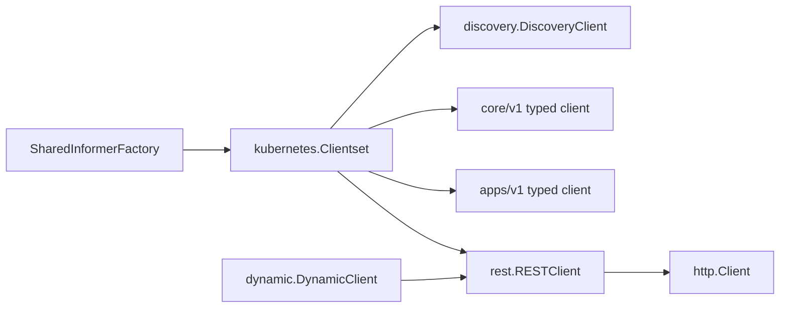

# Go客户端库

<cite>
**本文引用的文件**   
- [README.md](file://staging/src/k8s.io/client-go/README.md)
- [clientset.go](file://staging/src/k8s.io/client-go/kubernetes/clientset.go)
- [config.go](file://staging/src/k8s.io/client-go/rest/config.go)
- [simple.go](file://staging/src/k8s.io/client-go/dynamic/simple.go)
- [factory.go](file://staging/src/k8s.io/client-go/informers/factory.go)
</cite>

## 目录
1. [简介](#简介)
2. [项目结构](#项目结构)
3. [核心组件](#核心组件)
4. [架构总览](#架构总览)
5. [详细组件分析](#详细组件分析)
6. [依赖关系分析](#依赖关系分析)
7. [性能与内存管理](#性能与内存管理)
8. [故障排查指南](#故障排查指南)
9. [结论](#结论)
10. [附录：CRUD操作速查](#附录crud操作速查)

## 简介
本指南面向使用 Kubernetes Go 客户端库的开发者，聚焦 typed client、REST 客户端配置（认证、TLS、连接池）、动态客户端、Informer 机制、错误处理与重试模式、超时控制以及内存管理与性能调优。文档基于仓库中实际源码进行解读，并提供可追溯的文件来源与图示。

## 项目结构
client-go 提供多层次的客户端能力：
- kubernetes 包：生成式 typed clientset，按 API Group/Version 暴露强类型接口
- rest 包：底层 REST 客户端与配置（Config、TLS、QPS/Burst、UserAgent、代理等）
- dynamic 包：运行时发现并操作任意资源（unstructured）
- informers 包：共享 Informer 工厂，统一生命周期与缓存同步

图表来源
- [clientset.go:479-537](file://staging/src/k8s.io/client-go/kubernetes/clientset.go#L479-L537)
- [config.go:323-402](file://staging/src/k8s.io/client-go/rest/config.go#L323-L402)
- [simple.go:76-101](file://staging/src/k8s.io/client-go/dynamic/simple.go#L76-L101)
- [factory.go:129-160](file://staging/src/k8s.io/client-go/informers/factory.go#L129-L160)

章节来源
- [README.md:35-43](file://staging/src/k8s.io/client-go/README.md#L35-L43)

## 核心组件
- typed Clientset：通过 NewForConfig/NewForConfigAndClient 创建，内部复用同一 http.Client，自动设置默认 UserAgent，并在未显式设置 RateLimiter 时根据 QPS/Burst 生成令牌桶限流器。
- REST Config：集中配置 Host、认证（BearerToken/BearerTokenFile、Username/Password、AuthProvider/ExecProvider）、TLS（证书/CA/NextProtos）、内容协商、QPS/Burst、RateLimiter、Timeout、Dial、Proxy、WrapTransport 等。
- Dynamic Client：基于 unstructured 对象，支持 Create/Update/Delete/List/Watch/Patch/Apply 等通用操作，适合 CRD 或未知资源。
- SharedInformerFactory：统一管理 Informer 生命周期、缓存同步、Resync 策略、命名空间过滤、ListOptions 裁剪、Transform 等。

章节来源
- [clientset.go:479-537](file://staging/src/k8s.io/client-go/kubernetes/clientset.go#L479-L537)
- [config.go:56-166](file://staging/src/k8s.io/client-go/rest/config.go#L56-L166)
- [simple.go:34-101](file://staging/src/k8s.io/client-go/dynamic/simple.go#L34-L101)
- [factory.go:59-160](file://staging/src/k8s.io/client-go/informers/factory.go#L59-L160)

## 架构总览
下图展示从应用到 API Server 的关键路径：typed/dynamic/informer 均基于 rest.Config 构建 HTTP 传输层，并通过 discovery 获取可用 API。

图表来源
- [clientset.go:479-537](file://staging/src/k8s.io/client-go/kubernetes/clientset.go#L479-L537)
- [config.go:323-402](file://staging/src/k8s.io/client-go/rest/config.go#L323-L402)

## 详细组件分析

### Typed Client 初始化与基本用法
- 入口：NewForConfig / NewForConfigAndClient
- 关键行为：
  - 若未设置 UserAgent，则填充默认值
  - 复用同一 http.Client，避免重复握手
  - 若未设置 RateLimiter 且 QPS>0，则自动生成令牌桶限流器；Burst 必须大于 0
- 使用方式：通过 Clientset 访问各 Group/Version typed 客户端，例如 CoreV1().Pods()、AppsV1().Deployments()

图表来源
- [clientset.go:479-537](file://staging/src/k8s.io/client-go/kubernetes/clientset.go#L479-L537)

章节来源
- [clientset.go:479-537](file://staging/src/k8s.io/client-go/kubernetes/clientset.go#L479-L537)

### REST 客户端配置选项（认证、TLS、连接池）
- 认证
  - BearerToken/BearerTokenFile：静态令牌或周期性读取令牌文件
  - Username/Password：Basic 认证
  - AuthProvider/ExecProvider：外部插件或 exec 方式获取凭证
  - Impersonate：模拟用户/组/UID/Extra
- TLS
  - Insecure、ServerName、CertFile/CertData、KeyFile/KeyData、CAFile/CAData、NextProtos
  - LoadTLSFiles 可将文件加载为数据字段
- 连接与传输
  - Transport/WrapTransport：自定义 RoundTripper 或中间件
  - Proxy/Dial：代理与拨号函数
  - Timeout：请求超时
  - QPS/Burst/RateLimiter：客户端侧限流
  - DisableCompression：禁用压缩
  - ContentConfig：AcceptContentTypes/ContentType/NegotiatedSerializer
- 便捷方法
  - InClusterConfig：在 Pod 内自动装配 ServiceAccount 令牌与 CA
  - DefaultKubernetesUserAgent：默认 UserAgent 字符串
  - AnonymousClientConfig/CopyConfig：匿名化/拷贝配置

图表来源
- [config.go:56-166](file://staging/src/k8s.io/client-go/rest/config.go#L56-L166)
- [config.go:234-265](file://staging/src/k8s.io/client-go/rest/config.go#L234-L265)

章节来源
- [config.go:56-166](file://staging/src/k8s.io/client-go/rest/config.go#L56-L166)
- [config.go:234-265](file://staging/src/k8s.io/client-go/rest/config.go#L234-L265)
- [config.go:542-577](file://staging/src/k8s.io/client-go/rest/config.go#L542-L577)
- [config.go:594-611](file://staging/src/k8s.io/client-go/rest/config.go#L594-L611)
- [config.go:629-633](file://staging/src/k8s.io/client-go/rest/config.go#L629-L633)
- [config.go:635-660](file://staging/src/k8s.io/client-go/rest/config.go#L635-L660)
- [config.go:662-709](file://staging/src/k8s.io/client-go/rest/config.go#L662-L709)

### 动态客户端（Dynamic Client）
- 适用场景：CRD、未知资源、运行时发现资源
- 构造：NewForConfig/NewForConfigAndClient，内部会设置 JSON/CBOR 协商与基础 Negotiator
- 能力：Resource(GVR).Namespace(ns).Get/List/Create/Update/Delete/Patch/Watch/Apply/ApplyStatus
- URL 组装：根据 Group/Version/Resource/Name 拼接路径

图表来源
- [simple.go:76-101](file://staging/src/k8s.io/client-go/dynamic/simple.go#L76-L101)
- [simple.go:119-146](file://staging/src/k8s.io/client-go/dynamic/simple.go#L119-L146)
- [simple.go:343-362](file://staging/src/k8s.io/client-go/dynamic/simple.go#L343-L362)

章节来源
- [simple.go:40-59](file://staging/src/k8s.io/client-go/dynamic/simple.go#L40-L59)
- [simple.go:76-101](file://staging/src/k8s.io/client-go/dynamic/simple.go#L76-L101)
- [simple.go:119-146](file://staging/src/k8s.io/client-go/dynamic/simple.go#L119-L146)
- [simple.go:148-172](file://staging/src/k8s.io/client-go/dynamic/simple.go#L148-L172)
- [simple.go:200-214](file://staging/src/k8s.io/client-go/dynamic/simple.go#L200-L214)
- [simple.go:230-246](file://staging/src/k8s.io/client-go/dynamic/simple.go#L230-L246)
- [simple.go:248-261](file://staging/src/k8s.io/client-go/dynamic/simple.go#L248-L261)
- [simple.go:263-271](file://staging/src/k8s.io/client-go/dynamic/simple.go#L263-L271)
- [simple.go:273-290](file://staging/src/k8s.io/client-go/dynamic/simple.go#L273-L290)
- [simple.go:292-323](file://staging/src/k8s.io/client-go/dynamic/simple.go#L292-L323)
- [simple.go:329-341](file://staging/src/k8s.io/client-go/dynamic/simple.go#L329-L341)
- [simple.go:343-362](file://staging/src/k8s.io/client-go/dynamic/simple.go#L343-L362)

### Informer 机制（事件监听、缓存与性能）
- SharedInformerFactory：
  - 统一创建/启动/关闭 Informer
  - 支持 WithNamespace、WithTweakListOptions、WithCustomResyncConfig、WithTransform、WithInformerName
  - Start/StartWithContext 启动所有已注册的 Informer
  - WaitForCacheSync/WaitForCacheSyncWithContext 等待缓存同步
- 典型流程：
  - 创建 Factory -> 获取具体 Informer -> AddEventHandler -> Start -> WaitForCacheSync -> 业务逻辑

图表来源
- [factory.go:129-160](file://staging/src/k8s.io/client-go/informers/factory.go#L129-L160)
- [factory.go:162-192](file://staging/src/k8s.io/client-go/informers/factory.go#L162-L192)
- [factory.go:194-239](file://staging/src/k8s.io/client-go/informers/factory.go#L194-L239)
- [factory.go:241-265](file://staging/src/k8s.io/client-go/informers/factory.go#L241-L265)

章节来源
- [factory.go:59-160](file://staging/src/k8s.io/client-go/informers/factory.go#L59-L160)
- [factory.go:162-192](file://staging/src/k8s.io/client-go/informers/factory.go#L162-L192)
- [factory.go:194-239](file://staging/src/k8s.io/client-go/informers/factory.go#L194-L239)
- [factory.go:241-265](file://staging/src/k8s.io/client-go/informers/factory.go#L241-L265)

## 依赖关系分析
- Clientset 依赖 discovery 与各 Group/Version typed 客户端
- typed/dynamic/informer 均依赖 rest.Config 与 HTTP 传输层
- Informer 依赖 kubernetes.Interface 以发起 LIST/WATCH

图表来源
- [clientset.go:479-537](file://staging/src/k8s.io/client-go/kubernetes/clientset.go#L479-L537)
- [simple.go:76-101](file://staging/src/k8s.io/client-go/dynamic/simple.go#L76-L101)
- [factory.go:129-160](file://staging/src/k8s.io/client-go/informers/factory.go#L129-L160)

章节来源
- [clientset.go:479-537](file://staging/src/k8s.io/client-go/kubernetes/clientset.go#L479-L537)
- [simple.go:76-101](file://staging/src/k8s.io/client-go/dynamic/simple.go#L76-L101)
- [factory.go:129-160](file://staging/src/k8s.io/client-go/informers/factory.go#L129-L160)

## 性能与内存管理
- 连接与传输
  - 复用 http.Client：typed Clientset 内部共享，减少握手开销
  - 合理设置 QPS/Burst 或使用自定义 RateLimiter，避免突发流量打满 API Server
  - 使用 WrapTransport 注入日志/指标/重试中间件
- 序列化与协议
  - 动态客户端支持 CBOR 协商（受特性门控影响），可降低带宽与 CPU
- Informer 优化
  - 按需设置 Resync 周期，避免不必要的 LIST 刷新
  - 使用 WithTweakListOptions 限制 List 范围（labelSelector/fieldSelector）
  - 使用 WithTransform 对对象做轻量转换，降低下游处理成本
- 超时与重试
  - 设置 Timeout 控制单次请求耗时
  - 结合 WrapTransport 实现指数退避重试（注意幂等性）
- 内存管理
  - 控制 Informer 缓存规模：仅监听必要 Namespace/Label
  - 及时 RemoveEventHandler 并 Shutdown Factory，避免 goroutine/缓存泄漏
  - 避免持有大对象引用，必要时只保留元信息

[本节为通用建议，不直接分析具体文件]

## 故障排查指南
- 常见错误
  - 未设置 GroupVersion/NegotiatedSerializer：RESTClientFor 会报错
  - 非集群环境调用 InClusterConfig：返回 ErrNotInCluster
  - 未设置 Burst 且启用 QPS：NewForConfigAndClient 会拒绝
- 定位步骤
  - 检查 Config.Host/APIPath 是否正确
  - 确认 BearerToken/BearerTokenFile 或证书路径有效
  - 查看 WrapTransport 日志与指标
  - 使用 WaitForCacheSyncWithContext 的结果判断 Informer 同步失败原因

章节来源
- [config.go:323-350](file://staging/src/k8s.io/client-go/rest/config.go#L323-L350)
- [config.go:542-577](file://staging/src/k8s.io/client-go/rest/config.go#L542-L577)
- [clientset.go:504-511](file://staging/src/k8s.io/client-go/kubernetes/clientset.go#L504-L511)
- [factory.go:194-239](file://staging/src/k8s.io/client-go/informers/factory.go#L194-L239)

## 结论
- 优先使用 typed Clientset 访问稳定 API，配合 Informer 实现高效事件驱动
- 对于 CRD 或未知资源，使用 Dynamic Client 简化开发
- 通过 rest.Config 精细控制认证、TLS、限流与超时
- 在生产环境中重视连接复用、缓存规模、重试与监控

[本节为总结，不直接分析具体文件]

## 附录：CRUD操作速查
- Pod（CoreV1）
  - 创建：CoreV1().Pods(namespace).Create(context, pod, metav1.CreateOptions{})
  - 查询：CoreV1().Pods(namespace).Get(context, name, metav1.GetOptions{})
  - 更新：CoreV1().Pods(namespace).Update(context, pod, metav1.UpdateOptions{})
  - 删除：CoreV1().Pods(namespace).Delete(context, name, metav1.DeleteOptions{})
  - 列表/监听：List/Watch
- Deployment（AppsV1）
  - 创建：AppsV1().Deployments(namespace).Create(context, deploy, metav1.CreateOptions{})
  - 查询/更新/删除：对应 Get/Update/Delete
  - 列表/监听：List/Watch
- 动态客户端（CRD）
  - 构造：dynamic.NewForConfig(config)
  - 操作：Resource(GVR).Namespace(ns).Create/Get/Update/Delete/List/Watch/Patch/Apply

章节来源
- [clientset.go:479-537](file://staging/src/k8s.io/client-go/kubernetes/clientset.go#L479-L537)
- [simple.go:119-146](file://staging/src/k8s.io/client-go/dynamic/simple.go#L119-L146)
- [simple.go:230-246](file://staging/src/k8s.io/client-go/dynamic/simple.go#L230-L246)
- [simple.go:248-261](file://staging/src/k8s.io/client-go/dynamic/simple.go#L248-L261)
- [simple.go:263-271](file://staging/src/k8s.io/client-go/dynamic/simple.go#L263-L271)
- [simple.go:273-290](file://staging/src/k8s.io/client-go/dynamic/simple.go#L273-L290)
- [simple.go:292-323](file://staging/src/k8s.io/client-go/dynamic/simple.go#L292-L323)