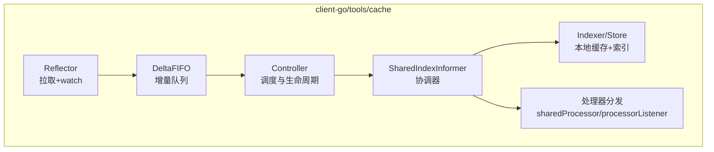
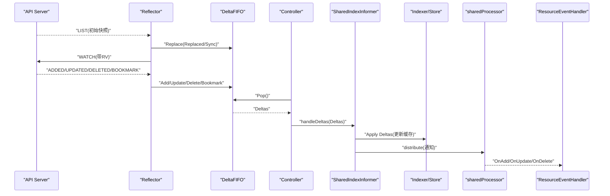
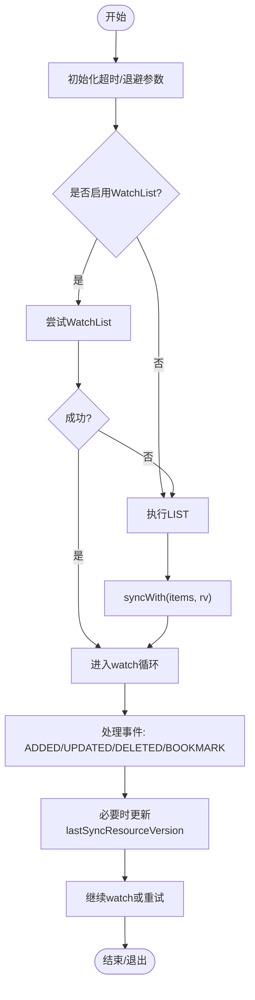
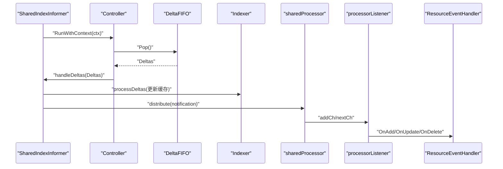
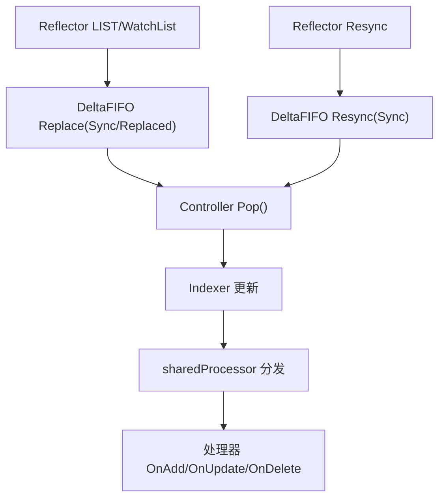
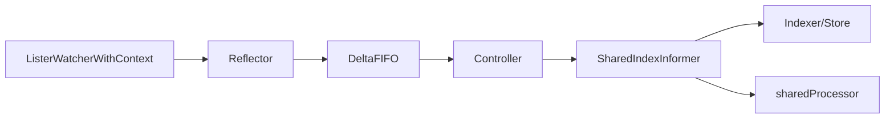

# Informer原理与架构

<cite>
**本文引用的文件**   
- [reflector.go](file://staging/src/k8s.io/client-go/tools/cache/reflector.go)
- [delta_fifo.go](file://staging/src/k8s.io/client-go/tools/cache/delta_fifo.go)
- [store.go](file://staging/src/k8s.io/client-go/tools/cache/store.go)
- [shared_informer.go](file://staging/src/k8s.io/client-go/tools/cache/shared_informer.go)
- [controller.go](file://staging/src/k8s.io/client-go/tools/cache/controller.go)
</cite>

## 目录
1. [简介](#简介)
2. [项目结构](#项目结构)
3. [核心组件](#核心组件)
4. [架构总览](#架构总览)
5. [详细组件分析](#详细组件分析)
6. [依赖关系分析](#依赖关系分析)
7. [性能考量](#性能考量)
8. [故障排查指南](#故障排查指南)
9. [结论](#结论)
10. [附录](#附录)

## 简介
本文件系统性阐述 Kubernetes Informer 机制的核心原理与架构，围绕 Reflector、DeltaFIFO 队列、Indexer/Store 以及 SharedIndexInformer 的内部实现进行深入解析。文档重点说明 API Server 的 watch 机制如何与本地缓存同步、事件传播的完整流程、资源版本管理、并发控制与错误处理机制，并提供架构图与数据流图以直观展示各组件交互关系。同时给出内存模型设计与数据一致性保证机制的分析与建议。

## 项目结构
Informer 相关代码位于 client-go 的 tools/cache 包中，核心文件包括：
- reflector.go：负责从 API Server 拉取初始列表并建立 watch 流，将变更写入 DeltaFIFO。
- delta_fifo.go：提供带去重与合并能力的增量队列，面向“每个对象变更至少处理一次”的消费语义。
- store.go：定义 Store/Indexer 接口及基于 ThreadSafeStore 的实现，支持索引与线程安全访问。
- shared_informer.go：封装 SharedIndexInformer，协调 Controller、DeltaFIFO、Indexer 与处理器分发。
- controller.go：编排 Reflector 与队列消费循环，驱动事件处理流水线。



图表来源
- [reflector.go:105-171](file://staging/src/k8s.io/client-go/tools/cache/reflector.go#L105-L171)
- [delta_fifo.go:108-158](file://staging/src/k8s.io/client-go/tools/cache/delta_fifo.go#L108-L158)
- [shared_informer.go:597-647](file://staging/src/k8s.io/client-go/tools/cache/shared_informer.go#L597-L647)
- [store.go:202-216](file://staging/src/k8s.io/client-go/tools/cache/store.go#L202-L216)

章节来源
- [reflector.go:105-171](file://staging/src/k8s.io/client-go/tools/cache/reflector.go#L105-L171)
- [delta_fifo.go:108-158](file://staging/src/k8s.io/client-go/tools/cache/delta_fifo.go#L108-L158)
- [store.go:202-216](file://staging/src/k8s.io/client-go/tools/cache/store.go#L202-L216)
- [shared_informer.go:597-647](file://staging/src/k8s.io/client-go/tools/cache/shared_informer.go#L597-L647)

## 核心组件
- Reflector：与 API Server 交互，执行 LIST/WATCH（或 WatchList），维护 lastSyncResourceVersion，并将事件转换为 Deltas 写入 DeltaFIFO。
- DeltaFIFO：按对象键聚合 Deltas，支持 Added/Updated/Deleted/Replaced/Sync/Bookmark 等类型，具备去重、替换检测与已知对象感知能力。
- Indexer/Store：线程安全的本地缓存，支持 Add/Update/Delete/List/Get/Replace/Resync 等操作，并可配置索引函数进行二级索引。
- SharedIndexInformer：组合 Controller、DeltaFIFO、Indexer 与处理器分发，提供事件注册、同步状态查询、资源版本暴露等能力。
- Controller：协调 Reflector 与队列 Pop 处理，驱动 HandleDeltas 更新 Indexer 并分发通知。

章节来源
- [reflector.go:105-171](file://staging/src/k8s.io/client-go/tools/cache/reflector.go#L105-L171)
- [delta_fifo.go:108-158](file://staging/src/k8s.io/client-go/tools/cache/delta_fifo.go#L108-L158)
- [store.go:28-82](file://staging/src/k8s.io/client-go/tools/cache/store.go#L28-L82)
- [shared_informer.go:597-647](file://staging/src/k8s.io/client-go/tools/cache/shared_informer.go#L597-L647)

## 架构总览
下图展示了从 API Server 到本地缓存再到用户处理器的端到端数据流。



图表来源
- [reflector.go:470-509](file://staging/src/k8s.io/client-go/tools/cache/reflector.go#L470-L509)
- [reflector.go:561-670](file://staging/src/k8s.io/client-go/tools/cache/reflector.go#L561-L670)
- [delta_fifo.go:619-699](file://staging/src/k8s.io/client-go/tools/cache/delta_fifo.go#L619-L699)
- [shared_informer.go:953-967](file://staging/src/k8s.io/client-go/tools/cache/shared_informer.go#L953-L967)
- [shared_informer.go:1123-1147](file://staging/src/k8s.io/client-go/tools/cache/shared_informer.go#L1123-L1147)

## 详细组件分析

### Reflector 工作原理
- 启动后通过 ListAndWatch 先 LIST 获取初始快照，再 WATCH 持续接收增量事件；若启用 WatchList，则优先使用高效流式方式。
- 维护 lastSyncResourceVersion，并在收到非 Added 事件或已设置 RV 时更新，确保后续请求从正确位置继续。
- 对 watch 错误进行分类处理：过期、TooManyRequests、内部错误重试、EOF 等，配合指数退避与重置策略。
- 支持 Resync 定时器，周期性触发 Store.Resync，用于向消费者推送 Sync 事件。



图表来源
- [reflector.go:470-509](file://staging/src/k8s.io/client-go/tools/cache/reflector.go#L470-L509)
- [reflector.go:561-670](file://staging/src/k8s.io/client-go/tools/cache/reflector.go#L561-L670)
- [reflector.go:674-783](file://staging/src/k8s.io/client-go/tools/cache/reflector.go#L674-L783)

章节来源
- [reflector.go:105-171](file://staging/src/k8s.io/client-go/tools/cache/reflector.go#L105-L171)
- [reflector.go:470-509](file://staging/src/k8s.io/client-go/tools/cache/reflector.go#L470-L509)
- [reflector.go:561-670](file://staging/src/k8s.io/client-go/tools/cache/reflector.go#L561-L670)
- [reflector.go:674-783](file://staging/src/k8s.io/client-go/tools/cache/reflector.go#L674-L783)

### DeltaFIFO 队列设计
- 数据结构：items[key]=Deltas[]，queue=[]string（无重复键）。
- 关键特性：
  - 去重与合并：相邻相同删除事件合并，保留信息更丰富的一个。
  - Replace 原子性：为新列表中的对象生成 Replaced/Sync，并对缺失对象生成 DeletedFinalStateUnknown 删除事件。
  - KnownObjects 感知：结合外部“已知对象”集合，在 Replace/Resync 时补全删除事件。
  - TransformFunc：入队前可转换对象以降低内存占用（需幂等）。
- 同步完成判定：首次 Replace 的所有项被 Pop 后，HasSynced 返回 true。

```mermaid
classDiagram
class DeltaFIFO {
+Add(obj) error
+Update(obj) error
+Delete(obj) error
+Replace(list, rv) error
+Resync() error
+Pop(process) (interface{}, error)
+KeyOf(obj) (string, error)
+HasSynced() bool
-items map[string]Deltas
-queue []string
-knownObjects KeyListerGetter
-transformer TransformFunc
}
class Deltas {
+Oldest() *Delta
+Newest() *Delta
}
class Delta {
+Type DeltaType
+Object interface{}
}
class DeletedFinalStateUnknown {
+Key string
+Obj interface{}
}
DeltaFIFO --> Deltas : "维护"
Deltas --> Delta : "包含"
DeltaFIFO --> DeletedFinalStateUnknown : "可能产生"
```

图表来源
- [delta_fifo.go:108-158](file://staging/src/k8s.io/client-go/tools/cache/delta_fifo.go#L108-L158)
- [delta_fifo.go:210-224](file://staging/src/k8s.io/client-go/tools/cache/delta_fifo.go#L210-L224)
- [delta_fifo.go:619-699](file://staging/src/k8s.io/client-go/tools/cache/delta_fifo.go#L619-L699)
- [delta_fifo.go:793-800](file://staging/src/k8s.io/client-go/tools/cache/delta_fifo.go#L793-L800)

章节来源
- [delta_fifo.go:108-158](file://staging/src/k8s.io/client-go/tools/cache/delta_fifo.go#L108-L158)
- [delta_fifo.go:443-478](file://staging/src/k8s.io/client-go/tools/cache/delta_fifo.go#L443-L478)
- [delta_fifo.go:619-699](file://staging/src/k8s.io/client-go/tools/cache/delta_fifo.go#L619-L699)
- [delta_fifo.go:704-747](file://staging/src/k8s.io/client-go/tools/cache/delta_fifo.go#L704-L747)

### Indexer/Store 内存模型与索引
- Store 接口提供 Add/Update/Delete/List/Get/Replace/Resync 等通用操作，Indexer 扩展了索引能力。
- cache 实现基于 ThreadSafeStore，keyFunc 默认 MetaNamespaceKeyFunc（namespace/name 或 name）。
- Replace 会批量构建 items 映射，再调用底层 ThreadSafeStore.Replace 原子替换，避免中间不一致。
- 支持自定义 TransformFunc 在写入前裁剪字段，降低内存占用。

```mermaid
classDiagram
class Store {
<<interface>>
+Add(obj) error
+Update(obj) error
+Delete(obj) error
+List() []interface{}
+ListKeys() []string
+Get(obj) (item, exists, err)
+GetByKey(key) (item, exists, err)
+Replace(list, rv) error
+Resync() error
}
class Indexer {
<<interface>>
+AddIndexers(indexers) error
+ByIndex(name, value) ([]interface{}, error)
+Index(name, obj) ([]interface{}, error)
}
class cache {
-cacheStorage ThreadSafeStore
-keyFunc KeyFunc
-transformer TransformFunc
+Add/Update/Delete/Replace/...
}
Store <|.. cache
Indexer <|.. cache
```

图表来源
- [store.go:28-82](file://staging/src/k8s.io/client-go/tools/cache/store.go#L28-L82)
- [store.go:202-216](file://staging/src/k8s.io/client-go/tools/cache/store.go#L202-L216)
- [store.go:369-387](file://staging/src/k8s.io/client-go/tools/cache/store.go#L369-L387)

章节来源
- [store.go:28-82](file://staging/src/k8s.io/client-go/tools/cache/store.go#L28-L82)
- [store.go:202-216](file://staging/src/k8s.io/client-go/tools/cache/store.go#L202-L216)
- [store.go:369-387](file://staging/src/k8s.io/client-go/tools/cache/store.go#L369-L387)

### SharedIndexInformer 内部实现
- 组成：indexer、controller、processor、resyncCheckPeriod、clock、blockDeltas 等。
- Run 流程：
  - 创建 DeltaFIFO（作为 Queue）与 Config，构造 Controller。
  - 启动 processor 与 mutation detector，等待控制器 HasSynced 后关闭 informer.synced。
- 事件处理：
  - handleDeltas/handleBatchDeltas 在 blockDeltas 锁下调用 processDeltas 更新 Indexer。
  - OnAdd/OnUpdate/OnDelete 将通知分发至 sharedProcessor，再由各 listener 串行调用用户处理器。
- 资源版本：
  - LastSyncResourceVersion 委托给 controller，最终来自 Reflector 的 lastSyncResourceVersion。
- 并发控制：
  - blockDeltas 用于在添加/移除 handler 时暂停事件分发，保证新 handler 能安全加入并接收初始快照。
  - sharedProcessor 使用读写锁保护 listeners 集合，pop/run 三 goroutine 解耦入队与回调。



图表来源
- [shared_informer.go:728-792](file://staging/src/k8s.io/client-go/tools/cache/shared_informer.go#L728-L792)
- [shared_informer.go:953-967](file://staging/src/k8s.io/client-go/tools/cache/shared_informer.go#L953-L967)
- [shared_informer.go:1123-1147](file://staging/src/k8s.io/client-go/tools/cache/shared_informer.go#L1123-L1147)
- [shared_informer.go:1240-1284](file://staging/src/k8s.io/client-go/tools/cache/shared_informer.go#L1240-L1284)

章节来源
- [shared_informer.go:597-647](file://staging/src/k8s.io/client-go/tools/cache/shared_informer.go#L597-L647)
- [shared_informer.go:728-792](file://staging/src/k8s.io/client-go/tools/cache/shared_informer.go#L728-L792)
- [shared_informer.go:953-967](file://staging/src/k8s.io/client-go/tools/cache/shared_informer.go#L953-L967)
- [shared_informer.go:1123-1147](file://staging/src/k8s.io/client-go/tools/cache/shared_informer.go#L1123-L1147)
- [shared_informer.go:1240-1284](file://staging/src/k8s.io/client-go/tools/cache/shared_informer.go#L1240-L1284)

### 事件传播与同步流程
- 初始同步：Reflector 通过 LIST 或 WatchList 获取快照，DeltaFIFO 以 Replaced/Sync 事件写入，随后被 Pop 并应用至 Indexer。
- 增量同步：API Server 推送 ADDED/UPDATED/DELETED，Reflector 写入 DeltaFIFO，Controller 弹出并更新 Indexer，处理器分发通知。
- Resync：Reflector 定时触发 Store.Resync，DeltaFIFO 为 knownObjects 中未排队对象注入 Sync 事件，处理器仅投递给需要 resync 的监听者。
- 同步完成：当首次 Replace 的所有项被 Pop 后，DeltaFIFO.HasSynced 为真；SharedIndexInformer 在控制器 HasSynced 后关闭自身 synced 通道。



图表来源
- [reflector.go:470-509](file://staging/src/k8s.io/client-go/tools/cache/reflector.go#L470-L509)
- [delta_fifo.go:619-699](file://staging/src/k8s.io/client-go/tools/cache/delta_fifo.go#L619-L699)
- [delta_fifo.go:704-747](file://staging/src/k8s.io/client-go/tools/cache/delta_fifo.go#L704-L747)
- [shared_informer.go:1191-1211](file://staging/src/k8s.io/client-go/tools/cache/shared_informer.go#L1191-L1211)

## 依赖关系分析
- Reflector 依赖 ListerWatcherWithContext 与 ReflectorStore（通常由 DeltaFIFO 实现），并通过 ResourceVersionUpdater 接口回写最新 RV。
- Controller 依赖 Queue（DeltaFIFO）、Process 回调（handleDeltas）与 WatchErrorHandler。
- SharedIndexInformer 依赖 Indexer、Controller、sharedProcessor 与 clock。
- Indexer/Store 依赖 ThreadSafeStore 与可选 TransformFunc。



图表来源
- [reflector.go:105-171](file://staging/src/k8s.io/client-go/tools/cache/reflector.go#L105-L171)
- [shared_informer.go:728-792](file://staging/src/k8s.io/client-go/tools/cache/shared_informer.go#L728-L792)
- [store.go:202-216](file://staging/src/k8s.io/client-go/tools/cache/store.go#L202-L216)

章节来源
- [reflector.go:105-171](file://staging/src/k8s.io/client-go/tools/cache/reflector.go#L105-L171)
- [shared_informer.go:728-792](file://staging/src/k8s.io/client-go/tools/cache/shared_informer.go#L728-L792)
- [store.go:202-216](file://staging/src/k8s.io/client-go/tools/cache/store.go#L202-L216)

## 性能考量
- WatchList 优先：在客户端与服务端均支持的情况下，使用 WatchList 减少服务器压力与内存峰值。
- 分页与缓存命中：根据 ResourceVersion 选择是否强制分页或直接走 watch cache，避免 etcd 直读风暴。
- 变换与裁剪：TransformFunc 应在入队前裁剪无用字段，注意幂等性以避免重复修改。
- 批处理：支持 handleBatchDeltas 批量处理，减少锁竞争与分发开销。
- 队列深度监控：DeltaFIFO 与处理器在队列深度较大时开启慢路径追踪，便于定位阻塞点。

[本节为通用指导，不直接分析具体文件]

## 故障排查指南
- Watch 连接断开：
  - 检查 DefaultWatchErrorHandler 日志分类（过期、EOF、UnexpectedEOF、其他错误）。
  - 关注 TooManyRequests 与内部错误重试逻辑，确认退避策略是否生效。
- 资源版本不一致：
  - 核对 lastSyncResourceVersion 更新时机（仅在非 Added 事件或已设置 RV 时更新）。
  - 确认 Replace 后的 HasSynced 状态与首次 Pop 顺序。
- 处理器阻塞：
  - 观察 processorListener.pendingNotifications 长度与慢路径追踪输出。
  - 建议将耗时逻辑下沉至工作队列，避免阻塞事件分发。
- Resync 未触发：
  - 检查 ShouldResync 返回值与 resyncCheckPeriod 配置。
  - 确认 DeltaFIFO.knownObjects 是否正确提供 ListKeys/GetByKey。

章节来源
- [reflector.go:214-229](file://staging/src/k8s.io/client-go/tools/cache/reflector.go#L214-L229)
- [reflector.go:561-670](file://staging/src/k8s.io/client-go/tools/cache/reflector.go#L561-L670)
- [shared_informer.go:1191-1211](file://staging/src/k8s.io/client-go/tools/cache/shared_informer.go#L1191-L1211)
- [delta_fifo.go:704-747](file://staging/src/k8s.io/client-go/tools/cache/delta_fifo.go#L704-L747)

## 结论
Kubernetes Informer 通过 Reflector、DeltaFIFO、Indexer/Store 与 SharedIndexInformer 的组合，实现了高可靠、低耦合的本地缓存与事件分发机制。其设计在保证最终一致性的同时，提供了完善的错误恢复、资源版本管理与并发控制能力。合理配置 WatchList、TransformFunc 与批处理策略，可显著提升性能与稳定性。

[本节为总结性内容，不直接分析具体文件]

## 附录
- 术语
  - RV：ResourceVersion，API Server 提供的单调递增版本号。
  - Bookmark：服务端定期推送的书签事件，用于推进 RV 而不携带对象。
  - ReplacedAll：支持原子替换时的全量替换事件类型。
- 最佳实践
  - 在控制器启动时使用 WaitForCacheSync 等待缓存同步完成。
  - 为高频对象启用 TransformFunc 裁剪冗余字段。
  - 谨慎设置最小 resync 周期，避免过多无效同步。

[本节为补充信息，不直接分析具体文件]