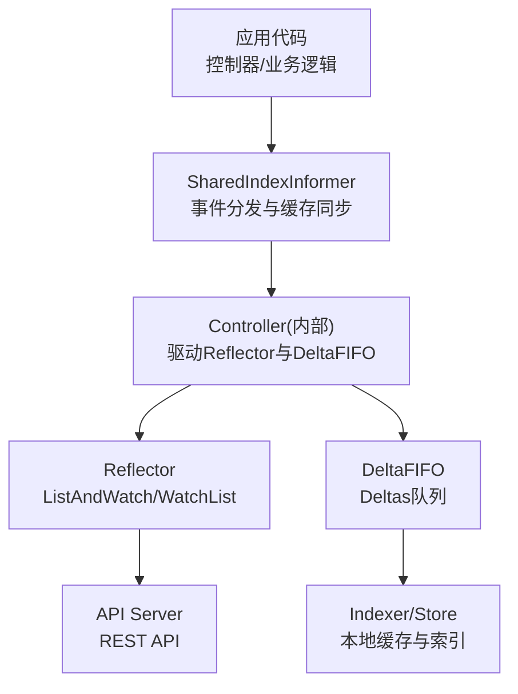
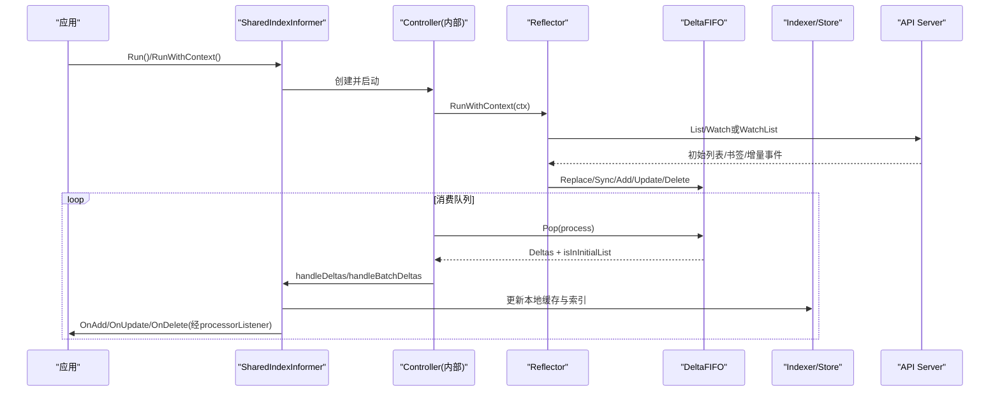
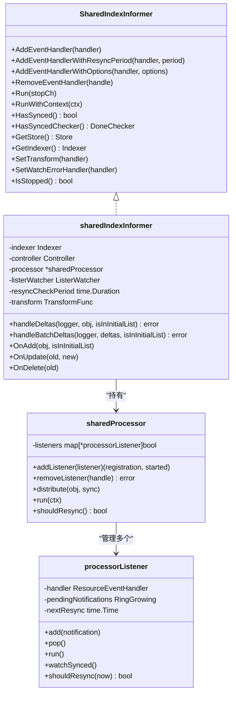
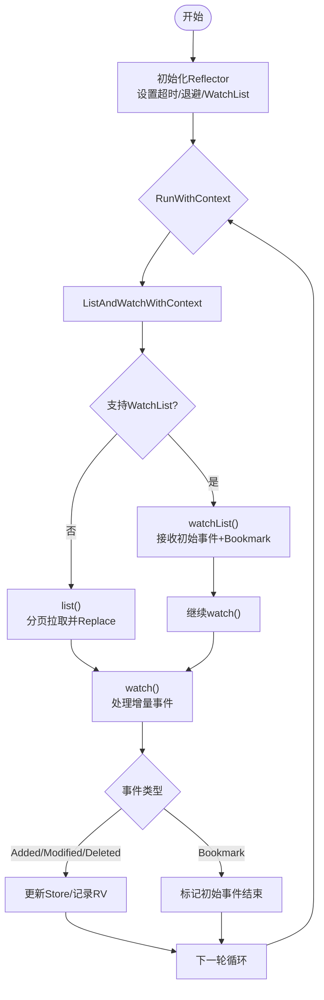
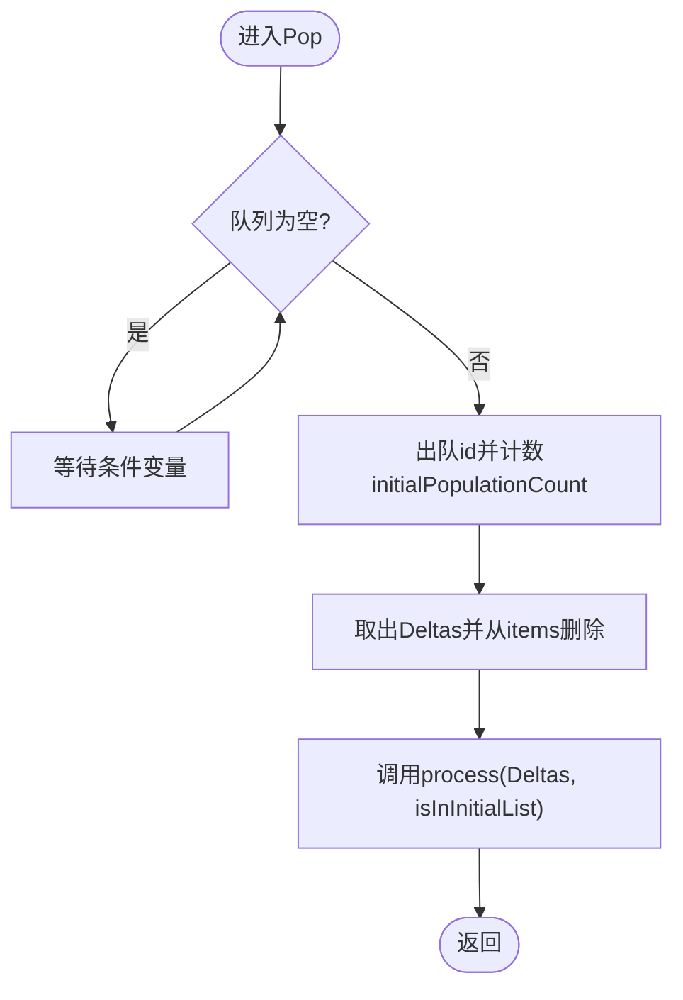
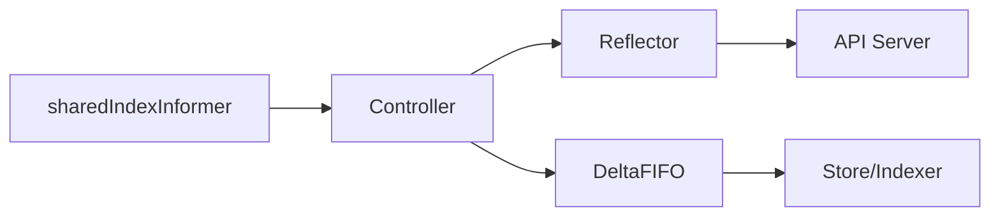

# Informer机制

<cite>
**本文引用的文件**   
- [shared_informer.go](file://staging/src/k8s.io/client-go/tools/cache/shared_informer.go)
- [reflector.go](file://staging/src/k8s.io/client-go/tools/cache/reflector.go)
- [delta_fifo.go](file://staging/src/k8s.io/client-go/tools/cache/delta_fifo.go)
- [store.go](file://staging/src/k8s.io/client-go/tools/cache/store.go)
</cite>

## 目录
1. [简介](#简介)
2. [项目结构](#项目结构)
3. [核心组件](#核心组件)
4. [架构总览](#架构总览)
5. [详细组件分析](#详细组件分析)
6. [依赖关系分析](#依赖关系分析)
7. [性能与内存优化](#性能与内存优化)
8. [故障排查指南](#故障排查指南)
9. [结论](#结论)
10. [附录](#附录)

## 简介
本文件面向Kubernetes Go客户端的Informer机制，系统性阐述其工作原理与实现细节，包括：
- 本地缓存、事件监听、Reflector拉取与Watch流、Delta队列（DeltaFIFO）的工作方式
- SharedIndexInformer与SharedLister的使用方法与最佳实践
- 完整的事件处理示例（Add/Update/Delete）与生命周期管理
- 自定义Informer开发指南与常见陷阱
- 内存使用优化与性能调优建议

## 项目结构
本节聚焦client-go tools/cache包中与Informer相关的核心文件及其职责：
- shared_informer.go：定义SharedInformer/SharedIndexInformer接口与实现，事件分发处理器processorListener，以及Run/HasSynced等生命周期方法
- reflector.go：负责从API Server进行初始列表与增量Watch，维护ResourceVersion，支持WatchList语义与回退策略
- delta_fifo.go：DeltaFIFO队列，聚合对象变更序列（Deltas），提供Replace/Resync/Pop等能力
- store.go：Store/Indexer抽象与线程安全存储实现，提供索引与事务式更新能力

图表来源
- [shared_informer.go:584-792](file://staging/src/k8s.io/client-go/tools/cache/shared_informer.go#L584-L792)
- [reflector.go:416-509](file://staging/src/k8s.io/client-go/tools/cache/reflector.go#L416-L509)
- [delta_fifo.go:108-158](file://staging/src/k8s.io/client-go/tools/cache/delta_fifo.go#L108-L158)
- [store.go:202-216](file://staging/src/k8s.io/client-go/tools/cache/store.go#L202-L216)

章节来源
- [shared_informer.go:45-143](file://staging/src/k8s.io/client-go/tools/cache/shared_informer.go#L45-L143)
- [reflector.go:105-171](file://staging/src/k8s.io/client-go/tools/cache/reflector.go#L105-L171)
- [delta_fifo.go:67-107](file://staging/src/k8s.io/client-go/tools/cache/delta_fifo.go#L67-L107)
- [store.go:28-82](file://staging/src/k8s.io/client-go/tools/cache/store.go#L28-L82)

## 核心组件
- SharedIndexInformer
  - 对外暴露SharedInformer/SharedIndexInformer接口，封装本地缓存（Indexer）、事件处理器（sharedProcessor/processorListener）、与底层Controller协作
  - 提供AddEventHandler系列方法、HasSynced/HasSyncedChecker、SetTransform/SetWatchErrorHandler等配置点
- Reflector
  - 负责List与Watch，维护lastSyncResourceVersion，支持WatchList语义与回退到传统LIST+WATCH
  - 内置指数退避、错误分类、Bookmark事件处理、超时控制
- DeltaFIFO
  - 以Deltas为单位聚合对象变更，支持Replace/Resync/SyncAll/Bookmark等类型
  - 提供Pop阻塞消费、Replace原子替换并检测删除、Resync周期性重放
- Store/Indexer
  - 线程安全的键值存储与索引，支持TransformFunc在入队/写入前裁剪字段降低内存占用

章节来源
- [shared_informer.go:292-349](file://staging/src/k8s.io/client-go/tools/cache/shared_informer.go#L292-L349)
- [reflector.go:286-371](file://staging/src/k8s.io/client-go/tools/cache/reflector.go#L286-L371)
- [delta_fifo.go:178-208](file://staging/src/k8s.io/client-go/tools/cache/delta_fifo.go#L178-L208)
- [store.go:420-442](file://staging/src/k8s.io/client-go/tools/cache/store.go#L420-L442)

## 架构总览
下图展示Informer整体数据流与控制流：Reflector从API Server获取初始快照与增量事件，写入DeltaFIFO；Controller循环Pop出Deltas，调用sharedIndexInformer处理，更新Indexer并分发事件给各处理器。

图表来源
- [shared_informer.go:724-792](file://staging/src/k8s.io/client-go/tools/cache/shared_informer.go#L724-L792)
- [reflector.go:416-509](file://staging/src/k8s.io/client-go/tools/cache/reflector.go#L416-L509)
- [delta_fifo.go:562-608](file://staging/src/k8s.io/client-go/tools/cache/delta_fifo.go#L562-L608)
- [store.go:254-294](file://staging/src/k8s.io/client-go/tools/cache/store.go#L254-L294)

## 详细组件分析

### SharedIndexInformer与事件分发
- 关键流程
  - RunWithContext：创建DeltaFIFO与Controller，启动processor与mutation detector，等待HasSynced后关闭synced通道
  - AddEventHandlerWithOptions：注册处理器，计算resync周期，必要时对已存在对象发送初始Add事件
  - handleDeltas/handleBatchDeltas：在blockDeltas锁下更新Indexer并分发通知
  - processorListener：每个处理器拥有独立的pop/run/watchSynced协程，环形缓冲pendingNotifications，按序调用OnAdd/OnUpdate/OnDelete
- 同步状态
  - HasSynced/HasSyncedChecker：基于synced通道与SingleFileTracker组合上游同步与处理器完成状态
- 生命周期
  - RemoveEventHandler/ShutDownEventHandler：异步移除与等待处理器停止，避免死锁

图表来源
- [shared_informer.go:292-349](file://staging/src/k8s.io/client-go/tools/cache/shared_informer.go#L292-L349)
- [shared_informer.go:584-792](file://staging/src/k8s.io/client-go/tools/cache/shared_informer.go#L584-L792)
- [shared_informer.go:1044-1189](file://staging/src/k8s.io/client-go/tools/cache/shared_informer.go#L1044-L1189)
- [shared_informer.go:1224-1446](file://staging/src/k8s.io/client-go/tools/cache/shared_informer.go#L1224-L1446)

章节来源
- [shared_informer.go:724-792](file://staging/src/k8s.io/client-go/tools/cache/shared_informer.go#L724-L792)
- [shared_informer.go:886-951](file://staging/src/k8s.io/client-go/tools/cache/shared_informer.go#L886-L951)
- [shared_informer.go:953-1004](file://staging/src/k8s.io/client-go/tools/cache/shared_informer.go#L953-L1004)
- [shared_informer.go:1044-1189](file://staging/src/k8s.io/client-go/tools/cache/shared_informer.go#L1044-L1189)
- [shared_informer.go:1224-1446](file://staging/src/k8s.io/client-go/tools/cache/shared_informer.go#L1224-L1446)

### Reflector：List/Watch与WatchList
- 初始化与运行
  - NewReflectorWithOptions：设置最小/最大Watch超时、退避策略、WatchList开关
  - RunWithContext：Until循环调用ListAndWatchWithContext，错误交由WatchErrorHandler处理
- 列表与增量
  - list：分页拉取，处理Expired/TooLargeRV错误，记录resourceVersion
  - watch：建立Watch流，处理Added/Modified/Deleted/Bookmark，更新Store与RV
  - watchList：优先使用WatchList语义，收到Bookmark后替换Store并复用当前Watch流
- 健壮性
  - 指数退避、连接拒绝/429重试、内部错误短期重试、VeryShortWatchError告警

图表来源
- [reflector.go:286-371](file://staging/src/k8s.io/client-go/tools/cache/reflector.go#L286-L371)
- [reflector.go:416-509](file://staging/src/k8s.io/client-go/tools/cache/reflector.go#L416-L509)
- [reflector.go:674-783](file://staging/src/k8s.io/client-go/tools/cache/reflector.go#L674-L783)
- [reflector.go:804-908](file://staging/src/k8s.io/client-go/tools/cache/reflector.go#L804-L908)
- [reflector.go:944-1095](file://staging/src/k8s.io/client-go/tools/cache/reflector.go#L944-L1095)

章节来源
- [reflector.go:416-509](file://staging/src/k8s.io/client-go/tools/cache/reflector.go#L416-L509)
- [reflector.go:674-783](file://staging/src/k8s.io/client-go/tools/cache/reflector.go#L674-L783)
- [reflector.go:804-908](file://staging/src/k8s.io/client-go/tools/cache/reflector.go#L804-L908)
- [reflector.go:944-1095](file://staging/src/k8s.io/client-go/tools/cache/reflector.go#L944-L1095)

### DeltaFIFO：Deltas队列与批量处理
- 数据结构
  - items[key]=Deltas，queue保持消费顺序，dedupDeltas去重相邻重复删除
- 操作
  - Add/Update/Delete：入队并触发cond广播
  - Replace：原子替换，对比已知集合生成DeletedFinalStateUnknown删除事件
  - Resync：为knownObjects中未排队项注入Sync事件
  - Pop：阻塞取出Deltas，返回isInInitialList标志
- 变换与指标
  - Transformer在入队前裁剪对象，减少内存占用
  - 支持DoneChecker用于同步等待

图表来源
- [delta_fifo.go:562-608](file://staging/src/k8s.io/client-go/tools/cache/delta_fifo.go#L562-L608)
- [delta_fifo.go:619-699](file://staging/src/k8s.io/client-go/tools/cache/delta_fifo.go#L619-L699)
- [delta_fifo.go:704-747](file://staging/src/k8s.io/client-go/tools/cache/delta_fifo.go#L704-L747)

章节来源
- [delta_fifo.go:108-158](file://staging/src/k8s.io/client-go/tools/cache/delta_fifo.go#L108-L158)
- [delta_fifo.go:562-608](file://staging/src/k8s.io/client-go/tools/cache/delta_fifo.go#L562-L608)
- [delta_fifo.go:619-699](file://staging/src/k8s.io/client-go/tools/cache/delta_fifo.go#L619-L699)
- [delta_fifo.go:704-747](file://staging/src/k8s.io/client-go/tools/cache/delta_fifo.go#L704-L747)

### Store/Indexer：本地缓存与索引
- 线程安全存储
  - cache包装ThreadSafeStore，提供Add/Update/Delete/List/GetByKey/Replace
  - WithTransformer可在写入前裁剪对象
- 索引能力
  - Indexers/Indices支持按函数建索引，ByIndex/ByIndexKeys快速查询
- 事务式更新
  - Transaction接口允许在同一把锁内执行多操作，提升并发吞吐

章节来源
- [store.go:202-216](file://staging/src/k8s.io/client-go/tools/cache/store.go#L202-L216)
- [store.go:254-294](file://staging/src/k8s.io/client-go/tools/cache/store.go#L254-L294)
- [store.go:369-387](file://staging/src/k8s.io/client-go/tools/cache/store.go#L369-L387)
- [store.go:420-442](file://staging/src/k8s.io/client-go/tools/cache/store.go#L420-L442)

## 依赖关系分析
- 耦合与内聚
  - sharedIndexInformer强依赖Controller与DeltaFIFO，通过HandleDeltas解耦缓存更新与事件分发
  - Reflector独立于上层，仅依赖ListerWatcher与Store接口，便于替换与测试
  - DeltaFIFO与Store分离，前者关注变更聚合与顺序，后者关注持久化与索引
- 外部依赖
  - API Server通过REST API交互，WatchList语义可显著降低服务器压力
  - 时钟/计时器由clock.Clock抽象，便于测试与可控时间推进

图表来源
- [shared_informer.go:724-792](file://staging/src/k8s.io/client-go/tools/cache/shared_informer.go#L724-L792)
- [reflector.go:416-509](file://staging/src/k8s.io/client-go/tools/cache/reflector.go#L416-L509)
- [delta_fifo.go:108-158](file://staging/src/k8s.io/client-go/tools/cache/delta_fifo.go#L108-L158)
- [store.go:202-216](file://staging/src/k8s.io/client-go/tools/cache/store.go#L202-L216)

章节来源
- [shared_informer.go:584-792](file://staging/src/k8s.io/client-go/tools/cache/shared_informer.go#L584-L792)
- [reflector.go:105-171](file://staging/src/k8s.io/client-go/tools/cache/reflector.go#L105-L171)
- [delta_fifo.go:67-107](file://staging/src/k8s.io/client-go/tools/cache/delta_fifo.go#L67-L107)
- [store.go:28-82](file://staging/src/k8s.io/client-go/tools/cache/store.go#L28-L82)

## 性能与内存优化
- 使用TransformFunc裁剪对象
  - 在DeltaFIFO与Store写入前剔除无关字段，显著降低内存占用
  - 注意幂等性要求，避免对已有对象重复修改
- 合理设置Resync周期
  - minimumResyncPeriod限制最小周期，避免频繁全量重放
  - 仅在需要时开启Resync，避免无谓CPU开销
- 利用WatchList语义
  - 优先启用WatchList，减少服务器端资源消耗与网络往返
- 批处理与节流
  - 处理器应避免长时间阻塞，将耗时任务投递至工作队列
  - 监控pendingNotifications长度，必要时限流或降级
- 指标与追踪
  - 使用InformerMetricsProvider与utiltrace定位慢路径与热点

章节来源
- [delta_fifo.go:160-176](file://staging/src/k8s.io/client-go/tools/cache/delta_fifo.go#L160-L176)
- [shared_informer.go:865-915](file://staging/src/k8s.io/client-go/tools/cache/shared_informer.go#L865-L915)
- [reflector.go:286-371](file://staging/src/k8s.io/client-go/tools/cache/reflector.go#L286-L371)
- [store.go:396-410](file://staging/src/k8s.io/client-go/tools/cache/store.go#L396-L410)

## 故障排查指南
- Watch断链与重试
  - 默认WatchErrorHandler对Expired/EOF/UnexpectedEOF进行分类处理，429与连接拒绝触发退避
  - VeryShortWatchError提示极短Watch且无事件，需检查服务端或网络
- 资源版本不可用
  - isLastSyncResourceVersionUnavailable置位后，强制回退到最新RV重新拉取
- 处理器卡住导致队列堆积
  - 观察processorListener.pendingNotificationsLength，必要时增加消费者或优化处理逻辑
- 停止与清理
  - ShutDownEventHandler确保处理器完全停止后再释放资源，避免死锁

章节来源
- [reflector.go:214-229](file://staging/src/k8s.io/client-go/tools/cache/reflector.go#L214-L229)
- [reflector.go:1154-1205](file://staging/src/k8s.io/client-go/tools/cache/reflector.go#L1154-L1205)
- [reflector.go:1294-1305](file://staging/src/k8s.io/client-go/tools/cache/reflector.go#L1294-L1305)
- [shared_informer.go:1026-1042](file://staging/src/k8s.io/client-go/tools/cache/shared_informer.go#L1026-L1042)

## 结论
Informer通过Reflector-DeltaFIFO-Indexer三层协作，实现了高效、可靠、可扩展的本地缓存与事件分发机制。合理使用TransformFunc、WatchList、Resync与处理器隔离，可在大规模集群场景下获得稳定性能与低内存占用。遵循生命周期管理与错误处理规范，可有效避免常见陷阱。

## 附录

### SharedIndexInformer与SharedLister使用要点
- 创建与启动
  - 使用NewSharedIndexInformerWithOptions配置ResyncPeriod、Indexers、Identifier与MetricsProvider
  - 先AddEventHandlerWithOptions，再Run/RunWithContext
- 同步等待
  - WaitForCacheSync/WaitForNamedCacheSync等待缓存同步；如需确认处理器也完成，结合Registration.HasSyncedChecker
- 读取缓存
  - GetStore()/GetIndexer()返回Indexer，支持ByIndex/ByIndexKeys快速查询
- 停止与清理
  - 调用ShutDownEventHandler确保处理器停止，再释放相关资源

章节来源
- [shared_informer.go:317-349](file://staging/src/k8s.io/client-go/tools/cache/shared_informer.go#L317-L349)
- [shared_informer.go:384-441](file://staging/src/k8s.io/client-go/tools/cache/shared_informer.go#L384-L441)
- [shared_informer.go:838-855](file://staging/src/k8s.io/client-go/tools/cache/shared_informer.go#L838-L855)
- [shared_informer.go:1026-1042](file://staging/src/k8s.io/client-go/tools/cache/shared_informer.go#L1026-L1042)

### 事件处理示例（Add/Update/Delete）
- 典型流程
  - OnAdd：首次同步或新增对象，isInInitialList=true表示来自初始列表
  - OnUpdate：比较ResourceVersion判断是否为Resync事件，仅向请求Resync的处理器派发
  - OnDelete：传递最后已知非空状态（删除时RV被替换为“不存在”的RV）
- 注意事项
  - 处理器应尽快返回，耗时逻辑投递到工作队列
  - UID可能变化，需在OnUpdate中比对UID以识别重建对象

章节来源
- [shared_informer.go:970-1004](file://staging/src/k8s.io/client-go/tools/cache/shared_informer.go#L970-L1004)
- [shared_informer.go:1365-1408](file://staging/src/k8s.io/client-go/tools/cache/shared_informer.go#L1365-L1408)

### 自定义Informer开发指南与常见陷阱
- 开发步骤
  - 实现ListerWatcher接口，提供ListWithContext/WatchWithContext
  - 选择合适KeyFunc与Indexers，必要时实现TransformFunc
  - 使用NewSharedIndexInformerWithOptions构建Informer，注册处理器并启动
- 常见陷阱
  - 未在Run前设置Transform/SetWatchErrorHandler
  - 处理器阻塞导致队列积压与延迟
  - 忽略Resync语义，误将Sync事件当作普通更新
  - 未正确等待HasSynced即访问缓存，导致不一致视图

章节来源
- [shared_informer.go:712-722](file://staging/src/k8s.io/client-go/tools/cache/shared_informer.go#L712-L722)
- [shared_informer.go:886-951](file://staging/src/k8s.io/client-go/tools/cache/shared_informer.go#L886-L951)
- [delta_fifo.go:160-176](file://staging/src/k8s.io/client-go/tools/cache/delta_fifo.go#L160-L176)