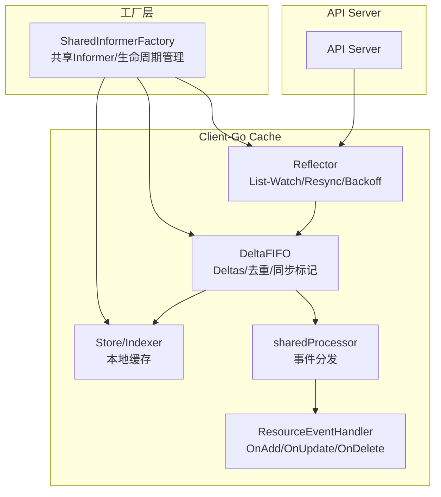
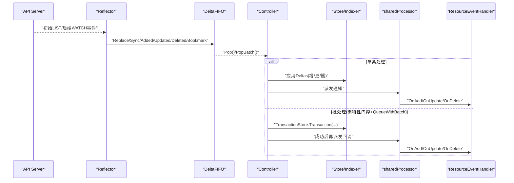
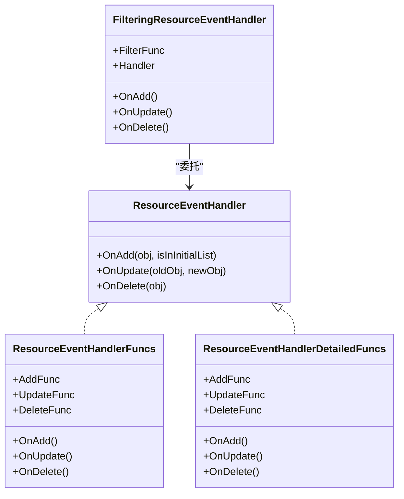
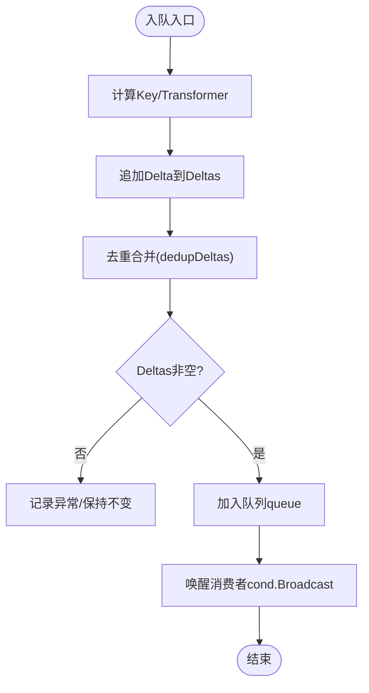
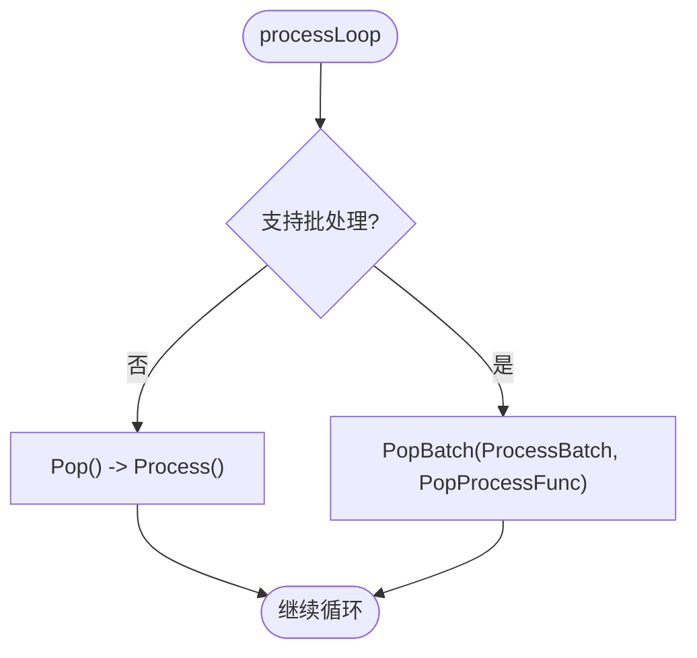
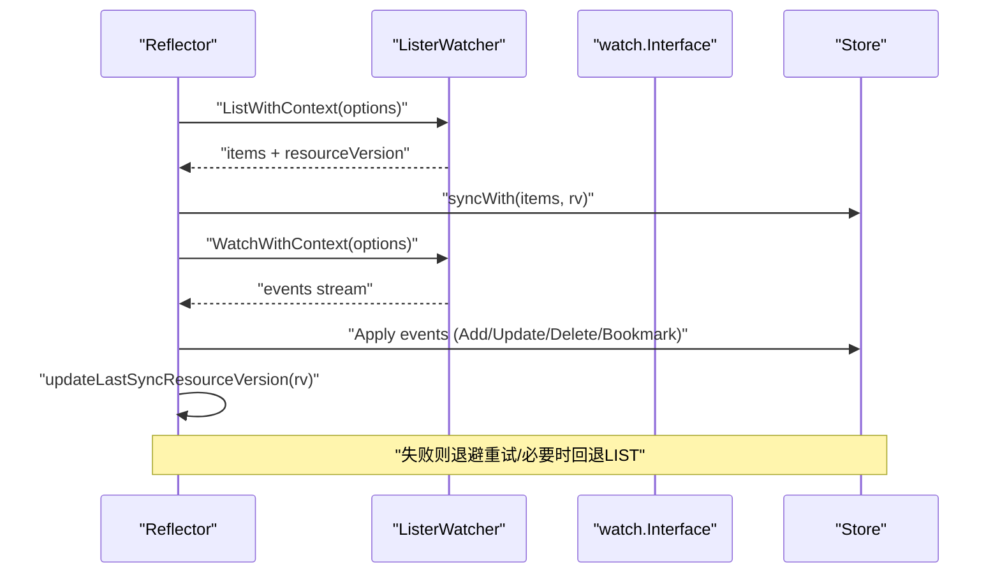
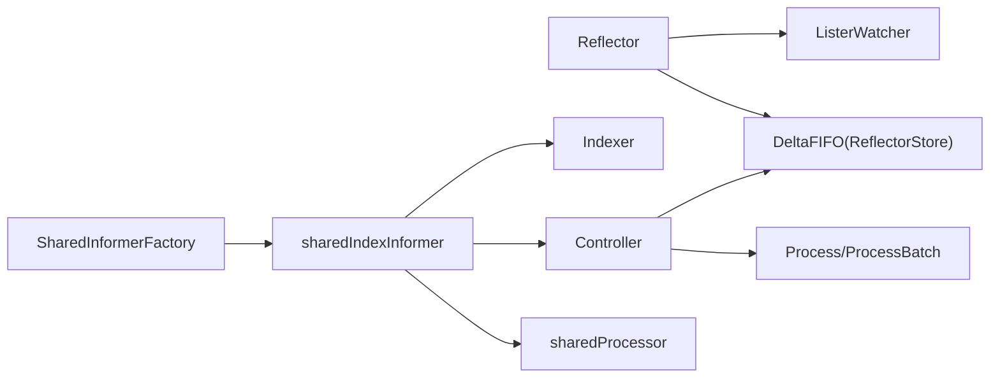

# 事件监听与处理

<cite>
**本文引用的文件**   
- [controller.go](file://staging/src/k8s.io/client-go/tools/cache/controller.go)
- [delta_fifo.go](file://staging/src/k8s.io/client-go/tools/cache/delta_fifo.go)
- [shared_informer.go](file://staging/src/k8s.io/client-go/tools/cache/shared_informer.go)
- [reflector.go](file://staging/src/k8s.io/client-go/tools/cache/reflector.go)
- [factory.go](file://staging/src/k8s.io/client-go/informers/factory.go)
- [event_handler_name.go](file://staging/src/k8s.io/client-go/tools/cache/event_handler_name.go)
</cite>

## 目录
1. [引言](#引言)
2. [项目结构](#项目结构)
3. [核心组件](#核心组件)
4. [架构总览](#架构总览)
5. [详细组件分析](#详细组件分析)
6. [依赖关系分析](#依赖关系分析)
7. [性能考量](#性能考量)
8. [故障排查指南](#故障排查指南)
9. [结论](#结论)
10. [附录](#附录)

## 引言
本文件面向使用 Kubernetes Informer 的开发者，系统性阐述事件监听与处理机制。重点覆盖：
- Add、Update、Delete 三类事件的触发条件与处理逻辑
- 事件处理器注册与回调实现方式
- 工作队列（DeltaFIFO）的任务调度、去重合并、重试策略与错误处理
- 批处理与事务化更新能力
- 性能监控与调试技巧
- 复杂业务场景下的最佳实践示例路径

## 项目结构
围绕 Informer 的事件链路，关键代码位于 client-go 的 tools/cache 与 informers 包中：
- Reflector：负责 List-Watch 与 API Server 交互，维护资源版本与重试退避
- DeltaFIFO：事件聚合与去重的工作队列，保证每个对象变更至少被消费一次
- Controller/SharedIndexInformer：协调 Reflector 与本地缓存，分发事件到处理器
- SharedInformerFactory：统一创建与管理各资源类型的 Informer，支持命名空间、过滤、Transform 等选项

图表来源
- [reflector.go:420-509](file://staging/src/k8s.io/client-go/tools/cache/reflector.go#L420-L509)
- [delta_fifo.go:480-541](file://staging/src/k8s.io/client-go/tools/cache/delta_fifo.go#L480-L541)
- [shared_informer.go:584-792](file://staging/src/k8s.io/client-go/tools/cache/shared_informer.go#L584-L792)
- [factory.go:162-239](file://staging/src/k8s.io/client-go/informers/factory.go#L162-L239)

章节来源
- [reflector.go:420-509](file://staging/src/k8s.io/client-go/tools/cache/reflector.go#L420-L509)
- [delta_fifo.go:480-541](file://staging/src/k8s.io/client-go/tools/cache/delta_fifo.go#L480-L541)
- [shared_informer.go:584-792](file://staging/src/k8s.io/client-go/tools/cache/shared_informer.go#L584-L792)
- [factory.go:162-239](file://staging/src/k8s.io/client-go/informers/factory.go#L162-L239)

## 核心组件
- Reflector：封装 List/Watch 循环、超时控制、分页与 WatchList 语义、指数退避重试、Bookmark 推进 RV
- DeltaFIFO：以 Deltas 为单位聚合同一对象的多次变更，提供去重、Sync/Replaced/Bookmark 等合成事件
- sharedIndexInformer：组合 Indexer、Controller、Processor，负责将 Deltas 应用到本地缓存并分发给处理器
- ResourceEventHandler：用户自定义的回调接口（OnAdd/OnUpdate/OnDelete），支持函数式适配器与过滤器
- SharedInformerFactory：按类型复用 Informer，集中启动/等待同步/关闭，支持 Transform、命名空间、过滤等

章节来源
- [reflector.go:296-371](file://staging/src/k8s.io/client-go/tools/cache/reflector.go#L296-L371)
- [delta_fifo.go:108-158](file://staging/src/k8s.io/client-go/tools/cache/delta_fifo.go#L108-L158)
- [shared_informer.go:584-792](file://staging/src/k8s.io/client-go/tools/cache/shared_informer.go#L584-L792)
- [controller.go:263-389](file://staging/src/k8s.io/client-go/tools/cache/controller.go#L263-L389)
- [factory.go:129-239](file://staging/src/k8s.io/client-go/informers/factory.go#L129-L239)

## 架构总览
下图展示从 API Server 到用户回调的完整调用链，包括批量处理分支与事务化存储路径。

图表来源
- [reflector.go:420-509](file://staging/src/k8s.io/client-go/tools/cache/reflector.go#L420-L509)
- [delta_fifo.go:562-608](file://staging/src/k8s.io/client-go/tools/cache/delta_fifo.go#L562-L608)
- [controller.go:232-261](file://staging/src/k8s.io/client-go/tools/cache/controller.go#L232-L261)
- [controller.go:607-754](file://staging/src/k8s.io/client-go/tools/cache/controller.go#L607-L754)
- [shared_informer.go:728-792](file://staging/src/k8s.io/client-go/tools/cache/shared_informer.go#L728-L792)

## 详细组件分析

### 事件类型与触发条件
- Added：对象首次进入本地缓存时触发；在 Replace 或初始 LIST 阶段也会产生
- Updated：对象已存在且发生变更时触发；Resync 周期也可能触发 OnUpdate（即使内容未变）
- Deleted：对象被删除；若错过删除事件，可能收到 DeletedFinalStateUnknown 包裹的最终状态

章节来源
- [controller.go:607-665](file://staging/src/k8s.io/client-go/tools/cache/controller.go#L607-L665)
- [delta_fifo.go:178-208](file://staging/src/k8s.io/client-go/tools/cache/delta_fifo.go#L178-L208)
- [delta_fifo.go:793-800](file://staging/src/k8s.io/client-go/tools/cache/delta_fifo.go#L793-L800)

### 事件处理器注册与回调
- 通过 SharedInformer 的 AddEventHandler/AddEventHandlerWithOptions 注册处理器
- 支持函数式适配器 ResourceEventHandlerFuncs 与带详细参数的 ResourceEventHandlerDetailedFuncs
- 支持 FilteringResourceEventHandler 对事件进行过滤，动态判定为 Add/Update/Delete
- 处理器名称自动推导用于日志与指标

图表来源
- [controller.go:263-389](file://staging/src/k8s.io/client-go/tools/cache/controller.go#L263-L389)
- [event_handler_name.go:26-121](file://staging/src/k8s.io/client-go/tools/cache/event_handler_name.go#L26-L121)

章节来源
- [controller.go:263-389](file://staging/src/k8s.io/client-go/tools/cache/controller.go#L263-L389)
- [event_handler_name.go:26-121](file://staging/src/k8s.io/client-go/tools/cache/event_handler_name.go#L26-L121)

### 工作队列工作机制（DeltaFIFO）
- 任务单元：Deltas，包含同一对象的多条 Delta，按时间顺序排列
- 去重合并：dedupDeltas 会合并相邻重复 Delta，尤其是删除去重保留信息更完整的版本
- 同步与替换：Replace 会先对新增项入队 Sync/Replaced，再检测缺失项生成 DeletedFinalStateUnknown
- Resync：周期性向已知对象入队 Sync 事件，供上层做一致性校验或外部资源刷新
- Pop 阻塞与完成信号：HasSynced/HasSyncedChecker 基于 initialPopulationCount 与 populated 标志判断初始同步完成

图表来源
- [delta_fifo.go:480-541](file://staging/src/k8s.io/client-go/tools/cache/delta_fifo.go#L480-L541)
- [delta_fifo.go:443-478](file://staging/src/k8s.io/client-go/tools/cache/delta_fifo.go#L443-L478)
- [delta_fifo.go:619-699](file://staging/src/k8s.io/client-go/tools/cache/delta_fifo.go#L619-L699)
- [delta_fifo.go:701-747](file://staging/src/k8s.io/client-go/tools/cache/delta_fifo.go#L701-L747)

章节来源
- [delta_fifo.go:480-541](file://staging/src/k8s.io/client-go/tools/cache/delta_fifo.go#L480-L541)
- [delta_fifo.go:443-478](file://staging/src/k8s.io/client-go/tools/cache/delta_fifo.go#L443-L478)
- [delta_fifo.go:619-699](file://staging/src/k8s.io/client-go/tools/cache/delta_fifo.go#L619-L699)
- [delta_fifo.go:701-747](file://staging/src/k8s.io/client-go/tools/cache/delta_fifo.go#L701-L747)

### 控制器与批处理
- Controller.processLoop 根据 Queue 是否实现 QueueWithBatch 以及特性门控决定是否走批处理路径
- 批处理流程：收集唯一对象的 Transaction，调用 TransactionStore.Transaction 原子提交，成功后再执行回调
- 失败处理：仅对成功索引执行回调，返回 TransactionError 提示部分失败

图表来源
- [controller.go:232-261](file://staging/src/k8s.io/client-go/tools/cache/controller.go#L232-L261)
- [controller.go:667-754](file://staging/src/k8s.io/client-go/tools/cache/controller.go#L667-L754)

章节来源
- [controller.go:232-261](file://staging/src/k8s.io/client-go/tools/cache/controller.go#L232-L261)
- [controller.go:667-754](file://staging/src/k8s.io/client-go/tools/cache/controller.go#L667-L754)

### Reflector 与 Watch 循环
- 列表与监视：优先尝试 WatchList（如可用），否则回退到分页 LIST，随后进入 watch 循环
- 超时与退避：watch 请求随机超时，失败后指数退避重试；内部错误可设置最大重试时长
- 资源版本推进：仅在收到非 Added 事件或之前已有 RV 时才推进 LastSyncResourceVersion
- Resync 定时器：周期性触发 store.Resync，驱动 DeltaFIFO 的 Sync 事件

图表来源
- [reflector.go:420-509](file://staging/src/k8s.io/client-go/tools/cache/reflector.go#L420-L509)
- [reflector.go:561-670](file://staging/src/k8s.io/client-go/tools/cache/reflector.go#L561-L670)
- [reflector.go:674-783](file://staging/src/k8s.io/client-go/tools/cache/reflector.go#L674-L783)

章节来源
- [reflector.go:420-509](file://staging/src/k8s.io/client-go/tools/cache/reflector.go#L420-L509)
- [reflector.go:561-670](file://staging/src/k8s.io/client-go/tools/cache/reflector.go#L561-L670)
- [reflector.go:674-783](file://staging/src/k8s.io/client-go/tools/cache/reflector.go#L674-L783)

### SharedInformer 与工厂
- SharedInformer 组合 Indexer、Controller、Processor，负责将 Deltas 应用到本地缓存并分发事件
- SharedInformerFactory 统一管理各资源类型的 Informer，支持：
  - 命名空间限制、ListOptions 过滤
  - 全局 Transform 减少内存占用
  - 自定义 resync 周期
  - 统一的 Start/Shutdown/WaitForCacheSync

章节来源
- [shared_informer.go:584-792](file://staging/src/k8s.io/client-go/tools/cache/shared_informer.go#L584-L792)
- [factory.go:129-239](file://staging/src/k8s.io/client-go/informers/factory.go#L129-L239)

## 依赖关系分析
- Reflector 依赖 ListerWatcher 与 Store（DeltaFIFO 实现了 ReflectorStore）
- Controller 依赖 Queue（DeltaFIFO）、Process/ProcessBatch 回调
- sharedIndexInformer 依赖 Indexer、Controller、sharedProcessor
- Factory 依赖具体资源的 Informer 构造器，统一生命周期管理

图表来源
- [reflector.go:296-371](file://staging/src/k8s.io/client-go/tools/cache/reflector.go#L296-L371)
- [controller.go:114-162](file://staging/src/k8s.io/client-go/tools/cache/controller.go#L114-L162)
- [shared_informer.go:584-792](file://staging/src/k8s.io/client-go/tools/cache/shared_informer.go#L584-L792)
- [factory.go:129-239](file://staging/src/k8s.io/client-go/informers/factory.go#L129-L239)

章节来源
- [reflector.go:296-371](file://staging/src/k8s.io/client-go/tools/cache/reflector.go#L296-L371)
- [controller.go:114-162](file://staging/src/k8s.io/client-go/tools/cache/controller.go#L114-L162)
- [shared_informer.go:584-792](file://staging/src/k8s.io/client-go/tools/cache/shared_informer.go#L584-L792)
- [factory.go:129-239](file://staging/src/k8s.io/client-go/informers/factory.go#L129-L239)

## 性能考量
- 事件去重与合并：DeltaFIFO 的去重避免重复处理，降低处理器压力
- 批处理与事务：当 Queue 支持 QueueWithBatch 且启用 InOrderInformersBatchProcess 特性门控时，可批量提交并减少锁竞争
- Transform 优化：在入队前裁剪无用字段，降低内存占用
- Watch 超时与退避：合理配置 MinWatchTimeout 与 Backoff，避免雪崩
- Resync 频率：按需开启，避免频繁全量同步造成抖动
- 长耗时处理：建议将复杂逻辑下沉至独立工作队列，避免阻塞队列 Pop

[本节为通用指导，不直接分析具体文件]

## 故障排查指南
- Watch 断连与错误：
  - 默认 WatchErrorHandlerWithContext 会根据错误类型分类记录日志
  - 429 TooManyRequests 会触发退避；内部错误可按 MaxInternalErrorRetryDuration 重试
- 资源版本不一致：
  - 检查 LastSyncResourceVersion 推进时机，确保非 Added 事件后才推进
  - 关注 IsLastSyncResourceVersionUnavailable 标志，必要时回退到 RV="" 重新 LIST
- 队列堆积：
  - 观察 DeltaFIFO Pop 时的深度与耗时，必要时拆分处理器或引入异步队列
- 处理器未同步：
  - 使用 Handle.HasSynced/HasSyncedChecker 确认预同步事件已投递
- 指标与日志：
  - 使用 InformerNameAndResource 标识 Informer，便于区分不同资源与实例
  - 利用 klog 上下文与 trace 定位慢路径

章节来源
- [reflector.go:214-229](file://staging/src/k8s.io/client-go/tools/cache/reflector.go#L214-L229)
- [reflector.go:561-670](file://staging/src/k8s.io/client-go/tools/cache/reflector.go#L561-L670)
- [shared_informer.go:728-792](file://staging/src/k8s.io/client-go/tools/cache/shared_informer.go#L728-L792)
- [event_handler_name.go:26-121](file://staging/src/k8s.io/client-go/tools/cache/event_handler_name.go#L26-L121)

## 结论
Kubernetes Informer 通过 Reflector-DeltaFIFO-Controller-Processor 的分层设计，提供了高可靠、低开销的事件监听与处理框架。借助去重合并、批处理与事务化更新，可在大规模集群中稳定运行。结合合理的 Transform、Resync 策略与完善的监控调试手段，可有效支撑复杂的业务编排与控制面逻辑。

[本节为总结性内容，不直接分析具体文件]

## 附录
- 示例参考路径（仓库内示例）：
  - workqueue 示例：演示如何结合工作队列与缓存构建控制器，并在启动时完成同步
    - [workqueue README](file://staging/src/k8s.io/client-go/examples/workqueue/README.md)
- 典型用法要点：
  - 使用 SharedInformerFactory 获取指定资源的 Informer
  - 注册 ResourceEventHandler 或 FilteringResourceEventHandler
  - 启动 Informer 并 WaitForCacheSync，确保初始数据就绪
  - 在处理器中避免阻塞，必要时将复杂逻辑投递到独立队列

章节来源
- [workqueue README](file://staging/src/k8s.io/client-go/examples/workqueue/README.md)