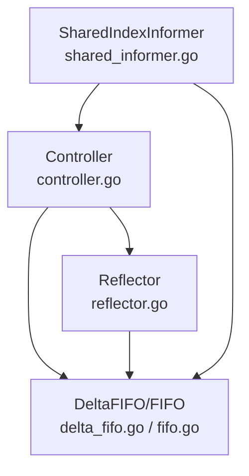
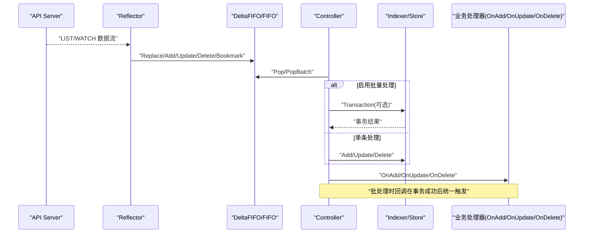
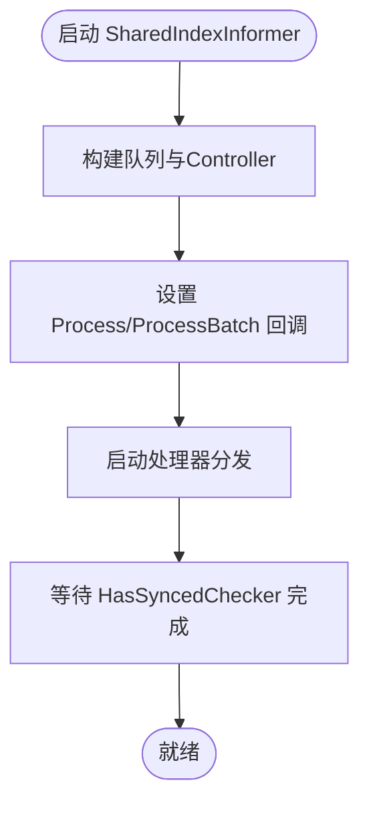
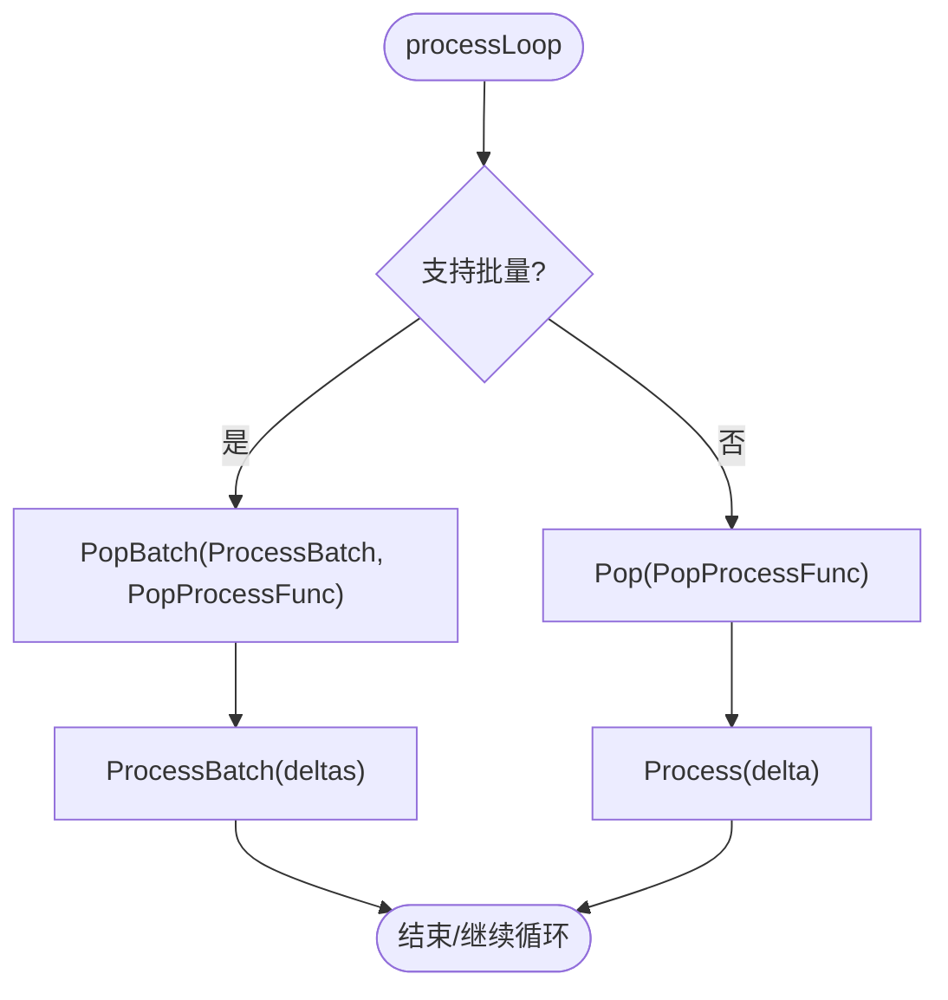
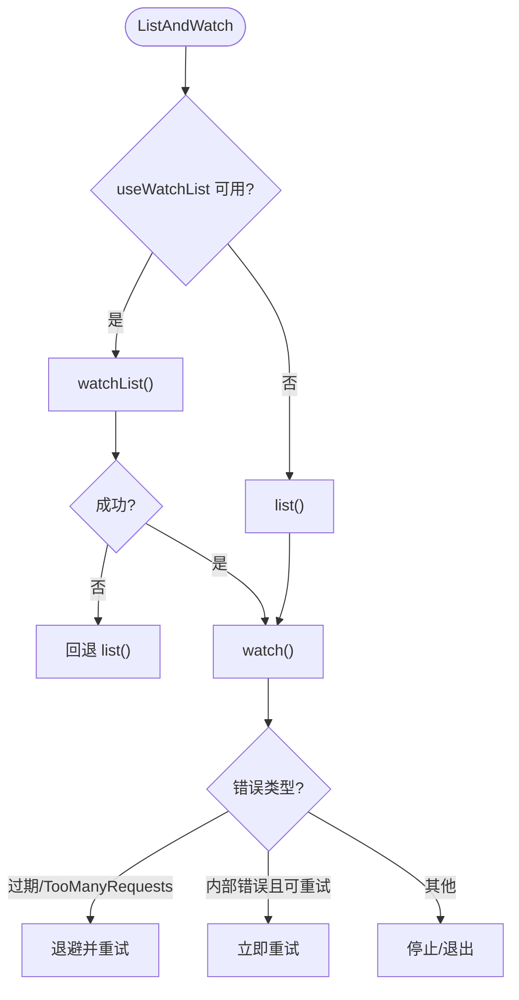
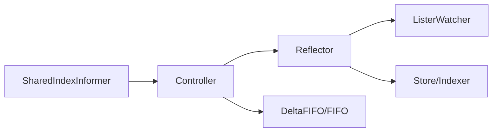

# 性能优化与最佳实践

<cite>
**本文引用的文件**   
- [staging/src/k8s.io/client-go/tools/cache/shared_informer.go](file://staging/src/k8s.io/client-go/tools/cache/shared_informer.go)
- [staging/src/k8s.io/client-go/tools/cache/controller.go](file://staging/src/k8s.io/client-go/tools/cache/controller.go)
- [staging/src/k8s.io/client-go/tools/cache/delta_fifo.go](file://staging/src/k8s.io/client-go/tools/cache/delta_fifo.go)
- [staging/src/k8s.io/client-go/tools/cache/fifo.go](file://staging/src/k8s.io/client-go/tools/cache/fifo.go)
- [staging/src/k8s.io/client-go/tools/cache/reflector.go](file://staging/src/k8s.io/client-go/tools/cache/reflector.go)
</cite>

## 目录
1. [引言](#引言)
2. [项目结构](#项目结构)
3. [核心组件](#核心组件)
4. [架构总览](#架构总览)
5. [详细组件分析](#详细组件分析)
6. [依赖分析](#依赖分析)
7. [性能考量](#性能考量)
8. [故障排查指南](#故障排查指南)
9. [结论](#结论)
10. [附录](#附录)

## 引言
本指南聚焦 Kubernetes Informer 机制的性能优化与生产最佳实践，围绕内存使用模式、CPU 消耗热点、批量处理、增量更新、缓存预热、高并发锁竞争、监控指标与调优参数、不同规模集群的配置建议、基准测试与回归检测、以及常见性能问题的诊断与排障展开。内容基于 client-go tools/cache 的核心实现进行深度剖析，并提供可落地的工程化建议。

## 项目结构
Informer 子系统由以下关键模块组成：
- SharedIndexInformer：对外暴露的共享索引型 Informer，负责生命周期管理、事件分发与处理器注册。
- Controller（低层控制器）：协调 Reflector 与队列，驱动 Pop/Process 循环，支持单条与批量处理。
- DeltaFIFO/FIFO：工作队列与去重合并逻辑，承载增量变更与全量替换语义。
- Reflector：从 API Server 拉取初始数据并建立 Watch 流，维护资源版本与重试退避策略。



图示来源
- [staging/src/k8s.io/client-go/tools/cache/shared_informer.go:728-792](file://staging/src/k8s.io/client-go/tools/cache/shared_informer.go#L728-L792)
- [staging/src/k8s.io/client-go/tools/cache/controller.go:169-209](file://staging/src/k8s.io/client-go/tools/cache/controller.go#L169-L209)
- [staging/src/k8s.io/client-go/tools/cache/reflector.go:420-509](file://staging/src/k8s.io/client-go/tools/cache/reflector.go#L420-L509)
- [staging/src/k8s.io/client-go/tools/cache/delta_fifo.go:108-158](file://staging/src/k8s.io/client-go/tools/cache/delta_fifo.go#L108-L158)
- [staging/src/k8s.io/client-go/tools/cache/fifo.go:112-138](file://staging/src/k8s.io/client-go/tools/cache/fifo.go#L112-L138)

章节来源
- [staging/src/k8s.io/client-go/tools/cache/shared_informer.go:597-647](file://staging/src/k8s.io/client-go/tools/cache/shared_informer.go#L597-L647)
- [staging/src/k8s.io/client-go/tools/cache/controller.go:114-162](file://staging/src/k8s.io/client-go/tools/cache/controller.go#L114-L162)
- [staging/src/k8s.io/client-go/tools/cache/reflector.go:105-171](file://staging/src/k8s.io/client-go/tools/cache/reflector.go#L105-L171)
- [staging/src/k8s.io/client-go/tools/cache/delta_fifo.go:108-158](file://staging/src/k8s.io/client-go/tools/cache/delta_fifo.go#L108-L158)
- [staging/src/k8s.io/client-go/tools/cache/fifo.go:112-138](file://staging/src/k8s.io/client-go/tools/cache/fifo.go#L112-L138)

## 核心组件
- SharedIndexInformer
  - 职责：封装本地 Indexer 缓存、处理器分发、Resync 周期控制、错误处理与 Transform 注入。
  - 关键点：RunWithContext 中创建队列与 Controller，设置 Process/ProcessBatch；通过 sharedProcessor 将事件按序分发给各 Handler。
- Controller（低层）
  - 职责：构造 Reflector 并启动 RunWithContex；周期性 Pop 队列项执行 Process/ProcessBatch；提供 HasSynced/LastSyncResourceVersion 等能力。
  - 关键点：processLoop 根据特性门控与队列接口选择单条或批量处理路径。
- DeltaFIFO/FIFO
  - 职责：对象变更的去重、合并与顺序保证；支持 Replace/Sync/Bookmark 等语义；Pop 在锁内调用处理函数，避免阻塞写入。
  - 关键点：TransformFunc 在入队前执行，适合裁剪字段以降低内存占用；Replace 会对比已知集合生成删除事件。
- Reflector
  - 职责：ListAndWatch 主循环、分页与 WatchList 回退、超时与退避、Bookmark 支持、RV 传播与不可用标记。
  - 关键点：MinWatchTimeout 默认下限保护控制面；WatchListPageSize 影响是否走 watch cache；useWatchList 受特性门控与客户端能力影响。

章节来源
- [staging/src/k8s.io/client-go/tools/cache/shared_informer.go:728-792](file://staging/src/k8s.io/client-go/tools/cache/shared_informer.go#L728-L792)
- [staging/src/k8s.io/client-go/tools/cache/controller.go:169-209](file://staging/src/k8s.io/client-go/tools/cache/controller.go#L169-L209)
- [staging/src/k8s.io/client-go/tools/cache/delta_fifo.go:160-176](file://staging/src/k8s.io/client-go/tools/cache/delta_fifo.go#L160-L176)
- [staging/src/k8s.io/client-go/tools/cache/reflector.go:296-371](file://staging/src/k8s.io/client-go/tools/cache/reflector.go#L296-L371)

## 架构总览
下图展示了从 API Server 到 Informer 缓存再到业务处理器的完整链路，包括批量处理分支与错误处理路径。



图示来源
- [staging/src/k8s.io/client-go/tools/cache/reflector.go:470-509](file://staging/src/k8s.io/client-go/tools/cache/reflector.go#L470-L509)
- [staging/src/k8s.io/client-go/tools/cache/delta_fifo.go:619-699](file://staging/src/k8s.io/client-go/tools/cache/delta_fifo.go#L619-L699)
- [staging/src/k8s.io/client-go/tools/cache/controller.go:236-261](file://staging/src/k8s.io/client-go/tools/cache/controller.go#L236-L261)
- [staging/src/k8s.io/client-go/tools/cache/controller.go:675-754](file://staging/src/k8s.io/client-go/tools/cache/controller.go#L675-L754)

## 详细组件分析

### SharedIndexInformer 与处理器分发
- 运行期要点
  - RunWithContext 中构建队列与 Controller，设置 Process/ProcessBatch 回调。
  - processor.run 负责将事件按序投递给各 ResourceEventHandler，确保单个处理器的事件有序。
  - SetTransform 必须在启动前设置，用于入队前裁剪对象，降低内存占用。
- 同步等待
  - WaitForCacheSync/WaitFor 提供非轮询的 DoneChecker 等待方式，便于快速感知完成。



图示来源
- [staging/src/k8s.io/client-go/tools/cache/shared_informer.go:728-792](file://staging/src/k8s.io/client-go/tools/cache/shared_informer.go#L728-L792)
- [staging/src/k8s.io/client-go/tools/cache/shared_informer.go:457-518](file://staging/src/k8s.io/client-go/tools/cache/shared_informer.go#L457-L518)

章节来源
- [staging/src/k8s.io/client-go/tools/cache/shared_informer.go:712-722](file://staging/src/k8s.io/client-go/tools/cache/shared_informer.go#L712-L722)
- [staging/src/k8s.io/client-go/tools/cache/shared_informer.go:728-792](file://staging/src/k8s.io/client-go/tools/cache/shared_informer.go#L728-L792)
- [staging/src/k8s.io/client-go/tools/cache/shared_informer.go:457-518](file://staging/src/k8s.io/client-go/tools/cache/shared_informer.go#L457-L518)

### Controller 与批量处理
- 单条 vs 批量
  - processLoop 检查队列是否实现 QueueWithBatch 且开启 InOrderInformersBatchProcess 特性门控，若满足则走 PopBatch + ProcessBatch 路径。
  - 批处理内部对 Store 的事务支持做适配：若支持 TransactionStore，则先收集事务再一次性提交，随后统一触发回调；否则回退为逐条处理。
- 错误处理
  - 批处理返回 TransactionError 时，仅对成功项触发回调，并返回“未全部成功”的错误信息。



图示来源
- [staging/src/k8s.io/client-go/tools/cache/controller.go:236-261](file://staging/src/k8s.io/client-go/tools/cache/controller.go#L236-L261)
- [staging/src/k8s.io/client-go/tools/cache/controller.go:675-754](file://staging/src/k8s.io/client-go/tools/cache/controller.go#L675-L754)

章节来源
- [staging/src/k8s.io/client-go/tools/cache/controller.go:236-261](file://staging/src/k8s.io/client-go/tools/cache/controller.go#L236-L261)
- [staging/src/k8s.io/client-go/tools/cache/controller.go:675-754](file://staging/src/k8s.io/client-go/tools/cache/controller.go#L675-L754)

### DeltaFIFO/FIFO 队列与内存模型
- 数据结构
  - items: key -> Deltas（或对象），queue: 待消费 key 列表。
  - synced/syncedClosed 标志首次同步完成；initialPopulationCount 跟踪首批次 Replace 数量。
- 去重与合并
  - dedupDeltas/isDeletionDup 合并相邻重复删除，保留信息更完整的版本。
  - Replace 会对比 items 与 knownObjects 生成缺失对象的 DeletedFinalStateUnknown，保障一致性。
- Transform 优化
  - TransformFunc 在入队前执行，适合裁剪大字段以显著降低内存占用；需幂等以避免重复修改。
- 锁与吞吐
  - Pop 在持有锁的情况下调用处理函数，因此处理函数应避免耗时 I/O；队列深度超过阈值时会记录慢处理 trace。

```mermaid
classDiagram
class DeltaFIFO {
+items map[string]Deltas
+queue []string
+populated bool
+initialPopulationCount int
+Add(obj) error
+Update(obj) error
+Delete(obj) error
+Replace(list, rv) error
+Pop(process) (interface{}, error)
+Resync() error
}
class FIFO {
+items map[string]interface{}
+queue []string
+Add(obj) error
+Update(obj) error
+Delete(obj) error
+Replace(list, rv) error
+Pop(process) (interface{}, error)
+Resync() error
}
DeltaFIFO <.. FIFO : "相似语义"
```

图示来源
- [staging/src/k8s.io/client-go/tools/cache/delta_fifo.go:108-158](file://staging/src/k8s.io/client-go/tools/cache/delta_fifo.go#L108-L158)
- [staging/src/k8s.io/client-go/tools/cache/fifo.go:112-138](file://staging/src/k8s.io/client-go/tools/cache/fifo.go#L112-L138)

章节来源
- [staging/src/k8s.io/client-go/tools/cache/delta_fifo.go:443-478](file://staging/src/k8s.io/client-go/tools/cache/delta_fifo.go#L443-L478)
- [staging/src/k8s.io/client-go/tools/cache/delta_fifo.go:619-699](file://staging/src/k8s.io/client-go/tools/cache/delta_fifo.go#L619-L699)
- [staging/src/k8s.io/client-go/tools/cache/delta_fifo.go:562-608](file://staging/src/k8s.io/client-go/tools/cache/delta_fifo.go#L562-L608)
- [staging/src/k8s.io/client-go/tools/cache/fifo.go:246-277](file://staging/src/k8s.io/client-go/tools/cache/fifo.go#L246-L277)

### Reflector 与 Watch/List 行为
- 超时与退避
  - MinWatchTimeout 默认最小值保护控制面；实际超时在[min,max]随机化；失败后指数退避并带重置窗口。
- 分页与 WatchList
  - useWatchList 受特性门控与客户端能力影响；不支持时回退到 LIST+WATCH。
  - WatchListPageSize 控制初始/重连时的分页大小；当 RV!=0 且未显式请求分页时，关闭分页以优先走 watch cache。
- 资源版本与 Bookmark
  - 仅在收到非 Added 事件或已有 RV 时才更新 LastSyncResourceVersion；支持 AllowWatchBookmarks 提升长连接稳定性。



图示来源
- [staging/src/k8s.io/client-go/tools/cache/reflector.go:470-509](file://staging/src/k8s.io/client-go/tools/cache/reflector.go#L470-L509)
- [staging/src/k8s.io/client-go/tools/cache/reflector.go:561-670](file://staging/src/k8s.io/client-go/tools/cache/reflector.go#L561-L670)
- [staging/src/k8s.io/client-go/tools/cache/reflector.go:674-783](file://staging/src/k8s.io/client-go/tools/cache/reflector.go#L674-L783)

章节来源
- [staging/src/k8s.io/client-go/tools/cache/reflector.go:296-371](file://staging/src/k8s.io/client-go/tools/cache/reflector.go#L296-L371)
- [staging/src/k8s.io/client-go/tools/cache/reflector.go:561-670](file://staging/src/k8s.io/client-go/tools/cache/reflector.go#L561-L670)
- [staging/src/k8s.io/client-go/tools/cache/reflector.go:674-783](file://staging/src/k8s.io/client-go/tools/cache/reflector.go#L674-L783)

## 依赖分析
- 耦合关系
  - SharedIndexInformer 依赖 Controller 与 DeltaFIFO/FIFO；Controller 依赖 Reflector 与队列；Reflector 依赖 ListerWatcher 与 Store。
- 外部依赖
  - 特性门控：InOrderInformersBatchProcess、WatchListClient、InformerResourceVersion 等影响行为。
  - 计时器与退避：wait.Backoff、clock.Clock。
- 潜在环路与风险
  - 无直接循环依赖；但需注意在 Pop 处理函数中避免再次向同一队列写入导致死锁。



图示来源
- [staging/src/k8s.io/client-go/tools/cache/shared_informer.go:728-792](file://staging/src/k8s.io/client-go/tools/cache/shared_informer.go#L728-L792)
- [staging/src/k8s.io/client-go/tools/cache/controller.go:169-209](file://staging/src/k8s.io/client-go/tools/cache/controller.go#L169-L209)
- [staging/src/k8s.io/client-go/tools/cache/reflector.go:470-509](file://staging/src/k8s.io/client-go/tools/cache/reflector.go#L470-L509)

章节来源
- [staging/src/k8s.io/client-go/tools/cache/shared_informer.go:728-792](file://staging/src/k8s.io/client-go/tools/cache/shared_informer.go#L728-L792)
- [staging/src/k8s.io/client-go/tools/cache/controller.go:169-209](file://staging/src/k8s.io/client-go/tools/cache/controller.go#L169-L209)
- [staging/src/k8s.io/client-go/tools/cache/reflector.go:470-509](file://staging/src/k8s.io/client-go/tools/cache/reflector.go#L470-L509)

## 性能考量

### 内存使用模式与优化
- Transform 裁剪
  - 在入队前裁剪无用字段，显著降低内存占用；必须幂等，避免 Replace 场景重复修改。
- 索引与查询
  - 按需添加 Indexers，减少全表扫描；避免过度索引导致写入放大。
- 对象体积
  - 大型对象（如 ConfigMap/Secret）建议通过 Transform 剔除冗余字段，或在业务侧按需加载。

章节来源
- [staging/src/k8s.io/client-go/tools/cache/delta_fifo.go:160-176](file://staging/src/k8s.io/client-go/tools/cache/delta_fifo.go#L160-L176)
- [staging/src/k8s.io/client-go/tools/cache/delta_fifo.go:507-516](file://staging/src/k8s.io/client-go/tools/cache/delta_fifo.go#L507-L516)

### CPU 消耗热点与优化
- 锁竞争
  - DeltaFIFO/FIFO 的 Pop 在锁内执行处理函数，长时间处理会阻塞 Add/Update/Delete；应尽快返回，I/O 下沉至异步任务。
- 批量处理
  - 启用 InOrderInformersBatchProcess 并使用 ProcessBatch，结合支持事务的 Store，可减少锁持有时间与回调开销。
- Resync 频率
  - 合理设置 ResyncPeriod，避免频繁全量 OnUpdate 带来的 CPU 抖动。

章节来源
- [staging/src/k8s.io/client-go/tools/cache/delta_fifo.go:562-608](file://staging/src/k8s.io/client-go/tools/cache/delta_fifo.go#L562-L608)
- [staging/src/k8s.io/client-go/tools/cache/controller.go:236-261](file://staging/src/k8s.io/client-go/tools/cache/controller.go#L236-L261)
- [staging/src/k8s.io/client-go/tools/cache/controller.go:675-754](file://staging/src/k8s.io/client-go/tools/cache/controller.go#L675-L754)

### 监控指标与调优参数
- 关键指标
  - 队列深度、Pop 耗时、批处理成功率、事务失败率、HasSynced 延迟、LastSyncResourceVersion 变化速率。
- 重要参数
  - MinWatchTimeout：默认下限保护控制面，过大可能增加滞后。
  - WatchListPageSize：影响初始/重连时的分页大小；RV!=0 且未显式分页时关闭分页以走 watch cache。
  - ResyncPeriod：按需开启，避免过高频率。
  - 特性门控：InOrderInformersBatchProcess、WatchListClient、InformerResourceVersion。

章节来源
- [staging/src/k8s.io/client-go/tools/cache/reflector.go:296-371](file://staging/src/k8s.io/client-go/tools/cache/reflector.go#L296-L371)
- [staging/src/k8s.io/client-go/tools/cache/reflector.go:674-783](file://staging/src/k8s.io/client-go/tools/cache/reflector.go#L674-L783)
- [staging/src/k8s.io/client-go/tools/cache/controller.go:44-100](file://staging/src/k8s.io/client-go/tools/cache/controller.go#L44-L100)

### 高并发下的锁竞争问题与解决方案
- 问题
  - Pop 持锁执行处理函数，易造成写端阻塞与队列积压。
- 方案
  - 缩短处理函数时间，I/O 下沉；必要时使用独立工作队列解耦。
  - 启用批量处理与事务存储，减少锁持有与回调次数。
  - 调整 ResyncPeriod 与 WatchListPageSize，降低突发压力。

章节来源
- [staging/src/k8s.io/client-go/tools/cache/delta_fifo.go:562-608](file://staging/src/k8s.io/client-go/tools/cache/delta_fifo.go#L562-L608)
- [staging/src/k8s.io/client-go/tools/cache/controller.go:236-261](file://staging/src/k8s.io/client-go/tools/cache/controller.go#L236-L261)

### 不同规模集群的配置建议
- 小型集群（节点<100，资源<10k）
  - 默认参数即可；适当开启 Transform 裁剪；ResyncPeriod 设为较长周期或不启用。
- 中型集群（节点100-500，资源10k-100k）
  - 启用批量处理；合理设置 WatchListPageSize；关注队列深度与 Pop 耗时。
- 大型集群（节点>500，资源>100k）
  - 严格裁剪对象；谨慎使用 Resync；考虑多进程/多副本分流；密切监控 LastSyncResourceVersion 滞后。

[本节为通用指导，不直接分析具体文件]

### 性能基准测试方法与回归检测
- 基准方法
  - 针对 processDeltas/processDeltasInBatch 编写基准用例，覆盖不同对象体积与批大小。
  - 模拟高吞吐事件流，测量队列深度、P99 延迟与 CPU 使用率。
- 回归检测
  - 在 CI 中加入基准回归阈值；监控关键指标（Pop 耗时、批处理成功率、事务失败率）。
  - 引入慢处理 trace 告警（队列深度>阈值且处理耗时>阈值）。

章节来源
- [staging/src/k8s.io/client-go/tools/cache/controller_bench_test.go:74](file://staging/src/k8s.io/client-go/tools/cache/controller_bench_test.go#L74-L74)
- [staging/src/k8s.io/client-go/tools/cache/delta_fifo.go:591-602](file://staging/src/k8s.io/client-go/tools/cache/delta_fifo.go#L591-L602)

### 生产环境部署的最佳实践与运维监控
- 启动顺序
  - 先 SetTransform，再 Run；使用 WaitForNamedCacheSync/WaitFor 等待 HasSyncedChecker 完成。
- 错误处理
  - 自定义 WatchErrorHandlerWithContext，快速记录错误并卸载重负载逻辑。
- 监控面板
  - 展示队列深度、Pop 耗时、批处理成功率、事务失败率、HasSynced 延迟、LastSyncResourceVersion 滞后。
- 容量规划
  - 依据对象体积与事件速率估算内存与 CPU；预留缓冲应对突发流量。

章节来源
- [staging/src/k8s.io/client-go/tools/cache/shared_informer.go:712-722](file://staging/src/k8s.io/client-go/tools/cache/shared_informer.go#L712-L722)
- [staging/src/k8s.io/client-go/tools/cache/shared_informer.go:728-792](file://staging/src/k8s.io/client-go/tools/cache/shared_informer.go#L728-L792)
- [staging/src/k8s.io/client-go/tools/cache/reflector.go:214-229](file://staging/src/k8s.io/client-go/tools/cache/reflector.go#L214-L229)

## 故障排查指南
- 现象：队列深度持续增长
  - 排查：检查 Pop 处理函数是否耗时过长；确认是否误在锁内执行 I/O。
  - 参考：DeltaFIFO Pop 在锁内调用处理函数，深度>阈值会记录慢处理 trace。
- 现象：CPU 飙升
  - 排查：是否启用了过高的 Resync 频率；是否未裁剪大对象；是否未启用批量处理。
- 现象：Watch 频繁断开
  - 排查：观察 WatchErrorHandler 日志；检查 TooManyRequests 与内部错误重试策略；评估 MinWatchTimeout 与 WatchListPageSize。
- 现象：数据不一致
  - 排查：确认 Replace 流程是否正确生成删除事件；检查 Transform 是否幂等；核对 KnownObjects 一致性。

章节来源
- [staging/src/k8s.io/client-go/tools/cache/delta_fifo.go:591-602](file://staging/src/k8s.io/client-go/tools/cache/delta_fifo.go#L591-L602)
- [staging/src/k8s.io/client-go/tools/cache/reflector.go:561-670](file://staging/src/k8s.io/client-go/tools/cache/reflector.go#L561-L670)
- [staging/src/k8s.io/client-go/tools/cache/delta_fifo.go:619-699](file://staging/src/k8s.io/client-go/tools/cache/delta_fifo.go#L619-L699)

## 结论
Informer 的性能关键在于：合理的对象裁剪（Transform）、合适的批量与事务策略、可控的 Resync 与分页策略、以及对锁竞争的规避。通过完善的监控与基准回归机制，可在不同规模集群下稳定运行并持续优化。

[本节为总结性内容，不直接分析具体文件]

## 附录
- 术语
  - Resync：周期性触发 OnUpdate 通知，不访问权威存储。
  - WatchList：新式一致快照流，减少服务器资源消耗。
  - Bookmark：长连接中的资源版本锚点，提升稳定性。
- 相关特性门控
  - InOrderInformersBatchProcess：启用有序批处理。
  - WatchListClient：启用 WatchList 语义。
  - InformerResourceVersion：暴露 LastSyncResourceVersion。

[本节为概念性内容，不直接分析具体文件]