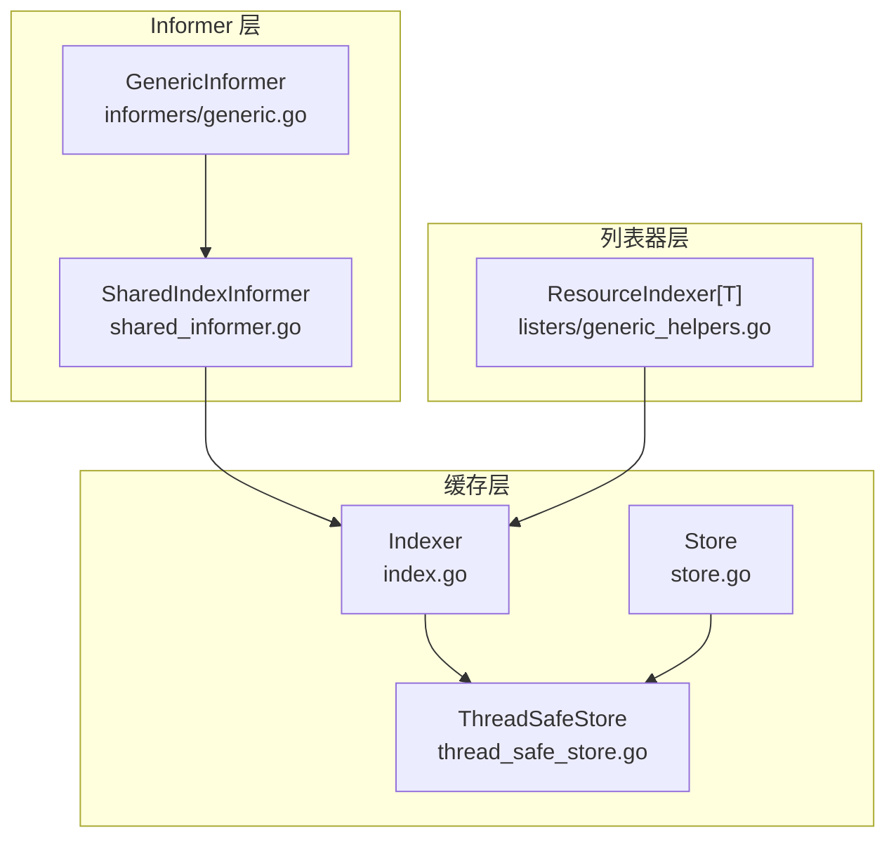
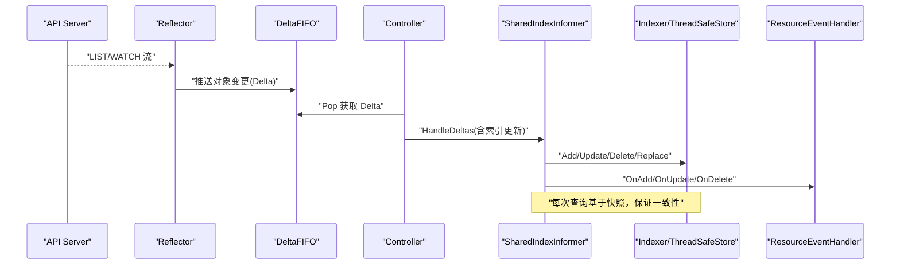
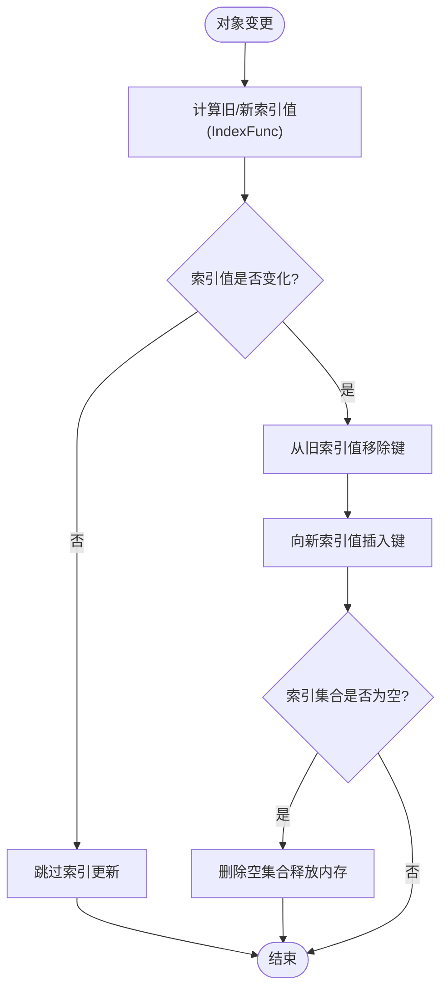
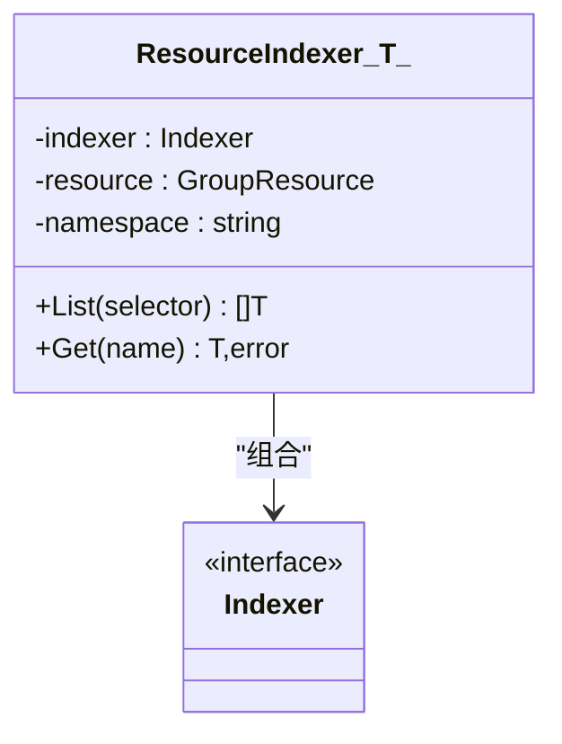
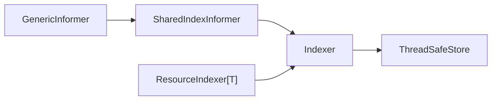

# 缓存与列表器

<cite>
**本文引用的文件**   
- [staging/src/k8s.io/client-go/tools/cache/shared_informer.go](file://staging/src/k8s.io/client-go/tools/cache/shared_informer.go)
- [staging/src/k8s.io/client-go/tools/cache/store.go](file://staging/src/k8s.io/client-go/tools/cache/store.go)
- [staging/src/k8s.io/client-go/tools/cache/thread_safe_store.go](file://staging/src/k8s.io/client-go/tools/cache/thread_safe_store.go)
- [staging/src/k8s.io/client-go/tools/cache/index.go](file://staging/src/k8s.io/client-go/tools/cache/index.go)
- [staging/src/k8s.io/client-go/listers/generic_helpers.go](file://staging/src/k8s.io/client-go/listers/generic_helpers.go)
- [staging/src/k8s.io/client-go/informers/generic.go](file://staging/src/k8s.io/client-go/informers/generic.go)
</cite>

## 目录
1. [简介](#简介)
2. [项目结构](#项目结构)
3. [核心组件](#核心组件)
4. [架构总览](#架构总览)
5. [详细组件分析](#详细组件分析)
6. [依赖关系分析](#依赖关系分析)
7. [性能考量](#性能考量)
8. [故障排查指南](#故障排查指南)
9. [结论](#结论)
10. [附录](#附录)

## 简介
本文件聚焦 Kubernetes Informer 的本地缓存机制与 Lister 能力，系统阐述以下主题：
- 本地缓存的数据结构与存储策略（Store、Indexer、ThreadSafeStore）
- Indexer 的实现原理与索引机制（多索引、命名空间索引等）
- Lister 接口设计与实现（按标签选择器查询、命名空间过滤）
- 缓存一致性保证与版本管理机制（ResourceVersion、同步语义）
- 完整缓存操作示例与最佳实践（增删改查、批量替换、事务）
- 性能特点与内存优化策略（Transform、索引重建、空集合清理）
- 缓存失效与重建处理机制（Replace、Resync、Watch 错误恢复）
- 大规模数据场景下的调优建议

## 项目结构
围绕 Informer 缓存与列表器的关键代码位于 client-go 的 tools/cache 与 listers 包中。整体组织如下：
- shared_informer.go：定义 SharedInformer/SharedIndexInformer 接口与共享 informer 的核心运行逻辑
- store.go：定义 Store 接口及基于 map+锁的基础 cache 实现
- thread_safe_store.go：线程安全的 ThreadSafeStore 实现与索引维护
- index.go：Indexer 接口、IndexFunc、默认命名空间索引函数
- generic_helpers.go：泛型 ResourceIndexer[T] 作为 Lister 的通用封装
- informers/generic.go：为所有资源提供 GenericInformer 适配层



图表来源
- [staging/src/k8s.io/client-go/tools/cache/shared_informer.go:292-349](file://staging/src/k8s.io/client-go/tools/cache/shared_informer.go#L292-L349)
- [staging/src/k8s.io/client-go/tools/cache/store.go:28-82](file://staging/src/k8s.io/client-go/tools/cache/store.go#L28-L82)
- [staging/src/k8s.io/client-go/tools/cache/thread_safe_store.go:31-70](file://staging/src/k8s.io/client-go/tools/cache/thread_safe_store.go#L31-L70)
- [staging/src/k8s.io/client-go/tools/cache/index.go:26-55](file://staging/src/k8s.io/client-go/tools/cache/index.go#L26-L55)
- [staging/src/k8s.io/client-go/listers/generic_helpers.go:27-45](file://staging/src/k8s.io/client-go/listers/generic_helpers.go#L27-L45)
- [staging/src/k8s.io/client-go/informers/generic.go:77-97](file://staging/src/k8s.io/client-go/informers/generic.go#L77-L97)

章节来源
- [staging/src/k8s.io/client-go/tools/cache/shared_informer.go:45-143](file://staging/src/k8s.io/client-go/tools/cache/shared_informer.go#L45-L143)
- [staging/src/k8s.io/client-go/tools/cache/store.go:28-82](file://staging/src/k8s.io/client-go/tools/cache/store.go#L28-L82)
- [staging/src/k8s.io/client-go/tools/cache/thread_safe_store.go:31-70](file://staging/src/k8s.io/client-go/tools/cache/thread_safe_store.go#L31-L70)
- [staging/src/k8s.io/client-go/tools/cache/index.go:26-55](file://staging/src/k8s.io/client-go/tools/cache/index.go#L26-L55)
- [staging/src/k8s.io/client-go/listers/generic_helpers.go:27-45](file://staging/src/k8s.io/client-go/listers/generic_helpers.go#L27-L45)
- [staging/src/k8s.io/client-go/informers/generic.go:77-97](file://staging/src/k8s.io/client-go/informers/generic.go#L77-L97)

## 核心组件
- SharedIndexInformer：提供事件订阅、增量更新、索引能力；内部持有 Indexer 与 Controller，负责从 ListerWatcher 拉取并推送 Delta 到处理器，再分发到各监听者
- Store：对象存储抽象，支持 Add/Update/Delete/List/Get/Replace 等操作
- ThreadSafeStore：线程安全存储实现，维护 items 映射与索引，支持 Replace 全量重建与 RV 追踪
- Indexer：在 Store 之上增加多索引能力，支持 ByIndex/IndexKeys/ListIndexFuncValues 等
- ResourceIndexer[T]：泛型列表器封装，提供 List(GetByKey) 与 Get(name) 访问，支持命名空间限定
- GenericInformer：为任意资源返回对应的 SharedIndexInformer 与 GenericLister

章节来源
- [staging/src/k8s.io/client-go/tools/cache/shared_informer.go:292-349](file://staging/src/k8s.io/client-go/tools/cache/shared_informer.go#L292-L349)
- [staging/src/k8s.io/client-go/tools/cache/store.go:28-82](file://staging/src/k8s.io/client-go/tools/cache/store.go#L28-L82)
- [staging/src/k8s.io/client-go/tools/cache/thread_safe_store.go:31-70](file://staging/src/k8s.io/client-go/tools/cache/thread_safe_store.go#L31-L70)
- [staging/src/k8s.io/client-go/tools/cache/index.go:26-55](file://staging/src/k8s.io/client-go/tools/cache/index.go#L26-L55)
- [staging/src/k8s.io/client-go/listers/generic_helpers.go:27-45](file://staging/src/k8s.io/client-go/listers/generic_helpers.go#L27-L45)
- [staging/src/k8s.io/client-go/informers/generic.go:77-97](file://staging/src/k8s.io/client-go/informers/generic.go#L77-L97)

## 架构总览
下图展示 Informer 启动后，数据从 API Server 经 Reflector 进入 DeltaFIFO，再由 Controller 入队、处理，最终写入本地缓存并通知监听者的流程。



图表来源
- [staging/src/k8s.io/client-go/tools/cache/shared_informer.go:584-647](file://staging/src/k8s.io/client-go/tools/cache/shared_informer.go#L584-L647)
- [staging/src/k8s.io/client-go/tools/cache/shared_informer.go:728-792](file://staging/src/k8s.io/client-go/tools/cache/shared_informer.go#L728-L792)
- [staging/src/k8s.io/client-go/tools/cache/store.go:28-82](file://staging/src/k8s.io/client-go/tools/cache/store.go#L28-L82)
- [staging/src/k8s.io/client-go/tools/cache/thread_safe_store.go:388-406](file://staging/src/k8s.io/client-go/tools/cache/thread_safe_store.go#L388-L406)

## 详细组件分析

### 共享 Informer 与一致性语义
- 一致性承诺：本地缓存与权威状态“最终一致”；对同一对象的缓存序列是权威序列的子序列且保持顺序；删除通知暴露最后已知非空状态但 ResourceVersion 表示“已不存在”
- 同步与就绪：HasSynced 表示至少完成一次完整 LIST；WaitForCacheSync/WaitFor 用于等待多个缓存就绪
- 事件分发：每个客户端的事件串行化，且先于后续更新；新增监听者在 Run 后会收到初始快照的添加事件
- Transform：可在对象落盘前进行字段裁剪或归一化，降低内存占用

章节来源
- [staging/src/k8s.io/client-go/tools/cache/shared_informer.go:45-143](file://staging/src/k8s.io/client-go/tools/cache/shared_informer.go#L45-L143)
- [staging/src/k8s.io/client-go/tools/cache/shared_informer.go:202-222](file://staging/src/k8s.io/client-go/tools/cache/shared_informer.go#L202-L222)
- [staging/src/k8s.io/client-go/tools/cache/shared_informer.go:384-420](file://staging/src/k8s.io/client-go/tools/cache/shared_informer.go#L384-L420)
- [staging/src/k8s.io/client-go/tools/cache/shared_informer.go:244-253](file://staging/src/k8s.io/client-go/tools/cache/shared_informer.go#L244-L253)

### 存储与索引：Store、Indexer、ThreadSafeStore
- Store：基础键值存储接口，Key 由 KeyFunc 生成（如 MetaNamespaceKeyFunc），支持 Replace 全量替换
- Indexer：扩展 Store 的多索引能力，支持按索引名查询对象或键集合
- ThreadSafeStore：线程安全实现，内部维护 items 与 indices；Replace 会重建索引；支持 LastStoreSyncResourceVersion 与 Bookmark 跟踪最新 RV

```mermaid
classDiagram
class Store {
+Add(obj) error
+Update(obj) error
+Delete(obj) error
+List() []interface{}
+ListKeys() []string
+Get(obj) (item, exists, err)
+GetByKey(key) (item, exists, err)
+Replace(list, rv) error
+LastStoreSyncResourceVersion() string
+Bookmark(rv) void
}
class Indexer {
+Index(indexName, obj) ([]interface{}, error)
+IndexKeys(indexName, indexedValue) ([]string, error)
+ByIndex(indexName, indexedValue) ([]interface{}, error)
+ListIndexFuncValues(indexName) []string
+GetIndexers() Indexers
+AddIndexers(newIndexers) error
}
class ThreadSafeStore {
+Add(key, obj)
+Update(key, obj)
+Delete(key)
+DeleteWithObject(key, obj)
+Get(key) (item, exists)
+List() []interface{}
+ListKeys() []string
+Replace(map[string]interface{}, rv)
+Index(indexName, obj) ([]interface{}, error)
+IndexKeys(indexName, indexedValue) ([]string, error)
+ByIndex(indexName, indexedValue) ([]interface{}, error)
+ListIndexFuncValues(name) []string
+GetIndexers() Indexers
+AddIndexers(newIndexers) error
+LastStoreSyncResourceVersion() string
+Bookmark(rv) void
}
Indexer --|> Store
ThreadSafeStore ..|> Indexer
```

图表来源
- [staging/src/k8s.io/client-go/tools/cache/store.go:28-82](file://staging/src/k8s.io/client-go/tools/cache/store.go#L28-L82)
- [staging/src/k8s.io/client-go/tools/cache/index.go:26-55](file://staging/src/k8s.io/client-go/tools/cache/index.go#L26-L55)
- [staging/src/k8s.io/client-go/tools/cache/thread_safe_store.go:31-70](file://staging/src/k8s.io/client-go/tools/cache/thread_safe_store.go#L31-L70)

章节来源
- [staging/src/k8s.io/client-go/tools/cache/store.go:202-443](file://staging/src/k8s.io/client-go/tools/cache/store.go#L202-L443)
- [staging/src/k8s.io/client-go/tools/cache/thread_safe_store.go:255-553](file://staging/src/k8s.io/client-go/tools/cache/thread_safe_store.go#L255-L553)
- [staging/src/k8s.io/client-go/tools/cache/index.go:26-101](file://staging/src/k8s.io/client-go/tools/cache/index.go#L26-L101)

### 索引机制与命名空间索引
- IndexFunc：将对象映射为一个或多个索引值字符串
- 默认命名空间索引：MetaNamespaceIndexFunc 提取 namespace 作为索引值，常量 NamespaceIndex 为其名称
- 索引更新：updateIndices/updateSingleIndex 在 Add/Update/Delete 时维护索引；删除时若集合为空则清理索引项以控制内存增长



图表来源
- [staging/src/k8s.io/client-go/tools/cache/thread_safe_store.go:169-253](file://staging/src/k8s.io/client-go/tools/cache/thread_safe_store.go#L169-L253)
- [staging/src/k8s.io/client-go/tools/cache/index.go:84-91](file://staging/src/k8s.io/client-go/tools/cache/index.go#L84-L91)

章节来源
- [staging/src/k8s.io/client-go/tools/cache/index.go:84-91](file://staging/src/k8s.io/client-go/tools/cache/index.go#L84-L91)
- [staging/src/k8s.io/client-go/tools/cache/thread_safe_store.go:169-253](file://staging/src/k8s.io/client-go/tools/cache/thread_safe_store.go#L169-L253)

### Lister 接口设计与实现
- ResourceIndexer[T]：封装 Indexer、GroupResource 与可选 namespace，提供 List(selector) 与 Get(name)
- 命名空间过滤：当 namespace 为空时回退到全量 ListAll；否则使用 ListAllByNamespace 进行命名空间级筛选
- 通过 NewNamespaced 派生命名空间受限的列表器实例



图表来源
- [staging/src/k8s.io/client-go/listers/generic_helpers.go:27-73](file://staging/src/k8s.io/client-go/listers/generic_helpers.go#L27-L73)

章节来源
- [staging/src/k8s.io/client-go/listers/generic_helpers.go:27-73](file://staging/src/k8s.io/client-go/listers/generic_helpers.go#L27-L73)

### 通用资源适配：GenericInformer
- GenericInformer 包装 SharedIndexInformer 并提供 GenericLister
- ForResource 根据资源类型路由到具体 Informer，统一返回 Lister 与 Informer

章节来源
- [staging/src/k8s.io/client-go/informers/generic.go:77-97](file://staging/src/k8s.io/client-go/informers/generic.go#L77-L97)
- [staging/src/k8s.io/client-go/informers/generic.go:99-489](file://staging/src/k8s.io/client-go/informers/generic.go#L99-L489)

## 依赖关系分析
- SharedIndexInformer 依赖 Indexer 与 Controller；Indexer 基于 ThreadSafeStore 实现
- ResourceIndexer[T] 依赖 Indexer 提供的索引与查询能力
- GenericInformer 依赖具体资源的 Informer 工厂方法，返回统一的 Lister 与 Informer



图表来源
- [staging/src/k8s.io/client-go/tools/cache/shared_informer.go:584-647](file://staging/src/k8s.io/client-go/tools/cache/shared_informer.go#L584-L647)
- [staging/src/k8s.io/client-go/tools/cache/store.go:202-443](file://staging/src/k8s.io/client-go/tools/cache/store.go#L202-L443)
- [staging/src/k8s.io/client-go/tools/cache/thread_safe_store.go:255-553](file://staging/src/k8s.io/client-go/tools/cache/thread_safe_store.go#L255-L553)
- [staging/src/k8s.io/client-go/listers/generic_helpers.go:27-73](file://staging/src/k8s.io/client-go/listers/generic_helpers.go#L27-L73)
- [staging/src/k8s.io/client-go/informers/generic.go:77-97](file://staging/src/k8s.io/client-go/informers/generic.go#L77-L97)

章节来源
- [staging/src/k8s.io/client-go/tools/cache/shared_informer.go:584-647](file://staging/src/k8s.io/client-go/tools/cache/shared_informer.go#L584-L647)
- [staging/src/k8s.io/client-go/tools/cache/store.go:202-443](file://staging/src/k8s.io/client-go/tools/cache/store.go#L202-L443)
- [staging/src/k8s.io/client-go/tools/cache/thread_safe_store.go:255-553](file://staging/src/k8s.io/client-go/tools/cache/thread_safe_store.go#L255-L553)
- [staging/src/k8s.io/client-go/listers/generic_helpers.go:27-73](file://staging/src/k8s.io/client-go/listers/generic_helpers.go#L27-L73)
- [staging/src/k8s.io/client-go/informers/generic.go:77-97](file://staging/src/k8s.io/client-go/informers/generic.go#L77-L97)

## 性能考量
- 内存优化
  - Transform：在对象入缓存前裁剪无用字段，显著降低内存占用
  - 索引空集合清理：删除后若索引集合为空则移除，避免高基数短生命周期资源导致内存膨胀
  - 合理索引数量：仅创建必要索引，避免过多索引带来的更新开销
- 查询性能
  - 优先使用 ByIndex/IndexKeys 进行精确匹配，减少全量扫描
  - 命名空间过滤结合 ListAllByNamespace 缩小结果集
- 批处理与替换
  - Replace 全量重建适合冷启动或大规模增量合并；注意重建期间索引重建成本
  - Transaction 批量写可减少锁竞争（底层 ThreadSafeStore 支持）
- 监控与指标
  - LastStoreSyncResourceVersion 与 Bookmark 可用于观测缓存进度与一致性
  - 指标提供者可输出 store 相关指标，辅助容量与延迟评估

章节来源
- [staging/src/k8s.io/client-go/tools/cache/shared_informer.go:244-253](file://staging/src/k8s.io/client-go/tools/cache/shared_informer.go#L244-L253)
- [staging/src/k8s.io/client-go/tools/cache/thread_safe_store.go:241-253](file://staging/src/k8s.io/client-go/tools/cache/thread_safe_store.go#L241-L253)
- [staging/src/k8s.io/client-go/tools/cache/thread_safe_store.go:388-406](file://staging/src/k8s.io/client-go/tools/cache/thread_safe_store.go#L388-L406)
- [staging/src/k8s.io/client-go/tools/cache/thread_safe_store.go:435-459](file://staging/src/k8s.io/client-go/tools/cache/thread_safe_store.go#L435-L459)

## 故障排查指南
- Watch 连接断开
  - 设置 WatchErrorHandler 观察错误类型与日志，Informer 会自动退避重试
- 缓存未就绪
  - 使用 WaitForCacheSync/WaitForNamedCacheSync 等待 HasSynced；必要时检查控制器停止信号与上下文取消
- 事件积压
  - 文档强调需快速处理事件，耗时逻辑应下放到工作队列，避免阻塞通知分发
- 索引冲突
  - AddIndexers 时若索引名重复会报错，需确保唯一性
- 资源版本不一致
  - 通过 LastStoreSyncResourceVersion 与 Bookmark 定位最新可见版本；Replace 时传入正确的 resourceVersion

章节来源
- [staging/src/k8s.io/client-go/tools/cache/shared_informer.go:223-243](file://staging/src/k8s.io/client-go/tools/cache/shared_informer.go#L223-L243)
- [staging/src/k8s.io/client-go/tools/cache/shared_informer.go:384-420](file://staging/src/k8s.io/client-go/tools/cache/shared_informer.go#L384-L420)
- [staging/src/k8s.io/client-go/tools/cache/thread_safe_store.go:502-518](file://staging/src/k8s.io/client-go/tools/cache/thread_safe_store.go#L502-L518)
- [staging/src/k8s.io/client-go/tools/cache/thread_safe_store.go:435-459](file://staging/src/k8s.io/client-go/tools/cache/thread_safe_store.go#L435-L459)

## 结论
Kubernetes Informer 的缓存体系以 Store/Indexer/ThreadSafeStore 为核心，配合 SharedIndexInformer 的事件驱动与最终一致性语义，提供了高效、可扩展的本地视图。通过合理的索引设计、Transform 裁剪、命名空间过滤与批量操作，可以在大规模集群中兼顾性能与内存占用。配合完善的同步与错误恢复机制，开发者可以构建稳定可靠的控制器与业务组件。

## 附录

### 缓存操作最佳实践清单
- 初始化
  - 使用 NewSharedIndexInformerWithOptions 配置 ResyncPeriod 与 Indexers
  - 在 Run 之前设置 SetTransform 裁剪对象字段
- 增删改查
  - 单条：Add/Update/Delete；批量：Transaction 或 Replace
  - 查询：优先 ByIndex/IndexKeys；命名空间过滤使用 ListAllByNamespace
- 一致性
  - 使用 HasSynced/WaitForCacheSync 确保缓存就绪后再执行业务逻辑
  - 关注 ResourceVersion 与 Bookmark，必要时做幂等处理
- 性能
  - 控制索引数量与基数；及时清理空集合
  - 大对象裁剪、避免在事件回调中执行重任务

章节来源
- [staging/src/k8s.io/client-go/tools/cache/shared_informer.go:317-349](file://staging/src/k8s.io/client-go/tools/cache/shared_informer.go#L317-L349)
- [staging/src/k8s.io/client-go/tools/cache/store.go:369-387](file://staging/src/k8s.io/client-go/tools/cache/store.go#L369-L387)
- [staging/src/k8s.io/client-go/tools/cache/thread_safe_store.go:269-299](file://staging/src/k8s.io/client-go/tools/cache/thread_safe_store.go#L269-L299)
- [staging/src/k8s.io/client-go/listers/generic_helpers.go:47-73](file://staging/src/k8s.io/client-go/listers/generic_helpers.go#L47-L73)