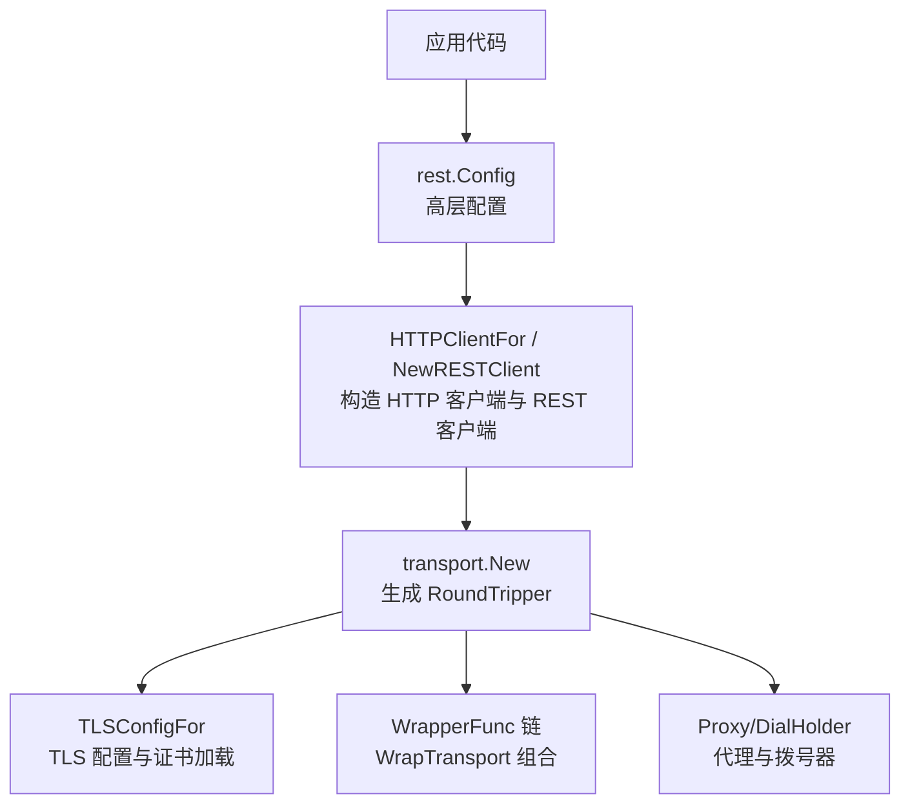
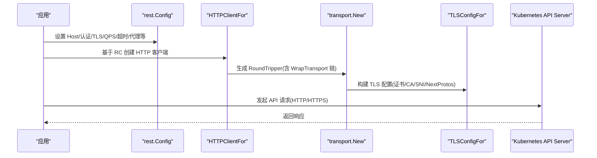
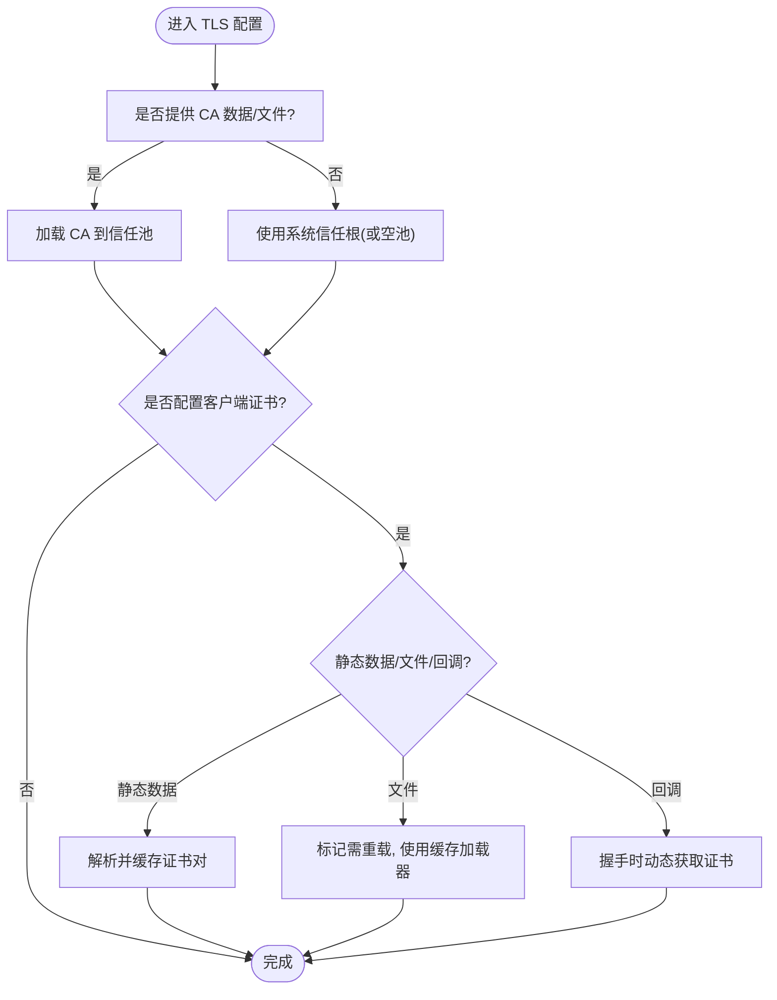
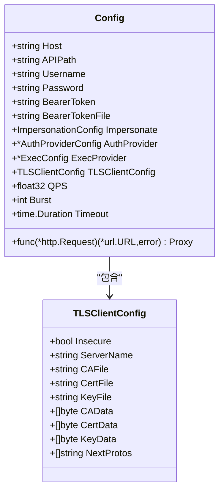
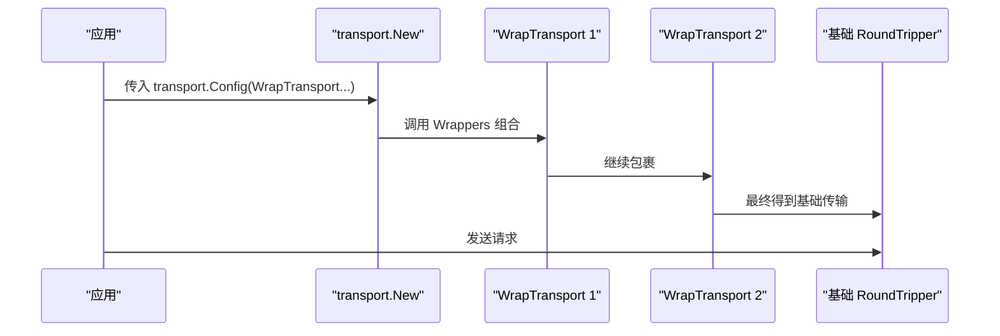
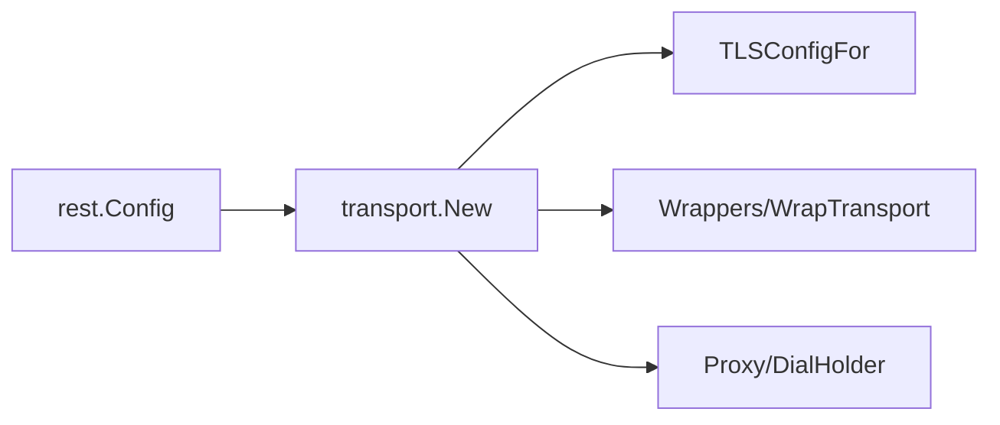
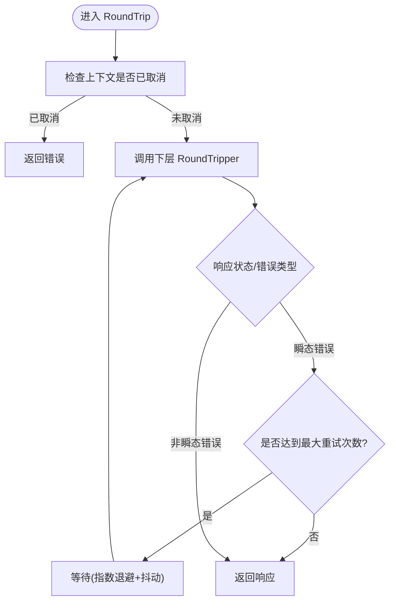

# REST客户端配置

<cite>
**本文引用的文件**   
- [config.go](file://staging/src/k8s.io/client-go/rest/config.go)
- [transport_config.go](file://staging/src/k8s.io/client-go/transport/config.go)
- [transport_transport.go](file://staging/src/k8s.io/client-go/transport/transport.go)
</cite>

## 目录
1. [简介](#简介)
2. [项目结构](#项目结构)
3. [核心组件](#核心组件)
4. [架构总览](#架构总览)
5. [详细组件分析](#详细组件分析)
6. [依赖关系分析](#依赖关系分析)
7. [性能与高可用](#性能与高可用)
8. [故障处理与重试模式](#故障处理与重试模式)
9. [安全最佳实践](#安全最佳实践)
10. [结论](#结论)
11. [附录：常见云认证集成要点](#附录常见云认证集成要点)

## 简介
本指南聚焦于 Kubernetes Go 客户端的 REST 客户端配置，围绕 rest.Config 的结构、认证方式（含插件）、TLS 与安全、HTTP 传输层自定义、代理、连接池与负载均衡、以及网络故障处理与重试策略等主题，提供从入门到进阶的系统化说明。文档同时给出面向 Azure、GCP、OIDC 等云提供商的集成要点与注意事项，帮助读者在生产环境中构建稳定、安全、高性能的 API 访问通道。

## 项目结构
REST 客户端配置由两层组成：
- 高层配置：rest.Config，聚合 API 地址、内容协商、认证、限流、超时、代理、用户代理等。
- 底层传输：transport.Config 与 transport.New，负责 TLS、证书轮换、RoundTripper 包装链、Dialer 注入等。

图表来源
- [config.go:323-402](file://staging/src/k8s.io/client-go/rest/config.go#L323-L402)
- [transport_config.go:27-80](file://staging/src/k8s.io/client-go/transport/config.go#L27-L80)
- [transport_transport.go:36-64](file://staging/src/k8s.io/client-go/transport/transport.go#L36-L64)

章节来源
- [config.go:54-166](file://staging/src/k8s.io/client-go/rest/config.go#L54-L166)
- [transport_config.go:27-80](file://staging/src/k8s.io/client-go/transport/config.go#L27-L80)
- [transport_transport.go:36-64](file://staging/src/k8s.io/client-go/transport/transport.go#L36-L64)

## 核心组件
- rest.Config：定义 Host、APIPath、ContentConfig、用户名/密码、BearerToken/BearerTokenFile、Impersonate、AuthProvider、ExecProvider、TLSClientConfig、UserAgent、DisableCompression、Transport/WrapTransport、QPS/Burst/RateLimiter、WarningHandler、Timeout、Dial、Proxy 等。
- rest.TLSClientConfig：Insecure、ServerName、CA/Cert/Key 文件与数据、NextProtos。
- transport.Config：更贴近传输层的配置，包含 TLS、Basic、Token、Impersonate、DisableCompression、Transport/WrapTransport、DialHolder、Proxy。
- transport.New：根据 transport.Config 生成 http.RoundTripper，并应用 WrapperFunc 链。
- transport.TLSConfigFor：将 transport.Config 转换为 tls.Config，支持静态/动态证书、CA 校验、SNI、NextProtos 等。

章节来源
- [config.go:54-166](file://staging/src/k8s.io/client-go/rest/config.go#L54-L166)
- [config.go:234-265](file://staging/src/k8s.io/client-go/rest/config.go#L234-L265)
- [transport_config.go:27-80](file://staging/src/k8s.io/client-go/transport/config.go#L27-L80)
- [transport_transport.go:36-64](file://staging/src/k8s.io/client-go/transport/transport.go#L36-L64)
- [transport_transport.go:78-211](file://staging/src/k8s.io/client-go/transport/transport.go#L78-L211)

## 架构总览
REST 客户端初始化与请求路径如下：

图表来源
- [config.go:323-402](file://staging/src/k8s.io/client-go/rest/config.go#L323-L402)
- [transport_transport.go:36-64](file://staging/src/k8s.io/client-go/transport/transport.go#L36-L64)
- [transport_transport.go:78-211](file://staging/src/k8s.io/client-go/transport/transport.go#L78-L211)

## 详细组件分析

### rest.Config 结构与关键选项
- API 服务器地址
  - Host：主机名或 URL；若为 URL，其 Path 作为所有请求的前缀。
  - APIPath：API 根子路径。
- 内容协商
  - ContentConfig.AcceptContentTypes、ContentType、GroupVersion、NegotiatedSerializer。
- 认证
  - Username/Password：Basic 认证。
  - BearerToken/BearerTokenFile：令牌直传或从文件周期性读取。
  - Impersonate：模拟用户/组/UID/Extra。
  - AuthProvider：外部认证插件（如云厂商 OIDC）。
  - ExecProvider：可执行程序式认证（如 gcloud/gsutil 等）。
- TLS
  - TLSClientConfig.Insecure、ServerName、CA/Cert/Key 文件或数据、NextProtos。
- 传输与中间件
  - Transport：直接指定 http.RoundTripper（与 TLS 证书选项互斥）。
  - WrapTransport：在底层传输初始化后叠加中间件。
- 限流与告警
  - QPS/Burst/RateLimiter：令牌桶限流或自定义 RateLimiter。
  - WarningHandler/WarningHandlerWithContext：处理服务端警告。
- 超时与拨号
  - Timeout：请求级超时。
  - Dial：自定义拨号函数。
- 代理
  - Proxy：http.ProxyFromEnvironment 默认行为；nil 表示不使用代理。
- 其他
  - UserAgent：标识调用方。
  - DisableCompression：禁用自动压缩。

章节来源
- [config.go:54-166](file://staging/src/k8s.io/client-go/rest/config.go#L54-L166)
- [config.go:302-321](file://staging/src/k8s.io/client-go/rest/config.go#L302-L321)

### TLS 与安全配置
- 证书与 CA
  - 支持文件路径与内存数据两种形式，内存优先。
  - Insecure 仅用于测试，生产环境不建议启用。
  - ServerName 用于 SNI 与证书校验。
  - NextProtos 控制应用层协议偏好（如 http/1.1、h2）。
- 双向 TLS
  - 客户端证书与私钥可在握手时通过回调或文件动态加载。
- 文件重载与缓存
  - 当使用文件时，支持按需重载与短期缓存，避免频繁 IO。
- 特征开关
  - CA 轮换特性受功能门控影响，开启后可按策略更新 CA。

图表来源
- [transport_transport.go:78-211](file://staging/src/k8s.io/client-go/transport/transport.go#L78-L211)
- [transport_transport.go:216-244](file://staging/src/k8s.io/client-go/transport/transport.go#L216-L244)
- [transport_transport.go:262-304](file://staging/src/k8s.io/client-go/transport/transport.go#L262-L304)

章节来源
- [config.go:234-265](file://staging/src/k8s.io/client-go/rest/config.go#L234-L265)
- [transport_config.go:132-162](file://staging/src/k8s.io/client-go/transport/config.go#L132-L162)
- [transport_transport.go:78-211](file://staging/src/k8s.io/client-go/transport/transport.go#L78-L211)

### 认证插件与云集成要点
- Basic 认证
  - 通过 Username/Password 字段启用。
- Bearer Token
  - 直接设置 BearerToken，或设置 BearerTokenFile 让客户端周期读取最新令牌。
- 插件式认证
  - AuthProvider：由 clientcmdapi.AuthProviderConfig 描述，常用于 OIDC 等云认证流程。
  - ExecProvider：通过可执行程序动态获取令牌，适合 gcloud、aws cli 等场景。
- 模拟身份
  - Impersonate：在不改变实际凭据的情况下，以目标用户/组/UID/Extra 发起请求。

图表来源
- [config.go:54-166](file://staging/src/k8s.io/client-go/rest/config.go#L54-L166)
- [config.go:234-265](file://staging/src/k8s.io/client-go/rest/config.go#L234-L265)

章节来源
- [config.go:54-166](file://staging/src/k8s.io/client-go/rest/config.go#L54-L166)

### HTTP 传输层自定义
- 自定义 RoundTripper
  - 可通过 Transport 直接注入，但不可与 TLS 证书选项混用。
  - 推荐通过 WrapTransport 在底层传输初始化后叠加中间件（如日志、指标、重试、熔断等）。
- 压缩
  - DisableCompression 可关闭自动 GZip 压缩。
- 代理
  - Proxy 为空时使用 http.ProxyFromEnvironment；返回 nil 表示不使用代理。
- 拨号器
  - Dial 允许自定义 TCP 拨号逻辑；底层也提供 DialHolder 使配置可缓存。
- 上下文取消
  - 通过 ContextCanceller 包装 RoundTripper，实现基于 context 的请求取消。

图表来源
- [transport_transport.go:306-333](file://staging/src/k8s.io/client-go/transport/transport.go#L306-L333)
- [transport_transport.go:335-361](file://staging/src/k8s.io/client-go/transport/transport.go#L335-L361)

章节来源
- [transport_config.go:27-80](file://staging/src/k8s.io/client-go/transport/config.go#L27-L80)
- [transport_transport.go:36-64](file://staging/src/k8s.io/client-go/transport/transport.go#L36-L64)
- [transport_transport.go:306-361](file://staging/src/k8s.io/client-go/transport/transport.go#L306-L361)

### 连接池、负载均衡与高可用
- 连接复用
  - 共享 http.Client 可实现连接复用与连接池管理。
- 负载均衡
  - 通过 Host 指向多后端入口（如 LB/Ingress），结合客户端侧重试与幂等策略提升可用性。
- 高可用建议
  - 合理设置 QPS/Burst 与 RateLimiter，避免突发流量打满后端。
  - 使用 WrapTransport 添加健康检查与快速失败逻辑。

[本节为通用指导，不直接分析具体文件]

## 依赖关系分析
- rest.Config 依赖 transport 包进行传输层组装。
- transport.New 负责选择基础 RoundTripper（TLS 或自定义）并应用 WrapperFunc 链。
- TLSConfigFor 负责将 transport.Config 转换为 tls.Config，并处理证书与 CA 的加载与校验。

图表来源
- [config.go:323-402](file://staging/src/k8s.io/client-go/rest/config.go#L323-L402)
- [transport_transport.go:36-64](file://staging/src/k8s.io/client-go/transport/transport.go#L36-L64)
- [transport_transport.go:78-211](file://staging/src/k8s.io/client-go/transport/transport.go#L78-L211)

章节来源
- [config.go:323-402](file://staging/src/k8s.io/client-go/rest/config.go#L323-L402)
- [transport_transport.go:36-64](file://staging/src/k8s.io/client-go/transport/transport.go#L36-L64)

## 性能与高可用
- 限流与背压
  - 使用 QPS/Burst 或自定义 RateLimiter 控制请求速率，避免雪崩。
- 超时控制
  - 设置合理的 Timeout，防止长尾请求占用资源。
- 压缩
  - 根据负载与 CPU 权衡是否启用压缩。
- 连接复用
  - 共享 http.Client，减少握手开销。
- 中间件
  - 通过 WrapTransport 增加指标采集、延迟统计、快速失败等能力。

[本节为通用指导，不直接分析具体文件]

## 故障处理与重试模式
- 上下文取消
  - 使用 ContextCanceller 包装 RoundTripper，在 context 结束时中断请求。
- 重试策略
  - 建议在 WrapTransport 中实现指数退避与抖动，针对瞬态错误（网络抖动、5xx）进行有限次重试。
- 熔断器
  - 在 WrapTransport 中引入熔断器，依据错误率/延迟阈值快速失败，保护下游。
- 告警与日志
  - 利用 WarningHandler/WarningHandlerWithContext 处理服务端警告，便于观测与排障。

[此图为概念性流程图，不映射具体源码文件]

## 安全最佳实践
- 始终启用 HTTPS，避免 Insecure 模式。
- 明确配置 CA，不要依赖系统根证书集合（除非确有必要）。
- 使用 BearerTokenFile 而非硬编码令牌，配合文件系统权限控制。
- 最小权限原则：结合 RBAC 与 Impersonate 精确授权。
- 定期轮换证书与密钥，启用文件重载与缓存机制。
- 限制 NextProtos 至必要协议，降低攻击面。
- 记录并审计敏感字段输出，避免泄露。

[本节为通用指导，不直接分析具体文件]

## 结论
通过 rest.Config 与 transport 层的协同，Kubernetes Go 客户端提供了灵活且安全的 REST 访问能力。合理配置认证、TLS、限流、超时与中间件，并结合重试与熔断策略，可在复杂网络环境下获得稳定、高效、可观测的 API 访问体验。

[本节为总结性内容，不直接分析具体文件]

## 附录：常见云认证集成要点
- OIDC（通用）
  - 使用 AuthProvider 配置 OIDC 端点、客户端 ID、重定向 URL 等，由插件负责刷新令牌。
  - 或使用 ExecProvider 调用外部工具（如 kubectl oidc-login）获取令牌。
- Azure
  - 通常通过 ExecProvider 调用 az cli 获取令牌，或在 Pod 中使用 Workload Identity。
- GCP
  - 常用 gcloud 或 Workload Identity 获取令牌；也可通过 OIDC 插件集成。
- AWS
  - 可使用 aws-iam-authenticator 或 IRSA 方案，结合 ExecProvider 注入令牌。

[本节为通用指导，不直接分析具体文件]