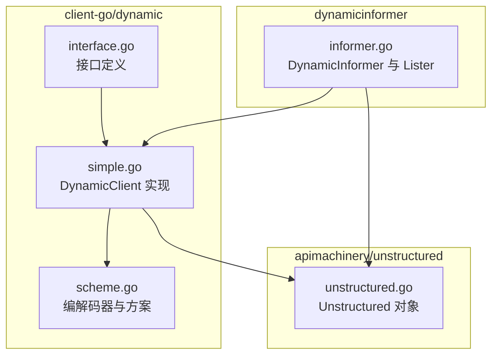
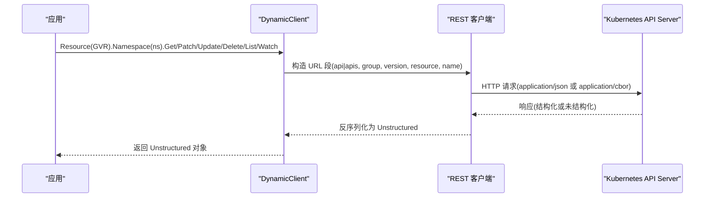
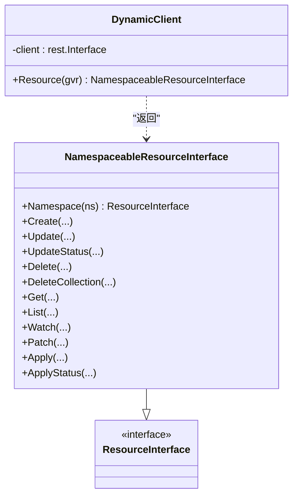
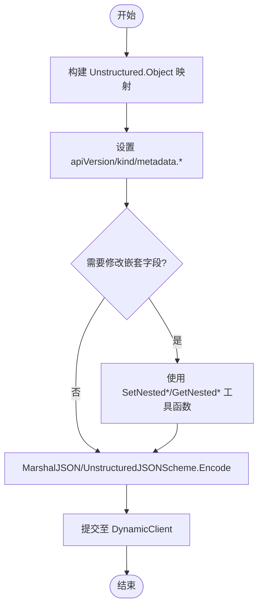
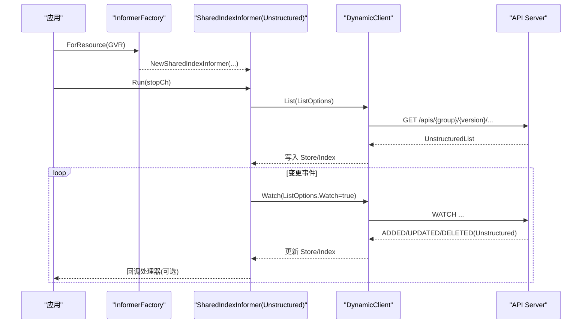
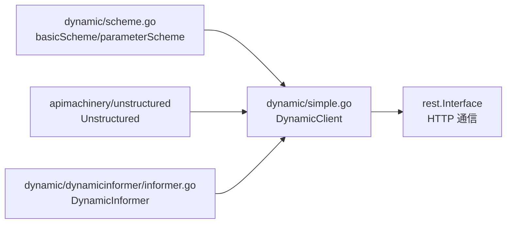

# 动态客户端

<cite>
**本文引用的文件**   
- [staging/src/k8s.io/client-go/dynamic/interface.go](file://staging/src/k8s.io/client-go/dynamic/interface.go)
- [staging/src/k8s.io/client-go/dynamic/simple.go](file://staging/src/k8s.io/client-go/dynamic/simple.go)
- [staging/src/k8s.io/client-go/dynamic/scheme.go](file://staging/src/k8s.io/client-go/dynamic/scheme.go)
- [staging/src/k8s.io/apimachinery/pkg/apis/meta/v1/unstructured/unstructured.go](file://staging/src/k8s.io/apimachinery/pkg/apis/meta/v1/unstructured/unstructured.go)
- [staging/src/k8s.io/client-go/dynamic/dynamicinformer/informer.go](file://staging/src/k8s.io/client-go/dynamic/dynamicinformer/informer.go)
- [staging/src/k8s.io/client-go/ARCHITECTURE.md](file://staging/src/k8s.io/client-go/ARCHITECTURE.md)
</cite>

## 目录
1. [简介](#简介)
2. [项目结构](#项目结构)
3. [核心组件](#核心组件)
4. [架构总览](#架构总览)
5. [详细组件分析](#详细组件分析)
6. [依赖关系分析](#依赖关系分析)
7. [性能考虑](#性能考虑)
8. [故障排查指南](#故障排查指南)
9. [结论](#结论)
10. [附录](#附录)

## 简介
本指南面向使用 Kubernetes Go 客户端进行“动态”资源操作的开发者，聚焦 DynamicClient、unstructured 对象与 DynamicInformer/DynamicLister 的使用。内容涵盖：
- DynamicClient 的设计理念与适用场景（运行时发现并操作任意 API 资源，包括 CRD）
- unstructured 对象的创建、修改与操作方式
- 完整的 CRD 操作流程（定义、创建、更新、删除）
- DynamicInformer 与 DynamicLister 的使用方法（对未知类型资源的事件监听与缓存）
- JSON/YAML 序列化与反序列化的处理技巧
- 错误处理与类型转换的最佳实践

## 项目结构
围绕动态客户端的核心代码位于 client-go 的 dynamic 包以及 apimachinery 的 unstructured 包；DynamicInformer 位于 dynamic/dynamicinformer 子包。

图示来源
- [staging/src/k8s.io/client-go/dynamic/interface.go:29-50](file://staging/src/k8s.io/client-go/dynamic/interface.go#L29-L50)
- [staging/src/k8s.io/client-go/dynamic/simple.go:34-111](file://staging/src/k8s.io/client-go/dynamic/simple.go#L34-L111)
- [staging/src/k8s.io/client-go/dynamic/scheme.go:29-69](file://staging/src/k8s.io/client-go/dynamic/scheme.go#L29-L69)
- [staging/src/k8s.io/apimachinery/pkg/apis/meta/v1/unstructured/unstructured.go:31-46](file://staging/src/k8s.io/apimachinery/pkg/apis/meta/v1/unstructured/unstructured.go#L31-L46)
- [staging/src/k8s.io/client-go/dynamic/dynamicinformer/informer.go](file://staging/src/k8s.io/client-go/dynamic/dynamicinformer/informer.go)

章节来源
- [staging/src/k8s.io/client-go/ARCHITECTURE.md:58-71](file://staging/src/k8s.io/client-go/ARCHITECTURE.md#L58-L71)

## 核心组件
- DynamicClient：以 unstructured.Unstructured 为数据载体，通过 REST 接口对任意 GroupVersionResource 执行 CRUD、Patch、Apply、Watch 等操作。
- unstructured.Unstructured：通用对象模型，内部以 map[string]interface{} 承载字段，提供元数据访问器与列表遍历能力。
- DynamicInformer/DynamicLister：基于 DynamicClient 和 Discovery/OpenAPI 信息，对未知类型的资源建立事件监听与本地缓存。

章节来源
- [staging/src/k8s.io/client-go/dynamic/simple.go:34-111](file://staging/src/k8s.io/client-go/dynamic/simple.go#L34-L111)
- [staging/src/k8s.io/apimachinery/pkg/apis/meta/v1/unstructured/unstructured.go:31-46](file://staging/src/k8s.io/apimachinery/pkg/apis/meta/v1/unstructured/unstructured.go#L31-L46)
- [staging/src/k8s.io/client-go/dynamic/dynamicinformer/informer.go](file://staging/src/k8s.io/client-go/dynamic/dynamicinformer/informer.go)

## 架构总览
DynamicClient 的工作流依赖于 discovery 与 OpenAPI schema：
- discovery.DiscoveryClient 用于发现集群中可用的 API 资源（Group/Version/Resource）。
- OpenAPI v3 描述资源的结构，使动态客户端具备“模式感知”能力。
- DynamicClient 将请求映射到 /api 或 /apis 路径，并以 application/json（可选 application/cbor）作为内容协商结果。

图示来源
- [staging/src/k8s.io/client-go/dynamic/simple.go:344-362](file://staging/src/k8s.io/client-go/dynamic/simple.go#L344-L362)
- [staging/src/k8s.io/client-go/dynamic/scheme.go:40-69](file://staging/src/k8s.io/client-go/dynamic/scheme.go#L40-L69)
- [staging/src/k8s.io/client-go/ARCHITECTURE.md:58-71](file://staging/src/k8s.io/client-go/ARCHITECTURE.md#L58-L71)

## 详细组件分析

### DynamicClient 设计与用法
- 构造与配置
  - 通过 rest.Config 创建，自动设置 Content-Type/Accept 等默认值，支持 CBOR 特性门控。
  - NewForConfig/NewForConfigAndClient 两种入口，前者内部构建 http.Client。
- 资源定位
  - Resource(GVR) 获取 NamespaceableResourceInterface，再 .Namespace(ns) 限定命名空间。
  - makeURLSegments 根据 GVR 与 namespace/name 拼接 REST 路径。
- 基本操作
  - Create/Update/UpdateStatus/Delete/DeleteCollection/Get/List/Patch/Apply/ApplyStatus/Watch。
  - Apply 会检查 managedFields，避免重复 apply 冲突。
- 参数编码
  - SpecificallyVersionedParams 配合 dynamicParameterCodec 将 ListOptions/PatchOptions 等编码为查询参数。

图示来源
- [staging/src/k8s.io/client-go/dynamic/simple.go:34-111](file://staging/src/k8s.io/client-go/dynamic/simple.go#L34-L111)
- [staging/src/k8s.io/client-go/dynamic/interface.go:29-50](file://staging/src/k8s.io/client-go/dynamic/interface.go#L29-L50)

章节来源
- [staging/src/k8s.io/client-go/dynamic/simple.go:42-101](file://staging/src/k8s.io/client-go/dynamic/simple.go#L42-L101)
- [staging/src/k8s.io/client-go/dynamic/simple.go:119-327](file://staging/src/k8s.io/client-go/dynamic/simple.go#L119-L327)
- [staging/src/k8s.io/client-go/dynamic/simple.go:343-362](file://staging/src/k8s.io/client-go/dynamic/simple.go#L343-L362)
- [staging/src/k8s.io/client-go/dynamic/scheme.go:29-69](file://staging/src/k8s.io/client-go/dynamic/scheme.go#L29-L69)

### unstructured 对象的操作
- 数据结构
  - Object 字段为 map[string]interface{}，可表示任意 JSON 兼容结构。
- 元数据访问
  - Get/Set APIVersion/Kind/Namespace/Name/Labels/Annotations/Finalizers/ManagedFields 等。
- 列表处理
  - IsList/ToList/EachListItem 支持将响应体视为列表并逐项迭代。
- 序列化
  - MarshalJSON/UnmarshalJSON 委托给 UnstructuredJSONScheme。

图示来源
- [staging/src/k8s.io/apimachinery/pkg/apis/meta/v1/unstructured/unstructured.go:31-46](file://staging/src/k8s.io/apimachinery/pkg/apis/meta/v1/unstructured/unstructured.go#L31-L46)
- [staging/src/k8s.io/apimachinery/pkg/apis/meta/v1/unstructured/unstructured.go:120-133](file://staging/src/k8s.io/apimachinery/pkg/apis/meta/v1/unstructured/unstructured.go#L120-L133)
- [staging/src/k8s.io/apimachinery/pkg/apis/meta/v1/unstructured/unstructured.go:54-102](file://staging/src/k8s.io/apimachinery/pkg/apis/meta/v1/unstructured/unstructured.go#L54-L102)

章节来源
- [staging/src/k8s.io/apimachinery/pkg/apis/meta/v1/unstructured/unstructured.go:222-494](file://staging/src/k8s.io/apimachinery/pkg/apis/meta/v1/unstructured/unstructured.go#L222-L494)

### DynamicInformer 与 DynamicLister
- 作用
  - 针对未知类型（如 CRD）建立 Watch 连接，维护本地缓存，并提供 Lister 进行高效读取。
- 典型流程
  - 初始化 InformerFactory -> ForResource(GVR) -> NewSharedIndexInformer -> Run(stopCh)
  - 通过 SharedInformer.GetStore() 或 Lister 获取缓存对象
- 与 DynamicClient 的关系
  - Informer 底层仍使用 DynamicClient 发起 List/Watch 请求，并将响应解析为 Unstructured 存入索引。

图示来源
- [staging/src/k8s.io/client-go/dynamic/dynamicinformer/informer.go](file://staging/src/k8s.io/client-go/dynamic/dynamicinformer/informer.go)
- [staging/src/k8s.io/client-go/dynamic/simple.go:263-271](file://staging/src/k8s.io/client-go/dynamic/simple.go#L263-L271)

章节来源
- [staging/src/k8s.io/client-go/dynamic/dynamicinformer/informer.go](file://staging/src/k8s.io/client-go/dynamic/dynamicinformer/informer.go)
- [staging/src/k8s.io/client-go/dynamic/simple.go:263-271](file://staging/src/k8s.io/client-go/dynamic/simple.go#L263-L271)

### CRD 完整操作示例（步骤说明）
以下以“自定义资源 Foo”为例，给出端到端操作步骤（不展示具体代码片段）：
- 准备阶段
  - 使用 discovery 确认 apiextensions.k8s.io/v1 CustomResourceDefinition 可用。
  - 准备 CRD 的 YAML/JSON 描述（包含 spec.names.kind、spec.group、spec.versions[].schema.openAPIV3Schema 等）。
- 创建 CRD
  - 构造 Unstructured，设置 apiVersion=apiextensions.k8s.io/v1、kind=CustomResourceDefinition。
  - 调用 DynamicClient.Resource(GroupVersionResource{Group:"apiextensions.k8s.io", Version:"v1", Resource:"customresourcedefinitions"}).Create(...)。
- 等待 CRD 就绪
  - 使用 Watch 或 List 轮询，观察 status.storedVersions 或 conditions 达到 Ready。
- 创建/更新/删除自定义资源实例
  - 构造 Unstructured，设置 apiVersion=<group>/<version>、kind=<Kind>、metadata.name/namespace。
  - 使用 DynamicClient.Resource(GVR).Namespace(ns).Create/Update/Delete/Patch/Apply。
- 事件监听与缓存
  - 使用 DynamicInformer.ForResource(GVR) 启动 Informer，并通过 Lister 读取缓存。
- 注意事项
  - Apply 前确保对象未携带 managedFields，否则会被拒绝。
  - 批量操作建议使用 List/Watch 结合本地缓存，减少网络往返。

章节来源
- [staging/src/k8s.io/client-go/dynamic/simple.go:119-327](file://staging/src/k8s.io/client-go/dynamic/simple.go#L119-L327)
- [staging/src/k8s.io/client-go/dynamic/simple.go:263-271](file://staging/src/k8s.io/client-go/dynamic/simple.go#L263-L271)
- [staging/src/k8s.io/client-go/dynamic/dynamicinformer/informer.go](file://staging/src/k8s.io/client-go/dynamic/dynamicinformer/informer.go)

### JSON/YAML 序列化与反序列化技巧
- 推荐统一使用 UnstructuredJSONScheme 进行编解码，保证与 Kubernetes 元数据一致。
- 对于复杂嵌套字段，优先使用 SetNested*/GetNested* 工具函数，避免手动 map 操作出错。
- 若需与第三方库交互，可将 Unstructured.Object 直接当作 JSON 树传递。

章节来源
- [staging/src/k8s.io/apimachinery/pkg/apis/meta/v1/unstructured/unstructured.go:120-133](file://staging/src/k8s.io/apimachinery/pkg/apis/meta/v1/unstructured/unstructured.go#L120-L133)
- [staging/src/k8s.io/apimachinery/pkg/apis/meta/v1/unstructured/unstructured.go:155-181](file://staging/src/k8s.io/apimachinery/pkg/apis/meta/v1/unstructured/unstructured.go#L155-L181)

### 错误处理与类型转换最佳实践
- 名称与命名空间校验
  - 所有写操作均会校验 name/namespace 合法性，非法值将直接返回错误。
- Apply 限制
  - 若对象已存在 managedFields，Apply 会拒绝，需先提取 ApplyConfiguration 再进行合并。
- 类型识别
  - permissiveTyper 允许 Unstructured 在缺失/空 apiVersion/kind 时仍可被识别，但建议显式设置以避免歧义。
- 列表处理
  - 使用 EachListItem/ToList 安全遍历 items，注意非列表结构的异常分支。

章节来源
- [staging/src/k8s.io/client-go/dynamic/simple.go:329-341](file://staging/src/k8s.io/client-go/dynamic/simple.go#L329-L341)
- [staging/src/k8s.io/client-go/dynamic/simple.go:292-327](file://staging/src/k8s.io/client-go/dynamic/simple.go#L292-L327)
- [staging/src/k8s.io/client-go/dynamic/scheme.go:124-144](file://staging/src/k8s.io/client-go/dynamic/scheme.go#L124-L144)
- [staging/src/k8s.io/apimachinery/pkg/apis/meta/v1/unstructured/unstructured.go:54-102](file://staging/src/k8s.io/apimachinery/pkg/apis/meta/v1/unstructured/unstructured.go#L54-L102)

## 依赖关系分析
- DynamicClient 依赖 rest.Interface 完成 HTTP 通信，依赖 runtime.ParameterCodec 编码查询参数。
- scheme.go 注册 basicScheme 与 parameterScheme，并注入 unstructured 编解码器。
- DynamicInformer 依赖 DynamicClient 与共享索引存储，实现对未知类型的增量同步。

图示来源
- [staging/src/k8s.io/client-go/dynamic/scheme.go:29-69](file://staging/src/k8s.io/client-go/dynamic/scheme.go#L29-L69)
- [staging/src/k8s.io/client-go/dynamic/simple.go:34-111](file://staging/src/k8s.io/client-go/dynamic/simple.go#L34-L111)
- [staging/src/k8s.io/apimachinery/pkg/apis/meta/v1/unstructured/unstructured.go:31-46](file://staging/src/k8s.io/apimachinery/pkg/apis/meta/v1/unstructured/unstructured.go#L31-L46)
- [staging/src/k8s.io/client-go/dynamic/dynamicinformer/informer.go](file://staging/src/k8s.io/client-go/dynamic/dynamicinformer/informer.go)

章节来源
- [staging/src/k8s.io/client-go/dynamic/scheme.go:29-69](file://staging/src/k8s.io/client-go/dynamic/scheme.go#L29-L69)
- [staging/src/k8s.io/client-go/dynamic/simple.go:34-111](file://staging/src/k8s.io/client-go/dynamic/simple.go#L34-L111)
- [staging/src/k8s.io/client-go/dynamic/dynamicinformer/informer.go](file://staging/src/k8s.io/client-go/dynamic/dynamicinformer/informer.go)

## 性能考虑
- 内容协商与 CBOR
  - 当启用 ClientsAllowCBOR/ClientsPreferCBOR 特性门控时，可使用 application/cbor 提升序列化效率。
- 缓存与增量同步
  - 使用 DynamicInformer 的本地缓存与索引，避免频繁 List 全量拉取。
- 批量操作
  - 优先使用 List/Watch 组合，必要时使用 DeleteCollection 清理集合。
- 路径拼接开销
  - makeURLSegments 仅做字符串拼接，开销极低；关注点应放在网络往返与序列化上。

章节来源
- [staging/src/k8s.io/client-go/dynamic/simple.go:42-59](file://staging/src/k8s.io/client-go/dynamic/simple.go#L42-L59)
- [staging/src/k8s.io/client-go/dynamic/simple.go:343-362](file://staging/src/k8s.io/client-go/dynamic/simple.go#L343-L362)

## 故障排查指南
- 常见错误
  - 缺少 name：Create/Update/Get/Patch/Apply 等方法要求 name 非空。
  - 非法命名空间或资源名：validateNamespaceWithOptionalName 会返回明确错误信息。
  - Apply 冲突：对象已含 managedFields 时 Apply 失败，需先提取 ApplyConfiguration。
- 诊断建议
  - 打印请求 URL 段（makeURLSegments）确认路径正确。
  - 检查 Content-Type/Accept 协商结果是否符合预期（json/cbor）。
  - 对 Watch 流增加重试与退避策略，处理临时性网络错误。

章节来源
- [staging/src/k8s.io/client-go/dynamic/simple.go:119-327](file://staging/src/k8s.io/client-go/dynamic/simple.go#L119-L327)
- [staging/src/k8s.io/client-go/dynamic/simple.go:329-341](file://staging/src/k8s.io/client-go/dynamic/simple.go#L329-L341)

## 结论
DynamicClient 提供了对任意 API 资源（含 CRD）的统一访问面，配合 unstructured 与 DynamicInformer，可在编译期无需类型定义的情况下完成资源的发现、读写与事件驱动处理。遵循本文的最佳实践，可有效降低开发复杂度并提升系统稳定性与性能。

## 附录
- 参考文档
  - client-go 架构说明中对 DynamicClient 的定位与依赖（discovery、OpenAPI）有概述。

章节来源
- [staging/src/k8s.io/client-go/ARCHITECTURE.md:58-71](file://staging/src/k8s.io/client-go/ARCHITECTURE.md#L58-L71)