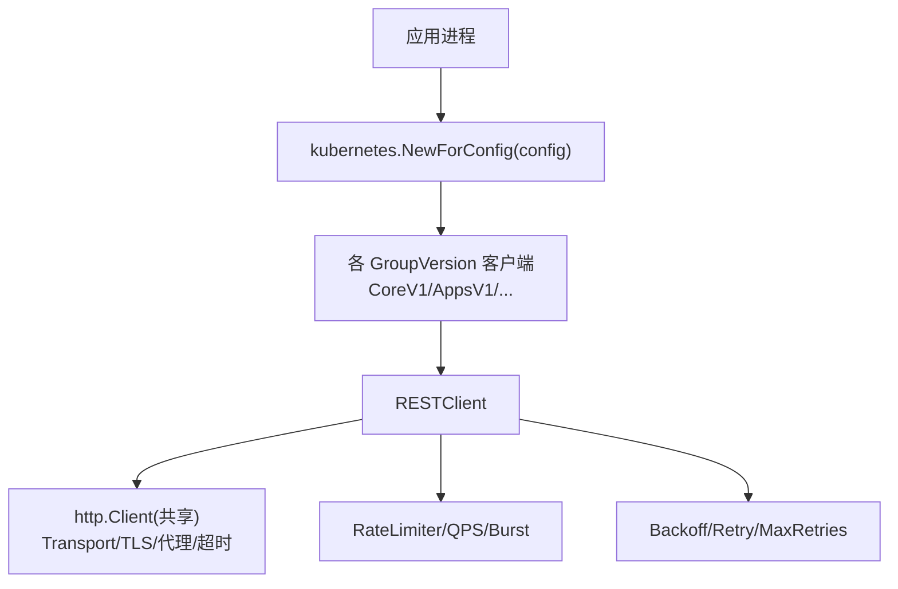
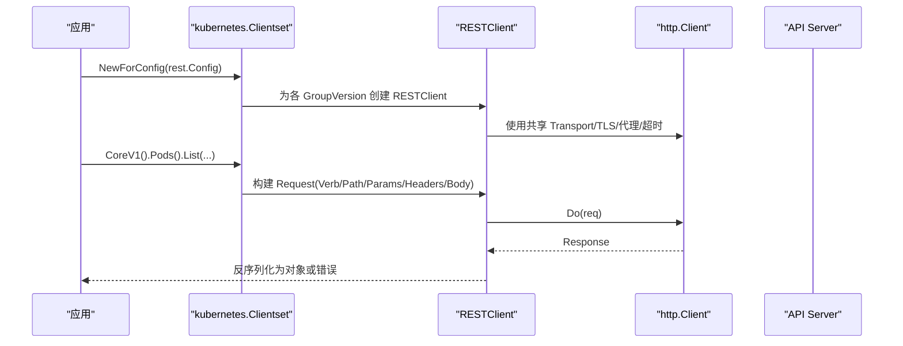
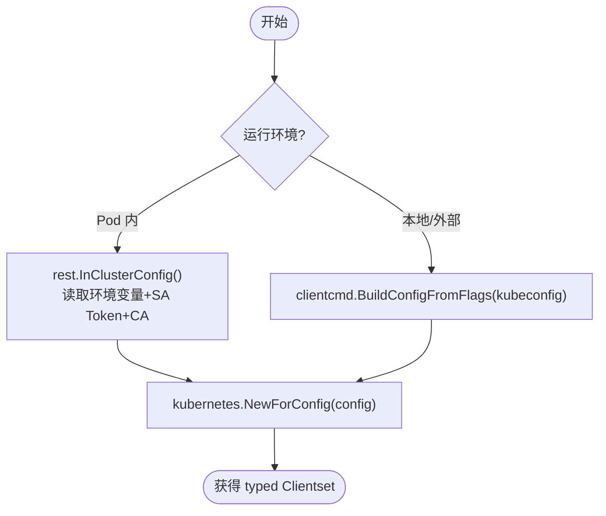
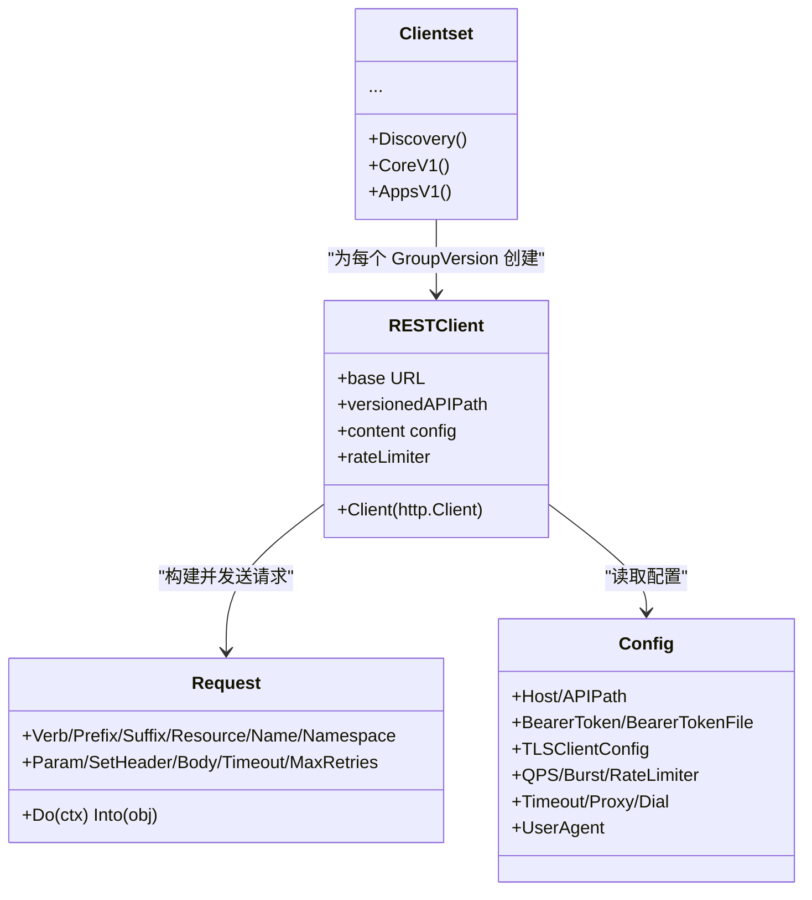
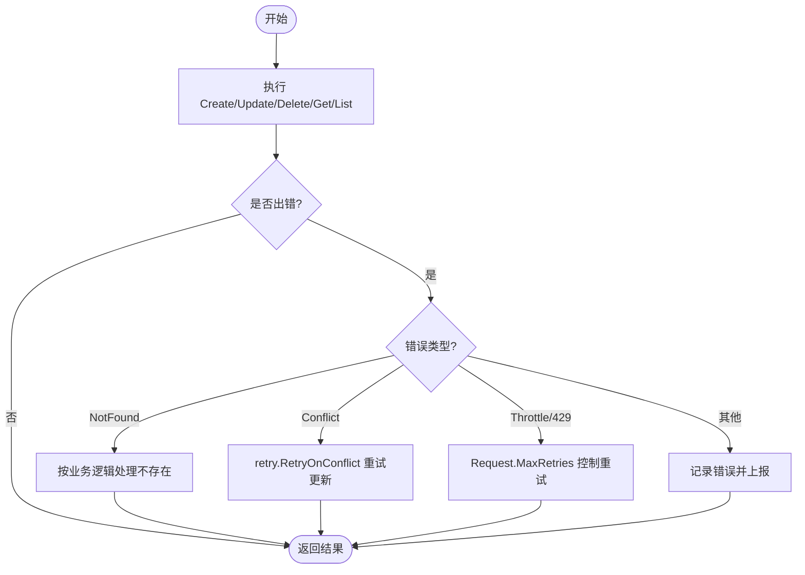

# 基础客户端使用

<cite>
**本文引用的文件**   
- [in-cluster-client-configuration/main.go](file://staging/src/k8s.io/client-go/examples/in-cluster-client-configuration/main.go)
- [out-of-cluster-client-configuration/main.go](file://staging/src/k8s.io/client-go/examples/out-of-cluster-client-configuration/main.go)
- [config.go](file://staging/src/k8s.io/client-go/rest/config.go)
- [clientset.go](file://staging/src/k8s.io/client-go/kubernetes/clientset.go)
- [request.go](file://staging/src/k8s.io/client-go/rest/request.go)
- [types.go](file://staging/src/k8s.io/client-go/tools/clientcmd/api/types.go)
- [create-update-delete-deployment/main.go](file://staging/src/k8s.io/client-go/examples/create-update-delete-deployment/main.go)
- [pod.go](file://staging/src/k8s.io/client-go/kubernetes/typed/core/v1/pod.go)
- [service.go](file://staging/src/k8s.io/client-go/kubernetes/typed/core/v1/service.go)
</cite>

## 目录
1. [简介](#简介)
2. [项目结构](#项目结构)
3. [核心组件](#核心组件)
4. [架构总览](#架构总览)
5. [详细组件分析](#详细组件分析)
6. [依赖关系分析](#依赖关系分析)
7. [性能与连接池](#性能与连接池)
8. [错误处理与重试](#错误处理与重试)
9. [结论](#结论)
10. [附录：CRUD 操作速查](#附录crud-操作速查)

## 简介
本指南面向 Kubernetes Go 客户端库的基础使用者，聚焦 typed client 的初始化与配置、REST 客户端选项（认证、TLS、连接池、超时）、以及 Pod、Service、Deployment、ConfigMap 等核心资源的 CRUD 实践。文档基于仓库中的示例与源码实现进行说明，并提供可视化图示帮助理解调用链路与关键流程。

## 项目结构
围绕“基础客户端使用”的关键代码分布在以下位置：
- 示例程序：演示 in-cluster 与 out-of-cluster 两种配置方式，以及 Deployment 的创建、更新、删除与列表查询
- REST 配置与请求：rest.Config、InClusterConfig、HTTPClientFor、Request 构建与执行
- Typed Client：kubernetes.Clientset 与各资源接口（如 CoreV1().Pods()）
- kubeconfig API 模型：tools/clientcmd/api/types.go 中描述集群、用户、上下文等结构

图表来源
- [clientset.go:479-540](file://staging/src/k8s.io/client-go/kubernetes/clientset.go#L479-L540)
- [config.go:323-402](file://staging/src/k8s.io/client-go/rest/config.go#L323-L402)
- [request.go:134-177](file://staging/src/k8s.io/client-go/rest/request.go#L134-L177)

章节来源
- [in-cluster-client-configuration/main.go:37-47](file://staging/src/k8s.io/client-go/examples/in-cluster-client-configuration/main.go#L37-L47)
- [out-of-cluster-client-configuration/main.go:40-59](file://staging/src/k8s.io/client-go/examples/out-of-cluster-client-configuration/main.go#L40-L59)
- [clientset.go:479-540](file://staging/src/k8s.io/client-go/kubernetes/clientset.go#L479-L540)
- [config.go:323-402](file://staging/src/k8s.io/client-go/rest/config.go#L323-L402)

## 核心组件
- rest.Config：封装 Host、认证（BearerToken/BearerTokenFile/Username/Password/AuthProvider/ExecProvider）、TLS、QPS/Burst、RateLimiter、Timeout、Dial、Proxy、UserAgent、压缩开关等
- InClusterConfig：在 Pod 内自动发现 API Server 地址、CA、ServiceAccount Token
- kubernetes.NewForConfig：根据 Config 构造共享 http.Client 并生成 typed clientset
- Request：底层 HTTP 请求构建器，支持 Verb/Prefix/Suffix/Resource/Name/Namespace/Param/Header/Body/Timeout/MaxRetries 等链式设置

章节来源
- [config.go:56-166](file://staging/src/k8s.io/client-go/rest/config.go#L56-L166)
- [config.go:542-577](file://staging/src/k8s.io/client-go/rest/config.go#L542-L577)
- [clientset.go:479-540](file://staging/src/k8s.io/client-go/kubernetes/clientset.go#L479-L540)
- [request.go:94-177](file://staging/src/k8s.io/client-go/rest/request.go#L94-L177)

## 架构总览
下图展示从应用到 API Server 的完整链路：应用通过 NewForConfig 获取 Clientset，再访问具体资源接口；内部由 RESTClient 驱动 http.Client 发起请求，受 QPS/Burst/RateLimiter 控制，并可配置 TLS、代理、超时与重试策略。

图表来源
- [clientset.go:479-540](file://staging/src/k8s.io/client-go/kubernetes/clientset.go#L479-L540)
- [config.go:323-402](file://staging/src/k8s.io/client-go/rest/config.go#L323-L402)
- [request.go:134-177](file://staging/src/k8s.io/client-go/rest/request.go#L134-L177)

## 详细组件分析

### 1) typed client 初始化：in-cluster 与 out-of-cluster
- in-cluster 模式
  - 通过环境变量 KUBERNETES_SERVICE_HOST/KUBERNETES_SERVICE_PORT 定位 API Server
  - 从 /var/run/secrets/kubernetes.io/serviceaccount/token 读取 Bearer Token
  - 从 /var/run/secrets/kubernetes.io/serviceaccount/ca.crt 加载 CA
  - 返回 rest.Config，随后用 kubernetes.NewForConfig 构造 Clientset
- out-of-cluster 模式
  - 通过 tools/clientcmd.BuildConfigFromFlags 解析 kubeconfig（当前上下文）
  - 支持多种认证方式（见下一节），最终同样得到 rest.Config 并构造 Clientset

图表来源
- [config.go:542-577](file://staging/src/k8s.io/client-go/rest/config.go#L542-L577)
- [out-of-cluster-client-configuration/main.go:40-59](file://staging/src/k8s.io/client-go/examples/out-of-cluster-client-configuration/main.go#L40-L59)
- [in-cluster-client-configuration/main.go:37-47](file://staging/src/k8s.io/client-go/examples/in-cluster-client-configuration/main.go#L37-L47)
- [clientset.go:479-540](file://staging/src/k8s.io/client-go/kubernetes/clientset.go#L479-L540)

章节来源
- [in-cluster-client-configuration/main.go:37-47](file://staging/src/k8s.io/client-go/examples/in-cluster-client-configuration/main.go#L37-L47)
- [out-of-cluster-client-configuration/main.go:40-59](file://staging/src/k8s.io/client-go/examples/out-of-cluster-client-configuration/main.go#L40-L59)
- [config.go:542-577](file://staging/src/k8s.io/client-go/rest/config.go#L542-L577)
- [clientset.go:479-540](file://staging/src/k8s.io/client-go/kubernetes/clientset.go#L479-L540)

### 2) REST 客户端配置选项详解
- 认证
  - BearerToken/BearerTokenFile：静态令牌或周期性读取的文件令牌
  - Username/Password：Basic 认证
  - AuthProvider/ExecProvider：插件化认证（OIDC、云厂商 CLI 等）
  - Impersonate：模拟用户/组/UID/Extra
- TLS
  - Insecure/CertFile/CertData/KeyFile/KeyData/CAFile/CAData/ServerName/NextProtos
  - LoadTLSFiles：将文件路径拷贝为内存数据，便于统一处理
- 连接与传输
  - Transport/WrapTransport：自定义 RoundTripper 或包装中间件
  - Proxy/Dial：代理与拨号函数
  - DisableCompression：关闭响应压缩以优化带宽场景
- 限流与速率控制
  - QPS/Burst：默认值分别为 5/10；未显式设置时自动生成令牌桶 RateLimiter
  - RateLimiter：可替换为自定义限流器
- 超时与重试
  - Timeout：整体请求超时
  - Request.MaxRetries：针对 429/Retry-After 的重试上限
  - BackOff/BackOffWithContext：退避策略
- 内容协商与 User-Agent
  - AcceptContentTypes/ContentType/NegotiatedSerializer
  - UserAgent/Auto 填充默认 UA

章节来源
- [config.go:56-166](file://staging/src/k8s.io/client-go/rest/config.go#L56-L166)
- [config.go:234-300](file://staging/src/k8s.io/client-go/rest/config.go#L234-L300)
- [config.go:594-611](file://staging/src/k8s.io/client-go/rest/config.go#L594-L611)
- [config.go:323-402](file://staging/src/k8s.io/client-go/rest/config.go#L323-L402)
- [request.go:473-493](file://staging/src/k8s.io/client-go/rest/request.go#L473-L493)
- [request.go:258-282](file://staging/src/k8s.io/client-go/rest/request.go#L258-L282)

### 3) 认证与 kubeconfig 模型
kubeconfig 顶层包含 Clusters、AuthInfos、Contexts、CurrentContext 等。常用字段：
- Cluster：server、tls-server-name、insecure-skip-tls-verify、certificate-authority(-data)、proxy-url、disable-compression
- AuthInfo：client-certificate(-data)、client-key(-data)、token、token-file、act-as(-uid/-groups/-user-extra)、username/password、auth-provider、exec
- Context：cluster、user、namespace

章节来源
- [types.go:31-56](file://staging/src/k8s.io/client-go/tools/clientcmd/api/types.go#L31-L56)
- [types.go:68-106](file://staging/src/k8s.io/client-go/tools/clientcmd/api/types.go#L68-L106)
- [types.go:108-159](file://staging/src/k8s.io/client-go/tools/clientcmd/api/types.go#L108-L159)
- [types.go:161-176](file://staging/src/k8s.io/client-go/tools/clientcmd/api/types.go#L161-L176)

### 4) 典型资源 CRUD 示例与最佳实践
- Pod
  - 通过 CoreV1().Pods(namespace).Create/Get/List/Delete/Update/Patch/Watch
  - 参考接口定义与 gentype 封装
- Service
  - 通过 CoreV1().Services(namespace).Create/Get/List/Delete/Update/Patch/Apply
- Deployment
  - 通过 AppsV1().Deployments(namespace).Create/Get/List/Delete/Update
  - 推荐采用“先 Get 最新对象再 Update”的模式，并使用 retry.RetryOnConflict 处理并发冲突
- ConfigMap
  - 通过 CoreV1().ConfigMaps(namespace).Create/Get/List/Delete/Update/Patch/Apply

注意：示例程序展示了完整的生命周期与错误处理模式，建议在实际项目中复用其风格。

章节来源
- [pod.go:39-78](file://staging/src/k8s.io/client-go/kubernetes/typed/core/v1/pod.go#L39-L78)
- [service.go:39-74](file://staging/src/k8s.io/client-go/kubernetes/typed/core/v1/service.go#L39-L74)
- [create-update-delete-deployment/main.go:102-164](file://staging/src/k8s.io/client-go/examples/create-update-delete-deployment/main.go#L102-L164)

## 依赖关系分析
- Clientset 聚合了所有 GroupVersion 客户端，内部共享同一 http.Client
- RESTClient 负责序列化/反序列化、URL 拼接、Header 设置、限流与重试
- Request 提供链式 API 构建最终 HTTP 请求，并注入超时、参数、主体等
- 认证与 TLS 由 rest.Config 与 transport 层共同完成

图表来源
- [clientset.go:142-200](file://staging/src/k8s.io/client-go/kubernetes/clientset.go#L142-L200)
- [config.go:323-402](file://staging/src/k8s.io/client-go/rest/config.go#L323-L402)
- [request.go:94-177](file://staging/src/k8s.io/client-go/rest/request.go#L94-L177)

章节来源
- [clientset.go:479-540](file://staging/src/k8s.io/client-go/kubernetes/clientset.go#L479-L540)
- [config.go:323-402](file://staging/src/k8s.io/client-go/rest/config.go#L323-L402)
- [request.go:94-177](file://staging/src/k8s.io/client-go/rest/request.go#L94-L177)

## 性能与连接池
- 连接复用
  - NewForConfig 会生成一个共享的 http.Client，并在各 GroupVersion 客户端间复用，减少握手开销
- 限流与背压
  - 默认 QPS=5、Burst=10；可通过 QPS/Burst 或自定义 RateLimiter 调整
  - 当 QPS<=0 且未设置 RateLimiter 时，禁用客户端侧限流
- 超时与重试
  - 全局 Timeout 适用于单次请求；Request.MaxRetries 用于服务端限流（429/Retry-After）时的重试
  - Watch 场景有独立的回退逻辑，对常见网络错误具备自愈能力
- 压缩
  - 可通过 DisableCompression 关闭压缩以提升带宽充裕场景下的吞吐

章节来源
- [clientset.go:479-540](file://staging/src/k8s.io/client-go/kubernetes/clientset.go#L479-L540)
- [config.go:323-402](file://staging/src/k8s.io/client-go/rest/config.go#L323-L402)
- [request.go:473-493](file://staging/src/k8s.io/client-go/rest/request.go#L473-L493)
- [request.go:758-800](file://staging/src/k8s.io/client-go/rest/request.go#L758-L800)

## 错误处理与重试
- 常见错误类型
  - 使用 apimachinery/pkg/api/errors 提供的 IsNotFound 等辅助方法判断
  - 可将错误断言为 StatusError 以获取服务器返回的详细消息
- 并发更新冲突
  - 推荐使用 retry.RetryOnConflict 配合“先 Get 最新对象再 Update”的策略
- 服务端限流与重试
  - Request.MaxRetries 控制对 429/Retry-After 的重试次数
  - 结合 BackOff/BackOffWithContext 可实现指数退避
- 日志与告警
  - 限速等待超过阈值时会记录日志，便于定位拥塞问题

图表来源
- [in-cluster-client-configuration/main.go:57-69](file://staging/src/k8s.io/client-go/examples/in-cluster-client-configuration/main.go#L57-L69)
- [out-of-cluster-client-configuration/main.go:67-82](file://staging/src/k8s.io/client-go/examples/out-of-cluster-client-configuration/main.go#L67-L82)
- [create-update-delete-deployment/main.go:126-141](file://staging/src/k8s.io/client-go/examples/create-update-delete-deployment/main.go#L126-L141)
- [request.go:483-493](file://staging/src/k8s.io/client-go/rest/request.go#L483-L493)

章节来源
- [in-cluster-client-configuration/main.go:57-69](file://staging/src/k8s.io/client-go/examples/in-cluster-client-configuration/main.go#L57-L69)
- [out-of-cluster-client-configuration/main.go:67-82](file://staging/src/k8s.io/client-go/examples/out-of-cluster-client-configuration/main.go#L67-L82)
- [create-update-delete-deployment/main.go:126-141](file://staging/src/k8s.io/client-go/examples/create-update-delete-deployment/main.go#L126-L141)
- [request.go:483-493](file://staging/src/k8s.io/client-go/rest/request.go#L483-L493)

## 结论
- 在 Pod 内优先使用 InClusterConfig，避免硬编码凭据
- 在本地或外部进程使用 BuildConfigFromFlags 加载 kubeconfig，灵活支持多集群与多用户
- 合理配置 QPS/Burst/RateLimiter 与 Timeout，保障稳定性与吞吐
- 更新资源遵循“先 Get 后 Update”，并用 RetryOnConflict 处理冲突
- 善用 Request 的链式 API 精细控制请求行为（Header、Body、超时、重试）

## 附录：CRUD 操作速查
- Pod
  - 创建：CoreV1().Pods(ns).Create(ctx, pod, opts)
  - 获取：CoreV1().Pods(ns).Get(ctx, name, opts)
  - 列表：CoreV1().Pods("").List(ctx, listOpts)
  - 删除：CoreV1().Pods(ns).Delete(ctx, name, deleteOpts)
  - 更新/补丁：CoreV1().Pods(ns).Update/Patch(ctx, ...)
  - 监听：CoreV1().Pods(ns).Watch(ctx, listOpts)
- Service
  - 同上，命名空间与资源名替换为 services
- Deployment
  - 通过 AppsV1().Deployments(ns) 进行 Create/Get/List/Delete/Update
  - 更新建议使用 RetryOnConflict
- ConfigMap
  - 通过 CoreV1().ConfigMaps(ns) 进行 Create/Get/List/Delete/Update/Patch/Apply

章节来源
- [pod.go:39-78](file://staging/src/k8s.io/client-go/kubernetes/typed/core/v1/pod.go#L39-L78)
- [service.go:39-74](file://staging/src/k8s.io/client-go/kubernetes/typed/core/v1/service.go#L39-L74)
- [create-update-delete-deployment/main.go:102-164](file://staging/src/k8s.io/client-go/examples/create-update-delete-deployment/main.go#L102-L164)