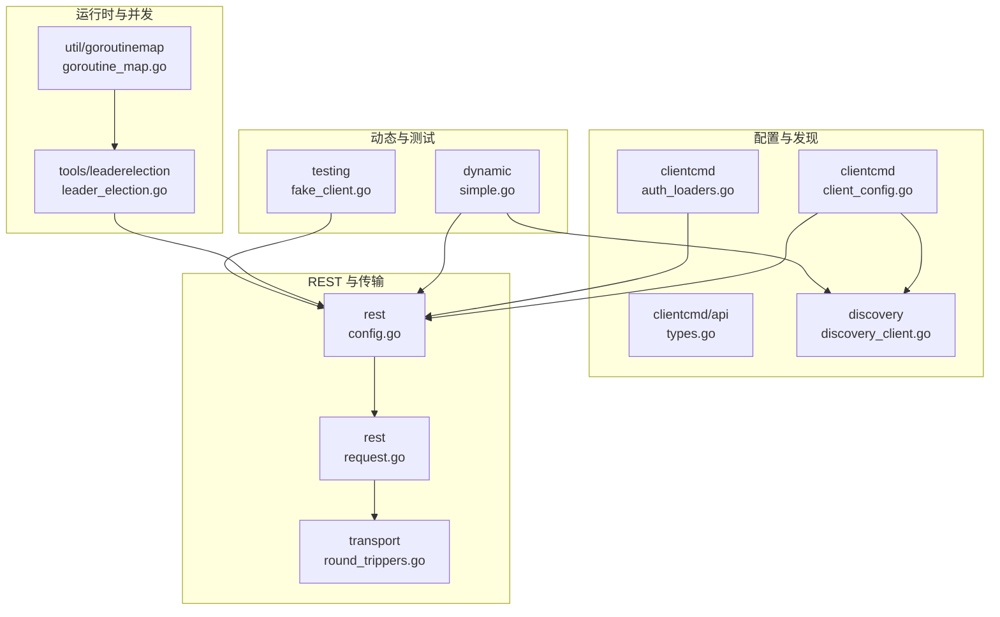
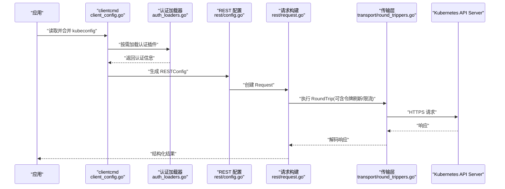
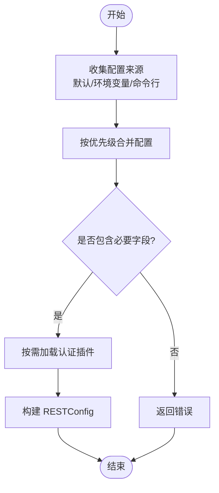
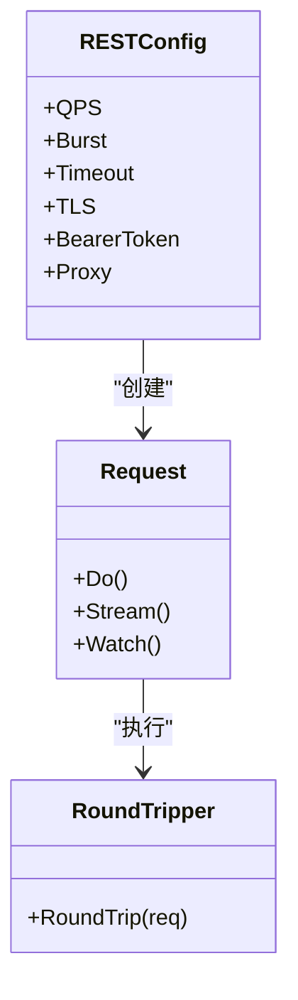
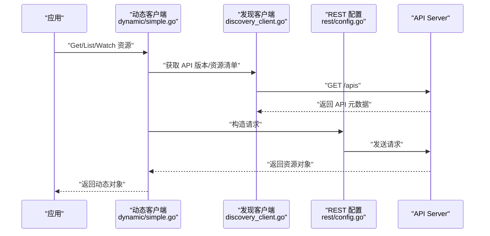
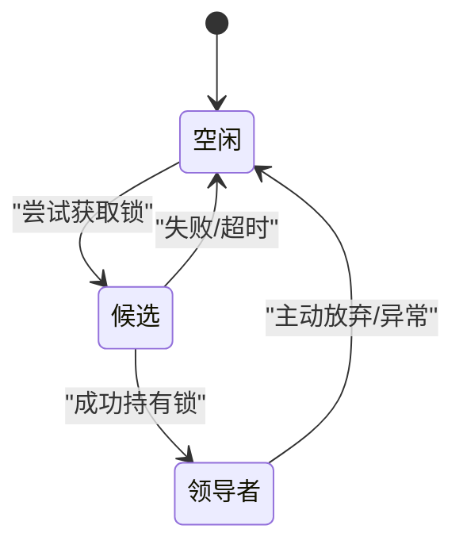
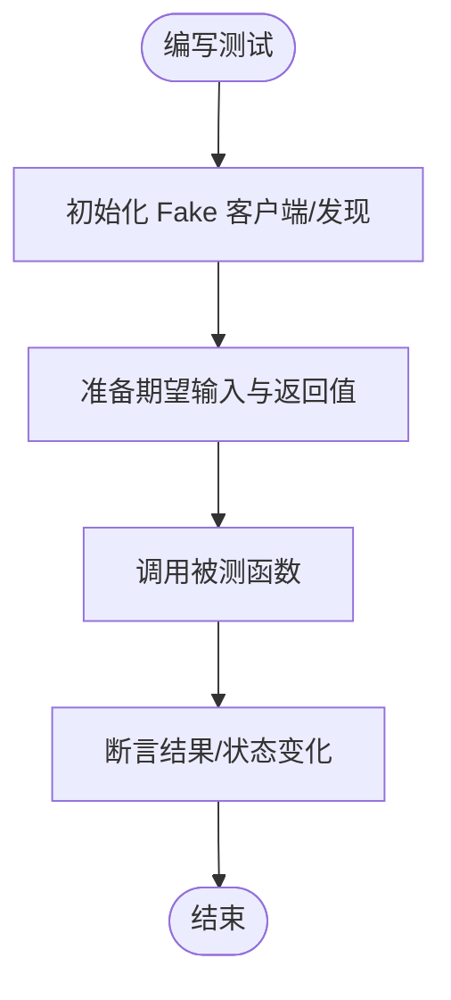
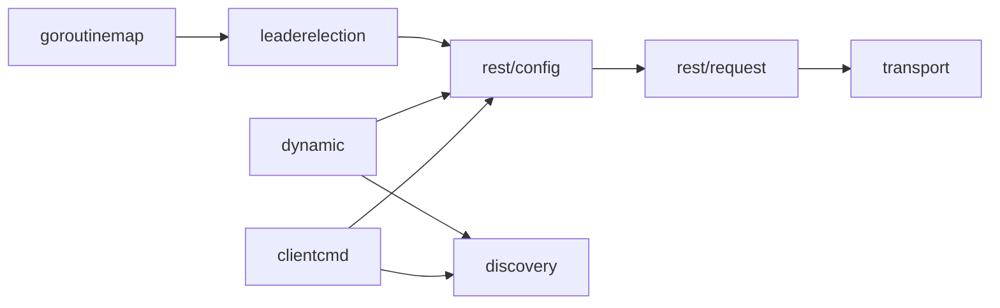

# 高级特性

<cite>
**本文引用的文件**   
- [clientcmd/client_config.go](file://staging/src/k8s.io/client-go/tools/clientcmd/client_config.go)
- [clientcmd/api/types.go](file://staging/src/k8s.io/client-go/tools/clientcmd/api/types.go)
- [clientcmd/auth_loaders.go](file://staging/src/k8s.io/client-go/tools/clientcmd/auth_loaders.go)
- [rest/config.go](file://staging/src/k8s.io/client-go/rest/config.go)
- [rest/request.go](file://staging/src/k8s.io/client-go/rest/request.go)
- [tools/leaderelection/leader_election.go](file://staging/src/k8s.io/client-go/tools/leaderelection/leader_election.go)
- [util/goroutinemap/goroutine_map.go](file://staging/src/k8s.io/client-go/util/goroutinemap/goroutine_map.go)
- [testing/fake_client.go](file://staging/src/k8s.io/client-go/testing/fake_client.go)
- [dynamic/simple.go](file://staging/src/k8s.io/client-go/dynamic/simple.go)
- [discovery/discovery_client.go](file://staging/src/k8s.io/client-go/discovery/discovery_client.go)
- [transport/round_trippers.go](file://staging/src/k8s.io/client-go/transport/round_trippers.go)
</cite>

## 目录
1. [简介](#简介)
2. [项目结构](#项目结构)
3. [核心组件](#核心组件)
4. [架构总览](#架构总览)
5. [详细组件分析](#详细组件分析)
6. [依赖关系分析](#依赖关系分析)
7. [性能考量](#性能考量)
8. [故障排查指南](#故障排查指南)
9. [结论](#结论)
10. [附录](#附录)

## 简介
本文件面向使用 Kubernetes Go 客户端的高级用户，聚焦以下主题：
- clientcmd 工具包：kubeconfig 解析、合并与动态加载
- metrics 监控指标：收集、导出与 Prometheus 集成思路
- 日志记录与调试：请求跟踪与性能分析
- 速率限制与节流：实现原理与配置要点
- 并发安全与资源管理：goroutine 管理与泄漏防护
- 测试框架与 Mock：单元测试与集成测试实践

## 项目结构
围绕上述主题，代码主要分布在 staging/src/k8s.io/client-go 的多个子模块中：
- tools/clientcmd：kubeconfig 解析、合并、认证加载器、REST 配置构建
- rest：HTTP 请求构造、重试、超时、TLS、认证等传输层能力
- discovery：API 发现客户端
- dynamic：动态客户端
- transport：自定义 RoundTripper（如令牌刷新、压缩、缓存）
- tools/leaderelection：基于 API 对象的分布式锁
- util/goroutinemap：并发安全的 goroutine 生命周期管理
- testing：Fake 客户端与测试辅助

图表来源
- [clientcmd/client_config.go](file://staging/src/k8s.io/client-go/tools/clientcmd/client_config.go)
- [clientcmd/api/types.go](file://staging/src/k8s.io/client-go/tools/clientcmd/api/types.go)
- [clientcmd/auth_loaders.go](file://staging/src/k8s.io/client-go/tools/clientcmd/auth_loaders.go)
- [rest/config.go](file://staging/src/k8s.io/client-go/rest/config.go)
- [rest/request.go](file://staging/src/k8s.io/client-go/rest/request.go)
- [transport/round_trippers.go](file://staging/src/k8s.io/client-go/transport/round_trippers.go)
- [discovery/discovery_client.go](file://staging/src/k8s.io/client-go/discovery/discovery_client.go)
- [dynamic/simple.go](file://staging/src/k8s.io/client-go/dynamic/simple.go)
- [tools/leaderelection/leader_election.go](file://staging/src/k8s.io/client-go/tools/leaderelection/leader_election.go)
- [util/goroutinemap/goroutine_map.go](file://staging/src/k8s.io/client-go/util/goroutinemap/goroutine_map.go)
- [testing/fake_client.go](file://staging/src/k8s.io/client-go/testing/fake_client.go)

章节来源
- [clientcmd/client_config.go](file://staging/src/k8s.io/client-go/tools/clientcmd/client_config.go)
- [rest/config.go](file://staging/src/k8s.io/client-go/rest/config.go)
- [rest/request.go](file://staging/src/k8s.io/client-go/rest/request.go)
- [transport/round_trippers.go](file://staging/src/k8s.io/client-go/transport/round_trippers.go)
- [discovery/discovery_client.go](file://staging/src/k8s.io/client-go/discovery/discovery_client.go)
- [dynamic/simple.go](file://staging/src/k8s.io/client-go/dynamic/simple.go)
- [tools/leaderelection/leader_election.go](file://staging/src/k8s.io/client-go/tools/leaderelection/leader_election.go)
- [util/goroutinemap/goroutine_map.go](file://staging/src/k8s.io/client-go/util/goroutinemap/goroutine_map.go)
- [testing/fake_client.go](file://staging/src/k8s.io/client-go/testing/fake_client.go)

## 核心组件
- kubeconfig 解析与合并：通过 clientcmd 将多源配置（默认路径、环境变量、命令行参数）合并为统一 RESTConfig。
- 认证加载器：支持 exec、OIDC、云厂商插件等动态认证方式。
- REST 配置与请求：封装 TLS、Bearer Token、代理、超时、重试、分页、Watch 等能力。
- 动态客户端：对未编译类型的资源进行通用 CRUD 与 Watch。
- 领导者选举：基于 API 对象实现跨进程/Pod 的互斥。
- 并发安全：提供 goroutine 集合管理，避免泄漏。
- 测试：Fake 客户端用于隔离外部依赖的单元/集成测试。

章节来源
- [clientcmd/client_config.go](file://staging/src/k8s.io/client-go/tools/clientcmd/client_config.go)
- [clientcmd/auth_loaders.go](file://staging/src/k8s.io/client-go/tools/clientcmd/auth_loaders.go)
- [rest/config.go](file://staging/src/k8s.io/client-go/rest/config.go)
- [rest/request.go](file://staging/src/k8s.io/client-go/rest/request.go)
- [dynamic/simple.go](file://staging/src/k8s.io/client-go/dynamic/simple.go)
- [tools/leaderelection/leader_election.go](file://staging/src/k8s.io/client-go/tools/leaderelection/leader_election.go)
- [util/goroutinemap/goroutine_map.go](file://staging/src/k8s.io/client-go/util/goroutinemap/goroutine_map.go)
- [testing/fake_client.go](file://staging/src/k8s.io/client-go/testing/fake_client.go)

## 架构总览
下图展示从 kubeconfig 到 HTTP 请求的关键链路，以及可选的动态认证与速率限制机制。

图表来源
- [clientcmd/client_config.go](file://staging/src/k8s.io/client-go/tools/clientcmd/client_config.go)
- [clientcmd/auth_loaders.go](file://staging/src/k8s.io/client-go/tools/clientcmd/auth_loaders.go)
- [rest/config.go](file://staging/src/k8s.io/client-go/rest/config.go)
- [rest/request.go](file://staging/src/k8s.io/client-go/rest/request.go)
- [transport/round_trippers.go](file://staging/src/k8s.io/client-go/transport/round_trippers.go)

## 详细组件分析

### clientcmd：kubeconfig 解析、合并与动态加载
- 解析与合并
  - 支持多来源合并：默认路径、环境变量、显式指定路径；同名项按优先级覆盖。
  - 输出统一的 RESTConfig，供 rest 客户端直接使用。
- 动态认证
  - 通过认证加载器在运行时选择并调用外部认证插件（exec/OIDC/云厂商）。
  - 适合需要频繁轮换凭据或集中管理的场景。
- 最佳实践
  - 在启动阶段完成一次合并与校验，后续复用配置对象。
  - 对敏感字段（如 token、证书）做好内存保护与最小权限原则。

图表来源
- [clientcmd/client_config.go](file://staging/src/k8s.io/client-go/tools/clientcmd/client_config.go)
- [clientcmd/auth_loaders.go](file://staging/src/k8s.io/client-go/tools/clientcmd/auth_loaders.go)
- [clientcmd/api/types.go](file://staging/src/k8s.io/client-go/tools/clientcmd/api/types.go)

章节来源
- [clientcmd/client_config.go](file://staging/src/k8s.io/client-go/tools/clientcmd/client_config.go)
- [clientcmd/auth_loaders.go](file://staging/src/k8s.io/client-go/tools/clientcmd/auth_loaders.go)
- [clientcmd/api/types.go](file://staging/src/k8s.io/client-go/tools/clientcmd/api/types.go)

### REST 配置与请求：速率限制、重试与超时
- 速率限制与节流
  - 通过配置 QPS/Burst 控制对 API Server 的请求速率，避免触发服务端限流。
  - 内部通常基于令牌桶算法实现平滑限流。
- 重试与退避
  - 针对瞬态错误（网络抖动、5xx）自动重试，配合指数退避减少雪崩风险。
- 超时与取消
  - 设置连接/读写超时，结合上下文取消保证资源及时释放。
- 传输层扩展
  - 通过自定义 RoundTripper 注入鉴权、压缩、缓存、指标采集等横切逻辑。

图表来源
- [rest/config.go](file://staging/src/k8s.io/client-go/rest/config.go)
- [rest/request.go](file://staging/src/k8s.io/client-go/rest/request.go)
- [transport/round_trippers.go](file://staging/src/k8s.io/client-go/transport/round_trippers.go)

章节来源
- [rest/config.go](file://staging/src/k8s.io/client-go/rest/config.go)
- [rest/request.go](file://staging/src/k8s.io/client-go/rest/request.go)
- [transport/round_trippers.go](file://staging/src/k8s.io/client-go/transport/round_trippers.go)

### 动态客户端与 API 发现
- 动态客户端
  - 无需编译类型即可对任意资源进行 CRUD、列表、Watch。
  - 适合插件化、CRD 驱动的场景。
- API 发现
  - 拉取服务器端 API 版本与资源清单，辅助动态路由与序列化。

图表来源
- [dynamic/simple.go](file://staging/src/k8s.io/client-go/dynamic/simple.go)
- [discovery/discovery_client.go](file://staging/src/k8s.io/client-go/discovery/discovery_client.go)
- [rest/config.go](file://staging/src/k8s.io/client-go/rest/config.go)

章节来源
- [dynamic/simple.go](file://staging/src/k8s.io/client-go/dynamic/simple.go)
- [discovery/discovery_client.go](file://staging/src/k8s.io/client-go/discovery/discovery_client.go)

### 领导者选举与并发安全
- 领导者选举
  - 基于 API 对象（如 ConfigMap/Lease）实现分布式锁，保障单副本运行关键任务。
- goroutine 管理
  - 使用 goroutine 集合统一管理生命周期，确保退出时等待所有协程完成，避免泄漏。

图表来源
- [tools/leaderelection/leader_election.go](file://staging/src/k8s.io/client-go/tools/leaderelection/leader_election.go)
- [util/goroutinemap/goroutine_map.go](file://staging/src/k8s.io/client-go/util/goroutinemap/goroutine_map.go)

章节来源
- [tools/leaderelection/leader_election.go](file://staging/src/k8s.io/client-go/tools/leaderelection/leader_election.go)
- [util/goroutinemap/goroutine_map.go](file://staging/src/k8s.io/client-go/util/goroutinemap/goroutine_map.go)

### 测试框架与 Mock
- Fake 客户端
  - 提供内存存储与可插拔行为，用于隔离外部依赖的单元测试。
- 动态测试
  - 结合动态客户端与发现客户端的 Fake 实现，验证复杂流程。
- 建议
  - 使用确定性时间源与可控错误注入，提升测试稳定性。
  - 对并发场景使用 goroutine 集合等待完成，避免竞态。

图表来源
- [testing/fake_client.go](file://staging/src/k8s.io/client-go/testing/fake_client.go)

章节来源
- [testing/fake_client.go](file://staging/src/k8s.io/client-go/testing/fake_client.go)

## 依赖关系分析
- 低耦合高内聚
  - clientcmd 仅负责配置组装，不直接发起网络请求。
  - rest 层屏蔽传输细节，向上暴露一致的请求接口。
- 可扩展点
  - 认证加载器、RoundTripper、动态客户端均提供扩展点，便于接入企业级需求。
- 潜在循环依赖
  - 各模块以单向依赖为主，未发现明显循环引用。

图表来源
- [clientcmd/client_config.go](file://staging/src/k8s.io/client-go/tools/clientcmd/client_config.go)
- [rest/config.go](file://staging/src/k8s.io/client-go/rest/config.go)
- [rest/request.go](file://staging/src/k8s.io/client-go/rest/request.go)
- [transport/round_trippers.go](file://staging/src/k8s.io/client-go/transport/round_trippers.go)
- [discovery/discovery_client.go](file://staging/src/k8s.io/client-go/discovery/discovery_client.go)
- [dynamic/simple.go](file://staging/src/k8s.io/client-go/dynamic/simple.go)
- [tools/leaderelection/leader_election.go](file://staging/src/k8s.io/client-go/tools/leaderelection/leader_election.go)
- [util/goroutinemap/goroutine_map.go](file://staging/src/k8s.io/client-go/util/goroutinemap/goroutine_map.go)

## 性能考量
- 合理设置 QPS/Burst
  - 根据集群规模与业务峰值调优，避免触发服务端限流。
- 连接复用与长连接
  - 利用 HTTP 连接池减少握手开销。
- 批量与分页
  - 使用 ListWithLimit/Pager 降低单次负载。
- Watch 与缓存
  - 优先使用 Watch 增量更新，结合本地缓存减少重复请求。
- 超时与取消
  - 为长耗时操作设置合理超时，及时释放资源。

[本节为通用指导，不涉及具体文件分析]

## 故障排查指南
- 认证失败
  - 检查认证加载器是否正确返回凭据；确认令牌有效期与刷新策略。
- 限流与节流
  - 观察服务端限流告警，适当提高 QPS/Burst 或优化调用频率。
- 超时与重试风暴
  - 调整超时与退避策略，避免级联失败。
- goroutine 泄漏
  - 使用 goroutine 集合等待退出；在长时间运行的服务中定期采样堆栈。
- 动态客户端问题
  - 核对 API 版本与资源名称；确认发现客户端能正确拉取元数据。

章节来源
- [clientcmd/auth_loaders.go](file://staging/src/k8s.io/client-go/tools/clientcmd/auth_loaders.go)
- [rest/config.go](file://staging/src/k8s.io/client-go/rest/config.go)
- [rest/request.go](file://staging/src/k8s.io/client-go/rest/request.go)
- [util/goroutinemap/goroutine_map.go](file://staging/src/k8s.io/client-go/util/goroutinemap/goroutine_map.go)
- [discovery/discovery_client.go](file://staging/src/k8s.io/client-go/discovery/discovery_client.go)

## 结论
通过对 clientcmd、rest、dynamic、transport、leaderelection 与 goroutine 管理等模块的系统梳理，可以构建出高可用、可观测、易测试的 Kubernetes 客户端方案。建议在工程实践中：
- 将配置与认证解耦，采用动态加载与最小权限原则
- 明确速率限制与重试策略，结合指标与日志定位瓶颈
- 用领导者选举与 goroutine 集合保障并发安全与资源回收
- 借助 Fake 客户端完善测试覆盖，提升交付质量

[本节为总结性内容，不涉及具体文件分析]

## 附录
- 术语
  - kubeconfig：描述如何访问 Kubernetes API 的配置文档
  - QPS/Burst：每秒查询数与突发容量
  - RoundTripper：HTTP 传输层的中间件接口
  - 领导者选举：分布式系统中确定唯一协调者的机制

[本节为概念说明，不涉及具体文件分析]