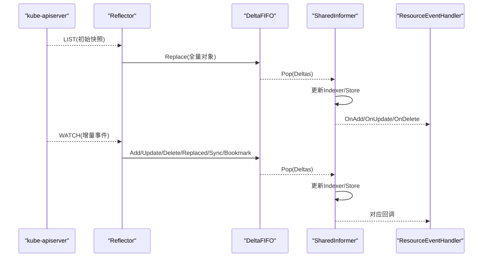
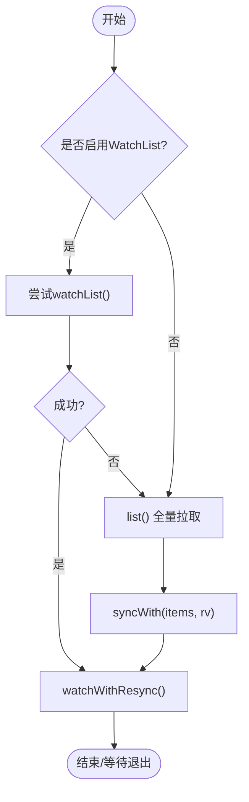
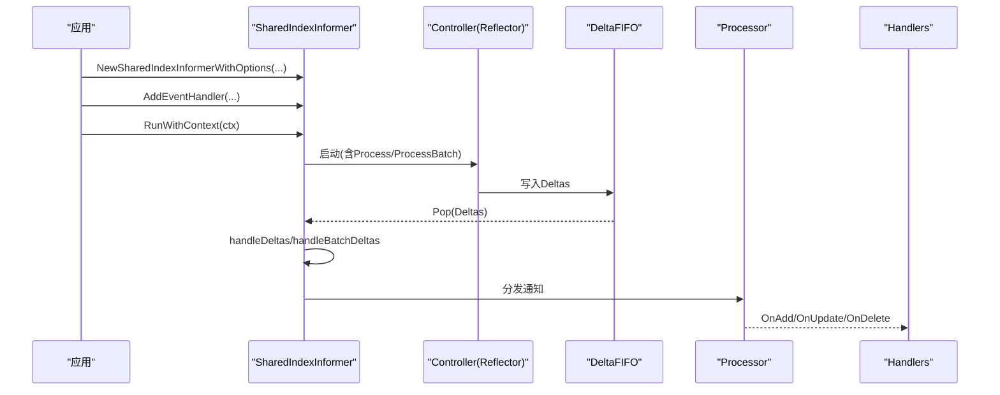
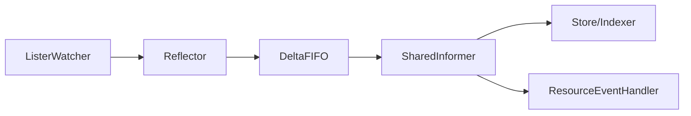

# Informer机制

<cite>
**本文引用的文件**   
- [reflector.go](file://staging/src/k8s.io/client-go/tools/cache/reflector.go)
- [delta_fifo.go](file://staging/src/k8s.io/client-go/tools/cache/delta_fifo.go)
- [store.go](file://staging/src/k8s.io/client-go/tools/cache/store.go)
- [shared_informer.go](file://staging/src/k8s.io/client-go/tools/cache/shared_informer.go)
</cite>

## 目录
1. [引言](#引言)
2. [项目结构](#项目结构)
3. [核心组件](#核心组件)
4. [架构总览](#架构总览)
5. [详细组件分析](#详细组件分析)
6. [依赖关系分析](#依赖关系分析)
7. [性能与内存管理](#性能与内存管理)
8. [故障排查指南](#故障排查指南)
9. [结论](#结论)
10. [附录](#附录)

## 引言
本文件面向Kubernetes Informer机制的技术文档，聚焦于client-go工具库中的缓存与事件分发子系统。内容涵盖：
- Informer的架构设计与工作原理
- Reflector、DeltaFIFO、Store/Indexer的职责与交互
- 从API Server到本地缓存的数据同步流程
- SharedInformer/SharedIndexInformer的创建、启动与生命周期
- Indexer与ListWatch的使用方法与优化建议
- SharedInformerFactory的资源共享机制（概念性说明）
- 自定义索引器实现与复杂查询场景
- 事件处理最佳实践（去重、批处理、错误恢复）
- 内存管理与性能监控指标

## 项目结构
本仓库中Informer相关核心代码位于client-go/tools/cache包下，关键文件如下：
- reflector.go：Reflector实现，负责LIST/WATCH与增量同步
- delta_fifo.go：DeltaFIFO实现，作为生产者-消费者队列，聚合对象变更
- store.go：Store/Indexer接口与默认实现，提供线程安全存储与索引能力
- shared_informer.go：SharedInformer/SharedIndexInformer实现，协调Reflector、DeltaFIFO与处理器

```mermaid
graph TB
subgraph "client-go/tools/cache"
R["Reflector<br/>拉取与增量同步"]
Q["DeltaFIFO<br/>变更队列(按Key聚合Deltas)"]
S["Store/Indexer<br/>线程安全存储+索引"]
SI["SharedInformer/SharedIndexInformer<br/>编排控制器与处理器"]
end
APIServer["kube-apiserver"]
R --> |LIST/WATCH| APIServer
R --> |写入| Q
Q --> |Pop()消费| SI
SI --> |更新| S
SI --> |通知| 处理器["ResourceEventHandler"]
```

图表来源
- [reflector.go:105-171](file://staging/src/k8s.io/client-go/tools/cache/reflector.go#L105-L171)
- [delta_fifo.go:108-158](file://staging/src/k8s.io/client-go/tools/cache/delta_fifo.go#L108-L158)
- [store.go:28-82](file://staging/src/k8s.io/client-go/tools/cache/store.go#L28-L82)
- [shared_informer.go:584-647](file://staging/src/k8s.io/client-go/tools/cache/shared_informer.go#L584-L647)

章节来源
- [reflector.go:105-171](file://staging/src/k8s.io/client-go/tools/cache/reflector.go#L105-L171)
- [delta_fifo.go:108-158](file://staging/src/k8s.io/client-go/tools/cache/delta_fifo.go#L108-L158)
- [store.go:28-82](file://staging/src/k8s.io/client-go/tools/cache/store.go#L28-L82)
- [shared_informer.go:584-647](file://staging/src/k8s.io/client-go/tools/cache/shared_informer.go#L584-L647)

## 核心组件
- Reflector：周期性调用ListAndWatch，将初始全量列表与后续增量事件转换为对DeltaFIFO的Add/Update/Delete/Replace操作，并维护LastSyncResourceVersion。
- DeltaFIFO：以对象Key为维度聚合Deltas，支持Replaced/Sync/Bookmark等事件类型；提供Pop阻塞式消费，保证每个对象的变更序列被顺序处理。
- Store/Indexer：线程安全的键值存储，支持Get/List/Replace/Resync以及基于索引函数的ByIndex/ByIndexKeys查询。
- SharedInformer/SharedIndexInformer：组合Controller（内部使用Reflector）、DeltaFIFO与处理器，负责事件分发、Resync调度、资源版本传播与生命周期管理。

章节来源
- [reflector.go:105-171](file://staging/src/k8s.io/client-go/tools/cache/reflector.go#L105-L171)
- [delta_fifo.go:178-208](file://staging/src/k8s.io/client-go/tools/cache/delta_fifo.go#L178-L208)
- [store.go:28-82](file://staging/src/k8s.io/client-go/tools/cache/store.go#L28-L82)
- [shared_informer.go:292-349](file://staging/src/k8s.io/client-go/tools/cache/shared_informer.go#L292-L349)

## 架构总览
下图展示了从API Server到本地缓存再到事件处理器的完整数据流。



图表来源
- [reflector.go:463-509](file://staging/src/k8s.io/client-go/tools/cache/reflector.go#L463-L509)
- [reflector.go:674-783](file://staging/src/k8s.io/client-go/tools/cache/reflector.go#L674-L783)
- [delta_fifo.go:619-699](file://staging/src/k8s.io/client-go/tools/cache/delta_fifo.go#L619-L699)
- [shared_informer.go:728-792](file://staging/src/k8s.io/client-go/tools/cache/shared_informer.go#L728-L792)

## 详细组件分析

### Reflector：拉取与增量同步
- 职责
  - 通过ListAndWatch建立与API Server的连接，先LIST获取初始快照，再WATCH接收增量事件
  - 将事件转换为对DeltaFIFO的写入（Add/Update/Delete/Replace/Sync/Bookmark）
  - 维护LastSyncResourceVersion，并在必要时回退至LIST或启用WatchList语义
- 关键行为
  - 超时与退避：watch请求设置随机超时，失败时指数退避重试
  - 分页与缓存策略：根据RV选择是否走watch cache或直接etcd
  - WatchList：在支持的情况下以流式方式构建一致快照，减少服务器压力
- 错误处理
  - 过期/TooManyRequests/内部错误分别采用不同策略（立即重试、退避、带截止时间的重试）



图表来源
- [reflector.go:470-509](file://staging/src/k8s.io/client-go/tools/cache/reflector.go#L470-L509)
- [reflector.go:674-783](file://staging/src/k8s.io/client-go/tools/cache/reflector.go#L674-L783)
- [reflector.go:538-554](file://staging/src/k8s.io/client-go/tools/cache/reflector.go#L538-L554)

章节来源
- [reflector.go:105-171](file://staging/src/k8s.io/client-go/tools/cache/reflector.go#L105-L171)
- [reflector.go:463-509](file://staging/src/k8s.io/client-go/tools/cache/reflector.go#L463-L509)
- [reflector.go:561-670](file://staging/src/k8s.io/client-go/tools/cache/reflector.go#L561-L670)
- [reflector.go:674-783](file://staging/src/k8s.io/client-go/tools/cache/reflector.go#L674-L783)

### DeltaFIFO：变更聚合与消费
- 职责
  - 以对象Key为单位聚合Deltas，确保同一对象的变更有序且可合并
  - 提供Pop阻塞式消费，返回完整的Deltas供上层处理
  - 支持Replace/Sync/Bookmark等事件类型，配合KnownObjects进行删除检测
- 关键特性
  - 去重：相邻重复删除会合并，保留信息更丰富的版本
  - 转换：TransformFunc可在入队前裁剪对象字段以降低内存占用
  - 同步完成信号：HasSynced/DoneChecker用于判断初始批次已出队
- 并发模型
  - 内部读写锁保护items与queue，Pop持有锁执行process函数，避免竞态

```mermaid
classDiagram
class DeltaFIFO {
+Add(obj) error
+Update(obj) error
+Delete(obj) error
+Replace(list, resourceVersion) error
+Resync() error
+Pop(process) (interface{}, error)
+HasSynced() bool
+Close() void
-items map[string]Deltas
-queue []string
-knownObjects KeyListerGetter
-transformer TransformFunc
}
class Deltas {
+Oldest() *Delta
+Newest() *Delta
}
class Delta {
+Type DeltaType
+Object interface{}
}
DeltaFIFO --> Deltas : "维护"
Deltas --> Delta : "包含"
```

图表来源
- [delta_fifo.go:108-158](file://staging/src/k8s.io/client-go/tools/cache/delta_fifo.go#L108-L158)
- [delta_fifo.go:178-208](file://staging/src/k8s.io/client-go/tools/cache/delta_fifo.go#L178-L208)
- [delta_fifo.go:210-224](file://staging/src/k8s.io/client-go/tools/cache/delta_fifo.go#L210-L224)
- [delta_fifo.go:562-608](file://staging/src/k8s.io/client-go/tools/cache/delta_fifo.go#L562-L608)
- [delta_fifo.go:619-699](file://staging/src/k8s.io/client-go/tools/cache/delta_fifo.go#L619-L699)

章节来源
- [delta_fifo.go:108-158](file://staging/src/k8s.io/client-go/tools/cache/delta_fifo.go#L108-L158)
- [delta_fifo.go:443-478](file://staging/src/k8s.io/client-go/tools/cache/delta_fifo.go#L443-L478)
- [delta_fifo.go:562-608](file://staging/src/k8s.io/client-go/tools/cache/delta_fifo.go#L562-L608)
- [delta_fifo.go:619-699](file://staging/src/k8s.io/client-go/tools/cache/delta_fifo.go#L619-L699)

### Store/Indexer：线程安全存储与索引
- 职责
  - Store：提供Add/Update/Delete/List/Get/Replace/Resync等基本操作
  - Indexer：在Store基础上增加索引能力，支持ByIndex/ByIndexKeys/ListIndexFuncValues
- 默认实现
  - NewStore/NewIndexer基于ThreadSafeStore封装，支持TransformFunc与指标埋点
- 键生成
  - MetaNamespaceKeyFunc：形如namespace/name（非命名空间对象仅name）

```mermaid
classDiagram
class Store {
<<interface>>
+Add(obj) error
+Update(obj) error
+Delete(obj) error
+List() []interface{}
+ListKeys() []string
+Get(obj) (item, exists, err)
+GetByKey(key) (item, exists, err)
+Replace(list, rv) error
+Resync() error
}
class Indexer {
<<interface>>
+AddIndexers(indexers) error
+Index(indexName, obj) ([]interface{}, error)
+IndexKeys(indexName, indexedValue) ([]string, error)
+ByIndex(indexName, indexedValue) ([]interface{}, error)
+ListIndexFuncValues(indexName) []string
}
class cache {
-cacheStorage ThreadSafeStore
-keyFunc KeyFunc
-transformer TransformFunc
+Add/Update/Delete/Replace/...
}
Store <|.. cache
Indexer <|.. cache
```

图表来源
- [store.go:28-82](file://staging/src/k8s.io/client-go/tools/cache/store.go#L28-L82)
- [store.go:428-443](file://staging/src/k8s.io/client-go/tools/cache/store.go#L428-L443)
- [store.go:144-163](file://staging/src/k8s.io/client-go/tools/cache/store.go#L144-L163)

章节来源
- [store.go:28-82](file://staging/src/k8s.io/client-go/tools/cache/store.go#L28-L82)
- [store.go:202-216](file://staging/src/k8s.io/client-go/tools/cache/store.go#L202-L216)
- [store.go:428-443](file://staging/src/k8s.io/client-go/tools/cache/store.go#L428-L443)

### SharedInformer/SharedIndexInformer：编排与生命周期
- 职责
  - 组合Controller（内部使用Reflector）、DeltaFIFO与处理器
  - 负责事件分发、Resync调度、资源版本传播、停止与同步状态检查
- 运行流程
  - RunWithContext中创建Queue（DeltaFIFO），构造Config并启动controller
  - 后台启动processor与mutation detector，等待controller同步完成后关闭synced通道
- 事件处理
  - handleDeltas/handleBatchDeltas：更新Indexer/Store，并将通知投递给各ResourceEventHandler



图表来源
- [shared_informer.go:328-349](file://staging/src/k8s.io/client-go/tools/cache/shared_informer.go#L328-L349)
- [shared_informer.go:728-792](file://staging/src/k8s.io/client-go/tools/cache/shared_informer.go#L728-L792)

章节来源
- [shared_informer.go:292-349](file://staging/src/k8s.io/client-go/tools/cache/shared_informer.go#L292-L349)
- [shared_informer.go:728-792](file://staging/src/k8s.io/client-go/tools/cache/shared_informer.go#L728-L792)

## 依赖关系分析
- 耦合关系
  - Reflector依赖ListerWatcher与DeltaFIFO（通过ReflectorStore接口）
  - SharedInformer组合Controller（内部Reflector）、DeltaFIFO与处理器
  - Store/Indexer作为底层存储抽象，被DeltaFIFO与SharedInformer共同使用
- 外部依赖
  - kube-apiserver：提供LIST/WATCH端点
  - watchlist语义：可选优化路径，降低服务器压力



图表来源
- [reflector.go:105-171](file://staging/src/k8s.io/client-go/tools/cache/reflector.go#L105-L171)
- [shared_informer.go:584-647](file://staging/src/k8s.io/client-go/tools/cache/shared_informer.go#L584-L647)
- [store.go:28-82](file://staging/src/k8s.io/client-go/tools/cache/store.go#L28-L82)

章节来源
- [reflector.go:105-171](file://staging/src/k8s.io/client-go/tools/cache/reflector.go#L105-L171)
- [shared_informer.go:584-647](file://staging/src/k8s.io/client-go/tools/cache/shared_informer.go#L584-L647)
- [store.go:28-82](file://staging/src/k8s.io/client-go/tools/cache/store.go#L28-L82)

## 性能与内存管理
- 内存优化
  - TransformFunc：在入队前裁剪对象字段，显著降低内存占用（需幂等）
  - WatchList：优先使用流式快照，减少APIServer内存峰值
  - 合理设置ResyncPeriod：避免频繁全量重算
- 性能调优
  - 控制事件处理耗时：长任务应异步化，避免阻塞队列
  - 利用Indexer：通过ByIndex/ByIndexKeys减少遍历成本
  - 观察队列深度与Pop耗时：DeltaFIFO内置慢处理追踪
- 监控指标
  - Store与DeltaFIFO可通过InformerMetricsProvider暴露指标（如长度、延迟）
  - 关注LastSyncResourceVersion变化与HasSynced状态

章节来源
- [delta_fifo.go:160-176](file://staging/src/k8s.io/client-go/tools/cache/delta_fifo.go#L160-L176)
- [reflector.go:162-171](file://staging/src/k8s.io/client-go/tools/cache/reflector.go#L162-L171)
- [shared_informer.go:351-371](file://staging/src/k8s.io/client-go/tools/cache/shared_informer.go#L351-L371)
- [store.go:402-410](file://staging/src/k8s.io/client-go/tools/cache/store.go#L402-L410)

## 故障排查指南
- 常见问题
  - Watch断开：Reflector默认错误处理会记录日志并按策略重试
  - 资源版本过期：自动回退到LIST或重置RV继续推进
  - 429 Too Many Requests：触发退避，避免雪崩
- 定位手段
  - 查看Reflector日志与WatchErrorHandler输出
  - 检查DeltaFIFO队列深度与Pop耗时追踪
  - 确认HasSynced与LastSyncResourceVersion是否正常推进

章节来源
- [reflector.go:214-229](file://staging/src/k8s.io/client-go/tools/cache/reflector.go#L214-L229)
- [reflector.go:644-670](file://staging/src/k8s.io/client-go/tools/cache/reflector.go#L644-L670)
- [delta_fifo.go:591-602](file://staging/src/k8s.io/client-go/tools/cache/delta_fifo.go#L591-L602)

## 结论
Informer通过Reflector、DeltaFIFO与Store/Indexer的组合，提供了高效、可靠的事件驱动缓存机制。其设计兼顾了可扩展性与性能，适合大规模集群下的控制器与业务组件使用。正确配置TransformFunc、ResyncPeriod与索引器，并结合适当的错误恢复策略，可获得稳定高效的运行时表现。

## 附录

### 创建、启动与生命周期管理示例（步骤说明）
- 创建
  - 使用NewSharedIndexInformerWithOptions构建Informer，指定ListerWatcher、示例对象、默认ResyncPeriod与Indexers
- 注册处理器
  - 调用AddEventHandler/AddEventHandlerWithOptions添加ResourceEventHandler
- 启动
  - 调用Run/RunWithContext启动，内部会创建DeltaFIFO与Controller并启动Reflector
- 同步等待
  - 使用WaitForCacheSync/WaitForNamedCacheSync等待HasSynced
- 停止
  - 关闭stopCh或取消context，Informer会优雅停止并释放资源

章节来源
- [shared_informer.go:328-349](file://staging/src/k8s.io/client-go/tools/cache/shared_informer.go#L328-L349)
- [shared_informer.go:728-792](file://staging/src/k8s.io/client-go/tools/cache/shared_informer.go#L728-L792)
- [shared_informer.go:384-420](file://staging/src/k8s.io/client-go/tools/cache/shared_informer.go#L384-L420)

### Indexer与ListWatch使用方法与优化
- ListWatch
  - 由上层提供ListerWatcher接口，Reflector据此发起LIST/WATCH
- Indexer
  - 通过AddIndexers定义索引函数，使用ByIndex/ByIndexKeys进行高效查询
  - 结合MetaNamespaceKeyFunc统一键格式
- 优化建议
  - 按需开启索引，避免过多索引导致写放大
  - 使用TransformFunc裁剪不必要字段

章节来源
- [store.go:144-163](file://staging/src/k8s.io/client-go/tools/cache/store.go#L144-L163)
- [store.go:428-443](file://staging/src/k8s.io/client-go/tools/cache/store.go#L428-L443)

### SharedInformerFactory与资源共享（概念性说明）
- 作用
  - 统一管理多个Informer实例，共享相同类型的Reflector与DeltaFIFO，避免重复拉取
- 典型用法
  - 工厂创建Informer -> 注册Handler -> 启动所有Informer -> 等待同步
- 注意
  - 本节为概念性说明，未直接引用具体源码文件

[本节不展示“章节来源”，因为内容为概念性概述]

### 自定义索引器与复杂查询
- 自定义索引
  - 在Indexers中添加自定义索引函数，返回用于匹配的值
  - 使用ByIndex/ByIndexKeys进行条件查询
- 复杂查询
  - 组合多个索引结果，或在处理器中进行二次过滤
  - 谨慎评估索引数量与更新开销

章节来源
- [store.go:428-443](file://staging/src/k8s.io/client-go/tools/cache/store.go#L428-L443)

### 事件处理最佳实践
- 去重
  - DeltaFIFO已对相邻重复删除进行合并；业务层应避免重复处理
- 批处理
  - 使用handleBatchDeltas批量处理Deltas，减少锁竞争与重复计算
- 错误恢复
  - 快速失败并记录错误，必要时将任务重新入队或转交工作队列
  - 借助WatchErrorHandler集中处理连接异常与限流

章节来源
- [delta_fifo.go:443-478](file://staging/src/k8s.io/client-go/tools/cache/delta_fifo.go#L443-L478)
- [shared_informer.go:728-792](file://staging/src/k8s.io/client-go/tools/cache/shared_informer.go#L728-L792)
- [reflector.go:214-229](file://staging/src/k8s.io/client-go/tools/cache/reflector.go#L214-L229)