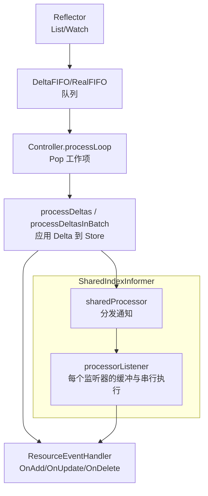
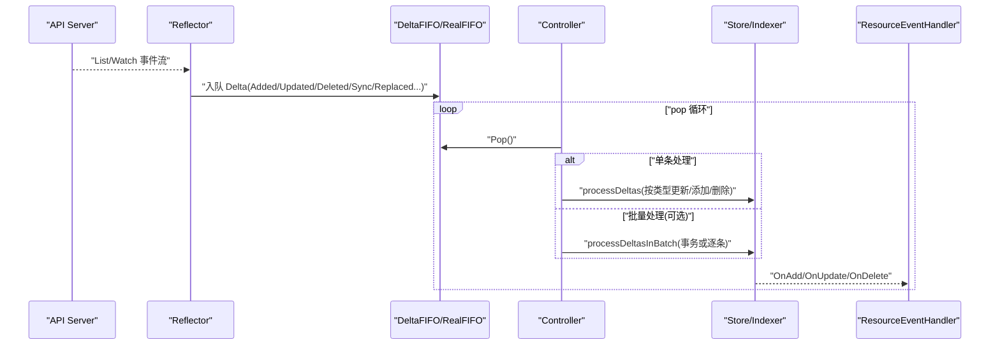
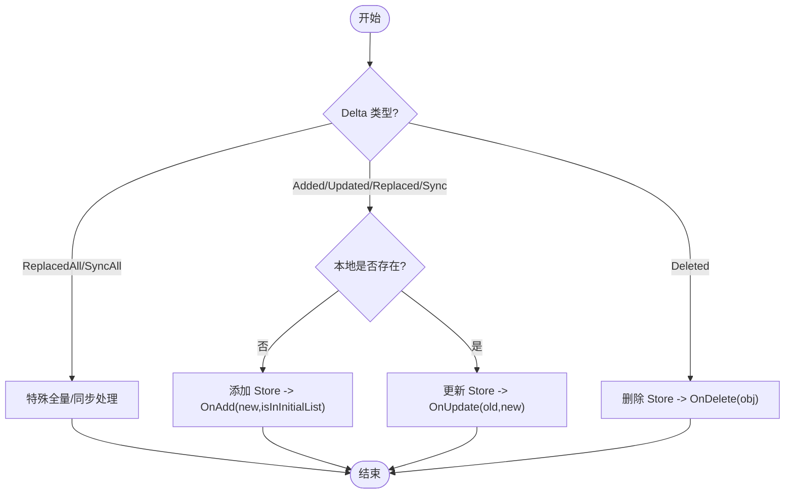
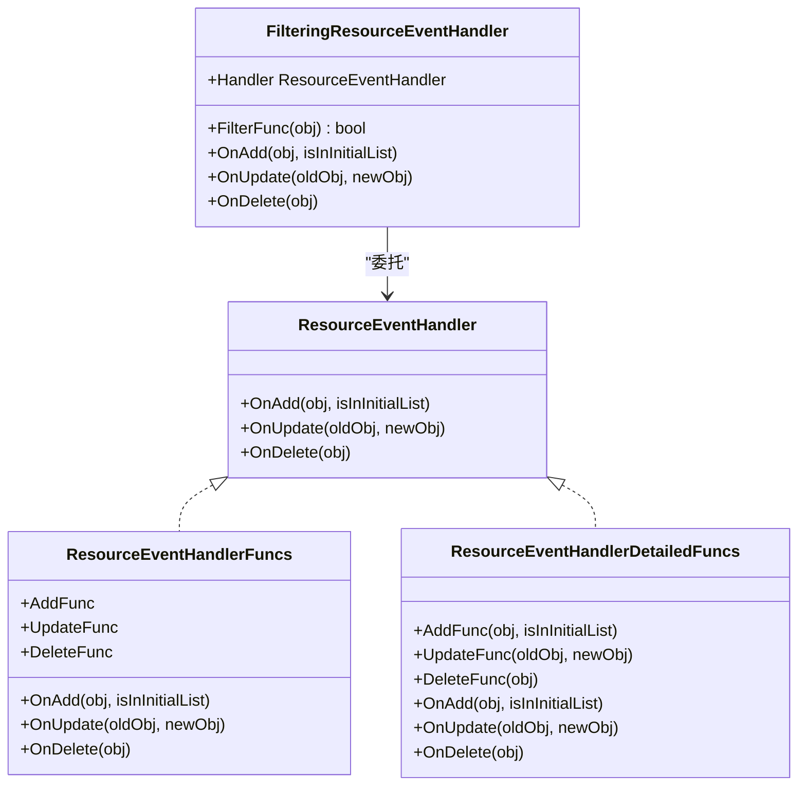
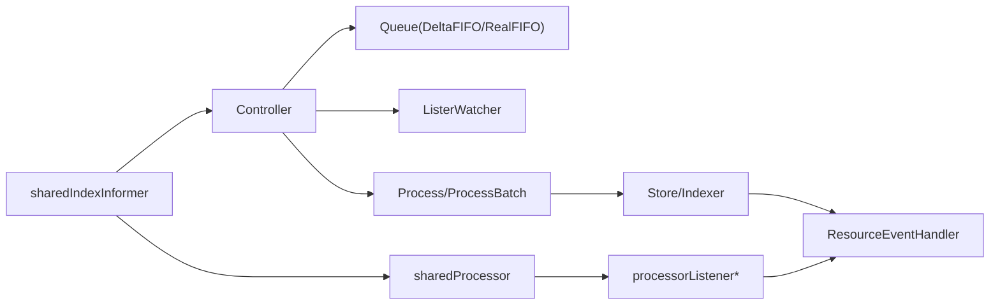

# 事件处理与回调

<cite>
**本文引用的文件**   
- [controller.go](file://staging/src/k8s.io/client-go/tools/cache/controller.go)
- [shared_informer.go](file://staging/src/k8s.io/client-go/tools/cache/shared_informer.go)
</cite>

## 目录
1. [简介](#简介)
2. [项目结构](#项目结构)
3. [核心组件](#核心组件)
4. [架构总览](#架构总览)
5. [详细组件分析](#详细组件分析)
6. [依赖关系分析](#依赖关系分析)
7. [性能考虑](#性能考虑)
8. [故障排查指南](#故障排查指南)
9. [结论](#结论)
10. [附录](#附录)

## 简介
本文件围绕 Kubernetes client-go 的 Informer 事件处理机制，系统性阐述 Add、Update、Delete 三类事件的触发条件与处理流程；深入解析 ResourceEventHandler 接口及其适配实现；并结合复杂业务场景给出事件过滤、批处理与异步处理的实践建议。同时说明事件顺序保证与幂等性策略、错误恢复与重试机制，以及性能优化技巧（如事件合并与批量处理）。

## 项目结构
Informer 的事件处理由“控制器 + 队列 + 处理器”三层协作完成：
- 控制器负责从 ListerWatcher 拉取资源并写入队列，循环弹出工作项进行处理。
- 处理器将 Delta 序列应用到本地 Store，并按类型分发到 ResourceEventHandler。
- SharedIndexInformer 提供多监听器分发、同步状态跟踪与 Resync 支持。

图示来源
- [controller.go:169-261](file://staging/src/k8s.io/client-go/tools/cache/controller.go#L169-L261)
- [controller.go:606-754](file://staging/src/k8s.io/client-go/tools/cache/controller.go#L606-L754)
- [shared_informer.go:953-1004](file://staging/src/k8s.io/client-go/tools/cache/shared_informer.go#L953-L1004)
- [shared_informer.go:1044-1189](file://staging/src/k8s.io/client-go/tools/cache/shared_informer.go#L1044-L1189)

章节来源
- [controller.go:169-261](file://staging/src/k8s.io/client-go/tools/cache/controller.go#L169-L261)
- [shared_informer.go:584-792](file://staging/src/k8s.io/client-go/tools/cache/shared_informer.go#L584-L792)

## 核心组件
- ResourceEventHandler 接口：定义 OnAdd、OnUpdate、OnDelete 三个回调，用于接收资源变更通知。
- ResourceEventHandlerFuncs / DetailedFuncs：函数式适配器，便于按需实现回调。
- FilteringResourceEventHandler：在事件进入具体处理器前进行过滤，并根据新旧对象匹配情况将 Update 转换为 Add/Delete。
- Controller：低层控制器，驱动 Reflector 与队列，循环 Pop 并调用 Process/ProcessBatch。
- sharedIndexInformer：共享索引 Informer，维护本地 Indexer，协调多个监听器，提供 HasSynced 能力。
- sharedProcessor / processorListener：负责将事件按监听器分发，并为每个监听器提供缓冲与串行执行。

章节来源
- [controller.go:278-389](file://staging/src/k8s.io/client-go/tools/cache/controller.go#L278-L389)
- [shared_informer.go:584-792](file://staging/src/k8s.io/client-go/tools/cache/shared_informer.go#L584-L792)
- [shared_informer.go:1044-1189](file://staging/src/k8s.io/client-go/tools/cache/shared_informer.go#L1044-L1189)

## 架构总览
下图展示从 API Server 到用户回调的完整链路，包括事件类型判定、Store 更新与监听器分发。

图示来源
- [controller.go:169-261](file://staging/src/k8s.io/client-go/tools/cache/controller.go#L169-L261)
- [controller.go:606-754](file://staging/src/k8s.io/client-go/tools/cache/controller.go#L606-L754)
- [shared_informer.go:953-1004](file://staging/src/k8s.io/client-go/tools/cache/shared_informer.go#L953-L1004)

## 详细组件分析

### 事件类型与处理逻辑（Add/Update/Delete）
- 触发来源
  - Reflector 将 Watch/List 结果转换为 Delta 序列并入队。
  - 当启用 Resync 时，可能产生 Sync/Replaced 等合成事件。
- 处理路径
  - 单条：processDeltas 逐个处理 Delta，根据类型决定 Add/Update/Delete 并调用对应回调。
  - 批量：processDeltasInBatch 尝试以事务方式批量应用，失败时仅对成功项触发回调。
- 关键语义
  - OnAdd：对象首次出现在本地缓存时触发；初始列表中的条目会携带 isInInitialList=true。
  - OnUpdate：对象已存在且被更新；若 ResourceVersion 未变化，可能被视作 resync 事件，仅投递给请求了 resync 的监听器。
  - OnDelete：对象被删除；若 watch 丢失导致无法获取最终状态，可能收到 DeletedFinalStateUnknown。

图示来源
- [controller.go:606-754](file://staging/src/k8s.io/client-go/tools/cache/controller.go#L606-L754)
- [shared_informer.go:978-1004](file://staging/src/k8s.io/client-go/tools/cache/shared_informer.go#L978-L1004)

章节来源
- [controller.go:606-754](file://staging/src/k8s.io/client-go/tools/cache/controller.go#L606-L754)
- [shared_informer.go:978-1004](file://staging/src/k8s.io/client-go/tools/cache/shared_informer.go#L978-L1004)

### ResourceEventHandler 接口设计与实现
- 接口职责
  - OnAdd：新增对象通知。
  - OnUpdate：对象变更通知；注意 oldObj 为上次已知状态，可能合并多次变更。
  - OnDelete：删除通知；可能收到 DeletedFinalStateUnknown。
- 适配器
  - ResourceEventHandlerFuncs：允许只实现需要的回调。
  - ResourceEventHandlerDetailedFuncs：支持传入 isInInitialList。
  - FilteringResourceEventHandler：基于 FilterFunc 过滤事件，并在 Update 时将“新符合/旧不符合”映射为 Add/Delete。

图示来源
- [controller.go:278-389](file://staging/src/k8s.io/client-go/tools/cache/controller.go#L278-L389)

章节来源
- [controller.go:278-389](file://staging/src/k8s.io/client-go/tools/cache/controller.go#L278-L389)

### 事件顺序保证与幂等性
- 顺序保证
  - 对于同一 SharedInformer 与同一对象 ID，通知按顺序投递；不同对象之间不保证全局顺序。
  - 单个监听器内，事件串行执行，避免并发竞争。
- 幂等性
  - 由于可能存在重放或合并，回调应设计为幂等：例如基于 UID 判断是否重复处理，或使用乐观锁/版本号控制。
  - OnUpdate 中可通过比较 old/new 的 UID 检测“同名替换”的情况。

章节来源
- [shared_informer.go:109-134](file://staging/src/k8s.io/client-go/tools/cache/shared_informer.go#L109-L134)
- [shared_informer.go:978-1004](file://staging/src/k8s.io/client-go/tools/cache/shared_informer.go#L978-L1004)

### 错误恢复与重试策略
- 监听器内部容错
  - 单个监听器在处理回调时发生 panic，会被捕获并跳过该消息，随后短暂休眠后继续处理下一条，避免阻塞整个管道。
- 连接异常
  - Reflector 侧通过 WatchErrorHandler 上报 ListAndWatch 断连错误，Informer 会自动退避重试。
- 队列关闭
  - 当 FIFO 关闭时，processLoop 正常退出，确保优雅停止。

章节来源
- [shared_informer.go:1365-1408](file://staging/src/k8s.io/client-go/tools/cache/shared_informer.go#L1365-L1408)
- [controller.go:169-210](file://staging/src/k8s.io/client-go/tools/cache/controller.go#L169-L210)

### 复杂业务场景示例（概念性）
- 事件过滤
  - 使用 FilteringResourceEventHandler 包装目标处理器，仅在标签/字段满足条件时转发事件；Update 时根据新旧匹配自动转为 Add/Delete。
- 批处理
  - 开启 InOrderInformersBatchProcess 特性门控，配合支持 QueueWithBatch 的队列与 TransactionStore，可批量应用 Delta 并一次性触发回调，减少锁竞争与内存分配。
- 异步处理
  - 在回调中将耗时任务提交至 workqueue，保持回调快速返回；结合 rate limiter 与延迟队列实现重试与背压。
- 幂等与去重
  - 在业务层维护已处理集合（如基于 UID+RV），或在外部存储中使用唯一约束/版本号防止重复生效。

[本节为概念性指导，不直接分析具体文件]

## 依赖关系分析
- 组件耦合
  - Controller 依赖 Queue 与 ListerWatcher，并通过 Config.Process/ProcessBatch 解耦处理逻辑。
  - sharedIndexInformer 组合 Controller 与 sharedProcessor，将事件分发到各监听器。
  - processorListener 为每个监听器提供缓冲与串行执行，屏蔽并发细节。
- 外部依赖
  - Reflector 负责与 API Server 通信；Store/Indexer 维护本地缓存与索引。
  - 特性门控控制队列实现（DeltaFIFO vs RealFIFO）、原子事件与批处理行为。

图示来源
- [controller.go:169-261](file://staging/src/k8s.io/client-go/tools/cache/controller.go#L169-L261)
- [shared_informer.go:584-792](file://staging/src/k8s.io/client-go/tools/cache/shared_informer.go#L584-L792)
- [shared_informer.go:1044-1189](file://staging/src/k8s.io/client-go/tools/cache/shared_informer.go#L1044-L1189)

章节来源
- [controller.go:169-261](file://staging/src/k8s.io/client-go/tools/cache/controller.go#L169-L261)
- [shared_informer.go:584-792](file://staging/src/k8s.io/client-go/tools/cache/shared_informer.go#L584-L792)
- [shared_informer.go:1044-1189](file://staging/src/k8s.io/client-go/tools/cache/shared_informer.go#L1044-L1189)

## 性能考虑
- 事件合并与批量处理
  - 启用 InOrderInformersBatchProcess 与 TransactionStore，可将多条 Delta 合并为一次事务，降低锁开销与回调次数。
- 队列选择
  - 在 InOrderInformers 特性下使用 RealFIFO，可减少不必要的中间态与拷贝；必要时开启 AtomicEvents 以获得更细粒度的原子事件。
- 监听器缓冲
  - processorListener 使用环形缓冲暂存待分发通知，避免阻塞上游；但需关注慢消费者导致的堆积风险。
- Resync 调优
  - 合理设置 ResyncPeriod，避免过于频繁的全量同步；最小周期受 minimumResyncPeriod 限制。

章节来源
- [controller.go:232-261](file://staging/src/k8s.io/client-go/tools/cache/controller.go#L232-L261)
- [controller.go:841-879](file://staging/src/k8s.io/client-go/tools/cache/controller.go#L841-L879)
- [shared_informer.go:880-915](file://staging/src/k8s.io/client-go/tools/cache/shared_informer.go#L880-L915)
- [shared_informer.go:1240-1284](file://staging/src/k8s.io/client-go/tools/cache/shared_informer.go#L1240-L1284)

## 故障排查指南
- 监听器卡死或 OOM
  - 检查是否有长时间运行的回调；建议在回调中异步化并接入 workqueue 限流。
  - 观察 pendingNotifications 长度指标，定位慢消费者。
- 事件丢失或重复
  - 确认业务回调幂等；对比 old/new 的 UID 识别“同名替换”。
  - 检查 Watch 断连日志，确认 Reflector 是否正确重连。
- Resync 不生效
  - 确认 informer 是否支持 resync，以及监听器设置的周期是否大于等于最小周期。
- 批处理未生效
  - 确认特性门控已开启、队列实现了 QueueWithBatch、Store 支持 TransactionStore。

章节来源
- [shared_informer.go:1365-1408](file://staging/src/k8s.io/client-go/tools/cache/shared_informer.go#L1365-L1408)
- [controller.go:169-210](file://staging/src/k8s.io/client-go/tools/cache/controller.go#L169-L210)
- [shared_informer.go:880-915](file://staging/src/k8s.io/client-go/tools/cache/shared_informer.go#L880-L915)

## 结论
client-go 的 Informer 事件模型通过“控制器 + 队列 + 处理器 + 监听器”的分层设计，提供了高可靠、可扩展的事件分发机制。理解 Add/Update/Delete 的触发条件与处理路径、利用过滤器与批处理提升效率、在业务层保障幂等性与异步化，是构建健壮控制面的关键。

## 附录
- 术语
  - Delta：表示一次资源变更的增量记录。
  - Resync：周期性全量同步，向监听器发送 Update 通知。
  - HasSynced：表示已完成至少一次完整 LIST 并推送初始事件。

[本节为概念性补充，不直接分析具体文件]