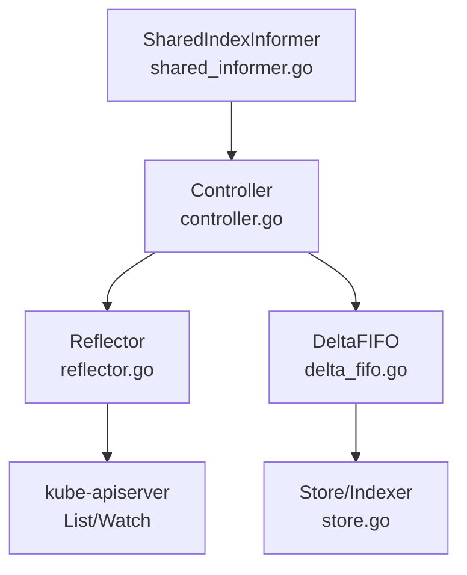
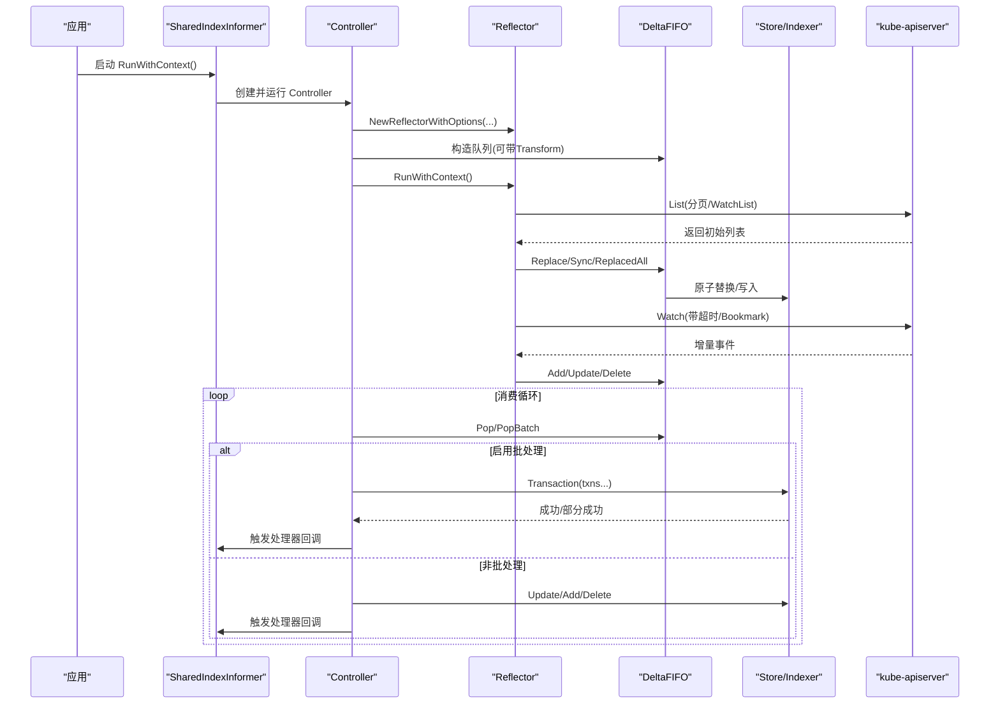
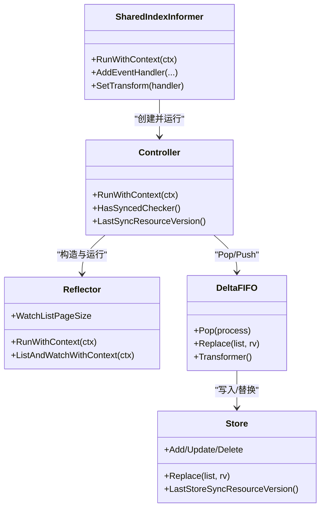

# 性能优化与监控

<cite>
**本文引用的文件**   
- [shared_informer.go](file://staging/src/k8s.io/client-go/tools/cache/shared_informer.go)
- [controller.go](file://staging/src/k8s.io/client-go/tools/cache/controller.go)
- [delta_fifo.go](file://staging/src/k8s.io/client-go/tools/cache/delta_fifo.go)
- [reflector.go](file://staging/src/k8s.io/client-go/tools/cache/reflector.go)
- [store.go](file://staging/src/k8s.io/client-go/tools/cache/store.go)
</cite>

## 目录
1. [引言](#引言)
2. [项目结构](#项目结构)
3. [核心组件](#核心组件)
4. [架构总览](#架构总览)
5. [详细组件分析](#详细组件分析)
6. [依赖关系分析](#依赖关系分析)
7. [性能考量](#性能考量)
8. [故障排查指南](#故障排查指南)
9. [结论](#结论)
10. [附录](#附录)

## 引言
本文件面向 Informer 子系统（client-go/tools/cache）的性能优化与监控，聚焦以下目标：
- 内存使用优化：对象转换、缓存大小限制、垃圾回收调优建议
- CPU 使用优化：并发控制、批处理、网络请求优化
- 监控指标：延迟、吞吐、错误率的定义与采集方法
- 限流机制：实现原理与配置要点
- 瓶颈识别与诊断工具：如何定位热点路径与异常
- 生产环境调优案例与最佳实践

说明：
- 仓库中未包含专门的“Informer”二进制或独立模块入口，但 client-go/tools/cache 提供了 Informer/Reflector/DeltaFIFO/Store 等关键实现。本文围绕这些源码进行深度分析与优化指导。

## 项目结构
本节从代码层面梳理 Informer 子系统的核心文件与职责：
- shared_informer.go：共享 Informer 接口与生命周期管理、处理器分发、同步等待等
- controller.go：底层控制器，协调 Reflector 拉取数据与队列消费；支持单条与批量处理
- delta_fifo.go：增量事件队列，聚合同一对象的多次变更，提供 Transform 能力
- reflector.go：List/Watch 客户端，负责分页、超时、退避、WatchList 等
- store.go：线程安全存储抽象与事务接口，支撑索引与查询

图示来源
- [shared_informer.go:597-792](file://staging/src/k8s.io/client-go/tools/cache/shared_informer.go#L597-L792)
- [controller.go:115-230](file://staging/src/k8s.io/client-go/tools/cache/controller.go#L115-L230)
- [reflector.go:106-171](file://staging/src/k8s.io/client-go/tools/cache/reflector.go#L106-L171)
- [delta_fifo.go:108-158](file://staging/src/k8s.io/client-go/tools/cache/delta_fifo.go#L108-L158)
- [store.go:202-216](file://staging/src/k8s.io/client-go/tools/cache/store.go#L202-L216)

章节来源
- [shared_informer.go:597-792](file://staging/src/k8s.io/client-go/tools/cache/shared_informer.go#L597-L792)
- [controller.go:115-230](file://staging/src/k8s.io/client-go/tools/cache/controller.go#L115-L230)
- [reflector.go:106-171](file://staging/src/k8s.io/client-go/tools/cache/reflector.go#L106-L171)
- [delta_fifo.go:108-158](file://staging/src/k8s.io/client-go/tools/cache/delta_fifo.go#L108-L158)
- [store.go:202-216](file://staging/src/k8s.io/client-go/tools/cache/store.go#L202-L216)

## 核心组件
- SharedIndexInformer：对外暴露的共享 Informer，维护本地缓存、处理器分发、同步状态与 resync 策略
- Controller：驱动 Reflector 拉取数据并持续从队列 Pop 处理；支持 ProcessBatch 批量处理
- DeltaFIFO：按对象键聚合 Deltas，去重与合并，支持 Transform 在入队前裁剪字段降低内存占用
- Reflector：List/Watch 客户端，内置分页、超时、退避、WatchList 特性开关、Bookmark 支持
- Store/Indexer：线程安全存储，支持索引、事务式更新（TransactionStore），以及资源版本追踪

章节来源
- [shared_informer.go:144-259](file://staging/src/k8s.io/client-go/tools/cache/shared_informer.go#L144-L259)
- [controller.go:44-100](file://staging/src/k8s.io/client-go/tools/cache/controller.go#L44-L100)
- [delta_fifo.go:160-176](file://staging/src/k8s.io/client-go/tools/cache/delta_fifo.go#L160-L176)
- [reflector.go:251-284](file://staging/src/k8s.io/client-go/tools/cache/reflector.go#L251-L284)
- [store.go:84-118](file://staging/src/k8s.io/client-go/tools/cache/store.go#L84-L118)

## 架构总览
下图展示一次 List+Watch 到事件处理的端到端流程，包括批处理分支与回退逻辑。

图示来源
- [shared_informer.go:728-792](file://staging/src/k8s.io/client-go/tools/cache/shared_informer.go#L728-L792)
- [controller.go:169-261](file://staging/src/k8s.io/client-go/tools/cache/controller.go#L169-L261)
- [reflector.go:470-509](file://staging/src/k8s.io/client-go/tools/cache/reflector.go#L470-L509)
- [delta_fifo.go:619-699](file://staging/src/k8s.io/client-go/tools/cache/delta_fifo.go#L619-L699)
- [store.go:220-252](file://staging/src/k8s.io/client-go/tools/cache/store.go#L220-L252)

## 详细组件分析

### 内存使用优化
- 对象转换（Transform）
  - 在 DeltaFIFO 入队前调用 TransformFunc，可在热路径裁剪无用字段，显著降低内存占用
  - 注意幂等性要求：当 Replace 传入已存在对象时，Transform 必须幂等，避免重复修改
  - 参考路径：[transformer 调用点:507-516](file://staging/src/k8s.io/client-go/tools/cache/delta_fifo.go#L507-L516)
- 缓存大小限制
  - 当前实现未提供内置容量上限；如需限制，应在上层业务侧做过滤或分片
  - 可通过 Indexers 减少不必要的全量遍历，提高查询效率
  - 参考路径：[Indexer 创建与选项:428-442](file://staging/src/k8s.io/client-go/tools/cache/store.go#L428-L442)
- 垃圾回收调优建议
  - 通过 Transform 减少大对象驻留，缩短 GC 压力峰值
  - 合理设置 ResyncPeriod，避免频繁全量同步导致对象重建与抖动
  - 参考路径：[Resync 周期与检查:317-349](file://staging/src/k8s.io/client-go/tools/cache/shared_informer.go#L317-L349)

章节来源
- [delta_fifo.go:160-176](file://staging/src/k8s.io/client-go/tools/cache/delta_fifo.go#L160-L176)
- [delta_fifo.go:507-516](file://staging/src/k8s.io/client-go/tools/cache/delta_fifo.go#L507-L516)
- [store.go:428-442](file://staging/src/k8s.io/client-go/tools/cache/store.go#L428-L442)
- [shared_informer.go:317-349](file://staging/src/k8s.io/client-go/tools/cache/shared_informer.go#L317-L349)

### CPU 使用优化
- 并发控制
  - 单个 Informer 的事件处理器串行化保证顺序；长耗时处理应下沉至外部工作队列
  - 参考路径：[处理器串行与阻塞提示:135-139](file://staging/src/k8s.io/client-go/tools/cache/shared_informer.go#L135-L139)
- 批处理（ProcessBatch）
  - 当 Queue 支持 QueueWithBatch 且开启 InOrderInformersBatchProcess 特性门时，走批量路径，减少锁竞争与回调开销
  - 参考路径：[批处理选择与执行:236-261](file://staging/src/k8s.io/client-go/tools/cache/controller.go#L236-L261)
- 网络请求优化
  - Watch 超时随机化分散压力；默认最小 5m，最大为两倍
  - 支持 WatchList 语义以减少服务器资源消耗；失败自动回退到传统 LIST
  - 支持 Bookmark 推进 ResourceVersion，避免长时间无事件挂起
  - 参考路径：[超时与退避常量:54-68](file://staging/src/k8s.io/client-go/tools/cache/reflector.go#L54-L68)、[RunWithContext 主循环:420-435](file://staging/src/k8s.io/client-go/tools/cache/reflector.go#L420-L435)、[WatchList 与回退:470-509](file://staging/src/k8s.io/client-go/tools/cache/reflector.go#L470-L509)

章节来源
- [shared_informer.go:135-139](file://staging/src/k8s.io/client-go/tools/cache/shared_informer.go#L135-L139)
- [controller.go:236-261](file://staging/src/k8s.io/client-go/tools/cache/controller.go#L236-L261)
- [reflector.go:54-68](file://staging/src/k8s.io/client-go/tools/cache/reflector.go#L54-L68)
- [reflector.go:420-435](file://staging/src/k8s.io/client-go/tools/cache/reflector.go#L420-L435)
- [reflector.go:470-509](file://staging/src/k8s.io/client-go/tools/cache/reflector.go#L470-L509)

### 监控指标定义与采集
- 延迟
  - 队列 Pop 处理耗时：当队列深度大于阈值且处理时间超过阈值时记录慢路径日志
  - 参考路径：[Pop 慢路径跟踪:591-602](file://staging/src/k8s.io/client-go/tools/cache/delta_fifo.go#L591-L602)
- 吞吐量
  - 通过队列长度、Pop 次数、Replace 批次大小估算；结合 Store 的 LastStoreSyncResourceVersion 判断同步进度
  - 参考路径：[LastStoreSyncResourceVersion:58-61](file://staging/src/k8s.io/client-go/tools/cache/store.go#L58-L61)
- 错误率
  - Watch 错误分类处理（过期、EOF、内部错误、429 等），配合 WatchErrorHandler 上报
  - 参考路径：[DefaultWatchErrorHandler:214-229](file://staging/src/k8s.io/client-go/tools/cache/reflector.go#L214-L229)、[watch 错误分支:644-668](file://staging/src/k8s.io/client-go/tools/cache/reflector.go#L644-L668)

章节来源
- [delta_fifo.go:591-602](file://staging/src/k8s.io/client-go/tools/cache/delta_fifo.go#L591-L602)
- [store.go:58-61](file://staging/src/k8s.io/client-go/tools/cache/store.go#L58-L61)
- [reflector.go:214-229](file://staging/src/k8s.io/client-go/tools/cache/reflector.go#L214-L229)
- [reflector.go:644-668](file://staging/src/k8s.io/client-go/tools/cache/reflector.go#L644-L668)

### 限流机制的实现与配置
- Watch 层限流
  - 指数退避 + 抖动：初始间隔、最大间隔、重置时长、因子与抖动参数控制重试频率
  - 参考路径：[退避常量与 DelayWithReset:54-68](file://staging/src/k8s.io/client-go/tools/cache/reflector.go#L54-L68)、[NewReflectorWithOptions 初始化:317-326](file://staging/src/k8s.io/client-go/tools/cache/reflector.go#L317-L326)
- 429 TooManyRequests 处理
  - 遇到 429 直接退避，避免雪崩
  - 参考路径：[429 分支:652-659](file://staging/src/k8s.io/client-go/tools/cache/reflector.go#L652-L659)
- 应用层限流建议
  - 将长耗时处理放入外部 workqueue 并限制并发度，避免阻塞 Informer 事件分发
  - 参考路径：[处理器串行与阻塞提示:135-139](file://staging/src/k8s.io/client-go/tools/cache/shared_informer.go#L135-L139)

章节来源
- [reflector.go:54-68](file://staging/src/k8s.io/client-go/tools/cache/reflector.go#L54-L68)
- [reflector.go:317-326](file://staging/src/k8s.io/client-go/tools/cache/reflector.go#L317-L326)
- [reflector.go:652-659](file://staging/src/k8s.io/client-go/tools/cache/reflector.go#L652-L659)
- [shared_informer.go:135-139](file://staging/src/k8s.io/client-go/tools/cache/shared_informer.go#L135-L139)

### 性能瓶颈识别与诊断工具
- 慢路径跟踪
  - DeltaFIFO Pop 在队列深度较大且处理缓慢时输出 trace，便于定位热点
  - 参考路径：[Pop 慢路径跟踪:591-602](file://staging/src/k8s.io/client-go/tools/cache/delta_fifo.go#L591-L602)
- 同步等待与日志
  - WaitForNamedCacheSync 系列函数提供同步等待与日志输出，辅助判断缓存是否就绪
  - 参考路径：[WaitForNamedCacheSync:384-399](file://staging/src/k8s.io/client-go/tools/cache/shared_informer.go#L384-L399)
- 资源版本与一致性
  - 通过 LastSyncResourceVersion 与 LastStoreSyncResourceVersion 观察同步进度与一致性
  - 参考路径：[LastSyncResourceVersion:223-230](file://staging/src/k8s.io/client-go/tools/cache/controller.go#L223-L230)、[LastStoreSyncResourceVersion:58-61](file://staging/src/k8s.io/client-go/tools/cache/store.go#L58-L61)

章节来源
- [delta_fifo.go:591-602](file://staging/src/k8s.io/client-go/tools/cache/delta_fifo.go#L591-L602)
- [shared_informer.go:384-399](file://staging/src/k8s.io/client-go/tools/cache/shared_informer.go#L384-L399)
- [controller.go:223-230](file://staging/src/k8s.io/client-go/tools/cache/controller.go#L223-L230)
- [store.go:58-61](file://staging/src/k8s.io/client-go/tools/cache/store.go#L58-L61)

### 生产环境调优案例与最佳实践
- 场景一：大规模对象类型（如 Pod）
  - 启用 Transform 裁剪冗余字段，降低内存峰值
  - 适当增大 ResyncPeriod，减少不必要的 OnUpdate 风暴
  - 使用 Indexers 加速按命名空间/标签的查询
  - 参考路径：[Transform 与 Resync:507-516](file://staging/src/k8s.io/client-go/tools/cache/delta_fifo.go#L507-L516)、[Resync 周期:317-349](file://staging/src/k8s.io/client-go/tools/cache/shared_informer.go#L317-L349)、[Indexer 创建:428-442](file://staging/src/k8s.io/client-go/tools/cache/store.go#L428-L442)
- 场景二：高 QPS 写放大
  - 开启 InOrderInformersBatchProcess 特性门，使用 ProcessBatch 与 TransactionStore 批量提交
  - 参考路径：[批处理选择:236-261](file://staging/src/k8s.io/client-go/tools/cache/controller.go#L236-L261)、[TransactionStore 接口:101-118](file://staging/src/k8s.io/client-go/tools/cache/store.go#L101-L118)
- 场景三：APIServer 不稳定
  - 利用 Watch 超时随机化与指数退避，避免雪崩；关注 429 与内部错误分支
  - 参考路径：[退避与超时:54-68](file://staging/src/k8s.io/client-go/tools/cache/reflector.go#L54-L68)、[429 分支:652-659](file://staging/src/k8s.io/client-go/tools/cache/reflector.go#L652-L659)

章节来源
- [delta_fifo.go:507-516](file://staging/src/k8s.io/client-go/tools/cache/delta_fifo.go#L507-L516)
- [shared_informer.go:317-349](file://staging/src/k8s.io/client-go/tools/cache/shared_informer.go#L317-L349)
- [store.go:428-442](file://staging/src/k8s.io/client-go/tools/cache/store.go#L428-L442)
- [controller.go:236-261](file://staging/src/k8s.io/client-go/tools/cache/controller.go#L236-L261)
- [store.go:101-118](file://staging/src/k8s.io/client-go/tools/cache/store.go#L101-L118)
- [reflector.go:54-68](file://staging/src/k8s.io/client-go/tools/cache/reflector.go#L54-L68)
- [reflector.go:652-659](file://staging/src/k8s.io/client-go/tools/cache/reflector.go#L652-L659)

## 依赖关系分析
- SharedIndexInformer 依赖 Controller 与 Processor，Controller 依赖 Reflector 与 DeltaFIFO，DeltaFIFO 依赖 Store/Indexer
- Reflector 依赖 ListerWatcher 与 watchlist/pager 等网络与分页能力
- Store/Indexer 提供线程安全与索引能力，可选支持事务

图示来源
- [shared_informer.go:597-792](file://staging/src/k8s.io/client-go/tools/cache/shared_informer.go#L597-L792)
- [controller.go:115-230](file://staging/src/k8s.io/client-go/tools/cache/controller.go#L115-L230)
- [reflector.go:106-171](file://staging/src/k8s.io/client-go/tools/cache/reflector.go#L106-L171)
- [delta_fifo.go:108-158](file://staging/src/k8s.io/client-go/tools/cache/delta_fifo.go#L108-L158)
- [store.go:202-216](file://staging/src/k8s.io/client-go/tools/cache/store.go#L202-L216)

章节来源
- [shared_informer.go:597-792](file://staging/src/k8s.io/client-go/tools/cache/shared_informer.go#L597-L792)
- [controller.go:115-230](file://staging/src/k8s.io/client-go/tools/cache/controller.go#L115-L230)
- [reflector.go:106-171](file://staging/src/k8s.io/client-go/tools/cache/reflector.go#L106-L171)
- [delta_fifo.go:108-158](file://staging/src/k8s.io/client-go/tools/cache/delta_fifo.go#L108-L158)
- [store.go:202-216](file://staging/src/k8s.io/client-go/tools/cache/store.go#L202-L216)

## 性能考量
- 内存
  - 优先使用 Transform 裁剪对象；避免在热路径复制大对象
  - 谨慎使用全量 Replace，尽量使用增量事件；必要时确保 Transform 幂等
- CPU
  - 启用批处理与事务式更新，减少锁竞争与回调开销
  - 合理设置 ResyncPeriod，避免频繁全量同步
- 网络
  - 利用 WatchList 与 Bookmark 提升一致性快照效率
  - 利用超时随机化与退避保护 APIServer 与自身稳定性
- 监控
  - 基于慢路径跟踪与错误分类建立告警规则
  - 结合队列深度、Pop 速率、Replace 批次大小评估系统健康度

## 故障排查指南
- 常见问题
  - 事件堆积：检查处理器是否阻塞；考虑异步工作队列与限流
  - 频繁重连：关注 Watch 错误分类与退避策略；检查 429 与内部错误
  - 内存飙升：确认 Transform 是否生效；审查 Replace 的使用与对象大小
- 定位手段
  - 使用慢路径跟踪日志定位热点
  - 通过 HasSynced/LastSyncResourceVersion 判断同步进度
  - 借助 DefaultWatchErrorHandler 自定义上报渠道

章节来源
- [delta_fifo.go:591-602](file://staging/src/k8s.io/client-go/tools/cache/delta_fifo.go#L591-L602)
- [reflector.go:214-229](file://staging/src/k8s.io/client-go/tools/cache/reflector.go#L214-L229)
- [controller.go:223-230](file://staging/src/k8s.io/client-go/tools/cache/controller.go#L223-L230)

## 结论
通过对 Informer 子系统的深入分析，可从对象转换、批处理、网络超时与退避、监控与限流等多维度进行系统性优化。在生产环境中，建议结合业务特征调整 ResyncPeriod、启用 Transform 与批处理，并完善监控与告警体系，以获得稳定高效的性能表现。

## 附录
- 相关接口与选项
  - SharedIndexInformerOptions：ResyncPeriod、Indexers、Identifier、MetricsProvider
  - ReflectorOptions：MinWatchTimeout、Backoff、TypeDescription、Name
  - DeltaFIFOOptions：KeyFunction、KnownObjects、EmitDeltaTypeReplaced、Transformer
  - StoreOption：WithTransformer、WithStoreMetrics

章节来源
- [shared_informer.go:351-371](file://staging/src/k8s.io/client-go/tools/cache/shared_informer.go#L351-L371)
- [reflector.go:251-284](file://staging/src/k8s.io/client-go/tools/cache/reflector.go#L251-L284)
- [delta_fifo.go:32-65](file://staging/src/k8s.io/client-go/tools/cache/delta_fifo.go#L32-L65)
- [store.go:394-410](file://staging/src/k8s.io/client-go/tools/cache/store.go#L394-L410)