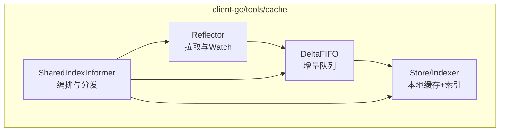
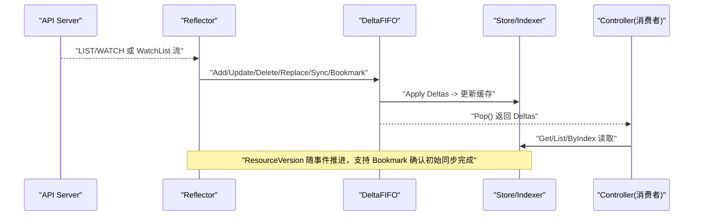
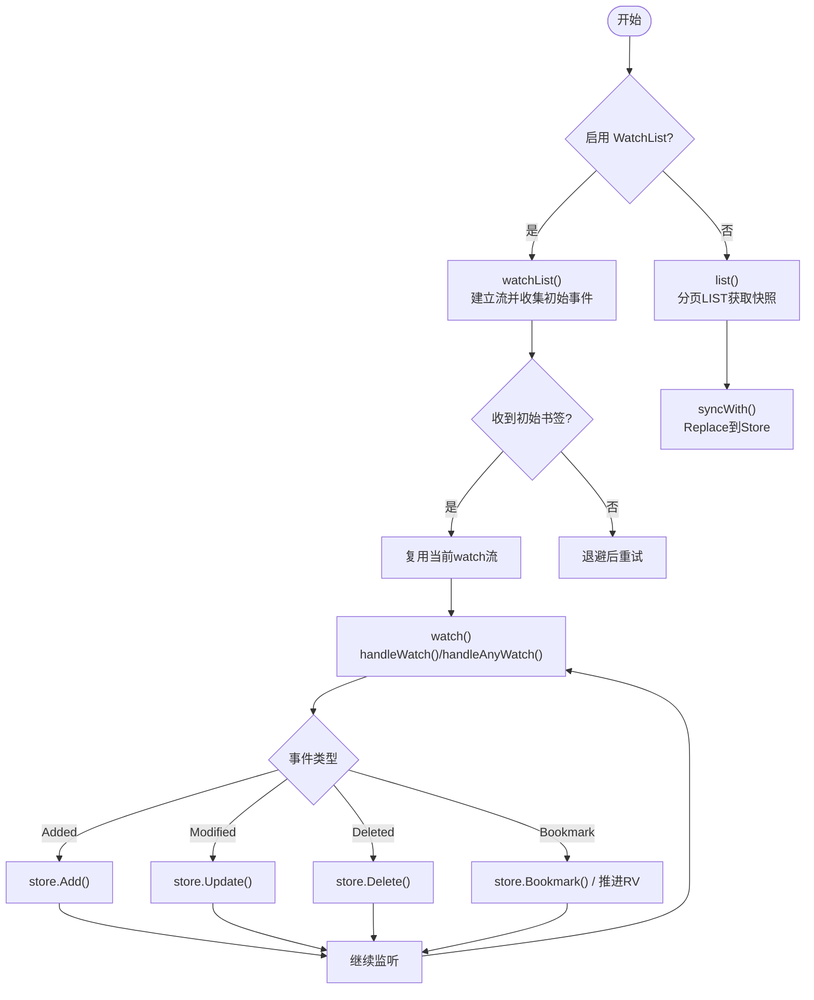
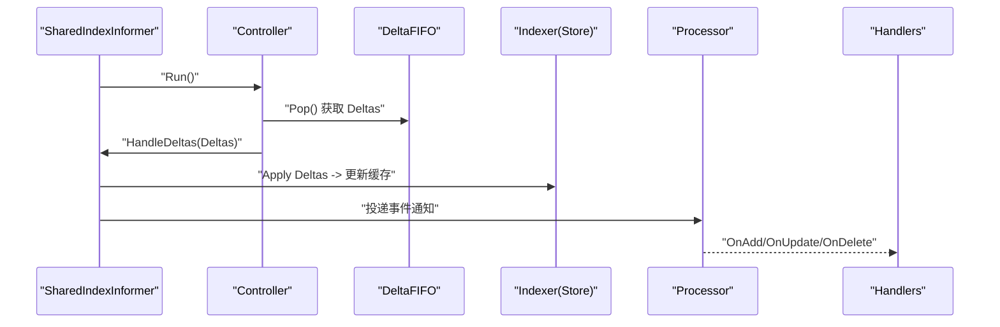
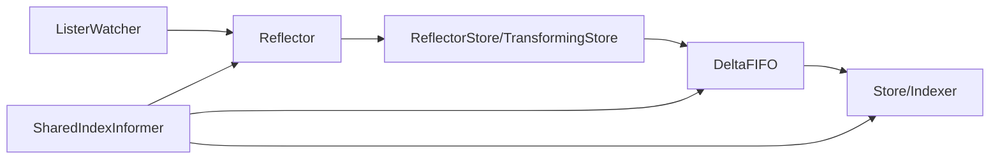

# 核心组件架构

<cite>
**本文引用的文件**   
- [reflector.go](file://staging/src/k8s.io/client-go/tools/cache/reflector.go)
- [delta_fifo.go](file://staging/src/k8s.io/client-go/tools/cache/delta_fifo.go)
- [store.go](file://staging/src/k8s.io/client-go/tools/cache/store.go)
- [shared_informer.go](file://staging/src/k8s.io/client-go/tools/cache/shared_informer.go)
</cite>

## 目录
1. [引言](#引言)
2. [项目结构](#项目结构)
3. [核心组件](#核心组件)
4. [架构总览](#架构总览)
5. [详细组件分析](#详细组件分析)
6. [依赖关系分析](#依赖关系分析)
7. [性能考量](#性能考量)
8. [故障排查指南](#故障排查指南)
9. [结论](#结论)
10. [附录](#附录)

## 引言
本技术文档聚焦 Kubernetes Informer 的核心组件：Reflector、DeltaFIFO 与 Store。目标是深入解释三者设计原理与实现细节，说明 Reflector 如何从 API Server 拉取资源变更、DeltaFIFO 如何处理事件队列与去重机制、Store 如何实现本地缓存与索引功能；并提供组件交互流程图与数据流转说明，覆盖配置参数、性能特性、故障处理机制以及内存使用模式与垃圾回收策略。

## 项目结构
Informer 相关代码位于 client-go 的 tools/cache 包中，核心文件包括：
- reflector.go：负责与 API Server 建立 LIST/WATCH 或 WatchList 流，维护 ResourceVersion，并将事件写入下游队列/存储。
- delta_fifo.go：提供带“增量”语义的 FIFO 队列，聚合同一对象的多条 Delta，支持 Replaced/Sync/Bookmark 等事件类型，并内置去重逻辑。
- store.go：定义 Store/Indexer 接口及基于 ThreadSafeStore 的实现，提供 Add/Update/Delete/List/Get/Replace/Resync 等操作，支持索引。
- shared_informer.go：编排 Reflector、DeltaFIFO 与 Indexer，驱动控制器循环，分发事件给处理器。



图表来源
- [reflector.go:106-171](file://staging/src/k8s.io/client-go/tools/cache/reflector.go#L106-L171)
- [delta_fifo.go:108-158](file://staging/src/k8s.io/client-go/tools/cache/delta_fifo.go#L108-L158)
- [store.go:28-82](file://staging/src/k8s.io/client-go/tools/cache/store.go#L28-L82)
- [shared_informer.go:584-647](file://staging/src/k8s.io/client-go/tools/cache/shared_informer.go#L584-L647)

章节来源
- [reflector.go:106-171](file://staging/src/k8s.io/client-go/tools/cache/reflector.go#L106-L171)
- [delta_fifo.go:108-158](file://staging/src/k8s.io/client-go/tools/cache/delta_fifo.go#L108-L158)
- [store.go:28-82](file://staging/src/k8s.io/client-go/tools/cache/store.go#L28-L82)
- [shared_informer.go:584-647](file://staging/src/k8s.io/client-go/tools/cache/shared_informer.go#L584-L647)

## 核心组件
本节概述三个核心组件的职责与关键能力：
- Reflector：封装与 API Server 的通信（LIST/WATCH 或 WatchList），管理超时、退避、重试、书签（Bookmark）与资源版本推进，将事件转换为对下游的增删改操作。
- DeltaFIFO：面向对象的增量队列，按 key 聚合多条 Delta，提供 Replace/Sync/ReplacedAll/Bookmark 等事件类型，并在入队阶段进行去重与可选 Transform。
- Store/Indexer：线程安全的本地缓存，支持键值存取、批量替换、索引查询与事务式更新，供上层控制器高效读取。

章节来源
- [reflector.go:106-171](file://staging/src/k8s.io/client-go/tools/cache/reflector.go#L106-L171)
- [delta_fifo.go:178-208](file://staging/src/k8s.io/client-go/tools/cache/delta_fifo.go#L178-L208)
- [store.go:28-82](file://staging/src/k8s.io/client-go/tools/cache/store.go#L28-L82)

## 架构总览
下图展示 SharedIndexInformer 如何组合 Reflector、DeltaFIFO 与 Store/Indexer，形成“拉取-队列-缓存-分发”的数据流水线。



图表来源
- [reflector.go:470-509](file://staging/src/k8s.io/client-go/tools/cache/reflector.go#L470-L509)
- [reflector.go:919-961](file://staging/src/k8s.io/client-go/tools/cache/reflector.go#L919-L961)
- [delta_fifo.go:562-608](file://staging/src/k8s.io/client-go/tools/cache/delta_fifo.go#L562-L608)
- [store.go:254-294](file://staging/src/k8s.io/client-go/tools/cache/store.go#L254-L294)

## 详细组件分析

### Reflector：从 API Server 拉取资源变更
- 启动与主循环
  - Run/RunWithContext 通过延迟器（指数退避）反复调用 ListAndWatchWithContext，失败时交由 WatchErrorHandler 处理。
- 列表与观察
  - 优先尝试 WatchList（若启用且客户端支持），否则回退到传统 LIST + WATCH。
  - LIST 阶段使用分页器，根据是否已分页结果、RV 是否为空或“0”决定请求行为，避免在 watch cache 不可用时直接打 etcd。
  - WATCH 阶段设置随机超时、允许书签，持续消费事件并更新 Store。
- 资源版本与一致性
  - LastSyncResourceVersion 记录最近同步的 RV；relistResourceVersion/rewatchResourceVersion 决定下次 LIST/WATCH 起始点。
  - 当出现过期或“too large resource version”错误时，标记 lastSyncResourceVersionUnavailable，回退到最新一致快照。
- 错误与重试
  - 区分可重试错误（连接拒绝、429）、内部错误（带截止时间的重试）、过期/Gone 错误（触发重新 LIST）。
  - 默认 WatchErrorHandler 针对不同类型日志级别输出，避免阻塞控制循环。
- 书签与初始事件结束
  - handleAnyWatch 识别 Bookmark 事件，若为初始事件结束书签则停止该流并复用后续 watch。
  - 提供 initialEventsEndBookmarkTicker 监控长时间未收到书签的情况并告警。



图表来源
- [reflector.go:470-509](file://staging/src/k8s.io/client-go/tools/cache/reflector.go#L470-L509)
- [reflector.go:674-783](file://staging/src/k8s.io/client-go/tools/cache/reflector.go#L674-L783)
- [reflector.go:804-908](file://staging/src/k8s.io/client-go/tools/cache/reflector.go#L804-L908)
- [reflector.go:919-961](file://staging/src/k8s.io/client-go/tools/cache/reflector.go#L919-L961)
- [reflector.go:972-1095](file://staging/src/k8s.io/client-go/tools/cache/reflector.go#L972-L1095)

章节来源
- [reflector.go:416-435](file://staging/src/k8s.io/client-go/tools/cache/reflector.go#L416-L435)
- [reflector.go:470-509](file://staging/src/k8s.io/client-go/tools/cache/reflector.go#L470-L509)
- [reflector.go:674-783](file://staging/src/k8s.io/client-go/tools/cache/reflector.go#L674-L783)
- [reflector.go:804-908](file://staging/src/k8s.io/client-go/tools/cache/reflector.go#L804-L908)
- [reflector.go:972-1095](file://staging/src/k8s.io/client-go/tools/cache/reflector.go#L972-L1095)
- [reflector.go:1154-1205](file://staging/src/k8s.io/client-go/tools/cache/reflector.go#L1154-L1205)

### DeltaFIFO：事件队列与去重机制
- 数据结构
  - items：key -> Deltas（每个 key 对应一个增量序列）
  - queue：无重复 key 的 FIFO 顺序，保证 Pop 的顺序性
  - synced：用于标识初始同步完成
- 事件类型
  - Added/Updated/Deleted/Replaced/ReplacedAll/Sync/SyncAll/Bookmark
- 入队与去重
  - queueActionInternalLocked 在追加新 Delta 后调用 dedupDeltas，合并最后两条相同类型的删除事件，保留信息更完整的一条。
  - 仅当 newDeltas 非空时才入队，避免空队列项。
- 替换与缺失检测
  - Replace 会为新列表中的每个对象入队 Replaced/Sync，并对不在新列表中的已知 key 生成 DeletedFinalStateUnknown 删除事件，确保最终一致性。
- 周期性 Resync
  - Resync 遍历 knownObjects，为尚未排队的 key 入队 Sync 事件，供上层做幂等重算。
- 转换与性能
  - 支持 Transformer，在入队前对对象进行裁剪或归一化，降低内存占用；TransformFunc 必须幂等。
- 同步状态
  - HasSynced/DoneChecker 基于 populated 与 initialPopulationCount 判定初始同步完成。

```mermaid
classDiagram
class DeltaFIFO {
-logger klog.Logger
-name string
-lock sync.RWMutex
-cond sync.Cond
-items map[string]Deltas
-queue []string
-synced chan struct{}
-populated bool
-initialPopulationCount int
-keyFunc KeyFunc
-knownObjects KeyListerGetter
-closed bool
-emitDeltaTypeReplaced bool
-transformer TransformFunc
+Add(obj) error
+Update(obj) error
+Delete(obj) error
+Replace(list, rv) error
+Resync() error
+Pop(process) (interface{}, error)
+KeyOf(obj) (string, error)
+HasSynced() bool
+Close() void
}
class Deltas {
<<slice of Delta>>
+Oldest() *Delta
+Newest() *Delta
}
class Delta {
+Type DeltaType
+Object interface{}
}
class DeletedFinalStateUnknown {
+Key string
+Obj interface{}
}
DeltaFIFO --> Deltas : "items[key]"
Deltas --> Delta : "元素"
DeltaFIFO --> DeletedFinalStateUnknown : "删除占位"
```

图表来源
- [delta_fifo.go:108-158](file://staging/src/k8s.io/client-go/tools/cache/delta_fifo.go#L108-L158)
- [delta_fifo.go:178-208](file://staging/src/k8s.io/client-go/tools/cache/delta_fifo.go#L178-L208)
- [delta_fifo.go:443-478](file://staging/src/k8s.io/client-go/tools/cache/delta_fifo.go#L443-L478)
- [delta_fifo.go:619-699](file://staging/src/k8s.io/client-go/tools/cache/delta_fifo.go#L619-L699)
- [delta_fifo.go:704-747](file://staging/src/k8s.io/client-go/tools/cache/delta_fifo.go#L704-L747)
- [delta_fifo.go:793-800](file://staging/src/k8s.io/client-go/tools/cache/delta_fifo.go#L793-L800)

章节来源
- [delta_fifo.go:108-158](file://staging/src/k8s.io/client-go/tools/cache/delta_fifo.go#L108-L158)
- [delta_fifo.go:443-478](file://staging/src/k8s.io/client-go/tools/cache/delta_fifo.go#L443-L478)
- [delta_fifo.go:562-608](file://staging/src/k8s.io/client-go/tools/cache/delta_fifo.go#L562-L608)
- [delta_fifo.go:619-699](file://staging/src/k8s.io/client-go/tools/cache/delta_fifo.go#L619-L699)
- [delta_fifo.go:704-747](file://staging/src/k8s.io/client-go/tools/cache/delta_fifo.go#L704-L747)

### Store/Indexer：本地缓存与索引
- 接口与实现
  - Store 定义 Add/Update/Delete/List/ListKeys/Get/GetByKey/Replace/Resync 等通用操作。
  - cache 基于 ThreadSafeStore 实现，支持 Transform、指标上报、事务式更新（Transaction）。
- 索引能力
  - Indexer 扩展了 ByIndex/IndexKeys/ListIndexFuncValues 等索引查询方法，便于按标签/字段快速定位对象。
- 键函数与命名
  - MetaNamespaceKeyFunc 提供默认的 namespace/name 键构造；SplitMetaNamespaceKey 解析键。
- 替换与一致性
  - Replace 会将传入列表构建为 map，再原子替换底层存储，避免中间态不一致。
- 资源版本与书签
  - LastStoreSyncResourceVersion/Bookmark 暴露给 Reflector 以推进全局 RV。

```mermaid
classDiagram
class Store {
<<interface>>
+Add(obj) error
+Update(obj) error
+Delete(obj) error
+List() []interface{}
+ListKeys() []string
+LastStoreSyncResourceVersion() string
+Bookmark(rv) void
+Get(obj) (item, exists, err)
+GetByKey(key) (item, exists, err)
+Replace(list, rv) error
+Resync() error
}
class Indexer {
<<interface>>
+AddIndexers(indexers) error
+GetIndexer() Indexer
+Index(indexName, obj) ([]interface{}, error)
+IndexKeys(indexName, indexedValue) ([]string, error)
+ListIndexFuncValues(indexName) []string
+ByIndex(indexName, indexedValue) ([]interface{}, error)
}
class cache {
-cacheStorage ThreadSafeStore
-keyFunc KeyFunc
-transformer TransformFunc
-identifier InformerNameAndResource
-metrics InformerMetricsProvider
+Add/Update/Delete/...
+Transaction(txns...) *TransactionError
}
Store <|.. cache
Indexer <|.. cache
```

图表来源
- [store.go:28-82](file://staging/src/k8s.io/client-go/tools/cache/store.go#L28-L82)
- [store.go:202-252](file://staging/src/k8s.io/client-go/tools/cache/store.go#L202-L252)
- [store.go:254-294](file://staging/src/k8s.io/client-go/tools/cache/store.go#L254-L294)
- [store.go:369-387](file://staging/src/k8s.io/client-go/tools/cache/store.go#L369-L387)
- [store.go:428-443](file://staging/src/k8s.io/client-go/tools/cache/store.go#L428-L443)

章节来源
- [store.go:28-82](file://staging/src/k8s.io/client-go/tools/cache/store.go#L28-L82)
- [store.go:202-252](file://staging/src/k8s.io/client-go/tools/cache/store.go#L202-L252)
- [store.go:254-294](file://staging/src/k8s.io/client-go/tools/cache/store.go#L254-L294)
- [store.go:369-387](file://staging/src/k8s.io/client-go/tools/cache/store.go#L369-L387)
- [store.go:428-443](file://staging/src/k8s.io/client-go/tools/cache/store.go#L428-L443)

### SharedIndexInformer：编排与事件分发
- 组成
  - indexer：本地缓存（Indexer）
  - controller：驱动 Reflector 与 DeltaFIFO 的循环
  - processor：将处理后的通知分发给各 ResourceEventHandler
- 运行流程
  - RunWithContext 创建队列（DeltaFIFO），构造 Config，启动 controller；同时启动 processor 与缓存变更检测器。
  - HandleDeltas 在持有队列锁的情况下依次处理每个 Delta，更新本地缓存并向处理器投递通知。
- 同步与等待
  - HasSynced/HasSyncedChecker 指示缓存是否已完成一次完整 LIST；WaitForCacheSync/WaitFor 提供便捷等待工具。



图表来源
- [shared_informer.go:728-792](file://staging/src/k8s.io/client-go/tools/cache/shared_informer.go#L728-L792)
- [shared_informer.go:584-647](file://staging/src/k8s.io/client-go/tools/cache/shared_informer.go#L584-L647)

章节来源
- [shared_informer.go:728-792](file://staging/src/k8s.io/client-go/tools/cache/shared_informer.go#L728-L792)
- [shared_informer.go:584-647](file://staging/src/k8s.io/client-go/tools/cache/shared_informer.go#L584-L647)

## 依赖关系分析
- Reflector 依赖 ListerWatcher 与 Store（或 TransformingStore/ReflectorBookmarkStore），通过 handleWatch/handleListWatch 将事件写入 Store。
- DeltaFIFO 依赖 KeyFunc、KnownObjects（可选）与 TransformFunc，向消费者提供有序 Deltas。
- Store/Indexer 依赖 ThreadSafeStore 提供并发安全与索引能力。
- SharedIndexInformer 组合以上三者，形成端到端的数据通道。



图表来源
- [reflector.go:106-171](file://staging/src/k8s.io/client-go/tools/cache/reflector.go#L106-L171)
- [delta_fifo.go:108-158](file://staging/src/k8s.io/client-go/tools/cache/delta_fifo.go#L108-L158)
- [store.go:202-252](file://staging/src/k8s.io/client-go/tools/cache/store.go#L202-L252)
- [shared_informer.go:584-647](file://staging/src/k8s.io/client-go/tools/cache/shared_informer.go#L584-L647)

章节来源
- [reflector.go:106-171](file://staging/src/k8s.io/client-go/tools/cache/reflector.go#L106-L171)
- [delta_fifo.go:108-158](file://staging/src/k8s.io/client-go/tools/cache/delta_fifo.go#L108-L158)
- [store.go:202-252](file://staging/src/k8s.io/client-go/tools/cache/store.go#L202-L252)
- [shared_informer.go:584-647](file://staging/src/k8s.io/client-go/tools/cache/shared_informer.go#L584-L647)

## 性能考量
- 网络与超时
  - Reflector 的 watch 超时在 [minWatchTimeout, maxWatchTimeout] 内随机化，减少控制面热点；默认最小 5 分钟，最大为其两倍。
  - 首次 LIST 可能走分页，若检测到分页结果，后续 LIST 倾向使用 watch cache（不强制分页），避免直连 etcd。
- 队列与处理
  - DeltaFIFO 的 Pop 在持有队列锁下执行 process，应避免耗时 I/O；当队列深度大于 10 且处理时间超过阈值时，会输出慢路径追踪日志。
  - TransformFunc 在入队前执行，建议轻量且幂等，以降低内存占用。
- 内存与 GC
  - Store 的 Replace 会一次性构建 map 并替换底层存储，减少中间态；DeltaFIFO 的 items 与 queue 在 Pop 后释放对应 key 的条目，有助于 GC。
  - 使用 TransformFunc 裁剪大对象字段，可降低整体内存峰值。
- 指标与观测
  - Store 与 DeltaFIFO 支持指标提供者，便于监控队列长度、处理延迟与同步状态。

[本节为通用性能讨论，无需特定文件引用]

## 故障排查指南
- Watch 短生命周期且无事件
  - VeryShortWatchError：watch 在不到一秒内关闭且未收到任何事件，通常表示服务端异常或网络抖动。
- 资源版本过期或过大
  - isExpiredError/isTooLargeResourceVersionError：Reflector 会标记 lastSyncResourceVersionUnavailable 并回退到最新一致快照。
- 429 Too Many Requests 或连接拒绝
  - isWatchErrorRetriable：触发指数退避重试，避免雪崩。
- 初始事件书签未到达
  - initialEventsEndBookmarkTicker：若长时间未收到初始事件结束书签，会发出警告日志，提示关注 WatchList 流健康。
- 队列阻塞
  - DeltaFIFO Pop 慢路径日志：检查消费者处理逻辑，必要时异步化或批量化处理。

章节来源
- [reflector.go:1294-1305](file://staging/src/k8s.io/client-go/tools/cache/reflector.go#L1294-L1305)
- [reflector.go:1154-1191](file://staging/src/k8s.io/client-go/tools/cache/reflector.go#L1154-L1191)
- [reflector.go:1193-1205](file://staging/src/k8s.io/client-go/tools/cache/reflector.go#L1193-L1205)
- [reflector.go:1207-1283](file://staging/src/k8s.io/client-go/tools/cache/reflector.go#L1207-L1283)
- [delta_fifo.go:591-602](file://staging/src/k8s.io/client-go/tools/cache/delta_fifo.go#L591-L602)

## 结论
Reflector、DeltaFIFO 与 Store/Indexer 共同构成 Kubernetes Informer 的高可用、低耦合、可扩展的数据同步基础设施。Reflector 负责稳健地拉取与推进资源版本；DeltaFIFO 提供幂等、去重、可观测的增量队列；Store/Indexer 提供高性能的本地缓存与索引。配合 SharedIndexInformer 的编排与分发，系统能够在大规模集群中保持最终一致性，并通过丰富的配置与错误处理机制保障稳定性与可运维性。

[本节为总结性内容，无需特定文件引用]

## 附录

### 关键配置参数速览
- ReflectorOptions
  - Name/Logger/TypeDescription：名称与日志上下文
  - ResyncPeriod：周期重算间隔
  - MinWatchTimeout/Backoff/Clock：Watch 超时与退避策略
- DeltaFIFOOptions
  - KeyFunction/KnownObjects/EmitDeltaTypeReplaced/Transformer：键函数、已知对象源、事件类型兼容、入队前变换
- Store/Indexer
  - WithTransformer/WithStoreMetrics：对象变换与指标注入

章节来源
- [reflector.go:251-284](file://staging/src/k8s.io/client-go/tools/cache/reflector.go#L251-L284)
- [delta_fifo.go:32-65](file://staging/src/k8s.io/client-go/tools/cache/delta_fifo.go#L32-L65)
- [store.go:394-410](file://staging/src/k8s.io/client-go/tools/cache/store.go#L394-L410)